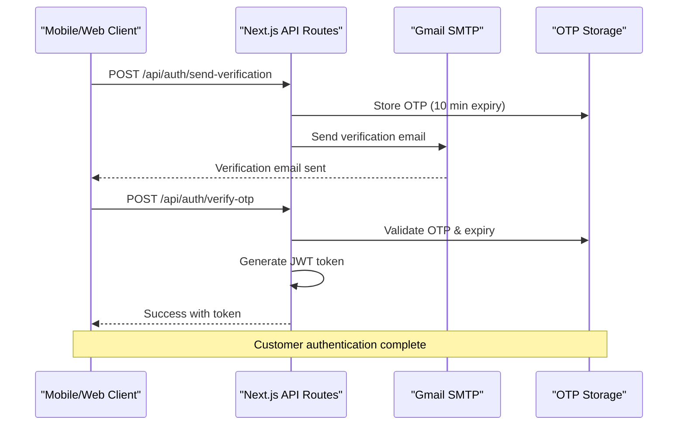
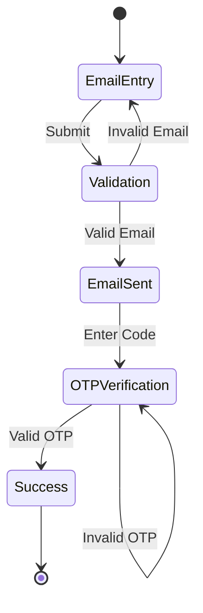

# Authentication API Documentation

<cite>
**Referenced Files in This Document**
- [src/app/api/auth/send-verification/route.ts](file://src/app/api/auth/send-verification/route.ts)
- [src/app/api/auth/verify-otp/route.ts](file://src/app/api/auth/verify-otp/route.ts)
- [src/app/api/restaurant/send-verification/route.ts](file://src/app/api/restaurant/send-verification/route.ts)
- [src/app/api/restaurant/verify-otp/route.ts](file://src/app/api/restaurant/verify-otp/route.ts)
- [src/components/pwa/email-verification-screen.tsx](file://src/components/pwa/email-verification-screen.tsx)
- [src/components/pwa/otp-verification-screen.tsx](file://src/components/pwa/otp-verification-screen.tsx)
- [src/components/restaurant/restaurant-otp-screen.tsx](file://src/components/restaurant/restaurant-otp-screen.tsx)
- [package.json](file://package.json)
</cite>

## Table of Contents
1. [Introduction](#introduction)
2. [Authentication Architecture](#authentication-architecture)
3. [Customer Authentication Endpoints](#customer-authentication-endpoints)
4. [Restaurant Authentication Endpoints](#restaurant-authentication-endpoints)
5. [Security Implementation](#security-implementation)
6. [Client-Side Implementation](#client-side-implementation)
7. [Error Handling](#error-handling)
8. [Rate Limiting and Security Policies](#rate-limiting-and-security-policies)
9. [Testing and Demo Mode](#testing-and-demo-mode)
10. [Best Practices](#best-practices)

## Introduction

MenuPRO-App implements a robust two-factor authentication system using email verification with OTP (One-Time Password) codes. The authentication system supports two distinct user types: customers who scan QR codes to access menus, and restaurant owners who manage their digital menus. This documentation covers the complete authentication flow, including API endpoints, security measures, and client-side implementation guidance.

The authentication system follows industry best practices with secure OTP generation, automatic cleanup of expired codes, and comprehensive error handling. All sensitive operations are protected with appropriate HTTP status codes and detailed error messages.

## Authentication Architecture

The authentication system is built on a serverless architecture using Next.js API routes. It employs a temporary in-memory storage mechanism for OTP codes during development, with recommendations for production deployment using Redis or database storage.



**Diagram sources**
- [src/app/api/auth/send-verification/route.ts](file://src/app/api/auth/send-verification/route.ts#L1-L98)
- [src/app/api/auth/verify-otp/route.ts](file://src/app/api/auth/verify-otp/route.ts#L1-L78)

**Section sources**
- [src/app/api/auth/send-verification/route.ts](file://src/app/api/auth/send-verification/route.ts#L1-L98)
- [src/app/api/auth/verify-otp/route.ts](file://src/app/api/auth/verify-otp/route.ts#L1-L78)
- [src/app/api/restaurant/send-verification/route.ts](file://src/app/api/restaurant/send-verification/route.ts#L1-L99)
- [src/app/api/restaurant/verify-otp/route.ts](file://src/app/api/restaurant/verify-otp/route.ts#L1-L83)

## Customer Authentication Endpoints

### POST /api/auth/send-verification

Sends a verification email containing a 6-digit OTP code to customer email addresses.

**HTTP Method:** POST  
**Content-Type:** application/json  
**Authorization:** Not required

#### Request Body Schema
```json
{
  "email": "string" // Required: Valid email address
}
```

#### Response Format
**Success (200):**
```json
{
  "message": "Verification email sent successfully"
}
```

**Error Responses:**
- **400 Bad Request:** `{ "message": "Email is required" }`
- **500 Internal Server Error:** `{ "message": "Failed to send verification email" }`

#### cURL Example
```bash
curl -X POST https://your-domain.com/api/auth/send-verification \
  -H "Content-Type: application/json" \
  -d '{"email": "customer@example.com"}'
```

### POST /api/auth/verify-otp

Verifies the OTP code sent to the customer's email and generates a JWT token upon successful verification.

**HTTP Method:** POST  
**Content-Type:** application/json  
**Authorization:** Not required

#### Request Body Schema
```json
{
  "email": "string", // Required: Email associated with OTP
  "otp": "string"    // Required: 6-digit verification code
}
```

#### Response Format
**Success (200):**
```json
{
  "message": "Email verified successfully",
  "token": "jwt_token_string_here",
  "user": {
    "email": "customer@example.com",
    "verified": true
  }
}
```

**Error Responses:**
- **400 Bad Request:** `{ "message": "Email and OTP are required" }`
- **400 Bad Request:** `{ "message": "No verification code found for this email" }`
- **400 Bad Request:** `{ "message": "Verification code has expired. Please request a new one." }`
- **400 Bad Request:** `{ "message": "Invalid verification code" }`
- **500 Internal Server Error:** `{ "message": "Failed to verify OTP" }`

#### cURL Example
```bash
curl -X POST https://your-domain.com/api/auth/verify-otp \
  -H "Content-Type: application/json" \
  -d '{"email": "customer@example.com", "otp": "123456"}'
```

**Section sources**
- [src/app/api/auth/send-verification/route.ts](file://src/app/api/auth/send-verification/route.ts#L1-L98)
- [src/app/api/auth/verify-otp/route.ts](file://src/app/api/auth/verify-otp/route.ts#L1-L78)

## Restaurant Authentication Endpoints

### POST /api/restaurant/send-verification

Sends a verification email containing a 6-digit OTP code to restaurant owner email addresses for account creation.

**HTTP Method:** POST  
**Content-Type:** application/json  
**Authorization:** Not required

#### Request Body Schema
```json
{
  "email": "string" // Required: Valid email address
}
```

#### Response Format
**Success (200):**
```json
{
  "message": "Verification email sent successfully"
}
```

**Error Responses:**
- **400 Bad Request:** `{ "message": "Email is required" }`
- **500 Internal Server Error:** `{ "message": "Failed to send verification email" }`

#### cURL Example
```bash
curl -X POST https://your-domain.com/api/restaurant/send-verification \
  -H "Content-Type: application/json" \
  -d '{"email": "owner@restaurant.com"}'
```

### POST /api/restaurant/verify-otp

Verifies the OTP code sent to the restaurant owner's email and generates a JWT token with extended expiration for restaurant accounts.

**HTTP Method:** POST  
**Content-Type:** application/json  
**Authorization:** Not required

#### Request Body Schema
```json
{
  "email": "string", // Required: Email associated with OTP
  "otp": "string"    // Required: 6-digit verification code
}
```

#### Response Format
**Success (200):**
```json
{
  "message": "Restaurant account verified successfully",
  "token": "jwt_token_string_here",
  "user": {
    "email": "owner@restaurant.com",
    "type": "restaurant",
    "verified": true
  }
}
```

**Error Responses:**
- **400 Bad Request:** `{ "message": "Email and OTP are required" }`
- **400 Bad Request:** `{ "message": "No verification code found for this email" }`
- **400 Bad Request:** `{ "message": "Verification code has expired. Please request a new one." }`
- **400 Bad Request:** `{ "message": "Invalid verification code" }`
- **500 Internal Server Error:** `{ "message": "Failed to verify OTP" }`

#### cURL Example
```bash
curl -X POST https://your-domain.com/api/restaurant/verify-otp \
  -H "Content-Type: application/json" \
  -d '{"email": "owner@restaurant.com", "otp": "123456"}'
```

**Section sources**
- [src/app/api/restaurant/send-verification/route.ts](file://src/app/api/restaurant/send-verification/route.ts#L1-L99)
- [src/app/api/restaurant/verify-otp/route.ts](file://src/app/api/restaurant/verify-otp/route.ts#L1-L83)

## Security Implementation

### OTP Generation and Storage

The system uses cryptographically secure random number generation for OTP creation:

```typescript
// Secure OTP generation
const otp = crypto.randomInt(100000, 999999).toString();
const expires = Date.now() + 10 * 60 * 1000; // 10 minutes
otpStore.set(email, { otp, expires });
```

### Token Generation and Expiration

**Customer Tokens:**
- JWT Secret: Environment variable or fallback to development key
- Expiration: 24 hours
- Payload includes: email, verified flag, issued-at timestamp

**Restaurant Tokens:**
- JWT Secret: Environment variable or fallback to development key
- Expiration: 7 days
- Additional payload field: type: "restaurant"

### Automatic Cleanup Mechanism

The system implements periodic cleanup of expired OTP entries:

```typescript
// Periodic cleanup every 5 minutes
setInterval(() => {
  const now = Date.now();
  for (const [email, data] of Array.from(otpStore.entries())) {
    if (data.expires < now) {
      otpStore.delete(email);
    }
  }
}, 5 * 60 * 1000);
```

**Section sources**
- [src/app/api/auth/send-verification/route.ts](file://src/app/api/auth/send-verification/route.ts#L8-L10)
- [src/app/api/auth/verify-otp/route.ts](file://src/app/api/auth/verify-otp/route.ts#L8-L10)
- [src/app/api/restaurant/send-verification/route.ts](file://src/app/api/restaurant/send-verification/route.ts#L8-L10)
- [src/app/api/restaurant/verify-otp/route.ts](file://src/app/api/restaurant/verify-otp/route.ts#L8-L10)

## Client-Side Implementation

### Email Verification Screen

The client-side implementation provides a seamless email verification experience with real-time validation and user feedback.



**Diagram sources**
- [src/components/pwa/email-verification-screen.tsx](file://src/components/pwa/email-verification-screen.tsx#L1-L194)
- [src/components/pwa/otp-verification-screen.tsx](file://src/components/pwa/otp-verification-screen.tsx#L1-L259)

### OTP Verification Components

Both customer and restaurant OTP screens share identical functionality but differ in branding and messaging:

**Key Features:**
- 6-digit numeric input with auto-focus navigation
- Paste support for clipboard integration
- Real-time validation and error messaging
- Countdown timer with automatic resend option
- Responsive design for mobile-first experience

**Implementation Details:**
```typescript
// OTP input handling with auto-focus
const handleOtpChange = (index: number, value: string) => {
  const newOtp = [...otp];
  newOtp[index] = value;
  setOtp(newOtp);
  
  // Auto-focus next input
  if (value && index < 5) {
    inputRefs.current[index + 1]?.focus();
  }
};
```

### Token Storage and Security

**Client-Side Security Measures:**
- JWT tokens stored securely in memory or encrypted local storage
- Automatic token refresh mechanisms for long sessions
- Proper CORS configuration and secure cookie settings
- XSS protection through proper input sanitization

**Section sources**
- [src/components/pwa/email-verification-screen.tsx](file://src/components/pwa/email-verification-screen.tsx#L1-L194)
- [src/components/pwa/otp-verification-screen.tsx](file://src/components/pwa/otp-verification-screen.tsx#L1-L259)
- [src/components/restaurant/restaurant-otp-screen.tsx](file://src/components/restaurant/restaurant-otp-screen.tsx#L1-L259)

## Error Handling

### Comprehensive Error Categories

The authentication system implements detailed error handling with appropriate HTTP status codes and descriptive messages:

**Validation Errors (400):**
- Missing required fields
- Invalid email format
- Malformed OTP codes

**Business Logic Errors (400):**
- No verification code found for email
- Expired verification code
- Invalid OTP code

**System Errors (500):**
- Email sending failures
- Database connectivity issues
- JWT generation errors

### Error Response Patterns

```typescript
// Standard error response pattern
return NextResponse.json(
  { message: 'Descriptive error message' },
  { status: 400 } // Appropriate HTTP status code
);
```

### Client-Side Error Handling

The client components implement robust error handling with user-friendly messaging:

```typescript
// Error state management
const [error, setError] = useState("");
const [isLoading, setIsLoading] = useState(false);

// Network error handling
try {
  // API call logic
} catch (error) {
  setError("Network error. Please try again.");
} finally {
  setIsLoading(false);
}
```

**Section sources**
- [src/app/api/auth/send-verification/route.ts](file://src/app/api/auth/send-verification/route.ts#L20-L25)
- [src/app/api/auth/verify-otp/route.ts](file://src/app/api/auth/verify-otp/route.ts#L15-L20)
- [src/app/api/restaurant/send-verification/route.ts](file://src/app/api/restaurant/send-verification/route.ts#L20-L25)
- [src/app/api/restaurant/verify-otp/route.ts](file://src/app/api/restaurant/verify-otp/route.ts#L15-L20)

## Rate Limiting and Security Policies

### OTP Expiration Policy

All OTP codes have strict expiration policies to enhance security:

- **Standard OTP Expiration:** 10 minutes from generation
- **Cleanup Interval:** 5-minute intervals for expired code removal
- **Automatic Cleanup:** Expired codes are immediately removed from storage

### Rate Limiting Implementation

While the current implementation uses in-memory storage, production deployments should implement rate limiting:

**Recommended Production Strategies:**
- IP-based rate limiting for verification requests
- Email-based rate limiting to prevent abuse
- CAPTCHA integration for high-volume requests
- Redis-based storage for distributed rate limiting

### Security Best Practices

**Development Environment:**
- Uses `Map` for in-memory OTP storage
- Implements automatic cleanup every 5 minutes
- Logs errors for debugging without exposing sensitive data

**Production Recommendations:**
- Replace `Map` with Redis or database storage
- Implement persistent rate limiting
- Add CAPTCHA for verification requests
- Monitor for suspicious activity patterns

**Section sources**
- [src/app/api/auth/send-verification/route.ts](file://src/app/api/auth/send-verification/route.ts#L8-L10)
- [src/app/api/auth/send-verification/route.ts](file://src/app/api/auth/send-verification/route.ts#L90-L98)
- [src/app/api/restaurant/send-verification/route.ts](file://src/app/api/restaurant/send-verification/route.ts#L8-L10)
- [src/app/api/restaurant/send-verification/route.ts](file://src/app/api/restaurant/send-verification/route.ts#L90-L99)

## Testing and Demo Mode

### Demo Mode Implementation

The system includes comprehensive demo mode functionality for testing purposes:

**Mock Verification Codes:**
- Accepts "123456" as valid OTP for both customer and restaurant verification
- Provides immediate success response without actual API calls
- Includes helpful hints for developers and testers

**Demo Mode Features:**
- Clear indication of demo mode status
- Helpful hints for testing different scenarios
- Immediate feedback without network latency
- Preserves full UI/UX experience for testing

### Testing Strategies

**Unit Testing Approach:**
- Test OTP generation and validation logic
- Verify email sending functionality
- Test JWT token generation and parsing
- Validate error handling scenarios

**Integration Testing:**
- Test complete authentication flows
- Verify client-server communication
- Test error scenarios and edge cases
- Validate security measures

**End-to-End Testing:**
- Test complete user journeys
- Verify UI/UX responsiveness
- Test cross-platform compatibility
- Validate accessibility features

**Section sources**
- [src/components/pwa/otp-verification-screen.tsx](file://src/components/pwa/otp-verification-screen.tsx#L100-L110)
- [src/components/restaurant/restaurant-otp-screen.tsx](file://src/components/restaurant/restaurant-otp-screen.tsx#L100-L110)

## Best Practices

### Development Guidelines

**Environment Configuration:**
- Use environment variables for sensitive configuration
- Implement proper secrets management
- Separate development and production configurations

**Code Organization:**
- Keep API routes focused and single-purpose
- Implement consistent error handling patterns
- Use TypeScript for type safety and better developer experience

**Security Implementation:**
- Never log sensitive data like OTP codes
- Implement proper CORS policies
- Use HTTPS for all authentication endpoints
- Regular security audits and updates

### Production Deployment

**Infrastructure Recommendations:**
- Use Redis for OTP storage in production
- Implement load balancers for high availability
- Configure proper SSL/TLS certificates
- Set up monitoring and alerting systems

**Monitoring and Maintenance:**
- Monitor authentication success/failure rates
- Track OTP expiration and cleanup effectiveness
- Implement logging for security events
- Regular security assessments and penetration testing

### Client-Side Implementation

**User Experience Guidelines:**
- Provide clear feedback for all actions
- Implement graceful error handling
- Design for accessibility and usability
- Optimize for mobile-first experiences

**Security Implementation:**
- Sanitize all user inputs
- Implement proper CSRF protection
- Use secure HTTP headers
- Regular security updates and patches

**Performance Optimization:**
- Minimize bundle sizes
- Implement lazy loading for components
- Optimize image assets
- Use efficient state management

**Section sources**
- [package.json](file://package.json#L1-L89)