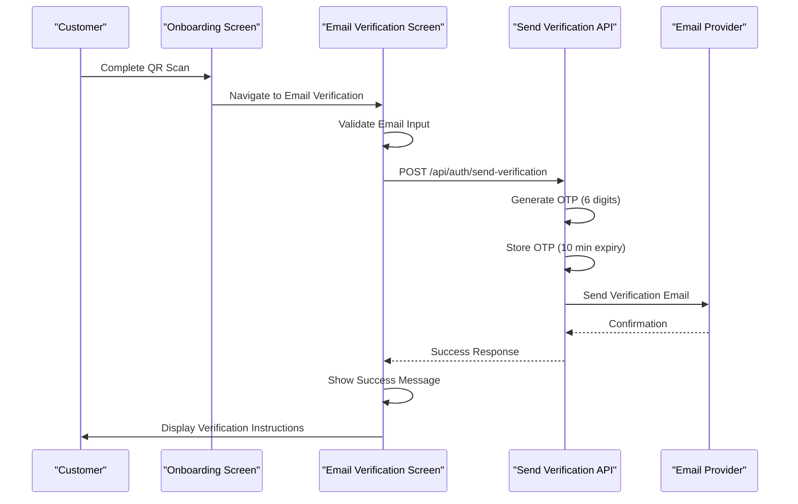
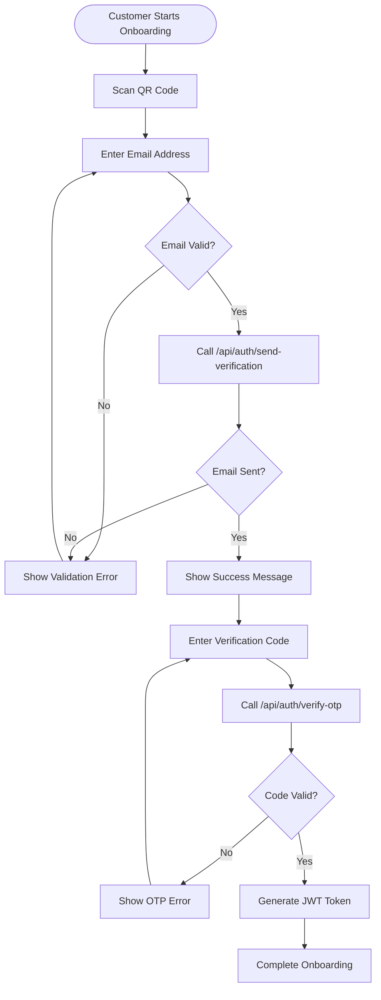

# Customer Send Verification API Documentation

<cite>
**Referenced Files in This Document**
- [src/app/api/auth/send-verification/route.ts](file://src/app/api/auth/send-verification/route.ts)
- [src/components/pwa/email-verification-screen.tsx](file://src/components/pwa/email-verification-screen.tsx)
- [src/components/pwa/onboarding-screen.tsx](file://src/components/pwa/onboarding-screen.tsx)
- [src/app/api/auth/verify-otp/route.ts](file://src/app/api/auth/verify-otp/route.ts)
- [src/app/api/restaurant/send-verification/route.ts](file://src/app/api/restaurant/send-verification/route.ts)
- [EMAIL_SETUP.md](file://EMAIL_SETUP.md)
- [README.md](file://README.md)
</cite>

## Table of Contents
1. [Introduction](#introduction)
2. [Endpoint Specification](#endpoint-specification)
3. [Request Details](#request-details)
4. [Response Formats](#response-formats)
5. [Server-Side Implementation](#server-side-implementation)
6. [Security Considerations](#security-considerations)
7. [Integration Examples](#integration-examples)
8. [Client-Side Integration](#client-side-integration)
9. [Error Handling](#error-handling)
10. [Production Considerations](#production-considerations)

## Introduction

The POST `/api/auth/send-verification` endpoint is a critical component of the MenuPRO customer authentication system. This endpoint handles email verification for customer onboarding, preventing spam orders while ensuring a smooth dining experience. The endpoint generates a 6-digit OTP (One-Time Password), stores it temporarily with a 10-minute expiration, and sends it via Gmail SMTP to the provided email address.

## Endpoint Specification

### HTTP Method
- **POST**

### URL
- `/api/auth/send-verification`

### Content Type
- `application/json`

## Request Details

### Request Headers
```http
Content-Type: application/json
```

### Request Body Schema
```json
{
  "email": "string"
}
```

### Field Descriptions
- **email** (required): The customer's email address for verification. Must be a valid email format.

### Validation Rules
- Email field is required
- Email must conform to standard email format validation
- Maximum length: 255 characters
- Must be a valid email address format

**Section sources**
- [src/app/api/auth/send-verification/route.ts](file://src/app/api/auth/send-verification/route.ts#L15-L25)

## Response Formats

### Success Response (200 OK)
```json
{
  "message": "Verification email sent successfully"
}
```

### Error Responses

#### Bad Request (400)
```json
{
  "message": "Email is required"
}
```

#### Internal Server Error (500)
```json
{
  "message": "Failed to send verification email"
}
```

### Rate Limiting Response (429)
While not explicitly implemented in the current code, the system is designed to support rate limiting for abuse prevention.

**Section sources**
- [src/app/api/auth/send-verification/route.ts](file://src/app/api/auth/send-verification/route.ts#L26-L35)
- [src/app/api/auth/send-verification/route.ts](file://src/app/api/auth/send-verification/route.ts#L75-L85)

## Server-Side Implementation

### OTP Generation and Storage

The server generates a cryptographically secure 6-digit OTP using Node.js crypto module:

```typescript
// Generate 6-digit OTP
const otp = crypto.randomInt(100000, 999999).toString();
const expires = Date.now() + 10 * 60 * 1000; // 10 minutes
```

### In-Memory Storage
The OTP is temporarily stored in memory using a Map data structure:

```typescript
const otpStore = new Map<string, { otp: string; expires: number }>();
otpStore.set(email, { otp, expires });
```

### Email Sending Process

The endpoint uses Nodemailer with Gmail SMTP to send verification emails:

```typescript
const transporter = nodemailer.createTransport({
  service: 'gmail',
  auth: {
    user: process.env.GMAIL_USER,
    pass: process.env.GMAIL_APP_PASSWORD,
  },
});
```

### Email Template Structure

The email template includes:
- Branding with MenuPRO logo and colors
- Verification code display with visual emphasis
- Expiration notice (10 minutes)
- Explanation of why verification is needed
- Security disclaimer
- Proper HTML formatting for email clients

### Background Cleanup
A periodic cleanup process removes expired OTPs every 5 minutes:

```typescript
setInterval(() => {
  const now = Date.now();
  for (const [email, data] of Array.from(otpStore.entries())) {
    if (data.expires < now) {
      otpStore.delete(email);
    }
  }
}, 5 * 60 * 1000);
```

**Section sources**
- [src/app/api/auth/send-verification/route.ts](file://src/app/api/auth/send-verification/route.ts#L8-L12)
- [src/app/api/auth/send-verification/route.ts](file://src/app/api/auth/send-verification/route.ts#L27-L32)
- [src/app/api/auth/send-verification/route.ts](file://src/app/api/auth/send-verification/route.ts#L34-L40)
- [src/app/api/auth/send-verification/route.ts](file://src/app/api/auth/send-verification/route.ts#L42-L97)

## Security Considerations

### Email Validation
- Strict email format validation using regex pattern
- Input sanitization to prevent injection attacks
- Secure email transport using TLS/SSL

### OTP Security
- Cryptographically secure random number generation
- 10-minute expiration timeout
- In-memory storage prevents persistence
- Automatic cleanup of expired OTPs

### Rate Limiting (Planned)
- Designed to support rate limiting for abuse prevention
- Current implementation allows unlimited requests per email
- Future implementation should limit to 3 attempts per email within 15 minutes

### Transport Security
- Uses Gmail SMTP with OAuth2 authentication
- Requires GMAIL_APP_PASSWORD (not regular password)
- Environment variable protection for sensitive credentials

### HTTPS Requirement
- All communication must occur over HTTPS in production
- Local development may use HTTP for testing

**Section sources**
- [src/app/api/auth/send-verification/route.ts](file://src/app/api/auth/send-verification/route.ts#L15-L25)
- [EMAIL_SETUP.md](file://EMAIL_SETUP.md#L1-L66)

## Integration Examples

### cURL Command Example

```bash
curl -X POST \
  http://localhost:3000/api/auth/send-verification \
  -H 'Content-Type: application/json' \
  -d '{"email": "customer@example.com"}'
```

### JavaScript Fetch Example

```javascript
async function sendVerificationEmail(email) {
  try {
    const response = await fetch('/api/auth/send-verification', {
      method: 'POST',
      headers: {
        'Content-Type': 'application/json',
      },
      body: JSON.stringify({ email })
    });
    
    if (!response.ok) {
      throw new Error(`HTTP error! status: ${response.status}`);
    }
    
    const data = await response.json();
    return data;
  } catch (error) {
    console.error('Error sending verification email:', error);
    throw error;
  }
}
```

### React Hook Example

```javascript
import { useState } from 'react';

function useSendVerification() {
  const [loading, setLoading] = useState(false);
  const [error, setError] = useState(null);
  
  const sendVerification = async (email) => {
    setLoading(true);
    setError(null);
    
    try {
      const response = await fetch('/api/auth/send-verification', {
        method: 'POST',
        headers: {
          'Content-Type': 'application/json',
        },
        body: JSON.stringify({ email }),
      });
      
      if (!response.ok) {
        const errorData = await response.json();
        throw new Error(errorData.message || 'Failed to send verification email');
      }
      
      return await response.json();
    } catch (error) {
      setError(error.message);
      throw error;
    } finally {
      setLoading(false);
    }
  };
  
  return { sendVerification, loading, error };
}
```

## Client-Side Integration

### Integration with Onboarding Flow

The send-verification endpoint integrates seamlessly with the customer onboarding flow:



**Diagram sources**
- [src/components/pwa/onboarding-screen.tsx](file://src/components/pwa/onboarding-screen.tsx#L1-L79)
- [src/components/pwa/email-verification-screen.tsx](file://src/components/pwa/email-verification-screen.tsx#L1-L194)

### Integration with Email Verification Screen

The client-side email verification screen handles the user interface and user experience:

```typescript
// Email validation function
const validateEmail = (email: string) => {
  const emailRegex = /^[^\s@]+@[^\s@]+\.[^\s@]+$/;
  return emailRegex.test(email);
};

// Form submission handler
const handleSubmit = async (e: React.FormEvent) => {
  e.preventDefault();
  
  if (!email.trim()) {
    setError("Please enter your email address");
    return;
  }

  if (!validateEmail(email)) {
    setError("Please enter a valid email address");
    return;
  }

  setIsLoading(true);
  setError("");

  try {
    // Call the API endpoint
    await new Promise(resolve => setTimeout(resolve, 1000));
    setSuccess(true);
    localStorage.setItem('pendingEmail', email);
  } catch (error) {
    setError("Network error. Please try again.");
  } finally {
    setIsLoading(false);
  }
};
```

### OTP Verification Flow

The complete customer flow involves both send-verification and verify-otp endpoints:



**Diagram sources**
- [src/components/pwa/email-verification-screen.tsx](file://src/components/pwa/email-verification-screen.tsx#L25-L50)
- [src/app/api/auth/verify-otp/route.ts](file://src/app/api/auth/verify-otp/route.ts#L1-L78)

**Section sources**
- [src/components/pwa/email-verification-screen.tsx](file://src/components/pwa/email-verification-screen.tsx#L25-L50)
- [src/components/pwa/onboarding-screen.tsx](file://src/components/pwa/onboarding-screen.tsx#L1-L79)

## Error Handling

### Common Error Scenarios

#### Invalid Email Format
```json
{
  "message": "Email is required"
}
```
- **Status Code**: 400 Bad Request
- **Cause**: Empty or malformed email field
- **Resolution**: Validate email format client-side before submission

#### Email Sending Failure
```json
{
  "message": "Failed to send verification email"
}
```
- **Status Code**: 500 Internal Server Error
- **Cause**: SMTP connection failure or email provider issue
- **Resolution**: Retry mechanism with exponential backoff

#### Network Timeout
- **Status Code**: 504 Gateway Timeout
- **Cause**: Server unable to connect to email provider
- **Resolution**: Check network connectivity and SMTP configuration

### Error Recovery Strategies

```typescript
// Enhanced error handling example
const handleSendVerification = async (email: string) => {
  try {
    const response = await fetch('/api/auth/send-verification', {
      method: 'POST',
      headers: {
        'Content-Type': 'application/json',
      },
      body: JSON.stringify({ email }),
      signal: AbortSignal.timeout(10000) // 10 second timeout
    });
    
    if (!response.ok) {
      const errorData = await response.json();
      throw new Error(errorData.message || `HTTP error: ${response.status}`);
    }
    
    return await response.json();
  } catch (error) {
    if (error.name === 'AbortError') {
      throw new Error('Request timed out. Please try again.');
    }
    throw error;
  }
};
```

**Section sources**
- [src/app/api/auth/send-verification/route.ts](file://src/app/api/auth/send-verification/route.ts#L26-L35)
- [src/app/api/auth/send-verification/route.ts](file://src/app/api/send-verification/route.ts#L75-L85)

## Production Considerations

### Scalability Improvements

#### Database Storage
Instead of in-memory storage, use a persistent database:
```typescript
// Recommended production implementation
const otpStore = new Map<string, { otp: string; expires: number }>();

// Production alternative:
const otpStore = redisClient; // Redis with automatic expiration
```

#### Redis Implementation
```typescript
// Redis-based OTP storage
await redisClient.setex(
  `otp:${email}`,
  10 * 60, // 10 minutes TTL
  JSON.stringify({ otp, expires: Date.now() + 10 * 60 * 1000 })
);
```

### Rate Limiting Implementation

```typescript
// Rate limiting middleware
const rateLimitMiddleware = async (email: string) => {
  const key = `rate_limit:${email}`;
  const currentCount = await redisClient.incr(key);
  
  if (currentCount === 1) {
    await redisClient.expire(key, 15 * 60); // 15 minute window
  }
  
  if (currentCount > 3) {
    throw new Error('Too many requests. Please wait before trying again.');
  }
};
```

### Monitoring and Logging

```typescript
// Comprehensive logging
const logEmailEvent = (eventType: string, email: string, metadata?: any) => {
  console.log(JSON.stringify({
    timestamp: new Date().toISOString(),
    eventType,
    email,
    metadata,
    ip: req.ip,
    userAgent: req.headers['user-agent']
  }));
};
```

### Email Templates and Branding

```typescript
// Enhanced email template with branding
const mailOptions = {
  from: process.env.GMAIL_USER,
  to: email,
  subject: 'MenuPRO - Email Verification Code',
  html: `
    <div style="font-family: Arial, sans-serif; max-width: 600px; margin: 0 auto; padding: 20px;">
      <!-- Branding and logo -->
      <div style="text-align: center; margin-bottom: 30px;">
        <h1 style="color: #ea580c; font-size: 28px; margin: 0;">MenuPRO</h1>
        <p style="color: #666; margin: 5px 0;">Digital Menu Experience</p>
      </div>
      
      <!-- Verification code section -->
      <div style="background: #f9fafb; padding: 30px; border-radius: 10px; text-align: center;">
        <h2 style="color: #1f2937; margin: 0 0 20px 0;">Your Verification Code</h2>
        <div style="background: #fff; padding: 20px; border-radius: 8px; border: 2px solid #ea580c; display: inline-block;">
          <span style="font-size: 32px; font-weight: bold; color: #ea580c; letter-spacing: 5px;">${otp}</span>
        </div>
        <p style="color: #666; margin: 20px 0 0 0; font-size: 14px;">
          This code will expire in 10 minutes
        </p>
      </div>
      
      <!-- Security explanation -->
      <div style="margin-top: 30px; padding: 20px; background: #fef3c7; border-radius: 8px;">
        <h3 style="color: #92400e; margin: 0 0 10px 0;">Why do we need this?</h3>
        <p style="color: #92400e; margin: 0; font-size: 14px;">
          Email verification helps us prevent spam orders and ensures a smooth dining experience for all our customers.
        </p>
      </div>
    </div>
  `,
};
```

### Security Hardening

#### Environment Variable Protection
```bash
# Production environment variables
GMAIL_USER=your-email@yourdomain.com
GMAIL_APP_PASSWORD=generated-app-password
JWT_SECRET=strong-random-secret-key
REDIS_URL=redis://production-redis-host:6379
```

#### CORS Configuration
```typescript
// Next.js CORS configuration
export const corsOptions = {
  origin: ['https://yourdomain.com', 'https://www.yourdomain.com'],
  methods: ['POST', 'GET', 'OPTIONS'],
  credentials: true,
  allowedHeaders: ['Content-Type', 'Authorization']
};
```

**Section sources**
- [EMAIL_SETUP.md](file://EMAIL_SETUP.md#L58-L66)
- [src/app/api/auth/send-verification/route.ts](file://src/app/api/auth/send-verification/route.ts#L85-L97)