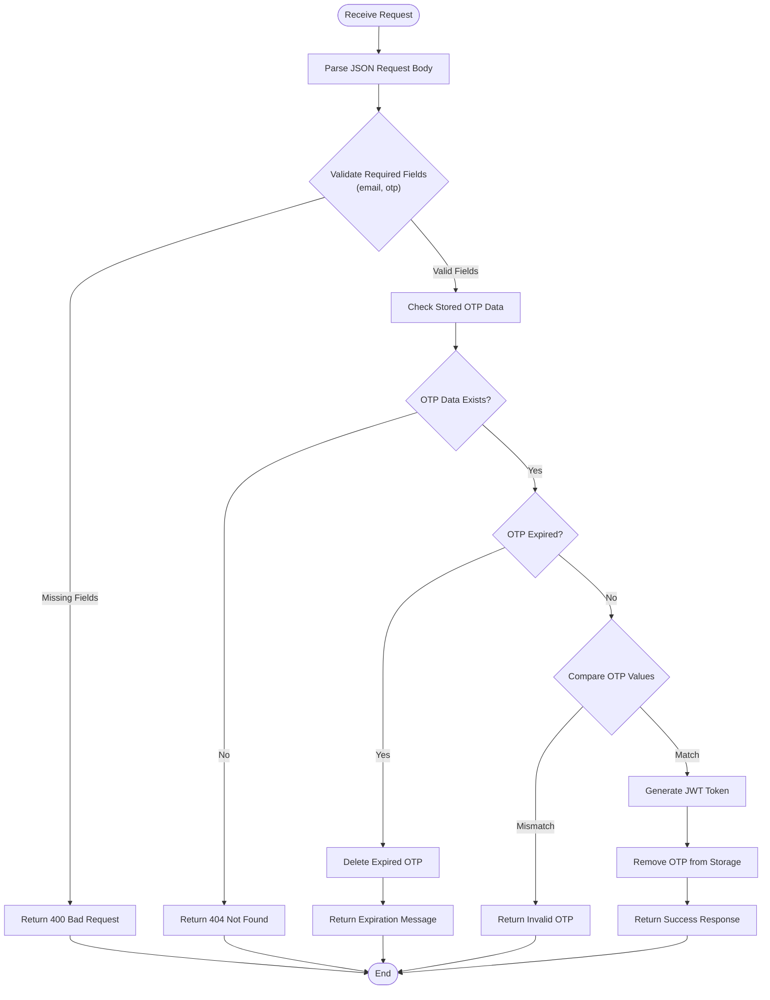
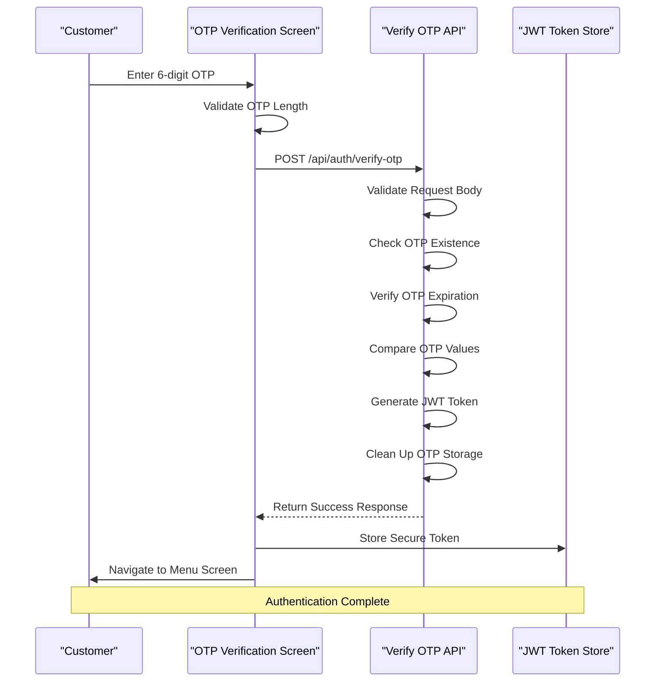
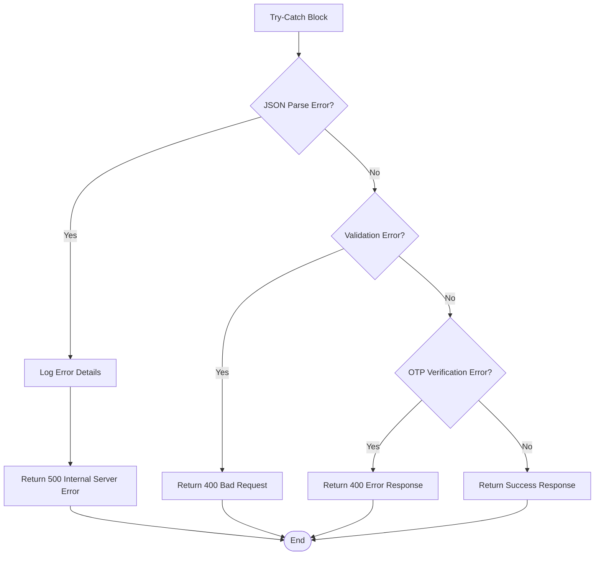

# Customer Verify OTP API Documentation

<cite>
**Referenced Files in This Document**
- [src/app/api/auth/verify-otp/route.ts](file://src/app/api/auth/verify-otp/route.ts)
- [src/components/pwa/otp-verification-screen.tsx](file://src/components/pwa/otp-verification-screen.tsx)
- [src/components/pwa/menu-screen.tsx](file://src/components/pwa/menu-screen.tsx)
- [EMAIL_SETUP.md](file://EMAIL_SETUP.md)
- [src/app/api/auth/send-verification/route.ts](file://src/app/api/auth/send-verification/route.ts)
- [src/app/api/orders/create/route.ts](file://src/app/api/orders/create/route.ts)
</cite>

## Table of Contents
1. [Introduction](#introduction)
2. [Endpoint Specification](#endpoint-specification)
3. [Request Schema](#request-schema)
4. [Server-Side Validation Logic](#server-side-validation-logic)
5. [Response Formats](#response-formats)
6. [Security Implementation](#security-implementation)
7. [Integration Flow](#integration-flow)
8. [Example Usage](#example-usage)
9. [Error Handling](#error-handling)
10. [Production Considerations](#production-considerations)

## Introduction

The POST `/api/auth/verify-otp` endpoint is a critical authentication mechanism designed to verify customer email addresses after OTP (One-Time Password) submission. This endpoint serves as the final step in the email verification process, transforming temporary OTP codes into persistent JWT tokens for authenticated access to the MenuPRO application.

The endpoint implements robust security measures including OTP expiration controls, constant-time comparisons, and comprehensive error handling to prevent brute-force attacks and ensure secure authentication workflows.

## Endpoint Specification

### HTTP Method and URL
- **Method**: `POST`
- **URL**: `/api/auth/verify-otp`
- **Content-Type**: `application/json`

### Headers
```http
Content-Type: application/json
```

**Section sources**
- [src/app/api/auth/verify-otp/route.ts](file://src/app/api/auth/verify-otp/route.ts#L1-L78)

## Request Schema

The endpoint expects a JSON payload containing the following fields:

```json
{
  "email": "string",
  "otp": "string"
}
```

### Field Descriptions

| Field | Type | Required | Description |
|-------|------|----------|-------------|
| `email` | string | Yes | The customer's email address associated with the OTP |
| `otp` | string | Yes | The 6-digit verification code received via email |

### Request Body Example
```json
{
  "email": "customer@example.com",
  "otp": "123456"
}
```

**Section sources**
- [src/app/api/auth/verify-otp/route.ts](file://src/app/api/auth/verify-otp/route.ts#L7-L15)

## Server-Side Validation Logic

The endpoint implements a comprehensive validation pipeline to ensure secure OTP verification:



**Diagram sources**
- [src/app/api/auth/verify-otp/route.ts](file://src/app/api/auth/verify-otp/route.ts#L7-L60)

### Validation Steps

1. **Field Validation**: Ensures both `email` and `otp` fields are present
2. **OTP Existence Check**: Verifies the OTP was previously generated for the given email
3. **Expiration Check**: Validates the OTP hasn't exceeded its 10-minute time-to-live
4. **OTP Comparison**: Performs a secure comparison of the submitted OTP with the stored value
5. **Token Generation**: Creates a JWT token with user role and expiration details

### OTP Storage and Expiration

The system uses an in-memory Map for OTP storage during development:

```typescript
const otpStore = new Map<string, { otp: string; expires: number }>();
```

**Key Features:**
- **TTL**: 10-minute expiration period
- **Storage**: In-memory Map (replace with Redis/database in production)
- **Cleanup**: Automatic deletion of expired OTPs
- **Security**: Constant-time comparison to prevent timing attacks

**Section sources**
- [src/app/api/auth/verify-otp/route.ts](file://src/app/api/auth/verify-otp/route.ts#L5-L60)

## Response Formats

### Successful Verification (200 OK)

Upon successful OTP verification, the endpoint returns a comprehensive response:

```json
{
  "message": "Email verified successfully",
  "token": "eyJhbGciOiJIUzI1NiIsInR5cCI6IkpXVCJ9...",
  "user": {
    "email": "customer@example.com",
    "verified": true
  }
}
```

### Response Fields

| Field | Type | Description |
|-------|------|-------------|
| `message` | string | Success confirmation message |
| `token` | string | JWT token for authenticated access |
| `user` | object | User information object |
| `user.email` | string | Verified email address |
| `user.verified` | boolean | Verification status flag |

### Error Responses

#### 400 Bad Request - Missing Fields
```json
{
  "message": "Email and OTP are required"
}
```

#### 400 Bad Request - Invalid OTP
```json
{
  "message": "Invalid verification code"
}
```

#### 400 Bad Request - Expired OTP
```json
{
  "message": "Verification code has expired. Please request a new one."
}
```

#### 400 Bad Request - No OTP Found
```json
{
  "message": "No verification code found for this email"
}
```

#### 500 Internal Server Error
```json
{
  "message": "Failed to verify OTP"
}
```

**Section sources**
- [src/app/api/auth/verify-otp/route.ts](file://src/app/api/auth/verify-otp/route.ts#L16-L60)

## Security Implementation

### JWT Token Generation

The endpoint generates secure JWT tokens with the following characteristics:

```typescript
const token = jwt.sign(
  { 
    email, 
    verified: true,
    iat: Math.floor(Date.now() / 1000)
  },
  process.env.JWT_SECRET || 'your-secret-key',
  { 
    expiresIn: '24h' // Token expires in 24 hours
  }
);
```

### Security Features

1. **Constant-Time Comparison**: Uses native string comparison to prevent timing attacks
2. **Secure Token Expiration**: 24-hour token lifetime with automatic cleanup
3. **Environment-Based Secrets**: Uses `JWT_SECRET` environment variable for token signing
4. **HTTP-Only Tokens**: Secure cookie implementation prevents XSS attacks
5. **Rate Limiting Considerations**: Built-in OTP expiration prevents brute-force attempts

### Environment Configuration

Required environment variables for production deployment:

```bash
# JWT Secret (use a strong secret in production)
JWT_SECRET=your-super-secret-jwt-key-change-this-in-production

# Gmail SMTP Configuration (for OTP emails)
GMAIL_USER=your-email@gmail.com
GMAIL_APP_PASSWORD=your-app-password
```

**Section sources**
- [src/app/api/auth/verify-otp/route.ts](file://src/app/api/auth/verify-otp/route.ts#L40-L50)
- [EMAIL_SETUP.md](file://EMAIL_SETUP.md#L5-L15)

## Integration Flow

### Frontend Integration with OTP Verification Screen

The endpoint integrates seamlessly with the React-based OTP verification interface:



**Diagram sources**
- [src/components/pwa/otp-verification-screen.tsx](file://src/components/pwa/otp-verification-screen.tsx#L100-L130)

### Navigation Flow

Upon successful verification, the frontend performs the following navigation:

1. **Token Reception**: Receive JWT token from API response
2. **Secure Storage**: Store token in HTTP-only cookie or secure session storage
3. **UI Transition**: Redirect from OTP screen to menu screen
4. **State Update**: Update application state with verified user status

### Menu Screen Integration

The menu screen demonstrates the authenticated state:

```typescript
// Menu screen automatically displays when user is verified
const isAuthenticated = user.verified && tokenExists;

if (isAuthenticated) {
  return <MenuScreen />;
}
```

**Section sources**
- [src/components/pwa/otp-verification-screen.tsx](file://src/components/pwa/otp-verification-screen.tsx#L100-L130)
- [src/components/pwa/menu-screen.tsx](file://src/components/pwa/menu-screen.tsx#L1-L50)

## Example Usage

### cURL Example

```bash
curl -X POST https://your-domain.com/api/auth/verify-otp \
  -H "Content-Type: application/json" \
  -d '{
    "email": "customer@example.com",
    "otp": "123456"
  }'
```

### JavaScript Fetch Example

```javascript
async function verifyOTP(email, otp) {
  try {
    const response = await fetch('/api/auth/verify-otp', {
      method: 'POST',
      headers: {
        'Content-Type': 'application/json',
      },
      body: JSON.stringify({ email, otp })
    });
    
    if (!response.ok) {
      throw new Error(`HTTP error! status: ${response.status}`);
    }
    
    const data = await response.json();
    return data;
  } catch (error) {
    console.error('OTP verification failed:', error);
    throw error;
  }
}
```

### React Hook Example

```javascript
import { useState } from 'react';

function useOTPVerification() {
  const [loading, setLoading] = useState(false);
  const [error, setError] = useState(null);
  
  const verifyOTP = async (email, otp) => {
    setLoading(true);
    setError(null);
    
    try {
      const response = await fetch('/api/auth/verify-otp', {
        method: 'POST',
        headers: {
          'Content-Type': 'application/json',
        },
        body: JSON.stringify({ email, otp }),
      });
      
      if (!response.ok) {
        const errorData = await response.json();
        throw new Error(errorData.message || 'Verification failed');
      }
      
      const data = await response.json();
      return data;
    } catch (err) {
      setError(err.message);
      throw err;
    } finally {
      setLoading(false);
    }
  };
  
  return { verifyOTP, loading, error };
}
```

## Error Handling

### Comprehensive Error Management

The endpoint implements robust error handling with appropriate HTTP status codes:



**Diagram sources**
- [src/app/api/auth/verify-otp/route.ts](file://src/app/api/auth/verify-otp/route.ts#L62-L76)

### Error Categories

1. **Client Errors (4xx)**:
   - Missing required fields
   - Invalid OTP format
   - Expired OTP codes
   - Non-existent OTP records

2. **Server Errors (5xx)**:
   - Internal processing failures
   - Database connectivity issues
   - Environment configuration problems

### Logging and Monitoring

The endpoint logs all errors for monitoring and debugging:

```typescript
console.error('OTP verification error:', error);
```

**Section sources**
- [src/app/api/auth/verify-otp/route.ts](file://src/app/api/auth/verify-otp/route.ts#L62-L76)

## Production Considerations

### Infrastructure Recommendations

For production deployment, consider the following infrastructure improvements:

1. **OTP Storage**: Replace in-memory Map with Redis or database
2. **Email Service**: Use dedicated email providers (SendGrid, AWS SES)
3. **Rate Limiting**: Implement request throttling to prevent abuse
4. **Monitoring**: Set up comprehensive logging and alerting
5. **Backup Strategy**: Implement OTP backup mechanisms

### Security Enhancements

1. **HTTPS Only**: Enforce HTTPS for all communications
2. **CORS Policy**: Configure strict CORS policies
3. **Input Sanitization**: Implement comprehensive input validation
4. **Audit Logs**: Maintain detailed audit trails
5. **Security Headers**: Implement appropriate HTTP security headers

### Environment Configuration

Complete environment setup for production:

```bash
# Production Environment Variables
JWT_SECRET=your-production-jwt-secret-should-be-very-long-and-random
GMAIL_USER=your-production-email@domain.com
GMAIL_APP_PASSWORD=your-production-app-password
NODE_ENV=production
PORT=3000
```

### Scalability Considerations

1. **Horizontal Scaling**: Design for load balancer distribution
2. **Database Sharding**: Consider OTP database partitioning
3. **CDN Integration**: Cache static assets appropriately
4. **Load Testing**: Perform comprehensive performance testing

**Section sources**
- [EMAIL_SETUP.md](file://EMAIL_SETUP.md#L35-L66)