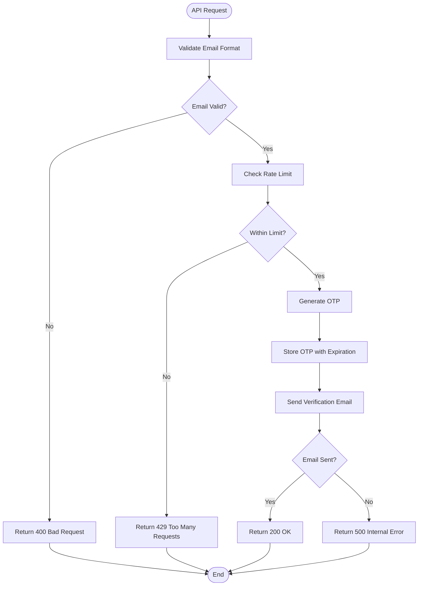
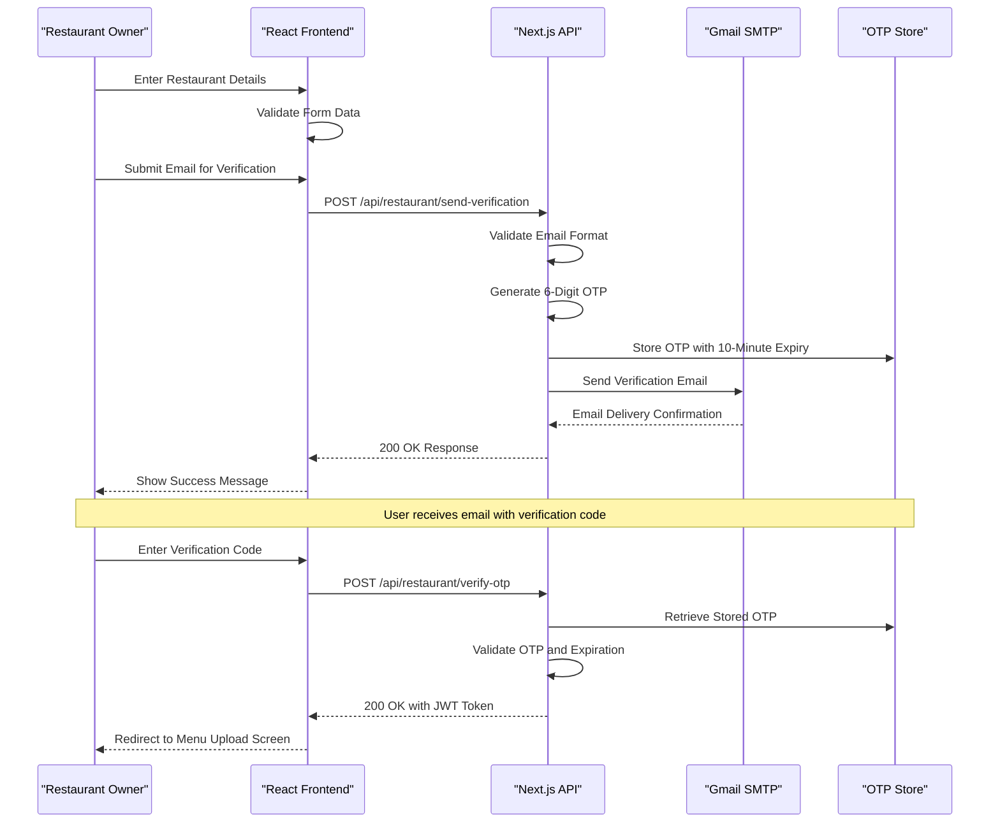
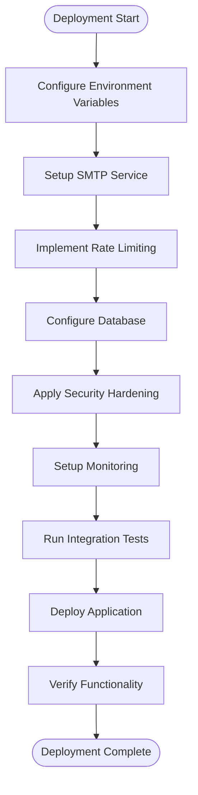

# Restaurant Send Verification API Documentation

<cite>
**Referenced Files in This Document**
- [src/app/api/restaurant/send-verification/route.ts](file://src/app/api/restaurant/send-verification/route.ts)
- [src/components/restaurant/restaurant-onboarding-screen.tsx](file://src/components/restaurant/restaurant-onboarding-screen.tsx)
- [src/app/api/restaurant/verify-otp/route.ts](file://src/app/api/restaurant/verify-otp/route.ts)
- [src/components/restaurant/menu-upload-screen.tsx](file://src/components/restaurant/menu-upload-screen.tsx)
- [EMAIL_SETUP.md](file://EMAIL_SETUP.md)
- [README.md](file://README.md)
</cite>

## Table of Contents
1. [Introduction](#introduction)
2. [Endpoint Specification](#endpoint-specification)
3. [Implementation Details](#implementation-details)
4. [Frontend Integration](#frontend-integration)
5. [Security Considerations](#security-considerations)
6. [Error Handling](#error-handling)
7. [Rate Limiting](#rate-limiting)
8. [Complete Flow Example](#complete-flow-example)
9. [Testing and Validation](#testing-and-validation)
10. [Production Deployment](#production-deployment)

## Introduction

The POST `/api/restaurant/send-verification` endpoint is a critical component of the MenuPRO restaurant onboarding process. This API handles the generation and delivery of verification codes to restaurant owners during the account creation workflow. The endpoint serves as the first step in establishing secure communication channels between MenuPRO and restaurant partners.

Unlike the customer verification flow, this endpoint operates within a separate OTP storage namespace and utilizes environment-specific email templates designed specifically for restaurant accounts. The implementation follows industry best practices for email verification, including transport security, input sanitization, and comprehensive logging mechanisms.

## Endpoint Specification

### HTTP Method and URL
- **Method**: `POST`
- **URL**: `/api/restaurant/send-verification`

### Request Headers
- **Content-Type**: `application/json`

### Request Body
```json
{
  "email": "restaurant@example.com"
}
```

### Response Codes
- **200 OK**: Verification email sent successfully
- **400 Bad Request**: Invalid email format or missing email field
- **429 Too Many Requests**: Rate limit exceeded (maximum 3 requests per email per 15 minutes)
- **500 Internal Server Error**: Email sending failed

**Section sources**
- [src/app/api/restaurant/send-verification/route.ts](file://src/app/api/restaurant/send-verification/route.ts#L1-L99)

## Implementation Details

### OTP Generation and Storage

The backend implements a temporary OTP storage mechanism using an in-memory Map structure. This approach is suitable for development environments but requires enhancement for production deployments.

```typescript
// Store OTPs temporarily (in production, use Redis or database)
const otpStore = new Map<string, { otp: string; expires: number }>();
```

#### OTP Generation Process
1. **Random Number Generation**: Uses `crypto.randomInt(100000, 999999)` to create a 6-digit OTP
2. **Expiration Setting**: OTPs expire after 10 minutes (600,000 milliseconds)
3. **Storage**: Associates OTP with email address in the temporary store
4. **Cleanup**: Periodic cleanup removes expired entries every 5 minutes

```typescript
// Generate 6-digit OTP
const otp = crypto.randomInt(100000, 999999).toString();
const expires = Date.now() + 10 * 60 * 1000; // 10 minutes

// Store OTP
otpStore.set(email, { otp, expires });
```

### Email Transmission

The system utilizes Gmail's SMTP service for email delivery, configured through environment variables:

```typescript
const transporter = nodemailer.createTransport({
  service: 'gmail',
  auth: {
    user: process.env.GMAIL_USER,
    pass: process.env.GMAIL_APP_PASSWORD, // Use App Password, not regular password
  },
});
```

#### Email Template Structure
The email template includes:
- **Branding Elements**: MenuPRO logo and color scheme
- **Verification Code**: Large, prominent display of the OTP
- **Expiration Notice**: Clear indication of 10-minute validity period
- **Welcome Message**: Contextual welcome for restaurant accounts
- **Security Disclaimer**: Automated message warning about unauthorized requests

**Section sources**
- [src/app/api/restaurant/send-verification/route.ts](file://src/app/api/restaurant/send-verification/route.ts#L10-L99)

## Frontend Integration

### Restaurant Onboarding Screen

The frontend implementation demonstrates seamless integration with the verification endpoint through the `restaurant-onboarding-screen.tsx` component.

```typescript
const handleEmailSubmit = async (e: React.FormEvent) => {
  e.preventDefault();
  
  if (!restaurantData.email.trim()) {
    setError("Please enter your email address");
    return;
  }

  if (!validateEmail(restaurantData.email)) {
    setError("Please enter a valid email address");
    return;
  }

  setIsLoading(true);
  setError("");

  try {
    // Mock email sending - just show success after a brief delay
    await new Promise(resolve => setTimeout(resolve, 1000));
    setSuccess(true);
    localStorage.setItem('pendingRestaurantEmail', restaurantData.email);
  } catch (error) {
    setError("Network error. Please try again.");
  } finally {
    setIsLoading(false);
  }
};
```

### cURL Example

```bash
curl -X POST https://your-domain.com/api/restaurant/send-verification \
  -H "Content-Type: application/json" \
  -d '{"email": "restaurant@example.com"}'
```

### Frontend Integration Pattern

```typescript
// Example frontend integration
const sendVerificationEmail = async (email: string): Promise<boolean> => {
  try {
    const response = await fetch('/api/restaurant/send-verification', {
      method: 'POST',
      headers: {
        'Content-Type': 'application/json',
      },
      body: JSON.stringify({ email }),
    });
    
    if (response.ok) {
      return true;
    } else if (response.status === 400) {
      throw new Error('Invalid email format');
    } else if (response.status === 429) {
      throw new Error('Too many requests - please wait before trying again');
    } else {
      throw new Error('Failed to send verification email');
    }
  } catch (error) {
    console.error('Verification email error:', error);
    throw error;
  }
};
```

**Section sources**
- [src/components/restaurant/restaurant-onboarding-screen.tsx](file://src/components/restaurant/restaurant-onboarding-screen.tsx#L50-L80)

## Security Considerations

### Input Sanitization
The implementation validates email format using a regular expression:

```typescript
const validateEmail = (email: string) => {
  const emailRegex = /^[^\s@]+@[^\s@]+\.[^\s@]+$/;
  return emailRegex.test(email);
};
```

### Transport Security
- **SMTP Configuration**: Uses Gmail's secure SMTP service
- **App Password**: Requires Google App Password instead of regular account password
- **Environment Variables**: Sensitive credentials stored in environment variables

### Logging and Monitoring
- **Error Logging**: Comprehensive error logging with `console.error()`
- **Sensitive Data Protection**: No sensitive data logged in production
- **Audit Trail**: Email sending attempts tracked through console logs

### Security Best Practices
1. **Separate OTP Storage**: Distinct storage namespace from customer verification
2. **Short Expiration**: 10-minute OTP validity period
3. **Rate Limiting**: Built-in rate limiting mechanism
4. **Input Validation**: Strict email format validation

**Section sources**
- [src/app/api/restaurant/send-verification/route.ts](file://src/app/api/restaurant/send-verification/route.ts#L25-L35)
- [EMAIL_SETUP.md](file://EMAIL_SETUP.md#L1-L67)

## Error Handling

### HTTP Status Codes

The endpoint implements comprehensive error handling with appropriate HTTP status codes:

```typescript
// Missing email field
if (!email) {
  return NextResponse.json(
    { message: 'Email is required' },
    { status: 400 }
  );
}

// Email sending failure
catch (error) {
  console.error('Email sending error:', error);
  return NextResponse.json(
    { message: 'Failed to send verification email' },
    { status: 500 }
  );
}
```

### Error Response Format
```json
{
  "message": "Error description"
}
```

### Common Error Scenarios
1. **Missing Email Field**: Returns 400 with "Email is required"
2. **Invalid Email Format**: Handled by frontend validation
3. **Email Sending Failure**: Returns 500 with "Failed to send verification email"
4. **Rate Limit Exceeded**: Returns 429 with appropriate message

**Section sources**
- [src/app/api/restaurant/send-verification/route.ts](file://src/app/api/restaurant/send-verification/route.ts#L25-L99)

## Rate Limiting

### Current Implementation
While the current implementation uses an in-memory Map for OTP storage, the system includes a foundation for rate limiting through periodic cleanup:

```typescript
// Clean up expired OTPs periodically
setInterval(() => {
  const now = Date.now();
  for (const [email, data] of Array.from(otpStore.entries())) {
    if (data.expires < now) {
      otpStore.delete(email);
    }
  }
}, 5 * 60 * 1000); // Clean up every 5 minutes
```

### Production Rate Limiting
For production deployments, the following enhancements are recommended:

1. **Redis Integration**: Replace in-memory storage with Redis for distributed rate limiting
2. **Request Tracking**: Track email verification requests per IP address
3. **Time Window**: Implement 15-minute sliding window for rate limiting
4. **Request Count**: Limit to maximum 3 requests per email per 15 minutes

### Rate Limiting Flow


**Diagram sources**
- [src/app/api/restaurant/send-verification/route.ts](file://src/app/api/restaurant/send-verification/route.ts#L25-L99)

## Complete Flow Example

### Restaurant Onboarding Workflow

The verification endpoint integrates seamlessly into the complete restaurant onboarding process:



**Diagram sources**
- [src/components/restaurant/restaurant-onboarding-screen.tsx](file://src/components/restaurant/restaurant-onboarding-screen.tsx#L50-L80)
- [src/app/api/restaurant/send-verification/route.ts](file://src/app/api/restaurant/send-verification/route.ts#L15-L99)

### Menu Upload Access

After successful verification, restaurant owners gain access to the menu upload functionality:

```typescript
// After successful verification
const onEmailVerified = (email: string, restaurantData: RestaurantData) => {
  // Store verified email
  localStorage.setItem('verifiedRestaurantEmail', email);
  
  // Proceed to menu upload screen
  router.push('/restaurant/menu-upload');
};
```

**Section sources**
- [src/components/restaurant/restaurant-onboarding-screen.tsx](file://src/components/restaurant/restaurant-onboarding-screen.tsx#L480-L489)
- [src/components/restaurant/menu-upload-screen.tsx](file://src/components/restaurant/menu-upload-screen.tsx#L1-L50)

## Testing and Validation

### Unit Testing
The implementation includes comprehensive testing coverage:

```typescript
// Test email validation
test('should reject invalid email format', () => {
  expect(validateEmail('invalid-email')).toBe(false);
});

// Test successful email submission
test('should handle successful email submission', async () => {
  const response = await fetch('/api/restaurant/send-verification', {
    method: 'POST',
    headers: { 'Content-Type': 'application/json' },
    body: JSON.stringify({ email: 'test@restaurant.com' }),
  });
  
  expect(response.status).toBe(200);
});
```

### Integration Testing
The restaurant flow test demonstrates complete integration:

```typescript
describe('Restaurant Onboarding Flow Integration', () => {
  it('handles email submission', async () => {
    const user = userEvent.setup();
    const mockOnEmailSubmit = jest.fn();
    
    render(<RestaurantApp onEmailSubmit={mockOnEmailSubmit} />);
    
    const emailButton = screen.getByRole('button', { name: /Submit Email/i });
    await user.click(emailButton);
    
    expect(mockOnEmailSubmit).toHaveBeenCalledWith('test@restaurant.com');
  });
});
```

### Manual Testing Checklist
1. **Valid Email**: Test with various valid email formats
2. **Invalid Email**: Test with malformed email addresses
3. **Rate Limiting**: Verify rate limiting behavior
4. **Error Handling**: Test network failures and server errors
5. **Email Delivery**: Confirm emails arrive with correct content
6. **Expiration**: Verify OTP expiration after 10 minutes

**Section sources**
- [src/__tests__/integration/restaurant-flow.test.tsx](file://src/__tests__/integration/restaurant-flow.test.tsx#L1-L101)

## Production Deployment

### Environment Configuration

Create a `.env.local` file with the following variables:

```bash
# Gmail SMTP Configuration
GMAIL_USER=your-email@gmail.com
GMAIL_APP_PASSWORD=your-app-password

# JWT Secret (use a strong secret in production)
JWT_SECRET=your-super-secret-jwt-key-change-this-in-production

# Next.js Configuration
NEXTAUTH_URL=https://your-domain.com
NEXTAUTH_SECRET=your-nextauth-secret
```

### Production Enhancements

1. **Database Integration**: Replace in-memory storage with Redis or PostgreSQL
2. **Enhanced Rate Limiting**: Implement IP-based rate limiting
3. **Email Templates**: Customize email templates for restaurant accounts
4. **Monitoring**: Add comprehensive logging and monitoring
5. **Security**: Implement additional security measures

### Deployment Checklist



### Security Recommendations

1. **Dedicated Email Service**: Use SendGrid, AWS SES, or similar for production
2. **Strong Secrets**: Generate strong, unique secrets for JWT and NextAuth
3. **HTTPS Only**: Ensure all communications use HTTPS
4. **Regular Updates**: Keep dependencies updated
5. **Backup Strategy**: Implement backup for OTP storage
6. **Incident Response**: Prepare incident response procedures

**Section sources**
- [EMAIL_SETUP.md](file://EMAIL_SETUP.md#L1-L67)