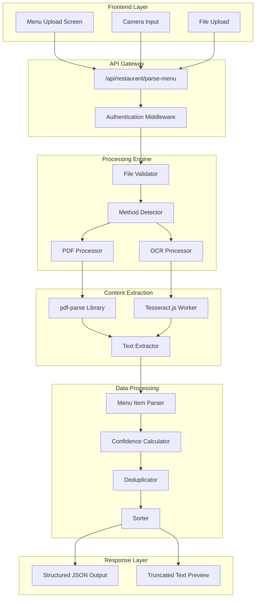
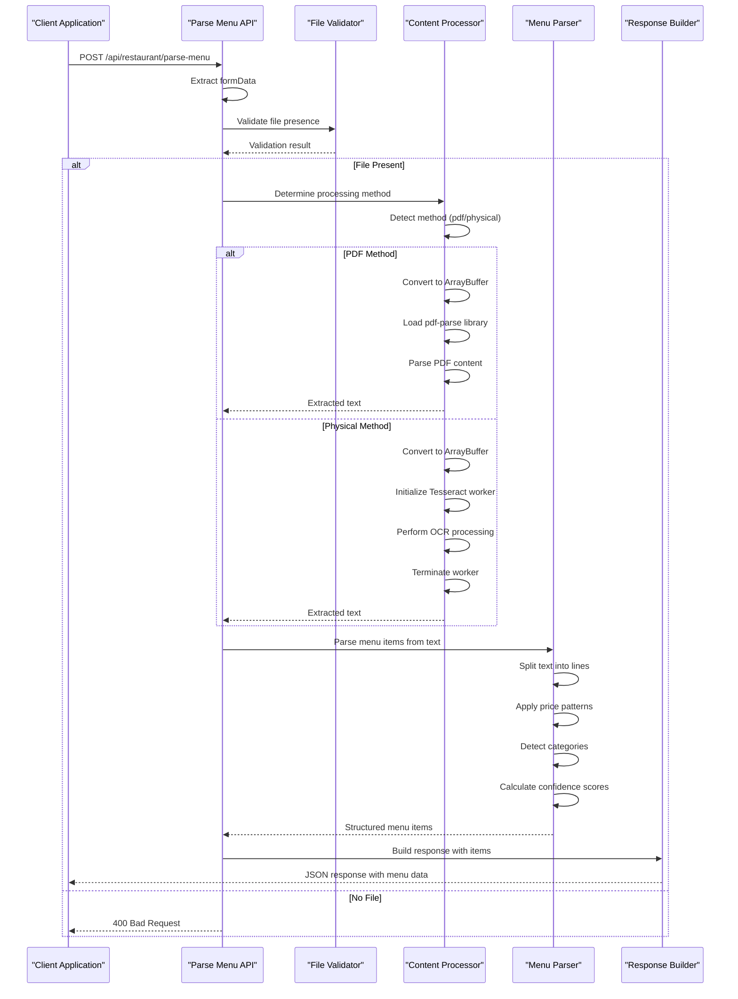
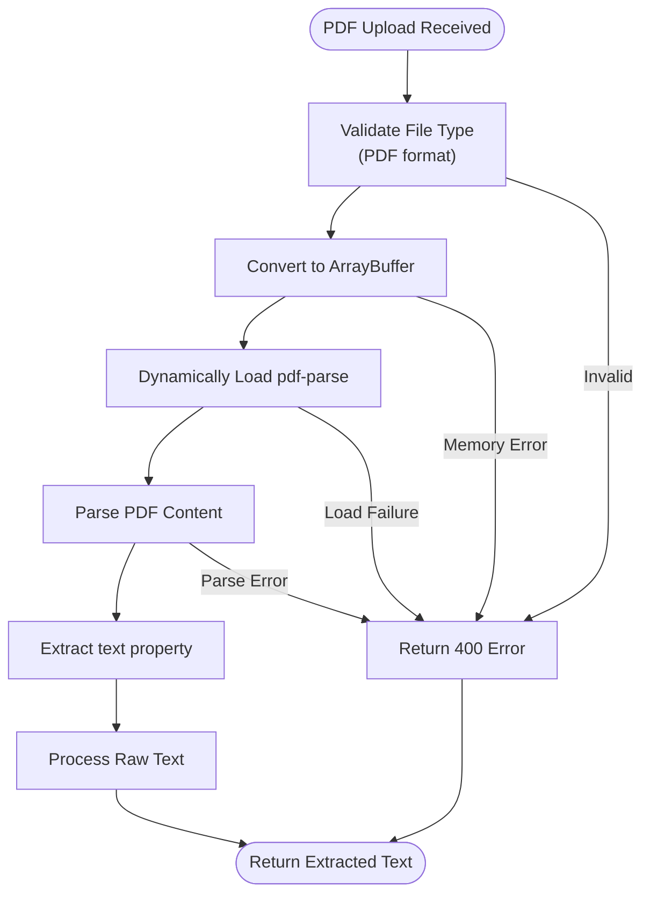
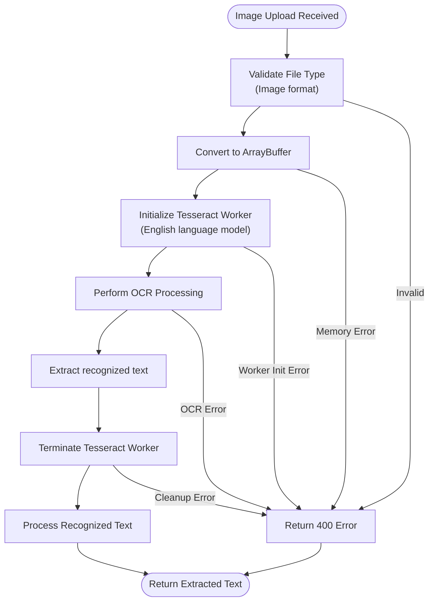
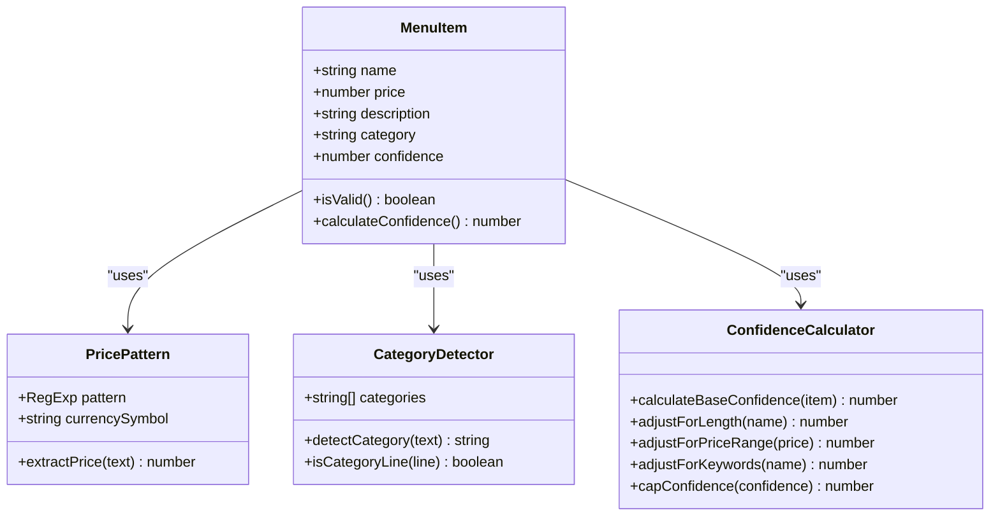

# Menu Processing Service

<cite>
**Referenced Files in This Document**
- [src/app/api/restaurant/parse-menu/route.ts](file://src/app/api/restaurant/parse-menu/route.ts)
- [src/components/restaurant/menu-upload-screen.tsx](file://src/components/restaurant/menu-upload-screen.tsx)
- [src/components/pwa/menu-screen.tsx](file://src/components/pwa/menu-screen.tsx)
- [src/__tests__/restaurant/menu-upload-screen.test.tsx](file://src/__tests__/restaurant/menu-upload-screen.test.tsx)
- [package.json](file://package.json)
- [README.md](file://README.md)
- [src/app/api/restaurant/send-verification/route.ts](file://src/app/api/restaurant/send-verification/route.ts)
- [src/app/api/restaurant/verify-otp/route.ts](file://src/app/api/restaurant/verify-otp/route.ts)
- [src/app/api/restaurant/generate-qr/route.ts](file://src/app/api/restaurant/generate-qr/route.ts)
- [src/app/api/orders/create/route.ts](file://src/app/api/orders/create/route.ts)
</cite>

## Table of Contents
1. [Introduction](#introduction)
2. [System Architecture](#system-architecture)
3. [Core Components](#core-components)
4. [Menu Parsing Pipeline](#menu-parsing-pipeline)
5. [File Processing Implementation](#file-processing-implementation)
6. [Data Transformation Pipeline](#data-transformtion-pipeline)
7. [Error Handling and Recovery](#error-handling-and-recovery)
8. [Performance Considerations](#performance-considerations)
9. [Testing and Validation](#testing-and-validation)
10. [Extension Guidelines](#extension-guidelines)
11. [Troubleshooting Guide](#troubleshooting-guide)
12. [Conclusion](#conclusion)

## Introduction

The Menu Processing Service is a sophisticated backend system designed to automate the conversion of physical menus and PDF documents into structured digital menu items. Built as part of the MenuPRO-App-main project, this service integrates advanced technologies including pdf-parse for document extraction and Tesseract.js for optical character recognition (OCR) processing of image-based menus.

The service serves as a critical component in the restaurant management ecosystem, enabling restaurants to quickly digitize their existing paper menus while maintaining accuracy and preserving menu structure. It supports two primary input formats: PDF documents and image files (photos of physical menus), each processed through specialized pipelines optimized for their respective content types.

## System Architecture

The Menu Processing Service follows a modular architecture with clear separation of concerns between file handling, content extraction, and data transformation. The system is designed to handle concurrent requests efficiently while maintaining robust error handling and performance optimization.

**Diagram sources**
- [src/app/api/restaurant/parse-menu/route.ts](file://src/app/api/restaurant/parse-menu/route.ts#L1-L152)
- [src/components/restaurant/menu-upload-screen.tsx](file://src/components/restaurant/menu-upload-screen.tsx#L1-L447)

## Core Components

### API Endpoint Handler

The core API endpoint handler manages the entire request lifecycle, from initial file reception to structured response generation. The handler implements robust error handling and supports dynamic method detection based on file type.

**Diagram sources**
- [src/app/api/restaurant/parse-menu/route.ts](file://src/app/api/restaurant/parse-menu/route.ts#L5-L40)

### File Processing Module

The file processing module handles the core logic for extracting content from different file formats. It implements intelligent method detection and provides fallback mechanisms for error conditions.

**Section sources**
- [src/app/api/restaurant/parse-menu/route.ts](file://src/app/api/restaurant/parse-menu/route.ts#L1-L152)

## Menu Parsing Pipeline

### PDF Processing Pipeline

The PDF processing pipeline utilizes the pdf-parse library to extract text content from PDF documents. This pipeline is optimized for structured documents with predictable text layouts commonly found in restaurant menus.

**Diagram sources**
- [src/app/api/restaurant/parse-menu/route.ts](file://src/app/api/restaurant/parse-menu/route.ts#L20-L28)

### OCR Processing Pipeline

The OCR processing pipeline employs Tesseract.js to extract text from image files, utilizing machine learning models trained specifically for text recognition tasks. This pipeline is essential for processing photos of physical menus.

**Diagram sources**
- [src/app/api/restaurant/parse-menu/route.ts](file://src/app/api/restaurant/parse-menu/route.ts#L29-L37)

**Section sources**
- [src/app/api/restaurant/parse-menu/route.ts](file://src/app/api/restaurant/parse-menu/route.ts#L20-L37)

## File Processing Implementation

### MIME Type Validation

The system implements comprehensive MIME type validation to ensure only supported file formats are processed. This validation occurs at the API endpoint level and prevents unnecessary processing of incompatible files.

### Buffer Handling

All file processing operations utilize ArrayBuffer conversion to ensure optimal memory usage and compatibility with external libraries. The system implements proper cleanup procedures to prevent memory leaks, particularly in the OCR processing pipeline where workers need explicit termination.

### Dynamic Library Loading

To optimize startup performance and reduce memory footprint, the system implements dynamic loading of processing libraries. This approach ensures that pdf-parse is only loaded when PDF processing is required, and Tesseract.js is only initialized when OCR processing is needed.

**Section sources**
- [src/app/api/restaurant/parse-menu/route.ts](file://src/app/api/restaurant/parse-menu/route.ts#L1-L40)

## Data Transformation Pipeline

### Menu Item Parser

The menu item parser implements sophisticated text analysis to extract structured menu data from raw extracted text. The parser employs multiple strategies to identify menu items, prices, descriptions, and categories.

**Diagram sources**
- [src/app/api/restaurant/parse-menu/route.ts](file://src/app/api/restaurant/parse-menu/route.ts#L42-L152)

### Price Pattern Recognition

The system implements multiple price pattern recognition strategies to accommodate different menu formatting conventions. These patterns include dollar signs, word-based currencies, and numeric formats.

### Category Detection

The category detection system identifies menu categories through keyword matching, providing contextual awareness for menu organization. Categories are dynamically detected and applied to menu items as they are parsed.

### Confidence Scoring

Each parsed menu item receives a confidence score based on multiple factors including item name length, price range appropriateness, description presence, and keyword matching. This scoring system helps users identify potentially inaccurate extractions.

**Section sources**
- [src/app/api/restaurant/parse-menu/route.ts](file://src/app/api/restaurant/parse-menu/route.ts#L42-L152)

## Error Handling and Recovery

### Graceful Degradation

The system implements graceful degradation strategies to ensure partial functionality even when processing fails. For example, if OCR processing encounters errors, the system may still return partially extracted text for manual review.

### Timeout Management

OCR processing includes timeout handling to prevent indefinite hanging of requests. While not explicitly shown in the current implementation, production systems should implement timeout mechanisms for long-running OCR operations.

### Memory Management

The system implements proper cleanup procedures for external resources, particularly terminating Tesseract workers after processing to prevent memory leaks and resource exhaustion.

**Section sources**
- [src/app/api/restaurant/parse-menu/route.ts](file://src/app/api/restaurant/parse-menu/route.ts#L38-L40)

## Performance Considerations

### Concurrent Processing

The system is designed to handle concurrent requests efficiently, with each request operating independently. The Tesseract.js worker initialization occurs per-request, preventing conflicts between concurrent OCR operations.

### Resource Optimization

Dynamic library loading minimizes memory usage by only loading required dependencies when needed. This approach reduces the overall memory footprint of the application, particularly beneficial for cloud deployments with limited resources.

### Response Optimization

The system truncates extracted text in responses to prevent excessive payload sizes while still providing sufficient context for debugging and validation purposes.

### Large File Handling

While the current implementation doesn't explicitly handle streaming for large files, the architecture supports extension for streaming processing of large PDF files or high-resolution images.

**Section sources**
- [src/app/api/restaurant/parse-menu/route.ts](file://src/app/api/restaurant/parse-menu/route.ts#L1-L152)

## Testing and Validation

### Unit Testing Framework

The system includes comprehensive unit tests that validate the menu parsing functionality across different scenarios. Tests cover file upload handling, text extraction accuracy, and menu item parsing logic.

### Integration Testing

Integration tests validate the complete workflow from file upload through menu item extraction, ensuring that all components work together seamlessly.

### Edge Case Testing

Tests include scenarios for malformed menus, poor-quality scans, and unusual menu layouts to ensure robustness against real-world variations.

**Section sources**
- [src/__tests__/restaurant/menu-upload-screen.test.tsx](file://src/__tests__/restaurant/menu-upload-screen.test.tsx#L1-L199)

## Extension Guidelines

### Adding New Menu Formats

To support additional menu formats, developers should:

1. **Implement Format Detection**: Add new method detection logic in the API endpoint
2. **Create Processing Functions**: Develop dedicated processing functions for the new format
3. **Update Parser Logic**: Extend the menu item parser to handle new format patterns
4. **Add Confidence Calculations**: Implement appropriate confidence scoring for new formats

### Supporting Additional Languages

For multilingual menu support:

1. **Extend OCR Model Loading**: Modify Tesseract.js initialization to load additional language models
2. **Update Pattern Matching**: Expand price pattern and category detection logic for new languages
3. **Localization Support**: Implement localization for error messages and UI feedback

### Enhancing Accuracy

Accuracy improvements can be achieved through:

1. **Machine Learning Integration**: Implement custom-trained OCR models for specific menu types
2. **Template Matching**: Develop template-based parsing for standardized menu formats
3. **User Feedback Loop**: Implement mechanisms for users to correct parsing errors

## Troubleshooting Guide

### Common Issues and Solutions

**OCR Processing Failures**
- **Symptom**: Images fail to process with OCR errors
- **Solution**: Ensure image quality meets minimum standards (resolution, contrast, lighting)
- **Prevention**: Implement image preprocessing steps for poor-quality scans

**PDF Parsing Errors**
- **Symptom**: PDF files fail to extract text properly
- **Solution**: Verify PDF format compatibility and check for encrypted or protected content
- **Prevention**: Test with known good PDF samples before production deployment

**Memory Issues**
- **Symptom**: Out-of-memory errors during processing
- **Solution**: Implement streaming processing for large files and proper resource cleanup
- **Prevention**: Monitor memory usage and implement resource limits

**Performance Degradation**
- **Symptom**: Slow processing times for large files
- **Solution**: Optimize OCR parameters and implement asynchronous processing
- **Prevention**: Implement request queuing and rate limiting

### Debugging Tools

The system provides several debugging capabilities:

- **Truncated Text Preview**: Returns a preview of extracted text for validation
- **Confidence Scores**: Provides insight into parsing accuracy
- **Error Logging**: Comprehensive error logging for troubleshooting

**Section sources**
- [src/app/api/restaurant/parse-menu/route.ts](file://src/app/api/restaurant/parse-menu/route.ts#L38-L40)

## Conclusion

The Menu Processing Service represents a sophisticated solution for automating menu digitization in restaurant management systems. By leveraging advanced technologies like pdf-parse and Tesseract.js, the service provides reliable and efficient processing of both digital and physical menu formats.

The modular architecture ensures maintainability and extensibility, while comprehensive error handling and performance optimizations make it suitable for production deployment. The confidence scoring system and structured output format provide restaurant owners with the tools they need to validate and refine their digital menus.

Future enhancements could include support for additional menu formats, improved multilingual support, and integration with machine learning models for enhanced accuracy. The foundation provided by this service enables rapid adaptation to evolving menu formats and restaurant requirements.