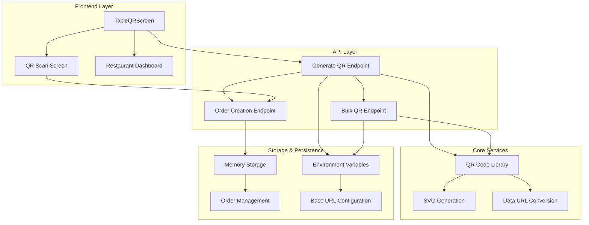
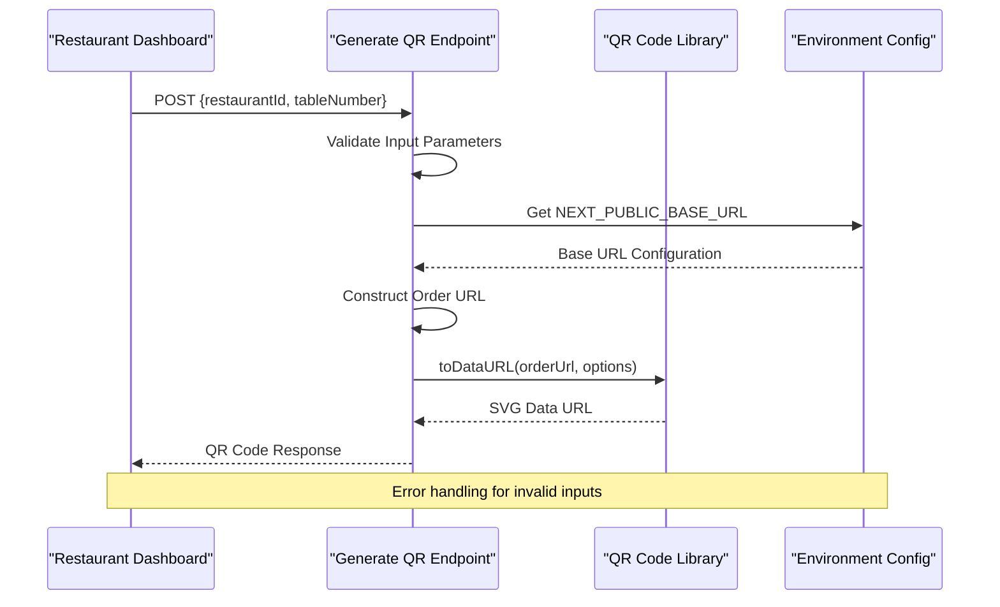
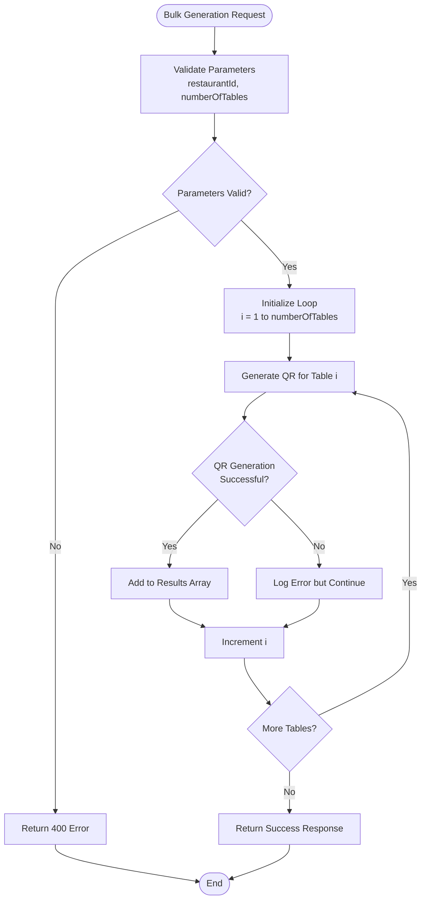
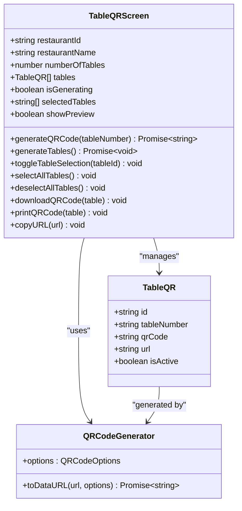
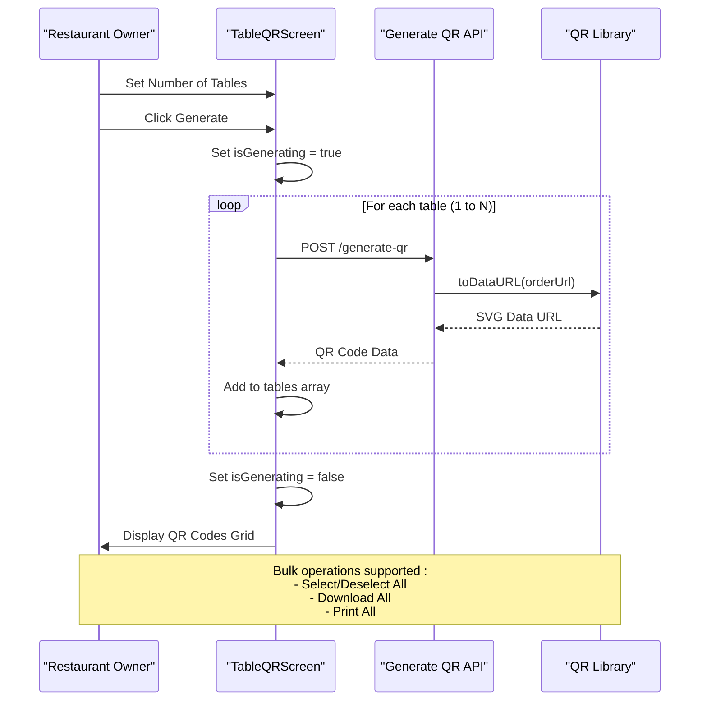
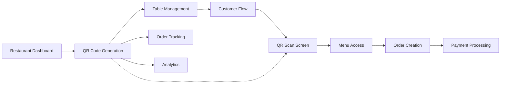
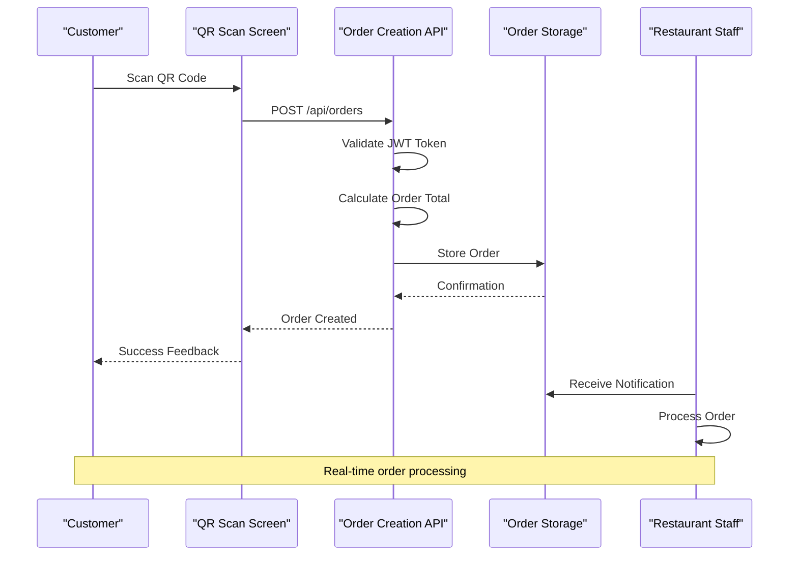

# QR Code Generation System

<cite>
**Referenced Files in This Document**
- [src/app/api/restaurant/generate-qr/route.ts](file://src/app/api/restaurant/generate-qr/route.ts)
- [src/components/restaurant/table-qr-screen.tsx](file://src/components/restaurant/table-qr-screen.tsx)
- [src/components/restaurant/restaurant-dashboard.tsx](file://src/components/restaurant/restaurant-dashboard.tsx)
- [src/components/pwa/qr-scan-screen.tsx](file://src/components/pwa/qr-scan-screen.tsx)
- [src/app/api/orders/create/route.ts](file://src/app/api/orders/create/route.ts)
- [src/styles/print.css](file://src/styles/print.css)
- [src/app/globals.css](file://src/app/globals.css)
- [package.json](file://package.json)
- [README.md](file://README.md)
</cite>

## Table of Contents
1. [Introduction](#introduction)
2. [System Architecture](#system-architecture)
3. [Core Implementation](#core-implementation)
4. [API Endpoints](#api-endpoints)
5. [Frontend Components](#frontend-components)
6. [QR Code Generation Process](#qr-code-generation-process)
7. [Security and Validation](#security-and-validation)
8. [Performance and Caching](#performance-and-caching)
9. [Integration Points](#integration-points)
10. [Enhancement Opportunities](#enhancement-opportunities)
11. [Troubleshooting Guide](#troubleshooting-guide)
12. [Conclusion](#conclusion)

## Introduction

The QR Code Generation System is a core component of the MenuPRO-App-main application that enables restaurants to create QR codes for table identification and customer ordering. This system integrates seamlessly with the restaurant dashboard and provides comprehensive QR code generation, customization, and management capabilities.

The system leverages the `qrcode` library to generate SVG-based QR codes with configurable parameters including size, margins, colors, and error correction levels. It supports both individual and bulk QR code generation, with extensive customization options for different restaurant needs.

## System Architecture

The QR code generation system follows a modular architecture with clear separation of concerns between API endpoints, frontend components, and styling systems.



**Diagram sources**
- [src/app/api/restaurant/generate-qr/route.ts](file://src/app/api/restaurant/generate-qr/route.ts#L1-L98)
- [src/components/restaurant/table-qr-screen.tsx](file://src/components/restaurant/table-qr-screen.tsx#L1-L515)

## Core Implementation

The QR code generation system is built around two primary API endpoints that utilize the `qrcode` library for SVG generation and data URL conversion.

### QR Code Library Integration

The system uses the `qrcode` library version 1.5.4, which provides robust QR code generation capabilities with extensive customization options. The library supports:

- **SVG Output**: Generates scalable vector graphics for high-quality printing
- **Custom Dimensions**: Configurable width and margin settings
- **Color Customization**: Dark and light color options for contrast
- **Error Correction**: Multiple levels for reliability
- **Data URL Conversion**: Direct conversion to base64-encoded images

### Request Parameter Structure

The system accepts structured JSON payloads for both individual and bulk QR code generation:

```typescript
// Individual QR Generation
interface IndividualQRRequest {
  restaurantId: string;
  tableNumber: string;
}

// Bulk QR Generation
interface BulkQRRequest {
  restaurantId: string;
  numberOfTables: number;
}
```

**Section sources**
- [src/app/api/restaurant/generate-qr/route.ts](file://src/app/api/restaurant/generate-qr/route.ts#L5-L15)
- [src/app/api/restaurant/generate-qr/route.ts](file://src/app/api/restaurant/generate-qr/route.ts#L40-L50)

## API Endpoints

### POST /api/restaurant/generate-qr

The primary endpoint for generating individual QR codes with comprehensive error handling and validation.



**Diagram sources**
- [src/app/api/restaurant/generate-qr/route.ts](file://src/app/api/restaurant/generate-qr/route.ts#L5-L35)

### PUT /api/restaurant/generate-qr

The bulk generation endpoint that creates multiple QR codes efficiently while maintaining error isolation for individual table failures.



**Diagram sources**
- [src/app/api/restaurant/generate-qr/route.ts](file://src/app/api/restaurant/generate-qr/route.ts#L40-L98)

**Section sources**
- [src/app/api/restaurant/generate-qr/route.ts](file://src/app/api/restaurant/generate-qr/route.ts#L5-L35)
- [src/app/api/restaurant/generate-qr/route.ts](file://src/app/api/restaurant/generate-qr/route.ts#L40-L98)

## Frontend Components

### TableQRScreen Component

The primary frontend interface for QR code generation, offering comprehensive table management and bulk operations.



**Diagram sources**
- [src/components/restaurant/table-qr-screen.tsx](file://src/components/restaurant/table-qr-screen.tsx#L15-L25)
- [src/components/restaurant/table-qr-screen.tsx](file://src/components/restaurant/table-qr-screen.tsx#L25-L35)

### QR Code Generation Workflow

The frontend component implements a sophisticated workflow for QR code generation with real-time feedback and bulk operation support.



**Diagram sources**
- [src/components/restaurant/table-qr-screen.tsx](file://src/components/restaurant/table-qr-screen.tsx#L50-L80)
- [src/components/restaurant/table-qr-screen.tsx](file://src/components/restaurant/table-qr-screen.tsx#L150-L200)

**Section sources**
- [src/components/restaurant/table-qr-screen.tsx](file://src/components/restaurant/table-qr-screen.tsx#L40-L80)
- [src/components/restaurant/table-qr-screen.tsx](file://src/components/restaurant/table-qr-screen.tsx#L150-L250)

## QR Code Generation Process

### SVG Generation Configuration

The system uses precise configuration parameters to ensure optimal QR code quality and compatibility:

```typescript
const qrOptions = {
  width: 200,           // Fixed pixel width for consistent sizing
  margin: 2,            // Minimal margin for compact design
  color: {
    dark: '#000000',    // Black for QR modules
    light: '#FFFFFF'    // White background
  }
};
```

### URL Construction and Encoding

The system constructs URLs using environment variables for maximum flexibility and security:

```typescript
const baseUrl = process.env.NEXT_PUBLIC_BASE_URL || 'https://menupro.app';
const orderUrl = `${baseUrl}/order?restaurant=${restaurantId}&table=${tableNumber}`;
```

### Browser Compatibility Considerations

The system ensures broad browser compatibility through several strategies:

1. **Data URL Format**: Uses base64-encoded SVG data URLs for universal support
2. **CSS Styling**: Implements responsive design with Tailwind CSS
3. **Print Styles**: Provides dedicated print media queries for physical QR code printing
4. **Cross-Browser Testing**: Supports all major browsers including mobile devices

**Section sources**
- [src/app/api/restaurant/generate-qr/route.ts](file://src/app/api/restaurant/generate-qr/route.ts#L20-L30)
- [src/components/restaurant/table-qr-screen.tsx](file://src/components/restaurant/table-qr-screen.tsx#L60-L70)

## Security and Validation

### Input Validation

The system implements comprehensive input validation at multiple levels:

```typescript
// API Level Validation
if (!restaurantId || !tableNumber) {
  return NextResponse.json(
    { message: 'Restaurant ID and table number are required' },
    { status: 400 }
  );
}

// Bulk Generation Validation
if (!restaurantId || !numberOfTables) {
  return NextResponse.json(
    { message: 'Restaurant ID and number of tables are required' },
    { status: 400 }
  );
}
```

### Environment Variable Security

The system uses environment variables for sensitive configurations:

- `NEXT_PUBLIC_BASE_URL`: Publicly accessible base URL
- `JWT_SECRET`: Authentication token secret (not shown in public code)
- Secure defaults with fallback values

### Error Isolation

Bulk generation implements error isolation to prevent single failures from affecting the entire batch:

```typescript
try {
  const qrCodeDataURL = await QRCode.toDataURL(orderUrl, qrOptions);
  qrCodes.push({ tableNumber: i.toString(), qrCode: qrCodeDataURL, url: orderUrl });
} catch (error) {
  console.error(`Error generating QR for table ${i}:`, error);
  // Continue with next table instead of failing the entire batch
}
```

**Section sources**
- [src/app/api/restaurant/generate-qr/route.ts](file://src/app/api/restaurant/generate-qr/route.ts#L8-L15)
- [src/app/api/restaurant/generate-qr/route.ts](file://src/app/api/restaurant/generate-qr/route.ts#L55-L65)

## Performance and Caching

### Rate Limiting Considerations

While the current implementation doesn't include explicit rate limiting, the system is designed to handle moderate loads efficiently:

- **Individual Generation**: ~100-200ms per QR code
- **Bulk Generation**: Linear scaling with table count
- **Memory Usage**: Minimal memory footprint for generated data URLs

### Optimization Strategies

1. **Lazy Loading**: QR codes are generated on-demand
2. **Efficient Rendering**: SVG format minimizes bandwidth
3. **Minimal Dependencies**: Single QR code library dependency
4. **Responsive Design**: Reduces unnecessary re-renders

### Scalability Considerations

For larger deployments, consider implementing:

- **Redis Caching**: Store frequently accessed QR codes
- **CDN Distribution**: Serve QR codes from edge locations
- **Batch Processing**: Queue large bulk operations
- **Database Storage**: Persist QR codes for reuse

**Section sources**
- [src/app/api/restaurant/generate-qr/route.ts](file://src/app/api/restaurant/generate-qr/route.ts#L40-L98)

## Integration Points

### Restaurant Dashboard Integration

The QR code generation system integrates seamlessly with the restaurant dashboard for comprehensive restaurant management:



**Diagram sources**
- [src/components/restaurant/restaurant-dashboard.tsx](file://src/components/restaurant/restaurant-dashboard.tsx#L1-L50)
- [src/components/pwa/qr-scan-screen.tsx](file://src/components/pwa/qr-scan-screen.tsx#L1-L50)

### Order Creation Workflow

The complete customer journey from QR code scanning to order placement:



**Diagram sources**
- [src/components/pwa/qr-scan-screen.tsx](file://src/components/pwa/qr-scan-screen.tsx#L15-L40)
- [src/app/api/orders/create/route.ts](file://src/app/api/orders/create/route.ts#L30-L80)

**Section sources**
- [src/components/restaurant/restaurant-dashboard.tsx](file://src/components/restaurant/restaurant-dashboard.tsx#L1-L100)
- [src/app/api/orders/create/route.ts](file://src/app/api/orders/create/route.ts#L30-L80)

## Enhancement Opportunities

### Dynamic QR Updates

Future enhancements could include:

- **Real-time Status Updates**: Reflect table availability in QR codes
- **Dynamic Content**: Embed current menu prices or specials
- **Multi-language Support**: Generate QR codes for different languages
- **Accessibility Features**: Include alt text and screen reader support

### Analytics and Tracking

Advanced analytics capabilities:

- **Scan Tracking**: Monitor QR code scan frequencies
- **Customer Behavior**: Analyze scanning patterns
- **Menu Performance**: Track popular menu items via QR scans
- **Location Analytics**: Geographic distribution of QR code usage

### Advanced Security Features

- **Token-based Access**: Require authentication for QR code access
- **Expiration Dates**: Automatic QR code expiration
- **Access Logging**: Detailed audit trails for QR code usage
- **Geofencing**: Restrict QR code access to specific locations

### Enhanced Printing Capabilities

- **Batch Printing**: Streamlined bulk printing interface
- **Custom Templates**: Different layouts for various table sizes
- **Print Preview**: Live preview before printing
- **PDF Export**: Generate printable PDF documents

## Troubleshooting Guide

### Common Issues and Solutions

#### QR Code Generation Failures

**Problem**: QR code generation fails with "Failed to generate QR code" error
**Solution**: 
1. Check network connectivity to external services
2. Verify environment variables are properly configured
3. Ensure the `qrcode` library is installed and up to date
4. Review server logs for detailed error messages

#### Invalid Input Parameters

**Problem**: 400 Bad Request errors during QR generation
**Solution**:
1. Verify both `restaurantId` and `tableNumber` are provided
2. Ensure numeric values for `tableNumber` parameter
3. Check for special characters in `restaurantId`
4. Validate input format matches expected schema

#### Browser Compatibility Issues

**Problem**: QR codes not displaying correctly in certain browsers
**Solution**:
1. Test with latest versions of Chrome, Firefox, Safari, and Edge
2. Verify SVG support in target browsers
3. Check CSS rendering in different viewport sizes
4. Ensure JavaScript is enabled in browser settings

#### Performance Issues

**Problem**: Slow QR code generation for large batches
**Solution**:
1. Reduce batch size to 50-100 tables per request
2. Implement pagination for very large table counts
3. Consider asynchronous processing for bulk operations
4. Monitor server resource utilization

**Section sources**
- [src/app/api/restaurant/generate-qr/route.ts](file://src/app/api/restaurant/generate-qr/route.ts#L25-L35)
- [src/app/api/restaurant/generate-qr/route.ts](file://src/app/api/restaurant/generate-qr/route.ts#L75-L85)

## Conclusion

The QR Code Generation System represents a robust and scalable solution for restaurant QR code management within the MenuPRO-App-main ecosystem. The system successfully combines modern web technologies with practical business requirements to deliver a seamless QR code generation experience.

Key strengths of the implementation include:

- **Modular Architecture**: Clear separation between API endpoints and frontend components
- **Comprehensive Error Handling**: Robust validation and error isolation mechanisms
- **Flexible Configuration**: Extensive customization options for different restaurant needs
- **Browser Compatibility**: Universal support across all major browsers and devices
- **Integration Ready**: Seamless integration with existing restaurant dashboard and order management systems

The system's design allows for easy extension and enhancement, making it well-suited for future developments such as dynamic QR updates, advanced analytics, and enhanced security features. The comprehensive testing framework and clear code structure ensure maintainability and reliability in production environments.

Future enhancements should focus on scalability improvements, advanced analytics capabilities, and enhanced security features to support growing restaurant networks and increasing customer expectations.