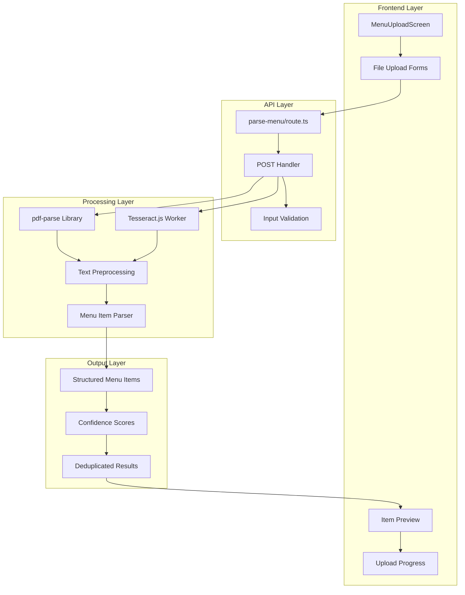
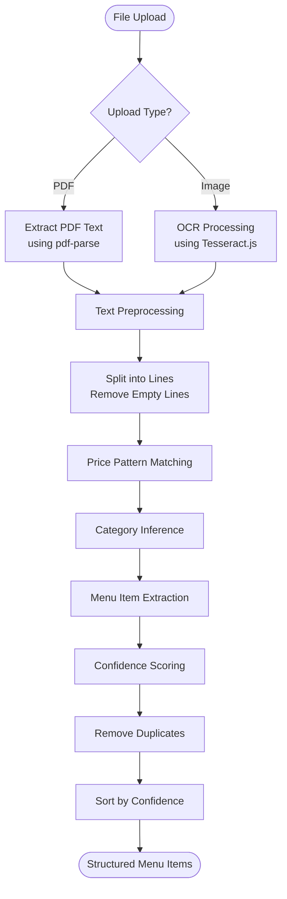
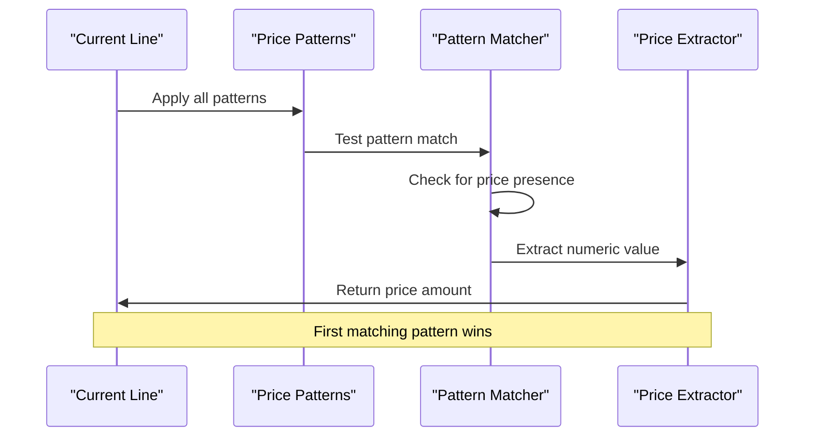
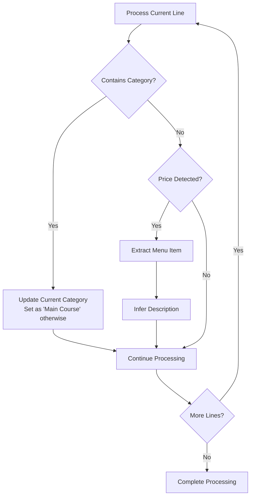
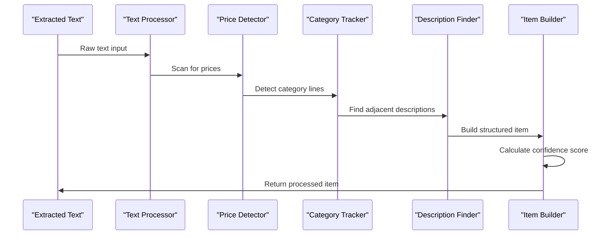
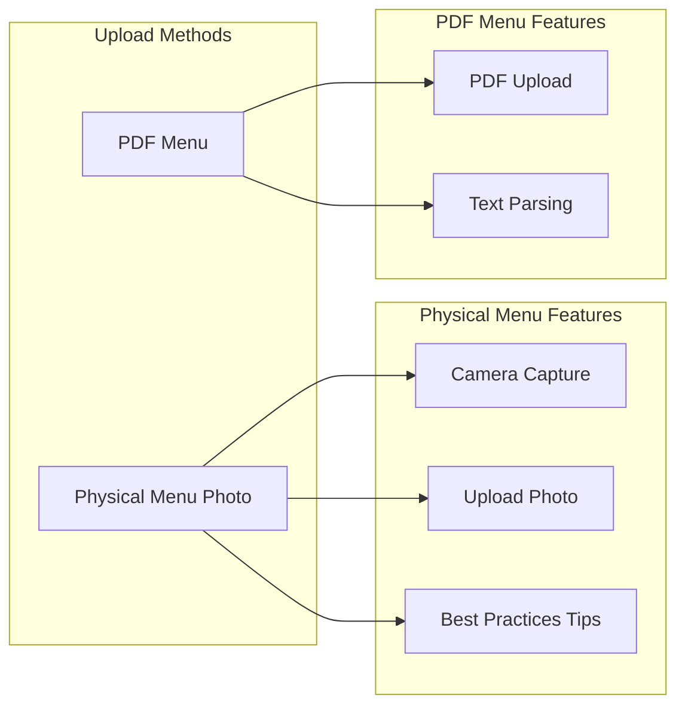

# Menu Processing Service

<cite>
**Referenced Files in This Document**
- [src/app/api/restaurant/parse-menu/route.ts](file://src/app/api/restaurant/parse-menu/route.ts)
- [src/components/restaurant/menu-upload-screen.tsx](file://src/components/restaurant/menu-upload-screen.tsx)
- [src/components/ui/button.tsx](file://src/components/ui/button.tsx)
- [src/components/ui/card.tsx](file://src/components/ui/card.tsx)
- [src/components/ui/badge.tsx](file://src/components/ui/badge.tsx)
- [src/components/ui/utils.ts](file://src/components/ui/utils.ts)
- [package.json](file://package.json)
</cite>

## Table of Contents
1. [Introduction](#introduction)
2. [System Architecture](#system-architecture)
3. [Core Components](#core-components)
4. [Text Processing Pipeline](#text-processing-pipeline)
5. [Price Detection and Pattern Matching](#price-detection-and-pattern-matching)
6. [Category Inference Logic](#category-inference-logic)
7. [Confidence Scoring Algorithm](#confidence-scoring-algorithm)
8. [Menu Item Extraction](#menu-item-extraction)
9. [User Interface Implementation](#user-interface-implementation)
10. [API Integration](#api-integration)
11. [Accuracy Limitations and Recommendations](#accuracy-limitations-and-recommendations)
12. [Performance Considerations](#performance-considerations)
13. [Troubleshooting Guide](#troubleshooting-guide)
14. [Conclusion](#conclusion)

## Introduction

The Menu Processing Service is a sophisticated system designed to extract structured menu items from PDF documents and physical menu photos using advanced OCR (Optical Character Recognition) technology. Built with Next.js and TypeScript, this service provides restaurant owners with an automated way to digitize their menus without manual data entry.

The service leverages two primary technologies: **pdf-parse** for extracting text from PDF files and **Tesseract.js** for OCR processing of image-based menus. It implements intelligent text preprocessing, pattern recognition, and confidence scoring to deliver accurate menu item extraction with minimal human intervention.

## System Architecture

The Menu Processing Service follows a modular architecture with clear separation of concerns between the frontend user interface and backend processing logic.



**Diagram sources**
- [src/app/api/restaurant/parse-menu/route.ts](file://src/app/api/restaurant/parse-menu/route.ts#L1-L152)
- [src/components/restaurant/menu-upload-screen.tsx](file://src/components/restaurant/menu-upload-screen.tsx#L1-L447)

## Core Components

### Backend API Endpoint

The core processing logic resides in the `/api/restaurant/parse-menu/route.ts` file, which serves as the main entry point for menu processing requests.

```typescript
// Key dependencies
import { NextRequest, NextResponse } from 'next/server';
import { createWorker } from 'tesseract.js';

export async function POST(request: NextRequest) {
  try {
    const formData = await request.formData();
    const file = formData.get('file') as File;
    const method = formData.get('method') as string;
    
    // Process based on upload method
    if (method === 'pdf') {
      // PDF processing logic
    } else if (method === 'physical') {
      // OCR processing logic
    }
    
    // Parse extracted text into menu items
    items = parseMenuItems(extractedText);
    
    return NextResponse.json({
      success: true,
      items,
      extractedText: extractedText.substring(0, 500) + '...'
    });
    
  } catch (error) {
    console.error('Menu parsing error:', error);
    return NextResponse.json(
      { message: 'Failed to parse menu' },
      { status: 500 }
    );
  }
}
```

### Frontend User Interface

The `MenuUploadScreen` component provides an intuitive interface for restaurant owners to upload and process their menus through a React-based user experience.

```typescript
interface ParsedMenuItem {
  name: string;
  price: number;
  description?: string;
  category?: string;
  confidence: number;
}

interface MenuItem {
  id: string;
  name: string;
  description: string;
  price: number;
  category: string;
  image?: string;
  isAvailable: boolean;
}
```

**Section sources**
- [src/app/api/restaurant/parse-menu/route.ts](file://src/app/api/restaurant/parse-menu/route.ts#L1-L152)
- [src/components/restaurant/menu-upload-screen.tsx](file://src/components/restaurant/menu-upload-screen.tsx#L37-L81)

## Text Processing Pipeline

The text processing pipeline handles both PDF text extraction and OCR processing, applying consistent preprocessing techniques regardless of the input source.



**Diagram sources**
- [src/app/api/restaurant/parse-menu/route.ts](file://src/app/api/restaurant/parse-menu/route.ts#L15-L52)
- [src/app/api/restaurant/parse-menu/route.ts](file://src/app/api/restaurant/parse-menu/route.ts#L54-L152)

### Text Preprocessing Steps

The preprocessing pipeline performs several critical transformations to prepare raw text for menu item extraction:

1. **Line Splitting**: Text is split into individual lines using `\n` delimiter
2. **Empty Line Filtering**: Removes blank lines to improve processing efficiency
3. **Whitespace Normalization**: Ensures consistent spacing and formatting
4. **Character Encoding Handling**: Manages special characters and encoding issues

```typescript
const lines = text.split('\n').filter(line => line.trim().length > 0);
```

**Section sources**
- [src/app/api/restaurant/parse-menu/route.ts](file://src/app/api/restaurant/parse-menu/route.ts#L55-L56)

## Price Detection and Pattern Matching

The service employs sophisticated regex patterns to identify prices within extracted text, supporting multiple currency formats and price representations.

### Price Pattern Definitions

```typescript
const pricePatterns = [
  /\$(\d+\.?\d*)/g,                    // Dollar format: $12.99, $5
  /(\d+\.?\d*)\s*dollars?/gi,          // Word format: 12.99 dollars, 5 dollars
  /(\d+\.?\d*)\s*USD/gi                // Currency format: 12.99 USD
];
```

### Price Detection Algorithm

The price detection process iterates through each line and applies all defined patterns to identify potential price values:



**Diagram sources**
- [src/app/api/restaurant/parse-menu/route.ts](file://src/app/api/restaurant/parse-menu/route.ts#L60-L65)

### Price Extraction Logic

Once a price pattern is detected, the system extracts the numeric value and validates it against reasonable price ranges:

```typescript
let price = 0;
let priceMatch = null;

for (const pattern of pricePatterns) {
  priceMatch = pattern.exec(line);
  if (priceMatch) {
    price = parseFloat(priceMatch[1]);
    break;
  }
}

// Skip invalid price ranges
if (price <= 0 || price > 1000) {
  continue;
}
```

**Section sources**
- [src/app/api/restaurant/parse-menu/route.ts](file://src/app/api/restaurant/parse-menu/route.ts#L60-L75)

## Category Inference Logic

The service implements intelligent category inference by scanning for predefined food categories within the text and maintaining a current category context throughout the processing.

### Category Definition List

```typescript
const categories = [
  'appetizers', 'starters', 'soups', 'salads',
  'mains', 'entrees', 'pasta', 'pizza', 'burgers',
  'desserts', 'beverages', 'drinks', 'wine', 'beer'
];
```

### Category Detection Process



**Diagram sources**
- [src/app/api/restaurant/parse-menu/route.ts](file://src/app/api/restaurant/parse-menu/route.ts#L77-L85)

### Category Inference Implementation

The category inference logic scans each line for category keywords and maintains a persistent context:

```typescript
let currentCategory = 'Main Course';

for (let i = 0; i < lines.length; i++) {
  const line = lines[i].trim();
  
  // Check if line is a category
  const categoryMatch = categories.find(cat => 
    line.toLowerCase().includes(cat.toLowerCase())
  );
  
  if (categoryMatch) {
    currentCategory = line;
    continue;
  }
  
  // Process menu items with detected category
  if (price > 0) {
    // Extract item with current category context
    items.push({
      name: itemName,
      price: price,
      description: description,
      category: currentCategory,
      confidence: confidence
    });
  }
}
```

**Section sources**
- [src/app/api/restaurant/parse-menu/route.ts](file://src/app/api/restaurant/parse-menu/route.ts#L77-L85)
- [src/app/api/restaurant/parse-menu/route.ts](file://src/app/api/restaurant/parse-menu/route.ts#L120-L130)

## Confidence Scoring Algorithm

The confidence scoring system evaluates the reliability of each extracted menu item based on multiple factors, providing users with quality indicators for each detected item.

### Confidence Factors

The algorithm considers five key factors when calculating confidence scores:

1. **Item Name Length**: Longer names indicate higher confidence
2. **Price Range Validation**: Prices within reasonable ranges increase confidence
3. **Description Presence**: Items with descriptions receive additional confidence points
4. **Food Type Keywords**: Items containing common food type keywords gain extra confidence
5. **Base Confidence**: Every item starts with a base confidence level

### Confidence Calculation Implementation

```typescript
let confidence = 0.5; // Base confidence

if (itemName.length > 5) confidence += 0.1;
if (price > 5 && price < 100) confidence += 0.2;
if (description.length > 0) confidence += 0.1;
if (itemName.toLowerCase().includes('pizza') || 
    itemName.toLowerCase().includes('pasta') ||
    itemName.toLowerCase().includes('salad') ||
    itemName.toLowerCase().includes('burger')) {
  confidence += 0.2;
}

confidence = Math.min(confidence, 0.95); // Cap at 95%
```

### Confidence Color Coding

The frontend implements color-coded confidence indicators:

```typescript
const getConfidenceColor = (confidence: number) => {
  if (confidence >= 0.8) return 'bg-green-100 text-green-800';
  if (confidence >= 0.6) return 'bg-yellow-100 text-yellow-800';
  return 'bg-red-100 text-red-800';
};
```

**Section sources**
- [src/app/api/restaurant/parse-menu/route.ts](file://src/app/api/restaurant/parse-menu/route.ts#L95-L110)
- [src/components/restaurant/menu-upload-screen.tsx](file://src/components/restaurant/menu-upload-screen.tsx#L140-L142)

## Menu Item Extraction

The core menu item extraction process combines price detection, category inference, and description parsing to create structured menu item objects.

### Item Extraction Workflow



**Diagram sources**
- [src/app/api/restaurant/parse-menu/route.ts](file://src/app/api/restaurant/parse-menu/route.ts#L87-L130)

### Description Inference Logic

The system attempts to infer descriptions by examining adjacent lines:

```typescript
// Look for description in next line
let description = '';
if (i + 1 < lines.length) {
  const nextLine = lines[i + 1].trim();
  // If next line doesn't contain a price, it might be a description
  if (!nextLine.match(/\$?\d+\.?\d*/) && 
      nextLine.length > 0 && 
      nextLine.length < 100) {
    description = nextLine;
  }
}
```

### Duplicate Removal and Sorting

After extraction, the system removes duplicate items and sorts results by confidence score:

```typescript
// Remove duplicates and sort by confidence
const uniqueItems = items.filter((item, index, self) => 
  index === self.findIndex(t => t.name.toLowerCase() === item.name.toLowerCase())
);

return uniqueItems.sort((a, b) => b.confidence - a.confidence);
```

**Section sources**
- [src/app/api/restaurant/parse-menu/route.ts](file://src/app/api/restaurant/parse-menu/route.ts#L87-L130)
- [src/app/api/restaurant/parse-menu/route.ts](file://src/app/api/restaurant/parse-menu/route.ts#L132-L152)

## User Interface Implementation

The MenuUploadScreen component provides a comprehensive user interface for menu processing, featuring multiple upload methods, real-time feedback, and interactive item management.

### Upload Method Selection

The interface offers two distinct upload methods tailored to different menu formats:



**Diagram sources**
- [src/components/restaurant/menu-upload-screen.tsx](file://src/components/restaurant/menu-upload-screen.tsx#L166-L201)
- [src/components/restaurant/menu-upload-screen.tsx](file://src/components/restaurant/menu-upload-screen.tsx#L274-L305)

### File Upload Handling

The upload system supports both PDF and image file formats with appropriate validation and processing:

```typescript
const handleFileUpload = async (file: File, method: 'physical' | 'pdf') => {
  setIsUploading(true);
  setUploadProgress(0);
  setError("");

  try {
    const formData = new FormData();
    formData.append('file', file);
    formData.append('method', method);

    // Simulate upload progress
    const progressInterval = setInterval(() => {
      setUploadProgress(prev => {
        if (prev >= 90) {
          clearInterval(progressInterval);
          return 90;
        }
        return prev + 10;
      });
    }, 200);

    const response = await fetch('/api/restaurant/parse-menu', {
      method: 'POST',
      body: formData,
    });

    if (response.ok) {
      const data = await response.json();
      setParsedItems(data.items || []);
    }
  } catch (error) {
    setError('Network error. Please try again.');
  } finally {
    setIsUploading(false);
  }
};
```

### Interactive Item Management

Users can preview extracted items, adjust confidence thresholds, and manually edit or add items to their final menu:

```typescript
const addParsedItem = (item: ParsedMenuItem) => {
  const newMenuItem: MenuItem = {
    id: Math.random().toString(36).substr(2, 9),
    name: item.name,
    description: item.description || '',
    price: item.price,
    category: item.category || 'Main Course',
    isAvailable: true
  };
  setMenuItems(prev => [...prev, newMenuItem]);
  setParsedItems(prev => prev.filter(parsedItem => parsedItem !== item));
};
```

**Section sources**
- [src/components/restaurant/menu-upload-screen.tsx](file://src/components/restaurant/menu-upload-screen.tsx#L60-L119)
- [src/components/restaurant/menu-upload-screen.tsx](file://src/components/restaurant/menu-upload-screen.tsx#L121-L139)

## API Integration

The service integrates seamlessly with the Next.js API routes system, providing RESTful endpoints for menu processing with comprehensive error handling and response formatting.

### API Endpoint Structure

```typescript
export async function POST(request: NextRequest) {
  try {
    const formData = await request.formData();
    const file = formData.get('file') as File;
    const method = formData.get('method') as string;
    
    // Process based on upload method
    if (method === 'pdf') {
      // PDF processing logic
    } else if (method === 'physical') {
      // OCR processing logic
    }
    
    // Parse extracted text into menu items
    items = parseMenuItems(extractedText);
    
    return NextResponse.json({
      success: true,
      items,
      extractedText: extractedText.substring(0, 500) + '...'
    });
    
  } catch (error) {
    console.error('Menu parsing error:', error);
    return NextResponse.json(
      { message: 'Failed to parse menu' },
      { status: 500 }
    );
  }
}
```

### Request/Response Schema

The API follows a standardized request/response pattern:

**Request Format:**
- `file`: Uploaded file object
- `method`: Processing method ('pdf' or 'physical')

**Response Format:**
```json
{
  "success": true,
  "items": [
    {
      "name": "Grilled Salmon",
      "price": 18.99,
      "description": "Freshly grilled salmon with lemon butter sauce",
      "category": "Entrees",
      "confidence": 0.85
    }
  ],
  "extractedText": "Grilled Salmon $18.99 Freshly grilled salmon..."
}
```

**Section sources**
- [src/app/api/restaurant/parse-menu/route.ts](file://src/app/api/restaurant/parse-menu/route.ts#L4-L52)

## Accuracy Limitations and Recommendations

### Known Limitations

1. **OCR Accuracy**: Image-based processing may struggle with poor image quality, low resolution, or unusual fonts
2. **Text Formatting**: Unformatted or poorly structured PDFs may lead to extraction errors
3. **Price Format Variations**: Non-standard price formats may not be detected
4. **Category Ambiguity**: Lines containing both prices and category-like text may cause confusion
5. **Description Parsing**: Adjacent line detection works best with consistent formatting

### Recommended Menu Formatting

To maximize accuracy, restaurants should follow these formatting guidelines:

**For Physical Menus:**
- Use clear, high-contrast text
- Maintain consistent font sizes and styles
- Separate menu items clearly with spacing
- Avoid decorative fonts that OCR struggles with
- Use standard price formats ($12.99, 12.99 USD)

**For PDF Menus:**
- Use standard PDF fonts (Times New Roman, Arial, etc.)
- Avoid scanned images of text
- Maintain consistent formatting throughout
- Use tables or lists for structured data
- Avoid excessive decoration or graphics

### Improvement Suggestions

1. **Manual Review**: Always review extracted items before finalizing
2. **Batch Processing**: Process menus in smaller batches for better accuracy
3. **Quality Control**: Implement quality checks for extracted prices and descriptions
4. **Feedback Loop**: Collect user feedback to improve pattern matching
5. **Training Data**: Use user corrections to train better OCR models

## Performance Considerations

### Processing Time Optimization

The service implements several performance optimizations:

1. **Lazy Loading**: Dependencies are loaded only when needed
2. **Worker Termination**: Tesseract.js workers are properly terminated after use
3. **Text Truncation**: Large texts are truncated for response efficiency
4. **Progress Simulation**: Realistic progress bars enhance user experience

### Memory Management

```typescript
// Proper worker lifecycle management
const worker = await createWorker('eng');
try {
  const { data: { text } } = await worker.recognize(Buffer.from(buffer));
  extractedText = text;
} finally {
  await worker.terminate(); // Ensure cleanup
}
```

### Scalability Features

- Stateless API design allows horizontal scaling
- Minimal external dependencies reduce deployment complexity
- Efficient text processing algorithms minimize computational overhead
- Configurable timeout limits prevent resource exhaustion

**Section sources**
- [src/app/api/restaurant/parse-menu/route.ts](file://src/app/api/restaurant/parse-menu/route.ts#L25-L35)

## Troubleshooting Guide

### Common Issues and Solutions

**Issue: OCR Fails to Detect Prices**
- **Cause**: Poor image quality or unusual font styles
- **Solution**: Improve image resolution, use standard fonts, or reformat menu
- **Alternative**: Switch to PDF processing if available

**Issue: Categories Not Detected**
- **Cause**: Missing category keywords or unconventional formatting
- **Solution**: Ensure category lines contain recognized keywords
- **Workaround**: Manually assign categories after extraction

**Issue: Descriptions Not Parsed**
- **Cause**: Inconsistent line spacing or formatting
- **Solution**: Format menu with consistent spacing between items
- **Alternative**: Manually add descriptions after extraction

**Issue: Low Confidence Scores**
- **Cause**: Ambiguous text or unusual menu formats
- **Solution**: Review and manually adjust confidence thresholds
- **Prevention**: Use standardized menu templates

### Error Handling Strategies

The service implements comprehensive error handling:

```typescript
try {
  // Processing logic
} catch (error) {
  console.error('Menu parsing error:', error);
  return NextResponse.json(
    { message: 'Failed to parse menu' },
    { status: 500 }
  );
}
```

### Debugging Tools

1. **Extracted Text Preview**: View raw extracted text for debugging
2. **Confidence Thresholds**: Adjust confidence cutoffs for better filtering
3. **Item Preview**: Review individual extracted items before acceptance
4. **Error Logging**: Comprehensive logging for troubleshooting

**Section sources**
- [src/app/api/restaurant/parse-menu/route.ts](file://src/app/api/restaurant/parse-menu/route.ts#L37-L52)

## Conclusion

The Menu Processing Service represents a sophisticated solution for automating menu digitization in the restaurant industry. By combining advanced OCR technology with intelligent text processing and confidence scoring, the service delivers accurate menu item extraction with minimal user intervention.

Key strengths of the system include:

- **Multi-format Support**: Handles both PDF and image-based menus
- **Intelligent Processing**: Uses pattern matching and context awareness
- **Quality Assurance**: Implements confidence scoring and duplicate removal
- **User-Friendly Interface**: Provides intuitive upload and management tools
- **Robust Architecture**: Built on modern web technologies with proper error handling

The service continues to evolve with ongoing improvements in OCR accuracy, pattern recognition, and user experience enhancements. Future developments may include machine learning-based improvements, expanded language support, and enhanced integration capabilities with restaurant management systems.

For optimal results, restaurants should follow recommended formatting guidelines and perform manual reviews of extracted items. The service's flexibility and robustness make it suitable for a wide range of menu types and restaurant formats, providing a solid foundation for digital menu adoption.