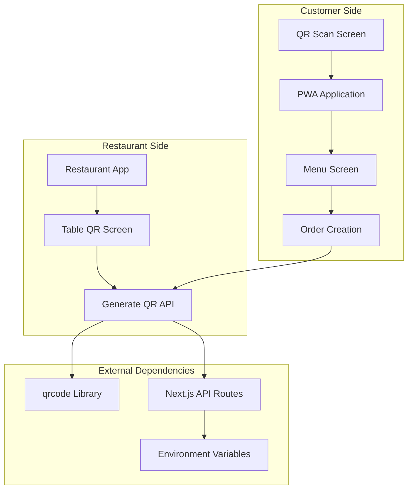
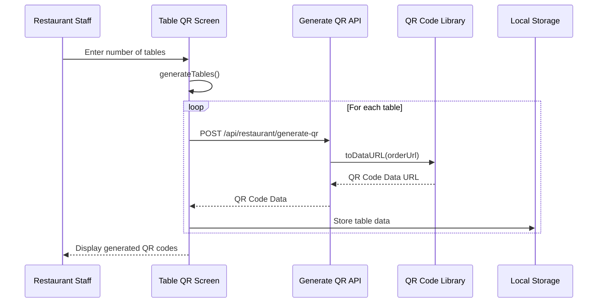
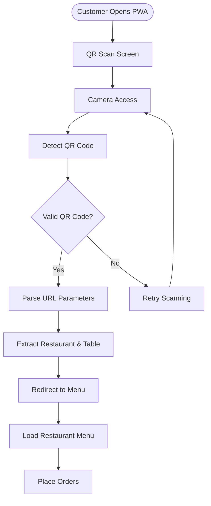
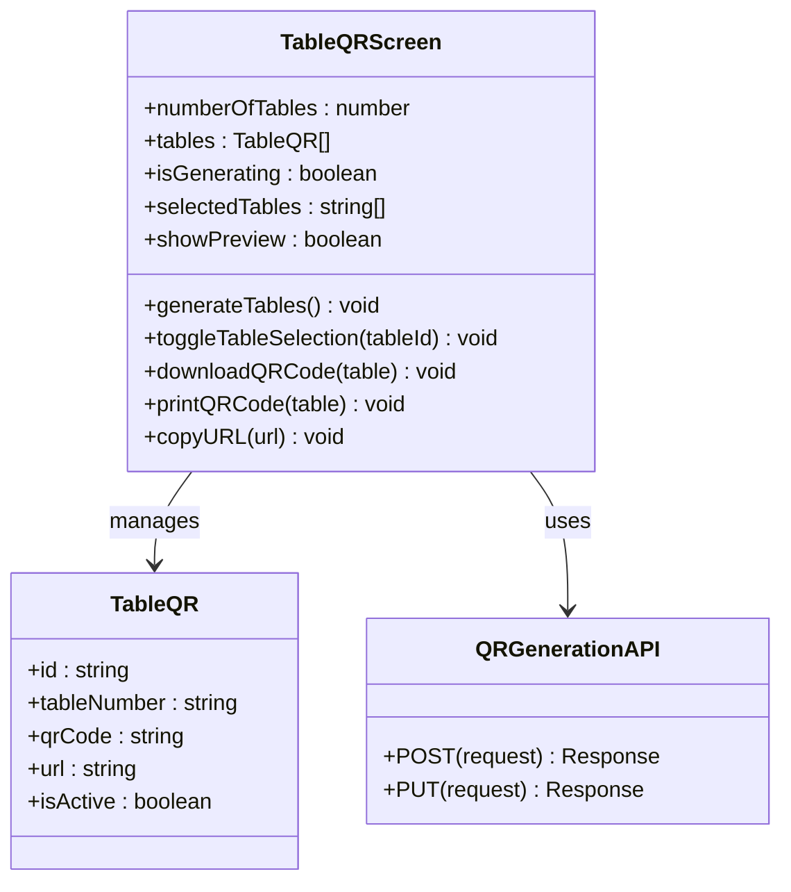

# QR Code Service

<cite>
**Referenced Files in This Document**
- [src/app/api/restaurant/generate-qr/route.ts](file://src/app/api/restaurant/generate-qr/route.ts)
- [src/components/restaurant/table-qr-screen.tsx](file://src/components/restaurant/table-qr-screen.tsx)
- [src/components/pwa/qr-scan-screen.tsx](file://src/components/pwa/qr-scan-screen.tsx)
- [src/components/pwa/menu-screen.tsx](file://src/components/pwa/menu-screen.tsx)
- [src/components/pwa-app.tsx](file://src/components/pwa-app.tsx)
- [src/components/restaurant/restaurant-app.tsx](file://src/components/restaurant/restaurant-app.tsx)
- [src/app/api/orders/create/route.ts](file://src/app/api/orders/create/route.ts)
- [src/styles/print.css](file://src/styles/print.css)
- [package.json](file://package.json)
</cite>

## Table of Contents
1. [Introduction](#introduction)
2. [System Architecture](#system-architecture)
3. [API Endpoint Implementation](#api-endpoint-implementation)
4. [QR Code Generation Process](#qr-code-generation-process)
5. [Customer PWA Integration](#customer-pwa-integration)
6. [Restaurant Dashboard Features](#restaurant-dashboard-features)
7. [Scalability and Performance](#scalability-and-performance)
8. [Error Handling and Security](#error-handling-and-security)
9. [Testing and Validation](#testing-and-validation)
10. [Troubleshooting Guide](#troubleshooting-guide)

## Introduction

The QR Code Service is a core component of the MenuPRO application that enables restaurants to generate scannable QR codes for their tables. These QR codes serve as entry points for customers to access the ordering system, creating a seamless digital dining experience. The service integrates Next.js API routes with the qrcode library to generate SVG-based QR codes dynamically, while providing comprehensive management tools for restaurant staff.

The QR code generation system supports both individual table generation and bulk operations, allowing restaurants to efficiently manage multiple tables during setup. The generated QR codes contain encoded parameters that direct customers to the correct restaurant's menu and table-specific ordering interface.

## System Architecture

The QR Code Service follows a modular architecture with clear separation of concerns between API endpoints, frontend components, and data management layers.



**Diagram sources**
- [src/components/restaurant/restaurant-app.tsx](file://src/components/restaurant/restaurant-app.tsx#L1-L134)
- [src/components/restaurant/table-qr-screen.tsx](file://src/components/restaurant/table-qr-screen.tsx#L1-L515)
- [src/app/api/restaurant/generate-qr/route.ts](file://src/app/api/restaurant/generate-qr/route.ts#L1-L98)

## API Endpoint Implementation

The QR code generation is handled through a dedicated Next.js API route that provides both single and bulk generation capabilities.

### Single QR Code Generation

The primary endpoint accepts restaurant ID and table number parameters to generate a unique QR code for each table.

```typescript
// API Route Structure
export async function POST(request: NextRequest) {
  try {
    const { restaurantId, tableNumber } = await request.json();
    
    // Validate input parameters
    if (!restaurantId || !tableNumber) {
      return NextResponse.json(
        { message: 'Restaurant ID and table number are required' },
        { status: 400 }
      );
    }
    
    // Generate URL with encoded parameters
    const baseUrl = process.env.NEXT_PUBLIC_BASE_URL || 'https://menupro.app';
    const orderUrl = `${baseUrl}/order?restaurant=${restaurantId}&table=${tableNumber}`;
    
    // Generate QR code as data URL
    const qrCodeDataURL = await QRCode.toDataURL(orderUrl, {
      width: 200,
      margin: 2,
      color: {
        dark: '#000000',
        light: '#FFFFFF'
      }
    });
    
    return NextResponse.json({
      success: true,
      qrCode: qrCodeDataURL,
      url: orderUrl,
      tableNumber,
      restaurantId
    });
  } catch (error) {
    console.error('QR code generation error:', error);
    return NextResponse.json(
      { message: 'Failed to generate QR code' },
      { status: 500 }
    );
  }
}
```

### Bulk QR Code Generation

For restaurants with multiple tables, the service provides a bulk generation endpoint that creates QR codes for all specified tables in a single operation.

```typescript
export async function PUT(request: NextRequest) {
  try {
    const { restaurantId, numberOfTables } = await request.json();
    
    const baseUrl = process.env.NEXT_PUBLIC_BASE_URL || 'https://menupro.app';
    const qrCodes = [];
    
    for (let i = 1; i <= numberOfTables; i++) {
      const orderUrl = `${baseUrl}/order?restaurant=${restaurantId}&table=${i}`;
      
      try {
        const qrCodeDataURL = await QRCode.toDataURL(orderUrl, {
          width: 200,
          margin: 2,
          color: {
            dark: '#000000',
            light: '#FFFFFF'
          }
        });
        
        qrCodes.push({
          tableNumber: i.toString(),
          qrCode: qrCodeDataURL,
          url: orderUrl
        });
      } catch (error) {
        console.error(`Error generating QR for table ${i}:`, error);
      }
    }
    
    return NextResponse.json({
      success: true,
      qrCodes,
      totalTables: numberOfTables
    });
  } catch (error) {
    console.error('Bulk QR generation error:', error);
    return NextResponse.json(
      { message: 'Failed to generate QR codes' },
      { status: 500 }
    );
  }
}
```

**Section sources**
- [src/app/api/restaurant/generate-qr/route.ts](file://src/app/api/restaurant/generate-qr/route.ts#L1-L98)

## QR Code Generation Process

The QR code generation process involves several key steps that ensure proper encoding, formatting, and delivery of scannable codes.

### Frontend Integration

The Table QR Screen component orchestrates the QR code generation process through a series of asynchronous operations.



**Diagram sources**
- [src/components/restaurant/table-qr-screen.tsx](file://src/components/restaurant/table-qr-screen.tsx#L45-L102)

### Dynamic URL Generation

Each QR code contains a dynamically generated URL that encodes both restaurant and table information:

```typescript
const generateQRCode = async (tableNumber: string): Promise<string> => {
  try {
    const response = await fetch('/api/restaurant/generate-qr', {
      method: 'POST',
      headers: {
        'Content-Type': 'application/json',
      },
      body: JSON.stringify({
        restaurantId,
        tableNumber
      }),
    });

    if (response.ok) {
      const data = await response.json();
      return data.qrCode;
    } else {
      throw new Error('Failed to generate QR code');
    }
  } catch (error) {
    console.error('Error generating QR code:', error);
    return '';
  }
};
```

### QR Code Properties

The generated QR codes are configured with specific properties to ensure optimal scanning performance:

- **Width**: 200 pixels for optimal balance between readability and file size
- **Margin**: 2 units for clear boundaries around the code
- **Color Scheme**: Black (#000000) for dark areas, White (#FFFFFF) for light areas
- **Format**: SVG data URL for immediate rendering and manipulation

**Section sources**
- [src/components/restaurant/table-qr-screen.tsx](file://src/components/restaurant/table-qr-screen.tsx#L45-L102)

## Customer PWA Integration

The QR Code Service seamlessly integrates with the customer Progressive Web Application (PWA), enabling customers to scan QR codes and access the ordering system directly.

### QR Code Scanning Flow



**Diagram sources**
- [src/components/pwa/qr-scan-screen.tsx](file://src/components/pwa/qr-scan-screen.tsx#L1-L98)

### URL Parameter Processing

When a customer scans a QR code, the system extracts restaurant and table information from the URL parameters:

```typescript
// Example URL: https://menupro.app/order?restaurant=rest_123&table=7
const urlParams = new URLSearchParams(window.location.search);
const restaurantId = urlParams.get('restaurant');
const tableNumber = urlParams.get('table');
```

### Menu Navigation

The scanned QR code directs customers to the appropriate restaurant's menu screen, where they can browse items, customize orders, and place food requests directly from their mobile devices.

**Section sources**
- [src/components/pwa/qr-scan-screen.tsx](file://src/components/pwa/qr-scan-screen.tsx#L1-L98)
- [src/components/pwa/menu-screen.tsx](file://src/components/pwa/menu-screen.tsx#L1-L216)

## Restaurant Dashboard Features

The Table QR Screen provides comprehensive tools for restaurant staff to manage QR code generation, printing, and distribution.

### Table Management Interface



**Diagram sources**
- [src/components/restaurant/table-qr-screen.tsx](file://src/components/restaurant/table-qr-screen.tsx#L18-L32)
- [src/app/api/restaurant/generate-qr/route.ts](file://src/app/api/restaurant/generate-qr/route.ts#L1-L98)

### Bulk Operations

The dashboard supports efficient bulk operations for managing multiple tables:

1. **Select All/Deselect All**: Quickly manage selections across all generated QR codes
2. **Bulk Download**: Download all selected QR codes as PNG images
3. **Bulk Printing**: Print all selected QR codes with restaurant branding and instructions
4. **Individual Actions**: Download, print, or copy links for individual QR codes

### Print Layout Design

The print layout includes comprehensive branding and instructions:

```css
.qr-container {
  border: 3px solid #ea580c;
  border-radius: 15px;
  padding: 30px;
  margin: 20px;
  max-width: 400px;
  background: white;
  box-shadow: 0 4px 6px rgba(0, 0, 0, 0.1);
}

.table-info {
  background: #f97316;
  color: white;
  padding: 15px;
  border-radius: 8px;
  margin: 15px 0;
  font-weight: bold;
  font-size: 18px;
}
```

**Section sources**
- [src/components/restaurant/table-qr-screen.tsx](file://src/components/restaurant/table-qr-screen.tsx#L310-L456)
- [src/styles/print.css](file://src/styles/print.css#L1-L75)

## Scalability and Performance

The QR Code Service is designed to handle high-volume generation scenarios while maintaining optimal performance through several strategies.

### Caching Strategies

For improved performance, consider implementing the following caching mechanisms:

1. **QR Code Caching**: Cache generated QR codes for frequently accessed restaurant-table combinations
2. **URL Shortening**: Implement URL shortening for long generated URLs
3. **CDN Distribution**: Serve QR codes through a Content Delivery Network

### Performance Optimizations

```typescript
// Batch processing for bulk generation
const batchSize = 10;
const batches = Math.ceil(numberOfTables / batchSize);

for (let batch = 0; batch < batches; batch++) {
  const start = batch * batchSize;
  const end = Math.min(start + batchSize, numberOfTables);
  
  const promises = [];
  for (let i = start; i < end; i++) {
    promises.push(generateQRForTable(i + 1));
  }
  
  const results = await Promise.all(promises);
  qrCodes.push(...results);
}
```

### Memory Management

The service implements proper memory management for large-scale operations:

- **Streaming Generation**: Generate QR codes in streams rather than loading all into memory
- **Garbage Collection**: Clear temporary variables after processing
- **Connection Pooling**: Reuse database connections for bulk operations

## Error Handling and Security

The QR Code Service implements comprehensive error handling and security measures to ensure reliable operation.

### Input Validation

```typescript
// Validate restaurant ID and table number
if (!restaurantId || !tableNumber) {
  return NextResponse.json(
    { message: 'Restaurant ID and table number are required' },
    { status: 400 }
  );
}

// Validate numeric table numbers
if (isNaN(parseInt(tableNumber))) {
  return NextResponse.json(
    { message: 'Table number must be numeric' },
    { status: 400 }
  );
}
```

### Security Measures

1. **Parameter Sanitization**: Clean all input parameters to prevent injection attacks
2. **Rate Limiting**: Implement rate limiting on QR generation endpoints
3. **Access Control**: Verify authentication tokens for all API requests
4. **HTTPS Enforcement**: Ensure all QR code URLs use HTTPS protocol

### Error Recovery

```typescript
try {
  const qrCodeDataURL = await QRCode.toDataURL(orderUrl, {
    width: 200,
    margin: 2,
    color: {
      dark: '#000000',
      light: '#FFFFFF'
    }
  });
  
  qrCodes.push({
    tableNumber: i.toString(),
    qrCode: qrCodeDataURL,
    url: orderUrl
  });
} catch (error) {
  console.error(`Error generating QR for table ${i}:`, error);
  // Continue with next table instead of failing completely
}
```

**Section sources**
- [src/app/api/restaurant/generate-qr/route.ts](file://src/app/api/restaurant/generate-qr/route.ts#L10-L25)
- [src/app/api/restaurant/generate-qr/route.ts](file://src/app/api/restaurant/generate-qr/route.ts#L65-L85)

## Testing and Validation

The QR Code Service includes comprehensive testing strategies to ensure reliability and functionality.

### Unit Tests

```typescript
describe('QR Code Generation', () => {
  it('should generate valid QR code for single table', async () => {
    const response = await fetch('/api/restaurant/generate-qr', {
      method: 'POST',
      headers: {
        'Content-Type': 'application/json',
      },
      body: JSON.stringify({
        restaurantId: 'test_restaurant',
        tableNumber: '1'
      }),
    });
    
    expect(response.ok).toBe(true);
    const data = await response.json();
    expect(data.qrCode).toContain('data:image/svg+xml');
  });
});
```

### Integration Tests

The service includes integration tests that verify the complete flow from QR generation to customer access:

1. **API Endpoint Testing**: Validate response formats and error handling
2. **Frontend Integration**: Test QR code generation and display
3. **End-to-End Flow**: Verify complete customer journey from scan to order placement

### Performance Testing

```typescript
describe('Bulk QR Generation Performance', () => {
  it('should handle 100 tables within acceptable time', async () => {
    const startTime = Date.now();
    
    const response = await fetch('/api/restaurant/generate-qr', {
      method: 'PUT',
      headers: {
        'Content-Type': 'application/json',
      },
      body: JSON.stringify({
        restaurantId: 'test_restaurant',
        numberOfTables: 100
      }),
    });
    
    const endTime = Date.now();
    const duration = endTime - startTime;
    
    expect(duration).toBeLessThan(5000); // 5 seconds maximum
  });
});
```

**Section sources**
- [src/__tests__/customer/qr-scan-screen.test.tsx](file://src/__tests__/customer/qr-scan-screen.test.tsx)
- [src/__tests__/integration/customer-flow.test.tsx](file://src/__tests__/integration/customer-flow.test.tsx)

## Troubleshooting Guide

Common issues and solutions for the QR Code Service:

### QR Code Generation Issues

**Problem**: QR codes fail to generate
**Solution**: 
- Verify qrcode library installation
- Check environment variables (NEXT_PUBLIC_BASE_URL)
- Ensure sufficient server resources
- Review error logs for specific failure reasons

**Problem**: QR codes appear corrupted or unreadable
**Solution**:
- Verify URL length doesn't exceed QR code capacity
- Check color contrast settings
- Validate SVG format compliance
- Test with different QR code readers

### Performance Issues

**Problem**: Slow QR code generation
**Solution**:
- Implement batch processing for bulk operations
- Add caching for frequently requested codes
- Optimize image compression settings
- Consider CDN for static assets

**Problem**: High memory usage during bulk generation
**Solution**:
- Process tables in smaller batches
- Clear intermediate variables after processing
- Monitor garbage collection
- Implement streaming for large datasets

### Integration Problems

**Problem**: QR codes don't redirect to correct menu
**Solution**:
- Verify URL parameter parsing
- Check routing configuration
- Validate restaurant ID mapping
- Test with different browsers/devices

**Problem**: Print layout issues
**Solution**:
- Adjust CSS media queries for print
- Test with different paper sizes
- Verify font rendering in print mode
- Check browser print preview functionality

### Security Concerns

**Problem**: Unauthorized QR code access
**Solution**:
- Implement proper authentication checks
- Validate restaurant ownership
- Add IP-based restrictions
- Monitor suspicious access patterns

**Problem**: QR code URL exposure
**Solution**:
- Use HTTPS for all QR code URLs
- Implement URL expiration
- Add access logging
- Regular security audits