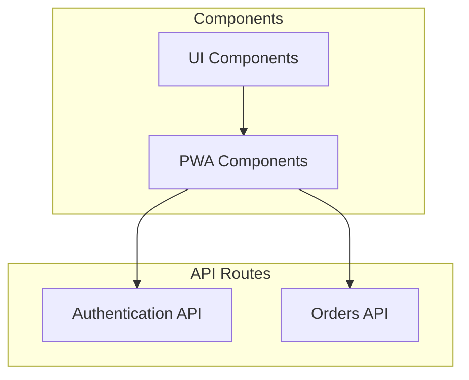
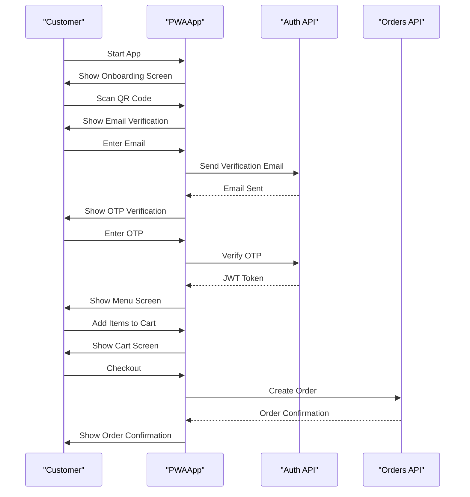
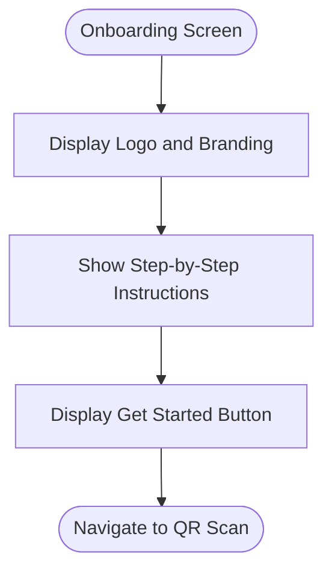
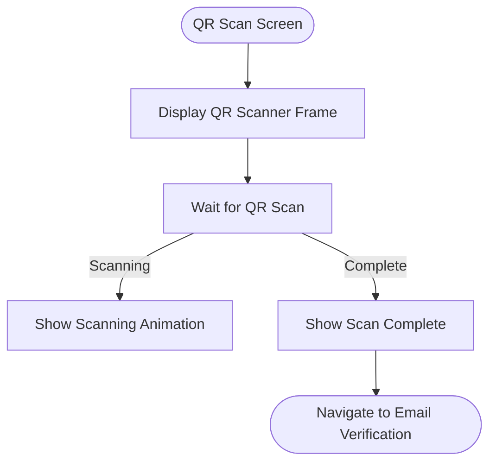
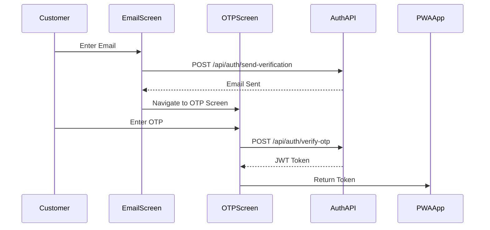
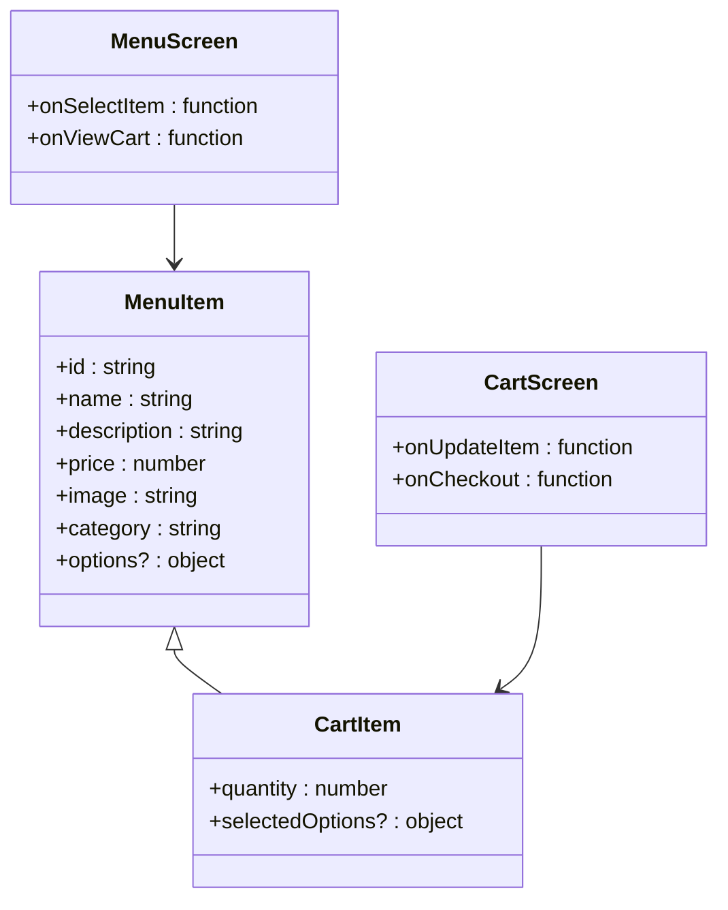
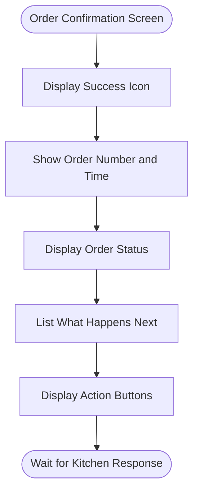
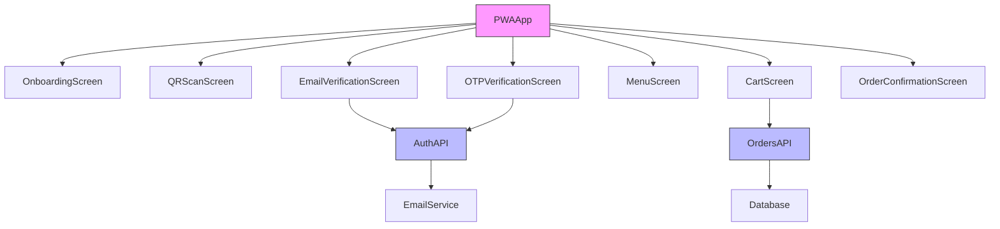
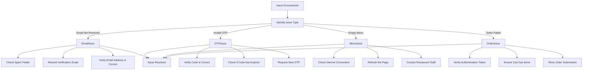

# Customer Ordering Flow

<cite>
**Referenced Files in This Document**   
- [pwa-app.tsx](file://src/components/pwa-app.tsx)
- [onboarding-screen.tsx](file://src/components/pwa/onboarding-screen.tsx)
- [qr-scan-screen.tsx](file://src/components/pwa/qr-scan-screen.tsx)
- [email-verification-screen.tsx](file://src/components/pwa/email-verification-screen.tsx)
- [otp-verification-screen.tsx](file://src/components/pwa/otp-verification-screen.tsx)
- [menu-screen.tsx](file://src/components/pwa/menu-screen.tsx)
- [cart-screen.tsx](file://src/components/pwa/cart-screen.tsx)
- [order-confirmation-screen.tsx](file://src/components/pwa/order-confirmation-screen.tsx)
- [route.ts](file://src/app/api/auth/send-verification/route.ts)
- [route.ts](file://src/app/api/auth/verify-otp/route.ts)
- [route.ts](file://src/app/api/orders/create/route.ts)
</cite>

## Table of Contents
1. [Introduction](#introduction)
2. [Project Structure](#project-structure)
3. [Core Components](#core-components)
4. [Architecture Overview](#architecture-overview)
5. [Detailed Component Analysis](#detailed-component-analysis)
6. [Dependency Analysis](#dependency-analysis)
7. [Performance Considerations](#performance-considerations)
8. [Troubleshooting Guide](#troubleshooting-guide)
9. [Conclusion](#conclusion)

## Introduction
This document provides a comprehensive analysis of the customer ordering flow in the MenuPRO application. The flow begins with the onboarding screen and progresses through QR scanning, email and OTP verification, menu browsing, cart management, and order confirmation. The documentation covers state transitions, navigation logic, error handling, and integration with backend services for authentication and order processing.

## Project Structure

**Diagram sources**
- [pwa-app.tsx](file://src/components/pwa-app.tsx)
- [route.ts](file://src/app/api/auth/send-verification/route.ts)
- [route.ts](file://src/app/api/orders/create/route.ts)

**Section sources**
- [pwa-app.tsx](file://src/components/pwa-app.tsx)
- [components](file://src/components)

## Core Components

The customer ordering flow consists of several key components that work together to provide a seamless experience. The PWAApp component serves as the central controller, managing state and navigation between different screens. Each screen component is responsible for a specific part of the ordering process, from initial access to order confirmation.

**Section sources**
- [pwa-app.tsx](file://src/components/pwa-app.tsx)
- [onboarding-screen.tsx](file://src/components/pwa/onboarding-screen.tsx)
- [qr-scan-screen.tsx](file://src/components/pwa/qr-scan-screen.tsx)

## Architecture Overview

**Diagram sources**
- [pwa-app.tsx](file://src/components/pwa-app.tsx)
- [route.ts](file://src/app/api/auth/send-verification/route.ts)
- [route.ts](file://src/app/api/auth/verify-otp/route.ts)
- [route.ts](file://src/app/api/orders/create/route.ts)

## Detailed Component Analysis

### Onboarding Screen Analysis

The onboarding screen serves as the entry point to the customer ordering flow. It provides a simple interface that guides users through the initial steps of the process.

**Diagram sources**
- [onboarding-screen.tsx](file://src/components/pwa/onboarding-screen.tsx)

**Section sources**
- [onboarding-screen.tsx](file://src/components/pwa/onboarding-screen.tsx)

### QR Scan Screen Analysis

The QR scan screen enables table identification by scanning a QR code. This screen provides visual feedback during the scanning process.

**Diagram sources**
- [qr-scan-screen.tsx](file://src/components/pwa/qr-scan-screen.tsx)

**Section sources**
- [qr-scan-screen.tsx](file://src/components/pwa/qr-scan-screen.tsx)

### Email and OTP Verification Analysis

The email and OTP verification screens handle customer authentication. These screens work together to verify the customer's identity before allowing access to the menu.

**Diagram sources**
- [email-verification-screen.tsx](file://src/components/pwa/email-verification-screen.tsx)
- [otp-verification-screen.tsx](file://src/components/pwa/otp-verification-screen.tsx)
- [route.ts](file://src/app/api/auth/send-verification/route.ts)
- [route.ts](file://src/app/api/auth/verify-otp/route.ts)

**Section sources**
- [email-verification-screen.tsx](file://src/components/pwa/email-verification-screen.tsx)
- [otp-verification-screen.tsx](file://src/components/pwa/otp-verification-screen.tsx)

### Menu and Cart Management Analysis

The menu and cart screens enable customers to browse items, add them to their cart, and manage their selections before checkout.

**Diagram sources**
- [menu-screen.tsx](file://src/components/pwa/menu-screen.tsx)
- [cart-screen.tsx](file://src/components/pwa/cart-screen.tsx)
- [pwa-app.tsx](file://src/components/pwa-app.tsx)

**Section sources**
- [menu-screen.tsx](file://src/components/pwa/menu-screen.tsx)
- [cart-screen.tsx](file://src/components/pwa/cart-screen.tsx)

### Order Confirmation Analysis

The order confirmation screen provides feedback after a successful order submission, showing order details and next steps.

**Diagram sources**
- [order-confirmation-screen.tsx](file://src/components/pwa/order-confirmation-screen.tsx)

**Section sources**
- [order-confirmation-screen.tsx](file://src/components/pwa/order-confirmation-screen.tsx)

## Dependency Analysis

**Diagram sources**
- [pwa-app.tsx](file://src/components/pwa-app.tsx)
- [route.ts](file://src/app/api/auth/send-verification/route.ts)
- [route.ts](file://src/app/api/orders/create/route.ts)

**Section sources**
- [pwa-app.tsx](file://src/components/pwa-app.tsx)
- [route.ts](file://src/app/api/auth/send-verification/route.ts)
- [route.ts](file://src/app/api/orders/create/route.ts)

## Performance Considerations

The customer ordering flow is designed with mobile performance in mind. Key performance considerations include:

- **Fast Rendering**: Components use React's useState for efficient state management
- **Optimized Images**: ImageWithFallback component ensures images load properly
- **Minimal Re-renders**: Components are designed to minimize unnecessary re-renders
- **Efficient State Management**: The PWAApp component centralizes state to reduce prop drilling
- **Lazy Loading**: Screens are rendered only when needed based on the current screen state

For optimal mobile performance, the application should:
- Minimize bundle size through code splitting
- Optimize image assets for mobile networks
- Implement proper caching strategies
- Use efficient event handling to prevent memory leaks
- Optimize API calls to reduce latency

**Section sources**
- [pwa-app.tsx](file://src/components/pwa-app.tsx)
- [menu-screen.tsx](file://src/components/pwa/menu-screen.tsx)
- [cart-screen.tsx](file://src/components/pwa/cart-screen.tsx)

## Troubleshooting Guide

Common issues in the customer ordering flow and their solutions:

**Section sources**
- [email-verification-screen.tsx](file://src/components/pwa/email-verification-screen.tsx)
- [otp-verification-screen.tsx](file://src/components/pwa/otp-verification-screen.tsx)
- [menu-screen.tsx](file://src/components/pwa/menu-screen.tsx)
- [cart-screen.tsx](file://src/components/pwa/cart-screen.tsx)

## Conclusion

The customer ordering flow in MenuPRO provides a seamless experience from initial access to order confirmation. The flow is well-structured with clear state transitions between screens, proper error handling, and integration with backend services for authentication and order processing. The component-based architecture allows for easy maintenance and extension of functionality. Key strengths include the intuitive user interface, robust authentication process, and clear feedback at each step of the ordering process.