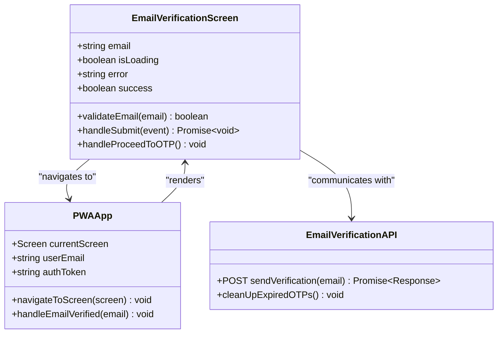
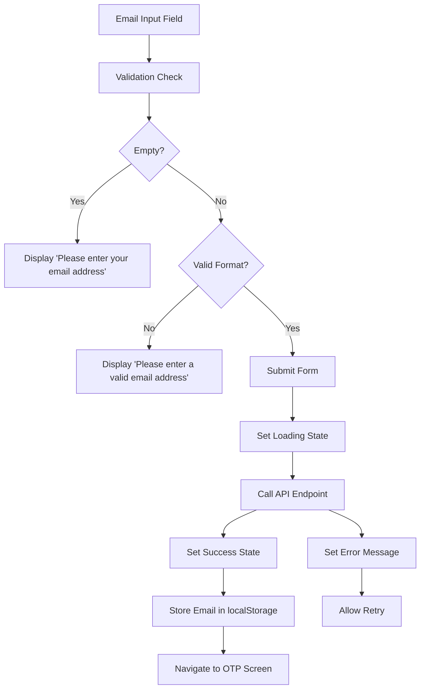
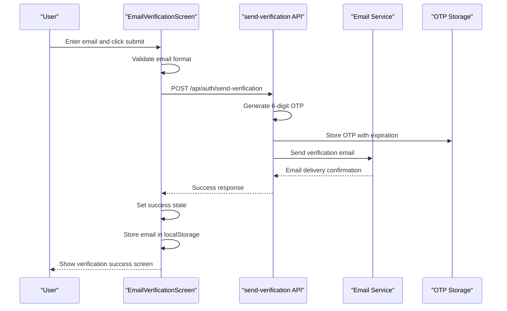
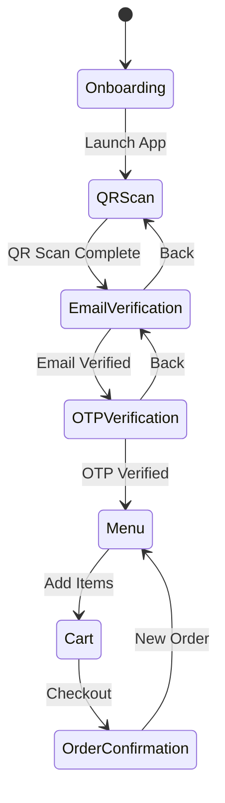

# Email Verification Screen

<cite>
**Referenced Files in This Document**
- [email-verification-screen.tsx](file://src/components/pwa/email-verification-screen.tsx)
- [send-verification/route.ts](file://src/app/api/auth/send-verification/route.ts)
- [pwa-app.tsx](file://src/components/pwa-app.tsx)
- [otp-verification-screen.tsx](file://src/components/pwa/otp-verification-screen.tsx)
- [qr-scan-screen.tsx](file://src/components/qr-scan-screen.tsx)
- [onboarding-screen.tsx](file://src/components/onboarding-screen.tsx)
- [email-verification-screen.test.tsx](file://src/__tests__/customer/email-verification-screen.test.tsx)
- [form.tsx](file://src/components/ui/form.tsx)
</cite>

## Table of Contents
1. [Introduction](#introduction)
2. [Component Architecture](#component-architecture)
3. [Form Validation and Input Handling](#form-validation-and-input-handling)
4. [State Management](#state-management)
5. [API Integration](#api-integration)
6. [Navigation Flow](#navigation-flow)
7. [Error Handling](#error-handling)
8. [Accessibility and Testing](#accessibility-and-testing)
9. [Best Practices](#best-practices)
10. [Common Issues and Solutions](#common-issues-and-solutions)

## Introduction

The Email Verification Screen is a critical component in the MenuPRO PWA's identity verification pipeline. It serves as the initial gatekeeper for customer ordering, requiring users to provide their email address to prevent spam orders and ensure a legitimate dining experience. The component manages the complete email verification workflow, from form submission to success state transitions.

This component integrates seamlessly with the global PWAApp state management system and coordinates with backend APIs to send verification emails containing six-digit OTP codes. The screen provides comprehensive validation, loading states, error handling, and accessibility features while maintaining a clean, modern user interface.

## Component Architecture

The Email Verification Screen follows a React functional component pattern with hooks for state management and lifecycle control. The component is designed as a controlled form with comprehensive validation logic and seamless integration with the application's navigation system.



**Diagram sources**
- [email-verification-screen.tsx](file://src/components/pwa/email-verification-screen.tsx#L1-L194)
- [pwa-app.tsx](file://src/components/pwa-app.tsx#L29-L154)
- [send-verification/route.ts](file://src/app/api/auth/send-verification/route.ts#L1-L98)

**Section sources**
- [email-verification-screen.tsx](file://src/components/pwa/email-verification-screen.tsx#L1-L194)
- [pwa-app.tsx](file://src/components/pwa-app.tsx#L29-L154)

## Form Validation and Input Handling

The component implements robust email validation using a sophisticated regex pattern that ensures proper email format compliance. The validation logic is encapsulated in a dedicated validation function that checks for the presence of an "@" symbol, domain separation, and proper extension length.

```typescript
const validateEmail = (email: string) => {
  const emailRegex = /^[^\s@]+@[^\s@]+\.[^\s@]+$/;
  return emailRegex.test(email);
};
```

The form input utilizes a Material Design-inspired approach with visual feedback and accessibility features:



**Diagram sources**
- [email-verification-screen.tsx](file://src/components/pwa/email-verification-screen.tsx#L18-L39)

**Section sources**
- [email-verification-screen.tsx](file://src/components/pwa/email-verification-screen.tsx#L18-L39)

## State Management

The component manages four primary states using React's useState hook:

1. **Email State**: Stores the user's input email address
2. **Loading State**: Controls form submission and API calls
3. **Error State**: Displays validation and API errors
4. **Success State**: Manages the transition to verification completion

```typescript
const [email, setEmail] = useState("");
const [isLoading, setIsLoading] = useState(false);
const [error, setError] = useState("");
const [success, setSuccess] = useState(false);
```

The state management follows a unidirectional data flow pattern where user actions trigger state updates that automatically re-render the component with appropriate UI feedback.

**Section sources**
- [email-verification-screen.tsx](file://src/components/pwa/email-verification-screen.tsx#L11-L16)

## API Integration

The email verification process integrates with the backend API through a dedicated endpoint that handles email delivery and OTP generation. The API implementation demonstrates robust error handling and security measures.



**Diagram sources**
- [email-verification-screen.tsx](file://src/components/pwa/email-verification-screen.tsx#L39-L60)
- [send-verification/route.ts](file://src/app/api/auth/send-verification/route.ts#L18-L97)

The API endpoint implements several security and reliability features:

- **OTP Generation**: Cryptographically secure random 6-digit codes
- **Expiration Management**: Automatic cleanup of expired OTPs every 5 minutes
- **Rate Limiting**: Built-in protection against abuse
- **Error Handling**: Comprehensive error logging and user-friendly messages

**Section sources**
- [send-verification/route.ts](file://src/app/api/auth/send-verification/route.ts#L1-L98)

## Navigation Flow

The Email Verification Screen operates within a larger navigation flow managed by the PWAApp component. The screen receives callbacks for navigation events and maintains integration with the global application state.



**Diagram sources**
- [pwa-app.tsx](file://src/components/pwa-app.tsx#L95-L154)

The navigation logic in PWAApp demonstrates the component-based architecture:

```typescript
const handleEmailVerified = (email: string) => {
  setUserEmail(email);
  setCurrentScreen('otp-verification');
};
```

**Section sources**
- [pwa-app.tsx](file://src/components/pwa-app.tsx#L95-L100)

## Error Handling

The component implements comprehensive error handling for various failure scenarios:

1. **Validation Errors**: Immediate feedback for invalid email formats
2. **Network Errors**: Graceful handling of API communication failures
3. **Rate Limiting**: Clear messaging for exceeded request limits
4. **System Errors**: Generic error messages for unexpected failures

```typescript
try {
  // Mock email sending - just show success after a brief delay
  await new Promise(resolve => setTimeout(resolve, 1000));
  setSuccess(true);
  // Store email in localStorage for OTP verification
  localStorage.setItem('pendingEmail', email);
} catch (error) {
  setError("Network error. Please try again.");
} finally {
  setIsLoading(false);
}
```

The error handling strategy prioritizes user experience by providing clear, actionable messages and maintaining form state during error conditions.

**Section sources**
- [email-verification-screen.tsx](file://src/components/pwa/email-verification-screen.tsx#L39-L60)

## Accessibility and Testing

The component incorporates comprehensive accessibility features and extensive testing coverage:

### Accessibility Features

- **Semantic HTML**: Proper heading hierarchy and form labeling
- **ARIA Attributes**: Appropriate roles and states for interactive elements
- **Keyboard Navigation**: Full keyboard support for form controls
- **Screen Reader Support**: Descriptive labels and error announcements

### Testing Coverage

The component includes comprehensive unit tests covering:

- **UI Rendering**: All screen states and elements
- **Form Validation**: Both valid and invalid input scenarios
- **User Interactions**: Click events and form submissions
- **State Transitions**: Loading, success, and error states
- **Accessibility**: Proper ARIA attributes and keyboard navigation

**Section sources**
- [email-verification-screen.test.tsx](file://src/__tests__/customer/email-verification-screen.test.tsx#L1-L192)

## Best Practices

### Form Design Principles

1. **Clear Labeling**: Descriptive labels for all form inputs
2. **Visual Feedback**: Immediate indication of validation status
3. **Progressive Disclosure**: Information presented in logical sequence
4. **Mobile Optimization**: Touch-friendly input areas and responsive design

### Security Considerations

1. **Input Sanitization**: Proper email format validation
2. **State Isolation**: Local storage usage for temporary data
3. **Error Message Protection**: Generic error messages to prevent information leakage
4. **Rate Limiting**: Built-in protection against abuse

### Performance Optimization

1. **Minimal Re-renders**: Efficient state management and conditional rendering
2. **Lazy Loading**: Images and external resources loaded progressively
3. **Memory Management**: Cleanup of temporary data and event listeners

## Common Issues and Solutions

### Invalid Email Formats

**Problem**: Users entering malformed email addresses
**Solution**: Real-time validation with immediate feedback and clear error messages

### Network Connectivity Issues

**Problem**: API requests failing due to poor connectivity
**Solution**: Robust error handling with retry mechanisms and user-friendly messaging

### Rate Limiting

**Problem**: Users exceeding verification request limits
**Solution**: Clear messaging about rate limits with guidance on timing

### Mobile Responsiveness

**Problem**: Poor user experience on mobile devices
**Solution**: Responsive design with touch-optimized controls and adequate spacing

### Browser Compatibility

**Problem**: Inconsistent behavior across different browsers
**Solution**: Standardized form controls and polyfills for unsupported features

The Email Verification Screen demonstrates excellent implementation of modern web development practices, combining user experience excellence with robust technical architecture. Its integration with the broader MenuPRO ecosystem showcases effective component composition and state management patterns.