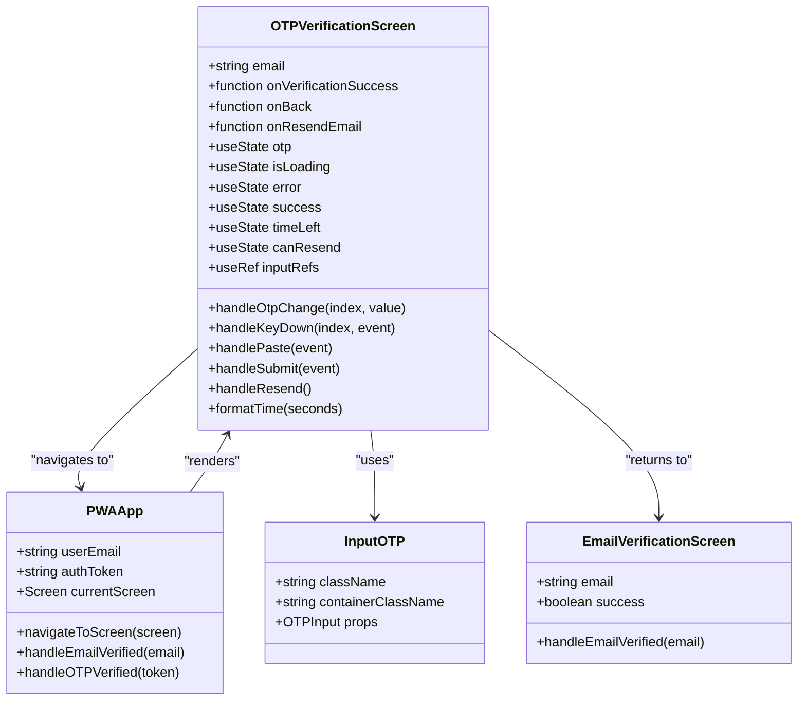
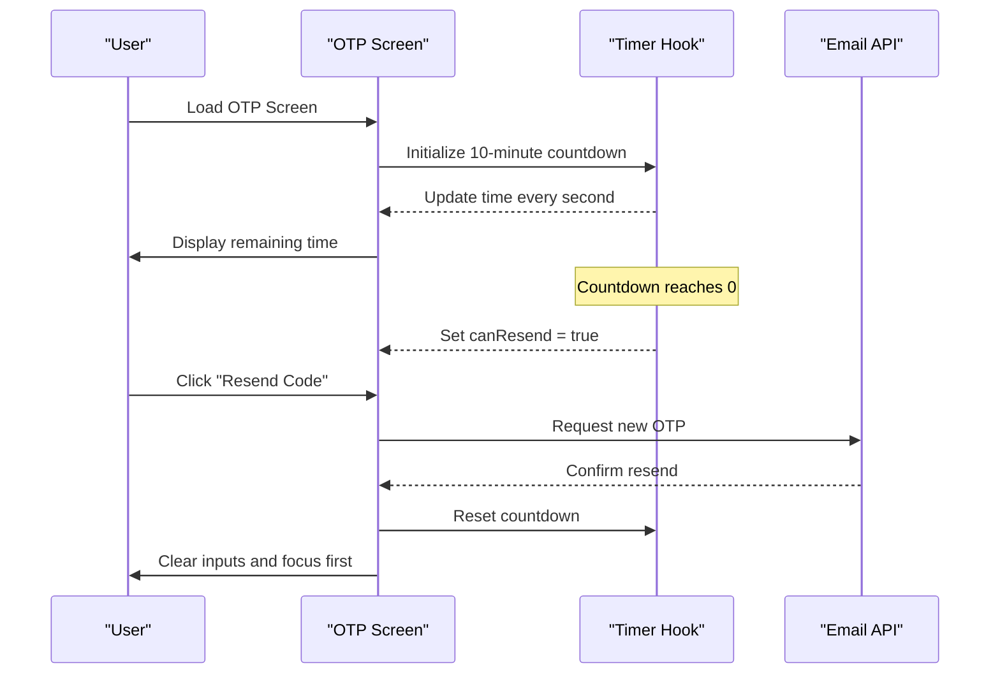
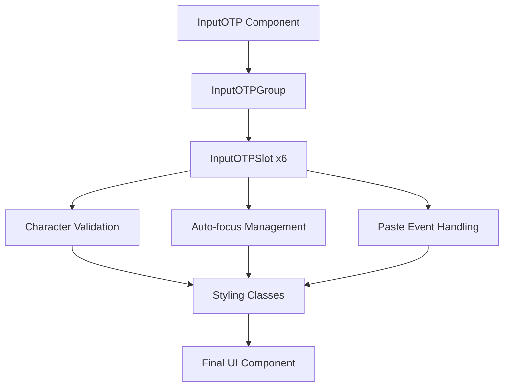
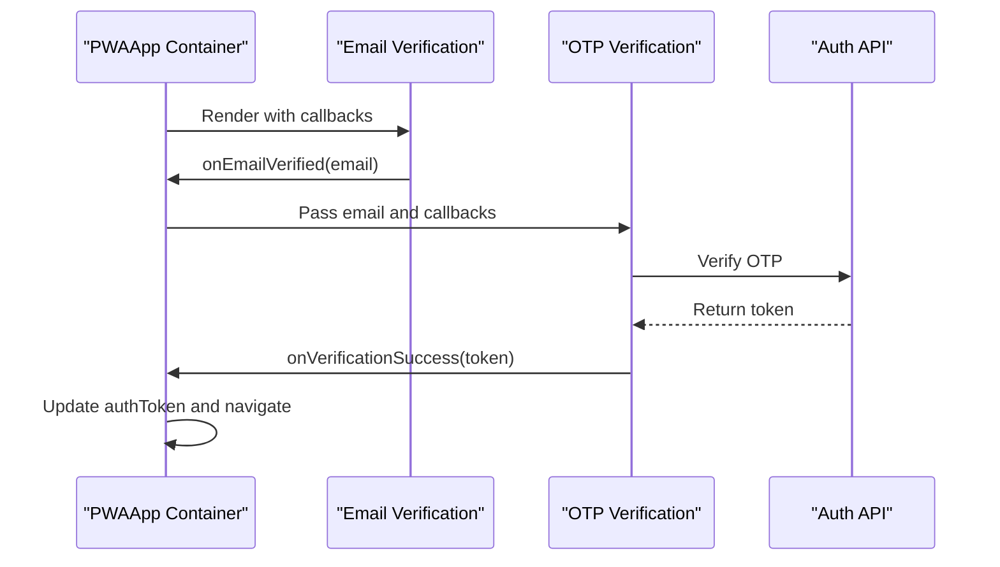
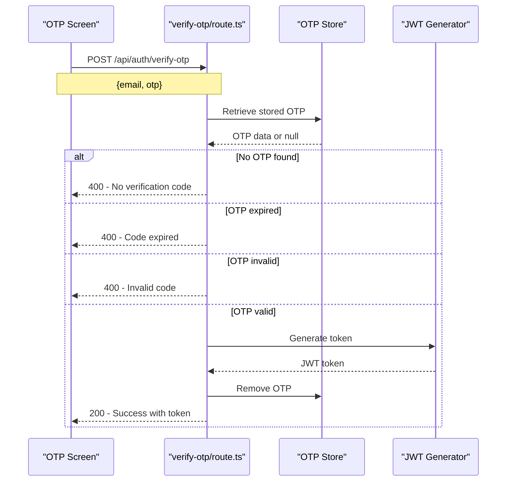

# OTP Verification Screen Component

<cite>
**Referenced Files in This Document**
- [otp-verification-screen.tsx](file://src/components/pwa/otp-verification-screen.tsx)
- [input-otp.tsx](file://src/components/ui/input-otp.tsx)
- [pwa-app.tsx](file://src/components/pwa-app.tsx)
- [email-verification-screen.tsx](file://src/components/pwa/email-verification-screen.tsx)
- [verify-otp/route.ts](file://src/app/api/auth/verify-otp/route.ts)
- [send-verification/route.ts](file://src/app/api/auth/send-verification/route.ts)
</cite>

## Table of Contents
1. [Introduction](#introduction)
2. [Component Architecture](#component-architecture)
3. [Core Features](#core-features)
4. [Implementation Details](#implementation-details)
5. [Integration with UI Library](#integration-with-ui-library)
6. [State Management](#state-management)
7. [API Integration](#api-integration)
8. [Error Handling](#error-handling)
9. [UX Considerations](#ux-considerations)
10. [Testing Strategy](#testing-strategy)
11. [Best Practices](#best-practices)

## Introduction

The OTP Verification Screen is a critical component in the MenuPRO application's authentication flow, designed to confirm user identity after email verification. This component provides a secure and user-friendly interface for entering one-time passwords (OTP) sent to users' email addresses, serving as the final barrier before granting access to the digital menu system.

The component integrates seamlessly with the application's state management system and provides robust error handling, countdown timers, and resend functionality to enhance the user experience while maintaining security standards.

## Component Architecture

The OTP Verification Screen follows a modular architecture that separates concerns between UI presentation, state management, and business logic.



**Diagram sources**
- [otp-verification-screen.tsx](file://src/components/pwa/otp-verification-screen.tsx#L16-L257)
- [pwa-app.tsx](file://src/components/pwa-app.tsx#L30-L153)

**Section sources**
- [otp-verification-screen.tsx](file://src/components/pwa/otp-verification-screen.tsx#L1-L259)
- [pwa-app.tsx](file://src/components/pwa-app.tsx#L30-L153)

## Core Features

### OTP Input Management

The component provides sophisticated OTP input handling with the following capabilities:

- **Individual Digit Inputs**: Six separate input fields for each digit of the OTP
- **Auto-Focus Navigation**: Automatic focus movement between inputs for seamless typing
- **Paste Support**: Full support for pasting OTP codes with intelligent parsing
- **Backspace Navigation**: Keyboard navigation using backspace to move between inputs
- **Validation**: Real-time validation of input length and character format

### Timer and Resend Functionality



**Diagram sources**
- [otp-verification-screen.tsx](file://src/components/pwa/otp-verification-screen.tsx#L25-L35)
- [send-verification/route.ts](file://src/app/api/auth/send-verification/route.ts#L15-L25)

### Success and Error States

The component manages multiple visual states to guide users through the verification process:

- **Loading State**: Disabled inputs and loading indicators during API calls
- **Success State**: Confirmation screen with welcome message
- **Error State**: Clear error messaging with appropriate styling
- **Timer State**: Visual indication of remaining verification time

**Section sources**
- [otp-verification-screen.tsx](file://src/components/pwa/otp-verification-screen.tsx#L47-L129)

## Implementation Details

### State Management

The component uses React's `useState` hook to manage various pieces of state:

```typescript
const [otp, setOtp] = useState(["", "", "", "", "", ""]);
const [isLoading, setIsLoading] = useState(false);
const [error, setError] = useState("");
const [success, setSuccess] = useState(false);
const [timeLeft, setTimeLeft] = useState(600); // 10 minutes
const [canResend, setCanResend] = useState(false);
```

### Input Handling Logic

The component implements sophisticated input handling to ensure optimal user experience:

```typescript
const handleOtpChange = (index: number, value: string) => {
  if (value.length > 1) return; // Prevent multiple characters
  
  const newOtp = [...otp];
  newOtp[index] = value;
  setOtp(newOtp);

  // Auto-focus next input
  if (value && index < 5) {
    inputRefs.current[index + 1]?.focus();
  }
};
```

### Paste Event Handling

The component supports clipboard paste operations with intelligent parsing:

```typescript
const handlePaste = (e: React.ClipboardEvent) => {
  e.preventDefault();
  const pastedData = e.clipboardData.getData('text').replace(/\D/g, '').slice(0, 6);
  const newOtp = [...otp];
  
  for (let i = 0; i < pastedData.length && i < 6; i++) {
    newOtp[i] = pastedData[i];
  }
  
  setOtp(newOtp);
  
  // Focus the next empty input or the last one
  const nextEmptyIndex = newOtp.findIndex(digit => digit === '');
  const focusIndex = nextEmptyIndex === -1 ? 5 : nextEmptyIndex;
  inputRefs.current[focusIndex]?.focus();
};
```

**Section sources**
- [otp-verification-screen.tsx](file://src/components/pwa/otp-verification-screen.tsx#L47-L75)

## Integration with UI Library

The component leverages the `input-otp` component from the UI library for enhanced functionality and consistent styling.



**Diagram sources**
- [input-otp.tsx](file://src/components/ui/input-otp.tsx#L8-L25)

The UI library component provides:

- **Accessibility Support**: Proper ARIA attributes and keyboard navigation
- **Visual Feedback**: Active state highlighting and focus indicators
- **Responsive Design**: Consistent appearance across devices
- **Theme Integration**: Seamless integration with Tailwind CSS classes

**Section sources**
- [input-otp.tsx](file://src/components/ui/input-otp.tsx#L1-L78)

## State Synchronization with PWAApp Container

The OTP Verification Screen integrates with the PWAApp container through a well-defined prop-based communication system:



**Diagram sources**
- [pwa-app.tsx](file://src/components/pwa-app.tsx#L75-L85)
- [otp-verification-screen.tsx](file://src/components/pwa/otp-verification-screen.tsx#L16-L25)

The integration provides:

- **Email Propagation**: Email address passed from previous screen
- **Callback Functions**: Success, back, and resend handlers
- **State Persistence**: Maintained across navigation transitions
- **Error Propagation**: Error messages passed back to parent

**Section sources**
- [pwa-app.tsx](file://src/components/pwa-app.tsx#L75-L85)
- [otp-verification-screen.tsx](file://src/components/pwa/otp-verification-screen.tsx#L16-L25)

## API Integration

The component communicates with backend APIs for OTP verification and resend functionality.

### OTP Verification Endpoint



**Diagram sources**
- [verify-otp/route.ts](file://src/app/api/auth/verify-otp/route.ts#L10-L77)

### Email Resend Endpoint

The resend functionality triggers a new OTP generation and email delivery:

```typescript
// Mock resend implementation
const handleResend = async () => {
  setIsLoading(true);
  setError("");
  
  try {
    // Mock resend - just reset the form
    await new Promise(resolve => setTimeout(resolve, 500));
    setTimeLeft(600);
    setCanResend(false);
    setOtp(["", "", "", "", "", ""]);
    // Focus first input
    inputRefs.current[0]?.focus();
  } catch (error) {
    setError("Network error. Please try again.");
  } finally {
    setIsLoading(false);
  }
};
```

**Section sources**
- [verify-otp/route.ts](file://src/app/api/auth/verify-otp/route.ts#L10-L77)
- [otp-verification-screen.tsx](file://src/components/pwa/otp-verification-screen.tsx#L104-L129)

## Error Handling

The component implements comprehensive error handling for various scenarios:

### Common Error Scenarios

1. **Incomplete OTP Entry**: Validation prevents submission until all six digits are entered
2. **Invalid OTP Codes**: Clear error messaging for incorrect codes
3. **Expired OTPs**: Graceful handling of expired verification codes
4. **Network Failures**: Robust error handling for API communication issues
5. **System Errors**: Generic error handling for unexpected failures

### Error Display Strategy

```typescript
// Error state management
const [error, setError] = useState("");

// Error display in UI
{error && (
  <div className="text-red-600 text-sm text-center bg-red-50 p-3 rounded-lg">
    {error}
  </div>
)}

// Error handling in submit
try {
  // OTP verification logic
} catch (error) {
  setError("Network error. Please try again.");
} finally {
  setIsLoading(false);
}
```

**Section sources**
- [otp-verification-screen.tsx](file://src/components/pwa/otp-verification-screen.tsx#L92-L103)

## UX Considerations

### Countdown Timer Implementation

The component includes a visual countdown timer to inform users of remaining verification time:

```typescript
const formatTime = (seconds: number) => {
  const mins = Math.floor(seconds / 60);
  const secs = seconds % 60;
  return `${mins}:${secs.toString().padStart(2, '0')}`;
};

// Timer effect
useEffect(() => {
  if (timeLeft > 0) {
    const timer = setTimeout(() => setTimeLeft(timeLeft - 1), 1000);
    return () => clearTimeout(timer);
  } else {
    setCanResend(true);
  }
}, [timeLeft]);
```

### Resend Functionality

The component provides intuitive resend functionality with clear visual feedback:

- **Timer Display**: Shows remaining time until resend option becomes available
- **Visual Indicators**: Changes button appearance when resend is enabled
- **Smooth Transitions**: Animated transitions between states
- **Accessibility**: Proper ARIA labels and keyboard navigation

### Demo Mode Support

The component includes built-in demo mode functionality for development and testing:

```typescript
// Mock OTP verification - accept "123456" as valid code
if (otpCode === "123456") {
  setSuccess(true);
  setTimeout(() => {
    onVerificationSuccess("mock-token-123456");
  }, 1500);
} else {
  setError("Invalid verification code. Please enter 123456 for demo purposes.");
}
```

**Section sources**
- [otp-verification-screen.tsx](file://src/components/pwa/otp-verification-screen.tsx#L25-L35)
- [otp-verification-screen.tsx](file://src/components/pwa/otp-verification-screen.tsx#L92-L103)

## Testing Strategy

The component includes comprehensive test coverage for all major functionality:

### Test Coverage Areas

1. **Basic Rendering**: Ensures component renders with all required elements
2. **Input Handling**: Tests individual digit input and navigation
3. **Paste Functionality**: Validates clipboard paste operations
4. **Form Submission**: Tests successful and failed verification attempts
5. **Error Handling**: Verifies error message display and handling
6. **Accessibility**: Ensures proper ARIA attributes and keyboard navigation
7. **State Transitions**: Tests navigation between different component states

### Testing Examples

```typescript
// Example test for OTP paste functionality
it('handles OTP paste functionality', async () => {
  const user = userEvent.setup()
  render(<OTPVerificationScreen />)
  
  const firstInput = screen.getAllByRole('textbox')[0]
  
  // Simulate paste event
  await user.click(firstInput)
  await user.paste('123456')
  
  // Check that all inputs are filled
  const otpInputs = screen.getAllByRole('textbox')
  expect(otpInputs[0]).toHaveValue('1')
  expect(otpInputs[1]).toHaveValue('2')
  expect(otpInputs[2]).toHaveValue('3')
  expect(otpInputs[3]).toHaveValue('4')
  expect(otpInputs[4]).toHaveValue('5')
  expect(otpInputs[5]).toHaveValue('6')
})
```

**Section sources**
- [otp-verification-screen.tsx](file://src/components/pwa/otp-verification-screen.tsx#L1-L259)

## Best Practices

### Component Design Principles

1. **Single Responsibility**: The component focuses solely on OTP verification
2. **Prop-based Configuration**: All customization done through props
3. **State Isolation**: Internal state management keeps component self-contained
4. **Error Boundaries**: Comprehensive error handling prevents crashes
5. **Performance Optimization**: Efficient re-rendering with minimal state updates

### Security Considerations

1. **Input Validation**: Client-side validation complements server-side security
2. **Rate Limiting**: Backend API implements rate limiting for resend functionality
3. **Secure Storage**: Tokens stored securely in local storage with proper expiration
4. **HTTPS Only**: All API communications occur over HTTPS in production

### Accessibility Standards

1. **Keyboard Navigation**: Full keyboard support for all interactive elements
2. **Screen Reader Support**: Proper ARIA labels and roles
3. **Focus Management**: Logical tab order and focus indicators
4. **Color Contrast**: Adequate contrast ratios for readability
5. **Mobile Optimization**: Touch-friendly inputs and responsive design

### Performance Optimization

1. **Efficient State Updates**: Minimal state changes to reduce re-renders
2. **Memoization**: Use of React.memo for expensive calculations
3. **Lazy Loading**: Conditional rendering of success state
4. **Bundle Size**: Optimized imports and tree-shaking
5. **Memory Management**: Proper cleanup of timers and event listeners