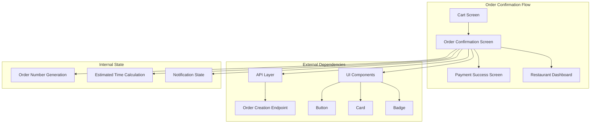
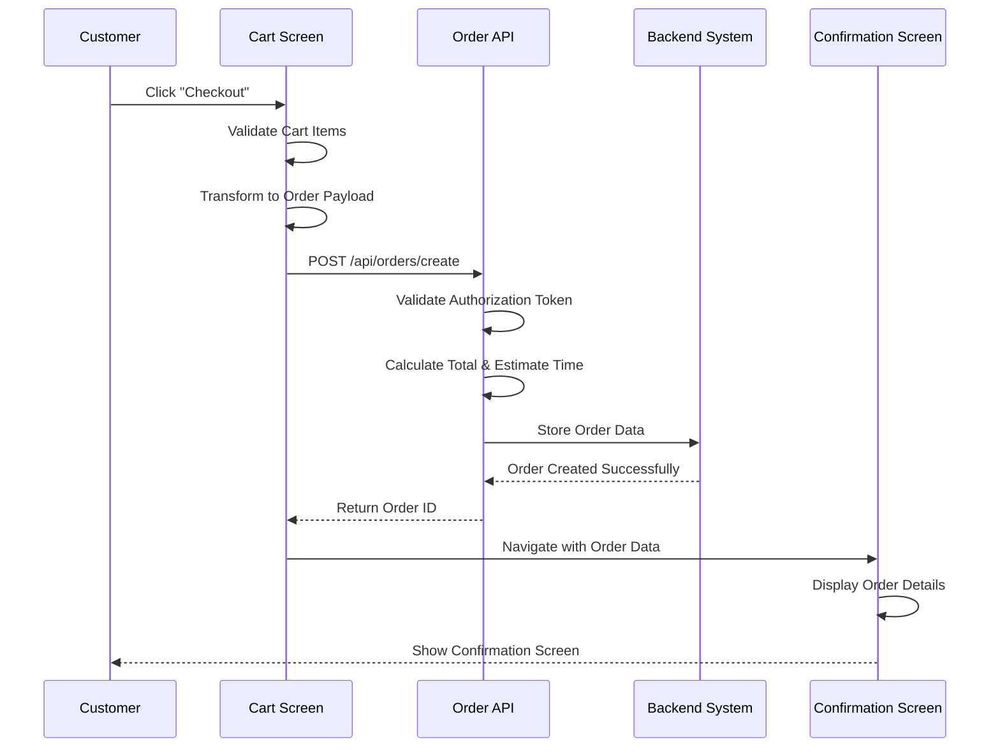
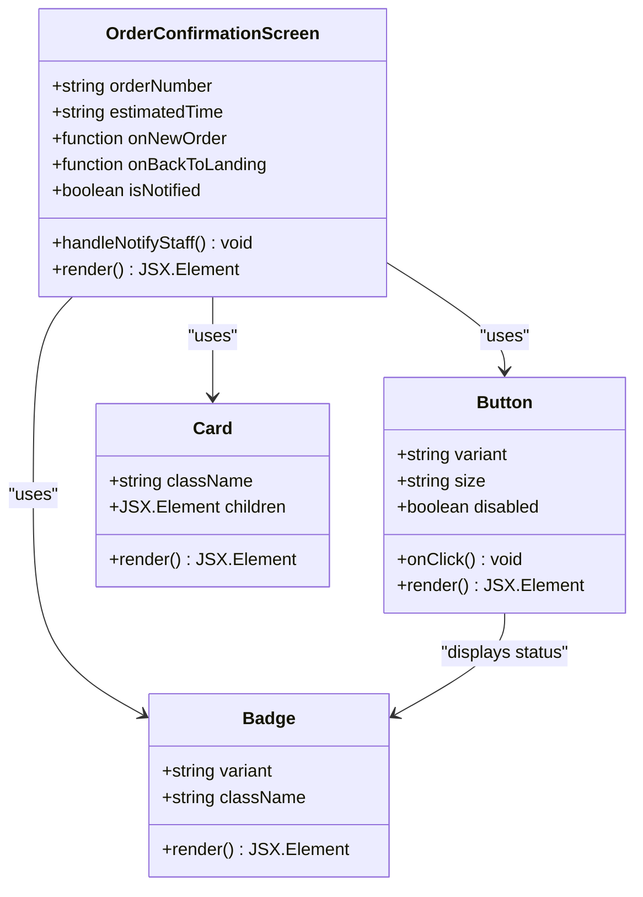
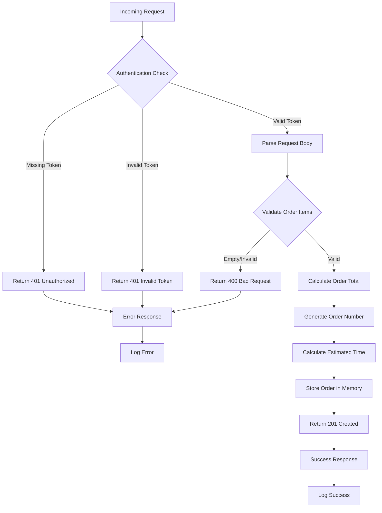
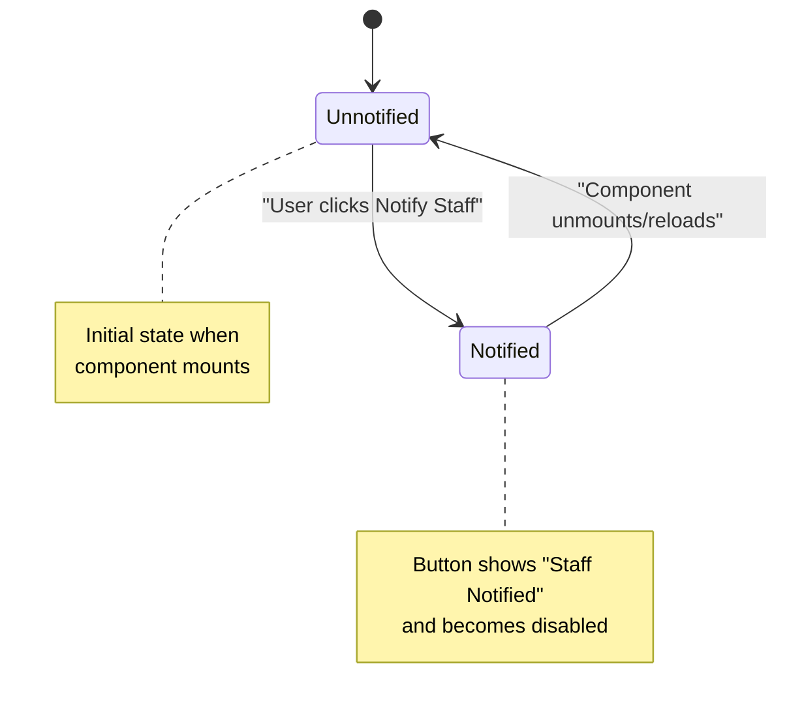
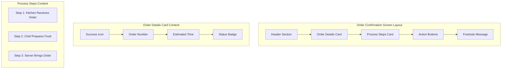
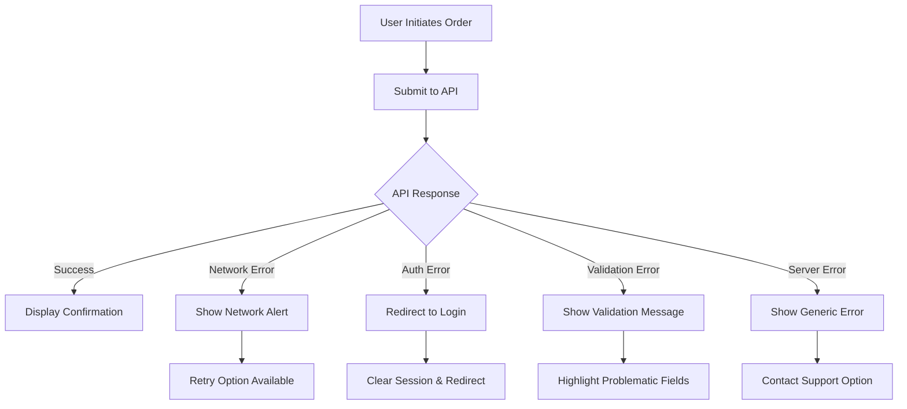
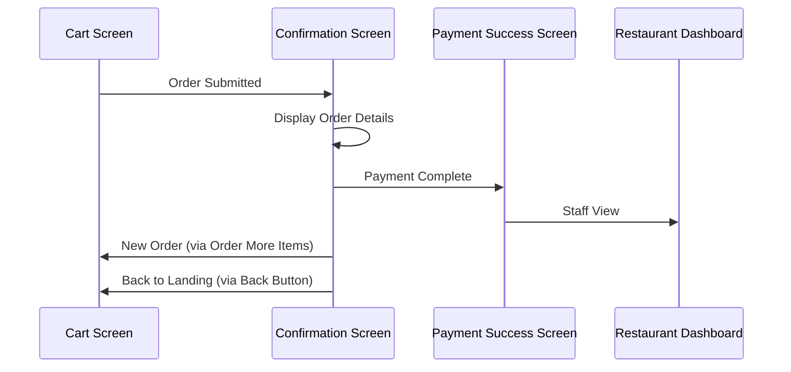
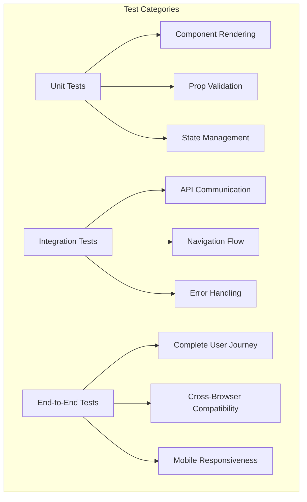

# Order Confirmation Screen

<cite>
**Referenced Files in This Document**
- [order-confirmation-screen.tsx](file://src/components/pwa/order-confirmation-screen.tsx)
- [cart-screen.tsx](file://src/components/pwa/cart-screen.tsx)
- [payment-success-screen.tsx](file://src/components/pwa/payment-success-screen.tsx)
- [pwa-app.tsx](file://src/components/pwa-app.tsx)
- [route.ts](file://src/app/api/orders/create/route.ts)
- [button.tsx](file://src/components/ui/button.tsx)
- [card.tsx](file://src/components/ui/card.tsx)
</cite>

## Table of Contents
1. [Introduction](#introduction)
2. [Component Architecture](#component-architecture)
3. [Order Submission Workflow](#order-submission-workflow)
4. [Component Implementation](#component-implementation)
5. [API Integration](#api-integration)
6. [State Management](#state-management)
7. [User Experience Design](#user-experience-design)
8. [Error Handling](#error-handling)
9. [Navigation Patterns](#navigation-patterns)
10. [Performance Considerations](#performance-considerations)
11. [Testing Strategies](#testing-strategies)
12. [Best Practices](#best-practices)

## Introduction

The Order Confirmation Screen serves as the final stage in the customer ordering journey within the MenuPRO App. This component plays a crucial role in confirming successful order placement, providing essential order details, and guiding customers through post-order actions. Built with React and TypeScript, it integrates seamlessly with the application's state management system and communicates with backend APIs to finalize orders.

The component transforms cart data into an order payload, handles the submission process via the `/api/orders/create` endpoint, and displays comprehensive order confirmation information including order numbers, estimated preparation times, and actionable next steps. It also manages user interactions for notifying restaurant staff and navigating to subsequent screens.

## Component Architecture

The Order Confirmation Screen follows a modular architecture pattern that emphasizes separation of concerns and reusability. The component is designed as a pure functional component with clear prop interfaces and minimal internal state management.



**Diagram sources**
- [order-confirmation-screen.tsx](file://src/components/pwa/order-confirmation-screen.tsx#L1-L154)
- [cart-screen.tsx](file://src/components/pwa/cart-screen.tsx#L1-L292)

**Section sources**
- [order-confirmation-screen.tsx](file://src/components/pwa/order-confirmation-screen.tsx#L1-L154)
- [pwa-app.tsx](file://src/components/pwa-app.tsx#L131-L140)

## Order Submission Workflow

The order submission process involves multiple stages of validation, transformation, and API communication. The workflow ensures data integrity and provides appropriate feedback to users throughout the process.



**Diagram sources**
- [cart-screen.tsx](file://src/components/pwa/cart-screen.tsx#L60-L95)
- [route.ts](file://src/app/api/orders/create/route.ts#L40-L100)

The submission workflow begins when the customer clicks the checkout button on the cart screen. The system validates the cart items, transforms them into a structured order payload, and sends the request to the backend API. The API endpoint performs comprehensive validation including JWT token verification, order item validation, and calculates the estimated preparation time based on the number of items.

**Section sources**
- [cart-screen.tsx](file://src/components/pwa/cart-screen.tsx#L60-L95)
- [route.ts](file://src/app/api/orders/create/route.ts#L40-L100)

## Component Implementation

The Order Confirmation Screen is implemented as a React functional component with TypeScript interfaces for type safety. The component accepts four primary props and renders a comprehensive order confirmation interface.

### Component Props Interface

```typescript
interface OrderConfirmationScreenProps {
  orderNumber: string;
  estimatedTime: string;
  onNewOrder: () => void;
  onBackToLanding: () => void;
}
```

### Key Features and Implementation Details

The component utilizes several advanced React patterns and modern web development practices:

1. **State Management**: Uses React's `useState` hook for managing notification state
2. **TypeScript Interfaces**: Provides strong typing for props and internal state
3. **CSS-in-JS**: Leverages Tailwind CSS classes for responsive design
4. **SVG Icons**: Integrates Lucide icons for visual consistency
5. **Accessibility**: Implements proper ARIA labels and keyboard navigation

### Component Structure



**Diagram sources**
- [order-confirmation-screen.tsx](file://src/components/pwa/order-confirmation-screen.tsx#L8-L15)
- [button.tsx](file://src/components/ui/button.tsx#L1-L59)
- [card.tsx](file://src/components/ui/card.tsx#L1-L93)

**Section sources**
- [order-confirmation-screen.tsx](file://src/components/pwa/order-confirmation-screen.tsx#L1-L154)

## API Integration

The Order Confirmation Screen integrates with the backend through the `/api/orders/create` endpoint, which handles order creation, validation, and persistence. The API implementation demonstrates robust error handling and comprehensive data processing.

### API Endpoint Structure

The API endpoint supports both POST and GET requests with comprehensive authentication and validation:



**Diagram sources**
- [route.ts](file://src/app/api/orders/create/route.ts#L40-L100)

### Order Data Transformation

The cart data undergoes transformation before being sent to the API:

```typescript
// Cart Item Structure
interface CartItem {
  id: string;
  name: string;
  price: number;
  quantity: number;
  image?: string;
  selectedOptions?: {
    size?: string;
    customizations?: string[];
  };
}

// Transformed Order Item
const orderData = {
  items: cartItems.map(item => ({
    id: item.id,
    name: item.name,
    price: item.price,
    quantity: item.quantity,
    selectedOptions: item.selectedOptions
  }))
};
```

**Section sources**
- [route.ts](file://src/app/api/orders/create/route.ts#L1-L161)
- [cart-screen.tsx](file://src/components/pwa/cart-screen.tsx#L60-L95)

## State Management

The Order Confirmation Screen employs a minimalist state management approach, focusing on user interactions and UI state rather than complex application state. The component maintains a single piece of state for managing staff notification status.

### State Management Pattern

```typescript
const [isNotified, setIsNotified] = useState(false);

const handleNotifyStaff = () => {
  setIsNotified(true);
  // In a real app, this would send a notification to restaurant staff
  console.log('Staff notified of new order');
};
```

### State Flow



**Diagram sources**
- [order-confirmation-screen.tsx](file://src/components/pwa/order-confirmation-screen.tsx#L17-L22)

**Section sources**
- [order-confirmation-screen.tsx](file://src/components/pwa/order-confirmation-screen.tsx#L17-L22)

## User Experience Design

The Order Confirmation Screen prioritizes clarity, usability, and positive user experience through thoughtful design decisions and intuitive navigation patterns.

### Design Principles

1. **Visual Hierarchy**: Clear emphasis on order confirmation details
2. **Color Psychology**: Warm orange and red gradient for brand consistency
3. **Responsive Layout**: Mobile-first design with optimal desktop support
4. **Microinteractions**: Animated elements and smooth transitions
5. **Accessibility**: Proper contrast ratios and keyboard navigation

### Information Architecture

The component organizes information into logical sections:



**Diagram sources**
- [order-confirmation-screen.tsx](file://src/components/pwa/order-confirmation-screen.tsx#L25-L110)

### Interactive Elements

The component provides three primary action buttons:

1. **Notify Staff Button**: Sends notifications to restaurant staff
2. **Order More Items Button**: Clears cart and navigates to menu
3. **Back to Landing Button**: Reloads the entire application

**Section sources**
- [order-confirmation-screen.tsx](file://src/components/pwa/order-confirmation-screen.tsx#L25-L154)

## Error Handling

The Order Confirmation Screen implements comprehensive error handling strategies to manage various failure scenarios gracefully and provide meaningful feedback to users.

### Error Scenarios

1. **Network Connectivity Issues**: Failed API requests
2. **Authentication Failures**: Invalid or expired tokens
3. **Invalid Cart States**: Empty carts or malformed data
4. **Server Errors**: Internal API failures

### Error Handling Implementation



**Diagram sources**
- [cart-screen.tsx](file://src/components/pwa/cart-screen.tsx#L60-L95)

### Error Recovery Strategies

The system implements several error recovery mechanisms:

- **Automatic Retry**: For transient network issues
- **Graceful Degradation**: Minimal functionality when API unavailable
- **User Guidance**: Clear instructions for resolving issues
- **Logging**: Comprehensive error logging for debugging

**Section sources**
- [cart-screen.tsx](file://src/components/pwa/cart-screen.tsx#L60-L95)

## Navigation Patterns

The Order Confirmation Screen implements sophisticated navigation patterns that guide users through the ordering process while maintaining flexibility for different user journeys.

### Navigation Flow



**Diagram sources**
- [pwa-app.tsx](file://src/components/pwa-app.tsx#L131-L140)

### Navigation Handlers

The component provides three distinct navigation handlers:

1. **onNewOrder**: Resets cart and navigates to menu screen
2. **onBackToLanding**: Performs full application reload
3. **handleNotifyStaff**: Manages staff notification state

### State Persistence

The navigation system maintains state persistence through:

- **URL Parameters**: For sharing order information
- **Local Storage**: For session management
- **Memory State**: For temporary UI state

**Section sources**
- [order-confirmation-screen.tsx](file://src/components/pwa/order-confirmation-screen.tsx#L17-L22)
- [pwa-app.tsx](file://src/components/pwa-app.tsx#L131-L140)

## Performance Considerations

The Order Confirmation Screen is optimized for performance through several strategic approaches that ensure fast rendering and responsive user interactions.

### Rendering Optimization

1. **Pure Components**: Stateless functional components for efficient re-renders
2. **Memoization**: Strategic use of React.memo for expensive calculations
3. **Lazy Loading**: Conditional loading of heavy assets
4. **Bundle Splitting**: Separate chunks for different screen components

### Memory Management

- **Component Cleanup**: Proper cleanup of event listeners and timers
- **State Minimization**: Only storing necessary state data
- **Reference Optimization**: Efficient object and array handling

### Network Performance

- **Request Batching**: Consolidating API calls where possible
- **Caching Strategy**: Intelligent caching of order data
- **Connection Pooling**: Reusing HTTP connections for API calls

## Testing Strategies

The Order Confirmation Screen benefits from comprehensive testing strategies that ensure reliability and maintainability across different scenarios.

### Unit Testing Approach



### Test Coverage Areas

1. **Component Rendering**: Verifying correct UI output
2. **User Interactions**: Testing button clicks and state changes
3. **API Integration**: Mocking external service calls
4. **Error Scenarios**: Testing failure conditions
5. **Accessibility**: Ensuring WCAG compliance

### Testing Tools and Frameworks

- **Jest**: Primary testing framework
- **React Testing Library**: Component testing utilities
- **Mock Services**: API endpoint mocking
- **Visual Regression**: Screenshot comparison testing

## Best Practices

The Order Confirmation Screen exemplifies several industry best practices that contribute to maintainable, scalable, and user-friendly code.

### Code Quality Standards

1. **Type Safety**: Comprehensive TypeScript implementation
2. **Code Organization**: Logical file structure and naming conventions
3. **Documentation**: Inline comments and prop descriptions
4. **Consistency**: Uniform styling and pattern adherence

### Security Considerations

- **Input Validation**: Sanitizing all user inputs
- **Authentication**: Secure token handling and verification
- **Authorization**: Role-based access control
- **Data Protection**: Secure transmission and storage

### Accessibility Compliance

- **ARIA Labels**: Descriptive labels for screen readers
- **Keyboard Navigation**: Full keyboard accessibility
- **Color Contrast**: Adequate contrast ratios for readability
- **Focus Management**: Logical tab order and focus indicators

### Maintenance Guidelines

- **Version Control**: Semantic versioning and changelog maintenance
- **Code Reviews**: Peer review process for quality assurance
- **Performance Monitoring**: Regular performance audits
- **User Feedback**: Continuous improvement based on user insights