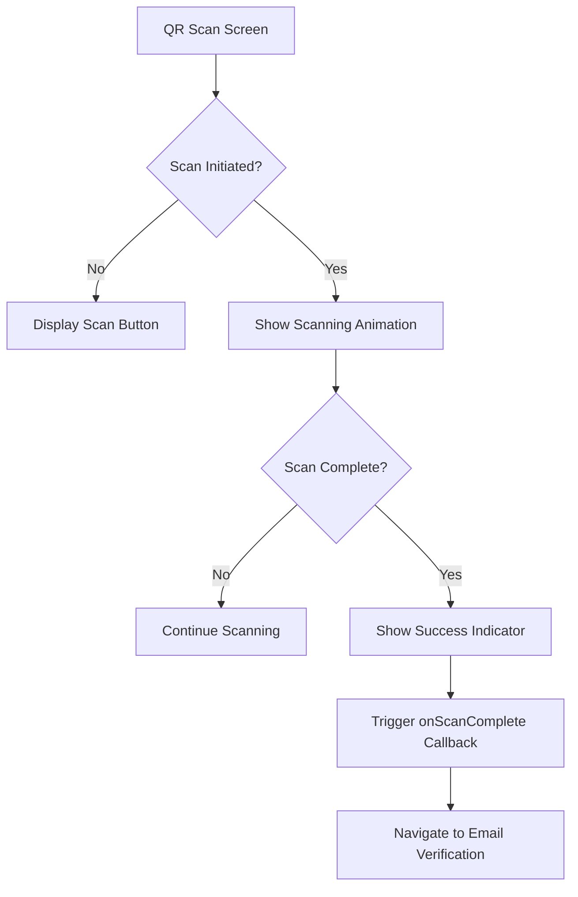
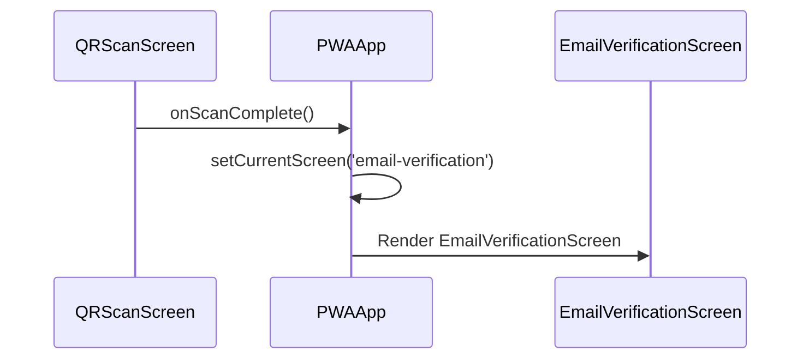
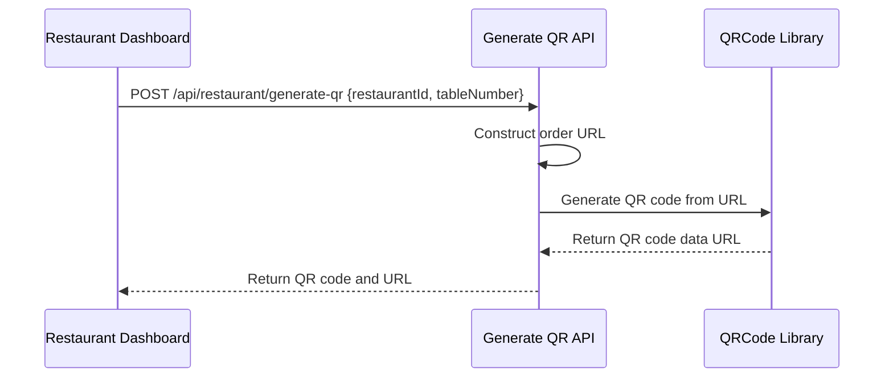

# QR Scan Screen

<cite>
**Referenced Files in This Document**   
- [qr-scan-screen.tsx](file://src/components/pwa/qr-scan-screen.tsx)
- [pwa-app.tsx](file://src/components/pwa-app.tsx)
- [table-qr-screen.tsx](file://src/components/restaurant/table-qr-screen.tsx)
- [generate-qr/route.ts](file://src/app/api/restaurant/generate-qr/route.ts)
- [qr-scan-screen.test.tsx](file://src/__tests__/customer/qr-scan-screen.test.tsx)
</cite>

## Table of Contents
1. [Introduction](#introduction)
2. [Component Overview](#component-overview)
3. [Integration with PWA Application State](#integration-with-pwa-application-state)
4. [QR Code Generation and Parsing](#qr-code-generation-and-parsing)
5. [User Experience and Accessibility](#user-experience-and-accessibility)
6. [Error Handling and Edge Cases](#error-handling-and-edge-cases)
7. [Testing and Validation](#testing-and-validation)
8. [Conclusion](#conclusion)

## Introduction
The QR Scan Screen component is a critical part of the MenuPRO PWA application, serving as the entry point for customers to connect with a specific restaurant and table context. This document provides a comprehensive analysis of the component's functionality, integration points, and user experience considerations. The component enables table identification via QR code scanning, linking customers to the appropriate restaurant context and facilitating seamless ordering.

## Component Overview

The QR Scan Screen component provides a user interface for scanning QR codes that identify specific restaurant tables. While the current implementation simulates the scanning process, it is designed to integrate with HTML5 media APIs for real camera access in a production environment.

The component features a visually distinct scanning interface with:
- A prominent QR code scanning frame with corner indicators
- Animated scanning state with a moving scan line
- Visual feedback for scan completion with a success indicator
- Responsive design optimized for mobile devices

The component manages its state through React hooks, tracking whether scanning is in progress and whether a scan has been completed. Upon successful scanning, it notifies the parent component via the `onScanComplete` callback, triggering navigation to the next screen in the application flow.



**Diagram sources**
- [qr-scan-screen.tsx](file://src/components/pwa/qr-scan-screen.tsx#L1-L98)

**Section sources**
- [qr-scan-screen.tsx](file://src/components/pwa/qr-scan-screen.tsx#L1-L98)

## Integration with PWA Application State

The QR Scan Screen is integrated into the PWA application's navigation flow through the PWAApp component, which manages the application state and screen transitions. The component is part of a sequential flow that guides users through the ordering process.

When a QR code scan is completed, the component triggers the `onScanComplete` callback, which is connected to the `navigateToScreen` function in the PWAApp component. This function updates the `currentScreen` state, transitioning from the QR scan screen to the email verification screen.

The application maintains state for:
- Current screen in the navigation flow
- User authentication information
- Shopping cart contents
- Selected menu items

This state is preserved throughout the user journey, ensuring a seamless experience from table identification to order placement.



**Diagram sources**
- [pwa-app.tsx](file://src/components/pwa-app.tsx#L1-L154)
- [qr-scan-screen.tsx](file://src/components/pwa/qr-scan-screen.tsx#L1-L98)

**Section sources**
- [pwa-app.tsx](file://src/components/pwa-app.tsx#L1-L154)

## QR Code Generation and Parsing

QR codes in the MenuPRO system are generated server-side through the `/api/restaurant/generate-qr` endpoint. The QR code contains a URL with query parameters that identify both the restaurant and the specific table.

The QR code URL follows the format:
```
https://menupro.app/order?restaurant={restaurantId}&table={tableNumber}
```

When a customer scans a QR code, the application would parse these parameters to establish the context for the ordering session. The restaurant ID ensures the customer is connected to the correct establishment, while the table number allows staff to deliver orders to the correct location.

The QR code generation process includes:
1. Receiving restaurant ID and table number from the restaurant dashboard
2. Constructing the order URL with appropriate query parameters
3. Generating a QR code image using the qrcode library
4. Returning the QR code as a data URL for display or download



**Diagram sources**
- [generate-qr/route.ts](file://src/app/api/restaurant/generate-qr/route.ts#L1-L98)
- [table-qr-screen.tsx](file://src/components/restaurant/table-qr-screen.tsx#L1-L515)

**Section sources**
- [generate-qr/route.ts](file://src/app/api/restaurant/generate-qr/route.ts#L1-L98)
- [table-qr-screen.tsx](file://src/components/restaurant/table-qr-screen.tsx#L1-L515)

## User Experience and Accessibility

The QR Scan Screen is designed with user experience and accessibility in mind. The interface provides clear visual feedback at each stage of the scanning process, helping users understand the current state and expected actions.

Key UX features include:
- Clear instructions for positioning the QR code
- Visual indicators for successful scanning
- Loading animations during the scanning process
- Responsive design that works on various screen sizes
- High contrast colors for better visibility

Accessibility considerations include:
- Proper heading structure with semantic HTML
- Descriptive text for screen readers
- Sufficient color contrast
- Keyboard navigable interface elements
- Clear visual feedback for interactive elements

The component also includes tips for successful scanning, such as ensuring good lighting and keeping the QR code steady, which helps reduce user frustration and failed scan attempts.

**Section sources**
- [qr-scan-screen.tsx](file://src/components/pwa/qr-scan-screen.tsx#L1-L98)
- [qr-scan-screen.test.tsx](file://src/__tests__/customer/qr-scan-screen.test.tsx#L1-L83)

## Error Handling and Edge Cases

While the current implementation simulates QR code scanning, a production-ready implementation would need to handle various error conditions and edge cases:

1. **Camera access failures**: The application should gracefully handle cases where camera access is denied or unavailable, providing clear instructions for enabling camera permissions.

2. **Malformed QR codes**: The system should validate scanned data to ensure it contains the expected restaurant and table information in the correct format.

3. **Network connectivity issues**: When processing scan results, the application should handle network failures and provide appropriate feedback.

4. **Expired or invalid sessions**: The system should validate that the scanned table is active and that the restaurant is currently accepting orders.

5. **Unsupported devices**: For devices without camera capabilities, a fallback mechanism such as manual table number entry should be provided.

The current implementation does not include these error handling mechanisms, as it simulates the scanning process rather than implementing actual camera integration. However, these considerations are essential for a production deployment.

**Section sources**
- [qr-scan-screen.tsx](file://src/components/pwa/qr-scan-screen.tsx#L1-L98)

## Testing and Validation

The QR Scan Screen component is covered by comprehensive unit tests that validate its functionality and user interface. The tests verify:

- Proper rendering of all UI elements
- Correct display of the MenuPRO logo
- Presence of camera icon and instructions
- Functionality of the scan button
- Proper accessibility attributes
- Display of scanning tips
- Application of correct styling classes

The test suite uses React Testing Library to simulate user interactions and verify component behavior. It includes tests for both the visual elements and the component's interaction patterns, ensuring that the component meets both functional and usability requirements.

The tests also verify that the component triggers the `onScanComplete` callback when the scan process is initiated, confirming the integration point with the parent component.

**Section sources**
- [qr-scan-screen.test.tsx](file://src/__tests__/customer/qr-scan-screen.test.tsx#L1-L83)

## Conclusion

The QR Scan Screen component serves as a critical entry point in the MenuPRO PWA application, connecting customers to specific restaurant tables through QR code scanning. While the current implementation simulates the scanning process, it provides a solid foundation for integrating with HTML5 media APIs to enable real camera access.

The component is well-integrated into the application's state management system, triggering navigation to subsequent screens upon successful scanning. It features a user-friendly interface with clear visual feedback and is designed with accessibility considerations.

For a production deployment, the component would need to be enhanced with actual camera integration, robust error handling, and fallback mechanisms for unsupported devices. These enhancements would ensure a reliable and accessible experience for all users, regardless of their device capabilities or environmental conditions.