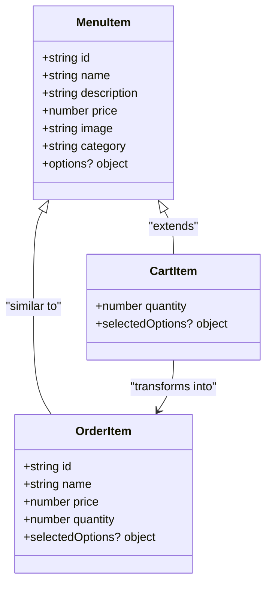
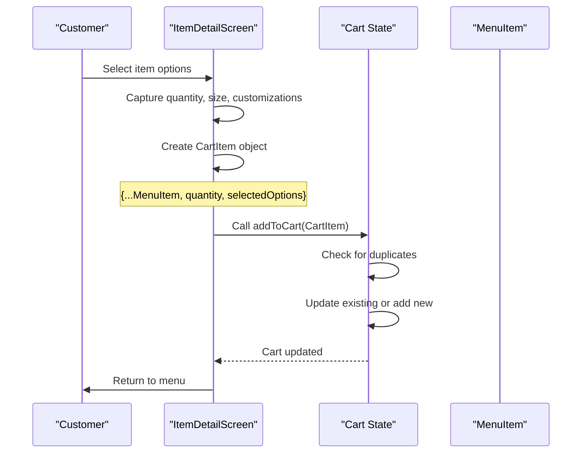
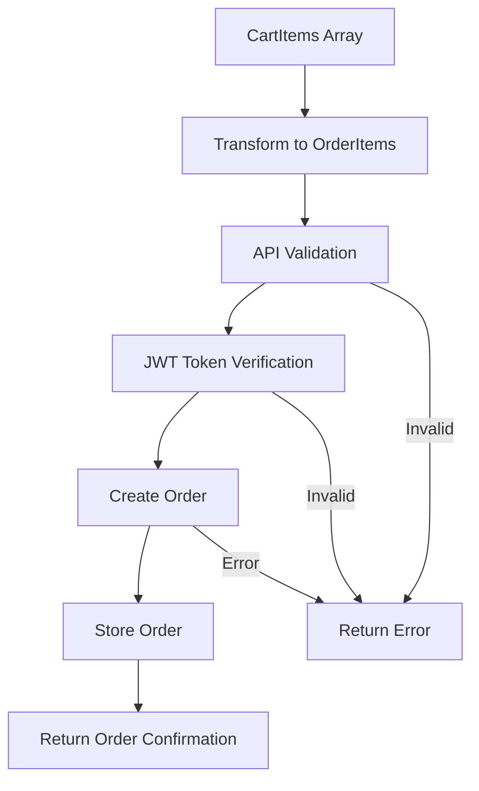

# CartItem Model Documentation

<cite>
**Referenced Files in This Document**
- [src/components/pwa-app.tsx](file://src/components/pwa-app.tsx)
- [src/components/pwa/cart-screen.tsx](file://src/components/pwa/cart-screen.tsx)
- [src/components/pwa/item-detail-screen.tsx](file://src/components/pwa/item-detail-screen.tsx)
- [src/components/pwa/menu-screen.tsx](file://src/components/pwa/menu-screen.tsx)
- [src/app/api/orders/create/route.ts](file://src/app/api/orders/create/route.ts)
- [src/__tests__/customer/cart-screen.test.tsx](file://src/__tests__/customer/cart-screen.test.tsx)
</cite>

## Table of Contents
1. [Introduction](#introduction)
2. [CartItem Interface Definition](#cartitem-interface-definition)
3. [MenuItem Extension Pattern](#menuitem-extension-pattern)
4. [Cart State Management](#cart-state-management)
5. [CartItem Creation Workflow](#cartitem-creation-workflow)
6. [Quantity Management](#quantity-management)
7. [Selected Options System](#selected-options-system)
8. [Local Storage Persistence](#local-storage-persistence)
9. [Order Processing Integration](#order-processing-integration)
10. [Validation and Error Handling](#validation-and-error-handling)
11. [Testing Implementation](#testing-implementation)
12. [Performance Considerations](#performance-considerations)
13. [Troubleshooting Guide](#troubleshooting-guide)
14. [Conclusion](#conclusion)

## Introduction

The CartItem model serves as a specialized extension of the MenuItem interface, designed specifically for capturing user selections during the customer ordering flow in the MenuPRO PWA application. This model extends MenuItem with shopping cart-specific properties including quantity tracking and optional selectedOptions for size and customizations, enabling a seamless shopping experience while maintaining type safety throughout the application.

The CartItem model represents the fundamental building block of the shopping cart system, bridging the gap between static menu items and dynamic user selections. It encapsulates all necessary information for a single item in the cart, including the original MenuItem properties augmented with shopping session-specific data.

## CartItem Interface Definition

The CartItem interface extends MenuItem with two primary properties that distinguish it from its parent interface:

```typescript
export interface CartItem extends MenuItem {
  quantity: number;
  selectedOptions?: {
    size?: string;
    customizations?: string[];
  };
}
```

### Core Properties

**Quantity Field**: The `quantity` property tracks how many units of a particular item the customer wants to purchase. This numeric field enables bulk ordering and quantity-based calculations.

**Selected Options**: The optional `selectedOptions` object captures user-customizable selections including:
- `size`: String representing the chosen size option (e.g., "Medium", "Large")
- `customizations`: Array of strings representing user-selected customizations (e.g., ["Extra Cheese", "No Onion"])

### Type Safety Benefits

The interface definition ensures type safety by inheriting all MenuItem properties while adding shopping-specific fields. This design prevents runtime errors and provides compile-time validation for cart operations.

**Section sources**
- [src/components/pwa-app.tsx](file://src/components/pwa-app.tsx#L27-L32)

## MenuItem Extension Pattern

The CartItem model employs a clean inheritance pattern that leverages TypeScript's interface extension capabilities. This design choice provides several advantages:



**Diagram sources**
- [src/components/pwa-app.tsx](file://src/components/pwa-app.tsx#L17-L26)
- [src/components/pwa-app.tsx](file://src/components/pwa-app.tsx#L27-L32)
- [src/app/api/orders/create/route.ts](file://src/app/api/orders/create/route.ts#L5-L14)

### Property Inheritance

When a MenuItem is transformed into a CartItem, all original properties are preserved:
- **Identification**: `id`, `name`, `image`
- **Description**: `description`, `category`
- **Pricing**: `price`
- **Options**: `options` (including size and customization arrays)

### Enhanced Functionality

The extension pattern allows CartItem to inherit all MenuItem methods and properties while adding shopping-specific capabilities. This maintains consistency across the application and reduces code duplication.

**Section sources**
- [src/components/pwa-app.tsx](file://src/components/pwa-app.tsx#L17-L26)
- [src/components/pwa-app.tsx](file://src/components/pwa-app.tsx#L27-L32)

## Cart State Management

The PWAApp component manages the global cart state using React's useState hook, storing CartItem arrays and providing centralized manipulation functions:

```typescript
const [cart, setCart] = useState<CartItem[]>([]);
```

### State Operations

The cart state supports four primary operations:

**Addition**: New items are added using the `addToCart` function, which handles duplicate detection and quantity accumulation.

**Quantity Updates**: Individual item quantities are modified through the `updateCartItem` function, which supports both increase and decrease operations.

**Removal**: Items can be completely removed from the cart using filtering operations that eliminate items with zero quantity.

**Clearance**: The entire cart can be reset using the `clearCart` function.

### Duplicate Detection Algorithm

The `addToCart` function implements sophisticated duplicate detection based on both item ID and selected options:

```typescript
const existingItem = prev.find(cartItem => 
  cartItem.id === item.id && 
  JSON.stringify(cartItem.selectedOptions) === JSON.stringify(item.selectedOptions)
);
```

This algorithm ensures that items with identical IDs but different options (e.g., different sizes or customizations) are treated as separate entries in the cart.

**Section sources**
- [src/components/pwa-app.tsx](file://src/components/pwa-app.tsx#L40-L85)

## CartItem Creation Workflow

The CartItem creation process occurs primarily in the ItemDetailScreen component, where user selections are captured and transformed into CartItem instances:



**Diagram sources**
- [src/components/pwa/item-detail-screen.tsx](file://src/components/pwa/item-detail-screen.tsx#L25-L35)
- [src/components/pwa-app.tsx](file://src/components/pwa-app.tsx#L50-L70)

### ItemDetailScreen Implementation

The ItemDetailScreen captures user selections through React state management:

```typescript
const handleAddToCart = () => {
  const cartItem: CartItem = {
    ...item,
    quantity,
    selectedOptions: {
      size: selectedSize,
      customizations: selectedCustomizations
    }
  };
  onAddToCart(cartItem);
  onBack();
};
```

### Selection Capture Process

1. **Quantity Selection**: Captured from the quantity input field
2. **Size Selection**: Selected from available size options
3. **Customization Selection**: Toggled on/off from customization options
4. **MenuItem Extension**: Original MenuItem properties are spread into the new CartItem

**Section sources**
- [src/components/pwa/item-detail-screen.tsx](file://src/components/pwa/item-detail-screen.tsx#L25-L35)

## Quantity Management

Quantity management in the CartItem system involves both individual item quantity updates and aggregate calculations across the entire cart:

### Individual Item Updates

The `updateCartItem` function provides precise control over individual item quantities:

```typescript
const updateCartItem = (itemId: string, quantity: number, selectedOptions?: any) => {
  setCart(prev => prev.map(item => 
    item.id === itemId ? { ...item, quantity, selectedOptions } : item
  ).filter(item => item.quantity > 0));
};
```

### Aggregate Calculations

The cart screen performs several aggregate calculations:

**Subtotal Calculation**: Sum of all item prices multiplied by their respective quantities
```typescript
const subtotal = cartItems.reduce((total, item) => total + (item.price * item.quantity), 0);
```

**Total Calculation**: Includes discounts and taxes
```typescript
const total = subtotal - discount + tax;
```

### Validation Rules

Quantity updates are subject to several validation rules:
- Minimum quantity: 1 (items with zero quantity are automatically removed)
- Maximum quantity: No explicit limit (could be implemented based on inventory)
- Quantity changes trigger immediate recalculation of totals

**Section sources**
- [src/components/pwa-app.tsx](file://src/components/pwa-app.tsx#L72-L76)
- [src/components/pwa/cart-screen.tsx](file://src/components/pwa/cart-screen.tsx#L25-L30)

## Selected Options System

The selected options system enables sophisticated customization of menu items, allowing customers to tailor their orders according to preferences:

### Option Types

**Size Options**: Single selection from predefined size choices
```typescript
size?: string;
```

**Customization Options**: Multi-selection from available customizations
```typescript
customizations?: string[];
```

### Option Rendering

The cart screen renders selected options for each item:

```typescript
{item.selectedOptions?.size && (
  <Badge variant="outline" className="text-xs mb-1 mr-2">
    {item.selectedOptions.size}
  </Badge>
)}
{item.selectedOptions?.customizations && item.selectedOptions.customizations.length > 0 && (
  <div className="text-xs text-gray-600 mb-2">
    + {item.selectedOptions.customizations.join(", ")}
  </div>
)}
```

### Option Persistence

Selected options are persisted with each CartItem and maintained throughout the shopping session, ensuring that user customizations are not lost during navigation or state updates.

**Section sources**
- [src/components/pwa/cart-screen.tsx](file://src/components/pwa/cart-screen.tsx#L110-L120)
- [src/components/pwa-app.tsx](file://src/components/pwa-app.tsx#L29-L32)

## Local Storage Persistence

The application implements client-side persistence using localStorage to maintain cart state across browser sessions:

### Authentication Token Storage

Authentication tokens are stored for API authorization:
```typescript
localStorage.setItem('authToken', token);
```

### Session Continuity

While the cart itself isn't explicitly persisted to localStorage, the authentication state enables cart synchronization with backend systems. This creates a seamless experience where users can resume their shopping session after browser restarts.

### Security Considerations

- Tokens are stored securely in localStorage
- Sensitive information is cleared when appropriate
- Session state is maintained through authentication rather than direct state persistence

**Section sources**
- [src/components/pwa-app.tsx](file://src/components/pwa-app.tsx#L89-L90)

## Order Processing Integration

The CartItem model seamlessly integrates with the order processing system, transforming shopping cart data into order submissions:

### Order Data Transformation

During checkout, CartItems are transformed into OrderItem format for API submission:

```typescript
const orderData = {
  items: cartItems.map(item => ({
    id: item.id,
    name: item.name,
    price: item.price,
    quantity: item.quantity,
    selectedOptions: item.selectedOptions
  }))
};
```

### API Integration

The order creation endpoint receives transformed data and processes it through the following pipeline:



**Diagram sources**
- [src/app/api/orders/create/route.ts](file://src/app/api/orders/create/route.ts#L40-L80)

### Order Status Management

Orders progress through several states:
- **Pending**: Initial state after creation
- **Confirmed**: Restaurant acceptance
- **Preparing**: Kitchen preparation begins
- **Ready**: Food preparation complete
- **Served**: Order delivered to customer

**Section sources**
- [src/components/pwa/cart-screen.tsx](file://src/components/pwa/cart-screen.tsx#L50-L80)
- [src/app/api/orders/create/route.ts](file://src/app/api/orders/create/route.ts#L15-L25)

## Validation and Error Handling

The CartItem system implements comprehensive validation and error handling mechanisms:

### Client-Side Validation

**Quantity Validation**: Ensures quantities remain positive integers
```typescript
disabled={item.quantity <= 1}
```

**Option Validation**: Validates selected options against available choices
```typescript
const existingItem = prev.find(cartItem => 
  cartItem.id === item.id && 
  JSON.stringify(cartItem.selectedOptions) === JSON.stringify(item.selectedOptions)
);
```

### API-Level Validation

The backend implements robust validation:
- **Token Verification**: Ensures valid authentication
- **Item Presence**: Validates that items exist in the cart
- **Quantity Limits**: Prevents negative or excessive quantities
- **Price Calculation**: Verifies calculated totals match expected values

### Error Recovery

The system provides graceful error recovery:
- **Network Failures**: Retry mechanisms for failed API calls
- **Validation Errors**: Clear error messages for invalid data
- **State Corruption**: Automatic cleanup of invalid cart states

**Section sources**
- [src/components/pwa/cart-screen.tsx](file://src/components/pwa/cart-screen.tsx#L125-L135)
- [src/components/pwa-app.tsx](file://src/components/pwa-app.tsx#L50-L70)
- [src/app/api/orders/create/route.ts](file://src/app/api/orders/create/route.ts#L40-L80)

## Testing Implementation

The CartItem system includes comprehensive testing coverage through Jest and React Testing Library:

### Test Coverage Areas

**Cart Screen Tests**: Validate rendering and interaction
```typescript
it('renders the cart screen with all elements', () => {
  render(<CartScreen cartItems={mockCartItems} />);
  expect(screen.getByText('Your Cart')).toBeInTheDocument();
});
```

**Quantity Management Tests**: Verify quantity calculations
```typescript
it('calculates and displays total correctly', () => {
  const expectedTotal = (12.99 * 2) + (8.99 * 1);
  expect(screen.getByText(`$${expectedTotal.toFixed(2)}`)).toBeInTheDocument();
});
```

**Interaction Tests**: Validate user interactions
```typescript
it('calls onUpdateQuantity when quantity is changed', async () => {
  const user = userEvent.setup();
  const quantityInput = screen.getByDisplayValue('2');
  await user.clear(quantityInput);
  await user.type(quantityInput, '3');
  expect(mockOnUpdateQuantity).toHaveBeenCalledWith('1', 3);
});
```

### Test Data Structure

Mock data includes realistic CartItem structures:
```typescript
const mockCartItems = [
  {
    id: '1',
    name: 'Margherita Pizza',
    description: 'Classic tomato and mozzarella',
    price: 12.99,
    quantity: 2,
    image: '/pizza.jpg'
  }
];
```

**Section sources**
- [src/__tests__/customer/cart-screen.test.tsx](file://src/__tests__/customer/cart-screen.test.tsx#L10-L25)
- [src/__tests__/customer/cart-screen.test.tsx](file://src/__tests__/customer/cart-screen.test.tsx#L40-L60)

## Performance Considerations

The CartItem system is designed with performance optimization in mind:

### Memory Management

**Efficient State Updates**: React's functional setState prevents unnecessary re-renders
```typescript
setCart(prev => prev.map(item => /* efficient update */));
```

**Object Comparison**: JSON stringification for deep equality checks
```typescript
JSON.stringify(cartItem.selectedOptions) === JSON.stringify(item.selectedOptions)
```

### Rendering Optimization

**Conditional Rendering**: Empty cart state prevents unnecessary DOM elements
```typescript
if (cartItems.length === 0) {
  return <EmptyCartState />;
}
```

**Memoization Opportunities**: Potential for React.memo on child components

### Scalability Factors

**Linear Complexity**: Cart operations scale linearly with item count
**Memory Efficiency**: Minimal memory overhead per CartItem
**Network Optimization**: Batched API calls for multiple item updates

## Troubleshooting Guide

Common issues and solutions for CartItem-related problems:

### Cart Not Updating

**Symptom**: Changes to cart items don't reflect in UI
**Cause**: State not properly updated or React not detecting changes
**Solution**: Ensure proper state mutation and use functional updates

### Duplicate Items Appearing

**Symptom**: Same item appears multiple times with different options
**Cause**: Incorrect duplicate detection logic
**Solution**: Verify JSON stringification of selectedOptions

### Quantity Issues

**Symptom**: Quantity not updating correctly
**Cause**: Event handling or state management errors
**Solution**: Check event propagation and state update logic

### API Integration Problems

**Symptom**: Order submission fails
**Cause**: Token expiration or network issues
**Solution**: Implement token refresh and retry mechanisms

**Section sources**
- [src/components/pwa-app.tsx](file://src/components/pwa-app.tsx#L50-L70)
- [src/components/pwa/cart-screen.tsx](file://src/components/pwa/cart-screen.tsx#L47-L80)

## Conclusion

The CartItem model represents a sophisticated yet elegant solution for managing shopping cart functionality in the MenuPRO PWA application. By extending MenuItem with shopping-specific properties, the system achieves both type safety and flexibility, enabling rich customization while maintaining clean architecture.

Key strengths of the implementation include:

- **Type Safety**: Comprehensive TypeScript interfaces prevent runtime errors
- **Extensibility**: Clean inheritance pattern allows easy modification
- **Performance**: Efficient state management and rendering optimization
- **Validation**: Robust client-side and server-side validation
- **Testing**: Comprehensive test coverage ensures reliability

The CartItem system successfully bridges the gap between static menu data and dynamic user interactions, providing a seamless ordering experience that scales effectively for restaurant operations. Its design principles of composition, validation, and persistence make it a robust foundation for e-commerce functionality in modern web applications.

Future enhancements could include inventory tracking, advanced pricing rules, and integration with external payment systems, all while maintaining the current architectural integrity and type safety guarantees.