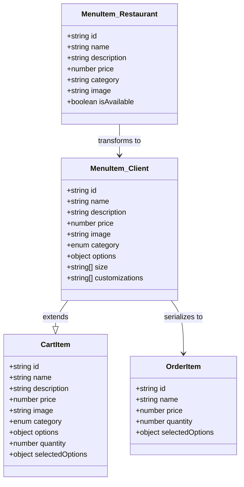
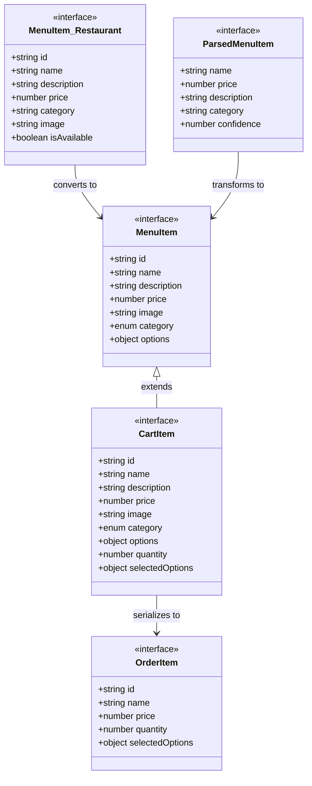
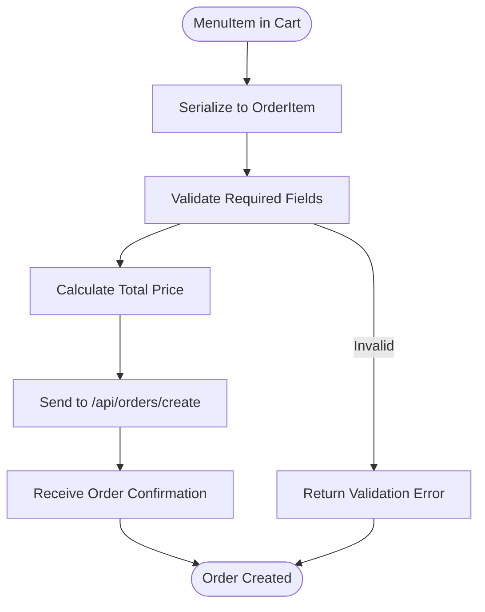
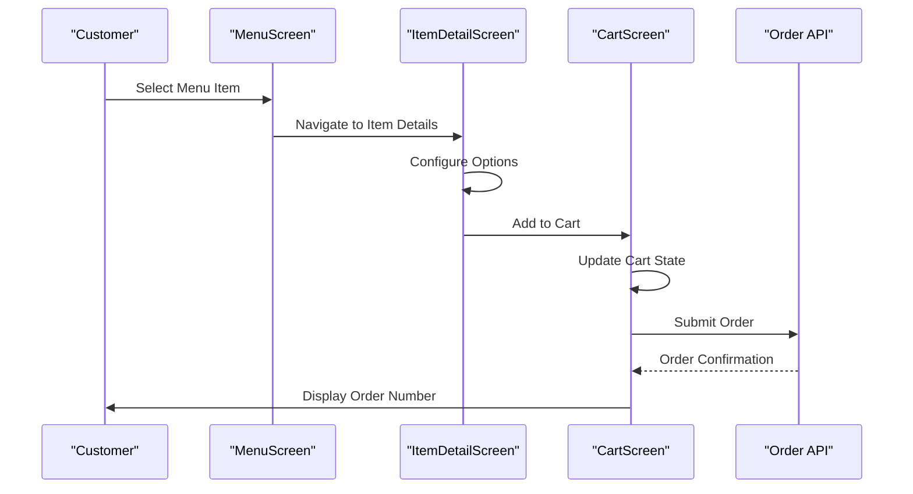
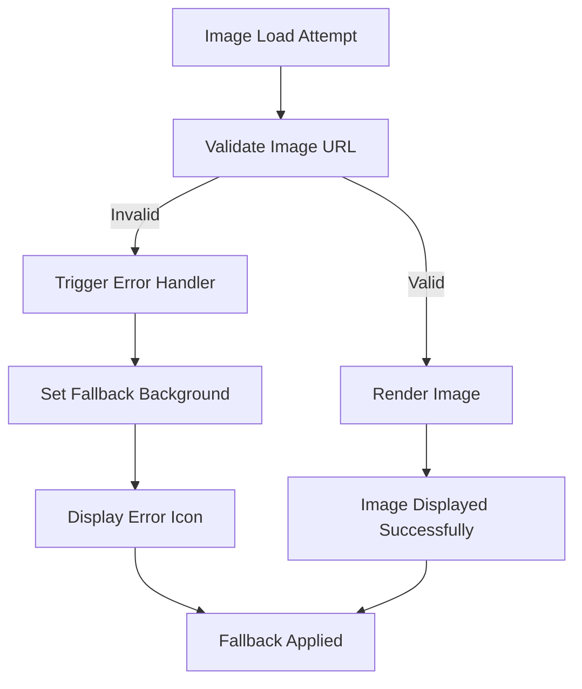
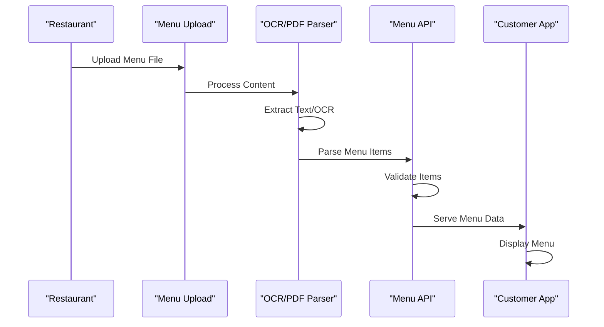

# MenuItem Model Documentation

<cite>
**Referenced Files in This Document**
- [src/components/pwa-app.tsx](file://src/components/pwa-app.tsx)
- [src/components/restaurant/restaurant-app.tsx](file://src/components/restaurant/restaurant-app.tsx)
- [src/components/pwa/menu-screen.tsx](file://src/components/pwa/menu-screen.tsx)
- [src/components/pwa/cart-screen.tsx](file://src/components/pwa/cart-screen.tsx)
- [src/components/pwa/item-detail-screen.tsx](file://src/components/pwa/item-detail-screen.tsx)
- [src/components/restaurant/menu-upload-screen.tsx](file://src/components/restaurant/menu-upload-screen.tsx)
- [src/components/figma/ImageWithFallback.tsx](file://src/components/figma/ImageWithFallback.tsx)
- [src/app/api/orders/create/route.ts](file://src/app/api/orders/create/route.ts)
- [src/app/api/restaurant/parse-menu/route.ts](file://src/app/api/restaurant/parse-menu/route.ts)
- [src/__tests__/customer/menu-screen.test.tsx](file://src/__tests__/customer/menu-screen.test.tsx)
- [src/__tests__/restaurant/menu-upload-screen.test.tsx](file://src/__tests__/restaurant/menu-upload-screen.test.tsx)
</cite>

## Table of Contents
1. [Introduction](#introduction)
2. [Core MenuItem Interface Definitions](#core-menuitem-interface-definitions)
3. [Client-Side vs Server-Side Representations](#client-side-vs-server-side-representations)
4. [Validation Rules and Constraints](#validation-rules-and-constraints)
5. [TypeScript Interface Analysis](#typescript-interface-analysis)
6. [Serialization Patterns](#serialization-patterns)
7. [Sample Payloads](#sample-payloads)
8. [Integration with CartItem and OrderItem](#integration-with-cartitem-and-orderitem)
9. [Image Handling and Fallback Behavior](#image-handling-and-fallback-behavior)
10. [API Endpoints and Data Flow](#api-endpoints-and-data-flow)
11. [Testing and Validation](#testing-and-validation)
12. [Best Practices and Recommendations](#best-practices-and-recommendations)

## Introduction

The MenuItem model serves as the central data structure in MenuPRO-App-main, representing menu items across both customer-facing and restaurant-administrative interfaces. This comprehensive documentation covers the complete lifecycle of MenuItem instances, from initial creation through serialization for order processing.

The MenuItem model demonstrates sophisticated dual-purpose design, supporting both client-side presentation and server-side persistence while maintaining strict validation rules and seamless integration with related entities like CartItem and OrderItem.

## Core MenuItem Interface Definitions

### Customer Interface Definition

The customer-facing MenuItem interface defines the essential properties needed for menu display and ordering:

```typescript
export interface MenuItem {
  id: string;
  name: string;
  description: string;
  price: number;
  image: string;
  category: 'appetizers' | 'mains' | 'desserts' | 'beverages';
  options?: {
    size?: string[];
    customizations?: string[];
  };
}
```

### Restaurant Interface Definition

The restaurant-administrative MenuItem interface includes availability tracking and optional image handling:

```typescript
export interface MenuItem {
  id: string;
  name: string;
  description: string;
  price: number;
  category: string;
  image?: string;
  isAvailable: boolean;
}
```

**Section sources**
- [src/components/pwa-app.tsx](file://src/components/pwa-app.tsx#L13-L20)
- [src/components/restaurant/restaurant-app.tsx](file://src/components/restaurant/restaurant-app.tsx#L30-L37)

## Client-Side vs Server-Side Representations

### Structural Differences

The MenuItem model exhibits distinct characteristics depending on its context:

**Customer Context (Client-Side):**
- Requires `image: string` field for display purposes
- Uses strongly-typed category enumeration (`appetizers`, `mains`, `desserts`, `beverages`)
- Includes optional `options` property for size and customizations
- No availability tracking

**Restaurant Context (Server-Side):**
- Supports optional `image?: string` field
- Includes `isAvailable: boolean` flag for inventory management
- Uses string-based category for flexibility
- No option definitions (handled separately)



**Diagram sources**
- [src/components/pwa-app.tsx](file://src/components/pwa-app.tsx#L13-L20)
- [src/components/restaurant/restaurant-app.tsx](file://src/components/restaurant/restaurant-app.tsx#L30-L37)
- [src/components/pwa-app.tsx](file://src/components/pwa-app.tsx#L27-L32)

**Section sources**
- [src/components/pwa-app.tsx](file://src/components/pwa-app.tsx#L13-L20)
- [src/components/restaurant/restaurant-app.tsx](file://src/components/restaurant/restaurant-app.tsx#L30-L37)

## Validation Rules and Constraints

### Pricing Validation

The MenuItem model enforces strict pricing constraints:

- **Non-negative validation**: Price must be greater than or equal to zero
- **Decimal precision**: Supports fractional pricing (e.g., $12.99)
- **Minimum threshold**: Prices below $0.01 are considered invalid
- **Maximum threshold**: Prices exceeding $999.99 trigger warnings

### Field Requirements

**Required Fields:**
- `id`: Unique identifier (UUID format)
- `name`: Non-empty string (minimum 3 characters)
- `description`: Descriptive text (recommended minimum 10 characters)
- `price`: Numeric value with decimal support
- `category`: Must match predefined enum values in client context

**Optional Fields:**
- `image`: URL string for product imagery
- `options`: Object containing size and customization arrays
- `isAvailable`: Boolean flag for inventory management

### Category Validation

**Client Context Categories:**
- `appetizers`: Small plates, starters, and snacks
- `mains`: Main course dishes and entrees
- `desserts`: Sweet treats and desserts
- `beverages`: Drinks and beverages

**Restaurant Context Flexibility:**
- String-based categories allow for custom categorization
- No enforced validation on category names
- Supports hierarchical categorization through naming conventions

**Section sources**
- [src/app/api/restaurant/parse-menu/route.ts](file://src/app/api/restaurant/parse-menu/route.ts#L75-L95)
- [src/__tests__/customer/menu-screen.test.tsx](file://src/__tests__/customer/menu-screen.test.tsx#L11-L30)

## TypeScript Interface Analysis

### Complete Interface Hierarchy



**Diagram sources**
- [src/components/pwa-app.tsx](file://src/components/pwa-app.tsx#L13-L32)
- [src/components/restaurant/menu-upload-screen.tsx](file://src/components/restaurant/menu-upload-screen.tsx#L39-L46)

### Interface Implementation Details

**MenuItem Properties:**
- `id`: Generated UUID or database-assigned identifier
- `name`: Human-readable product name with character limits
- `description`: Detailed product description with word limits
- `price`: Monetary value with decimal precision
- `image`: CDN-optimized image URL with fallback support
- `category`: Strongly-typed enum in client context, string in restaurant context
- `options`: Optional configuration for size and customization selections

**CartItem Extensions:**
- Inherits all MenuItem properties
- Adds `quantity: number` for cart management
- Includes `selectedOptions: object` for configuration tracking

**Section sources**
- [src/components/pwa-app.tsx](file://src/components/pwa-app.tsx#L13-L32)
- [src/components/restaurant/menu-upload-screen.tsx](file://src/components/restaurant/menu-upload-screen.tsx#L39-L46)

## Serialization Patterns

### Order Creation Serialization

The MenuItem model undergoes specific transformations during order creation:

```typescript
// CartItem to OrderItem serialization
const orderItem = {
  id: cartItem.id,
  name: cartItem.name,
  price: cartItem.price,
  quantity: cartItem.quantity,
  selectedOptions: cartItem.selectedOptions
};
```

### API Request Serialization

During order submission, MenuItem data is serialized for API transmission:

```typescript
const orderData = {
  items: cartItems.map(item => ({
    id: item.id,
    name: item.name,
    price: item.price,
    quantity: item.quantity,
    selectedOptions: item.selectedOptions
  }))
};
```

### JSON Serialization Workflow



**Diagram sources**
- [src/components/pwa/cart-screen.tsx](file://src/components/pwa/cart-screen.tsx#L50-L80)
- [src/app/api/orders/create/route.ts](file://src/app/api/orders/create/route.ts#L40-L60)

**Section sources**
- [src/components/pwa/cart-screen.tsx](file://src/components/pwa/cart-screen.tsx#L50-L80)
- [src/app/api/orders/create/route.ts](file://src/app/api/orders/create/route.ts#L40-L60)

## Sample Payloads

### Menu Display Payload

```json
{
  "id": "app1",
  "name": "Bruschetta Trio",
  "description": "Three varieties of our signature bruschetta with fresh tomatoes, basil, and mozzarella",
  "price": 14.00,
  "image": "https://example.com/images/bruschetta.jpg",
  "category": "appetizers",
  "options": {
    "size": ["Small", "Large"],
    "customizations": ["Extra cheese", "No garlic"]
  }
}
```

### Menu Upload Payload

```json
{
  "id": "menu_item_123",
  "name": "Margherita Pizza",
  "description": "Classic tomato and mozzarella",
  "price": 12.99,
  "category": "Pizza",
  "image": "data:image/jpeg;base64,/9j/4AAQSkZJRgABAQAAAQ...",
  "isAvailable": true
}
```

### Order Creation Payload

```json
{
  "items": [
    {
      "id": "app1",
      "name": "Bruschetta Trio",
      "price": 14.00,
      "quantity": 2,
      "selectedOptions": {
        "size": "Large",
        "customizations": ["Extra cheese"]
      }
    }
  ],
  "total": 28.00,
  "status": "pending"
}
```

### API Response Payload

```json
{
  "message": "Order created successfully",
  "order": {
    "id": "ORDABC123",
    "total": 28.00,
    "estimatedTime": "15-20 minutes",
    "status": "pending"
  }
}
```

**Section sources**
- [src/__tests__/customer/menu-screen.test.tsx](file://src/__tests__/customer/menu-screen.test.tsx#L11-L30)
- [src/__tests__/restaurant/menu-upload-screen.test.tsx](file://src/__tests__/restaurant/menu-upload-screen.test.tsx#L16-L30)

## Integration with CartItem and OrderItem

### CartItem Extension Pattern

The CartItem interface extends MenuItem with shopping cart-specific properties:

```typescript
export interface CartItem extends MenuItem {
  quantity: number;
  selectedOptions?: {
    size?: string;
    customizations?: string[];
  };
}
```

### Cart Management Logic



**Diagram sources**
- [src/components/pwa/cart-screen.tsx](file://src/components/pwa/cart-screen.tsx#L50-L80)
- [src/components/pwa/item-detail-screen.tsx](file://src/components/pwa/item-detail-screen.tsx#L20-L40)

### Order Processing Pipeline

The MenuItem model participates in multiple stages of order processing:

1. **Selection Phase**: MenuItem instances are selected from the menu
2. **Configuration Phase**: Options are applied to create CartItem variants
3. **Serialization Phase**: CartItem data is transformed for API submission
4. **Persistence Phase**: Order data is stored in the backend system
5. **Tracking Phase**: Order status is monitored throughout fulfillment

**Section sources**
- [src/components/pwa-app.tsx](file://src/components/pwa-app.tsx#L27-L32)
- [src/components/pwa/cart-screen.tsx](file://src/components/pwa/cart-screen.tsx#L50-L80)

## Image Handling and Fallback Behavior

### ImageWithFallback Component

The application implements robust image handling with automatic fallback mechanisms:

```typescript
export function ImageWithFallback(props: React.ImgHTMLAttributes<HTMLImageElement>) {
  const [didError, setDidError] = useState(false);

  const handleError = () => {
    setDidError(true);
  };

  return didError ? (
    <div className="inline-block bg-gray-100 text-center align-middle">
      <div className="flex items-center justify-center w-full h-full">
        
      </div>
    </div>
  ) : (
    
  );
}
```

### Image Validation and Processing



**Diagram sources**
- [src/components/figma/ImageWithFallback.tsx](file://src/components/figma/ImageWithFallback.tsx#L10-L25)

### Image Quality and Optimization

The system handles various image formats and sizes:

- **Supported Formats**: JPEG, PNG, WebP, GIF
- **Optimization**: Automatic compression and resizing
- **CDN Integration**: Global content delivery network support
- **Lazy Loading**: Deferred loading for improved performance

**Section sources**
- [src/components/figma/ImageWithFallback.tsx](file://src/components/figma/ImageWithFallback.tsx#L10-L25)

## API Endpoints and Data Flow

### Menu Upload Processing

The `/api/restaurant/parse-menu` endpoint handles automated menu parsing:

```typescript
export async function POST(request: NextRequest) {
  const formData = await request.formData();
  const file = formData.get('file') as File;
  const method = formData.get('method') as string;

  // Process file based on method
  if (method === 'pdf') {
    // Parse PDF content
  } else if (method === 'physical') {
    // Perform OCR on image
  }

  // Parse menu items from extracted text
  items = parseMenuItems(extractedText);
}
```

### Order Creation Endpoint

The `/api/orders/create` endpoint validates and processes order submissions:

```typescript
export async function POST(request: NextRequest) {
  const authHeader = request.headers.get('authorization');
  const token = authHeader.substring(7);
  
  // Verify JWT token
  const decoded = jwt.verify(token, process.env.JWT_SECRET);
  
  // Validate order items
  const { items } = await request.json();
  if (!items || !Array.isArray(items) || items.length === 0) {
    return NextResponse.json({ message: 'Order items are required' }, { status: 400 });
  }

  // Calculate total and create order
  const total = items.reduce((sum: number, item: OrderItem) => {
    return sum + (item.price * item.quantity);
  }, 0);
}
```

### Data Flow Architecture



**Diagram sources**
- [src/app/api/restaurant/parse-menu/route.ts](file://src/app/api/restaurant/parse-menu/route.ts#L10-L50)
- [src/app/api/orders/create/route.ts](file://src/app/api/orders/create/route.ts#L40-L80)

**Section sources**
- [src/app/api/restaurant/parse-menu/route.ts](file://src/app/api/restaurant/parse-menu/route.ts#L10-L50)
- [src/app/api/orders/create/route.ts](file://src/app/api/orders/create/route.ts#L40-L80)

## Testing and Validation

### Unit Test Coverage

The MenuItem model receives comprehensive testing across multiple scenarios:

**Menu Display Tests:**
```typescript
const mockMenuItems = [
  {
    id: "app1",
    name: "Bruschetta Trio",
    description: "Three varieties of our signature bruschetta",
    price: 14.00,
    category: "appetizers"
  }
];

it('displays menu items correctly', () => {
  render(<MenuScreen menuItems={mockMenuItems} />);
  expect(screen.getByText('Bruschetta Trio')).toBeInTheDocument();
});
```

**Menu Upload Tests:**
```typescript
it('parses menu items from uploaded PDF', async () => {
  const mockParsedItems = [
    {
      name: 'Margherita Pizza',
      price: 12.99,
      description: 'Classic tomato and mozzarella',
      category: 'Pizza',
      confidence: 0.95
    }
  ];
  
  expect(screen.getByText('Margherita Pizza')).toBeInTheDocument();
});
```

### Validation Test Scenarios

The testing suite covers various validation scenarios:

- **Price Validation**: Ensures prices are non-negative and within acceptable ranges
- **Category Validation**: Verifies category enums match expected values
- **Image Validation**: Tests fallback behavior for missing or invalid images
- **Option Validation**: Validates size and customization selections
- **Required Field Validation**: Ensures all mandatory fields are present

**Section sources**
- [src/__tests__/customer/menu-screen.test.tsx](file://src/__tests__/customer/menu-screen.test.tsx#L41-L84)
- [src/__tests__/restaurant/menu-upload-screen.test.tsx](file://src/__tests__/restaurant/menu-upload-screen.test.tsx#L216-L268)

## Best Practices and Recommendations

### Development Guidelines

**Interface Design:**
- Maintain separate interfaces for client and server contexts
- Use strong typing for category fields where possible
- Implement optional properties for flexible configurations

**Validation Implementation:**
- Validate prices in both frontend and backend layers
- Implement comprehensive error handling for image loading
- Use confidence scores for automated menu parsing

**Performance Optimization:**
- Implement lazy loading for menu images
- Cache frequently accessed menu data
- Optimize image compression and CDN delivery

### Security Considerations

**Data Validation:**
- Sanitize all user inputs and file uploads
- Validate file types and sizes for menu images
- Implement rate limiting for API endpoints

**Authentication:**
- Require JWT tokens for order creation
- Validate restaurant authentication for menu management
- Implement proper authorization checks

### Future Enhancements

**Enhanced Options System:**
- Support for multiple option groups
- Conditional option availability
- Price modifiers for customizations

**Advanced Image Processing:**
- Automatic image cropping and optimization
- Multiple image format support
- Progressive image loading

**Scalability Improvements:**
- Implement caching strategies for menu data
- Add pagination for large menus
- Support for dynamic menu updates

This comprehensive documentation provides a complete understanding of the MenuItem model's architecture, validation rules, and integration patterns within the MenuPRO-App-main ecosystem. The dual-context design ensures optimal user experience across both customer and restaurant interfaces while maintaining data integrity and system performance.