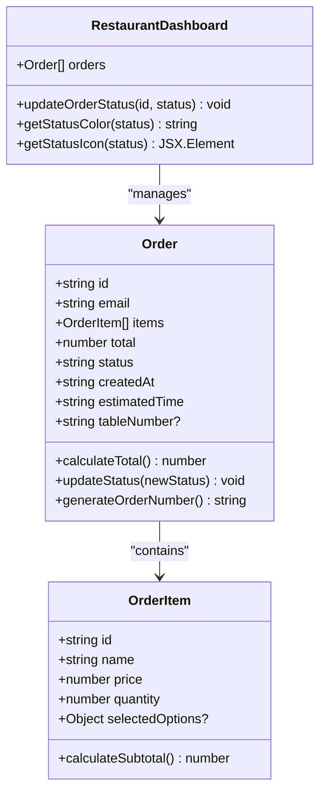
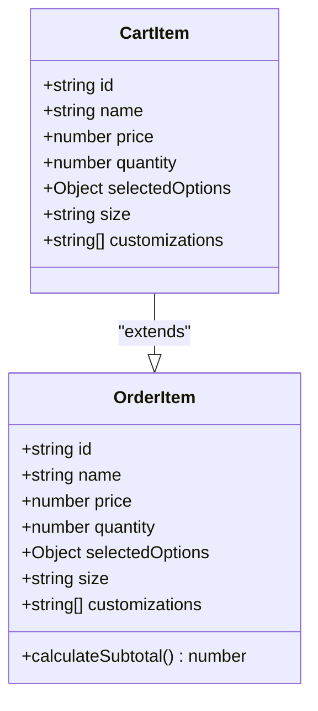
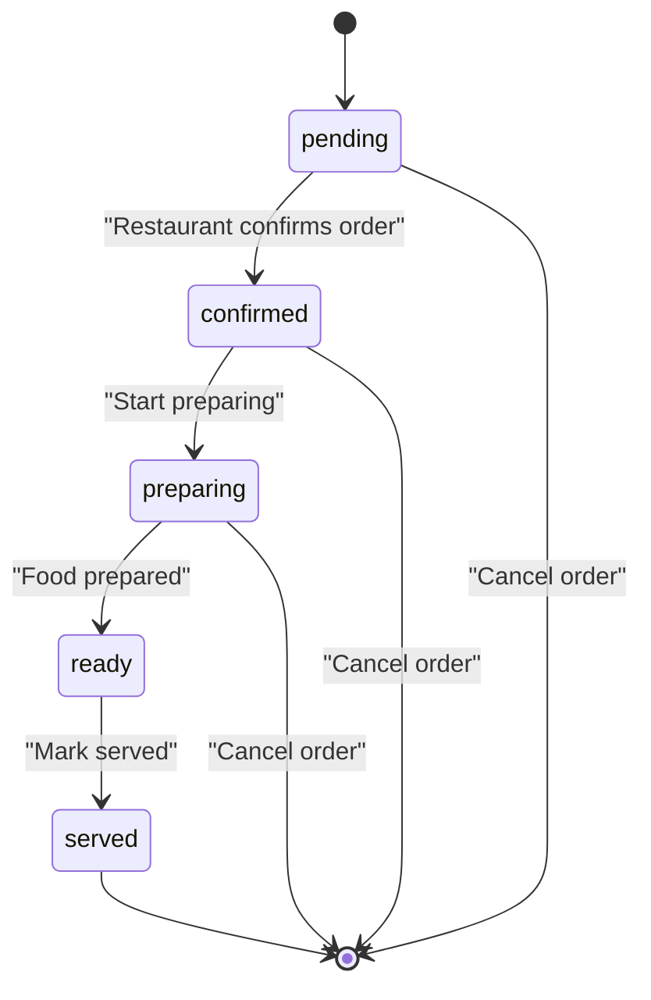
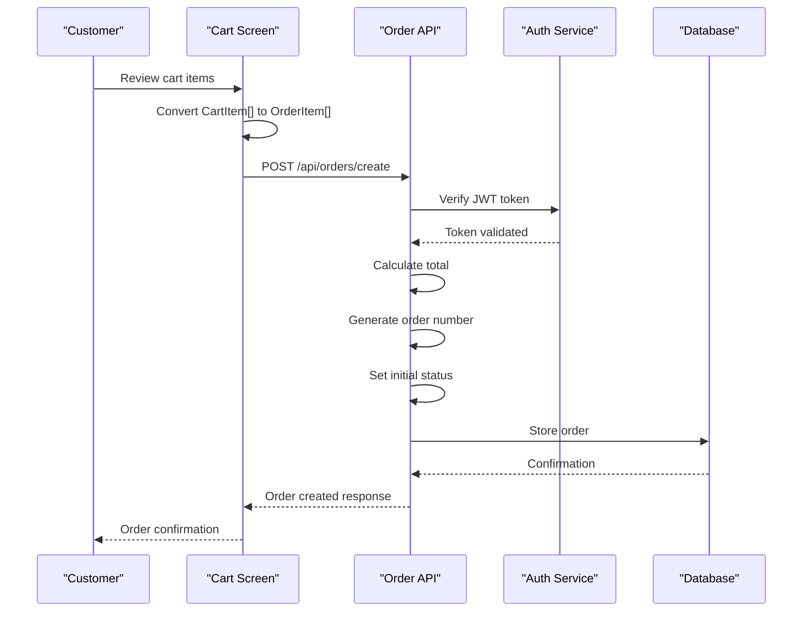
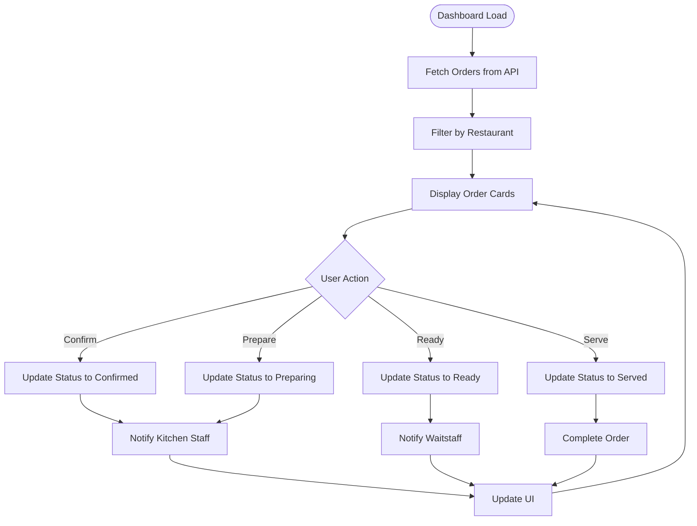

# Order Model Documentation

<cite>
**Referenced Files in This Document**
- [src/app/api/orders/create/route.ts](file://src/app/api/orders/create/route.ts)
- [src/components/restaurant/restaurant-dashboard.tsx](file://src/components/restaurant/restaurant-dashboard.tsx)
- [src/components/pwa/cart-screen.tsx](file://src/components/pwa/cart-screen.tsx)
- [src/components/pwa-app.tsx](file://src/components/pwa-app.tsx)
- [src/components/pwa/order-confirmation-screen.tsx](file://src/components/pwa/order-confirmation-screen.tsx)
- [src/components/pwa/payment-success-screen.tsx](file://src/components/pwa/payment-success-screen.tsx)
- [src/components/custom-pricing-modal.tsx](file://src/components/custom-pricing-modal.tsx)
- [src/__tests__/integration/customer-flow.test.tsx](file://src/__tests__/integration/customer-flow.test.tsx)
</cite>

## Table of Contents
1. [Introduction](#introduction)
2. [Order Entity Structure](#order-entity-structure)
3. [OrderItem Structure](#orderitem-structure)
4. [Status Management](#status-management)
5. [Order Creation Process](#order-creation-process)
6. [API Endpoints](#api-endpoints)
7. [Dashboard Integration](#dashboard-integration)
8. [Validation and Error Handling](#validation-and-error-handling)
9. [Sample Payloads](#sample-payloads)
10. [Business Rules](#business-rules)
11. [Troubleshooting](#troubleshooting)

## Introduction

The Order entity in MenuPRO-App-main represents customer transactions in a modern restaurant ordering system. This comprehensive model handles the complete lifecycle of restaurant orders, from initial customer placement through final service delivery. The system supports both web-based customer ordering and restaurant management interfaces, with sophisticated status tracking and real-time communication capabilities.

The Order model serves as the central data structure for managing restaurant transactions, incorporating denormalized pricing information for historical accuracy while maintaining flexibility for order modifications and tracking throughout the preparation and service process.

## Order Entity Structure

The Order entity consists of several key fields that capture the complete state and metadata of a restaurant transaction:



**Diagram sources**
- [src/app/api/orders/create/route.ts](file://src/app/api/orders/create/route.ts#L10-L19)
- [src/components/restaurant/restaurant-dashboard.tsx](file://src/components/restaurant/restaurant-dashboard.tsx#L30-L40)

### Core Fields

**id**: Unique identifier generated using a random alphanumeric string (8 characters, uppercase). This serves as the primary key for order tracking and retrieval.

**email**: Customer's email address used for authentication and order identification. This field is populated from the JWT token during order creation.

**items**: Array of OrderItem objects containing detailed information about each menu item in the order, including quantities and customizations.

**total**: Calculated total amount for the order, derived from individual item prices multiplied by quantities.

**status**: Enumerated field with five possible values representing the order lifecycle:
- `pending`: New order received, awaiting confirmation
- `confirmed`: Order accepted by restaurant staff
- `preparing`: Kitchen staff has started preparation
- `ready`: Food is prepared and ready for service
- `served`: Food has been delivered to the customer

**createdAt**: ISO 8601 formatted timestamp indicating when the order was placed.

**estimatedTime**: Human-readable estimate of preparation time, calculated based on item count (5 minutes base + 2 minutes per item).

**tableNumber**: Optional field for table identification, used primarily in restaurant dashboard displays.

**Section sources**
- [src/app/api/orders/create/route.ts](file://src/app/api/orders/create/route.ts#L10-L19)
- [src/components/restaurant/restaurant-dashboard.tsx](file://src/components/restaurant/restaurant-dashboard.tsx#L30-L40)

## OrderItem Structure

The OrderItem represents individual menu items within an order, capturing both product details and customer selections:



**Diagram sources**
- [src/app/api/orders/create/route.ts](file://src/app/api/orders/create/route.ts#L5-L10)
- [src/components/pwa-app.tsx](file://src/components/pwa-app.tsx#L27-L33)

### Denormalization Strategy

The OrderItem structure intentionally denormalizes pricing information to ensure historical accuracy. This design choice prevents discrepancies that could arise from menu price changes after orders are placed, maintaining transparency for both customers and restaurant staff.

### Selected Options

The `selectedOptions` field captures customer customizations:
- **size**: Optional size specification (e.g., small, medium, large)
- **customizations**: Array of specific modifications (e.g., "extra cheese", "no onions")

This structure allows for precise order fulfillment while maintaining flexibility for menu variations and customer preferences.

**Section sources**
- [src/app/api/orders/create/route.ts](file://src/app/api/orders/create/route.ts#L5-L10)
- [src/components/pwa-app.tsx](file://src/components/pwa-app.tsx#L27-L33)

## Status Management

The order status system follows a linear progression through five distinct states, each with specific business rules and user actions:



### Status Transitions

**Pending**: Initial state when an order is first created. Customers can see their order status and estimated time. Restaurant staff can confirm or reject the order.

**Confirmed**: Restaurant accepts the order for preparation. This triggers kitchen notifications and begins the preparation process.

**Preparing**: Kitchen staff has started preparing the food. This status indicates active preparation and helps manage kitchen workflow.

**Ready**: Food is prepared and ready for service. This status alerts waitstaff to deliver the order to the appropriate table.

**Served**: Food has been delivered to the customer. This completes the order lifecycle.

### Status Colors and Icons

Each status has associated visual indicators for both customer and restaurant interfaces:

| Status | Color | Icon | Description |
|--------|-------|------|-------------|
| pending | Yellow | Clock | New order received |
| confirmed | Blue | CheckCircle | Order accepted |
| preparing | Orange | RefreshCw | Preparing food |
| ready | Green | Bell | Food ready |
| served | Gray | CheckCircle | Order completed |

**Section sources**
- [src/components/restaurant/restaurant-dashboard.tsx](file://src/components/restaurant/restaurant-dashboard.tsx#L101-L128)

## Order Creation Process

The order creation process involves multiple steps from cart conversion to API submission and database persistence:



**Diagram sources**
- [src/components/pwa/cart-screen.tsx](file://src/components/pwa/cart-screen.tsx#L39-L87)
- [src/app/api/orders/create/route.ts](file://src/app/api/orders/create/route.ts#L48-L95)

### Cart to Order Conversion

The conversion process transforms CartItem objects into OrderItem structures:

1. **Item Validation**: Ensures all cart items have valid quantities and prices
2. **Option Processing**: Extracts size and customization options from cart items
3. **Price Calculation**: Multiplies item prices by quantities for subtotal calculation
4. **Order Assembly**: Creates complete OrderItem array for API submission

### API Submission

The order creation endpoint performs several validation and processing steps:

1. **Authentication**: Validates JWT token from Authorization header
2. **Input Validation**: Checks for required items array and non-empty content
3. **Total Calculation**: Sums individual item totals with quantity multiplication
4. **Estimation**: Calculates preparation time based on item count
5. **Persistence**: Stores order in memory (production would use database)

**Section sources**
- [src/components/pwa/cart-screen.tsx](file://src/components/pwa/cart-screen.tsx#L39-L87)
- [src/app/api/orders/create/route.ts](file://src/app/api/orders/create/route.ts#L48-L95)

## API Endpoints

The system provides two primary API endpoints for order management:

### POST /api/orders/create

Creates a new order from customer cart data:

**Request Headers**:
- `Content-Type: application/json`
- `Authorization: Bearer <jwt-token>`

**Request Body**:
```json
{
  "items": [
    {
      "id": "ITEM001",
      "name": "Margherita Pizza",
      "price": 18.99,
      "quantity": 2,
      "selectedOptions": {
        "size": "medium",
        "customizations": ["extra cheese"]
      }
    }
  ]
}
```

**Response**:
```json
{
  "message": "Order created successfully",
  "order": {
    "id": "ABCDEF12",
    "total": 37.98,
    "estimatedTime": "9 minutes",
    "status": "pending"
  }
}
```

### GET /api/orders/create

Retrieves orders for the authenticated customer:

**Request Headers**:
- `Authorization: Bearer <jwt-token>`

**Response**:
```json
{
  "orders": [
    {
      "id": "ABCDEF12",
      "email": "customer@example.com",
      "items": [...],
      "total": 37.98,
      "status": "pending",
      "createdAt": "2024-01-15T10:30:00.000Z",
      "estimatedTime": "9 minutes"
    }
  ]
}
```

**Section sources**
- [src/app/api/orders/create/route.ts](file://src/app/api/orders/create/route.ts#L48-L161)

## Dashboard Integration

The restaurant dashboard provides comprehensive order management capabilities:



**Diagram sources**
- [src/components/restaurant/restaurant-dashboard.tsx](file://src/components/restaurant/restaurant-dashboard.tsx#L276-L327)

### Dashboard Features

**Order Cards**: Each order displays essential information including:
- Order number and status badges
- Customer email and table number
- Item breakdown with quantities and prices
- Total amount and estimated time
- Status-specific action buttons

**Real-time Updates**: Status changes are immediately reflected across all connected interfaces, ensuring synchronized order management.

**Visual Indicators**: Color-coded status badges and icons provide quick visual feedback on order progress.

**Action Buttons**: Restaurant staff can advance order status through intuitive button interfaces:
- Confirm: Accept order for preparation
- Start Preparing: Begin kitchen workflow
- Mark Ready: Alert waitstaff for service
- Mark Served: Complete the order

**Section sources**
- [src/components/restaurant/restaurant-dashboard.tsx](file://src/components/restaurant/restaurant-dashboard.tsx#L241-L327)

## Validation and Error Handling

The system implements comprehensive validation and error handling throughout the order lifecycle:

### Input Validation

**Order Items Validation**:
- Must be present and non-empty array
- Each item requires valid price and quantity
- Price must be positive number
- Quantity must be positive integer

**Authentication Validation**:
- JWT token required in Authorization header
- Token must be valid and not expired
- Token must contain valid email claim

### Error Responses

**400 Bad Request**: Invalid order data or missing required fields
```json
{
  "message": "Order items are required"
}
```

**401 Unauthorized**: Authentication failure
```json
{
  "message": "Invalid or expired token"
}
```

**500 Internal Server Error**: System failures during processing
```json
{
  "message": "Failed to create order"
}
```

### Client-side Validation

The cart screen implements client-side validation to prevent invalid submissions:

- Empty cart detection
- Minimum order requirements
- Form field validation
- Real-time error messaging

**Section sources**
- [src/app/api/orders/create/route.ts](file://src/app/api/orders/create/route.ts#L55-L67)
- [src/components/pwa/cart-screen.tsx](file://src/components/pwa/cart-screen.tsx#L39-L87)

## Sample Payloads

### Customer Order Creation

**Request**:
```json
{
  "items": [
    {
      "id": "MEN001",
      "name": "Grilled Salmon",
      "price": 24.99,
      "quantity": 1,
      "selectedOptions": {
        "size": "regular",
        "customizations": ["no lemon", "extra sauce"]
      }
    },
    {
      "id": "MEN002",
      "name": "Coke",
      "price": 2.99,
      "quantity": 2
    }
  ]
}
```

**Response**:
```json
{
  "message": "Order created successfully",
  "order": {
    "id": "XYZ7890",
    "total": 29.97,
    "estimatedTime": "9 minutes",
    "status": "pending"
  }
}
```

### Restaurant Dashboard Order

**Order Object**:
```json
{
  "id": "ORD003",
  "customerEmail": "john.doe@example.com",
  "items": [
    {
      "name": "Vegetable Stir Fry",
      "quantity": 1,
      "price": 14.99
    },
    {
      "name": "Steamed Rice",
      "quantity": 1,
      "price": 2.99
    }
  ],
  "total": 17.98,
  "status": "confirmed",
  "createdAt": "2024-01-15T11:15:00.000Z",
  "estimatedTime": "12 minutes",
  "tableNumber": "7"
}
```

### API Error Response

**Authentication Error**:
```json
{
  "message": "Authorization token required",
  "status": 401
}
```

**Validation Error**:
```json
{
  "message": "Order items are required",
  "status": 400
}
```

## Business Rules

### Order Lifecycle Rules

1. **Initial State**: All orders start in `pending` status
2. **Status Progression**: Orders can only advance through the predefined status chain
3. **Cancellation**: Orders can be cancelled from any state except `served`
4. **Time Estimation**: Base preparation time is 5 minutes plus 2 minutes per item
5. **Historical Accuracy**: Pricing is captured at order creation time

### Restaurant Workflow

1. **Order Reception**: Pending orders appear in restaurant dashboard
2. **Preparation Coordination**: Confirmed orders trigger kitchen notifications
3. **Service Management**: Ready orders notify waitstaff for table delivery
4. **Quality Control**: Served orders mark completion of the dining experience

### Customer Experience

1. **Transparency**: Customers can track order progress in real-time
2. **Communication**: Estimated times help manage customer expectations
3. **Flexibility**: Orders can be cancelled before preparation begins
4. **Confirmation**: Clear status updates throughout the process

## Troubleshooting

### Common Issues

**Order Creation Failures**:
- Verify JWT token is included in Authorization header
- Ensure order items array contains valid data
- Check that prices and quantities are positive numbers
- Validate that cart is not empty

**Authentication Problems**:
- Confirm token is properly formatted (Bearer prefix)
- Verify token has not expired
- Check that email claim is present in token
- Ensure JWT_SECRET environment variable is configured

**Status Update Issues**:
- Verify restaurant has permission to modify orders
- Check that status transitions follow the allowed sequence
- Ensure order exists and belongs to the authenticated restaurant

### Debugging Steps

1. **Check Network Requests**: Verify API endpoints are reachable
2. **Validate Tokens**: Test JWT token validity independently
3. **Inspect Console Logs**: Look for JavaScript errors in browser console
4. **Verify Environment Variables**: Ensure all required environment variables are set
5. **Test with Mock Data**: Use hardcoded test data to isolate issues

### Performance Considerations

- **Memory Management**: Current implementation uses in-memory storage; consider database migration for production
- **API Rate Limiting**: Implement rate limiting for order creation endpoints
- **Caching Strategy**: Cache frequently accessed order data for improved performance
- **Notification Systems**: Implement efficient push notifications for real-time updates

**Section sources**
- [src/app/api/orders/create/route.ts](file://src/app/api/orders/create/route.ts#L48-L161)
- [src/components/pwa/cart-screen.tsx](file://src/components/pwa/cart-screen.tsx#L39-L87)