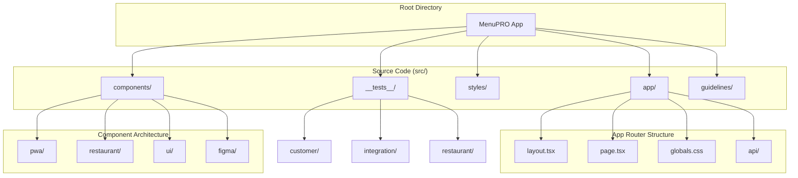
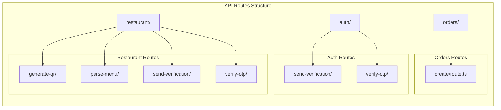
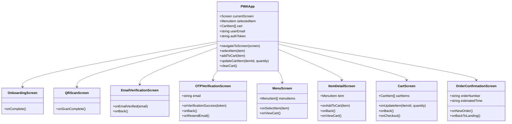
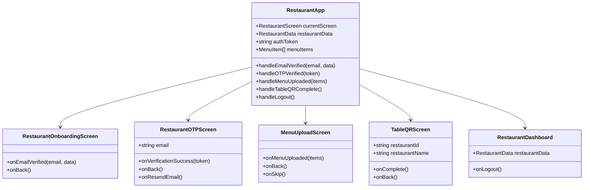
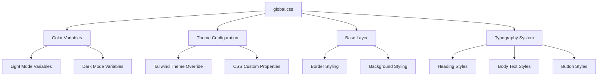
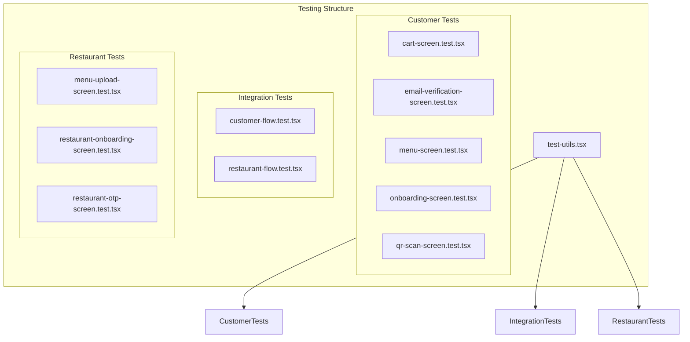
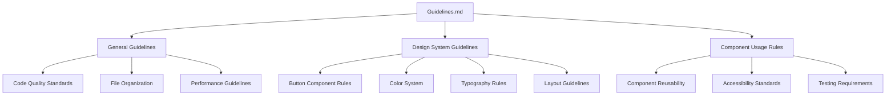
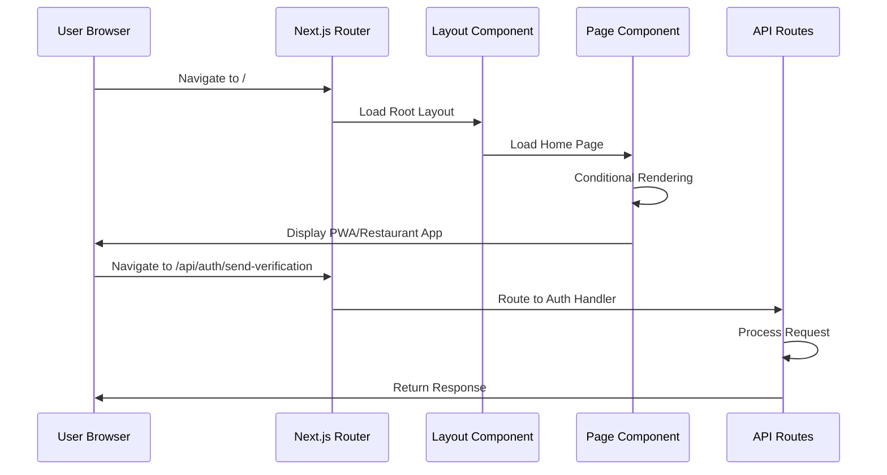

# Directory Structure

<cite>
**Referenced Files in This Document**
- [README.md](file://README.md)
- [src/guidelines/Guidelines.md](file://src/guidelines/Guidelines.md)
- [src/styles/globals.css](file://src/styles/globals.css)
- [src/app/layout.tsx](file://src/app/layout.tsx)
- [src/app/page.tsx](file://src/app/page.tsx)
- [src/components/ui/index.ts](file://src/components/ui/index.ts)
- [src/components/pwa-app.tsx](file://src/components/pwa-app.tsx)
- [src/components/restaurant/restaurant-app.tsx](file://src/components/restaurant/restaurant-app.tsx)
- [src/components/ui/button.tsx](file://src/components/ui/button.tsx)
- [src/__tests__/test-utils.tsx](file://src/__tests__/test-utils.tsx)
</cite>

## Table of Contents
1. [Introduction](#introduction)
2. [Project Structure Overview](#project-structure-overview)
3. [src/app Directory - Next.js App Router](#srcapp-directory---nextjs-app-router)
4. [src/components Directory - Component Organization](#srccomponents-directory---component-organization)
5. [src/styles Directory - Styling System](#srcstyles-directory---styling-system)
6. [src/__tests__ Directory - Testing Infrastructure](#srctest-directory---testing-infrastructure)
7. [src/guidelines Directory - Development Standards](#srcguidelines-directory---development-standards)
8. [File Naming Conventions and Patterns](#file-naming-conventions-and-patterns)
9. [Asset Handling and Routing Mechanics](#asset-handling-and-routing-mechanics)
10. [Developer Navigation Guide](#developer-navigation-guide)

## Introduction

The MenuPRO application follows a modern, scalable directory structure designed for Next.js 14 with TypeScript. The architecture separates concerns between frontend (PWA) and backend (API routes), utilizing Radix UI components and Tailwind CSS for a cohesive design system. This documentation provides a comprehensive guide to understanding the project's organization, enabling developers to quickly locate and understand key functionality.

## Project Structure Overview

The project is organized around several key directories, each serving a specific purpose in the application architecture:

**Diagram sources**
- [README.md](file://README.md#L40-L50)
- [src/app/layout.tsx](file://src/app/layout.tsx#L1-L70)
- [src/components/pwa-app.tsx](file://src/components/pwa-app.tsx#L1-L154)

## src/app Directory - Next.js App Router

The `src/app` directory serves as the heart of the Next.js App Router, implementing modern routing patterns with automatic code splitting and API route organization.

### Core Application Files

**Layout and Metadata Management**
- `layout.tsx`: Root layout with metadata configuration for SEO optimization
- `page.tsx`: Main landing page component with conditional rendering for PWA and restaurant modes
- `globals.css`: Global styling configuration with Tailwind CSS integration

### API Route Organization

The API routes are organized by domain for clear separation of concerns:

**Diagram sources**
- [src/app/layout.tsx](file://src/app/layout.tsx#L1-L70)
- [src/app/page.tsx](file://src/app/page.tsx#L1-L55)

**Section sources**
- [src/app/layout.tsx](file://src/app/layout.tsx#L1-L70)
- [src/app/page.tsx](file://src/app/page.tsx#L1-L55)

## src/components Directory - Component Organization

The `src/components` directory implements a hierarchical component structure with clear separation between different application domains.

### PWA Components - Customer-Facing Screens

The PWA directory contains all customer-facing screens and experiences:

**Diagram sources**
- [src/components/pwa-app.tsx](file://src/components/pwa-app.tsx#L1-L154)
- [src/components/pwa/onboarding-screen.tsx](file://src/components/pwa/onboarding-screen.tsx)
- [src/components/pwa/qr-scan-screen.tsx](file://src/components/pwa/qr-scan-screen.tsx)

### Restaurant Components - Admin Interfaces

The restaurant directory handles administrative interfaces for restaurant owners:

**Diagram sources**
- [src/components/restaurant/restaurant-app.tsx](file://src/components/restaurant/restaurant-app.tsx#L1-L134)
- [src/components/restaurant/restaurant-onboarding-screen.tsx](file://src/components/restaurant/restaurant-onboarding-screen.tsx)
- [src/components/restaurant/restaurant-otp-screen.tsx](file://src/components/restaurant/restaurant-otp-screen.tsx)

### UI Components - Reusable Radix-Based Components

The UI directory provides a comprehensive library of reusable components built on Radix UI primitives:

```mermaid
graph TB
subgraph "UI Component Library"
Button[Button]
Card[Card]
Badge[Badge]
Input[Input]
Progress[Progress]
Form[Form]
Dialog[Dialog]
Alert[Alert]
Avatar[Avatar]
Checkbox[Checkbox]
Select[Select]
TextArea[TextArea]
Switch[Switch]
Slider[Slider]
Toggle[Toggle]
Tooltip[Tooltip]
Calendar[Calendar]
Table[Table]
Accordion[Accordion]
Tabs[Tabs]
Sidebar[Sidebar]
Sheet[Sheet]
Drawer[Drawer]
NavigationMenu[NavigationMenu]
Pagination[Pagination]
Popover[Popover]
DropdownMenu[DropdownMenu]
ContextMenu[ContextMenu]
HoverCard[HoverCard]
Command[Command]
Menubar[Menubar]
Separator[Separator]
AspectRatio[AspectRatio]
ScrollArea[ScrollArea]
Resizable[Resizable]
Skeleton[Skeleton]
Chart[Chart]
Sonner[Sonner]
InputOTP[InputOTP]
Breadcrumb[Breadcrumb]
Collapsible[Collapsible]
UseMobile[use-mobile]
Utils[utils]
end
Button --> Variants[Variant System]
Card --> Layout[Layout Components]
Form --> Validation[Validation System]
Dialog --> Modal[Modal System]
```

**Diagram sources**
- [src/components/ui/index.ts](file://src/components/ui/index.ts#L1-L6)
- [src/components/ui/button.tsx](file://src/components/ui/button.tsx#L1-L59)

**Section sources**
- [src/components/pwa-app.tsx](file://src/components/pwa-app.tsx#L1-L154)
- [src/components/restaurant/restaurant-app.tsx](file://src/components/restaurant/restaurant-app.tsx#L1-L134)
- [src/components/ui/index.ts](file://src/components/ui/index.ts#L1-L6)

## src/styles Directory - Styling System

The styling system utilizes Tailwind CSS with a comprehensive color palette and theme configuration.

### Global Styles and Theme Configuration

The global CSS file implements a sophisticated theming system with support for light and dark modes:

**Diagram sources**
- [src/styles/globals.css](file://src/styles/globals.css#L1-L190)

**Section sources**
- [src/styles/globals.css](file://src/styles/globals.css#L1-L190)

## src/__tests__ Directory - Testing Infrastructure

The testing infrastructure provides comprehensive coverage for both customer and restaurant user flows, along with shared testing utilities.

### Test Organization

**Diagram sources**
- [src/__tests__/test-utils.tsx](file://src/__tests__/test-utils.tsx#L1-L74)

**Section sources**
- [src/__tests__/test-utils.tsx](file://src/__tests__/test-utils.tsx#L1-L74)

## src/guidelines Directory - Development Standards

The guidelines directory contains development standards and design system rules to ensure consistency across the codebase.

### Guidelines Structure

The guidelines file provides a template for development rules and design system specifications:

**Section sources**
- [src/guidelines/Guidelines.md](file://src/guidelines/Guidelines.md#L1-L62)

## File Naming Conventions and Patterns

The project follows consistent naming conventions that facilitate easy navigation and understanding:

### Component Naming Patterns

- **PascalCase**: Component files use PascalCase (e.g., `MenuScreen.tsx`, `Button.tsx`)
- **kebab-case**: Utility files and configurations use kebab-case (e.g., `globals.css`, `test-utils.tsx`)
- **Descriptive Names**: File names clearly indicate their purpose and functionality
- **Consistent Extensions**: TypeScript files use `.tsx` extension for React components

### Directory Structure Patterns

- **Feature-based organization**: Related components are grouped by feature (e.g., `pwa/`, `restaurant/`)
- **Domain-driven design**: API routes are organized by domain (e.g., `auth/`, `restaurant/`)
- **Separation of concerns**: Clear distinction between presentation (`components/`) and infrastructure (`app/`)

## Asset Handling and Routing Mechanics

### Static Asset Management

The application leverages Next.js's built-in static asset handling:

- **Public Assets**: Images and other static assets placed in the public directory
- **Dynamic Imports**: Components are automatically code-split and loaded on-demand
- **Image Optimization**: Next/Image component handles responsive image loading

### Routing Architecture

**Diagram sources**
- [src/app/layout.tsx](file://src/app/layout.tsx#L1-L70)
- [src/app/page.tsx](file://src/app/page.tsx#L1-L55)

## Developer Navigation Guide

### Quick Reference Map

**For PWA Development:**
- Start with `src/components/pwa-app.tsx` for main PWA logic
- Explore individual screen components in `src/components/pwa/`
- Check UI components in `src/components/ui/` for reusable elements

**For Restaurant Admin Development:**
- Begin with `src/components/restaurant/restaurant-app.tsx`
- Review restaurant-specific screens in `src/components/restaurant/`
- Understand API integration points in `src/app/api/restaurant/`

**For Frontend Styling:**
- Modify global styles in `src/styles/globals.css`
- Customize component variants in `src/components/ui/`
- Add new UI components following the established pattern

**For Backend API Development:**
- Add new API routes in appropriate domain folders under `src/app/api/`
- Follow existing patterns for authentication and data validation
- Implement proper error handling and response formatting

**For Testing:**
- Write new tests in corresponding test directories
- Use shared utilities from `src/__tests__/test-utils.tsx`
- Follow existing test patterns for consistency

This directory structure enables efficient development workflows while maintaining clear separation of concerns between different application domains. Developers can quickly locate functionality based on the component hierarchy and follow established patterns for adding new features.