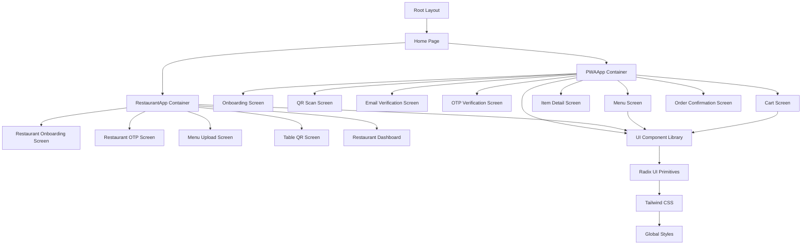
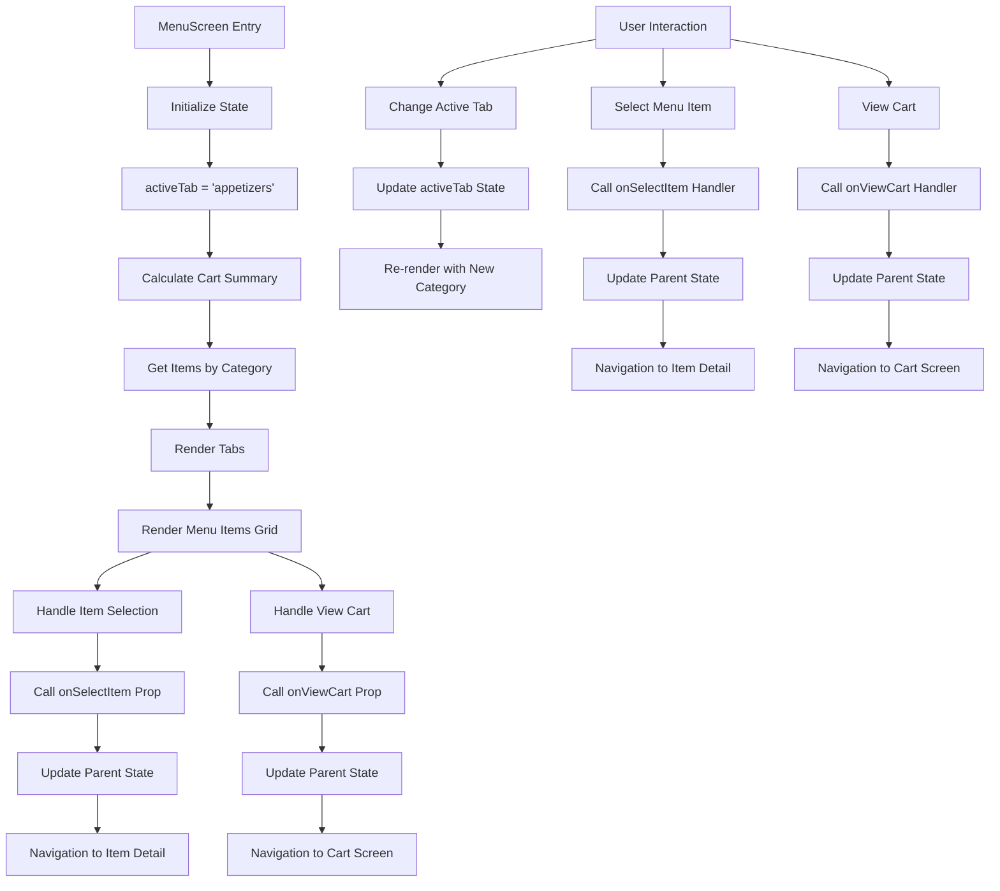
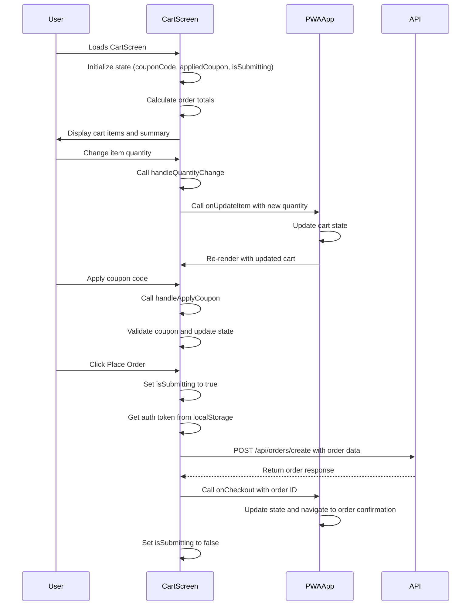
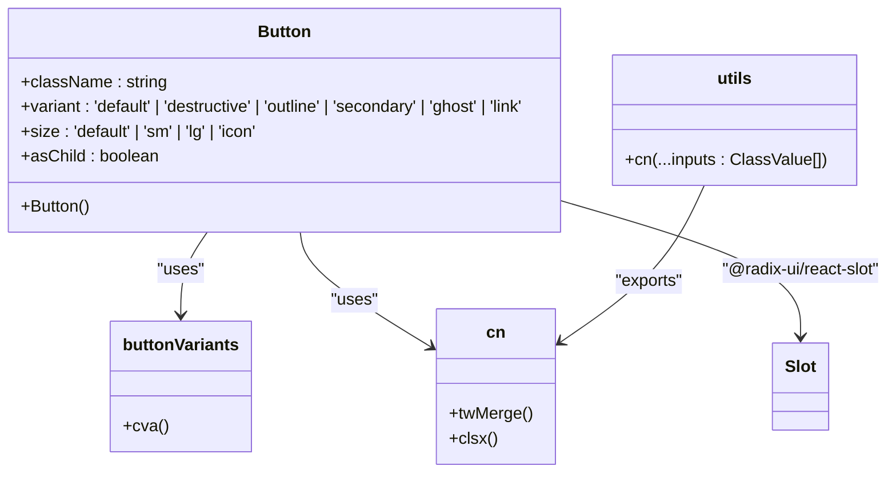

# Frontend Architecture

<cite>
**Referenced Files in This Document**   
- [page.tsx](file://src/app/page.tsx)
- [pwa-app.tsx](file://src/components/pwa-app.tsx)
- [restaurant-app.tsx](file://src/components/restaurant/restaurant-app.tsx)
- [menu-screen.tsx](file://src/components/pwa/menu-screen.tsx)
- [cart-screen.tsx](file://src/components/pwa/cart-screen.tsx)
- [layout.tsx](file://src/app/layout.tsx)
- [button.tsx](file://src/components/ui/button.tsx)
- [utils.ts](file://src/components/ui/utils.ts)
- [globals.css](file://src/styles/globals.css)
- [tailwind.config.ts](file://tailwind.config.ts)
</cite>

## Table of Contents
1. [Introduction](#introduction)
2. [Project Structure](#project-structure)
3. [Core Components](#core-components)
4. [Architecture Overview](#architecture-overview)
5. [Detailed Component Analysis](#detailed-component-analysis)
6. [Component Hierarchy and State Propagation](#component-hierarchy-and-state-propagation)
7. [UI Component Library](#ui-component-library)
8. [Responsive Design and Accessibility](#responsive-design-and-accessibility)
9. [PWA Capabilities](#pwa-capabilities)
10. [Performance Optimization](#performance-optimization)
11. [Conclusion](#conclusion)

## Introduction
The MenuPRO-App frontend architecture is built on React with Next.js 14, implementing a component-based design pattern that separates concerns between container and presentational components. The application features two primary container components, PWAApp and RestaurantApp, which manage state and orchestrate navigation between different screens. The architecture follows unidirectional data flow principles, with state management handled exclusively through React hooks (useState, useEffect) without external libraries. The UI is built on a component library in src/components/ui that leverages Radix UI primitives with consistent styling via Tailwind CSS.

**Section sources**
- [page.tsx](file://src/app/page.tsx#L1-L53)
- [README.md](file://README.md#L1-L92)

## Project Structure
The project follows a Next.js App Router structure with a clear separation of concerns. The src directory contains app, components, guidelines, and styles directories. The app directory houses the Next.js routing structure with layout.tsx and page.tsx as entry points. The components directory is organized into subdirectories for different component types: figma for Figma integration components, pwa for customer-facing PWA components, restaurant for restaurant management components, and ui for reusable UI components built on Radix UI primitives. This structure supports scalability and maintainability by grouping related components together.

```mermaid
graph TD
A[src] --> B[app]
A --> C[components]
A --> D[guidelines]
A --> E[styles]
B --> F[layout.tsx]
B --> G[page.tsx]
C --> H[figma]
C --> I[pwa]
C --> J[restaurant]
C --> K[ui]
H --> L[ImageWithFallback.tsx]
I --> M[cart-screen.tsx]
I --> N[email-verification-screen.tsx]
I --> O[item-detail-screen.tsx]
I --> P[menu-screen.tsx]
I --> Q[onboarding-screen.tsx]
I --> R[order-confirmation-screen.tsx]
I --> S[otp-verification-screen.tsx]
I --> T[payment-success-screen.tsx]
I --> U[qr-scan-screen.tsx]
J --> V[menu-upload-screen.tsx]
J --> W[restaurant-app.tsx]
J --> X[restaurant-dashboard.tsx]
J --> Y[restaurant-onboarding-screen.tsx]
J --> Z[restaurant-otp-screen.tsx]
J --> AA[table-qr-screen.tsx]
K --> AB[accordion.tsx]
K --> AC[alert-dialog.tsx]
K --> AD[alert.tsx]
K --> AE[aspect-ratio.tsx]
K --> AF[avatar.tsx]
K --> AG[badge.tsx]
K --> AH[button.tsx]
K --> AI[calendar.tsx]
K --> AJ[card.tsx]
K --> AK[carousel.tsx]
K --> AL[chart.tsx]
K --> AM[checkbox.tsx]
K --> AN[collapsible.tsx]
K --> AO[command.tsx]
K --> AP[context-menu.tsx]
K --> AQ[dialog.tsx]
K --> AR[drawer.tsx]
K --> AS[dropdown-menu.tsx]
K --> AT[form.tsx]
K --> AU[hover-card.tsx]
K --> AV[index.ts]
K --> AW[input-otp.tsx]
K --> AX[input.tsx]
K --> AY[label.tsx]
K --> AZ[menubar.tsx]
K --> BA[navigation-menu.tsx]
K --> BB[pagination.tsx]
K --> BC[popover.tsx]
K --> BD[progress.tsx]
K --> BE[radio-group.tsx]
K --> BF[resizable.tsx]
K --> BG[scroll-area.tsx]
K --> BH[select.tsx]
K --> BI[separator.tsx]
K --> BJ[sheet.tsx]
K --> BK[sidebar.tsx]
K --> BL[skeleton.tsx]
K --> BM[slider.tsx]
K --> BN[sonner.tsx]
K --> BO[switch.tsx]
K --> BP[table.tsx]
K --> BQ[tabs.tsx]
K --> BR[textarea.tsx]
K --> BS[toggle-group.tsx]
K --> BT[toggle.tsx]
K --> BU[tooltip.tsx]
K --> BV[use-mobile.ts]
K --> BW[utils.ts]
```



**Diagram sources**
- [project_structure](file://#L1-L100)

**Section sources**
- [project_structure](file://#L1-L100)

## Core Components
The frontend architecture centers around two primary container components: PWAApp and RestaurantApp. These components follow the container-pattern design, managing application state and orchestrating navigation between different screens. The PWAApp component handles the customer-facing ordering experience, while the RestaurantApp component manages the restaurant onboarding and management workflow. Both components use React's useState hook to manage their internal state, including current screen, user data, authentication tokens, and business-specific data like menu items and cart contents. The unidirectional data flow pattern is implemented by passing state and state update functions as props to presentational components.

**Section sources**
- [pwa-app.tsx](file://src/components/pwa-app.tsx#L1-L153)
- [restaurant-app.tsx](file://src/components/restaurant/restaurant-app.tsx#L1-L133)

## Architecture Overview
The frontend architecture follows a clear separation between container components that manage state and presentational components that render UI. The container components (PWAApp and RestaurantApp) maintain the application state using React hooks and provide navigation logic between different screens. They pass down state and state update functions to presentational components through props, establishing a unidirectional data flow. The architecture leverages Next.js App Router for server-side rendering and routing, while client-side navigation is handled within the container components using state to determine which screen to render.



**Diagram sources**
- [pwa-app.tsx](file://src/components/pwa-app.tsx#L1-L153)
- [restaurant-app.tsx](file://src/components/restaurant/restaurant-app.tsx#L1-L133)
- [layout.tsx](file://src/app/layout.tsx#L1-L70)

## Detailed Component Analysis

### PWAApp Component Analysis
The PWAApp component serves as the main container for the customer-facing progressive web app experience. It manages the state for the entire customer journey, from onboarding to order confirmation. The component uses multiple useState hooks to track the current screen, selected menu item, shopping cart contents, user email, authentication token, and order number. Navigation between screens is handled through the navigateToScreen function, which updates the currentScreen state. The component implements a renderScreen function that returns the appropriate screen component based on the currentScreen state, creating a single-page application experience within the PWA.

```mermaid
classDiagram
class PWAApp {
+currentScreen : Screen
+selectedItem : MenuItem | null
+cart : CartItem[]
+userEmail : string
+authToken : string
+orderNumber : string
+navigateToScreen(screen : Screen)
+selectItem(item : MenuItem)
+addToCart(item : CartItem)
+updateCartItem(itemId : string, quantity : number, selectedOptions? : any)
+clearCart()
+handleEmailVerified(email : string)
+handleOTPVerified(token : string)
+handleOrderCreated(orderId : string)
+renderScreen()
}
class MenuItem {
+id : string
+name : string
+description : string
+price : number
+image : string
+category : 'appetizers' | 'mains' | 'desserts' | 'beverages'
+options? : {
size? : string[]
customizations? : string[]
}
}
class CartItem {
+id : string
+name : string
+description : string
+price : number
+image : string
+category : 'appetizers' | 'mains' | 'desserts' | 'beverages'
+options? : {
size? : string[]
customizations? : string[]
}
+quantity : number
+selectedOptions? : {
size? : string
customizations? : string[]
}
}
class Screen {
<<enumeration>>
onboarding
qr-scan
email-verification
otp-verification
menu
item-detail
cart
order-confirmation
}
PWAApp --> MenuItem : "uses"
PWAApp --> CartItem : "uses"
PWAApp --> Screen : "uses"
```

**Diagram sources**
- [pwa-app.tsx](file://src/components/pwa-app.tsx#L1-L153)

**Section sources**
- [pwa-app.tsx](file://src/components/pwa-app.tsx#L1-L153)

### RestaurantApp Component Analysis
The RestaurantApp component manages the restaurant onboarding and management workflow. Similar to PWAApp, it uses useState hooks to maintain state for the current screen, restaurant data, authentication token, and menu items. The component handles the complete restaurant setup process, from initial onboarding through OTP verification, menu upload, table QR code generation, and finally to the restaurant dashboard. State transitions are managed through handler functions like handleEmailVerified, handleOTPVerified, and handleMenuUploaded, which update the component state and navigate to the next screen in the workflow. The component also implements logout functionality that clears all state and returns to the initial onboarding screen.

```mermaid
classDiagram
class RestaurantApp {
+currentScreen : RestaurantScreen
+restaurantData : RestaurantData | null
+authToken : string
+menuItems : MenuItem[]
+handleEmailVerified(email : string, data : RestaurantData)
+handleOTPVerified(token : string)
+handleMenuUploaded(items : MenuItem[])
+handleTableQRComplete()
+handleLogout()
+handleBackToLanding()
+renderScreen()
}
class RestaurantData {
+name : string
+email : string
+phone : string
+address : string
+city : string
+state : string
+zipCode : string
+cuisine : string
+description : string
+operatingHours : {
open : string
close : string
}
}
class MenuItem {
+id : string
+name : string
+description : string
+price : number
+category : string
+image? : string
+isAvailable : boolean
}
class RestaurantScreen {
<<enumeration>>
onboarding
otp-verification
menu-upload
table-qr
dashboard
}
RestaurantApp --> RestaurantData : "uses"
RestaurantApp --> MenuItem : "uses"
RestaurantApp --> RestaurantScreen : "uses"
```

**Diagram sources**
- [restaurant-app.tsx](file://src/components/restaurant/restaurant-app.tsx#L1-L133)

**Section sources**
- [restaurant-app.tsx](file://src/components/restaurant/restaurant-app.tsx#L1-L133)

### MenuScreen Component Analysis
The MenuScreen component is a presentational component that displays the restaurant menu with category-based navigation. It receives props from its parent container (PWAApp) including onSelectItem, onViewCart, and cartItems. The component uses useState to manage the active tab (menu category) and calculates cart summary information (item count and total) from the cartItems prop. The UI is organized into tabs for different menu categories (appetizers, mains, desserts, beverages), with each category displaying a grid of menu items. The component implements responsive design with a sticky header that includes the cart summary and navigation controls.



**Diagram sources**
- [menu-screen.tsx](file://src/components/pwa/menu-screen.tsx#L1-L215)

**Section sources**
- [menu-screen.tsx](file://src/components/pwa/menu-screen.tsx#L1-L215)

### CartScreen Component Analysis
The CartScreen component manages the shopping cart interface, allowing users to review and modify their order before checkout. It receives props from its parent container including cartItems, onUpdateItem, onBack, and onCheckout. The component uses useState to manage coupon code input and application state. It calculates order totals including subtotal, discount (if coupon applied), tax, and final total. The UI displays a list of cart items with quantity controls, a coupon code section, and an order summary. The component implements form submission handling for the checkout process, including API integration for order creation and error handling.



**Diagram sources**
- [cart-screen.tsx](file://src/components/pwa/cart-screen.tsx#L1-L291)

**Section sources**
- [cart-screen.tsx](file://src/components/pwa/cart-screen.tsx#L1-L291)

## Component Hierarchy and State Propagation
The application implements a clear component hierarchy with state propagation following unidirectional data flow principles. The root component (page.tsx) contains state for determining which main application to display (PWAApp or RestaurantApp). When a user launches either application, the container component takes over state management for its specific workflow. State is passed down from parent to child components through props, with callback functions provided for child components to communicate state changes back to their parents.

```mermaid
graph TD
A[page.tsx] --> |showPWA| B[PWAApp]
A --> |showRestaurant| C[RestaurantApp]
B --> D[OnboardingScreen]
B --> E[QRScanScreen]
B --> F[EmailVerificationScreen]
B --> G[OTPVerificationScreen]
B --> H[MenuScreen]
B --> I[ItemDetailScreen]
B --> J[CartScreen]
B --> K[OrderConfirmationScreen]
C --> L[RestaurantOnboardingScreen]
C --> M[RestaurantOTPScreen]
C --> N[MenuUploadScreen]
C --> O[TableQRScreen]
C --> P[RestaurantDashboard]
H --> Q[MenuItemGrid]
J --> R[Cart Item Components]
P --> S[Dashboard Components]
B --> |currentScreen| D
B --> |currentScreen| E
B --> |currentScreen| F
B --> |currentScreen| G
B --> |currentScreen| H
B --> |currentScreen| I
B --> |currentScreen| J
B --> |currentScreen| K
C --> |currentScreen| L
C --> |currentScreen| M
C --> |currentScreen| N
C --> |currentScreen| O
C --> |currentScreen| P
B --> |cart| J
B --> |cart| H
B --> |selectedItem| I
J --> |onUpdateItem| B
H --> |onSelectItem| B
H --> |onViewCart| B
I --> |onAddToCart| B
I --> |onViewCart| B
I --> |onBack| B
F --> |onEmailVerified| B
G --> |onVerificationSuccess| B
K --> |onNewOrder| B
K --> |onBackToLanding| A
L --> |onEmailVerified| C
M --> |onVerificationSuccess| C
N --> |onMenuUploaded| C
O --> |onComplete| C
P --> |onLogout| C
```



**Diagram sources**
- [page.tsx](file://src/app/page.tsx#L1-L53)
- [pwa-app.tsx](file://src/components/pwa-app.tsx#L1-L153)
- [restaurant-app.tsx](file://src/components/restaurant/restaurant-app.tsx#L1-L133)

## UI Component Library
The UI component library in src/components/ui is built on Radix UI primitives, providing accessible and customizable components with consistent styling via Tailwind CSS. The library includes a comprehensive set of components such as buttons, cards, badges, inputs, and navigation elements. Each component is implemented as a wrapper around Radix UI primitives, applying Tailwind classes for styling and using the cn utility function for class composition. The button.tsx component demonstrates this pattern, using class-variance-authority (cva) to define variant styles and clsx/tailwind-merge for conditional class application.



**Diagram sources**
- [button.tsx](file://src/components/ui/button.tsx#L1-L58)
- [utils.ts](file://src/components/ui/utils.ts#L1-L6)

**Section sources**
- [button.tsx](file://src/components/ui/button.tsx#L1-L58)
- [utils.ts](file://src/components/ui/utils.ts#L1-L6)

## Responsive Design and Accessibility
The application implements responsive design principles to ensure optimal user experience across different device sizes. The layout uses Tailwind CSS utility classes for responsive behavior, including flexbox and grid layouts that adapt to screen size. The PWAApp and RestaurantApp components use a mobile-first approach with sticky headers and bottom navigation elements optimized for touch interaction. Accessibility is implemented through proper semantic HTML, ARIA attributes provided by Radix UI components, and keyboard navigation support. The application also includes dark mode support through CSS variables defined in globals.css, allowing users to switch between light and dark themes based on system preferences.

**Section sources**
- [globals.css](file://src/styles/globals.css#L1-L189)
- [tailwind.config.ts](file://tailwind.config.ts#L1-L67)

## PWA Capabilities
The application is designed as a Progressive Web App with capabilities that provide a native app-like experience. The PWA functionality is implemented through the PWAApp component, which manages the complete customer ordering workflow from QR code scanning to order confirmation. The app uses service workers (configured through Next.js) for offline capabilities and background synchronization. The manifest.json (implied by Next.js configuration) provides metadata for installation on user devices. The application also implements responsive design, fast loading times, and smooth animations to enhance the user experience. Authentication is handled through email verification and OTP, with tokens stored in localStorage for session persistence.

**Section sources**
- [pwa-app.tsx](file://src/components/pwa-app.tsx#L1-L153)
- [next.config.js](file://next.config.js#L1-L10)

## Performance Optimization
The application implements several performance optimization techniques to ensure fast loading times and smooth user interactions. While the current codebase doesn't explicitly show lazy loading or memoization, the architecture supports these optimizations. The component-based design allows for code splitting at the route level through Next.js. The use of React.memo could be applied to presentational components like menu-screen.tsx and cart-screen.tsx to prevent unnecessary re-renders when props haven't changed. The application could also implement React.lazy for dynamic import of heavy components, particularly in the restaurant management workflow. The Tailwind CSS implementation uses JIT mode (configured in tailwind.config.ts) for optimized CSS output, reducing bundle size.

**Section sources**
- [tailwind.config.ts](file://tailwind.config.ts#L1-L67)
- [package.json](file://package.json#L1-L88)

## Conclusion
The MenuPRO-App frontend architecture demonstrates a well-structured React application using Next.js 14 with a clear separation between container and presentational components. The PWAApp and RestaurantApp containers effectively manage state and navigation for their respective workflows, implementing unidirectional data flow through props and callback functions. The UI component library built on Radix UI primitives with Tailwind CSS ensures consistent styling and accessibility across the application. The architecture supports responsive design, PWA capabilities, and has a solid foundation for performance optimization through potential implementation of lazy loading and memoization. This design provides a scalable and maintainable foundation for the restaurant menu management and ordering system.