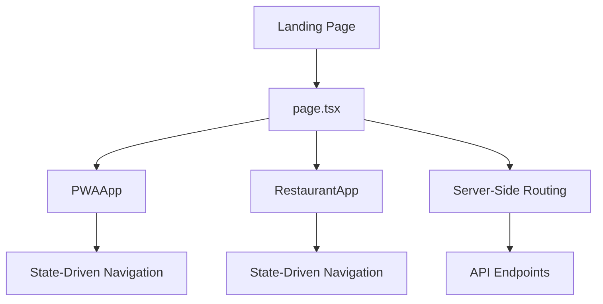
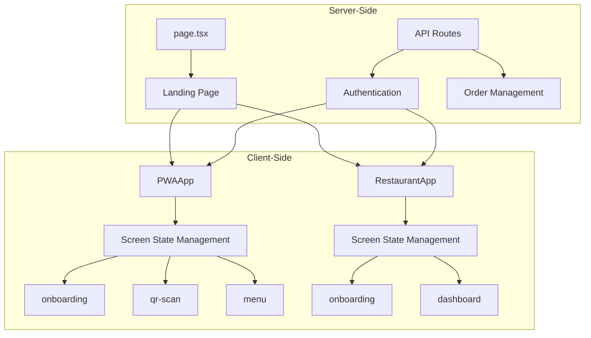
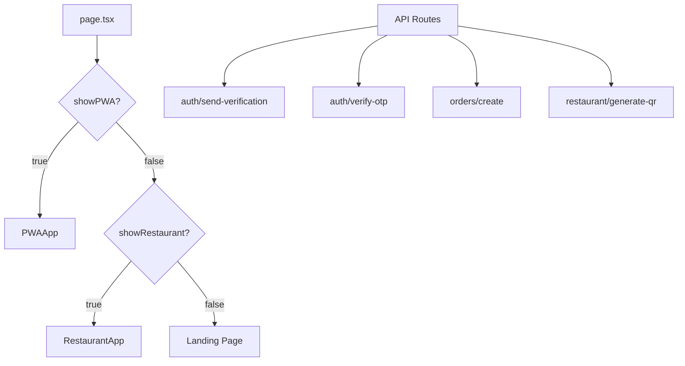
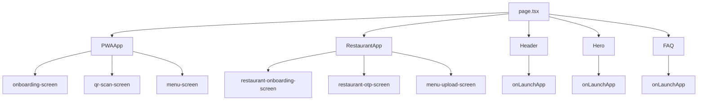

# Navigation and Routing

<cite>
**Referenced Files in This Document**   
- [page.tsx](file://src/app/page.tsx)
- [pwa-app.tsx](file://src/components/pwa-app.tsx)
- [restaurant-app.tsx](file://src/components/restaurant/restaurant-app.tsx)
- [onboarding-screen.tsx](file://src/components/pwa/onboarding-screen.tsx)
- [qr-scan-screen.tsx](file://src/components/pwa/qr-scan-screen.tsx)
- [menu-screen.tsx](file://src/components/pwa/menu-screen.tsx)
- [restaurant-onboarding-screen.tsx](file://src/components/restaurant/restaurant-onboarding-screen.tsx)
- [route.ts](file://src/app/api/auth/send-verification/route.ts)
- [route.ts](file://src/app/api/auth/verify-otp/route.ts)
</cite>

## Table of Contents
1. [Introduction](#introduction)
2. [Project Structure](#project-structure)
3. [Core Components](#core-components)
4. [Architecture Overview](#architecture-overview)
5. [Detailed Component Analysis](#detailed-component-analysis)
6. [Dependency Analysis](#dependency-analysis)
7. [Performance Considerations](#performance-considerations)
8. [Troubleshooting Guide](#troubleshooting-guide)
9. [Conclusion](#conclusion)

## Introduction
The MenuPRO-App-main application implements a hybrid navigation system that combines client-side state-driven navigation for Progressive Web App (PWA) experiences with server-side routing for landing pages and API endpoints. This documentation details the navigation and routing mechanisms, focusing on how the application manages screen transitions through state management rather than traditional route-based navigation.

## Project Structure
The application follows a Next.js App Router structure with a clear separation between server-rendered landing pages and client-side PWA experiences. The src/app directory contains the main page.tsx entry point and API routes, while the src/components directory houses the PWA and restaurant-specific components that handle client-side navigation.



**Diagram sources**
- [page.tsx](file://src/app/page.tsx)
- [pwa-app.tsx](file://src/components/pwa-app.tsx)
- [restaurant-app.tsx](file://src/components/restaurant/restaurant-app.tsx)

**Section sources**
- [page.tsx](file://src/app/page.tsx)
- [pwa-app.tsx](file://src/components/pwa-app.tsx)

## Core Components
The navigation system is built around two primary components: PWAApp for customer-facing ordering experiences and RestaurantApp for restaurant management. Both components implement state-driven navigation patterns using React's useState hook to manage screen state transitions without URL changes.

**Section sources**
- [pwa-app.tsx](file://src/components/pwa-app.tsx)
- [restaurant-app.tsx](file://src/components/restaurant/restaurant-app.tsx)

## Architecture Overview
The application architecture separates concerns between server-side and client-side navigation. Server-side routing handles the initial landing page and API endpoints, while client-side state management controls the PWA experience after initialization.



**Diagram sources**
- [page.tsx](file://src/app/page.tsx)
- [pwa-app.tsx](file://src/components/pwa-app.tsx)
- [restaurant-app.tsx](file://src/components/restaurant/restaurant-app.tsx)
- [route.ts](file://src/app/api/auth/verify-otp/route.ts)

## Detailed Component Analysis

### PWAApp State-Driven Navigation
The PWAApp component implements a screen state pattern using React context to control which component is rendered. This approach replaces traditional route-based navigation with a single state variable that determines the current screen.

```mermaid
stateDiagram-v2
[*] --> onboarding
onboarding --> qr-scan : onComplete()
qr-scan --> email-verification : onScanComplete()
email-verification --> otp-verification : onEmailVerified()
otp-verification --> menu : onVerificationSuccess()
menu --> item-detail : onSelectItem()
menu --> cart : onViewCart()
item-detail --> cart : onAddToCart()
cart --> order-confirmation : onCheckout()
order-confirmation --> menu : onNewOrder()
order-confirmation --> Landing : onBackToLanding()
```

**Diagram sources**
- [pwa-app.tsx](file://src/components/pwa-app.tsx)
- [onboarding-screen.tsx](file://src/components/pwa/onboarding-screen.tsx)
- [qr-scan-screen.tsx](file://src/components/pwa/qr-scan-screen.tsx)

**Section sources**
- [pwa-app.tsx](file://src/components/pwa-app.tsx)
- [onboarding-screen.tsx](file://src/components/pwa/onboarding-screen.tsx)

### RestaurantApp State Management
Similar to the PWAApp, the RestaurantApp component uses state-driven navigation to guide restaurant owners through onboarding and management workflows. The state transitions are triggered by user actions and API responses.

```mermaid
stateDiagram-v2
[*] --> onboarding
onboarding --> otp-verification : onEmailVerified()
otp-verification --> menu-upload : onVerificationSuccess()
menu-upload --> table-qr : onMenuUploaded()
table-qr --> dashboard : onComplete()
dashboard --> onboarding : onLogout()
```

**Diagram sources**
- [restaurant-app.tsx](file://src/components/restaurant/restaurant-app.tsx)
- [restaurant-onboarding-screen.tsx](file://src/components/restaurant/restaurant-onboarding-screen.tsx)

**Section sources**
- [restaurant-app.tsx](file://src/components/restaurant/restaurant-app.tsx)
- [restaurant-onboarding-screen.tsx](file://src/components/restaurant/restaurant-onboarding-screen.tsx)

### Server-Side Routing with Next.js App Router
The application uses Next.js App Router for server-side routing of the landing page and API endpoints. The page.tsx serves as the entry point that initializes the application and renders either the customer or restaurant interface based on context.



**Diagram sources**
- [page.tsx](file://src/app/page.tsx)
- [route.ts](file://src/app/api/auth/send-verification/route.ts)
- [route.ts](file://src/app/api/auth/verify-otp/route.ts)

**Section sources**
- [page.tsx](file://src/app/page.tsx)
- [route.ts](file://src/app/api/auth/send-verification/route.ts)

## Dependency Analysis
The navigation system has a clear dependency hierarchy with the landing page (page.tsx) serving as the central orchestrator that determines which application interface to render. The PWA and restaurant applications are self-contained with their own state management systems.



**Diagram sources**
- [page.tsx](file://src/app/page.tsx)
- [pwa-app.tsx](file://src/components/pwa-app.tsx)
- [restaurant-app.tsx](file://src/components/restaurant/restaurant-app.tsx)

**Section sources**
- [page.tsx](file://src/app/page.tsx)
- [pwa-app.tsx](file://src/components/pwa-app.tsx)

## Performance Considerations
The state-driven navigation approach provides several performance benefits by avoiding full page reloads during screen transitions. However, it also presents challenges for deep linking and browser history management.

## Troubleshooting Guide
Common issues with the navigation system include state persistence across page refreshes and deep linking limitations. The current implementation does not support direct URL navigation to specific screens within the PWA or restaurant applications.

**Section sources**
- [pwa-app.tsx](file://src/components/pwa-app.tsx)
- [restaurant-app.tsx](file://src/components/restaurant/restaurant-app.tsx)

## Conclusion
The MenuPRO-App-main application implements a sophisticated hybrid navigation system that combines the benefits of server-side rendering for SEO and initial loading with client-side state management for smooth PWA experiences. The state-driven approach provides a seamless user experience but could be enhanced with URL hash or query parameter support for screen restoration and deep linking capabilities.