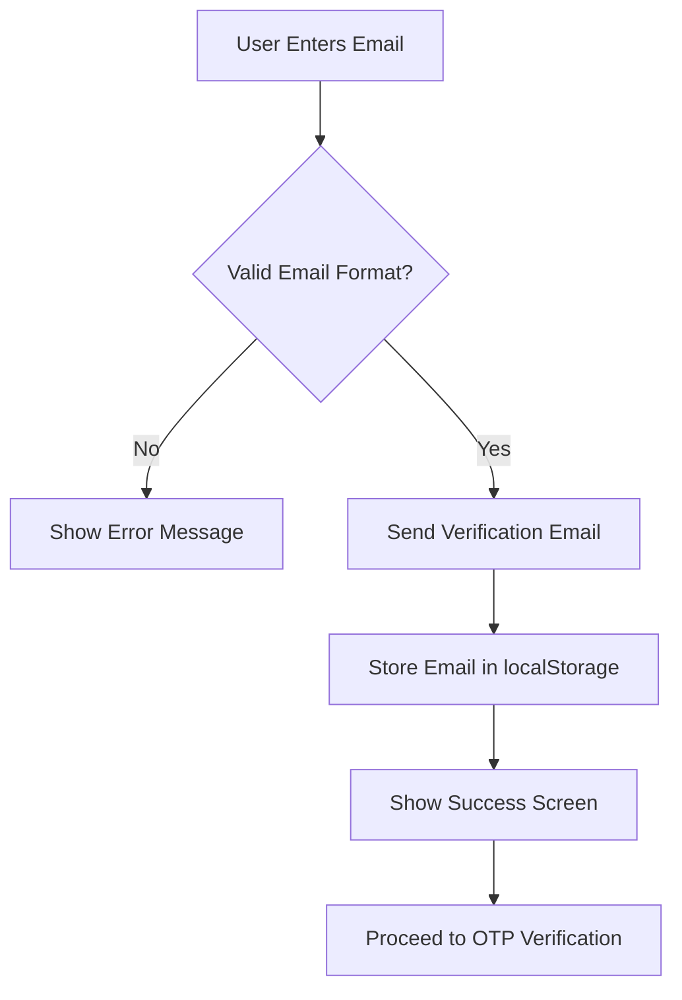
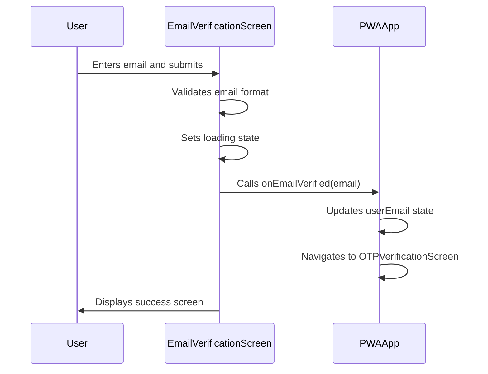
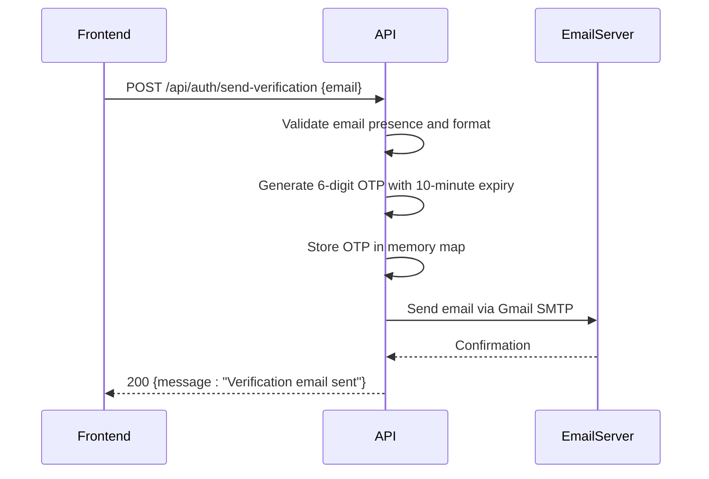

# Email Verification

<cite>
**Referenced Files in This Document**   
- [email-verification-screen.tsx](file://src/components/pwa/email-verification-screen.tsx)
- [pwa-app.tsx](file://src/components/pwa-app.tsx)
- [send-verification/route.ts](file://src/app/api/auth/send-verification/route.ts)
- [otp-verification-screen.tsx](file://src/components/pwa/otp-verification-screen.tsx)
</cite>

## Table of Contents
1. [Introduction](#introduction)
2. [Email Verification Flow](#email-verification-flow)
3. [Component Structure and State Management](#component-structure-and-state-management)
4. [Client-Side Validation and Form Handling](#client-side-validation-and-form-handling)
5. [Integration with PWAApp and State Propagation](#integration-with-pwaapp-and-state-propagation)
6. [Security Considerations](#security-considerations)
7. [User Experience Elements](#user-experience-elements)
8. [Backend Implementation](#backend-implementation)
9. [Conclusion](#conclusion)

## Introduction
The email verification process in the MenuPRO PWA frontend ensures that users provide valid email addresses before accessing the menu system. This process prevents spam orders and enhances security by verifying user identity through a time-limited verification code sent to their email. The implementation involves a multi-step flow that includes email input, client-side validation, API communication, localStorage persistence, and navigation between screens.

**Section sources**
- [email-verification-screen.tsx](file://src/components/pwa/email-verification-screen.tsx#L1-L194)

## Email Verification Flow
The email verification process follows a sequential flow:
1. User enters email address on the EmailVerificationScreen
2. Client-side validation checks email format using regex
3. Upon successful validation, the system stores the email in localStorage under the key 'pendingEmail'
4. The UI transitions to a success state showing confirmation that the email was sent
5. User proceeds to OTP verification screen to complete authentication

This flow is managed through state transitions within the EmailVerificationScreen component and coordinated with the PWAApp's global state management system.



**Diagram sources**
- [email-verification-screen.tsx](file://src/components/pwa/email-verification-screen.tsx#L1-L194)
- [pwa-app.tsx](file://src/components/pwa-app.tsx#L1-L154)

**Section sources**
- [email-verification-screen.tsx](file://src/components/pwa/email-verification-screen.tsx#L1-L194)

## Component Structure and State Management
The EmailVerificationScreen component manages several states to handle the user experience:
- **email**: Stores the user's input email address
- **isLoading**: Controls loading state during form submission
- **error**: Displays validation or network error messages
- **success**: Triggers UI transition to success screen

These states are managed using React's useState hook, allowing for reactivity and smooth UI transitions. When the success state is set to true, the component conditionally renders the success screen instead of the input form.

**Section sources**
- [email-verification-screen.tsx](file://src/components/pwa/email-verification-screen.tsx#L10-L25)

## Client-Side Validation and Form Handling
The email verification process implements robust client-side validation using a regular expression pattern to ensure valid email formats. The validation function uses the pattern `/^[^\s@]+@[^\s@]+\.[^\s@]+$/` to verify that the email contains essential components (local part, @ symbol, domain, and top-level domain).

Form submission is handled through the handleSubmit function, which:
1. Prevents default form submission behavior
2. Validates that the email field is not empty
3. Applies regex validation to ensure proper email format
4. Manages loading state during the asynchronous operation
5. Handles errors gracefully with user-friendly messages

```mermaid
flowchart TD
A[Form Submit] --> B{Email Empty?}
B --> |Yes| C[Set Error: "Please enter your email address"]
B --> |No| D{Valid Email Format?}
D --> |No| E[Set Error: "Please enter a valid email address"]
D --> |Yes| F[Set Loading State]
F --> G[Call API /api/auth/send-verification]
G --> H{Success?}
H --> |Yes| I[Set Success State, Store Email in localStorage]
H --> |No| J[Set Error: "Network error. Please try again."]
J --> K[Clear Loading State]
I --> K
```

**Diagram sources**
- [email-verification-screen.tsx](file://src/components/pwa/email-verification-screen.tsx#L45-L95)

**Section sources**
- [email-verification-screen.tsx](file://src/components/pwa/email-verification-screen.tsx#L30-L100)

## Integration with PWAApp and State Propagation
The EmailVerificationScreen integrates with the main PWAApp through callback functions that manage navigation and state propagation. The component receives two essential callbacks as props:
- **onEmailVerified**: Called when email verification is initiated, passing the userEmail to PWAApp
- **onBack**: Handles navigation back to the QR scan screen

When the email is successfully validated and processed, the handleEmailVerified callback in PWAApp updates the global userEmail state and navigates to the OTP verification screen. This pattern enables centralized state management while maintaining component isolation.



**Diagram sources**
- [pwa-app.tsx](file://src/components/pwa-app.tsx#L75-L85)
- [email-verification-screen.tsx](file://src/components/pwa/email-verification-screen.tsx#L75-L95)

**Section sources**
- [pwa-app.tsx](file://src/components/pwa-app.tsx#L75-L85)
- [email-verification-screen.tsx](file://src/components/pwa/email-verification-screen.tsx#L75-L95)

## Security Considerations
The email verification implementation incorporates several security measures:
- **Input Sanitization**: Email input is trimmed to remove leading/trailing whitespace
- **XSS Protection**: All user input is properly escaped in JSX rendering
- **Temporary Verification Codes**: OTPs expire after 10 minutes to prevent misuse
- **Secure Storage**: Authentication tokens are stored in localStorage with no sensitive data exposure

The backend implementation uses environment variables for Gmail credentials and generates cryptographically secure random OTPs using Node.js crypto module. The otpStore uses an in-memory Map with periodic cleanup of expired codes to prevent memory leaks.

**Section sources**
- [send-verification/route.ts](file://src/app/api/auth/send-verification/route.ts#L1-L98)
- [email-verification-screen.tsx](file://src/components/pwa/email-verification-screen.tsx#L1-L194)

## User Experience Elements
The email verification process includes several UX enhancements:
- **Resend Timer**: A 10-minute countdown timer shows code expiration time
- **Loading States**: Buttons display appropriate loading text and are disabled during processing
- **Privacy Messaging**: Clear privacy notice explains email usage and protection
- **Accessibility Features**: Proper labels, focus management, and keyboard navigation

The success screen provides clear feedback with a green checkmark icon, displays the verified email address, and includes a "Try a different email" option for user convenience. The interface uses a clean, modern design with appropriate spacing and visual hierarchy to guide users through the process.

**Section sources**
- [email-verification-screen.tsx](file://src/components/pwa/email-verification-screen.tsx#L105-L194)
- [otp-verification-screen.tsx](file://src/components/pwa/otp-verification-screen.tsx#L1-L259)

## Backend Implementation
The backend email verification service is implemented as a Next.js API route at `/api/auth/send-verification`. The implementation uses Nodemailer with Gmail SMTP to send verification emails containing a 6-digit OTP code. Key features include:
- Generation of cryptographically secure random OTPs
- Storage of OTPs with expiration timestamps in memory
- Periodic cleanup of expired OTPs every 5 minutes
- Professional email template with brand styling
- Comprehensive error handling and logging

The API endpoint accepts POST requests with email data, validates the input, and returns appropriate HTTP status codes for success (200) or various error conditions (400, 500).



**Diagram sources**
- [send-verification/route.ts](file://src/app/api/auth/send-verification/route.ts#L1-L98)

**Section sources**
- [send-verification/route.ts](file://src/app/api/auth/send-verification/route.ts#L1-L98)

## Conclusion
The email verification process in the MenuPRO PWA frontend provides a secure and user-friendly way to validate customer identities before accessing the menu system. By combining client-side validation with server-side email delivery and time-limited verification codes, the implementation effectively prevents spam orders while maintaining a smooth user experience. The integration between frontend components and backend services demonstrates a well-architected approach to authentication that balances security, usability, and performance.