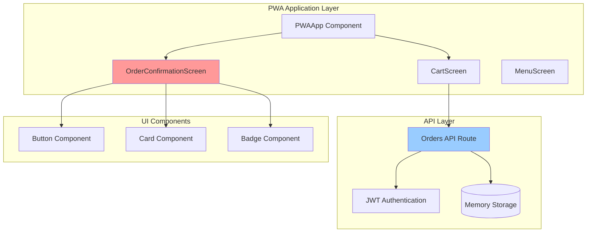
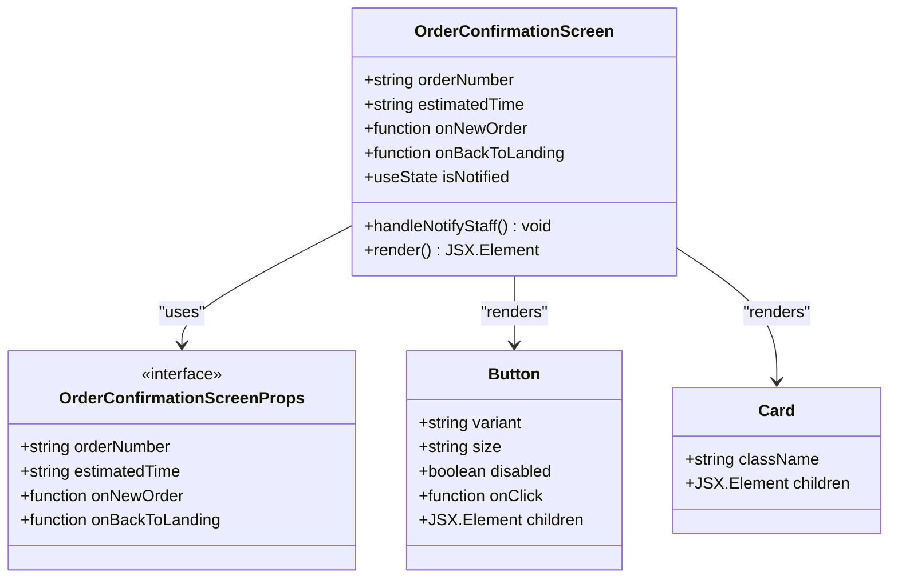
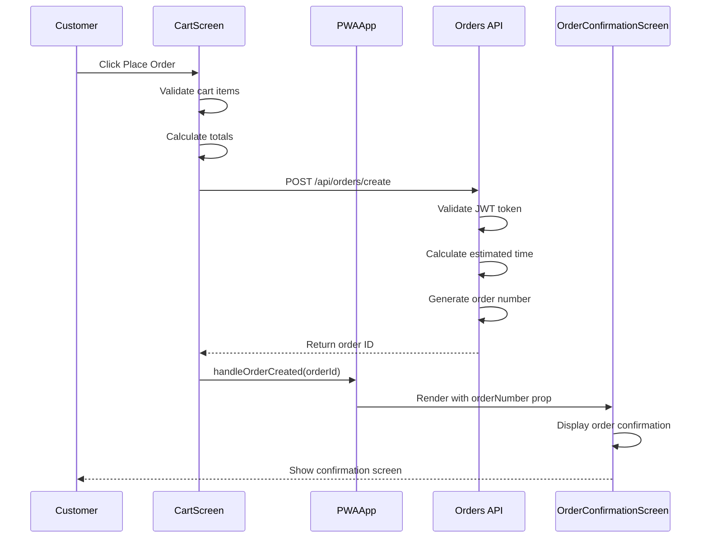
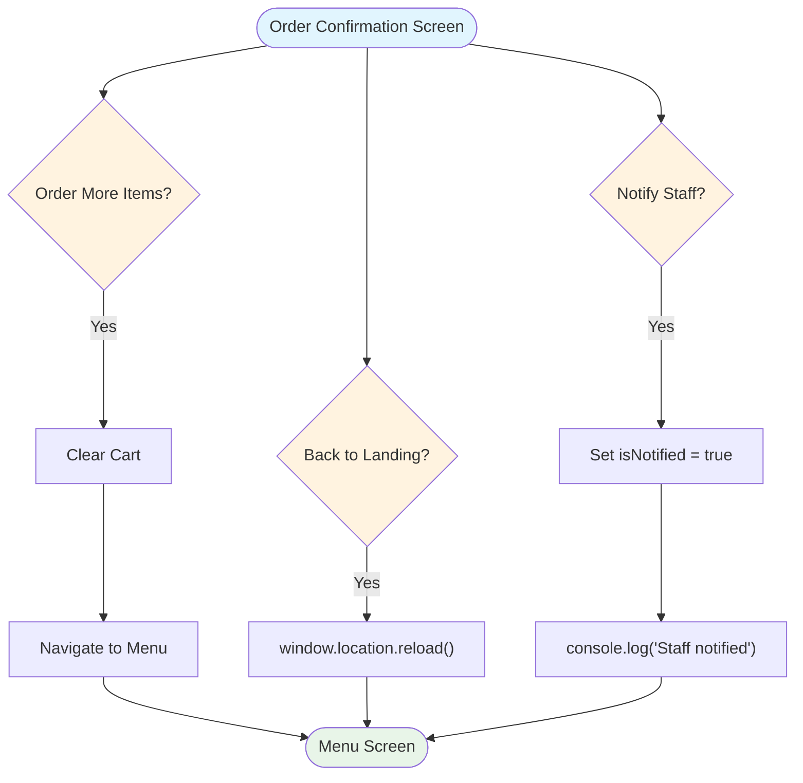

# Order Confirmation Screen Documentation

<cite>
**Referenced Files in This Document**
- [order-confirmation-screen.tsx](file://src/components/pwa/order-confirmation-screen.tsx)
- [pwa-app.tsx](file://src/components/pwa-app.tsx)
- [cart-screen.tsx](file://src/components/pwa/cart-screen.tsx)
- [route.ts](file://src/app/api/orders/create/route.ts)
- [button.tsx](file://src/components/ui/button.tsx)
- [globals.css](file://src/styles/globals.css)
- [payment-success-screen.tsx](file://src/components/pwa/payment-success-screen.tsx)
</cite>

## Table of Contents
1. [Introduction](#introduction)
2. [System Architecture](#system-architecture)
3. [Order Confirmation Screen Component](#order-confirmation-screen-component)
4. [Integration with Order Creation Lifecycle](#integration-with-order-creation-lifecycle)
5. [Navigation and User Flow](#navigation-and-user-flow)
6. [Display Features and User Engagement](#display-features-and-user-engagement)
7. [Technical Implementation](#technical-implementation)
8. [Localization and Accessibility](#localization-and-accessibility)
9. [Analytics and Tracking](#analytics-and-tracking)
10. [Troubleshooting Guide](#troubleshooting-guide)
11. [Best Practices](#best-practices)

## Introduction

The Order Confirmation Screen is a critical component of the MenuPRO PWA frontend that provides customers with post-purchase information and navigation options after completing an order. This screen serves as the final step in the customer ordering journey, displaying essential order details including the order number, estimated preparation time, and success messaging. The component seamlessly integrates with the order creation lifecycle and provides intuitive navigation options for users to either start a new order or return to the landing page.

The order confirmation screen is designed with a modern, mobile-first approach using Tailwind CSS utilities and follows the established design system of the MenuPRO application. It incorporates user engagement elements such as animated success indicators, contextual help messages, and clear call-to-action buttons to enhance the overall user experience.

## System Architecture

The order confirmation screen operates within a component-based architecture that follows React's functional component pattern with hooks. The system is built around a centralized state management approach using React's useState hook, with data flowing down through props from parent components.



**Diagram sources**
- [pwa-app.tsx](file://src/components/pwa-app.tsx#L131-L153)
- [order-confirmation-screen.tsx](file://src/components/pwa/order-confirmation-screen.tsx#L1-L154)
- [route.ts](file://src/app/api/orders/create/route.ts#L1-L161)

The architecture demonstrates a clear separation of concerns with the PWAApp managing screen transitions, state management, and navigation. The OrderConfirmationScreen receives data through props and renders the confirmation interface, while the API layer handles order persistence and validation.

**Section sources**
- [pwa-app.tsx](file://src/components/pwa-app.tsx#L1-L154)
- [order-confirmation-screen.tsx](file://src/components/pwa/order-confirmation-screen.tsx#L1-L154)

## Order Confirmation Screen Component

The OrderConfirmationScreen component is a React functional component that receives order data and navigation callbacks through its props interface. The component utilizes React's useState hook to manage local state for user interactions such as staff notifications.



**Diagram sources**
- [order-confirmation-screen.tsx](file://src/components/pwa/order-confirmation-screen.tsx#L8-L15)
- [order-confirmation-screen.tsx](file://src/components/pwa/order-confirmation-screen.tsx#L17-L154)

The component structure includes several key sections:

### Header Section
The header displays the MenuPRO logo and success messaging with a gradient background that creates a warm, inviting atmosphere. The success message "Order Confirmed!" appears prominently with a subtitle indicating that the order has been sent to the kitchen.

### Order Details Card
This central component showcases the order number with a distinctive orange color scheme (#orderNumber), estimated preparation time with a clock icon, and a status badge indicating "Order Received." The card uses a semi-transparent white background with blur effects to create depth and visual interest.

### Process Flow Card
A secondary card explains the sequential steps involved in order processing, from kitchen receipt to table delivery. Each step is numbered and accompanied by a brief description, helping customers understand the timeline and process.

### Navigation Buttons
Three primary action buttons provide clear navigation options:
- **Notify Staff**: Sends a notification to restaurant staff (currently simulated)
- **Order More Items**: Clears the cart and returns to the menu
- **Back to Landing**: Performs a full page reload to reset all context

**Section sources**
- [order-confirmation-screen.tsx](file://src/components/pwa/order-confirmation-screen.tsx#L25-L154)

## Integration with Order Creation Lifecycle

The order confirmation screen integrates seamlessly with the order creation lifecycle through a well-defined data flow pattern. The integration begins when the user completes checkout on the CartScreen and proceeds through several stages of order processing.



**Diagram sources**
- [cart-screen.tsx](file://src/components/pwa/cart-screen.tsx#L50-L85)
- [pwa-app.tsx](file://src/components/pwa-app.tsx#L85-L90)
- [route.ts](file://src/app/api/orders/create/route.ts#L35-L85)

### Order Creation Process

The order creation process involves several key steps:

1. **Cart Validation**: The CartScreen validates that the cart contains items and calculates the total amount including taxes and discounts.

2. **API Request**: An HTTP POST request is made to `/api/orders/create` with the order data and authentication token.

3. **Order Processing**: The API endpoint validates the JWT token, calculates the estimated preparation time based on the number of items, and generates a unique order number.

4. **State Update**: Upon successful order creation, the PWAApp updates its internal state with the new order number and navigates to the OrderConfirmationScreen.

5. **Screen Rendering**: The OrderConfirmationScreen receives the order number and estimated time as props and renders the confirmation interface.

**Section sources**
- [cart-screen.tsx](file://src/components/pwa/cart-screen.tsx#L50-L85)
- [pwa-app.tsx](file://src/components/pwa-app.tsx#L85-L90)
- [route.ts](file://src/app/api/orders/create/route.ts#L35-L85)

## Navigation and User Flow

The order confirmation screen provides three distinct navigation pathways, each designed to serve different user needs and scenarios. The navigation system is built around clear, intuitive actions that guide users through their post-purchase journey.



**Diagram sources**
- [order-confirmation-screen.tsx](file://src/components/pwa/order-confirmation-screen.tsx#L130-L154)
- [pwa-app.tsx](file://src/components/pwa-app.tsx#L131-L153)

### Navigation Options

#### 1. Start a New Order
When users click the "Order More Items" button, the application performs a complete cart reset by calling `clearCart()` and navigating back to the menu screen. This option is ideal for customers who want to place additional orders during their visit.

#### 2. Return to Landing Page
The "Back to Landing" option triggers a full page reload using `window.location.reload()`. This approach ensures complete context reset, clearing all application state and reloading fresh assets from the server. This is particularly useful for returning to the main application interface or switching between different user roles.

#### 3. Notify Staff
The "Notify Staff" button allows customers to send a notification to restaurant staff. While currently implemented as a simulation with console logging, this feature can be extended to integrate with real-time notification systems, push notifications, or in-app alerts.

**Section sources**
- [order-confirmation-screen.tsx](file://src/components/pwa/order-confirmation-screen.tsx#L130-L154)
- [pwa-app.tsx](file://src/components/pwa-app.tsx#L131-L153)

## Display Features and User Engagement

The order confirmation screen incorporates several user engagement elements designed to enhance the customer experience and provide clear, actionable information.

### Visual Design Elements

The screen employs a warm color palette with orange and red gradients to create a welcoming atmosphere. Key design elements include:

- **Gradient Background**: From-orange-50 to-red-50 creates a subtle, inviting background
- **Success Icon**: A green circle with checkmark icon provides immediate visual feedback
- **Blur Effects**: Semi-transparent cards with backdrop-blur-sm add depth and focus
- **Animated Elements**: Pulse animation on the success icon enhances visual appeal

### Dynamic Information Display

The screen dynamically displays several pieces of information:

- **Order Number**: Generated randomly and formatted with a hash prefix
- **Estimated Time**: Calculated based on item count (5 minutes base + 2 minutes per item)
- **Status Badge**: Real-time status indication ("Order Received")
- **Process Steps**: Sequential breakdown of order processing stages

### Interactive Elements

Several interactive elements encourage user engagement:

- **Notification Button**: Toggles between "Notify Staff" and "Staff Notified" states
- **Action Buttons**: Clear, prominent buttons with icons and text labels
- **Pro Tip**: Contextual help message suggesting ongoing ordering capabilities

**Section sources**
- [order-confirmation-screen.tsx](file://src/components/pwa/order-confirmation-screen.tsx#L25-L154)

## Technical Implementation

The technical implementation of the order confirmation screen leverages modern React patterns and TypeScript for type safety. The component follows functional component best practices with hooks for state management.

### Component Structure

```typescript
interface OrderConfirmationScreenProps {
  orderNumber: string;
  estimatedTime: string;
  onNewOrder: () => void;
  onBackToLanding: () => void;
}

export function OrderConfirmationScreen({ 
  orderNumber, 
  estimatedTime, 
  onNewOrder, 
  onBackToLanding 
}: OrderConfirmationScreenProps) {
  const [isNotified, setIsNotified] = useState(false);
  
  const handleNotifyStaff = () => {
    setIsNotified(true);
    console.log('Staff notified of new order');
  };
  
  // JSX rendering...
}
```

### Styling Implementation

The component uses Tailwind CSS classes extensively for responsive design and consistent styling:

- **Layout**: Flexbox for centering and spacing
- **Typography**: Font sizes and weights following the design system
- **Spacing**: Consistent padding and margin values
- **Colors**: Theme colors from the global CSS variables
- **Responsive**: Mobile-first approach with responsive breakpoints

### State Management

The component manages minimal state locally:
- **isNotified**: Tracks whether staff notification has been sent
- **Props**: All external data passed through component props

### Type Safety

TypeScript provides strong typing for:
- Component props interface
- Internal state types
- Function signatures
- API response types

**Section sources**
- [order-confirmation-screen.tsx](file://src/components/pwa/order-confirmation-screen.tsx#L8-L15)
- [order-confirmation-screen.tsx](file://src/components/pwa/order-confirmation-screen.tsx#L17-L25)

## Localization and Accessibility

The order confirmation screen is designed with internationalization and accessibility in mind, though some improvements could be made for broader support.

### Current Accessibility Features

- **Semantic HTML**: Proper use of headings, buttons, and landmarks
- **ARIA Labels**: Appropriate labeling for interactive elements
- **Keyboard Navigation**: Full keyboard accessibility for all buttons
- **Color Contrast**: Sufficient contrast ratios for text and backgrounds
- **Focus Management**: Clear focus indicators for interactive elements

### Localization Considerations

The current implementation uses hardcoded text strings that would benefit from localization:

- **Success Messages**: "Order Confirmed!", "Your order has been sent to the kitchen"
- **Button Text**: "Order More Items", "Back to Landing", "Notify Staff"
- **Help Text**: "Pro tip:", "You can order more items anytime during your meal!"

### Recommended Improvements

For enhanced localization support:

1. **i18n Integration**: Implement an i18n library like react-i18next
2. **Dynamic Content**: Replace hardcoded strings with translation keys
3. **RTL Support**: Ensure proper rendering for right-to-left languages
4. **Voiceover Support**: Add appropriate ARIA attributes for screen readers

**Section sources**
- [order-confirmation-screen.tsx](file://src/components/pwa/order-confirmation-screen.tsx#L30-L40)

## Analytics and Tracking

The order confirmation screen provides opportunities for analytics tracking and user behavior analysis, though current implementation focuses on basic logging.

### Current Tracking Implementation

The component includes console logging for staff notification events:

```typescript
const handleNotifyStaff = () => {
  setIsNotified(true);
  console.log('Staff notified of new order');
};
```

### Recommended Analytics Features

Several analytics opportunities exist:

1. **Event Tracking**: Track button clicks and user interactions
2. **Conversion Metrics**: Monitor order completion rates
3. **User Behavior**: Analyze navigation patterns and drop-off points
4. **Performance Metrics**: Track load times and interaction responsiveness
5. **A/B Testing**: Support for testing different UI variations

### Implementation Recommendations

For comprehensive analytics:

1. **Google Analytics**: Integrate GA4 for event tracking
2. **Custom Events**: Track specific user actions and conversions
3. **Performance Monitoring**: Implement Core Web Vitals tracking
4. **Heatmaps**: Use third-party tools for interaction analysis
5. **User Feedback**: Implement in-app feedback collection

**Section sources**
- [order-confirmation-screen.tsx](file://src/components/pwa/order-confirmation-screen.tsx#L20-L25)

## Troubleshooting Guide

Common issues and solutions for the order confirmation screen implementation.

### Issue: Order Number Not Displaying

**Symptoms**: Order number appears blank or undefined
**Causes**: 
- API failure during order creation
- Missing orderNumber prop
- State synchronization issues

**Solutions**:
1. Verify API endpoint is responding correctly
2. Check network requests in browser dev tools
3. Ensure handleOrderCreated is called with valid order ID
4. Add prop validation and fallback values

### Issue: Navigation Buttons Not Working

**Symptoms**: Buttons appear but don't trigger actions
**Causes**:
- Event handler binding issues
- Prop function not passed correctly
- State management conflicts

**Solutions**:
1. Verify callback functions are passed as props
2. Check function signatures match expectations
3. Add console logs to debug function execution
4. Ensure proper event handler binding

### Issue: Layout Problems on Mobile Devices

**Symptoms**: Poor mobile rendering, overlapping elements
**Causes**:
- Responsive design issues
- CSS specificity conflicts
- Missing viewport meta tag

**Solutions**:
1. Test on various device sizes
2. Use Tailwind's responsive utilities
3. Add media queries for specific adjustments
4. Ensure proper viewport configuration

### Issue: Performance Concerns

**Symptoms**: Slow rendering, janky animations
**Causes**:
- Heavy component re-renders
- Large DOM tree
- Inefficient CSS

**Solutions**:
1. Implement React.memo for expensive components
2. Use virtual scrolling for large lists
3. Optimize CSS animations and transitions
4. Profile with React DevTools

**Section sources**
- [order-confirmation-screen.tsx](file://src/components/pwa/order-confirmation-screen.tsx#L130-L154)
- [pwa-app.tsx](file://src/components/pwa-app.tsx#L131-L153)

## Best Practices

Recommended practices for maintaining and extending the order confirmation screen functionality.

### Code Organization

1. **Component Separation**: Keep UI logic separate from business logic
2. **Prop Validation**: Use PropTypes or TypeScript interfaces for type safety
3. **Error Boundaries**: Implement error boundaries for graceful error handling
4. **Testing**: Write unit tests for component behavior and edge cases

### Performance Optimization

1. **Lazy Loading**: Load heavy assets conditionally
2. **Memoization**: Use React.memo for expensive computations
3. **Bundle Splitting**: Separate vendor and application bundles
4. **CDN Integration**: Serve static assets from CDN

### Security Considerations

1. **Input Validation**: Validate all user inputs and API responses
2. **CSRF Protection**: Implement CSRF tokens for state-changing requests
3. **XSS Prevention**: Sanitize user-generated content
4. **HTTPS Only**: Ensure all communications use HTTPS

### Maintenance Guidelines

1. **Documentation**: Maintain up-to-date component documentation
2. **Version Control**: Follow semantic versioning for component releases
3. **Deprecation Policy**: Plan for gradual deprecation of outdated features
4. **Monitoring**: Implement health checks and monitoring for production issues

### User Experience Standards

1. **Consistency**: Maintain design consistency across screens
2. **Accessibility**: Follow WCAG guidelines for accessibility
3. **Performance**: Aim for fast load times and smooth interactions
4. **Feedback**: Provide clear feedback for user actions

**Section sources**
- [order-confirmation-screen.tsx](file://src/components/pwa/order-confirmation-screen.tsx#L1-L154)
- [pwa-app.tsx](file://src/components/pwa-app.tsx#L1-L154)