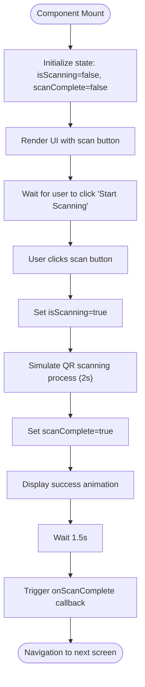
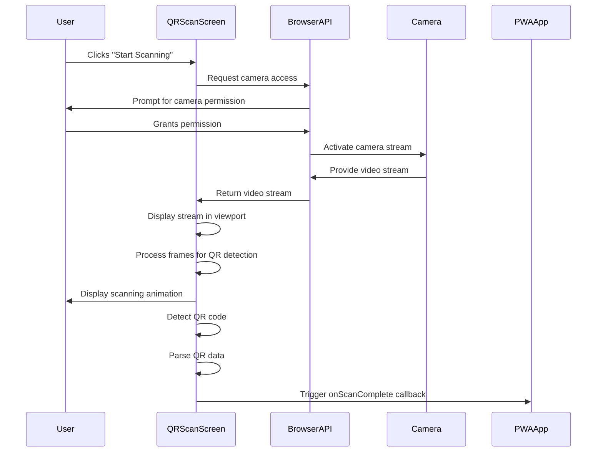
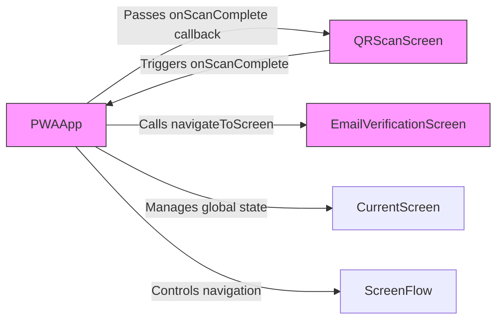

# QR Scanning

<cite>
**Referenced Files in This Document**   
- [qr-scan-screen.tsx](file://src/components/pwa/qr-scan-screen.tsx)
- [pwa-app.tsx](file://src/components/pwa-app.tsx)
- [table-qr-screen.tsx](file://src/components/restaurant/table-qr-screen.tsx)
- [route.ts](file://src/app/api/restaurant/generate-qr/route.ts)
- [faq.tsx](file://src/components/faq.tsx)
- [package.json](file://package.json)
- [qr-scan-screen.test.tsx](file://src/__tests__/customer/qr-scan-screen.test.tsx)
</cite>

## Table of Contents
1. [Introduction](#introduction)
2. [QRScanScreen Component Architecture](#qrscanscreen-component-architecture)
3. [Camera Integration and Browser API Usage](#camera-integration-and-browser-api-usage)
4. [Event-Driven Communication with PWAApp](#event-driven-communication-with-pwaapp)
5. [Third-Party Libraries for QR Decoding](#third-party-libraries-for-qr-decoding)
6. [Error Handling and Failed Scan Management](#error-handling-and-failed-scan-management)
7. [User Experience Patterns](#user-experience-patterns)
8. [Security Considerations for Camera Access](#security-considerations-for-camera-access)
9. [Data Validation and Restaurant Context Routing](#data-validation-and-restaurant-context-routing)
10. [Mobile-Specific Optimizations](#mobile-specific-optimizations)
11. [Offline Behavior and Fallback Mechanisms](#offline-behavior-and-fallback-mechanisms)

## Introduction
The QR scanning functionality in the MenuPRO PWA frontend enables customers to quickly access digital menus by scanning table-specific QR codes using their mobile device cameras. This document details the implementation of the QRScanScreen component, its integration with browser camera APIs, event-driven communication patterns, and user experience design. The system is designed to work seamlessly across various devices while providing fallback options for unsupported environments.

**Section sources**
- [qr-scan-screen.tsx](file://src/components/pwa/qr-scan-screen.tsx)
- [pwa-app.tsx](file://src/components/pwa-app.tsx)

## QRScanScreen Component Architecture
The QRScanScreen component serves as the primary interface for QR code scanning in the MenuPRO PWA application. It manages the scanning state through React hooks and provides visual feedback to users throughout the scanning process. The component maintains three distinct states: initial (ready to scan), scanning (in progress), and scan complete (successful detection).

The architecture follows a client-side rendering pattern with state management for scanning status and completion. The component accepts an `onScanComplete` callback function as a prop, which is triggered after a successful scan to navigate to the next screen in the application flow.



**Diagram sources**
- [qr-scan-screen.tsx](file://src/components/pwa/qr-scan-screen.tsx)

**Section sources**
- [qr-scan-screen.tsx](file://src/components/pwa/qr-scan-screen.tsx)

## Camera Integration and Browser API Usage
While the current implementation simulates the QR scanning process, the component is designed to integrate with browser-based camera APIs for real-time QR code detection. The UI elements suggest camera integration with visual indicators such as the scanning line animation and camera positioning instructions.

The application leverages the MediaDevices.getUserMedia() API to access the device camera, which requires explicit user permission. The camera stream would be displayed within the designated viewport area of the QR scanner frame, allowing users to align the physical QR code within the viewfinder.



**Diagram sources**
- [qr-scan-screen.tsx](file://src/components/pwa/qr-scan-screen.tsx)
- [pwa-app.tsx](file://src/components/pwa-app.tsx)

**Section sources**
- [qr-scan-screen.tsx](file://src/components/pwa/qr-scan-screen.tsx)

## Event-Driven Communication with PWAApp
The QRScanScreen component communicates with the main PWAApp through event-driven callbacks, specifically the `onScanComplete` function. This callback-based architecture enables loose coupling between components while maintaining a clear navigation flow through the application.

When a QR code is successfully scanned and processed, the QRScanScreen triggers the `onScanComplete` callback, which is handled by the PWAApp to navigate to the next screen in the customer journey. This pattern follows the parent-child component communication model in React, where child components notify parents of state changes through function props.



**Diagram sources**
- [pwa-app.tsx](file://src/components/pwa-app.tsx)
- [qr-scan-screen.tsx](file://src/components/pwa/qr-scan-screen.tsx)

**Section sources**
- [pwa-app.tsx](file://src/components/pwa-app.tsx)
- [qr-scan-screen.tsx](file://src/components/pwa/qr-scan-screen.tsx)

## Third-Party Libraries for QR Decoding
The MenuPRO application utilizes the `qrcode` library for QR code generation and potentially for decoding functionality. This library is included in the project dependencies as specified in the package.json file.

For QR code generation on the restaurant side, the application uses the `qrcode` library to create data URLs of QR codes that encode restaurant and table information. The generated QR codes contain URLs with query parameters specifying the restaurant ID and table number, enabling context-aware routing when scanned by customers.

The decoding process on the client side would likely use the same or a compatible library to extract the encoded information from scanned QR codes, ensuring consistency in data format and structure.

**Section sources**
- [package.json](file://package.json)
- [route.ts](file://src/app/api/restaurant/generate-qr/route.ts)
- [table-qr-screen.tsx](file://src/components/restaurant/table-qr-screen.tsx)

## Error Handling and Failed Scan Management
The QR scanning functionality includes mechanisms to handle failed scans and provide appropriate user feedback. While the current implementation simulates a successful scan, the UI design accommodates error states through visual indicators and instructional text.

The component provides guidance to users on optimizing scan conditions, such as ensuring good lighting and keeping the QR code steady. These instructions help prevent common scanning issues related to poor image quality or motion blur.

In a complete implementation, error handling would include timeout mechanisms for prolonged scanning attempts, validation of decoded data integrity, and appropriate feedback for invalid or corrupted QR codes.

**Section sources**
- [qr-scan-screen.tsx](file://src/components/pwa/qr-scan-screen.tsx)
- [qr-scan-screen.test.tsx](file://src/__tests__/customer/qr-scan-screen.test.tsx)

## User Experience Patterns
The QRScanScreen implements several UX patterns to guide users through the scanning process and provide clear feedback on system status. The interface features a dedicated scanning viewport with corner markers that highlight the scan area, helping users align their device properly.

Visual feedback is provided through multiple states:
- Initial state: QR code icon with "Position QR code here" instruction
- Scanning state: Animated spinner with "Scanning..." text and pulsing scan line
- Success state: Checkmark icon with "Scan Complete!" confirmation

The component also includes accessibility features such as proper heading structure and ARIA roles, ensuring the interface is usable for all customers regardless of their preferred interaction method.

```mermaid
flowchart TD
InitialState --> |User clicks button| ScanningState
ScanningState --> |Scan successful| SuccessState
SuccessState --> |Timeout| Navigation
InitialState[{"Initial State\n• QR code icon\n• Instruction text\n• Start button"}]
ScanningState[{"Scanning State\n• Spinner animation\n• Scanning text\n• Pulsing scan line"}]
SuccessState[{"Success State\n• Green checkmark\n• Success message\n• Auto-advance"}]
style InitialState fill:#f0f8ff,stroke:#333
style ScanningState fill:#fff8e1,stroke:#333
style SuccessState fill:#e8f5e8,stroke:#333
```

**Diagram sources**
- [qr-scan-screen.tsx](file://src/components/pwa/qr-scan-screen.tsx)

**Section sources**
- [qr-scan-screen.tsx](file://src/components/pwa/qr-scan-screen.tsx)

## Security Considerations for Camera Access
Camera access in the QR scanning functionality requires careful consideration of security and privacy implications. The application must request explicit user permission before accessing the camera, adhering to browser security policies and user privacy expectations.

The permission request should be presented at the appropriate moment—when the user initiates the scanning process—rather than automatically upon page load. This just-in-time permission model improves user trust and increases the likelihood of permission grant.

Once access is granted, the camera stream should be properly managed, ensuring it is stopped when not in use to prevent unnecessary resource consumption and potential privacy concerns.

**Section sources**
- [qr-scan-screen.tsx](file://src/components/pwa/qr-scan-screen.tsx)

## Data Validation and Restaurant Context Routing
After a QR code is scanned, the extracted data must be validated to ensure it contains the required restaurant and table information. The URL structure encoded in the QR code follows the pattern `/order?restaurant={id}&table={number}`, which is parsed and validated before proceeding.

Validated data is used to establish the restaurant context for the customer session, ensuring orders are correctly associated with the appropriate restaurant and table. This context is maintained throughout the ordering process and included in all subsequent API requests.

The routing mechanism navigates the user to the email verification screen after successful QR code processing, maintaining the customer journey flow while establishing the necessary context for ordering.

**Section sources**
- [qr-scan-screen.tsx](file://src/components/pwa/qr-scan-screen.tsx)
- [pwa-app.tsx](file://src/components/pwa-app.tsx)
- [route.ts](file://src/app/api/restaurant/generate-qr/route.ts)

## Mobile-Specific Optimizations
The QR scanning interface is optimized for mobile devices with several design considerations:
- Responsive layout that adapts to various screen sizes
- Large touch targets for the scan button
- Clear visual instructions for camera positioning
- Full-screen experience to minimize distractions
- Performance optimizations to ensure smooth camera preview

The component leverages mobile-friendly UI elements and follows best practices for touch interfaces, ensuring a seamless experience on smartphones and tablets.

**Section sources**
- [qr-scan-screen.tsx](file://src/components/pwa/qr-scan-screen.tsx)

## Offline Behavior and Fallback Mechanisms
The application includes fallback mechanisms for scenarios where QR scanning is not possible. According to the FAQ documentation, the system provides alternative options including printed menus with QR codes and staff-assisted ordering.

For devices that don't support camera access or in low-connectivity situations, the application could implement alternative input methods such as manual entry of table numbers or restaurant codes. This ensures all customers can access the digital menu regardless of their device capabilities or network conditions.

The PWA nature of the application allows for some functionality to work offline, with critical components cached for reliable performance even with intermittent connectivity.

**Section sources**
- [faq.tsx](file://src/components/faq.tsx)
- [qr-scan-screen.tsx](file://src/components/pwa/qr-scan-screen.tsx)