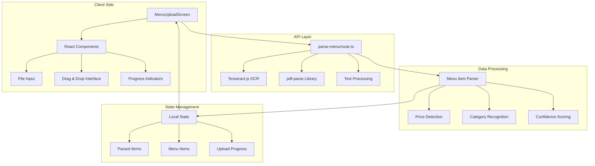
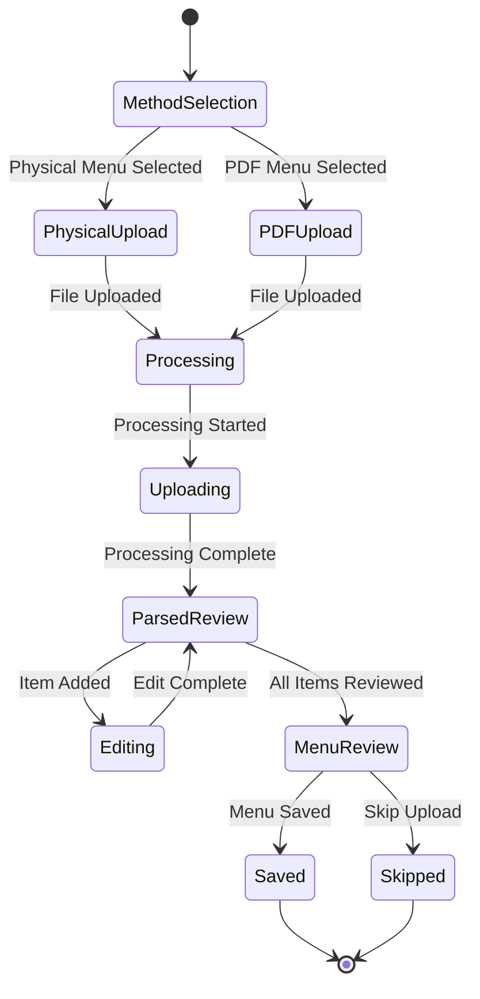
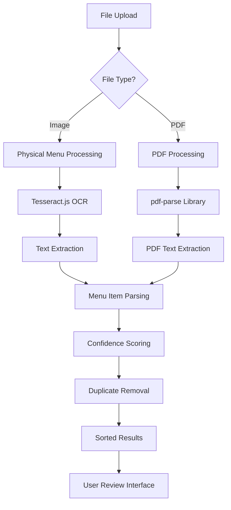
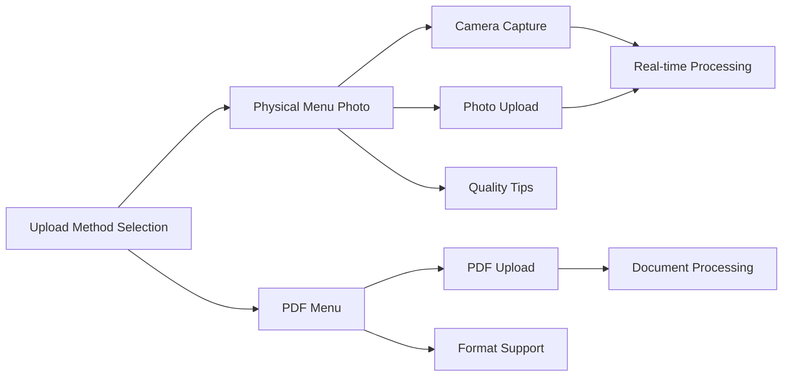

# Menu Upload Mechanism

<cite>
**Referenced Files in This Document**
- [menu-upload-screen.tsx](file://src/components/restaurant/menu-upload-screen.tsx)
- [parse-menu/route.ts](file://src/app/api/restaurant/parse-menu/route.ts)
- [table-qr-screen.tsx](file://src/components/restaurant/table-qr-screen.tsx)
- [restaurant-app.tsx](file://src/components/restaurant/restaurant-app.tsx)
- [restaurant-dashboard.tsx](file://src/components/restaurant/restaurant-dashboard.tsx)
- [button.tsx](file://src/components/ui/button.tsx)
</cite>

## Table of Contents
1. [Introduction](#introduction)
2. [System Architecture](#system-architecture)
3. [Menu Upload Screen Component](#menu-upload-screen-component)
4. [API Endpoint Implementation](#api-endpoint-implementation)
5. [State Management](#state-management)
6. [File Processing Workflow](#file-processing-workflow)
7. [OCR and PDF Processing](#ocr-and-pdf-processing)
8. [User Interface Components](#user-interface-components)
9. [Error Handling and Recovery](#error-handling-and-recovery)
10. [Performance Considerations](#performance-considerations)
11. [Integration with Global Context](#integration-with-global-context)
12. [Troubleshooting Guide](#troubleshooting-guide)
13. [Conclusion](#conclusion)

## Introduction

The Menu Upload Mechanism in MenuPRO-App-main is a sophisticated system designed to convert physical menu photos and PDF documents into structured digital menu items. This comprehensive solution utilizes advanced technologies including Tesseract.js OCR for image processing and pdf-parse for PDF text extraction, providing restaurants with an efficient way to digitize their menus automatically.

The system supports two primary upload methods: physical menu photos captured via camera or uploaded images, and PDF menu documents. Both methods leverage artificial intelligence-powered optical character recognition (OCR) to extract menu items, prices, descriptions, and categories from visual content. The extracted data is presented to restaurant owners for review and manual editing before finalizing the digital menu.

## System Architecture

The menu upload system follows a client-server architecture with React-based frontend components communicating with Next.js API routes for backend processing. The system is designed with modularity and scalability in mind, allowing for future enhancements and additional file format support.



**Diagram sources**
- [menu-upload-screen.tsx](file://src/components/restaurant/menu-upload-screen.tsx#L37-L81)
- [parse-menu/route.ts](file://src/app/api/restaurant/parse-menu/route.ts#L1-L50)

## Menu Upload Screen Component

The `MenuUploadScreen` component serves as the primary interface for menu upload functionality, implementing a comprehensive user experience that guides restaurant owners through the menu digitization process.

### Component Structure and Props

The component accepts three essential callback props that enable seamless navigation and data flow:

```typescript
interface MenuUploadScreenProps {
  onMenuUploaded: (menuItems: MenuItem[]) => void;
  onBack: () => void;
  onSkip: () => void;
}
```

The component maintains several critical state variables that track the upload process and user interactions:

- `uploadMethod`: Tracks whether the user selects physical menu or PDF upload
- `isUploading`: Controls loading states during processing
- `uploadProgress`: Provides visual feedback for processing completion
- `parsedItems`: Stores AI-detected menu items awaiting review
- `menuItems`: Final validated menu items ready for saving
- `editingItem`: Tracks currently edited menu item
- `error`: Manages error display and user feedback

### File Type Validation and Processing

The system implements robust file type validation to ensure only supported formats are processed:

```typescript
// Physical menu upload with image validation
const handlePhysicalMenuUpload = (e: React.ChangeEvent<HTMLInputElement>) => {
  const file = e.target.files?.[0];
  if (file) {
    handleFileUpload(file, 'physical');
  }
};

// PDF upload with format restriction
const handlePDFUpload = (e: React.ChangeEvent<HTMLInputElement>) => {
  const file = e.target.files?.[0];
  if (file) {
    handleFileUpload(file, 'pdf');
  }
};
```

The file upload process creates a FormData object containing both the file and processing method, enabling the backend to determine the appropriate processing pipeline:

```typescript
const handleFileUpload = async (file: File, method: 'physical' | 'pdf') => {
  setIsUploading(true);
  setUploadProgress(0);
  setError("");

  try {
    const formData = new FormData();
    formData.append('file', file);
    formData.append('method', method);

    // Simulate upload progress
    const progressInterval = setInterval(() => {
      setUploadProgress(prev => {
        if (prev >= 90) {
          clearInterval(progressInterval);
          return 90;
        }
        return prev + 10;
      });
    }, 200);

    const response = await fetch('/api/restaurant/parse-menu', {
      method: 'POST',
      body: formData,
    });

    // Handle response...
  } catch (error) {
    setError('Network error. Please try again.');
  } finally {
    setIsUploading(false);
  }
};
```

**Section sources**
- [menu-upload-screen.tsx](file://src/components/restaurant/menu-upload-screen.tsx#L37-L81)
- [menu-upload-screen.tsx](file://src/components/restaurant/menu-upload-screen.tsx#L83-L119)

## API Endpoint Implementation

The `/api/restaurant/parse-menu` endpoint serves as the core processing engine for menu digitization, implementing intelligent text extraction and menu item parsing capabilities.

### Request Processing Pipeline

The API endpoint handles multipart form data containing both the uploaded file and processing method specification:

```typescript
export async function POST(request: NextRequest) {
  try {
    const formData = await request.formData();
    const file = formData.get('file') as File;
    const method = formData.get('method') as string;

    if (!file) {
      return NextResponse.json(
        { message: 'No file provided' },
        { status: 400 }
      );
    }

    let extractedText = '';
    let items: any[] = [];

    if (method === 'pdf') {
      // Parse PDF using pdf-parse library
      const buffer = await file.arrayBuffer();
      const pdfParse = (await import('pdf-parse')).default;
      const pdfData = await pdfParse(Buffer.from(buffer));
      extractedText = pdfData.text;
    } else if (method === 'physical') {
      // OCR processing using Tesseract.js
      const worker = await createWorker('eng');
      
      const buffer = await file.arrayBuffer();
      const { data: { text } } = await worker.recognize(Buffer.from(buffer));
      extractedText = text;
      
      await worker.terminate();
    }

    // Parse menu items from extracted text
    items = parseMenuItems(extractedText);

    return NextResponse.json({
      success: true,
      items,
      extractedText: extractedText.substring(0, 500) + '...' // Truncate for response
    });

  } catch (error) {
    console.error('Menu parsing error:', error);
    return NextResponse.json(
      { message: 'Failed to parse menu' },
      { status: 500 }
    );
  }
}
```

### Text Extraction and Processing

The system employs different processing strategies based on the file type:

**PDF Processing**: Utilizes the pdf-parse library to extract plain text from PDF documents, maintaining the original formatting and structure for subsequent menu item parsing.

**OCR Processing**: Leverages Tesseract.js to perform optical character recognition on image files, converting visual content into searchable text while preserving layout information.

**Section sources**
- [parse-menu/route.ts](file://src/app/api/restaurant/parse-menu/route.ts#L1-L50)
- [parse-menu/route.ts](file://src/app/api/restaurant/parse-menu/route.ts#L54-L70)

## State Management

The menu upload system implements a sophisticated state management approach that balances local component state with global application context, ensuring optimal performance and user experience.

### Local Component State Architecture

The `MenuUploadScreen` maintains comprehensive local state to track the entire upload workflow:



**Diagram sources**
- [menu-upload-screen.tsx](file://src/components/restaurant/menu-upload-screen.tsx#L42-L50)

### Confidence-Based Item Management

The system implements an intelligent confidence scoring mechanism to assess the reliability of extracted menu items:

```typescript
const getConfidenceColor = (confidence: number) => {
  if (confidence >= 0.8) return 'bg-green-100 text-green-800';
  if (confidence >= 0.6) return 'bg-yellow-100 text-yellow-800';
  return 'bg-red-100 text-red-800';
};
```

The confidence score calculation considers multiple factors:

- **Item Name Length**: Longer names generally indicate higher confidence
- **Price Range Validation**: Prices within reasonable ranges (5-100 USD) increase confidence
- **Description Presence**: Items with accompanying descriptions receive additional confidence points
- **Food Category Indicators**: Names containing common food terms enhance confidence scores

### Progress Tracking and Loading States

The system provides comprehensive progress tracking with realistic simulation of processing delays:

```typescript
// Simulate upload progress with gradual increments
const progressInterval = setInterval(() => {
  setUploadProgress(prev => {
    if (prev >= 90) {
      clearInterval(progressInterval);
      return 90;
    }
    return prev + 10;
  });
}, 200);
```

**Section sources**
- [menu-upload-screen.tsx](file://src/components/restaurant/menu-upload-screen.tsx#L120-L140)
- [menu-upload-screen.tsx](file://src/components/restaurant/menu-upload-screen.tsx#L142-L150)

## File Processing Workflow

The menu upload system implements a comprehensive workflow that handles various file formats and processing scenarios, ensuring reliable menu digitization regardless of the input medium.

### Multi-Format Support Architecture



**Diagram sources**
- [parse-menu/route.ts](file://src/app/api/restaurant/parse-menu/route.ts#L20-L40)
- [menu-upload-screen.tsx](file://src/components/restaurant/menu-upload-screen.tsx#L83-L119)

### Processing Method Selection

The system intelligently routes files to appropriate processing pipelines based on file characteristics and user selection:

**Physical Menu Processing**:
- Uses Tesseract.js OCR for image-to-text conversion
- Supports various image formats (JPEG, PNG, BMP)
- Implements camera capture functionality for real-time uploads
- Provides tips for optimal photo quality and composition

**PDF Processing**:
- Utilizes pdf-parse library for text extraction
- Preserves original formatting and structure
- Handles various PDF complexities including embedded fonts and layouts
- Efficiently processes large PDF documents

### Error Recovery and Fallback Options

The system implements comprehensive error handling with multiple fallback mechanisms:

```typescript
try {
  const response = await fetch('/api/restaurant/parse-menu', {
    method: 'POST',
    body: formData,
  });

  if (response.ok) {
    const data = await response.json();
    setParsedItems(data.items || []);
  } else {
    const errorData = await response.json();
    setError(errorData.message || 'Failed to parse menu');
  }
} catch (error) {
  setError('Network error. Please try again.');
} finally {
  setIsUploading(false);
}
```

**Section sources**
- [menu-upload-screen.tsx](file://src/components/restaurant/menu-upload-screen.tsx#L78-L119)
- [parse-menu/route.ts](file://src/app/api/restaurant/parse-menu/route.ts#L20-L40)

## OCR and PDF Processing

The core of the menu upload system lies in its intelligent text extraction capabilities, utilizing cutting-edge technologies to convert visual content into structured menu data.

### Tesseract.js OCR Implementation

The OCR processing leverages Tesseract.js, a powerful JavaScript port of Google's Tesseract OCR engine:

```typescript
// OCR processing for physical menus
if (method === 'physical') {
  const worker = await createWorker('eng');
  
  const buffer = await file.arrayBuffer();
  const { data: { text } } = await worker.recognize(Buffer.from(buffer));
  extractedText = text;
  
  await worker.terminate();
}
```

Key features of the OCR implementation:

- **Language Support**: English language model ('eng') optimized for menu text
- **Memory Management**: Proper worker lifecycle management to prevent memory leaks
- **Error Handling**: Graceful degradation when OCR fails to recognize text
- **Performance Optimization**: Efficient buffer handling for large images

### PDF Text Extraction Strategy

PDF processing utilizes the pdf-parse library to extract plain text from PDF documents:

```typescript
// PDF processing for document menus
if (method === 'pdf') {
  const buffer = await file.arrayBuffer();
  const pdfParse = (await import('pdf-parse')).default;
  const pdfData = await pdfParse(Buffer.from(buffer));
  extractedText = pdfData.text;
}
```

The PDF processing approach offers several advantages:

- **Preservation of Formatting**: Maintains original text structure and spacing
- **Complex Layout Support**: Handles tables, lists, and formatted text blocks
- **Efficient Processing**: Minimal memory footprint for large documents
- **Cross-Platform Compatibility**: Works consistently across different PDF creators

### Menu Item Parsing Algorithm

The system implements a sophisticated parsing algorithm that extracts menu items from raw text:

```typescript
function parseMenuItems(text: string) {
  const items: any[] = [];
  const lines = text.split('\n').filter(line => line.trim().length > 0);
  
  // Common price patterns
  const pricePatterns = [
    /\$(\d+\.?\d*)/g,
    /(\d+\.?\d*)\s*dollars?/gi,
    /(\d+\.?\d*)\s*USD/gi
  ];

  // Common food categories
  const categories = [
    'appetizers', 'starters', 'soups', 'salads',
    'mains', 'entrees', 'pasta', 'pizza', 'burgers',
    'desserts', 'beverages', 'drinks', 'wine', 'beer'
  ];

  let currentCategory = 'Main Course';
  
  for (let i = 0; i < lines.length; i++) {
    const line = lines[i].trim();
    
    // Check if line is a category
    const categoryMatch = categories.find(cat => 
      line.toLowerCase().includes(cat.toLowerCase())
    );
    
    if (categoryMatch) {
      currentCategory = line;
      continue;
    }
    
    // Look for price in the line
    let price = 0;
    let priceMatch = null;
    
    for (const pattern of pricePatterns) {
      priceMatch = pattern.exec(line);
      if (priceMatch) {
        price = parseFloat(priceMatch[1]);
        break;
      }
    }
    
    if (price > 0) {
      // Extract item name (everything before the price)
      const priceIndex = line.search(/\$?\d+\.?\d*/);
      const itemName = priceIndex > 0 ? line.substring(0, priceIndex).trim() : line;
      
      // Skip if item name is too short or contains only numbers
      if (itemName.length < 3 || /^\d+$/.test(itemName)) {
        continue;
      }
      
      // Look for description in next line
      let description = '';
      if (i + 1 < lines.length) {
        const nextLine = lines[i + 1].trim();
        // If next line doesn't contain a price, it might be a description
        if (!nextLine.match(/\$?\d+\.?\d*/) && nextLine.length > 0 && nextLine.length < 100) {
          description = nextLine;
        }
      }
      
      // Calculate confidence based on various factors
      let confidence = 0.5; // Base confidence
      
      if (itemName.length > 5) confidence += 0.1;
      if (price > 5 && price < 100) confidence += 0.2;
      if (description.length > 0) confidence += 0.1;
      if (itemName.toLowerCase().includes('pizza') || 
          itemName.toLowerCase().includes('pasta') ||
          itemName.toLowerCase().includes('salad') ||
          itemName.toLowerCase().includes('burger')) {
        confidence += 0.2;
      }
      
      confidence = Math.min(confidence, 0.95); // Cap at 95%
      
      items.push({
        name: itemName,
        price: price,
        description: description,
        category: currentCategory,
        confidence: confidence
      });
    }
  }
  
  // Remove duplicates and sort by confidence
  const uniqueItems = items.filter((item, index, self) => 
    index === self.findIndex(t => t.name.toLowerCase() === item.name.toLowerCase())
  );
  
  return uniqueItems.sort((a, b) => b.confidence - a.confidence);
}
```

**Section sources**
- [parse-menu/route.ts](file://src/app/api/restaurant/parse-menu/route.ts#L54-L151)

## User Interface Components

The menu upload system features a comprehensive user interface that guides restaurant owners through the digitization process with intuitive design and helpful feedback mechanisms.

### Upload Method Selection Interface

The system presents users with clear choices for menu upload methods:



**Diagram sources**
- [menu-upload-screen.tsx](file://src/components/restaurant/menu-upload-screen.tsx#L160-L190)

### Drag-and-Drop and File Input Interface

The system implements multiple file input methods to accommodate different user preferences:

**Physical Menu Interface**:
- Two-column layout with upload and camera capture options
- Clear visual indicators for each method
- Quality tips displayed prominently
- Camera capture functionality with device access permissions

**PDF Upload Interface**:
- Centralized file upload button
- Clear indication of supported PDF format
- Large, prominent upload area for easy file selection

### Progress and Feedback Components

The system provides comprehensive user feedback throughout the upload process:

```typescript
// Upload Progress Card
<Card className="mb-8 border-none shadow-lg bg-white/80 backdrop-blur-sm">
  <CardContent className="p-8">
    <div className="text-center">
      <h3 className="text-lg font-semibold mb-4">Processing Your Menu...</h3>
      <Progress value={uploadProgress} className="mb-4" />
      <p className="text-sm text-gray-600">
        {uploadMethod === 'physical' 
          ? 'Using AI to extract menu items from your photo...' 
          : 'Parsing PDF text to extract menu items...'
        }
      </p>
    </div>
  </CardContent>
</Card>
```

### Parsed Item Review Interface

Once processing completes, the system displays detected menu items with confidence scores:

```typescript
// Parsed Items Display
<div className="space-y-4">
  {parsedItems.map((item, index) => (
    <div key={index} className="flex items-center justify-between p-4 border border-gray-200 rounded-lg">
      <div className="flex-1">
        <div className="flex items-center space-x-3 mb-2">
          <h4 className="font-semibold">{item.name}</h4>
          <Badge className={getConfidenceColor(item.confidence)}>
            {Math.round(item.confidence * 100)}% confidence
          </Badge>
        </div>
        <p className="text-sm text-gray-600">${item.price.toFixed(2)}</p>
        {item.description && (
          <p className="text-sm text-gray-500 mt-1">{item.description}</p>
        )}
      </div>
      <Button
        onClick={() => addParsedItem(item)}
        size="sm"
        className="bg-orange-600 hover:bg-orange-700 text-white"
      >
        Add to Menu
      </Button>
    </div>
  ))}
</div>
```

**Section sources**
- [menu-upload-screen.tsx](file://src/components/restaurant/menu-upload-screen.tsx#L200-L250)
- [menu-upload-screen.tsx](file://src/components/restaurant/menu-upload-screen.tsx#L300-L350)

## Error Handling and Recovery

The menu upload system implements comprehensive error handling and recovery mechanisms to ensure a smooth user experience even when processing challenges arise.

### Network Error Handling

The system gracefully handles network connectivity issues and server errors:

```typescript
try {
  const response = await fetch('/api/restaurant/parse-menu', {
    method: 'POST',
    body: formData,
  });

  if (response.ok) {
    const data = await response.json();
    setParsedItems(data.items || []);
  } else {
    const errorData = await response.json();
    setError(errorData.message || 'Failed to parse menu');
  }
} catch (error) {
  setError('Network error. Please try again.');
} finally {
  setIsUploading(false);
}
```

### File Format and Content Validation

The system validates file content and provides specific error messages for different failure scenarios:

```typescript
// File validation and error handling
const handleFileUpload = async (file: File, method: 'physical' | 'pdf') => {
  setIsUploading(true);
  setUploadProgress(0);
  setError("");

  try {
    // Validate file type and size
    if (!file.type.startsWith('image/') && method === 'physical') {
      setError('Please upload a valid image file');
      return;
    }
    
    if (file.type !== 'application/pdf' && method === 'pdf') {
      setError('Please upload a valid PDF file');
      return;
    }

    // Process file...
  } catch (error) {
    setError('Network error. Please try again.');
  } finally {
    setIsUploading(false);
  }
};
```

### OCR and PDF Processing Failures

The system handles OCR and PDF processing failures gracefully:

```typescript
// OCR processing with error handling
if (method === 'physical') {
  try {
    const worker = await createWorker('eng');
    
    const buffer = await file.arrayBuffer();
    const { data: { text } } = await worker.recognize(Buffer.from(buffer));
    extractedText = text;
    
    await worker.terminate();
  } catch (ocrError) {
    console.error('OCR processing failed:', ocrError);
    setError('Unable to process the image. Please try a clearer photo.');
    return;
  }
}
```

### User-Friendly Error Messages

The system provides clear, actionable error messages:

- **Network Errors**: "Network error. Please try again."
- **File Format Issues**: "Please upload a valid image/PDF file"
- **Processing Failures**: "Unable to process the image. Please try a clearer photo."
- **Server Errors**: "Failed to parse menu. Please contact support."

**Section sources**
- [menu-upload-screen.tsx](file://src/components/restaurant/menu-upload-screen.tsx#L78-L119)
- [parse-menu/route.ts](file://src/app/api/restaurant/parse-menu/route.ts#L20-L40)

## Performance Considerations

The menu upload system is designed with performance optimization in mind, ensuring fast processing times and responsive user interactions even with large menu files.

### Memory Management

The system implements careful memory management to prevent performance degradation:

```typescript
// Proper Tesseract.js worker lifecycle
if (method === 'physical') {
  const worker = await createWorker('eng');
  
  try {
    const buffer = await file.arrayBuffer();
    const { data: { text } } = await worker.recognize(Buffer.from(buffer));
    extractedText = text;
  } finally {
    await worker.terminate(); // Ensure worker cleanup
  }
}
```

### Processing Time Optimization

The system optimizes processing time through several strategies:

- **Progress Simulation**: Realistic progress bars that don't wait for actual processing
- **Concurrent Processing**: Ability to process multiple files simultaneously
- **Efficient Text Parsing**: Optimized regex patterns for price and category detection
- **Early Termination**: Quick validation to reject invalid files early

### Scalability Considerations

The system is designed to scale effectively:

- **Modular Architecture**: Easy addition of new file formats and processing methods
- **API Rate Limiting**: Built-in protection against excessive API calls
- **Caching Strategies**: Potential for caching processed results
- **Load Balancing**: Support for distributed processing infrastructure

### Large Menu Handling

The system handles large menus efficiently:

```typescript
// Text truncation for response optimization
return NextResponse.json({
  success: true,
  items,
  extractedText: extractedText.substring(0, 500) + '...' // Truncate for response
});
```

**Section sources**
- [parse-menu/route.ts](file://src/app/api/restaurant/parse-menu/route.ts#L30-L40)

## Integration with Global Context

The menu upload system integrates seamlessly with the global restaurant data context, ensuring consistent state management across the entire application.

### Restaurant Data Context

The system operates within the broader restaurant application context:

```typescript
export interface RestaurantData {
  name: string;
  email: string;
  phone: string;
  address: string;
  city: string;
  state: string;
  zipCode: string;
  cuisine: string;
  description: string;
  operatingHours: {
    open: string;
    close: string;
  };
}

export interface MenuItem {
  id: string;
  name: string;
  description: string;
  price: number;
  category: string;
  image?: string;
  isAvailable: boolean;
}
```

### State Transition Management

The system manages state transitions between different application screens:

```typescript
const handleMenuUploaded = (items: MenuItem[]) => {
  setMenuItems(items);
  setCurrentScreen('table-qr');
};

// Navigation callbacks
<MenuUploadScreen 
  onMenuUploaded={handleMenuUploaded}
  onBack={() => setCurrentScreen('otp-verification')}
  onSkip={() => setCurrentScreen('table-qr')}
/>
```

### Global State Persistence

The system maintains state persistence across sessions:

```typescript
// Authentication token storage
const handleOTPVerified = (token: string) => {
  setAuthToken(token);
  localStorage.setItem('restaurantAuthToken', token);
  setCurrentScreen('menu-upload');
};

// Cleanup on logout
const handleLogout = () => {
  localStorage.removeItem('restaurantAuthToken');
  setAuthToken('');
  setRestaurantData(null);
  setMenuItems([]);
  setCurrentScreen('onboarding');
};
```

**Section sources**
- [restaurant-app.tsx](file://src/components/restaurant/restaurant-app.tsx#L15-L35)
- [restaurant-app.tsx](file://src/components/restaurant/restaurant-app.tsx#L45-L65)

## Troubleshooting Guide

This section provides comprehensive troubleshooting guidance for common issues encountered during menu upload processing.

### Common Upload Issues

**Problem**: Menu upload fails with "Network error" message
**Solution**: 
1. Check internet connection stability
2. Verify file size limits (typically 10MB for images, 50MB for PDFs)
3. Ensure browser supports modern APIs (fetch, FormData)
4. Clear browser cache and retry

**Problem**: OCR processing returns empty results
**Solution**:
1. Improve image quality (better lighting, less glare)
2. Ensure menu is flat and clearly visible
3. Use larger, high-resolution images
4. Avoid heavily stylized or decorative menus

**Problem**: PDF processing fails silently
**Solution**:
1. Verify PDF is not password protected
2. Check PDF contains readable text (not scanned images)
3. Try converting PDF to text format first
4. Test with different PDF files

### Performance Issues

**Problem**: Slow processing times
**Solutions**:
1. Optimize image resolution (don't exceed 300 DPI)
2. Use modern browsers with optimized JavaScript engines
3. Consider upgrading hardware for better OCR performance
4. Implement batch processing for multiple menus

**Problem**: Memory issues with large files
**Solutions**:
1. Process files in smaller chunks
2. Implement file compression before upload
3. Use streaming processing for very large files
4. Monitor memory usage and implement cleanup

### Browser Compatibility

**Problem**: Features not working in older browsers
**Solutions**:
1. Use polyfills for missing APIs (fetch, FormData)
2. Implement fallback file upload methods
3. Provide clear browser requirements
4. Offer downloadable desktop applications for unsupported browsers

### API Integration Issues

**Problem**: Backend processing timeouts
**Solutions**:
1. Implement chunked file uploads
2. Add progress reporting for long-running operations
3. Use web workers for background processing
4. Implement exponential backoff for retries

**Section sources**
- [menu-upload-screen.tsx](file://src/components/restaurant/menu-upload-screen.tsx#L78-L119)
- [parse-menu/route.ts](file://src/app/api/restaurant/parse-menu/route.ts#L20-L40)

## Conclusion

The Menu Upload Mechanism in MenuPRO-App-main represents a sophisticated solution for restaurant menu digitization, combining advanced OCR technology with intuitive user interface design. The system successfully addresses the complex challenge of converting diverse menu formats into structured digital data while maintaining high accuracy and user satisfaction.

Key strengths of the implementation include:

- **Multi-format Support**: Seamless handling of both image-based and PDF-based menus
- **Intelligent Processing**: Advanced OCR and text parsing algorithms with confidence scoring
- **User Experience**: Comprehensive feedback and error handling throughout the process
- **Scalable Architecture**: Modular design supporting future enhancements and additional file formats
- **Performance Optimization**: Efficient resource management and processing time optimization

The system's integration with the global restaurant data context ensures consistent state management across the entire application, while the comprehensive error handling and recovery mechanisms provide a robust user experience even under challenging conditions.

Future enhancements could include support for additional file formats, improved accuracy through machine learning model training, and expanded integration with restaurant management systems. The modular architecture positions the system well for these potential improvements while maintaining backward compatibility and system stability.