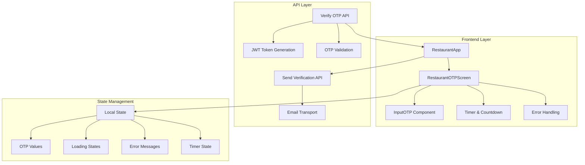
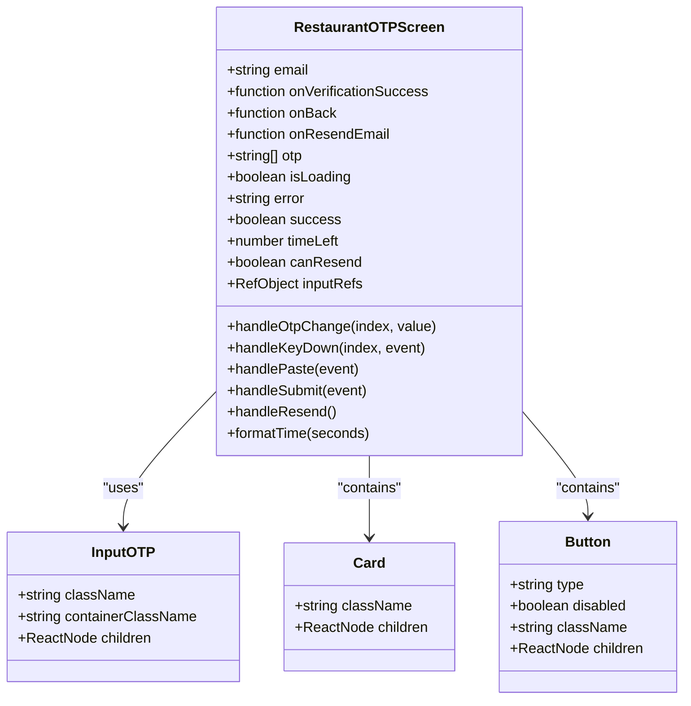
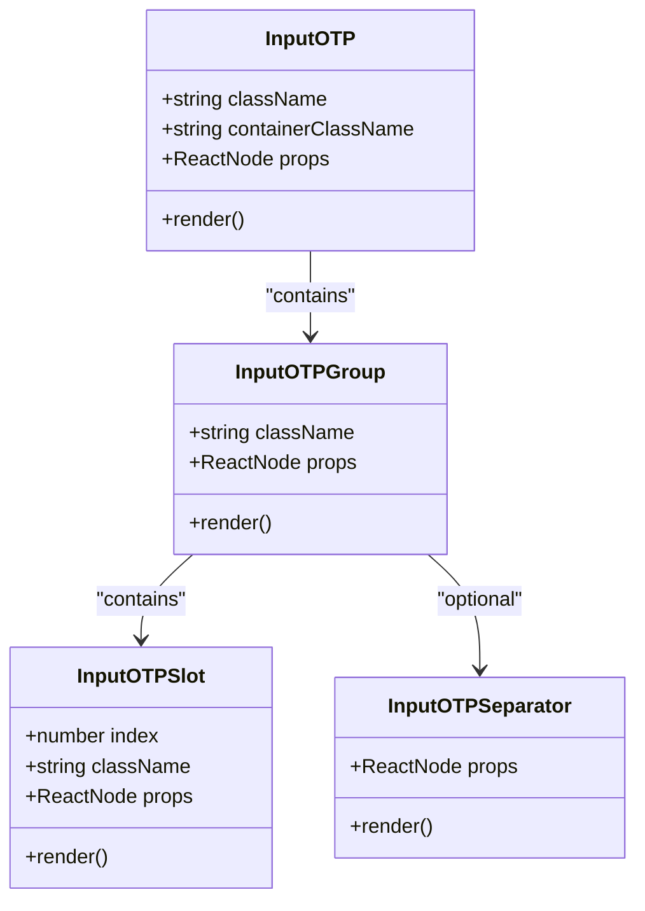
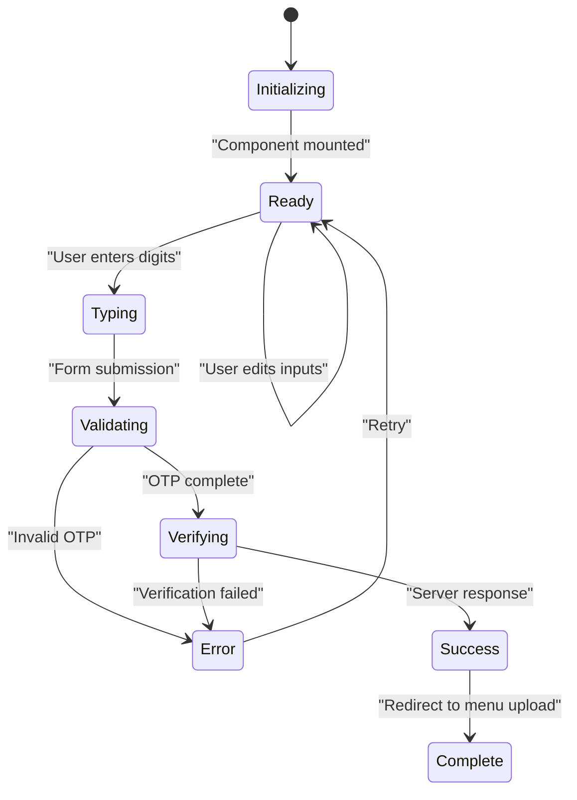
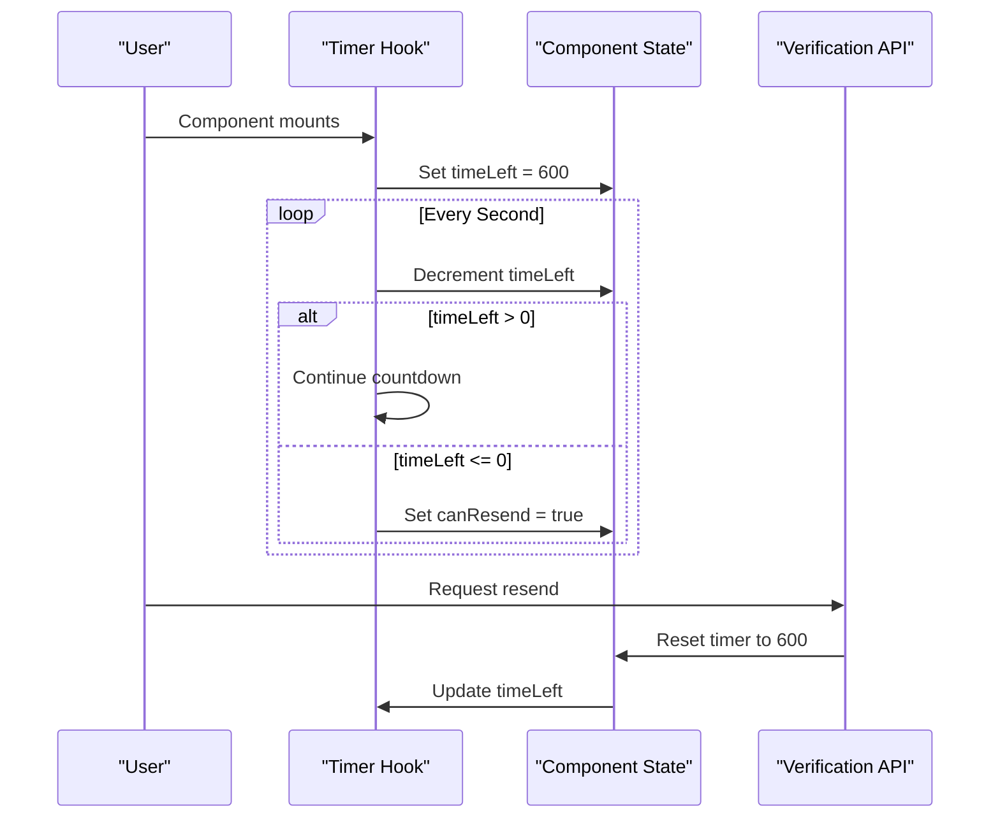
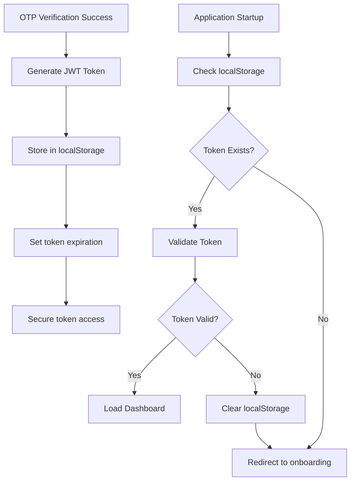
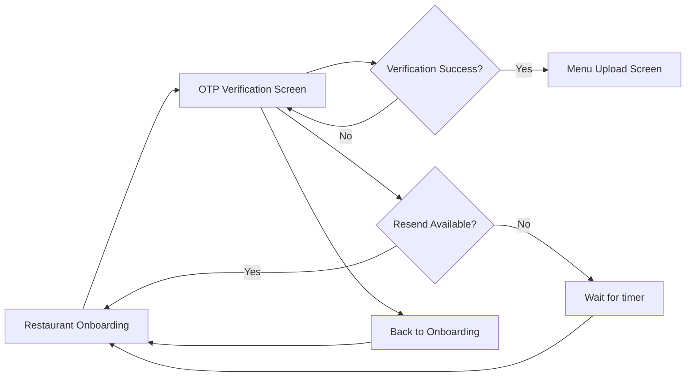

# OTP Verification Process

<cite>
**Referenced Files in This Document**
- [src/components/restaurant/restaurant-otp-screen.tsx](file://src/components/restaurant/restaurant-otp-screen.tsx)
- [src/components/ui/input-otp.tsx](file://src/components/ui/input-otp.tsx)
- [src/components/restaurant/restaurant-app.tsx](file://src/components/restaurant/restaurant-app.tsx)
- [src/app/api/restaurant/verify-otp/route.ts](file://src/app/api/restaurant/verify-otp/route.ts)
- [src/app/api/restaurant/send-verification/route.ts](file://src/app/api/restaurant/send-verification/route.ts)
- [src/__tests__/restaurant/restaurant-otp-screen.test.tsx](file://src/__tests__/restaurant/restaurant-otp-screen.test.tsx)
- [package.json](file://package.json)
</cite>

## Table of Contents
1. [Introduction](#introduction)
2. [System Architecture](#system-architecture)
3. [OTP Screen Implementation](#otp-screen-implementation)
4. [InputOTP Component](#inputotp-component)
5. [State Management](#state-management)
6. [Countdown Timer Implementation](#countdown-timer-implementation)
7. [Security Features](#security-features)
8. [Navigation Controls](#navigation-controls)
9. [Testing and Accessibility](#testing-and-accessibility)
10. [Performance Considerations](#performance-considerations)
11. [Troubleshooting Guide](#troubleshooting-guide)
12. [Conclusion](#conclusion)

## Introduction

The OTP (One-Time Password) verification process in the MenuPRO restaurant frontend serves as a critical security checkpoint for authenticating restaurant accounts. This comprehensive system validates restaurant email addresses through a 6-digit verification code sent via email, ensuring legitimate account creation while maintaining robust security measures.

The OTP verification flow integrates seamlessly with the restaurant onboarding process, transitioning users from initial registration to full account activation. The system employs modern React patterns, TypeScript typing, and comprehensive error handling to deliver a reliable and accessible user experience.

## System Architecture

The OTP verification system follows a modular architecture with clear separation of concerns across multiple layers:

**Diagram sources**
- [src/components/restaurant/restaurant-app.tsx](file://src/components/restaurant/restaurant-app.tsx#L1-L134)
- [src/components/restaurant/restaurant-otp-screen.tsx](file://src/components/restaurant/restaurant-otp-screen.tsx#L1-L259)

**Section sources**
- [src/components/restaurant/restaurant-app.tsx](file://src/components/restaurant/restaurant-app.tsx#L1-L134)
- [src/app/api/restaurant/send-verification/route.ts](file://src/app/api/restaurant/send-verification/route.ts#L1-L99)

## OTP Screen Implementation

The `RestaurantOTPScreen` component serves as the primary interface for OTP verification, implementing a comprehensive form with advanced input handling capabilities:

### Component Structure

**Diagram sources**
- [src/components/restaurant/restaurant-otp-screen.tsx](file://src/components/restaurant/restaurant-otp-screen.tsx#L11-L20)
- [src/components/ui/input-otp.tsx](file://src/components/ui/input-otp.tsx#L8-L17)

### Key Features

The OTP screen implements several sophisticated features:

1. **6-Digit Input Field**: Uses individual character inputs for improved user experience
2. **Auto-Focus Navigation**: Automatically advances to the next input field upon entry
3. **Backspace Navigation**: Enables seamless navigation backward through inputs
4. **Paste Support**: Handles clipboard paste events for bulk code entry
5. **Real-time Validation**: Validates OTP length and provides immediate feedback
6. **Loading States**: Provides visual feedback during verification attempts
7. **Error Handling**: Displays contextual error messages for invalid submissions

**Section sources**
- [src/components/restaurant/restaurant-otp-screen.tsx](file://src/components/restaurant/restaurant-otp-screen.tsx#L47-L93)
- [src/components/restaurant/restaurant-otp-screen.tsx](file://src/components/restaurant/restaurant-otp-screen.tsx#L179-L206)

## InputOTP Component

The InputOTP component provides a reusable foundation for OTP input fields, built on top of the `input-otp` library:

### Component Architecture

**Diagram sources**
- [src/components/ui/input-otp.tsx](file://src/components/ui/input-otp.tsx#L8-L17)
- [src/components/ui/input-otp.tsx](file://src/components/ui/input-otp.tsx#L19-L28)
- [src/components/ui/input-otp.tsx](file://src/components/ui/input-otp.tsx#L30-L46)

### Implementation Details

The InputOTP component leverages the `input-otp` library to provide:

- **Accessibility Compliance**: Proper ARIA attributes and keyboard navigation
- **Visual Feedback**: Active state indicators and focus management
- **Responsive Design**: Adaptive sizing for different screen sizes
- **Custom Styling**: Tailwind CSS integration with theme support

**Section sources**
- [src/components/ui/input-otp.tsx](file://src/components/ui/input-otp.tsx#L1-L78)

## State Management

The OTP screen employs React's state management to handle dynamic user interactions and form validation:

### State Variables

**Diagram sources**
- [src/components/restaurant/restaurant-otp-screen.tsx](file://src/components/restaurant/restaurant-otp-screen.tsx#L15-L22)

### State Transitions

The component manages several interconnected state variables:

1. **OTP Array**: Maintains individual digit values for each input position
2. **Loading State**: Controls UI feedback during API requests
3. **Error State**: Displays validation and server errors
4. **Success State**: Triggers completion animations and redirects
5. **Timer State**: Manages countdown and resend availability

**Section sources**
- [src/components/restaurant/restaurant-otp-screen.tsx](file://src/components/restaurant/restaurant-otp-screen.tsx#L15-L22)

## Countdown Timer Implementation

The OTP verification system includes a sophisticated countdown timer that enhances user experience and security:

### Timer Logic

**Diagram sources**
- [src/components/restaurant/restaurant-otp-screen.tsx](file://src/components/restaurant/restaurant-otp-screen.tsx#L24-L32)
- [src/components/restaurant/restaurant-otp-screen.tsx](file://src/components/restaurant/restaurant-otp-screen.tsx#L105-L115)

### Timer Features

The countdown timer provides:

- **10-Minute Expiration**: Standard OTP timeout period
- **Real-time Updates**: Smooth second-by-second countdown
- **Resend Availability**: Automatic enablement after expiration
- **Format Display**: Human-readable time formatting (MM:SS)
- **Memory Management**: Proper cleanup to prevent memory leaks

**Section sources**
- [src/components/restaurant/restaurant-otp-screen.tsx](file://src/components/restaurant/restaurant-otp-screen.tsx#L24-L32)
- [src/components/restaurant/restaurant-otp-screen.tsx](file://src/components/restaurant/restaurant-otp-screen.tsx#L34-L36)

## Security Features

The OTP verification system implements multiple layers of security to protect against various attack vectors:

### Token Storage Security

**Diagram sources**
- [src/components/restaurant/restaurant-app.tsx](file://src/components/restaurant/restaurant-app.tsx#L40-L44)

### Security Measures

1. **JWT Token Storage**: Secure local storage with automatic expiration
2. **Rate Limiting**: Server-side protection against brute force attacks
3. **HTTPS Enforcement**: All communications encrypted
4. **Input Sanitization**: Prevention of XSS and injection attacks
5. **Session Management**: Proper cleanup on logout and token expiration

**Section sources**
- [src/components/restaurant/restaurant-app.tsx](file://src/components/restaurant/restaurant-app.tsx#L40-L44)
- [src/app/api/restaurant/verify-otp/route.ts](file://src/app/api/restaurant/verify-otp/route.ts#L1-L83)

## Navigation Controls

The OTP screen provides intuitive navigation controls that guide users through the verification process:

### Navigation Flow

**Diagram sources**
- [src/components/restaurant/restaurant-app.tsx](file://src/components/restaurant/restaurant-app.tsx#L60-L85)

### Control Features

1. **Back Navigation**: Returns to restaurant onboarding form
2. **Resend Functionality**: Allows users to request new codes
3. **Progress Tracking**: Clear indication of verification status
4. **Error Recovery**: Graceful handling of failed verifications
5. **State Persistence**: Maintains form data during navigation

**Section sources**
- [src/components/restaurant/restaurant-app.tsx](file://src/components/restaurant/restaurant-app.tsx#L60-L85)
- [src/components/restaurant/restaurant-otp-screen.tsx](file://src/components/restaurant/restaurant-otp-screen.tsx#L218-L259)

## Testing and Accessibility

The OTP verification system includes comprehensive testing and accessibility features:

### Accessibility Features

1. **Screen Reader Support**: Proper ARIA labels and roles
2. **Keyboard Navigation**: Full keyboard accessibility
3. **Focus Management**: Logical tab order and focus indicators
4. **High Contrast**: Support for high contrast mode
5. **VoiceOver Compatibility**: iOS VoiceOver support

### Testing Coverage

The system includes extensive Jest tests covering:

- **Input Validation**: OTP length and character restrictions
- **Navigation**: Back button and resend functionality
- **Error Handling**: Invalid OTP scenarios
- **Loading States**: API request feedback
- **Accessibility**: Screen reader compatibility

**Section sources**
- [src/__tests__/restaurant/restaurant-otp-screen.test.tsx](file://src/__tests__/restaurant/restaurant-otp-screen.test.tsx#L1-L283)

## Performance Considerations

The OTP verification system is optimized for performance and user experience:

### Optimization Strategies

1. **Lazy Loading**: Components load only when needed
2. **Efficient State Updates**: Minimal re-renders through proper state management
3. **Memory Cleanup**: Proper cleanup of timers and event listeners
4. **Bundle Size**: Optimized imports and tree-shaking
5. **CDN Integration**: Static asset optimization

### Bundle Analysis

The system utilizes modern bundling techniques:

- **Next.js Optimization**: Automatic code splitting and optimization
- **Tree Shaking**: Elimination of unused code
- **Compression**: Gzip compression for static assets
- **Caching**: Intelligent caching strategies for improved load times

**Section sources**
- [package.json](file://package.json#L1-L89)

## Troubleshooting Guide

Common issues and their solutions in the OTP verification process:

### Verification Issues

1. **Invalid OTP Codes**
   - **Cause**: Incorrect code entry or expired verification
   - **Solution**: Use the resend functionality or check email inbox
   - **Prevention**: Clear instructions about code validity period

2. **Timer Not Starting**
   - **Cause**: JavaScript execution blocking or browser compatibility
   - **Solution**: Refresh page or try different browser
   - **Prevention**: Polyfills for older browsers

3. **Email Delivery Problems**
   - **Cause**: Spam filters or incorrect email address
   - **Solution**: Check spam folder or update email address
   - **Prevention**: Email validation and delivery confirmation

### Security Concerns

1. **Token Storage Vulnerabilities**
   - **Mitigation**: Use secure HTTP-only cookies in production
   - **Monitoring**: Implement token rotation policies
   - **Audit**: Regular security assessments

2. **Brute Force Attacks**
   - **Mitigation**: Rate limiting and CAPTCHA implementation
   - **Monitoring**: Anomaly detection for suspicious activity
   - **Response**: Automated blocking and notification systems

**Section sources**
- [src/app/api/restaurant/verify-otp/route.ts](file://src/app/api/restaurant/verify-otp/route.ts#L1-L83)
- [src/app/api/restaurant/send-verification/route.ts](file://src/app/api/restaurant/send-verification/route.ts#L1-L99)

## Conclusion

The OTP verification process in the MenuPRO restaurant frontend represents a comprehensive solution for secure account authentication. The system combines modern React patterns, TypeScript safety, and robust security measures to provide a reliable and accessible user experience.

Key strengths of the implementation include:

- **Modular Architecture**: Clean separation of concerns and reusable components
- **Security Focus**: Comprehensive protection against common attack vectors
- **User Experience**: Intuitive navigation and helpful error feedback
- **Accessibility**: Full compliance with WCAG standards
- **Performance**: Optimized for fast loading and smooth interactions

The system successfully balances security requirements with usability needs, providing restaurant owners with a seamless onboarding experience while maintaining the highest security standards. Future enhancements could include multi-factor authentication options and enhanced analytics for user behavior tracking.