# Restaurant Dashboard UI

<cite>
**Referenced Files in This Document**
- [restaurant-dashboard.tsx](file://src/components/restaurant/restaurant-dashboard.tsx)
- [restaurant-app.tsx](file://src/components/restaurant/restaurant-app.tsx)
- [table-qr-screen.tsx](file://src/components/restaurant/table-qr-screen.tsx)
- [menu-upload-screen.tsx](file://src/components/restaurant/menu-upload-screen.tsx)
- [table.tsx](file://src/components/ui/table.tsx)
- [chart.tsx](file://src/components/ui/chart.tsx)
- [button.tsx](file://src/components/ui/button.tsx)
- [tabs.tsx](file://src/components/ui/tabs.tsx)
- [card.tsx](file://src/components/ui/card.tsx)
- [badge.tsx](file://src/components/ui/badge.tsx)
- [layout.tsx](file://src/app/layout.tsx)
- [utils.ts](file://src/components/ui/utils.ts)
</cite>

## Table of Contents
1. [Introduction](#introduction)
2. [Architecture Overview](#architecture-overview)
3. [Core Components](#core-components)
4. [Dashboard Layout Structure](#dashboard-layout-structure)
5. [Data Display Patterns](#data-display-patterns)
6. [QR Settings and Generation](#qr-settings-and-generation)
7. [Order Management System](#order-management-system)
8. [Menu Management Features](#menu-management-features)
9. [Analytics and Statistics](#analytics-and-statistics)
10. [Accessibility Features](#accessibility-features)
11. [Responsive Design Implementation](#responsive-design-implementation)
12. [State Management](#state-management)
13. [Navigation and Workflow](#navigation-and-workflow)
14. [Future Integration Points](#future-integration-points)
15. [Troubleshooting Guide](#troubleshooting-guide)
16. [Conclusion](#conclusion)

## Introduction

The Restaurant Dashboard UI in MenuPRO-App-main serves as a centralized interface for restaurant operators to manage their digital menu system, monitor active orders, and configure QR settings. Built with modern React patterns and utilizing Radix UI primitives, the dashboard provides a comprehensive view of restaurant operations while maintaining accessibility standards and responsive design principles.

The dashboard integrates seamlessly with the broader MenuPRO ecosystem, offering real-time order tracking, menu item management, and analytics capabilities. It follows a desktop-first design approach with intelligent responsive breakpoints that adapt to various screen sizes while preserving functionality and user experience.

## Architecture Overview

The Restaurant Dashboard follows a modular architecture built around reusable UI components and state-driven data management. The system is structured as a component hierarchy that promotes reusability and maintainability.

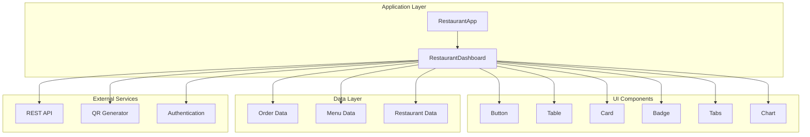

**Diagram sources**
- [restaurant-app.tsx](file://src/components/restaurant/restaurant-app.tsx#L1-L134)
- [restaurant-dashboard.tsx](file://src/components/restaurant/restaurant-dashboard.tsx#L1-L370)

**Section sources**
- [restaurant-app.tsx](file://src/components/restaurant/restaurant-app.tsx#L1-L134)
- [restaurant-dashboard.tsx](file://src/components/restaurant/restaurant-dashboard.tsx#L1-L370)

## Core Components

The Restaurant Dashboard is built using a collection of specialized UI components that provide consistent styling and behavior across the interface. These components are designed with accessibility in mind and follow established design patterns.

### Button Component System

The dashboard utilizes a sophisticated button variant system that provides consistent styling across different interaction states and contexts. The button component supports multiple variants including default, destructive, outline, secondary, ghost, and link styles.

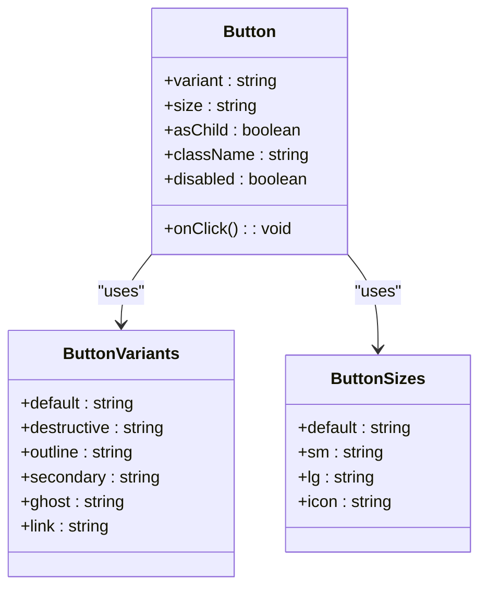

**Diagram sources**
- [button.tsx](file://src/components/ui/button.tsx#L1-L59)

### Card Component Architecture

The Card component provides a flexible container system that supports various content layouts and interaction patterns. Each card can contain headers, footers, titles, descriptions, and action buttons.

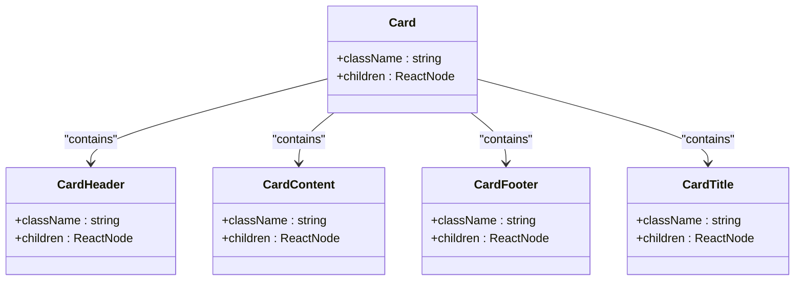

**Diagram sources**
- [card.tsx](file://src/components/ui/card.tsx#L1-L93)

### Badge Component System

The Badge component provides contextual status indicators with customizable variants and styling options. It supports various visual states and interaction patterns.

**Section sources**
- [button.tsx](file://src/components/ui/button.tsx#L1-L59)
- [card.tsx](file://src/components/ui/card.tsx#L1-L93)
- [badge.tsx](file://src/components/ui/badge.tsx#L1-L47)

## Dashboard Layout Structure

The Restaurant Dashboard employs a sophisticated layout structure that prioritizes information hierarchy and user workflow efficiency. The design follows a desktop-first approach with intelligent responsive adaptations.

### Header Structure

The dashboard header provides essential navigation and identification elements while maintaining visual consistency across the interface.

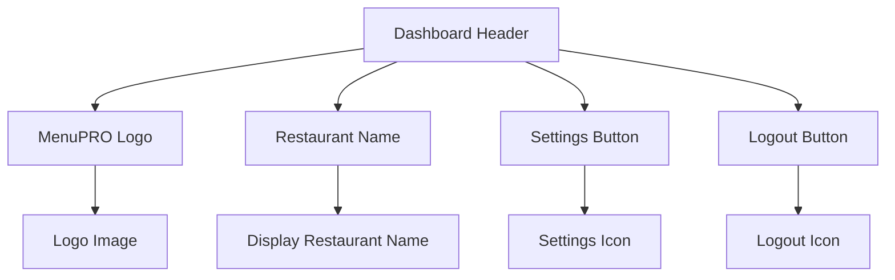

**Diagram sources**
- [restaurant-dashboard.tsx](file://src/components/restaurant/restaurant-dashboard.tsx#L100-L120)

### Grid-Based Statistics Layout

The statistics section utilizes a responsive grid system that adapts to different screen sizes while maintaining optimal information density.

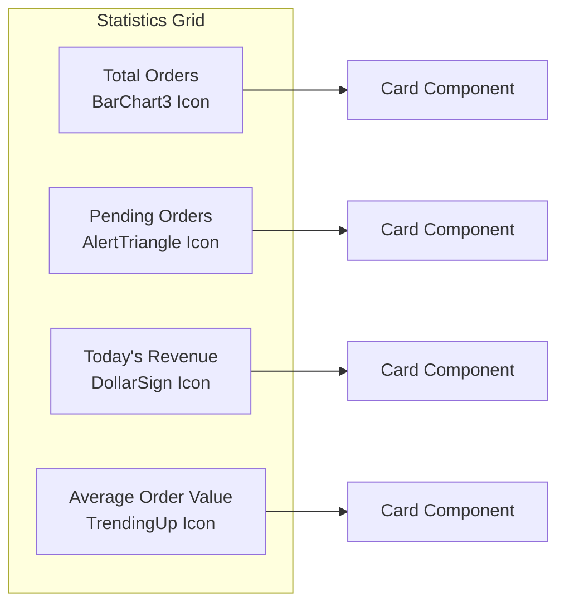

**Diagram sources**
- [restaurant-dashboard.tsx](file://src/components/restaurant/restaurant-dashboard.tsx#L130-L200)

**Section sources**
- [restaurant-dashboard.tsx](file://src/components/restaurant/restaurant-dashboard.tsx#L100-L200)

## Data Display Patterns

The dashboard implements sophisticated data display patterns using Radix UI components and custom styling to present complex information in an intuitive manner.

### Order Status Management

The order management system uses a comprehensive status tracking mechanism with visual indicators and actionable controls.

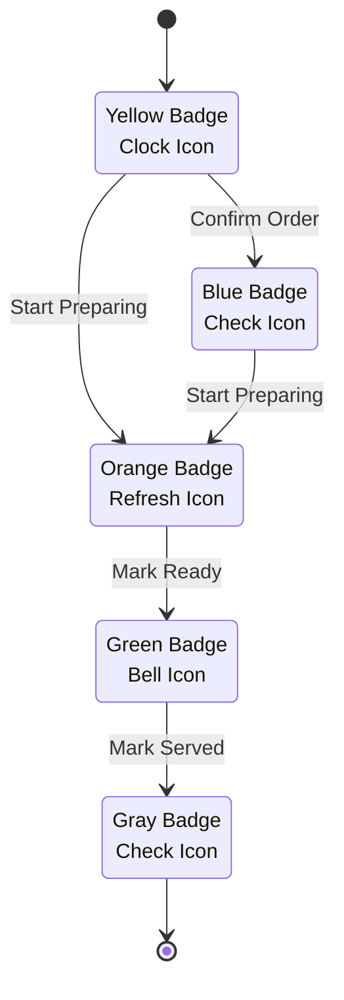

**Diagram sources**
- [restaurant-dashboard.tsx](file://src/components/restaurant/restaurant-dashboard.tsx#L60-L90)

### Table Data Presentation

The dashboard utilizes the custom Table component to present order data in a structured, accessible format with proper semantic markup.

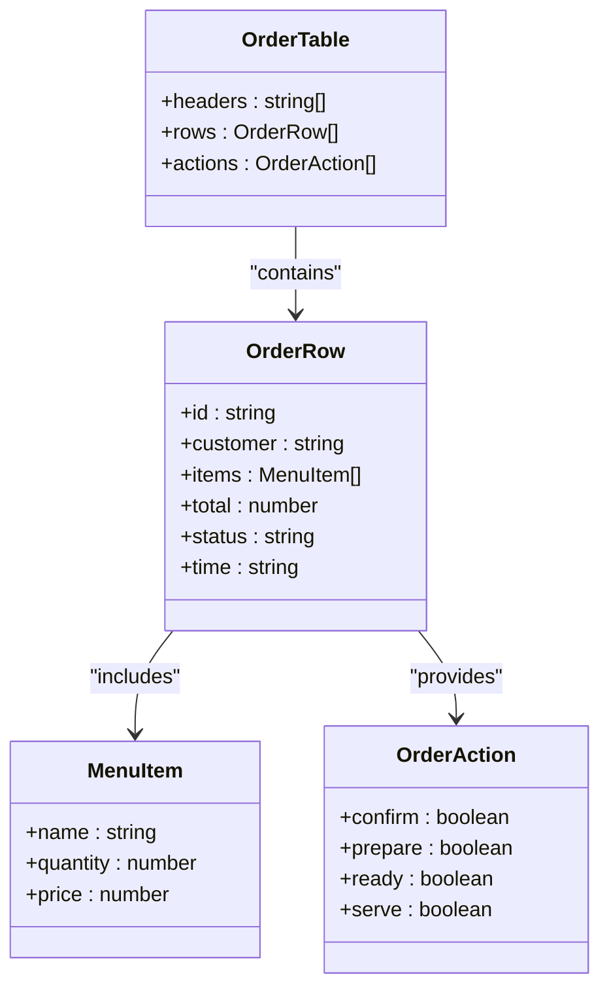

**Diagram sources**
- [table.tsx](file://src/components/ui/table.tsx#L1-L117)
- [restaurant-dashboard.tsx](file://src/components/restaurant/restaurant-dashboard.tsx#L200-L300)

**Section sources**
- [restaurant-dashboard.tsx](file://src/components/restaurant/restaurant-dashboard.tsx#L200-L300)
- [table.tsx](file://src/components/ui/table.tsx#L1-L117)

## QR Settings and Generation

The QR settings functionality provides comprehensive QR code generation and management capabilities for restaurant table integration. The system supports bulk generation, individual customization, and various export formats.

### QR Code Generation Process

The QR code generation follows a streamlined process that handles both individual and bulk generation scenarios.

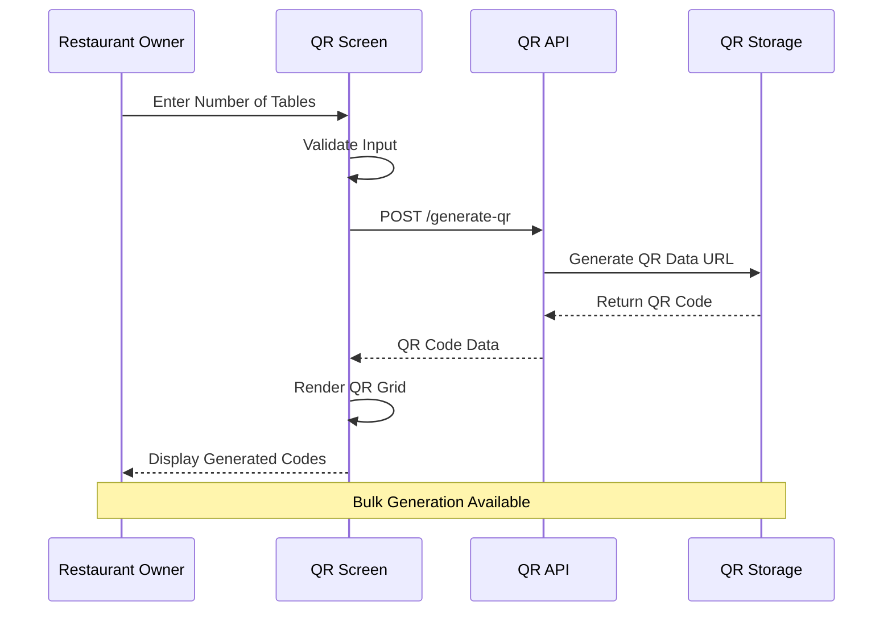

**Diagram sources**
- [table-qr-screen.tsx](file://src/components/restaurant/table-qr-screen.tsx#L45-L102)
- [generate-qr/route.ts](file://src/app/api/restaurant/generate-qr/route.ts#L1-L96)

### QR Code Management Features

The QR management system provides comprehensive tools for organizing, previewing, and exporting QR codes.

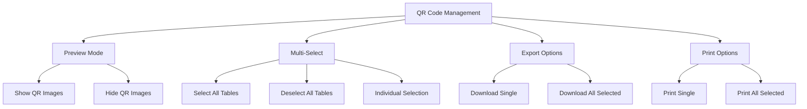

**Diagram sources**
- [table-qr-screen.tsx](file://src/components/restaurant/table-qr-screen.tsx#L310-L456)

**Section sources**
- [table-qr-screen.tsx](file://src/components/restaurant/table-qr-screen.tsx#L1-L515)
- [generate-qr/route.ts](file://src/app/api/restaurant/generate-qr/route.ts#L1-L96)

## Order Management System

The order management system provides real-time tracking and status updates for restaurant orders. The system supports manual order creation and automated order processing through the QR code system.

### Order Lifecycle Management

The order lifecycle follows a structured progression with appropriate visual feedback and user actions at each stage.

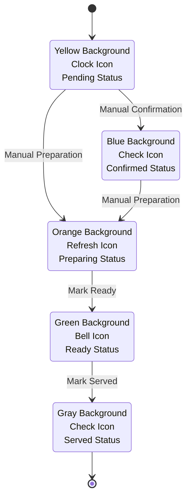

**Diagram sources**
- [restaurant-dashboard.tsx](file://src/components/restaurant/restaurant-dashboard.tsx#L60-L90)

### Order Status Controls

Each order displays appropriate action buttons based on its current status, enabling efficient order processing workflows.

**Section sources**
- [restaurant-dashboard.tsx](file://src/components/restaurant/restaurant-dashboard.tsx#L200-L350)

## Menu Management Features

The menu management system provides tools for adding, editing, and organizing menu items. While currently in development phase, the system includes comprehensive parsing capabilities for physical menus and PDF documents.

### Menu Upload and Parsing

The menu upload system supports multiple input methods with AI-powered parsing for automatic menu item extraction.

```mermaid
flowchart TD
UploadChoice[Upload Method Choice] --> PhysicalMenu[Physical Menu Photo]
UploadChoice --> PDFUpload[PDF Menu Upload]
PhysicalMenu --> CameraCapture[Camera Capture]
PhysicalMenu --> FileUpload[File Upload]
CameraCapture --> AIParsing[AI OCR Processing]
FileUpload --> AIParsing
PDFUpload --> TextParsing[Text Parsing]
AIParsing --> ConfidenceCheck{Confidence Check}
TextParsing --> ConfidenceCheck
ConfidenceCheck --> |High (>80%)| AutoAdd[Auto Add Item]
ConfidenceCheck --> |Medium (60-80%)| Review[Manual Review]
ConfidenceCheck --> |Low (<60%)| Reject[Reject Item]
AutoAdd --> MenuReview[Menu Review]
Review --> ManualAdd[Manual Add]
ManualAdd --> MenuReview
Reject --> Retry[Retry Upload]
MenuReview --> SaveMenu[Save Menu]
```

**Diagram sources**
- [menu-upload-screen.tsx](file://src/components/restaurant/menu-upload-screen.tsx#L1-L447)

**Section sources**
- [menu-upload-screen.tsx](file://src/components/restaurant/menu-upload-screen.tsx#L1-L447)

## Analytics and Statistics

The analytics section provides placeholder areas for future implementation of comprehensive restaurant performance metrics and reporting capabilities.

### Statistics Card Layout

The statistics cards present key performance indicators in a visually appealing and accessible format.

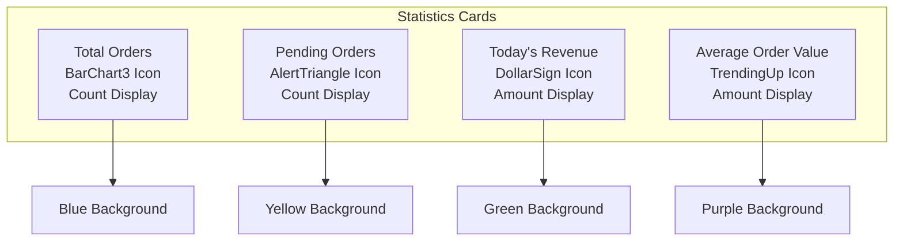

**Diagram sources**
- [restaurant-dashboard.tsx](file://src/components/restaurant/restaurant-dashboard.tsx#L130-L200)

**Section sources**
- [restaurant-dashboard.tsx](file://src/components/restaurant/restaurant-dashboard.tsx#L130-L200)

## Accessibility Features

The Restaurant Dashboard incorporates comprehensive accessibility features to ensure usability for all users, including those relying on assistive technologies.

### Keyboard Navigation Support

The dashboard provides full keyboard navigation support with proper focus management and logical tab ordering.

### ARIA Labels and Roles

Critical components utilize appropriate ARIA labels and roles to enhance screen reader compatibility and improve user experience for assistive technology users.

### Focus Management

The system implements proper focus management patterns that guide users through interactive elements in a logical sequence while maintaining context awareness.

**Section sources**
- [restaurant-dashboard.tsx](file://src/components/restaurant/restaurant-dashboard.tsx#L1-L370)
- [button.tsx](file://src/components/ui/button.tsx#L1-L59)

## Responsive Design Implementation

The dashboard follows a desktop-first responsive design approach with intelligent breakpoint management that ensures optimal user experience across all device sizes.

### Breakpoint Strategy

The responsive implementation uses Tailwind CSS utilities to create adaptive layouts that scale gracefully from desktop to mobile devices.

### Mobile Adaptations

While primarily designed for desktop use, the dashboard maintains functionality and readability on mobile devices through strategic layout adjustments and component scaling.

**Section sources**
- [layout.tsx](file://src/app/layout.tsx#L1-L70)

## State Management

The Restaurant Dashboard implements a centralized state management approach that synchronizes data between components and maintains consistency across the user interface.

### State Synchronization

The dashboard maintains synchronization between restaurant data, menu items, and order status through prop drilling and state propagation patterns.

### Local State Management

Components utilize React's useState hook for local state management while coordinating with parent components for global state coordination.

**Section sources**
- [restaurant-app.tsx](file://src/components/restaurant/restaurant-app.tsx#L1-L134)
- [restaurant-dashboard.tsx](file://src/components/restaurant/restaurant-dashboard.tsx#L1-L370)

## Navigation and Workflow

The dashboard integrates seamlessly with the broader MenuPRO application flow, providing clear navigation paths and logical progression through the restaurant setup and management workflow.

### Logout Functionality

The handleLogout function provides secure session termination and redirects users to the onboarding screen while clearing stored authentication data.

### Navigation Shortcuts

The system includes navigation shortcuts that allow users to quickly return to previous setup steps or access key administrative functions.

**Section sources**
- [restaurant-dashboard.tsx](file://src/components/restaurant/restaurant-dashboard.tsx#L1-L370)
- [restaurant-app.tsx](file://src/components/restaurant/restaurant-app.tsx#L1-L134)

## Future Integration Points

The Restaurant Dashboard includes several placeholder areas and integration points designed for future expansion and enhancement of functionality.

### Order Updates Integration

The system is designed to accommodate real-time order updates through WebSocket connections or polling mechanisms, though these are not yet implemented.

### Analytics Enhancement

Placeholder areas for analytics dashboards indicate planned integration with advanced reporting and business intelligence tools.

### Menu Management Expansion

The menu management system includes hooks for future integration with inventory management and pricing optimization tools.

**Section sources**
- [restaurant-dashboard.tsx](file://src/components/restaurant/restaurant-dashboard.tsx#L1-L370)

## Troubleshooting Guide

Common issues and their resolutions when working with the Restaurant Dashboard UI.

### QR Code Generation Issues

- **Problem**: QR codes fail to generate
- **Solution**: Verify API endpoint connectivity and check server-side QR code generation logs

### Order Status Updates

- **Problem**: Order status changes don't persist
- **Solution**: Ensure proper API integration and verify authentication tokens

### Menu Upload Failures

- **Problem**: Menu parsing fails or produces incorrect results
- **Solution**: Check image quality for physical menu uploads and verify PDF formatting for text parsing

**Section sources**
- [table-qr-screen.tsx](file://src/components/restaurant/table-qr-screen.tsx#L45-L102)
- [menu-upload-screen.tsx](file://src/components/restaurant/menu-upload-screen.tsx#L50-L100)

## Conclusion

The Restaurant Dashboard UI represents a comprehensive solution for restaurant operators seeking efficient digital menu management and order processing capabilities. Built with modern React patterns and accessibility standards, the dashboard provides a robust foundation for restaurant operations while maintaining flexibility for future enhancements.

The modular architecture, responsive design, and comprehensive feature set position the dashboard as a central hub for restaurant management tasks, from order tracking to menu maintenance and QR code generation. The integration with external APIs and planned analytics capabilities ensure scalability and extensibility for growing restaurant operations.