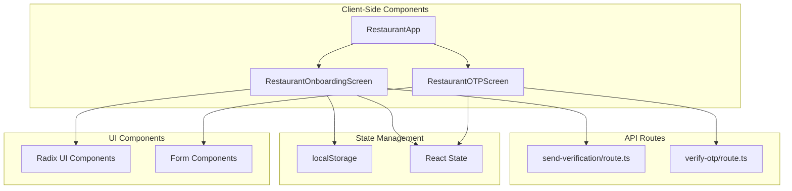
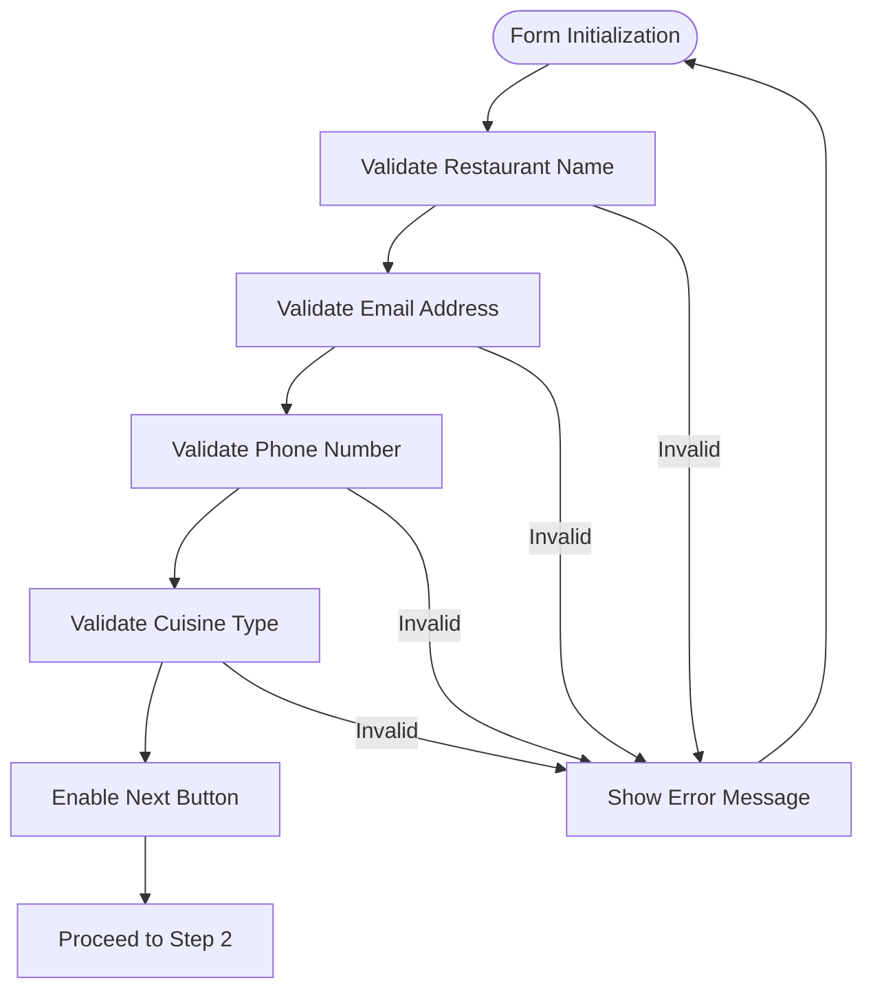
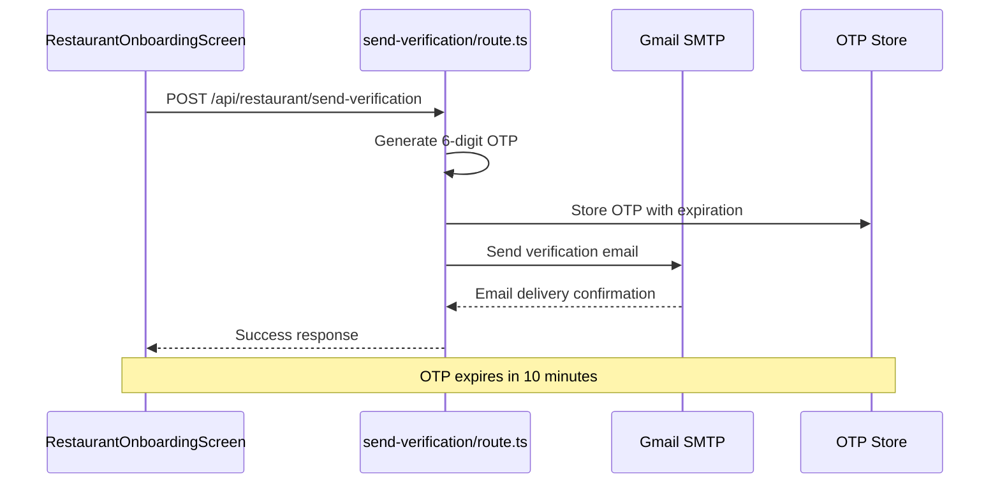
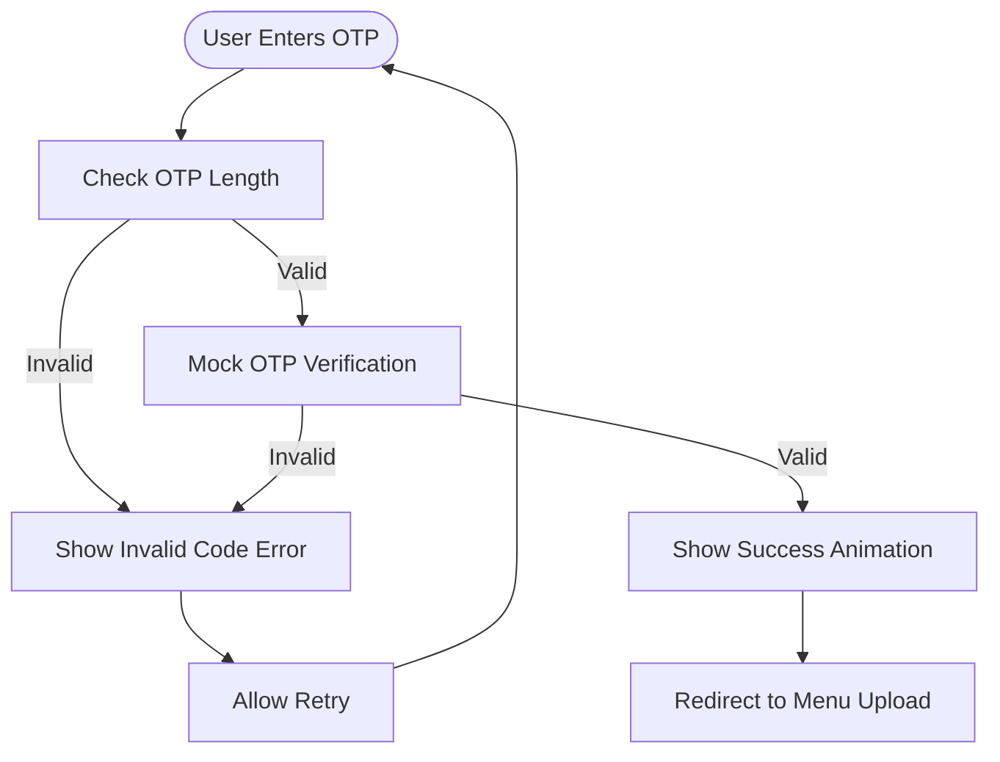
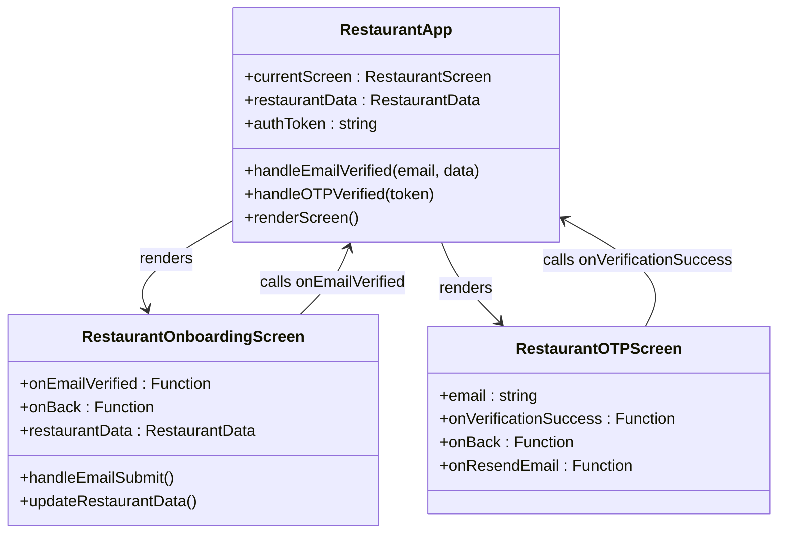

# Restaurant Onboarding Flow

<cite>
**Referenced Files in This Document**
- [restaurant-onboarding-screen.tsx](file://src/components/restaurant/restaurant-onboarding-screen.tsx)
- [restaurant-app.tsx](file://src/components/restaurant/restaurant-app.tsx)
- [restaurant-otp-screen.tsx](file://src/components/restaurant/restaurant-otp-screen.tsx)
- [send-verification/route.ts](file://src/app/api/restaurant/send-verification/route.ts)
- [verify-otp/route.ts](file://src/app/api/restaurant/verify-otp/route.ts)
- [form.tsx](file://src/components/ui/form.tsx)
- [restaurant-onboarding-screen.test.tsx](file://src/__tests__/restaurant/restaurant-onboarding-screen.test.tsx)
</cite>

## Table of Contents
1. [Introduction](#introduction)
2. [System Architecture](#system-architecture)
3. [Core Components](#core-components)
4. [State Management](#state-management)
5. [Form Structure and Validation](#form-structure-and-validation)
6. [Email Verification Process](#email-verification-process)
7. [OTP Verification Flow](#otp-verification-flow)
8. [Integration with Parent Container](#integration-with-parent-container)
9. [UX Considerations](#ux-considerations)
10. [Error Handling and Edge Cases](#error-handling-and-edge-cases)
11. [Testing Strategy](#testing-strategy)
12. [Conclusion](#conclusion)

## Introduction

The Restaurant Onboarding Flow in MenuPRO-App-main is a comprehensive multi-step process designed to guide new restaurant owners through the registration and verification process. This flow consists of three primary stages: collecting basic restaurant information, verifying the owner's email address, and completing the account setup through OTP verification.

The onboarding process is built using React with TypeScript, leveraging modern web development practices including state management, form validation, and responsive design principles. The system integrates seamlessly with Next.js API routes for backend operations while maintaining a smooth user experience through client-side state management and local storage persistence.

## System Architecture

The restaurant onboarding flow follows a component-based architecture with clear separation of concerns between presentation, state management, and business logic.



**Diagram sources**
- [restaurant-app.tsx](file://src/components/restaurant/restaurant-app.tsx#L75-L132)
- [restaurant-onboarding-screen.tsx](file://src/components/restaurant/restaurant-onboarding-screen.tsx#L1-L489)
- [restaurant-otp-screen.tsx](file://src/components/restaurant/restaurant-otp-screen.tsx#L1-L259)

## Core Components

### RestaurantOnboardingScreen Component

The `RestaurantOnboardingScreen` serves as the primary entry point for the onboarding process, managing the entire flow from initial restaurant information collection to email verification.

```typescript
interface RestaurantOnboardingScreenProps {
  onEmailVerified: (email: string, restaurantData: RestaurantData) => void;
  onBack: () => void;
}

interface RestaurantData {
  name: string;
  email: string;
  phone: string;
  address: string;
  city: string;
  state: string;
  zipCode: string;
  cuisine: string;
  description: string;
  operatingHours: {
    open: string;
    close: string;
  };
}
```

The component maintains internal state for:
- Current step in the onboarding process
- Loading states for API operations
- Error and success messaging
- Restaurant data collection
- Form validation status

**Section sources**
- [restaurant-onboarding-screen.tsx](file://src/components/restaurant/restaurant-onboarding-screen.tsx#L13-L489)

### RestaurantApp Container

The `RestaurantApp` component acts as the orchestrator, managing the overall state transitions between different onboarding screens and coordinating data flow between components.

```typescript
export type RestaurantScreen = 'onboarding' | 'otp-verification' | 'menu-upload' | 'table-qr' | 'dashboard';

const handleEmailVerified = (email: string, data: RestaurantData) => {
  setRestaurantData(data);
  setCurrentScreen('otp-verification');
};
```

**Section sources**
- [restaurant-app.tsx](file://src/components/restaurant/restaurant-app.tsx#L1-L134)

## State Management

The onboarding flow employs a combination of React state management and localStorage for persistent session data.

```mermaid
stateDiagram-v2
[*] --> onboarding
onboarding --> otp-verification : handleEmailVerified
otp-verification --> menu-upload : handleOTPVerified
menu-upload --> table-qr : handleMenuUploaded
table-qr --> dashboard : handleTableQRComplete
dashboard --> onboarding : handleLogout
note right of onboarding
Collects restaurant data
Validates form inputs
Stores pending email in localStorage
end note
note right of otp-verification
Receives email from parent
Handles OTP verification
Stores auth token in localStorage
end note
```

**Diagram sources**
- [restaurant-app.tsx](file://src/components/restaurant/restaurant-app.tsx#L43-L73)
- [restaurant-onboarding-screen.tsx](file://src/components/restaurant/restaurant-onboarding-screen.tsx#L75-L85)

### Local Storage Integration

The system uses localStorage for session persistence:

```typescript
// Store pending email during onboarding
localStorage.setItem('pendingRestaurantEmail', restaurantData.email);

// Store authentication token after successful verification
localStorage.setItem('restaurantAuthToken', token);
```

**Section sources**
- [restaurant-onboarding-screen.tsx](file://src/components/restaurant/restaurant-onboarding-screen.tsx#L80-L81)
- [restaurant-otp-screen.tsx](file://src/components/restaurant/restaurant-otp-screen.tsx#L120-L121)

## Form Structure and Validation

The onboarding form is structured into three distinct steps, each focusing on different aspects of restaurant information collection.

### Step 1: Basic Information Collection

The first step captures essential restaurant details including:



**Diagram sources**
- [restaurant-onboarding-screen.tsx](file://src/components/restaurant/restaurant-onboarding-screen.tsx#L208-L289)

### Step 2: Location and Operating Hours

The second step focuses on geographical and operational details:

```typescript
const updateOperatingHours = (field: 'open' | 'close', value: string) => {
  setRestaurantData(prev => ({
    ...prev,
    operatingHours: {
      ...prev.operatingHours,
      [field]: value
    }
  }));
};
```

### Step 3: Email Verification

The final step initiates the email verification process:

```typescript
const validateEmail = (email: string) => {
  const emailRegex = /^[^\s@]+@[^\s@]+\.[^\s@]+$/;
  return emailRegex.test(email);
};

const handleEmailSubmit = async (e: React.FormEvent) => {
  e.preventDefault();
  
  if (!restaurantData.email.trim()) {
    setError("Please enter your email address");
    return;
  }

  if (!validateEmail(restaurantData.email)) {
    setError("Please enter a valid email address");
    return;
  }

  // Mock email sending - just show success after a brief delay
  await new Promise(resolve => setTimeout(resolve, 1000));
  setSuccess(true);
  localStorage.setItem('pendingRestaurantEmail', restaurantData.email);
};
```

**Section sources**
- [restaurant-onboarding-screen.tsx](file://src/components/restaurant/restaurant-onboarding-screen.tsx#L55-L85)

## Email Verification Process

The email verification process is handled through a dedicated API route that manages OTP generation, storage, and delivery.



**Diagram sources**
- [send-verification/route.ts](file://src/app/api/restaurant/send-verification/route.ts#L1-L99)
- [restaurant-onboarding-screen.tsx](file://src/components/restaurant/restaurant-onboarding-screen.tsx#L60-L85)

### OTP Generation and Storage

The system generates cryptographically secure OTPs using Node.js crypto module:

```typescript
// Generate 6-digit OTP
const otp = crypto.randomInt(100000, 999999).toString();
const expires = Date.now() + 10 * 60 * 1000; // 10 minutes

// Store OTP
otpStore.set(email, { otp, expires });
```

### Email Template Structure

The verification email includes:

- Branding with MenuPRO logo
- Clear OTP display with expiration notice
- Welcome message and platform introduction
- Security disclaimer
- Automated message footer

**Section sources**
- [send-verification/route.ts](file://src/app/api/restaurant/send-verification/route.ts#L25-L99)

## OTP Verification Flow

The OTP verification process provides a secure method for confirming email ownership through a six-digit code entered by the user.



**Diagram sources**
- [restaurant-otp-screen.tsx](file://src/components/restaurant/restaurant-otp-screen.tsx#L85-L110)

### OTP Input Implementation

The OTP input component features advanced user experience enhancements:

```typescript
const handleOtpChange = (index: number, value: string) => {
  if (value.length > 1) return; // Prevent multiple characters
  
  const newOtp = [...otp];
  newOtp[index] = value;
  setOtp(newOtp);

  // Auto-focus next input
  if (value && index < 5) {
    inputRefs.current[index + 1]?.focus();
  }
};
```

### Advanced Input Features

- **Auto-focus**: Automatically advances to the next input field
- **Paste support**: Handles clipboard paste events with automatic digit extraction
- **Backspace navigation**: Allows backward navigation through inputs
- **Timer countdown**: Displays remaining time with security indication
- **Resend functionality**: Enables re-sending verification codes

**Section sources**
- [restaurant-otp-screen.tsx](file://src/components/restaurant/restaurant-otp-screen.tsx#L55-L85)

## Integration with Parent Container

The onboarding flow integrates seamlessly with the parent `RestaurantApp` container through well-defined prop interfaces and callback functions.



**Diagram sources**
- [restaurant-app.tsx](file://src/components/restaurant/restaurant-app.tsx#L75-L132)
- [restaurant-onboarding-screen.tsx](file://src/components/restaurant/restaurant-onboarding-screen.tsx#L13-L25)

### Callback Prop Patterns

The parent-child communication follows established patterns:

```typescript
// From RestaurantApp to RestaurantOnboardingScreen
<RestaurantOnboardingScreen 
  onEmailVerified={handleEmailVerified}
  onBack={handleBackToLanding}
/>

// From RestaurantOnboardingScreen to RestaurantApp
const handleEmailVerified = (email: string, data: RestaurantData) => {
  setRestaurantData(data);
  setCurrentScreen('otp-verification');
};
```

**Section sources**
- [restaurant-app.tsx](file://src/components/restaurant/restaurant-app.tsx#L75-L85)
- [restaurant-onboarding-screen.tsx](file://src/components/restaurant/restaurant-onboarding-screen.tsx#L75-L85)

## UX Considerations

### Responsive Design Implementation

The onboarding flow is designed to provide optimal user experience across all device sizes:

- **Desktop/Tablet Layout**: Uses a centered card-based layout with ample spacing
- **Mobile Optimization**: Implements responsive grid systems and touch-friendly input areas
- **Progress Indicators**: Provides clear visual feedback on completion status
- **Accessibility Compliance**: Integrates Radix UI components for WCAG 2.1 AA compliance

### Accessibility Features

The implementation incorporates comprehensive accessibility features:

```typescript
// Form accessibility attributes
<Input
  id="restaurantName"
  value={restaurantData.name}
  onChange={(e) => updateRestaurantData('name', e.target.value)}
  placeholder="Enter your restaurant name"
  className="mt-2"
  required
/>
```

### Visual Design Principles

- **Color Scheme**: Uses MenuPRO brand colors with orange accents for emphasis
- **Typography**: Implements readable font sizes with proper contrast ratios
- **Spacing**: Maintains adequate whitespace for improved readability
- **Feedback States**: Provides immediate visual feedback for user actions

**Section sources**
- [restaurant-onboarding-screen.tsx](file://src/components/restaurant/restaurant-onboarding-screen.tsx#L208-L489)

## Error Handling and Edge Cases

### Form Validation Strategies

The system implements comprehensive validation at multiple levels:

```typescript
// Client-side validation
const validateEmail = (email: string) => {
  const emailRegex = /^[^\s@]+@[^\s@]+\.[^\s@]+$/;
  return emailRegex.test(email);
};

// Form submission validation
if (!restaurantData.email.trim()) {
  setError("Please enter your email address");
  return;
}

if (!validateEmail(restaurantData.email)) {
  setError("Please enter a valid email address");
  return;
}
```

### Network Error Handling

Robust error handling ensures graceful degradation:

```typescript
try {
  // Mock email sending - just show success after a brief delay
  await new Promise(resolve => setTimeout(resolve, 1000));
  setSuccess(true);
  localStorage.setItem('pendingRestaurantEmail', restaurantData.email);
} catch (error) {
  setError("Network error. Please try again.");
} finally {
  setIsLoading(false);
}
```

### OTP Verification Error Management

The OTP verification process handles various failure scenarios:

- **Expired OTPs**: Automatic cleanup and user notification
- **Invalid Codes**: Specific error messages with retry options
- **Network Failures**: Graceful fallback with retry mechanisms
- **Security Violations**: Immediate blocking with appropriate messaging

**Section sources**
- [restaurant-onboarding-screen.tsx](file://src/components/restaurant/restaurant-onboarding-screen.tsx#L55-L85)
- [restaurant-otp-screen.tsx](file://src/components/restaurant/restaurant-otp-screen.tsx#L85-L110)

## Testing Strategy

The onboarding flow includes comprehensive testing coverage across multiple levels:

### Unit Testing Approach

```typescript
it('handles restaurant form submission', async () => {
  const user = userEvent.setup()
  render(<RestaurantOnboardingScreen />)
  
  // Fill out the form
  await user.type(screen.getByLabelText(/Restaurant name/i), 'Test Restaurant')
  await user.type(screen.getByLabelText(/Address/i), '123 Main St')
  await user.type(screen.getByLabelText(/Phone number/i), '555-1234')
  await user.type(screen.getByLabelText(/Email address/i), 'test@restaurant.com')
  await user.type(screen.getByLabelText(/Cuisine type/i), 'Italian')
  
  // Submit the form
  const submitButton = screen.getByRole('button', { name: /Continue/i })
  await user.click(submitButton)
  
  expect(mockOnRestaurantSubmit).toHaveBeenCalledWith({
    name: 'Test Restaurant',
    address: '123 Main St',
    phone: '555-1234',
    email: 'test@restaurant.com',
    cuisine: 'Italian'
  })
});
```

### Integration Testing

The system includes integration tests that verify complete user journeys:

```typescript
it('renders the complete restaurant flow', () => {
  render(<RestaurantApp />)
  
  expect(screen.getByTestId('restaurant-app')).toBeInTheDocument()
  expect(screen.getByRole('button', { name: /Submit Restaurant/i })).toBeInTheDocument()
  expect(screen.getByRole('button', { name: /Submit Email/i })).toBeInTheDocument()
  expect(screen.getByRole('button', { name: /Back/i })).toBeInTheDocument()
});
```

**Section sources**
- [restaurant-onboarding-screen.test.tsx](file://src/__tests__/restaurant/restaurant-onboarding-screen.test.tsx#L70-L98)
- [restaurant-flow.test.tsx](file://src/__tests__/integration/restaurant-flow.test.tsx#L25-L38)

## Conclusion

The Restaurant Onboarding Flow in MenuPRO-App-main represents a sophisticated implementation of modern web application design principles. The system successfully combines intuitive user experience with robust technical architecture, providing restaurant owners with a seamless registration process.

Key strengths of the implementation include:

- **Modular Architecture**: Clear separation of concerns with well-defined component boundaries
- **State Management**: Effective use of React state and localStorage for session persistence
- **Validation Strategy**: Comprehensive form validation with immediate user feedback
- **Error Handling**: Robust error management with graceful degradation
- **Testing Coverage**: Extensive unit and integration testing
- **Accessibility**: WCAG-compliant design with Radix UI components
- **Responsive Design**: Optimized for all device sizes and orientations

The flow demonstrates best practices in modern React development while maintaining high standards for usability, security, and maintainability. The modular design allows for easy extension and modification, making it suitable for future enhancements and feature additions.

Future improvements could include enhanced analytics tracking, additional validation rules, and expanded internationalization support. However, the current implementation provides a solid foundation for restaurant onboarding with room for growth and adaptation to evolving requirements.