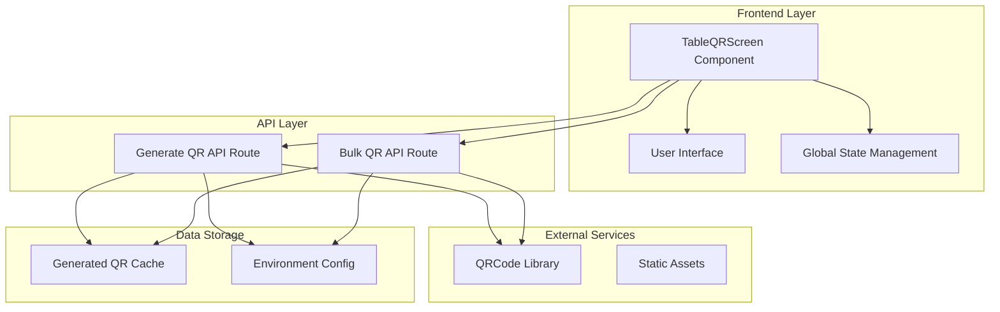
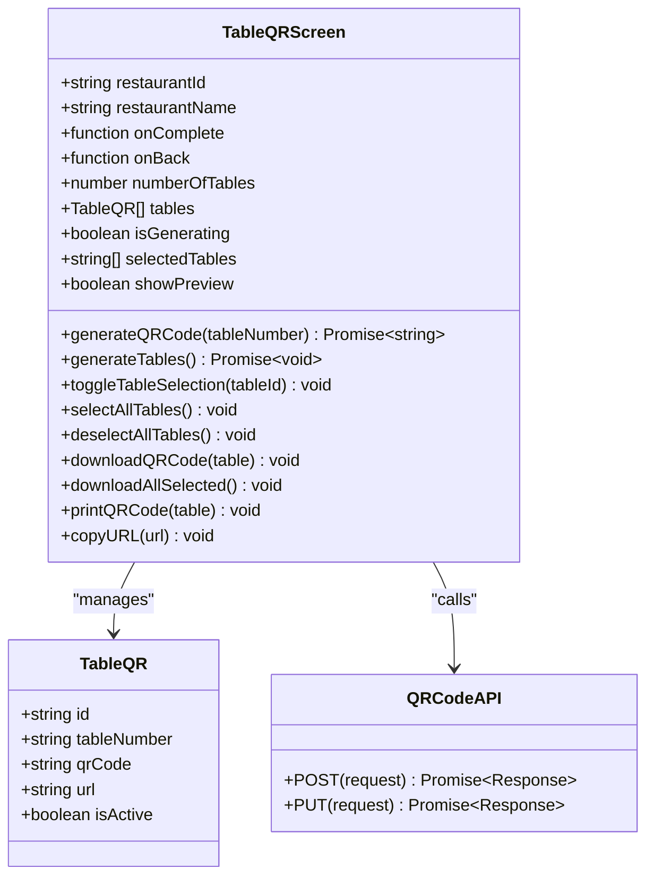
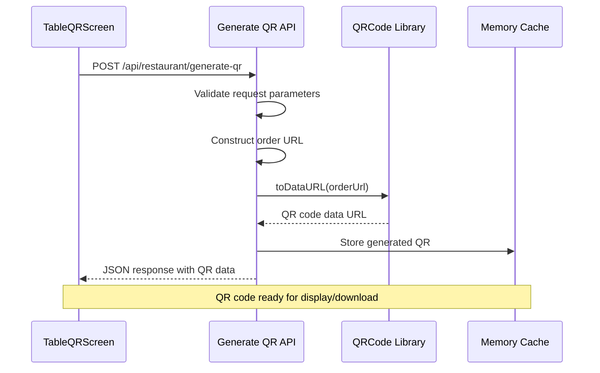
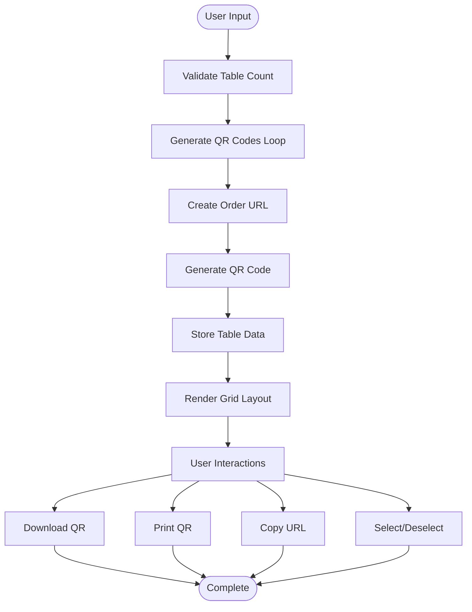
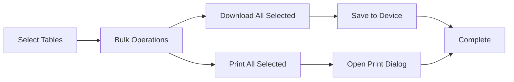

# Table QR Code Generation

<cite>
**Referenced Files in This Document**
- [table-qr-screen.tsx](file://src/components/restaurant/table-qr-screen.tsx)
- [generate-qr/route.ts](file://src/app/api/restaurant/generate-qr/route.ts)
- [restaurant-app.tsx](file://src/components/restaurant/restaurant-app.tsx)
- [restaurant-dashboard.tsx](file://src/components/restaurant/restaurant-dashboard.tsx)
- [print.css](file://src/styles/print.css)
- [package.json](file://package.json)
</cite>

## Table of Contents
1. [Introduction](#introduction)
2. [System Architecture](#system-architecture)
3. [Core Components](#core-components)
4. [API Integration](#api-integration)
5. [UI Implementation](#ui-implementation)
6. [QR Code Generation Process](#qr-code-generation-process)
7. [Batch Operations](#batch-operations)
8. [Printing and Download Options](#printing-and-download-options)
9. [Scalability Features](#scalability-features)
10. [Customization Options](#customization-options)
11. [Performance Considerations](#performance-considerations)
12. [Troubleshooting Guide](#troubleshooting-guide)
13. [Conclusion](#conclusion)

## Introduction

The Table QR Code Generation feature is a critical component of the MenuPRO application that enables restaurant owners to create scannable QR codes for customer ordering. This feature seamlessly integrates with the restaurant onboarding flow, allowing restaurants to quickly set up digital ordering capabilities for their establishments.

The system generates QR codes dynamically based on restaurant ID and table numbers, creating deep links to the restaurant's menu interface. These QR codes enable customers to scan and immediately access the restaurant's menu, place orders, and complete transactions directly from their mobile devices.

## System Architecture

The Table QR Code Generation system follows a modular architecture with clear separation of concerns between the frontend UI component and backend API service.



**Diagram sources**
- [table-qr-screen.tsx](file://src/components/restaurant/table-qr-screen.tsx#L1-L515)
- [generate-qr/route.ts](file://src/app/api/restaurant/generate-qr/route.ts#L1-L98)

## Core Components

### TableQRScreen Component

The `TableQRScreen` component serves as the primary interface for QR code generation and management. It implements a comprehensive workflow that handles table count input, QR code generation, bulk operations, and user interactions.



**Diagram sources**
- [table-qr-screen.tsx](file://src/components/restaurant/table-qr-screen.tsx#L18-L30)
- [generate-qr/route.ts](file://src/app/api/restaurant/generate-qr/route.ts#L4-L98)

**Section sources**
- [table-qr-screen.tsx](file://src/components/restaurant/table-qr-screen.tsx#L1-L515)

### Global State Integration

The component integrates with the global state management system through callback functions that control navigation flow:

- `onComplete()` - Advances to the dashboard screen after QR code generation
- `onBack()` - Returns to the previous screen (menu upload)
- `restaurantId` - Unique identifier for the restaurant account
- `restaurantName` - Display name for user interface context

## API Integration

### QR Code Generation Endpoint

The `/api/restaurant/generate-qr` endpoint handles individual QR code generation requests. It accepts restaurant ID and table number parameters and returns a base64-encoded QR code data URL.



**Diagram sources**
- [table-qr-screen.tsx](file://src/components/restaurant/table-qr-screen.tsx#L45-L65)
- [generate-qr/route.ts](file://src/app/api/restaurant/generate-qr/route.ts#L4-L35)

### Bulk QR Generation

The system also supports bulk QR generation through a PUT endpoint that creates QR codes for multiple tables simultaneously:

```typescript
// Example bulk generation request
{
  restaurantId: "rest_123",
  numberOfTables: 25
}
```

**Section sources**
- [generate-qr/route.ts](file://src/app/api/restaurant/generate-qr/route.ts#L37-L98)

## UI Implementation

### Responsive Grid Layout

The UI implements a responsive grid system that adapts to different screen sizes, displaying QR codes in a flexible grid arrangement:



**Diagram sources**
- [table-qr-screen.tsx](file://src/components/restaurant/table-qr-screen.tsx#L67-L85)

### Interactive Features

The component provides several interactive features for managing QR codes:

- **Table Selection**: Individual and bulk selection of QR codes
- **Preview Mode**: Toggle QR code preview visibility
- **Download Options**: PNG format downloads with automatic naming
- **Print Functionality**: Custom print layouts with branding
- **URL Sharing**: Copy URLs to clipboard for external use

**Section sources**
- [table-qr-screen.tsx](file://src/components/restaurant/table-qr-screen.tsx#L310-L456)

## QR Code Generation Process

### Dynamic URL Composition

Each QR code contains a dynamically composed URL that includes restaurant and table identifiers:

```typescript
const orderUrl = `${baseUrl}/order?restaurant=${restaurantId}&table=${tableNumber}`;
```

The URL structure enables:
- **Deep Linking**: Direct navigation to specific restaurant and table
- **Parameter Persistence**: Maintains context across sessions
- **Scalability**: Supports unlimited table configurations

### QR Code Specifications

The system uses the qrcode library with specific configuration parameters:

```typescript
const qrCodeDataURL = await QRCode.toDataURL(orderUrl, {
  width: 200,
  margin: 2,
  color: {
    dark: '#000000',
    light: '#FFFFFF'
  }
});
```

Key specifications:
- **Size**: 200x200 pixels for optimal scanning
- **Margin**: 2 units for readability
- **Colors**: Black foreground, white background
- **Format**: Base64 data URL for immediate display

**Section sources**
- [generate-qr/route.ts](file://src/app/api/restaurant/generate-qr/route.ts#L18-L30)

## Batch Operations

### Bulk Download and Print

The system supports efficient bulk operations for managing multiple QR codes:



**Diagram sources**
- [table-qr-screen.tsx](file://src/components/restaurant/table-qr-screen.tsx#L418-L456)

### Selection Management

The component maintains selection state through a reactive array:

```typescript
const [selectedTables, setSelectedTables] = useState<string[]>([]);
```

Features:
- **Select All**: Quick selection of all generated QR codes
- **Deselect All**: Clear all selections
- **Individual Selection**: Toggle selection for specific tables
- **Visual Feedback**: Highlighted borders for selected items

**Section sources**
- [table-qr-screen.tsx](file://src/components/restaurant/table-qr-screen.tsx#L87-L102)

## Printing and Download Options

### Print Layout Design

The system implements sophisticated print layouts with restaurant branding and instructions:

```css
.qr-container {
  border: 3px solid #ea580c;
  border-radius: 15px;
  padding: 30px;
  margin: 20px;
  max-width: 400px;
  background: white;
  box-shadow: 0 4px 6px rgba(0, 0, 0, 0.1);
}
```

Print features:
- **Branded Container**: Orange border with logo
- **Instructional Text**: Step-by-step guidance
- **Responsive Design**: Adapts to different paper sizes
- **Page Breaks**: Automatic page separation for multiple QR codes

### Download Formats

The system supports multiple download formats:

- **PNG Format**: High-quality raster images suitable for printing
- **Automatic Naming**: `MenuPRO-Table-{number}-QR.png` convention
- **Batch Downloads**: Sequential downloads with delays to prevent browser throttling

**Section sources**
- [table-qr-screen.tsx](file://src/components/restaurant/table-qr-screen.tsx#L124-L244)
- [print.css](file://src/styles/print.css#L1-L104)

## Scalability Features

### Multi-Table Support

The system is designed to handle restaurants of various sizes:

- **Configurable Limits**: Maximum 100 tables per generation session
- **Dynamic Generation**: Creates QR codes on-demand based on user input
- **Memory Efficiency**: Generates QR codes sequentially to prevent memory overflow
- **Error Handling**: Graceful degradation when QR code generation fails

### Performance Optimization

Several optimization strategies are implemented:

```typescript
// Sequential generation with delays
for (let i = 1; i <= numberOfTables; i++) {
  const qrCode = await generateQRCode(i.toString());
  // Process QR code...
}
```

Benefits:
- **Resource Management**: Prevents excessive API calls
- **User Experience**: Provides loading feedback
- **Error Isolation**: Fails gracefully for individual tables
- **Progress Tracking**: Real-time updates during generation

**Section sources**
- [table-qr-screen.tsx](file://src/components/restaurant/table-qr-screen.tsx#L67-L85)

## Customization Options

### Branding Integration

The system incorporates restaurant branding through:

- **Logo Placement**: MenuPRO logo in QR code containers
- **Color Schemes**: Consistent orange branding theme
- **Typography**: Professional font choices
- **Layout Flexibility**: Adaptable container sizes

### Size and Format Options

Customization capabilities include:

- **QR Code Size**: Configurable dimensions (currently 200x200 pixels)
- **Margin Settings**: Adjustable spacing around QR codes
- **Color Themes**: Customizable color schemes
- **Print Layouts**: Flexible container designs

**Section sources**
- [table-qr-screen.tsx](file://src/components/restaurant/table-qr-screen.tsx#L124-L244)

## Performance Considerations

### Caching Strategies

While the current implementation doesn't include explicit caching, the system is designed to support future caching enhancements:

- **Memory Caching**: Store generated QR codes in memory
- **CDN Distribution**: Serve QR codes from content delivery networks
- **Browser Storage**: Utilize local storage for frequently accessed codes
- **API Optimization**: Implement rate limiting and request batching

### Resource Management

The system implements several resource management techniques:

- **Concurrent Limiting**: Controls simultaneous API requests
- **Memory Monitoring**: Tracks memory usage during bulk operations
- **Error Recovery**: Implements retry mechanisms for failed requests
- **Graceful Degradation**: Continues operation when individual QR codes fail

## Troubleshooting Guide

### Common Issues and Solutions

**QR Code Generation Failures**
- Verify network connectivity
- Check API endpoint availability
- Validate restaurant ID format
- Review server logs for detailed errors

**Print Layout Problems**
- Ensure adequate paper margins
- Check printer driver compatibility
- Verify CSS media queries
- Test with different browsers

**Download Issues**
- Confirm file permissions
- Check browser download settings
- Verify file size limitations
- Test with different file formats

### Debugging Tools

The component includes built-in debugging capabilities:

```typescript
console.error('Error generating QR code:', error);
```

Debug features:
- **Console Logging**: Detailed error messages
- **State Inspection**: Current component state
- **Network Monitoring**: API request/response tracking
- **Performance Metrics**: Generation timing information

**Section sources**
- [table-qr-screen.tsx](file://src/components/restaurant/table-qr-screen.tsx#L55-L65)

## Conclusion

The Table QR Code Generation feature represents a sophisticated solution for enabling digital ordering in restaurants. Through its modular architecture, comprehensive UI, and robust API integration, it provides restaurant owners with an efficient way to implement contactless ordering systems.

Key strengths of the implementation include:

- **Seamless Integration**: Smooth progression through the restaurant onboarding flow
- **User-Friendly Interface**: Intuitive controls for QR code management
- **Scalable Architecture**: Support for restaurants of varying sizes
- **Flexible Output Options**: Multiple formats and customization possibilities
- **Performance Optimization**: Efficient resource utilization and error handling

The system's design allows for future enhancements such as advanced caching strategies, additional customization options, and expanded integration capabilities with third-party ordering platforms.