# Menu Upload and Processing System

<cite>
**Referenced Files in This Document**
- [menu-upload-screen.tsx](file://src/components/restaurant/menu-upload-screen.tsx)
- [parse-menu/route.ts](file://src/app/api/restaurant/parse-menu/route.ts)
- [restaurant-app.tsx](file://src/components/restaurant/restaurant-app.tsx)
- [menu-screen.tsx](file://src/components/pwa/menu-screen.tsx)
- [menu-upload-screen.test.tsx](file://src/__tests__/restaurant/menu-upload-screen.test.tsx)
- [package.json](file://package.json)
- [README.md](file://README.md)
</cite>

## Table of Contents
1. [Introduction](#introduction)
2. [System Architecture](#system-architecture)
3. [Menu Upload Screen Implementation](#menu-upload-screen-implementation)
4. [Backend Processing Pipeline](#backend-processing-pipeline)
5. [OCR and Text Processing](#ocr-and-text-processing)
6. [Menu Item Parsing Logic](#menu-item-parsing-logic)
7. [Client-Side Validation and Feedback](#client-side-validation-and-feedback)
8. [Integration Testing](#integration-testing)
9. [Performance Considerations](#performance-considerations)
10. [Best Practices and Recommendations](#best-practices-and-recommendations)
11. [Troubleshooting Guide](#troubleshooting-guide)
12. [Conclusion](#conclusion)

## Introduction

The Menu Upload and Processing system is a sophisticated feature within the MenuPRO application that enables restaurants to digitize their menus through automated extraction of menu items from PDF documents or physical menu photos. This system combines advanced Optical Character Recognition (OCR) technology with intelligent text parsing to transform unstructured menu data into structured MenuItem objects that power the restaurant's digital menu interface.

The system supports two primary upload methods:
- **Physical Menu Photos**: Using AI-powered OCR to extract menu items from captured images
- **PDF Documents**: Leveraging text parsing capabilities to extract menu information from PDF files

Both methods utilize confidence scoring to assess the accuracy of extracted data and provide users with the ability to review, edit, and confirm menu items before finalizing their digital menu.

## System Architecture

The menu upload system follows a client-server architecture with clear separation of concerns between the frontend user interface and backend processing logic.


**Diagram sources**
- [menu-upload-screen.tsx](file://src/components/restaurant/menu-upload-screen.tsx#L1-L447)
- [parse-menu/route.ts](file://src/app/api/restaurant/parse-menu/route.ts#L1-L152)

**Section sources**
- [menu-upload-screen.tsx](file://src/components/restaurant/menu-upload-screen.tsx#L1-L50)
- [parse-menu/route.ts](file://src/app/api/restaurant/parse-menu/route.ts#L1-L30)

## Menu Upload Screen Implementation

The Menu Upload Screen serves as the primary interface for restaurants to upload and process their menu data. Built with React and TypeScript, it provides an intuitive user experience with comprehensive validation and feedback mechanisms.

### Component Structure and State Management

The component utilizes React hooks for state management, tracking upload progress, parsed items, and user interactions:

```typescript
interface MenuItem {
  id: string;
  name: string;
  description: string;
  price: number;
  category: string;
  image?: string;
  isAvailable: boolean;
}

interface ParsedMenuItem {
  name: string;
  price: number;
  description?: string;
  category?: string;
  confidence: number;
}
```

### Upload Method Selection

The screen presents two distinct upload methods through interactive cards:


**Diagram sources**
- [menu-upload-screen.tsx](file://src/components/restaurant/menu-upload-screen.tsx#L203-L280)

### Drag-and-Drop and File Selection Interface

The system provides multiple file input methods with appropriate validation:

- **Image Upload**: Accepts `.jpeg`, `.png`, `.gif` formats with camera capture support
- **PDF Upload**: Restricts to `.pdf` format with size limitations
- **Drag-and-Drop**: Integrated file drop zones with visual feedback

### Progress Feedback and User Experience

The interface implements comprehensive progress tracking with realistic simulation:

```typescript
const handleFileUpload = async (file: File, method: 'physical' | 'pdf') => {
  setIsUploading(true);
  setUploadProgress(0);
  setError("");

  try {
    const formData = new FormData();
    formData.append('file', file);
    formData.append('method', method);

    // Simulate upload progress
    const progressInterval = setInterval(() => {
      setUploadProgress(prev => {
        if (prev >= 90) {
          clearInterval(progressInterval);
          return 90;
        }
        return prev + 10;
      });
    }, 200);

    const response = await fetch('/api/restaurant/parse-menu', {
      method: 'POST',
      body: formData,
    });

    // Handle response...
  } catch (error) {
    setError('Network error. Please try again.');
  } finally {
    setIsUploading(false);
  }
};
```

**Section sources**
- [menu-upload-screen.tsx](file://src/components/restaurant/menu-upload-screen.tsx#L45-L85)
- [menu-upload-screen.tsx](file://src/components/restaurant/menu-upload-screen.tsx#L203-L280)

## Backend Processing Pipeline

The backend processing pipeline handles the heavy lifting of menu item extraction through the `/api/restaurant/parse-menu` endpoint. This system integrates multiple technologies to achieve robust menu parsing capabilities.

### API Endpoint Architecture

The API endpoint processes multipart form data containing both the uploaded file and processing method:

```typescript
export async function POST(request: NextRequest) {
  try {
    const formData = await request.formData();
    const file = formData.get('file') as File;
    const method = formData.get('method') as string;

    if (!file) {
      return NextResponse.json(
        { message: 'No file provided' },
        { status: 400 }
      );
    }

    let extractedText = '';
    let items: any[] = [];

    if (method === 'pdf') {
      // Parse PDF
      const buffer = await file.arrayBuffer();
      const pdfParse = (await import('pdf-parse')).default;
      const pdfData = await pdfParse(Buffer.from(buffer));
      extractedText = pdfData.text;
    } else if (method === 'physical') {
      // OCR for images
      const worker = await createWorker('eng');
      const buffer = await file.arrayBuffer();
      const { data: { text } } = await worker.recognize(Buffer.from(buffer));
      extractedText = text;
      await worker.terminate();
    }

    // Parse menu items from extracted text
    items = parseMenuItems(extractedText);

    return NextResponse.json({
      success: true,
      items,
      extractedText: extractedText.substring(0, 500) + '...' // Truncate for response
    });

  } catch (error) {
    console.error('Menu parsing error:', error);
    return NextResponse.json(
      { message: 'Failed to parse menu' },
      { status: 500 }
    );
  }
}
```

### Technology Stack Integration

The backend leverages specialized libraries for different processing needs:

- **Tesseract.js**: OCR engine for image processing
- **pdf-parse**: PDF text extraction library
- **Lucene.js**: Text processing and pattern matching


**Diagram sources**
- [parse-menu/route.ts](file://src/app/api/restaurant/parse-menu/route.ts#L5-L45)

**Section sources**
- [parse-menu/route.ts](file://src/app/api/restaurant/parse-menu/route.ts#L1-L50)

## OCR and Text Processing

The Optical Character Recognition (OCR) component handles the conversion of visual menu data into machine-readable text. This system uses Tesseract.js with English language training data to achieve reliable text extraction from various image formats.

### OCR Processing Workflow

The OCR system implements a worker-based architecture for efficient text recognition:

```typescript
// OCR for images
const worker = await createWorker('eng');

const buffer = await file.arrayBuffer();
const { data: { text } } = await worker.recognize(Buffer.from(buffer));
extractedText = text;

await worker.terminate(); // Clean up resources
```

### Image Preprocessing and Quality Enhancement

The system optimizes image quality for better OCR accuracy:

- **Resolution Scaling**: Automatic scaling for optimal OCR performance
- **Noise Reduction**: Built-in noise filtering for clearer text extraction
- **Format Support**: Comprehensive support for common image formats (.jpg, .png, .gif)

### Confidence Scoring Mechanism

The OCR system provides confidence scores for extracted text, enabling intelligent fallback strategies:

```mermaid
flowchart TD
ImageInput[Raw Image Input] --> QualityCheck{Quality Assessment}
QualityCheck --> |Good Quality| StandardOCR[Standard OCR Processing]
QualityCheck --> |Poor Quality| Enhancement[Image Enhancement]
Enhancement --> EnhancedOCR[Enhanced OCR Processing]
StandardOCR --> ConfidenceCalc[Calculate Confidence]
EnhancedOCR --> ConfidenceCalc
ConfidenceCalc --> ThresholdCheck{Confidence ≥ 0.7?}
ThresholdCheck --> |Yes| AcceptResult[Accept Result]
ThresholdCheck --> |No| ManualReview[Manual Review Required]
AcceptResult --> OutputText[Output Clean Text]
ManualReview --> HumanIntervention[Human Intervention]
```



**Diagram sources**
- [parse-menu/route.ts](file://src/app/api/restaurant/parse-menu/route.ts#L25-L35)

**Section sources**
- [parse-menu/route.ts](file://src/app/api/restaurant/parse-menu/route.ts#L20-L40)

## Menu Item Parsing Logic

The menu item parsing logic transforms extracted text into structured MenuItem objects with comprehensive validation and categorization.

### Text Pattern Recognition

The system employs sophisticated pattern matching to identify menu items:

```typescript
// Common price patterns
const pricePatterns = [
  /\$(\d+\.?\d*)/g,
  /(\d+\.?\d*)\s*dollars?/gi,
  /(\d+\.?\d*)\s*USD/gi
];

// Common food categories
const categories = [
  'appetizers', 'starters', 'soups', 'salads',
  'mains', 'entrees', 'pasta', 'pizza', 'burgers',
  'desserts', 'beverages', 'drinks', 'wine', 'beer'
];
```

### Intelligent Item Extraction Algorithm

The parsing algorithm implements a multi-stage extraction process:


**Diagram sources**
- [parse-menu/route.ts](file://src/app/api/restaurant/parse-menu/route.ts#L47-L120)

### Confidence Calculation and Scoring

The system calculates confidence scores based on multiple factors:

```typescript
// Calculate confidence based on various factors
let confidence = 0.5; // Base confidence

if (itemName.length > 5) confidence += 0.1;
if (price > 5 && price < 100) confidence += 0.2;
if (description.length > 0) confidence += 0.1;
if (itemName.toLowerCase().includes('pizza') || 
    itemName.toLowerCase().includes('pasta') ||
    itemName.toLowerCase().includes('salad') ||
    itemName.toLowerCase().includes('burger')) {
  confidence += 0.2;
}

confidence = Math.min(confidence, 0.95); // Cap at 95%
```

### Duplicate Detection and Filtering

The system implements intelligent duplicate detection:

```typescript
// Remove duplicates and sort by confidence
const uniqueItems = items.filter((item, index, self) => 
  index === self.findIndex(t => t.name.toLowerCase() === item.name.toLowerCase())
);

return uniqueItems.sort((a, b) => b.confidence - a.confidence);
```

**Section sources**
- [parse-menu/route.ts](file://src/app/api/restaurant/parse-menu/route.ts#L47-L152)

## Client-Side Validation and Feedback

The client-side validation system ensures data integrity and provides comprehensive user feedback throughout the menu upload process.

### File Type and Size Validation

The system implements strict validation for uploaded files:

```typescript
// Physical menu validation
<input
  ref={fileInputRef}
  type="file"
  accept="image/*"
  onChange={handlePhysicalMenuUpload}
  className="hidden"
/>

// PDF validation
<input
  ref={fileInputRef}
  type="file"
  accept=".pdf"
  onChange={handlePDFUpload}
  className="hidden"
/>
```

### Realistic Progress Simulation

The upload progress is simulated to provide immediate feedback:

```typescript
// Simulate upload progress
const progressInterval = setInterval(() => {
  setUploadProgress(prev => {
    if (prev >= 90) {
      clearInterval(progressInterval);
      return 90;
    }
    return prev + 10;
  });
}, 200);
```

### Error Handling and User Guidance

The system provides comprehensive error handling with user-friendly messages:


**Diagram sources**
- [menu-upload-screen.tsx](file://src/components/restaurant/menu-upload-screen.tsx#L45-L85)

### Confidence-Based Item Display

Menu items are displayed with confidence indicators:

```typescript
const getConfidenceColor = (confidence: number) => {
  if (confidence >= 0.8) return 'bg-green-100 text-green-800';
  if (confidence >= 0.6) return 'bg-yellow-100 text-yellow-800';
  return 'bg-red-100 text-red-800';
};
```

**Section sources**
- [menu-upload-screen.tsx](file://src/components/restaurant/menu-upload-screen.tsx#L85-L120)
- [menu-upload-screen.tsx](file://src/components/restaurant/menu-upload-screen.tsx#L120-L150)

## Integration Testing

The system includes comprehensive integration testing to ensure reliable operation across different scenarios and edge cases.

### Test Coverage Areas

The test suite covers multiple aspects of the menu upload functionality:

- **Upload Method Selection**: Testing both physical and PDF upload flows
- **File Upload Validation**: Ensuring proper file type and size handling
- **Progress Tracking**: Verifying upload progress simulation
- **Error Handling**: Testing error states and recovery mechanisms
- **Menu Item Processing**: Validating item extraction and confidence scoring

### Test Implementation Example

```typescript
it('handles file upload for physical menu', async () => {
  const user = userEvent.setup()
  render(
    <MenuUploadScreen 
      onMenuUploaded={mockOnMenuUploaded}
      onBack={mockOnBack}
      onSkip={mockOnSkip}
    />
  )
  
  const physicalMenuCard = screen.getByText('Physical Menu Photo').closest('div')
  await user.click(physicalMenuCard)
  
  // Create a mock file
  const file = new File(['test content'], 'menu.jpg', { type: 'image/jpeg' })
  
  // Find the file input (it's hidden)
  const fileInput = screen.getByRole('button', { name: /Choose File/i }).nextElementSibling
  expect(fileInput).toHaveAttribute('type', 'file')
  expect(fileInput).toHaveAttribute('accept', 'image/*')
})
```

### Accessibility and Usability Testing

The tests include comprehensive accessibility checks:

```typescript
it('has proper accessibility attributes', () => {
  render(
    <MenuUploadScreen 
      onMenuUploaded={mockOnMenuUploaded}
      onBack={mockOnBack}
      onSkip={mockOnSkip}
    />
  )
  
  // Check for proper heading structure
  const mainHeading = screen.getByRole('heading', { level: 1 })
  expect(mainHeading).toHaveTextContent('Upload Your Menu')
  
  // Check for button accessibility
  const backButton = screen.getByRole('button', { name: /Back/i })
  expect(backButton).toBeInTheDocument()
})
```

**Section sources**
- [menu-upload-screen.test.tsx](file://src/__tests__/restaurant/menu-upload-screen.test.tsx#L146-L185)
- [menu-upload-screen.test.tsx](file://src/__tests__/restaurant/menu-upload-screen.test.tsx#L319-L349)

## Performance Considerations

The menu upload and processing system is designed with performance optimization in mind, considering various factors that impact user experience and system scalability.

### File Processing Performance

The system implements several performance optimization strategies:

- **Asynchronous Processing**: Non-blocking file uploads and processing
- **Worker-Based OCR**: Isolated OCR processing to prevent UI blocking
- **Progress Simulation**: Realistic progress indication during processing
- **Resource Cleanup**: Proper cleanup of OCR workers and temporary resources

### Memory Management

Efficient memory usage is achieved through:

```typescript
// Proper worker cleanup
const worker = await createWorker('eng');
// ... processing ...
await worker.terminate(); // Essential for memory cleanup
```

### Scalability Considerations

The system is designed to handle varying load conditions:

- **Concurrent Processing**: Ability to handle multiple simultaneous uploads
- **Queue Management**: Intelligent queuing for high-volume scenarios
- **Resource Pooling**: Efficient reuse of OCR workers and processing resources

### Large File Handling

For large PDF files, the system implements:

- **Streaming Processing**: Progressive text extraction for large documents
- **Memory Monitoring**: Tracking memory usage during processing
- **Timeout Management**: Preventing long-running operations from blocking the system

## Best Practices and Recommendations

Based on the implementation analysis, here are key recommendations for optimal menu formatting and system usage:

### Optimal Menu Formatting Guidelines

**For Physical Menu Photos:**
- Ensure good lighting to minimize shadows and glare
- Keep the menu flat and straight to prevent distortion
- Capture the entire menu in one photo for complete data extraction
- Use high-resolution images for better OCR accuracy

**For PDF Menus:**
- Use clean, well-formatted PDFs with clear typography
- Avoid complex layouts with multiple columns or decorative elements
- Maintain consistent formatting for prices and item descriptions
- Use standard fonts for optimal text recognition

### Processing Accuracy Considerations

The system achieves optimal accuracy through:

- **Pattern Matching**: Robust detection of price formats across different currencies
- **Context Awareness**: Understanding food categories to improve item identification
- **Confidence Scoring**: Providing transparency about extraction reliability
- **Manual Review**: Allowing users to verify and correct extracted items

### Fallback Strategies

When automatic processing encounters challenges:

1. **Manual Verification**: Users can review and edit extracted items
2. **Alternative Formats**: Support for both image and PDF uploads
3. **Retry Mechanisms**: Graceful handling of processing failures
4. **Partial Processing**: Ability to use partially extracted data

### Recommended File Sizes

- **Image Files**: Maximum 10MB per file for optimal processing speed
- **PDF Files**: Maximum 50MB for comprehensive text extraction
- **Processing Time**: Typical processing time of 5-30 seconds depending on file size

## Troubleshooting Guide

Common issues and their solutions when working with the menu upload system:

### Upload Issues

**Problem**: File upload fails with network errors
**Solution**: 
- Verify internet connectivity
- Check file size limits (10MB for images, 50MB for PDFs)
- Ensure file format compatibility (.jpg, .png, .pdf)

**Problem**: OCR processing takes too long
**Solution**:
- Reduce image resolution for faster processing
- Ensure adequate system resources
- Consider breaking large PDFs into smaller segments

### Parsing Accuracy Issues

**Problem**: Menu items not detected correctly
**Solution**:
- Improve image quality for better OCR results
- Use clear, high-contrast text in PDFs
- Manually adjust extracted items if confidence is low

**Problem**: Incorrect price detection
**Solution**:
- Ensure prices are formatted consistently ($12.99, 12.99 USD)
- Separate prices clearly from item descriptions
- Use standard currency symbols

### Performance Issues

**Problem**: Slow upload progress
**Solution**:
- Monitor network bandwidth
- Close unnecessary applications
- Consider using wired connection for better stability

**Problem**: Memory usage spikes during processing
**Solution**:
- Restart the application periodically
- Clear browser cache and temporary files
- Process smaller files individually

**Section sources**
- [menu-upload-screen.tsx](file://src/components/restaurant/menu-upload-screen.tsx#L120-L150)
- [parse-menu/route.ts](file://src/app/api/restaurant/parse-menu/route.ts#L120-L152)

## Conclusion

The Menu Upload and Processing system represents a sophisticated solution for digitizing restaurant menus through automated extraction and intelligent parsing. The system successfully combines modern web technologies with advanced AI capabilities to provide restaurants with an efficient way to transition from physical to digital menu management.

Key strengths of the implementation include:

- **Robust Architecture**: Clear separation between frontend and backend processing
- **Multiple Input Methods**: Support for both image and PDF uploads
- **Intelligent Processing**: Advanced OCR and text parsing with confidence scoring
- **User-Friendly Interface**: Comprehensive validation and feedback mechanisms
- **Comprehensive Testing**: Extensive integration testing for reliability

The system's modular design allows for easy maintenance and future enhancements, while the comprehensive error handling ensures a resilient user experience. The confidence scoring mechanism provides transparency about processing accuracy, enabling users to make informed decisions about menu data quality.

Future improvements could include enhanced language support for international menus, batch processing capabilities for multiple files, and integration with popular menu design tools for seamless workflow optimization.