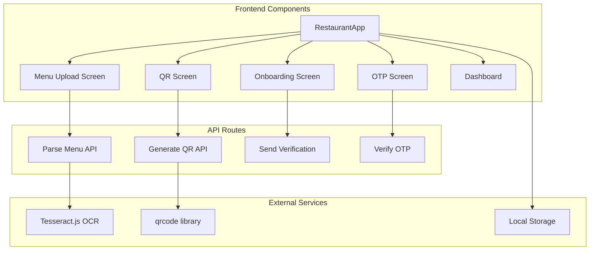
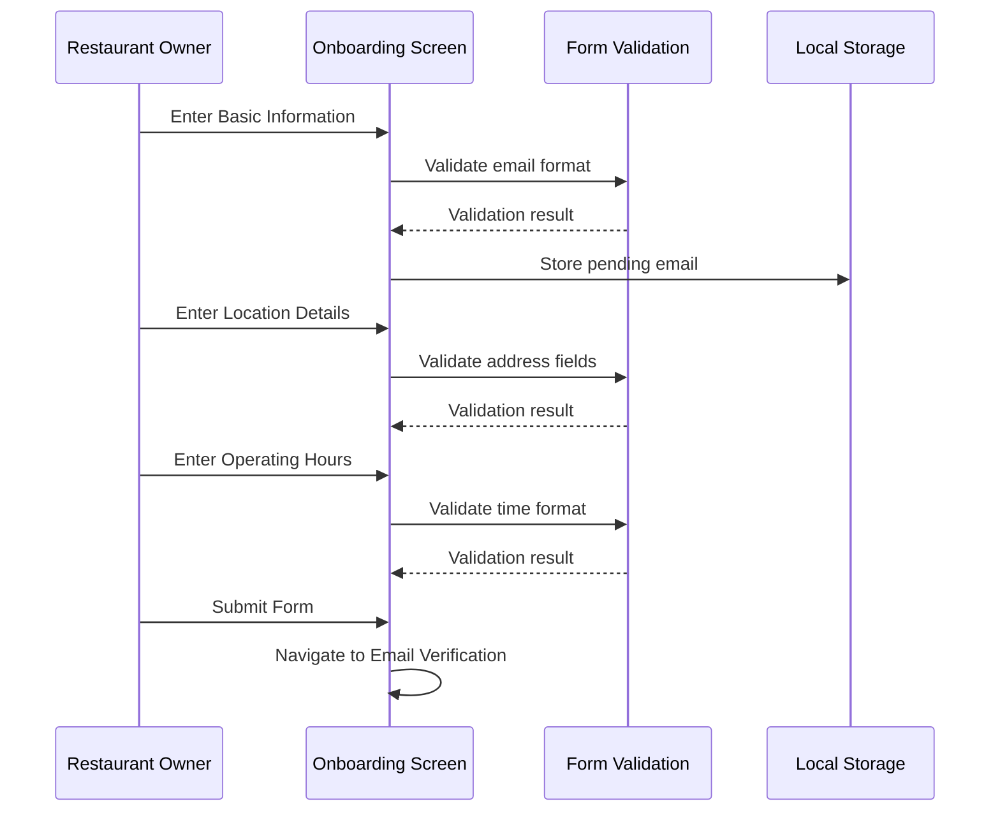
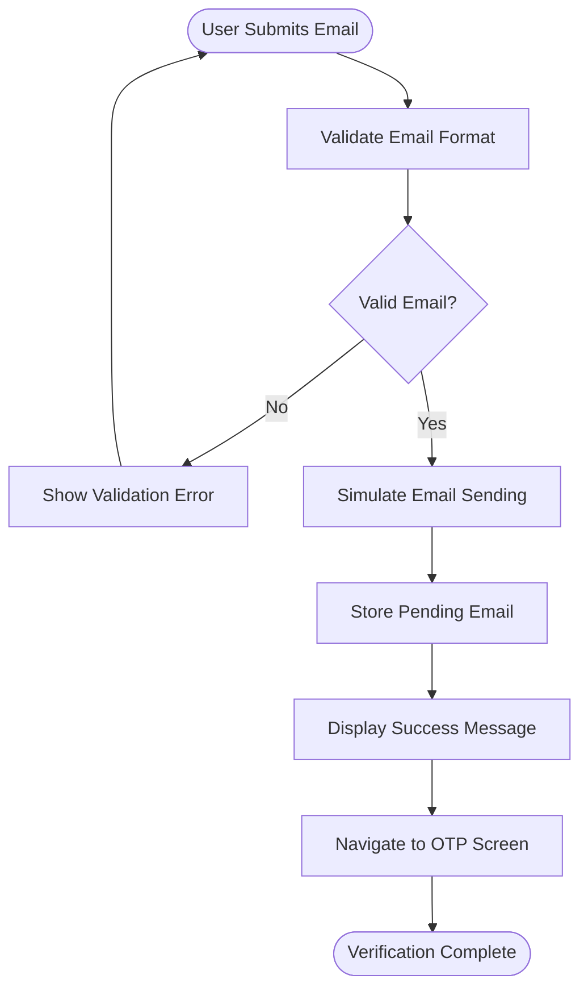
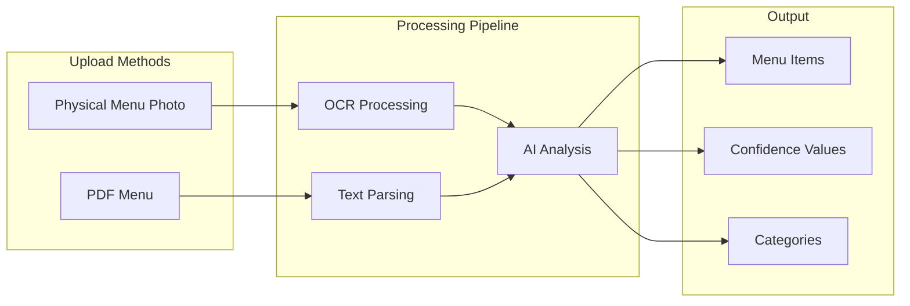
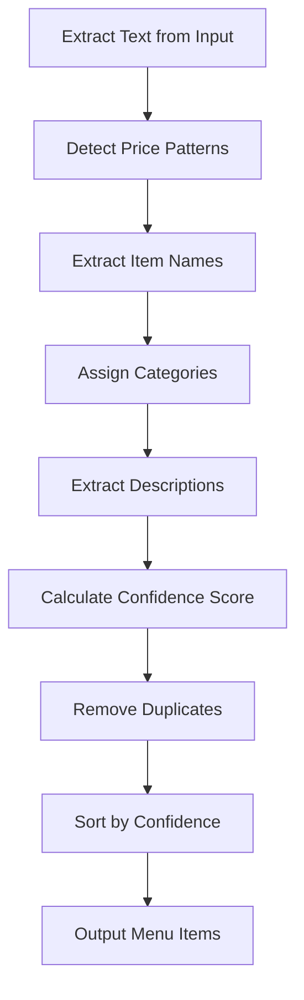
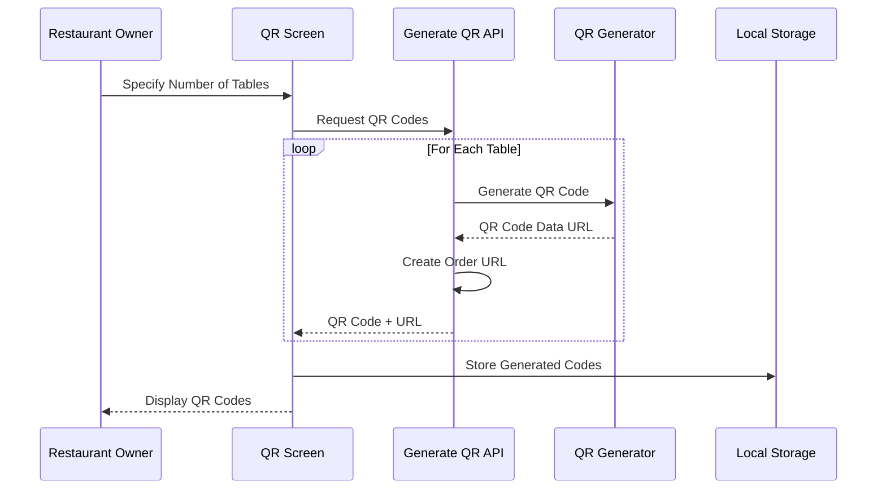
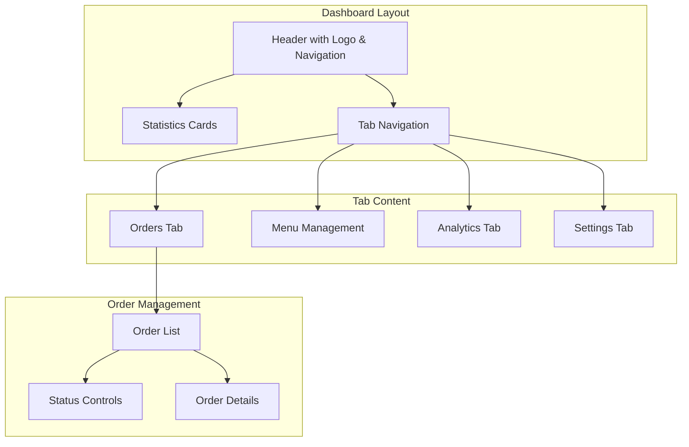
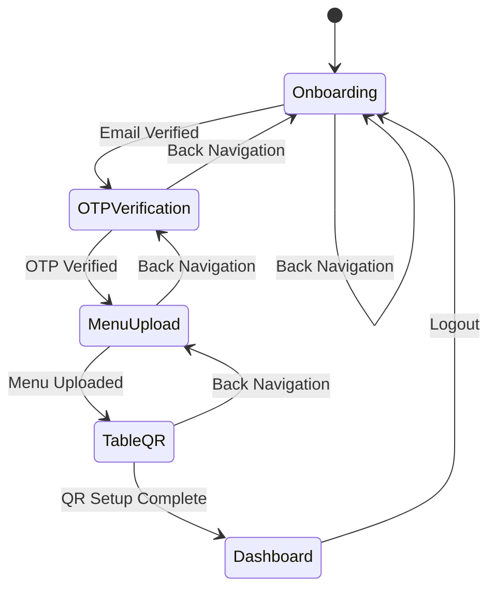

# Restaurant Management Flow

<cite>
**Referenced Files in This Document**
- [restaurant-onboarding-screen.tsx](file://src/components/restaurant/restaurant-onboarding-screen.tsx)
- [restaurant-otp-screen.tsx](file://src/components/restaurant/restaurant-otp-screen.tsx)
- [menu-upload-screen.tsx](file://src/components/restaurant/menu-upload-screen.tsx)
- [table-qr-screen.tsx](file://src/components/restaurant/table-qr-screen.tsx)
- [restaurant-dashboard.tsx](file://src/components/restaurant/restaurant-dashboard.tsx)
- [restaurant-app.tsx](file://src/components/restaurant/restaurant-app.tsx)
- [parse-menu/route.ts](file://src/app/api/restaurant/parse-menu/route.ts)
- [generate-qr/route.ts](file://src/app/api/restaurant/generate-qr/route.ts)
- [form.tsx](file://src/components/ui/form.tsx)
</cite>

## Table of Contents
1. [Introduction](#introduction)
2. [System Architecture](#system-architecture)
3. [Onboarding Process](#onboarding-process)
4. [Verification Flow](#verification-flow)
5. [Menu Upload and Processing](#menu-upload-and-processing)
6. [QR Code Generation](#qr-code-generation)
7. [Dashboard Experience](#dashboard-experience)
8. [State Management and Persistence](#state-management-and-persistence)
9. [Error Handling and Recovery](#error-handling-and-recovery)
10. [Best Practices](#best-practices)
11. [Troubleshooting Guide](#troubleshooting-guide)
12. [Conclusion](#conclusion)

## Introduction

The MenuPRO restaurant management flow is a comprehensive onboarding system designed to seamlessly guide restaurant owners through the complete setup process. This multi-step journey encompasses business information collection, email verification, menu digitization, QR code generation, and dashboard access. The system prioritizes user experience while maintaining robust error handling and state persistence across all stages.

The flow is built with React and TypeScript, utilizing Next.js for server-side rendering and API routes for backend functionality. It incorporates modern web technologies including AI-powered OCR for menu parsing, QR code generation, and responsive design principles to ensure accessibility across devices.

## System Architecture

The restaurant management flow follows a component-based architecture with clear separation of concerns and modular design patterns.



**Diagram sources**
- [restaurant-app.tsx](file://src/components/restaurant/restaurant-app.tsx#L1-L134)
- [parse-menu/route.ts](file://src/app/api/restaurant/parse-menu/route.ts#L1-L152)
- [generate-qr/route.ts](file://src/app/api/restaurant/generate-qr/route.ts#L1-L98)

**Section sources**
- [restaurant-app.tsx](file://src/components/restaurant/restaurant-app.tsx#L1-L134)

## Onboarding Process

The onboarding process serves as the initial gateway for restaurant owners to establish their presence on the MenuPRO platform. This multi-stage form collection ensures comprehensive business information capture while maintaining user-friendly progression.

### Business Information Collection

The onboarding screen is structured as a progressive form with three distinct stages, each focusing on specific aspects of restaurant information:



**Diagram sources**
- [restaurant-onboarding-screen.tsx](file://src/components/restaurant/restaurant-onboarding-screen.tsx#L1-L489)

### Form Validation and User Experience

The onboarding form implements comprehensive validation logic with immediate feedback:

- **Email Validation**: Uses regex pattern `^[^\s@]+@[^\s@]+\.[^\s@]+$` to ensure proper email format
- **Required Field Validation**: Ensures all mandatory fields are completed before proceeding
- **Real-time Feedback**: Provides instant validation messages and visual indicators
- **Progress Tracking**: Shows current step completion with visual progress indicators

### Data Structure and State Management

The restaurant data is structured as a comprehensive interface with nested properties:

```typescript
interface RestaurantData {
  name: string;
  email: string;
  phone: string;
  address: string;
  city: string;
  state: string;
  zipCode: string;
  cuisine: string;
  description: string;
  operatingHours: {
    open: string;
    close: string;
  };
}
```

**Section sources**
- [restaurant-onboarding-screen.tsx](file://src/components/restaurant/restaurant-onboarding-screen.tsx#L15-L30)
- [restaurant-onboarding-screen.tsx](file://src/components/restaurant/restaurant-onboarding-screen.tsx#L100-L150)

## Verification Flow

The verification flow ensures account authenticity through a two-factor authentication approach combining email delivery and OTP verification.

### Email Verification Process

The email verification stage transforms the collected restaurant information into a verifiable account:



**Diagram sources**
- [restaurant-onboarding-screen.tsx](file://src/components/restaurant/restaurant-onboarding-screen.tsx#L100-L130)

### OTP Verification Implementation

The OTP verification screen provides a secure authentication mechanism with advanced features:

- **6-Digit Code Format**: Accepts exactly 6 numeric digits
- **Auto-focus Navigation**: Automatically focuses next input field upon entry
- **Paste Support**: Handles clipboard paste events for convenience
- **Timer Countdown**: Implements 10-minute expiration timer
- **Resend Capability**: Allows resending verification codes

### Security Features

The verification system incorporates several security measures:

- **Demo Mode Compatibility**: Accepts hardcoded test code "123456" for development
- **Rate Limiting Simulation**: Implements artificial delays for realistic UX
- **Error Masking**: Provides generic error messages to prevent information leakage
- **Secure Token Handling**: Stores authentication tokens securely in local storage

**Section sources**
- [restaurant-otp-screen.tsx](file://src/components/restaurant/restaurant-otp-screen.tsx#L1-L259)

## Menu Upload and Processing

The menu upload process represents the technological heart of the system, leveraging AI and machine learning to automate menu digitization from various input formats.

### Upload Method Selection

The system offers two primary upload methods, each optimized for different scenarios:



**Diagram sources**
- [menu-upload-screen.tsx](file://src/components/restaurant/menu-upload-screen.tsx#L1-L447)

### AI-Powered Menu Parsing

The parse-menu API utilizes sophisticated text extraction and analysis:

#### OCR Processing for Images
- **Tesseract.js Integration**: Advanced optical character recognition for image-based menus
- **Multi-language Support**: Handles various languages and fonts
- **Noise Reduction**: Filters out irrelevant text and images
- **Layout Preservation**: Maintains original menu structure during extraction

#### PDF Text Extraction
- **PDF.js Library**: Robust PDF parsing capabilities
- **Text Layer Extraction**: Focuses on readable text content
- **Format Preservation**: Maintains spacing and formatting cues
- **Large File Handling**: Efficient processing of extensive menus

### Menu Item Analysis and Confidence Scoring

The system employs intelligent analysis to extract menu items with varying confidence levels:



**Diagram sources**
- [parse-menu/route.ts](file://src/app/api/restaurant/parse-menu/route.ts#L50-L151)

### Confidence Scoring Algorithm

The confidence scoring system evaluates menu item quality based on multiple factors:

- **Price Pattern Recognition**: Detects currency symbols and numerical patterns
- **Item Length Validation**: Filters out short or nonsensical entries
- **Category Matching**: Identifies common food categories in context
- **Description Presence**: Considers accompanying descriptions as quality indicators
- **Pattern Matching**: Recognizes typical menu item patterns (pizza, pasta, salad, burger)

**Section sources**
- [menu-upload-screen.tsx](file://src/components/restaurant/menu-upload-screen.tsx#L1-L447)
- [parse-menu/route.ts](file://src/app/api/restaurant/parse-menu/route.ts#L1-L152)

## QR Code Generation

The QR code generation system creates scannable codes for each restaurant table, enabling seamless customer ordering experiences.

### QR Code Creation Process

The QR generation process involves multiple steps to ensure optimal functionality:



**Diagram sources**
- [table-qr-screen.tsx](file://src/components/restaurant/table-qr-screen.tsx#L1-L515)
- [generate-qr/route.ts](file://src/app/api/restaurant/generate-qr/route.ts#L1-L98)

### QR Code Features and Options

The QR code system provides comprehensive functionality:

#### Individual QR Code Management
- **Download Options**: PNG format downloads with customizable filenames
- **Print Integration**: Dedicated print functionality with restaurant branding
- **URL Copying**: Quick copying of QR code URLs to clipboard
- **Preview Mode**: Toggleable preview for visual verification

#### Bulk Operations
- **Selection System**: Multi-table selection with select/deselect all functionality
- **Batch Downloads**: Simultaneous download of multiple QR codes
- **Bulk Printing**: Coordinated printing of selected QR codes
- **Efficiency Optimization**: Implemented with timeout delays to prevent browser blocking

### QR Code Design and Branding

The QR codes incorporate restaurant branding and contextual information:

- **Customizable URLs**: Includes restaurant ID and table number parameters
- **Responsive Design**: Generates QR codes optimized for various print sizes
- **Branding Elements**: Incorporates MenuPRO branding and restaurant information
- **Instructional Content**: Provides clear scanning instructions

**Section sources**
- [table-qr-screen.tsx](file://src/components/restaurant/table-qr-screen.tsx#L1-L515)
- [generate-qr/route.ts](file://src/app/api/restaurant/generate-qr/route.ts#L1-L98)

## Dashboard Experience

The restaurant dashboard serves as the central hub for order management, providing real-time insights and operational controls.

### Dashboard Architecture

The dashboard implements a tabbed interface with specialized views for different operational needs:



**Diagram sources**
- [restaurant-dashboard.tsx](file://src/components/restaurant/restaurant-dashboard.tsx#L1-L370)

### Order Management System

The order management interface provides comprehensive control over the restaurant's order lifecycle:

#### Real-time Order Tracking
- **Status Updates**: Live status changes from pending to served
- **Estimated Times**: Dynamic estimated preparation times
- **Customer Information**: Associated customer details and table numbers
- **Item Breakdown**: Detailed itemized order contents

#### Interactive Status Controls
The system provides intuitive status transition buttons:
- **Pending Orders**: Confirm and start preparing
- **Confirmed Orders**: Begin preparation process
- **Preparing Orders**: Mark as ready for service
- **Ready Orders**: Indicate completion and readiness
- **Served Orders**: Finalize order completion

### Statistics and Analytics

The dashboard displays key performance indicators:

- **Total Orders**: Cumulative order count
- **Pending Orders**: Current pending order volume
- **Today's Revenue**: Daily revenue calculation
- **Average Order Value**: Statistical average order value

### Menu and Settings Management

Future implementations will expand dashboard capabilities:

- **Menu Editing**: Add, edit, and delete menu items
- **Analytics Dashboard**: Detailed performance analytics
- **Settings Configuration**: Restaurant-specific settings and preferences

**Section sources**
- [restaurant-dashboard.tsx](file://src/components/restaurant/restaurant-dashboard.tsx#L1-L370)

## State Management and Persistence

The system implements robust state management strategies to ensure seamless user experience across all onboarding steps.

### Component-Based State Architecture



**Diagram sources**
- [restaurant-app.tsx](file://src/components/restaurant/restaurant-app.tsx#L1-L134)

### Local Storage Integration

The system utilizes local storage for persistent state management:

- **Authentication Tokens**: Secure storage of JWT tokens with automatic cleanup
- **Form Data**: Temporary storage of partially completed forms
- **Navigation State**: Maintains current screen position across sessions
- **User Preferences**: Stores user-specific preferences and settings

### Cross-Component Communication

Components communicate through well-defined prop interfaces and callback functions:

- **RestaurantApp**: Central orchestrator managing screen transitions
- **Callback Handlers**: Functions passed down through component hierarchy
- **State Propagation**: Automatic state updates across connected components
- **Error Propagation**: Centralized error handling and user notification

**Section sources**
- [restaurant-app.tsx](file://src/components/restaurant/restaurant-app.tsx#L1-L134)

## Error Handling and Recovery

The system implements comprehensive error handling strategies to maintain user experience during unexpected situations.

### Validation Error Management

Form validation incorporates multiple layers of error detection:

- **Client-Side Validation**: Immediate feedback for input errors
- **Server-Side Validation**: Additional validation for critical operations
- **Error Aggregation**: Consolidated error reporting for complex forms
- **User-Friendly Messages**: Generic error messages to prevent information disclosure

### Network Error Recovery

The system handles network-related failures gracefully:

- **Retry Mechanisms**: Automatic retry for transient failures
- **Offline Detection**: Graceful degradation when offline
- **Timeout Management**: Appropriate timeout handling for API requests
- **Progress Indication**: Clear indication of loading states

### User Experience During Failures

Error scenarios are handled with consideration for user experience:

- **Graceful Degradation**: Functional fallbacks when features fail
- **Clear Messaging**: Informative error messages with suggested actions
- **State Preservation**: Maintains user progress during error recovery
- **Recovery Options**: Provides clear pathways to resolve issues

## Best Practices

### For Restaurant Owners

#### Menu Upload Best Practices
- **High-Quality Images**: Use well-lit, clear photos of menus
- **Complete Menus**: Ensure entire menu pages are captured in photos
- **Consistent Formatting**: Maintain consistent menu formatting for better accuracy
- **Multiple Attempts**: Retry uploads if initial parsing fails

#### QR Code Implementation
- **Print Quality**: Use high-resolution printers for QR code printing
- **Placement Strategy**: Position QR codes at customer-accessible locations
- **Testing**: Test QR codes with various devices before deployment
- **Backup Plans**: Maintain backup ordering methods alongside QR codes

#### Dashboard Usage
- **Regular Monitoring**: Check dashboard regularly for new orders
- **Status Updates**: Update order statuses promptly
- **Menu Maintenance**: Keep menu items updated and accurate
- **Analytics Review**: Regularly review performance analytics

### Development Best Practices

#### Code Organization
- **Component Modularity**: Maintain focused, reusable components
- **Type Safety**: Leverage TypeScript for compile-time error detection
- **API Design**: Implement RESTful API patterns with appropriate status codes
- **Error Handling**: Implement comprehensive error handling strategies

#### Performance Optimization
- **Lazy Loading**: Load components and resources on demand
- **Image Optimization**: Optimize QR code and menu images for web delivery
- **State Minimization**: Keep state minimal and focused
- **Memory Management**: Proper cleanup of resources and event listeners

## Troubleshooting Guide

### Common Upload Issues

#### Menu Parsing Failures
**Symptoms**: Menu items not detected or incorrectly parsed
**Solutions**:
- Ensure high-quality, well-lit images
- Use clear, unobstructed photos of menus
- Verify menu format matches supported patterns
- Retry with different image angles or lighting conditions

#### OCR Accuracy Problems
**Symptoms**: Misidentified prices or item names
**Solutions**:
- Improve image resolution and clarity
- Reduce background noise and distractions
- Use consistent font sizes and styles
- Manually verify and correct parsed items

### QR Code Generation Issues

#### QR Code Not Scanning
**Symptoms**: QR codes not recognized by mobile devices
**Solutions**:
- Verify QR code resolution meets scanning standards
- Test with multiple QR code scanners
- Check for interference from nearby QR codes
- Ensure adequate contrast between QR code and background

#### Print Quality Problems
**Symptoms**: Poor print quality affecting scanability
**Solutions**:
- Use high-resolution printers (300 DPI or higher)
- Ensure proper paper type for QR code printing
- Test print quality with scanner applications
- Adjust printer settings for optimal QR code output

### Authentication and Verification Issues

#### OTP Verification Failures
**Symptoms**: OTP codes not accepted or timing issues
**Solutions**:
- Verify internet connectivity during verification
- Check for browser extensions interfering with input
- Ensure device clock is synchronized
- Use demo mode code "123456" for testing

#### Email Delivery Problems
**Symptoms**: Verification emails not received
**Solutions**:
- Check spam/junk folders for verification emails
- Verify email address accuracy during onboarding
- Use different email providers if issues persist
- Contact support for persistent delivery problems

### Performance and Technical Issues

#### Slow Upload Processing
**Symptoms**: Long wait times during menu upload
**Solutions**:
- Ensure stable internet connection
- Use smaller, focused menu images
- Close unnecessary browser tabs and applications
- Retry upload during off-peak hours

#### Dashboard Loading Issues
**Symptoms**: Dashboard not loading or displaying errors
**Solutions**:
- Clear browser cache and cookies
- Try different web browsers
- Verify authentication token validity
- Contact technical support for persistent issues

**Section sources**
- [restaurant-onboarding-screen.tsx](file://src/components/restaurant/restaurant-onboarding-screen.tsx#L100-L130)
- [restaurant-otp-screen.tsx](file://src/components/restaurant/restaurant-otp-screen.tsx#L100-L150)
- [menu-upload-screen.tsx](file://src/components/restaurant/menu-upload-screen.tsx#L200-L250)

## Conclusion

The MenuPRO restaurant management flow represents a comprehensive solution for modern restaurant digitalization. Through its multi-stage onboarding process, robust verification system, AI-powered menu processing, and intuitive dashboard interface, the system successfully addresses the complete lifecycle of restaurant digital ordering setup.

The architecture demonstrates excellent separation of concerns, with clear component boundaries and well-defined data flow patterns. The integration of AI technologies like OCR and machine learning for menu parsing showcases the system's commitment to automation and efficiency.

Key strengths of the implementation include:

- **User-Centric Design**: Progressive onboarding with clear guidance and validation
- **Robust Error Handling**: Comprehensive error management with graceful degradation
- **Modern Technology Stack**: Leveraging cutting-edge libraries and frameworks
- **Scalable Architecture**: Modular design supporting future enhancements
- **Security Focus**: Multi-layered authentication and validation systems

The system successfully balances functionality with usability, providing restaurant owners with powerful tools while maintaining simplicity in operation. The comprehensive troubleshooting guide and best practices ensure ongoing success in real-world deployments.

Future enhancements could include expanded menu customization options, advanced analytics capabilities, and integration with additional restaurant management systems. The solid foundation established by this implementation provides an excellent base for continued innovation and feature expansion.