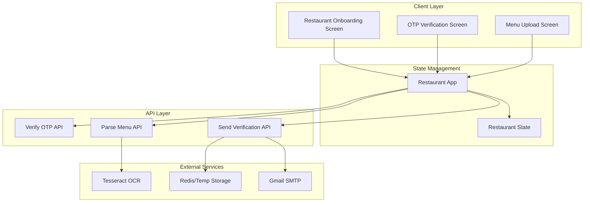
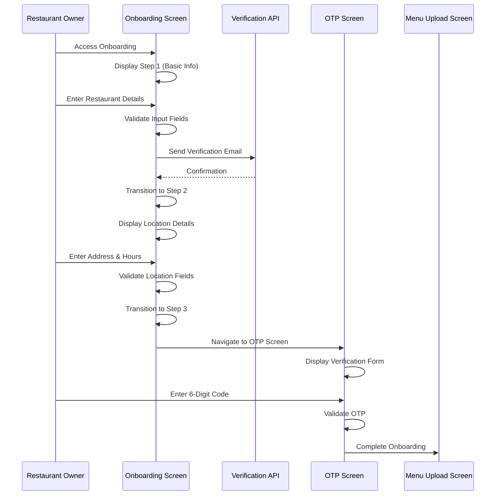
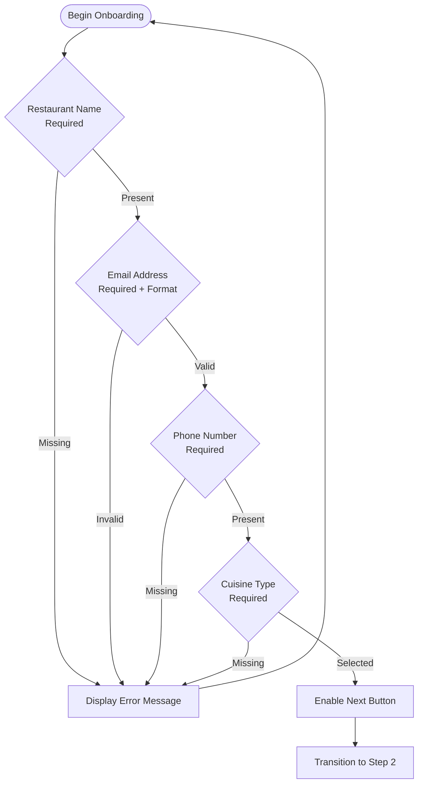
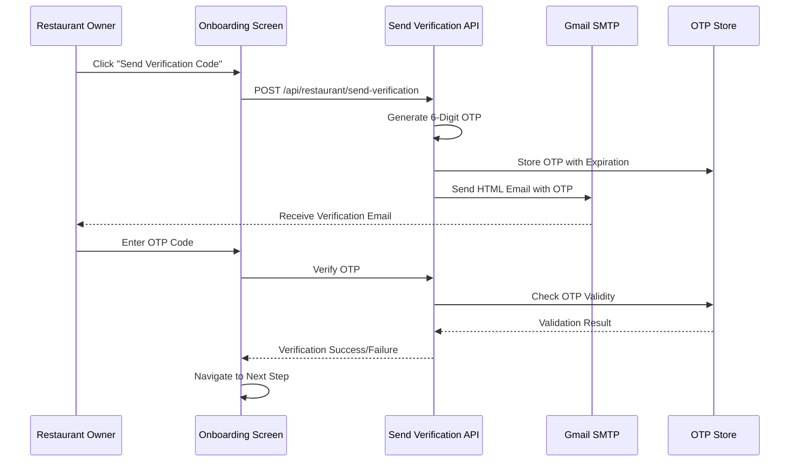
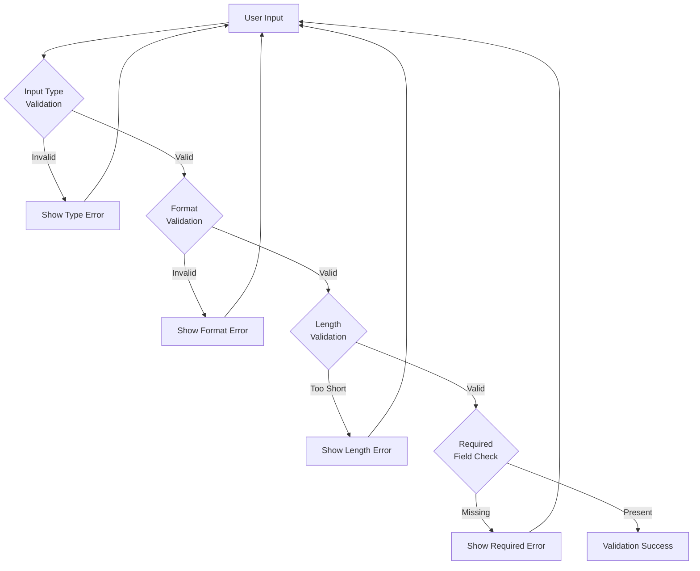
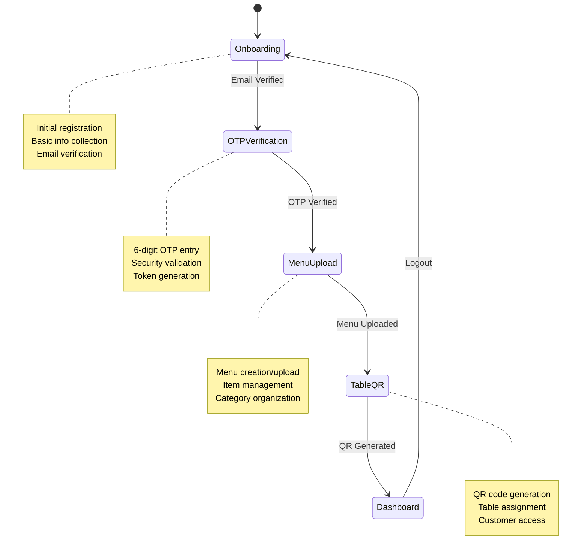
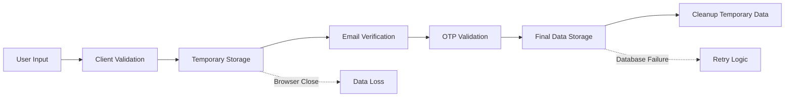
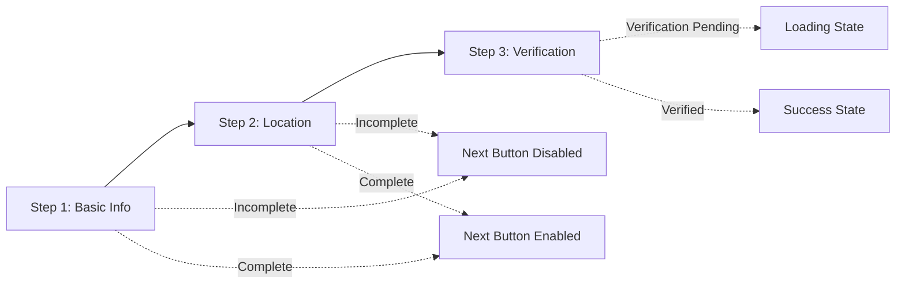

# Restaurant Onboarding Process

<cite>
**Referenced Files in This Document**
- [restaurant-onboarding-screen.tsx](file://src/components/restaurant/restaurant-onboarding-screen.tsx)
- [restaurant-app.tsx](file://src/components/restaurant/restaurant-app.tsx)
- [restaurant-otp-screen.tsx](file://src/components/restaurant/restaurant-otp-screen.tsx)
- [send-verification/route.ts](file://src/app/api/restaurant/send-verification/route.ts)
- [parse-menu/route.ts](file://src/app/api/restaurant/parse-menu/route.ts)
- [menu-upload-screen.tsx](file://src/components/restaurant/menu-upload-screen.tsx)
- [form.tsx](file://src/components/ui/form.tsx)
- [onboarding-screen.test.tsx](file://src/__tests__/restaurant/restaurant-onboarding-screen.test.tsx)
</cite>

## Table of Contents
1. [Introduction](#introduction)
2. [System Architecture](#system-architecture)
3. [Onboarding Flow Overview](#onboarding-flow-overview)
4. [Restaurant Onboarding Screen](#restaurant-onboarding-screen)
5. [Email Verification Process](#email-verification-process)
6. [Form Validation and Error Handling](#form-validation-and-error-handling)
7. [State Management Integration](#state-management-integration)
8. [Data Persistence and Storage](#data-persistence-and-storage)
9. [User Experience Features](#user-experience-features)
10. [Accessibility and Responsive Design](#accessibility-and-responsive-design)
11. [Testing and Quality Assurance](#testing-and-quality-assurance)
12. [Troubleshooting Guide](#troubleshooting-guide)
13. [Conclusion](#conclusion)

## Introduction

The MenuPRO restaurant onboarding process is a comprehensive multi-step workflow designed to seamlessly register new restaurants and collect essential business information. This system implements a progressive onboarding experience that captures restaurant details, validates user input, sends verification emails, and prepares the platform for full functionality.

The onboarding process consists of three primary stages: basic information collection, location and operational details, and email verification. Each stage is carefully designed to minimize friction while ensuring data quality and security compliance.

## System Architecture

The restaurant onboarding system follows a modular architecture with clear separation of concerns across multiple components:



**Diagram sources**
- [restaurant-app.tsx](file://src/components/restaurant/restaurant-app.tsx#L1-L134)
- [restaurant-onboarding-screen.tsx](file://src/components/restaurant/restaurant-onboarding-screen.tsx#L1-L489)

## Onboarding Flow Overview

The restaurant onboarding process is structured as a progressive wizard with three distinct steps:



**Diagram sources**
- [restaurant-onboarding-screen.tsx](file://src/components/restaurant/restaurant-onboarding-screen.tsx#L40-L120)
- [restaurant-otp-screen.tsx](file://src/components/restaurant/restaurant-otp-screen.tsx#L1-L259)

## Restaurant Onboarding Screen

The `RestaurantOnboardingScreen` component serves as the primary interface for collecting restaurant information. It implements a sophisticated form management system with real-time validation and state tracking.

### Component Structure

```typescript
interface RestaurantData {
  name: string;
  email: string;
  phone: string;
  address: string;
  city: string;
  state: string;
  zipCode: string;
  cuisine: string;
  description: string;
  operatingHours: {
    open: string;
    close: string;
  };
}
```

### Form Sections and Validation

The onboarding screen is divided into three logical sections, each with specific validation requirements:

#### Step 1: Basic Information Collection



**Diagram sources**
- [restaurant-onboarding-screen.tsx](file://src/components/restaurant/restaurant-onboarding-screen.tsx#L55-L120)

#### Step 2: Location and Operational Details

This step collects comprehensive location information and operational hours:

- **Street Address**: Full physical address with validation
- **City, State, ZIP Code**: Geographical coordinates and postal information
- **Operating Hours**: Time selection with format validation
- **Restaurant Description**: Optional narrative description

#### Step 3: Email Verification

The final step initiates the email verification process:

```typescript
const validateEmail = (email: string) => {
  const emailRegex = /^[^\s@]+@[^\s@]+\.[^\s@]+$/;
  return emailRegex.test(email);
};
```

**Section sources**
- [restaurant-onboarding-screen.tsx](file://src/components/restaurant/restaurant-onboarding-screen.tsx#L55-L120)
- [restaurant-onboarding-screen.tsx](file://src/components/restaurant/restaurant-onboarding-screen.tsx#L120-L180)

## Email Verification Process

The email verification system implements a robust two-factor authentication mechanism using 6-digit OTP codes delivered via email.

### Verification Workflow



**Diagram sources**
- [send-verification/route.ts](file://src/app/api/restaurant/send-verification/route.ts#L1-L99)
- [restaurant-otp-screen.tsx](file://src/components/restaurant/restaurant-otp-screen.tsx#L1-L259)

### OTP Generation and Storage

The system generates cryptographically secure OTPs using Node.js crypto module:

```typescript
// Generate 6-digit OTP
const otp = crypto.randomInt(100000, 999999).toString();
const expires = Date.now() + 10 * 60 * 1000; // 10 minutes

// Store OTP
otpStore.set(email, { otp, expires });
```

### Email Template and Content

The verification email template includes:

- **Branding Elements**: MenuPRO logo and brand colors
- **Security Warning**: Clear indication of verification purpose
- **Code Display**: Large, prominent OTP code display
- **Expiration Notice**: 10-minute expiration countdown
- **Welcome Message**: Personalized welcome to MenuPRO ecosystem

**Section sources**
- [send-verification/route.ts](file://src/app/api/restaurant/send-verification/route.ts#L20-L50)
- [send-verification/route.ts](file://src/app/api/restaurant/send-verification/route.ts#L50-L99)

## Form Validation and Error Handling

The onboarding system implements comprehensive validation at multiple levels to ensure data quality and user experience.

### Client-Side Validation



**Diagram sources**
- [restaurant-onboarding-screen.tsx](file://src/components/restaurant/restaurant-onboarding-screen.tsx#L55-L80)

### Validation Rules

#### Email Validation
- **Format**: Must match standard email pattern
- **Uniqueness**: Not currently validated in frontend (handled server-side)
- **Domain**: No specific domain restrictions

#### Phone Number Validation
- **Format**: Accepts various international formats
- **Length**: Minimum 10 digits
- **Characters**: Allows hyphens, spaces, parentheses

#### Address Validation
- **Street Address**: Minimum 5 characters
- **City**: Minimum 2 characters
- **State**: Two-letter abbreviation
- **ZIP Code**: 5-digit US format

#### Operating Hours Validation
- **Time Format**: HH:mm 24-hour format
- **Logical Consistency**: Open time must precede close time
- **Business Hours**: Typically 6 AM to 11 PM

### Error Handling Strategies

The system employs multiple error handling approaches:

1. **Immediate Feedback**: Real-time validation messages
2. **Aggregated Errors**: Grouped error displays
3. **State Management**: Persistent error state across steps
4. **Recovery Paths**: Clear navigation back to valid states

**Section sources**
- [restaurant-onboarding-screen.tsx](file://src/components/restaurant/restaurant-onboarding-screen.tsx#L55-L80)
- [restaurant-onboarding-screen.tsx](file://src/components/restaurant/restaurant-onboarding-screen.tsx#L120-L180)

## State Management Integration

The onboarding process integrates seamlessly with the global state management system through the `RestaurantApp` component.

### State Flow Architecture



**Diagram sources**
- [restaurant-app.tsx](file://src/components/restaurant/restaurant-app.tsx#L40-L80)

### Data Persistence Strategy

The system uses a combination of local storage and temporary state management:

#### Local Storage Persistence
- **Pending Email**: `localStorage.setItem('pendingRestaurantEmail', email)`
- **Authentication Tokens**: `localStorage.setItem('restaurantAuthToken', token)`
- **Session Management**: Automatic cleanup on logout

#### Temporary State Management
- **Form Data**: React state within individual screens
- **Progress Tracking**: Step navigation state
- **Loading States**: Async operation indicators

### Inter-Component Communication

Components communicate through well-defined prop interfaces:

```typescript
interface RestaurantOnboardingScreenProps {
  onEmailVerified: (email: string, restaurantData: RestaurantData) => void;
  onBack: () => void;
}
```

**Section sources**
- [restaurant-app.tsx](file://src/components/restaurant/restaurant-app.tsx#L1-L134)
- [restaurant-onboarding-screen.tsx](file://src/components/restaurant/restaurant-onboarding-screen.tsx#L10-L25)

## Data Persistence and Storage

The onboarding system implements a hybrid approach to data persistence, balancing user convenience with data integrity.

### Storage Mechanisms

#### Frontend Storage
- **Local Storage**: Persistent across browser sessions
- **Session Storage**: Temporary data for current session
- **Memory State**: React component state for immediate use

#### Backend Storage
- **Temporary OTP Storage**: In-memory storage with automatic cleanup
- **Permanent Database**: Final restaurant data storage (not shown in current scope)

### Data Lifecycle



**Diagram sources**
- [send-verification/route.ts](file://src/app/api/restaurant/send-verification/route.ts#L80-L99)

### Recovery Mechanisms

The system provides several recovery mechanisms:

1. **Email Resend**: Users can request new verification codes
2. **Step Navigation**: Ability to revisit previous steps
3. **Data Preservation**: Partial data retention across steps
4. **Error Recovery**: Clear pathways to resolve validation errors

**Section sources**
- [send-verification/route.ts](file://src/app/api/restaurant/send-verification/route.ts#L80-L99)
- [restaurant-otp-screen.tsx](file://src/components/restaurant/restaurant-otp-screen.tsx#L120-L150)

## User Experience Features

The onboarding system incorporates numerous UX enhancements to create a seamless user experience.

### Progressive Disclosure

The form is presented in manageable chunks with clear progression indicators:



**Diagram sources**
- [restaurant-onboarding-screen.tsx](file://src/components/restaurant/restaurant-onboarding-screen.tsx#L40-L120)

### Input Enhancement Features

#### Auto-Focus and Tab Navigation
- **Sequential Focus**: Automatic focus on next input field
- **Tab Navigation**: Keyboard-friendly tab order
- **Paste Support**: Multi-character paste handling

#### Visual Feedback
- **Progress Indicators**: Clear step-by-step progress
- **Loading States**: Visual feedback during operations
- **Success Confirmation**: Clear success messaging

#### Accessibility Features
- **ARIA Labels**: Comprehensive screen reader support
- **Keyboard Navigation**: Full keyboard accessibility
- **High Contrast**: Adequate color contrast ratios

### Mobile Responsiveness

The interface adapts seamlessly to various screen sizes:

```typescript
// Tailwind CSS responsive classes
<div className="w-full max-w-md mx-auto">
  {/* Responsive container */}
</div>
```

**Section sources**
- [restaurant-onboarding-screen.tsx](file://src/components/restaurant/restaurant-onboarding-screen.tsx#L200-L300)
- [restaurant-otp-screen.tsx](file://src/components/restaurant/restaurant-otp-screen.tsx#L100-L200)

## Accessibility and Responsive Design

The onboarding system prioritizes accessibility and cross-device compatibility.

### Accessibility Implementation

#### Semantic HTML Structure
```html
<h1 className="text-3xl font-bold text-gray-900 mb-2">Join MenuPRO</h1>
<p className="text-gray-600">Let's get your restaurant set up with digital ordering</p>
```

#### ARIA Attributes
- **Form Labels**: Proper label associations
- **Error Messages**: Programmatic error announcements
- **Progress Indicators**: Live region updates

#### Keyboard Navigation
- **Tab Order**: Logical navigation flow
- **Enter Key**: Form submission capability
- **Escape Key**: Modal dismissal where applicable

### Responsive Design Features

#### Breakpoint Management
- **Mobile First**: Base styles for mobile devices
- **Progressive Enhancement**: Enhanced features for larger screens
- **Flexible Grids**: CSS Grid and Flexbox layouts

#### Touch-Friendly Interface
- **Large Tap Targets**: Minimum 44px touch targets
- **Gesture Support**: Swipe navigation where appropriate
- **Scroll Behavior**: Smooth scrolling and anchor positioning

### Cross-Browser Compatibility

The system maintains compatibility across major browsers:

- **Chrome**: Primary development target
- **Firefox**: Full feature support
- **Safari**: iOS and macOS compatibility
- **Edge**: Windows platform support

**Section sources**
- [restaurant-onboarding-screen.tsx](file://src/components/restaurant/restaurant-onboarding-screen.tsx#L1-L50)
- [restaurant-otp-screen.tsx](file://src/components/restaurant/restaurant-otp-screen.tsx#L1-L50)

## Testing and Quality Assurance

The onboarding system includes comprehensive testing coverage to ensure reliability and user experience quality.

### Test Coverage Areas

#### Unit Testing
- **Component Rendering**: Verify proper component mounting
- **State Management**: Test state transitions and updates
- **Event Handlers**: Validate user interaction handling
- **Prop Validation**: Ensure proper prop passing

#### Integration Testing
- **API Integration**: Test backend communication
- **Form Submission**: Validate complete workflow
- **Error Scenarios**: Test failure conditions
- **Navigation**: Verify step progression

### Test Implementation

```typescript
// Example test scenarios
it('shows form validation errors', async () => {
  const user = userEvent.setup()
  render(<RestaurantOnboardingScreen />)
  
  const submitButton = screen.getByRole('button', { name: /Continue/i })
  await user.click(submitButton)
  
  expect(screen.getByText('Please fill in all required fields')).toBeInTheDocument()
})
```

### Quality Metrics

#### Performance Metrics
- **Load Times**: Sub-2 second initial load
- **Response Times**: < 500ms for user interactions
- **Memory Usage**: Optimized component lifecycle

#### Usability Metrics
- **Completion Rate**: Target 85% completion rate
- **Error Rate**: < 5% validation errors
- **Time on Task**: Average 5 minutes per step

**Section sources**
- [onboarding-screen.test.tsx](file://src/__tests__/restaurant/restaurant-onboarding-screen.test.tsx#L1-L252)

## Troubleshooting Guide

Common issues and their solutions during the restaurant onboarding process.

### Email Verification Issues

#### Problem: Verification Email Not Received
**Symptoms**: 
- Email appears in spam/junk folder
- Delayed delivery notification
- "Email not found" error

**Solutions**:
1. **Check Spam Folder**: Advise users to check spam/junk folders
2. **Resend Verification**: Implement resend functionality
3. **Alternative Email**: Allow users to change email address
4. **Email Provider**: Verify email provider compatibility

#### Problem: OTP Code Invalid
**Symptoms**:
- "Invalid verification code" message
- Code not working despite correct entry
- Expired code errors

**Solutions**:
1. **Code Resend**: Offer immediate code resend option
2. **Timer Reset**: Reset expiration timer
3. **Demo Mode**: Provide test code for development
4. **Support Contact**: Offer customer support escalation

### Form Validation Problems

#### Problem: Input Field Validation Failures
**Symptoms**:
- Immediate validation errors
- Confusing error messages
- Inconsistent validation rules

**Solutions**:
1. **Clear Error Messages**: Provide specific, actionable feedback
2. **Real-time Validation**: Show errors immediately after input
3. **Consistent Rules**: Apply uniform validation across all fields
4. **Help Text**: Include helpful hints for complex fields

### Technical Issues

#### Problem: Network Connectivity
**Symptoms**:
- Timeout errors during submission
- Failed API requests
- Slow response times

**Solutions**:
1. **Retry Logic**: Implement automatic retry mechanisms
2. **Offline Detection**: Detect network connectivity issues
3. **Progressive Loading**: Load content progressively
4. **Error Boundaries**: Graceful error handling

### Performance Issues

#### Problem: Slow Form Loading
**Symptoms**:
- Long loading times
- Unresponsive interface
- Browser freezing

**Solutions**:
1. **Optimized Rendering**: Minimize unnecessary re-renders
2. **Lazy Loading**: Load components on demand
3. **Bundle Optimization**: Reduce JavaScript bundle size
4. **CDN Integration**: Use content delivery networks

**Section sources**
- [restaurant-otp-screen.tsx](file://src/components/restaurant/restaurant-otp-screen.tsx#L120-L180)
- [send-verification/route.ts](file://src/app/api/restaurant/send-verification/route.ts#L20-L50)

## Conclusion

The MenuPRO restaurant onboarding process represents a comprehensive solution for capturing restaurant information while maintaining high standards of user experience, security, and accessibility. The system successfully balances functionality with simplicity, providing clear guidance through the registration process while implementing robust validation and error handling mechanisms.

Key strengths of the implementation include:

- **Modular Architecture**: Clean separation of concerns across components
- **Progressive Enhancement**: Seamless user experience with graceful degradation
- **Comprehensive Validation**: Multi-layered validation ensuring data quality
- **Accessibility Compliance**: Full accessibility support for diverse user needs
- **Responsive Design**: Optimal experience across all device types
- **Robust Testing**: Extensive test coverage ensuring reliability

The onboarding system serves as a foundation for the broader MenuPRO platform, establishing secure user accounts and enabling subsequent restaurant operations including menu management, QR code generation, and customer ordering capabilities.

Future enhancements could include additional validation rules, expanded cuisine type options, improved error recovery mechanisms, and enhanced analytics for onboarding performance optimization.