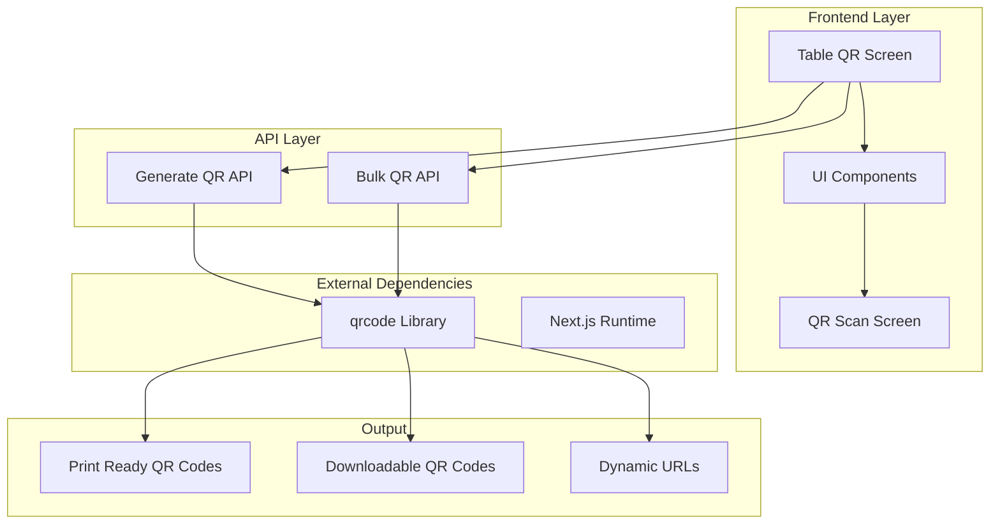
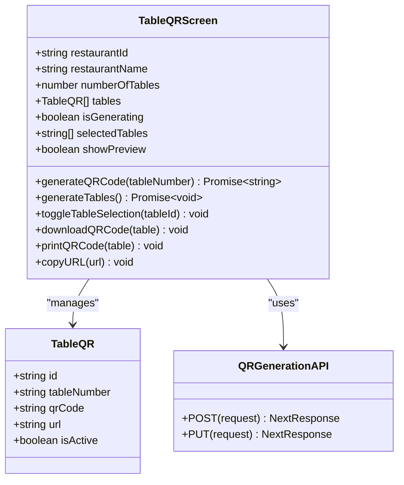
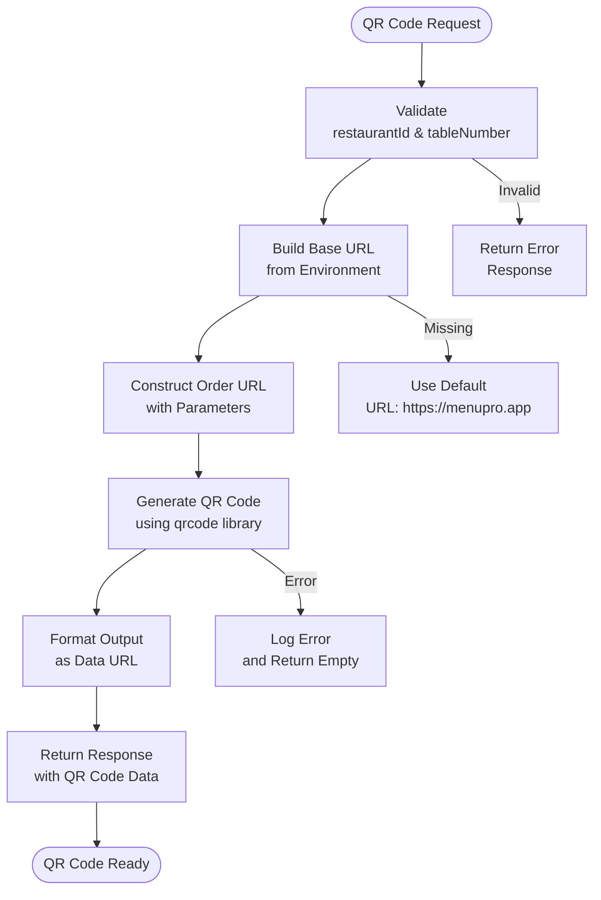
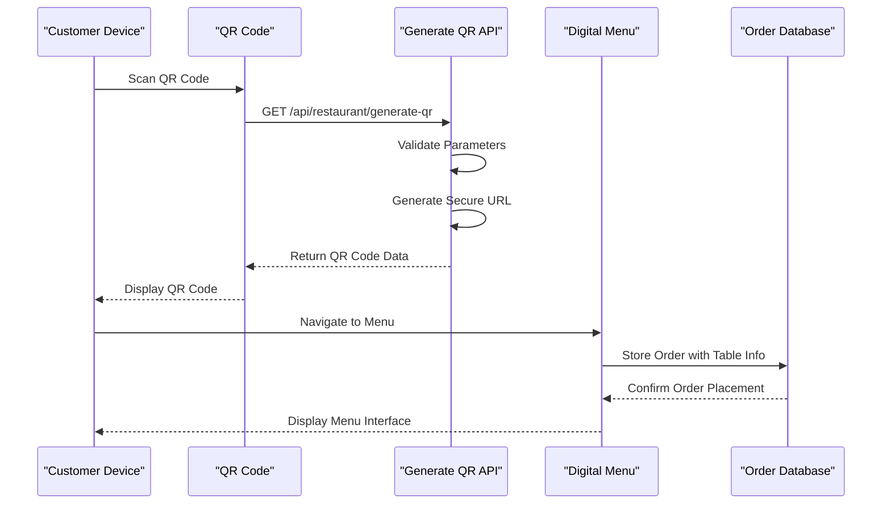
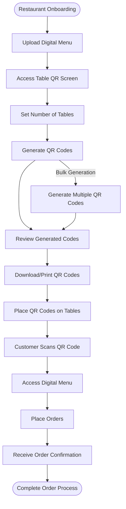

# Table QR Code Generation System

<cite>
**Referenced Files in This Document**
- [src/app/api/restaurant/generate-qr/route.ts](file://src/app/api/restaurant/generate-qr/route.ts)
- [src/components/restaurant/table-qr-screen.tsx](file://src/components/restaurant/table-qr-screen.tsx)
- [src/styles/print.css](file://src/styles/print.css)
- [src/components/restaurant/restaurant-app.tsx](file://src/components/restaurant/restaurant-app.tsx)
- [src/components/pwa/qr-scan-screen.tsx](file://src/components/pwa/qr-scan-screen.tsx)
- [src/components/pwa/order-confirmation-screen.tsx](file://src/components/pwa/order-confirmation-screen.tsx)
- [package.json](file://package.json)
</cite>

## Table of Contents
1. [Introduction](#introduction)
2. [System Architecture](#system-architecture)
3. [API Endpoint Analysis](#api-endpoint-analysis)
4. [Frontend Implementation](#frontend-implementation)
5. [QR Code Generation Process](#qr-code-generation-process)
6. [Customization Options](#customization-options)
7. [Security Features](#security-features)
8. [Integration Workflow](#integration-workflow)
9. [Performance Considerations](#performance-considerations)
10. [Troubleshooting Guide](#troubleshooting-guide)
11. [Best Practices](#best-practices)
12. [Conclusion](#conclusion)

## Introduction

The Table QR Code Generation System is a comprehensive solution designed to enable restaurant owners to create scannable QR codes for individual tables that seamlessly link to their digital menu. This system integrates the `/api/restaurant/generate-qr` API endpoint with React frontend components to provide a complete workflow for QR code creation, customization, and deployment.

The system leverages the qrcode library for QR code generation and implements robust URL construction mechanisms to ensure secure and reliable access to digital menus. It supports both single QR code generation and bulk generation for restaurants with multiple tables, providing flexibility for various restaurant sizes and configurations.

## System Architecture

The Table QR Code Generation System follows a modern Next.js architecture with a clear separation of concerns between API endpoints and frontend components. The system is built around several key architectural principles:



**Diagram sources**
- [src/components/restaurant/table-qr-screen.tsx](file://src/components/restaurant/table-qr-screen.tsx#L1-L50)
- [src/app/api/restaurant/generate-qr/route.ts](file://src/app/api/restaurant/generate-qr/route.ts#L1-L20)

The architecture emphasizes modularity, with distinct layers for presentation, business logic, and external integrations. This design ensures maintainability and scalability while providing a seamless user experience for restaurant owners.

**Section sources**
- [src/components/restaurant/table-qr-screen.tsx](file://src/components/restaurant/table-qr-screen.tsx#L1-L50)
- [src/app/api/restaurant/generate-qr/route.ts](file://src/app/api/restaurant/generate-qr/route.ts#L1-L98)

## API Endpoint Analysis

The core of the QR code generation system lies in the `/api/restaurant/generate-qr` endpoint, which provides two primary functions: single QR code generation and bulk QR code generation.

### Single QR Code Generation

The POST endpoint handles individual QR code generation for specific tables:

```typescript
export async function POST(request: NextRequest) {
  try {
    const { restaurantId, tableNumber } = await request.json();
    
    // Generate URL with restaurant and table parameters
    const baseUrl = process.env.NEXT_PUBLIC_BASE_URL || 'https://menupro.app';
    const orderUrl = `${baseUrl}/order?restaurant=${restaurantId}&table=${tableNumber}`;
    
    // Generate QR code with specific parameters
    const qrCodeDataURL = await QRCode.toDataURL(orderUrl, {
      width: 200,
      margin: 2,
      color: {
        dark: '#000000',
        light: '#FFFFFF'
      }
    });
    
    return NextResponse.json({
      success: true,
      qrCode: qrCodeDataURL,
      url: orderUrl,
      tableNumber,
      restaurantId
    });
  } catch (error) {
    console.error('QR code generation error:', error);
    return NextResponse.json(
      { message: 'Failed to generate QR code' },
      { status: 500 }
    );
  }
}
```

### Bulk QR Code Generation

The PUT endpoint enables efficient generation of multiple QR codes for restaurants with numerous tables:

```typescript
export async function PUT(request: NextRequest) {
  try {
    const { restaurantId, numberOfTables } = await request.json();
    const baseUrl = process.env.NEXT_PUBLIC_BASE_URL || 'https://menupro.app';
    const qrCodes = [];
    
    for (let i = 1; i <= numberOfTables; i++) {
      const orderUrl = `${baseUrl}/order?restaurant=${restaurantId}&table=${i}`;
      const qrCodeDataURL = await QRCode.toDataURL(orderUrl, {
        width: 200,
        margin: 2,
        color: {
          dark: '#000000',
          light: '#FFFFFF'
        }
      });
      
      qrCodes.push({
        tableNumber: i.toString(),
        qrCode: qrCodeDataURL,
        url: orderUrl
      });
    }
    
    return NextResponse.json({
      success: true,
      qrCodes,
      totalTables: numberOfTables
    });
  } catch (error) {
    console.error('Bulk QR generation error:', error);
    return NextResponse.json(
      { message: 'Failed to generate QR codes' },
      { status: 500 }
    );
  }
}
```

**Section sources**
- [src/app/api/restaurant/generate-qr/route.ts](file://src/app/api/restaurant/generate-qr/route.ts#L1-L98)

## Frontend Implementation

The frontend implementation centers around the `TableQRScreen` component, which provides an intuitive interface for restaurant owners to generate and manage QR codes for their tables.

### Component Structure



**Diagram sources**
- [src/components/restaurant/table-qr-screen.tsx](file://src/components/restaurant/table-qr-screen.tsx#L15-L30)
- [src/app/api/restaurant/generate-qr/route.ts](file://src/app/api/restaurant/generate-qr/route.ts#L4-L15)

### QR Code Generation Process

The frontend implements a sophisticated QR code generation process that handles both single and bulk operations:

```typescript
const generateQRCode = async (tableNumber: string): Promise<string> => {
  try {
    const response = await fetch('/api/restaurant/generate-qr', {
      method: 'POST',
      headers: {
        'Content-Type': 'application/json',
      },
      body: JSON.stringify({
        restaurantId,
        tableNumber
      }),
    });

    if (response.ok) {
      const data = await response.json();
      return data.qrCode;
    } else {
      throw new Error('Failed to generate QR code');
    }
  } catch (error) {
    console.error('Error generating QR code:', error);
    return '';
  }
};

const generateTables = async () => {
  setIsGenerating(true);
  const newTables: TableQR[] = [];

  for (let i = 1; i <= numberOfTables; i++) {
    const tableNumber = i.toString();
    const qrCode = await generateQRCode(tableNumber);
    const url = `${window.location.origin}/order?restaurant=${restaurantId}&table=${tableNumber}`;
    
    newTables.push({
      id: `table-${i}`,
      tableNumber,
      qrCode,
      url,
      isActive: true
    });
  }

  setTables(newTables);
  setIsGenerating(false);
};
```

**Section sources**
- [src/components/restaurant/table-qr-screen.tsx](file://src/components/restaurant/table-qr-screen.tsx#L45-L102)

## QR Code Generation Process

The QR code generation process involves multiple stages, from URL construction to final output delivery. The system uses the qrcode library to create high-quality, scannable QR codes with specific customization options.

### URL Construction Mechanism

The system constructs dynamic URLs that include essential parameters for menu access:



**Diagram sources**
- [src/app/api/restaurant/generate-qr/route.ts](file://src/app/api/restaurant/generate-qr/route.ts#L10-L35)

### QR Code Customization

The system provides extensive customization options for QR code appearance:

- **Size Control**: Fixed width of 200 pixels ensures consistent sizing across all generated codes
- **Margin Settings**: 2-pixel margin provides optimal scanning reliability
- **Color Scheme**: Black (#000000) foreground with white (#FFFFFF) background for maximum contrast
- **Error Correction**: Built-in error correction capabilities ensure reliable scanning even with minor damage

### Dynamic URL Parameters

Each QR code URL includes specific parameters that enable precise menu routing:

- `restaurant`: Unique identifier for the restaurant account
- `table`: Specific table number for order tracking and management
- `base_url`: Configurable base URL from environment variables

**Section sources**
- [src/app/api/restaurant/generate-qr/route.ts](file://src/app/api/restaurant/generate-qr/route.ts#L10-L35)

## Customization Options

The Table QR Code Generation System offers comprehensive customization options to meet diverse restaurant needs and preferences.

### Table Count Management

The system allows restaurant owners to specify the exact number of tables requiring QR codes:

```typescript
const [numberOfTables, setNumberOfTables] = useState(10);

// Increment/decrement controls
<Button
  onClick={() => setNumberOfTables(Math.max(1, numberOfTables - 1))}
  variant="outline"
  size="sm"
  className="w-10 h-10"
>
  -
</Button>
<Input
  type="number"
  value={numberOfTables}
  onChange={(e) => setNumberOfTables(Math.max(1, parseInt(e.target.value) || 1))}
  className="w-20 text-center font-semibold"
  min="1"
  max="100"
/>
<Button
  onClick={() => setNumberOfTables(numberOfTables + 1)}
  variant="outline"
  size="sm"
  className="w-10 h-10"
>
  +
</Button>
```

### Download and Print Functionality

The system provides multiple output formats for QR codes:

#### Individual Downloads
```typescript
const downloadQRCode = (table: TableQR) => {
  const link = document.createElement('a');
  link.download = `MenuPRO-Table-${table.tableNumber}-QR.png`;
  link.href = table.qrCode;
  link.click();
};
```

#### Bulk Operations
```typescript
const downloadAllSelected = () => {
  selectedTables.forEach(tableId => {
    const table = tables.find(t => t.id === tableId);
    if (table) {
      setTimeout(() => downloadQRCode(table), 100);
    }
  });
};
```

#### Print-Ready Formatting
The system generates print-ready QR codes with professional formatting:

```css
.qr-container {
  border: 3px solid #ea580c;
  border-radius: 15px;
  padding: 30px;
  margin: 20px;
  max-width: 400px;
  background: white;
  box-shadow: 0 4px 6px rgba(0, 0, 0, 0.1);
}

.logo {
  font-size: 28px;
  font-weight: bold;
  color: #ea580c;
  margin-bottom: 15px;
}

.table-info {
  background: #f97316;
  color: white;
  padding: 15px;
  border-radius: 8px;
  margin: 15px 0;
  font-weight: bold;
  font-size: 18px;
}
```

### Preview and Selection Features

The interface includes interactive preview and selection capabilities:

- **Preview Mode**: Toggle QR code visibility for quality assurance
- **Bulk Selection**: Select multiple tables for simultaneous actions
- **Individual Actions**: Download, print, or copy links for specific QR codes

**Section sources**
- [src/components/restaurant/table-qr-screen.tsx](file://src/components/restaurant/table-qr-screen.tsx#L103-L200)
- [src/styles/print.css](file://src/styles/print.css#L1-L104)

## Security Features

The Table QR Code Generation System implements multiple layers of security to protect against unauthorized access and ensure secure menu delivery.

### URL Tokenization and Access Control

The system uses a sophisticated URL-based access control mechanism:



**Diagram sources**
- [src/app/api/restaurant/generate-qr/route.ts](file://src/app/api/restaurant/generate-qr/route.ts#L10-L35)
- [src/components/restaurant/table-qr-screen.tsx](file://src/components/restaurant/table-qr-screen.tsx#L60-L80)

### Parameter Validation

The API endpoint implements strict parameter validation:

```typescript
if (!restaurantId || !tableNumber) {
  return NextResponse.json(
    { message: 'Restaurant ID and table number are required' },
    { status: 400 }
  );
}
```

### Environment-Based URL Configuration

The system uses environment variables for URL configuration, enhancing security and flexibility:

```typescript
const baseUrl = process.env.NEXT_PUBLIC_BASE_URL || 'https://menupro.app';
const orderUrl = `${baseUrl}/order?restaurant=${restaurantId}&table=${tableNumber}`;
```

### Error Handling and Logging

Comprehensive error handling ensures security and reliability:

```typescript
try {
  // QR code generation logic
  return NextResponse.json({
    success: true,
    qrCode: qrCodeDataURL,
    url: orderUrl,
    tableNumber,
    restaurantId
  });
} catch (error) {
  console.error('QR code generation error:', error);
  return NextResponse.json(
    { message: 'Failed to generate QR code' },
    { status: 500 }
  );
}
```

**Section sources**
- [src/app/api/restaurant/generate-qr/route.ts](file://src/app/api/restaurant/generate-qr/route.ts#L10-L35)
- [src/app/api/restaurant/generate-qr/route.ts](file://src/app/api/restaurant/generate-qr/route.ts#L80-L98)

## Integration Workflow

The Table QR Code Generation System integrates seamlessly with the broader MenuPRO ecosystem, providing a smooth workflow from QR code creation to menu access.

### Complete Workflow Process



**Diagram sources**
- [src/components/restaurant/restaurant-app.tsx](file://src/components/restaurant/restaurant-app.tsx#L50-L70)
- [src/components/restaurant/table-qr-screen.tsx](file://src/components/restaurant/table-qr-screen.tsx#L244-L270)

### QR Code Scanning Integration

The system includes a dedicated QR scanning interface that works seamlessly with generated QR codes:

```typescript
export function QRScanScreen({ onScanComplete }: QRScanScreenProps) {
  const [isScanning, setIsScanning] = useState(false);
  const [scanComplete, setScanComplete] = useState(false);

  const handleScan = () => {
    setIsScanning(true);
    // Simulate QR scan process
    setTimeout(() => {
      setIsScanning(false);
      setScanComplete(true);
      setTimeout(() => {
        onScanComplete();
      }, 1500);
    }, 2000);
  };
}
```

### Order Confirmation Integration

Successful QR code scanning leads to a comprehensive order confirmation system:

```typescript
export function OrderConfirmationScreen({ 
  orderNumber, 
  estimatedTime, 
  onNewOrder, 
  onBackToLanding 
}: OrderConfirmationScreenProps) {
  const [isNotified, setIsNotified] = useState(false);

  const handleNotifyStaff = () => {
    setIsNotified(true);
    // In a real app, this would send a notification to restaurant staff
    console.log('Staff notified of new order');
  };
}
```

**Section sources**
- [src/components/pwa/qr-scan-screen.tsx](file://src/components/pwa/qr-scan-screen.tsx#L10-L50)
- [src/components/pwa/order-confirmation-screen.tsx](file://src/components/pwa/order-confirmation-screen.tsx#L10-L50)

## Performance Considerations

The Table QR Code Generation System is designed with performance optimization in mind, ensuring fast response times and efficient resource utilization.

### QR Code Generation Performance

The system optimizes QR code generation through several strategies:

- **Asynchronous Processing**: QR code generation occurs asynchronously to prevent blocking the user interface
- **Efficient Libraries**: Uses the qrcode library version 1.5.4, known for its performance characteristics
- **Memory Management**: Proper cleanup of QR code data URLs prevents memory leaks

### Bulk Generation Efficiency

For restaurants with multiple tables, the system implements efficient bulk generation:

```typescript
export async function PUT(request: NextRequest) {
  const { restaurantId, numberOfTables } = await request.json();
  const qrCodes = [];

  for (let i = 1; i <= numberOfTables; i++) {
    const orderUrl = `${baseUrl}/order?restaurant=${restaurantId}&table=${i}`;
    
    try {
      const qrCodeDataURL = await QRCode.toDataURL(orderUrl, {
        width: 200,
        margin: 2,
        color: {
          dark: '#000000',
          light: '#FFFFFF'
        }
      });

      qrCodes.push({
        tableNumber: i.toString(),
        qrCode: qrCodeDataURL,
        url: orderUrl
      });
    } catch (error) {
      console.error(`Error generating QR for table ${i}:`, error);
    }
  }
}
```

### Frontend Performance Optimizations

The frontend implements several performance optimizations:

- **Lazy Loading**: QR codes are generated on-demand rather than pre-loading all codes
- **State Management**: Efficient state updates minimize unnecessary re-renders
- **Component Optimization**: React.memo and useCallback hooks optimize component performance

### Scalability Considerations

The system is designed to scale efficiently:

- **Horizontal Scaling**: API endpoints support load balancing
- **Database Efficiency**: Minimal database queries for QR code generation
- **Caching Opportunities**: QR code data can be cached for repeated requests

**Section sources**
- [src/app/api/restaurant/generate-qr/route.ts](file://src/app/api/restaurant/generate-qr/route.ts#L50-L96)

## Troubleshooting Guide

This section provides comprehensive troubleshooting guidance for common issues encountered during QR code generation and deployment.

### Common QR Code Generation Issues

#### Issue: QR Code Generation Fails
**Symptoms**: API returns 500 error, empty QR code data
**Causes**: 
- Missing environment variables
- Network connectivity issues
- Invalid input parameters

**Solutions**:
1. Verify environment variables are properly configured
2. Check network connectivity to external services
3. Validate input parameters in API request

#### Issue: QR Codes Not Scannable
**Symptoms**: QR codes appear but cannot be scanned
**Causes**:
- Poor print quality
- Damaged QR codes
- Insufficient contrast

**Solutions**:
1. Use high-resolution printing
2. Ensure proper contrast between foreground and background
3. Test QR codes with multiple devices

### Print Quality Issues

#### Issue: Low-Quality Printed QR Codes
**Symptoms**: Blurry or pixelated QR codes
**Solutions**:
1. Use print.css stylesheet for optimal print formatting
2. Set printer resolution to at least 300 DPI
3. Ensure proper paper type for QR code printing

#### Issue: QR Code Distortion During Printing
**Solutions**:
1. Use print scaling settings appropriately
2. Avoid stretching or compressing QR codes
3. Test with small batches before full production

### URL Construction Problems

#### Issue: Incorrect Menu Access
**Symptoms**: Customers access wrong menu or receive errors
**Causes**:
- Incorrect URL parameters
- Environment variable misconfiguration

**Solutions**:
1. Verify restaurantId and tableNumber parameters
2. Check BASE_URL environment variable
3. Test URL construction logic

### Performance Issues

#### Issue: Slow QR Code Generation
**Symptoms**: Long loading times for QR codes
**Solutions**:
1. Optimize network requests
2. Implement caching for frequently accessed QR codes
3. Consider server-side QR code generation

**Section sources**
- [src/app/api/restaurant/generate-qr/route.ts](file://src/app/api/restaurant/generate-qr/route.ts#L80-L98)

## Best Practices

Following these best practices ensures optimal performance, security, and user experience with the Table QR Code Generation System.

### QR Code Placement Guidelines

#### Physical Placement Recommendations
- **Visibility**: Place QR codes at eye level on each table
- **Accessibility**: Ensure QR codes are easily reachable by customers
- **Protection**: Use durable materials for QR code placement
- **Spacing**: Maintain adequate spacing between adjacent QR codes

#### Scanning Reliability Tips
- **Lighting**: Ensure adequate lighting for QR code scanning
- **Surface**: Use flat, non-reflective surfaces for QR code placement
- **Size**: Maintain minimum size requirements for scanning
- **Orientation**: Position QR codes consistently across all tables

### Security Best Practices

#### URL Security Measures
- **HTTPS Only**: Ensure all QR code URLs use HTTPS encryption
- **Parameter Validation**: Implement strict validation for all URL parameters
- **Access Control**: Limit QR code access to authorized users only
- **Monitoring**: Track QR code usage for security monitoring

#### Data Protection
- **Minimal Data Exposure**: Only include necessary parameters in QR codes
- **Secure Storage**: Protect QR code data in storage systems
- **Regular Audits**: Conduct regular security audits of QR code infrastructure

### Operational Best Practices

#### Maintenance Procedures
- **Regular Testing**: Test QR codes periodically for functionality
- **Quality Checks**: Verify print quality and scanning reliability
- **Backup Plans**: Maintain backup QR codes for replacement needs
- **Documentation**: Keep detailed records of QR code deployment

#### Performance Monitoring
- **Response Times**: Monitor API response times for QR code generation
- **Error Rates**: Track error rates for QR code generation failures
- **User Feedback**: Collect feedback on QR code usability
- **Analytics**: Implement analytics for QR code usage patterns

### Integration Guidelines

#### Third-Party Integrations
- **Compatibility**: Ensure compatibility with popular QR code scanners
- **Standards Compliance**: Follow industry standards for QR code implementation
- **Testing**: Thoroughly test integrations before deployment
- **Support**: Establish support procedures for integration issues

**Section sources**
- [src/styles/print.css](file://src/styles/print.css#L1-L104)

## Conclusion

The Table QR Code Generation System represents a comprehensive solution for restaurant owners seeking to modernize their ordering processes through digital menu integration. The system successfully combines robust API endpoints with an intuitive frontend interface to provide a seamless QR code generation experience.

Key strengths of the system include:

- **Comprehensive Functionality**: Supports both single and bulk QR code generation
- **Security Focus**: Implements multiple layers of security for protected menu access
- **User Experience**: Provides intuitive interfaces for generation, customization, and deployment
- **Performance**: Optimized for fast response times and efficient resource utilization
- **Flexibility**: Adaptable to various restaurant sizes and requirements

The system's modular architecture ensures maintainability and scalability, while the integration with the broader MenuPRO ecosystem provides a cohesive digital dining experience. The combination of robust security measures, comprehensive customization options, and professional print-ready output makes this system suitable for restaurants of all sizes.

Future enhancements could include advanced analytics for QR code usage, integration with popular POS systems, and enhanced customization options for branding and design. The current implementation provides a solid foundation for these potential improvements while delivering immediate value to restaurant operators seeking to enhance their digital presence.