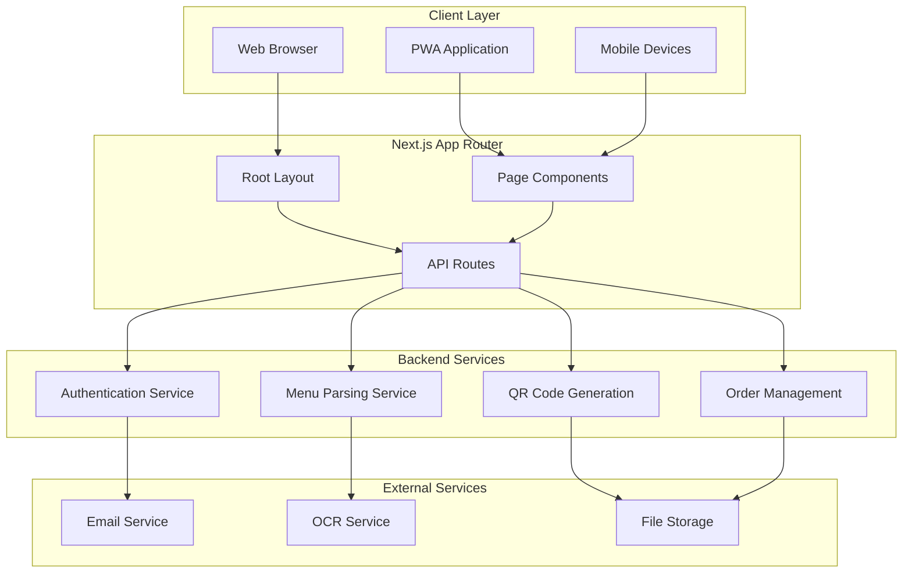
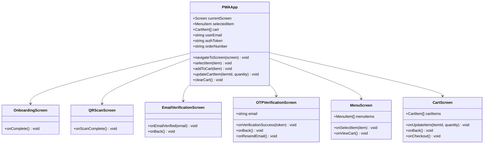
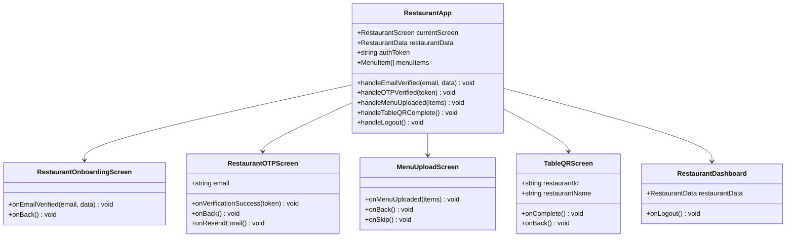
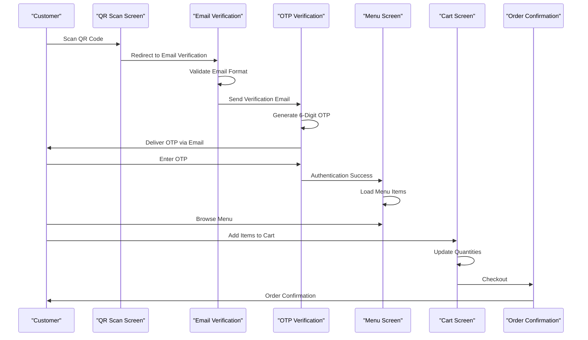
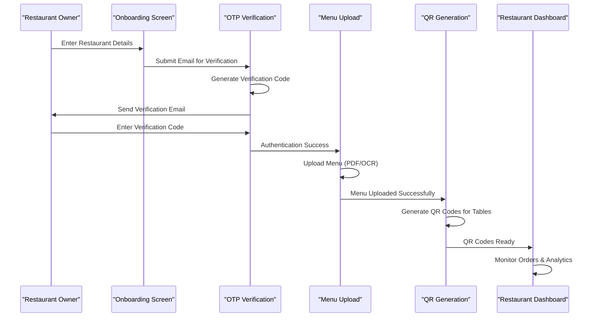
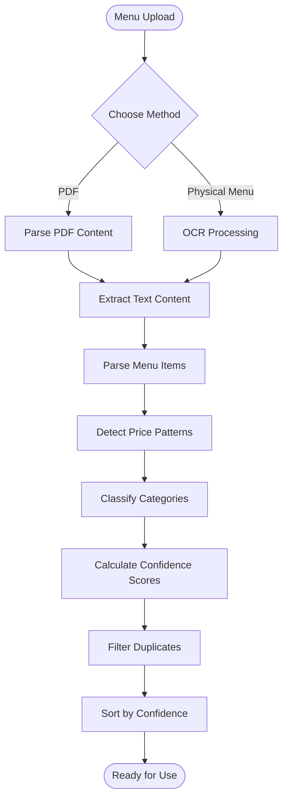
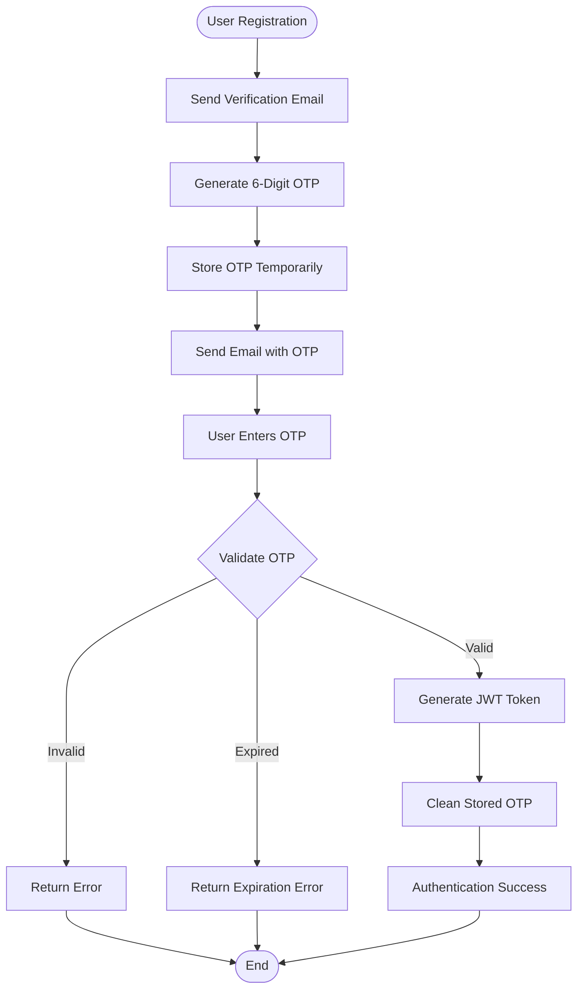
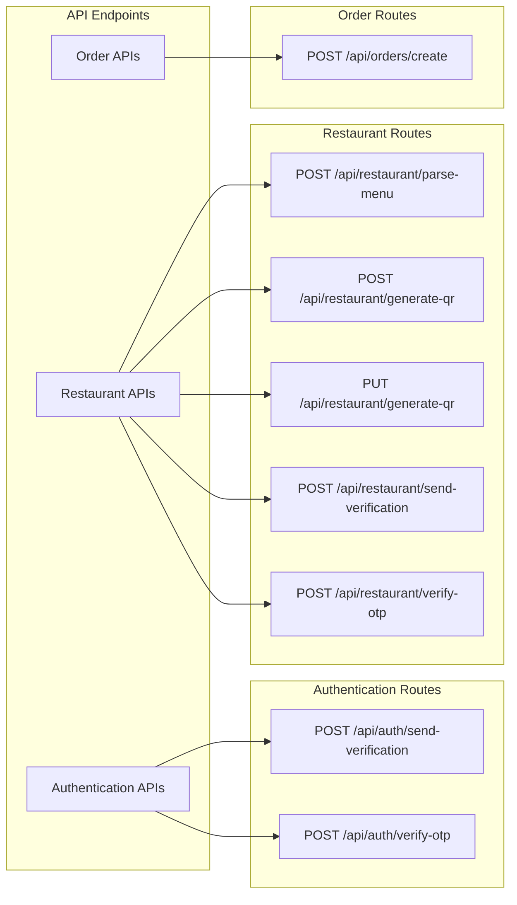
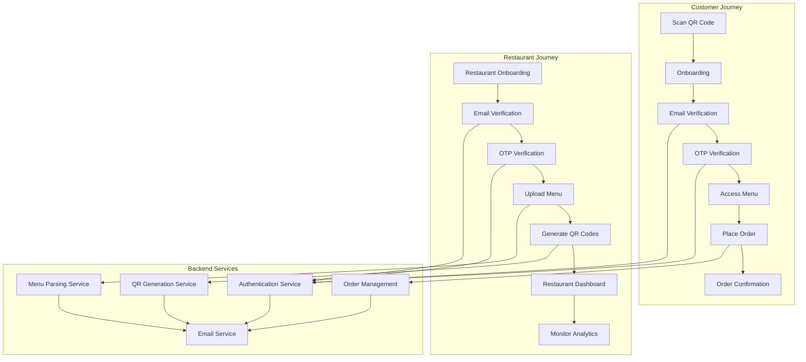

# MenuPRO - Digital Menu and Ordering System

<cite>
**Referenced Files in This Document**
- [README.md](file://README.md)
- [package.json](file://package.json)
- [src/app/layout.tsx](file://src/app/layout.tsx)
- [src/components/pwa-app.tsx](file://src/components/pwa-app.tsx)
- [src/components/restaurant/restaurant-app.tsx](file://src/components/restaurant/restaurant-app.tsx)
- [src/app/api/auth/send-verification/route.ts](file://src/app/api/auth/send-verification/route.ts)
- [src/app/api/auth/verify-otp/route.ts](file://src/app/api/auth/verify-otp/route.ts)
- [src/app/api/restaurant/generate-qr/route.ts](file://src/app/api/restaurant/generate-qr/route.ts)
- [src/app/api/restaurant/parse-menu/route.ts](file://src/app/api/restaurant/parse-menu/route.ts)
- [src/components/ui/button.tsx](file://src/components/ui/button.tsx)
- [src/components/hero.tsx](file://src/components/hero.tsx)
- [src/components/how-it-works.tsx](file://src/components/how-it-works.tsx)
</cite>

## Table of Contents
1. [Introduction](#introduction)
2. [System Architecture](#system-architecture)
3. [Core Components](#core-components)
4. [Dual-User Experience](#dual-user-experience)
5. [Key Features](#key-features)
6. [Technology Stack](#technology-stack)
7. [API Architecture](#api-architecture)
8. [Deployment and Scalability](#deployment-and-scalability)
9. [Integration Points](#integration-points)
10. [System Flow Diagram](#system-flow-diagram)
11. [Performance Considerations](#performance-considerations)
12. [Conclusion](#conclusion)

## Introduction

MenuPRO is a comprehensive digital menu and ordering system designed specifically for restaurants seeking to modernize their operations. The platform enables customers to order directly from their tables using QR codes, while providing restaurant owners with a powerful dashboard for managing menus, orders, and business analytics.

The system serves two primary user groups:
- **Customers**: Using a Progressive Web App (PWA) to scan QR codes, browse menus, customize orders, and complete transactions
- **Restaurants**: Utilizing a dedicated dashboard to manage menus, generate QR codes, track orders, and monitor business performance

MenuPRO positions itself as a cost-effective alternative to traditional restaurant management systems like Square and Toast, offering flat-rate pricing at $19/month with no commission fees, compared to the $69+/month and $79+/month pricing of competitors.

## System Architecture

MenuPRO follows a modern full-stack architecture built on Next.js 14 with App Router, utilizing TypeScript for type safety and Tailwind CSS for styling. The system is designed as a single-page application (SPA) with progressive web app capabilities.

**Diagram sources**
- [src/app/layout.tsx](file://src/app/layout.tsx#L1-L70)
- [src/components/pwa-app.tsx](file://src/components/pwa-app.tsx#L1-L154)
- [src/components/restaurant/restaurant-app.tsx](file://src/components/restaurant/restaurant-app.tsx#L1-L134)

**Section sources**
- [README.md](file://README.md#L1-L93)
- [package.json](file://package.json#L1-L89)

## Core Components

### Progressive Web App (PWA) Components

The customer-facing interface is built around a sophisticated PWA architecture that provides seamless ordering experiences:

**Diagram sources**
- [src/components/pwa-app.tsx](file://src/components/pwa-app.tsx#L10-L154)

### Restaurant Dashboard Components

The restaurant management interface provides comprehensive tools for menu management and business operations:

**Diagram sources**
- [src/components/restaurant/restaurant-app.tsx](file://src/components/restaurant/restaurant-app.tsx#L15-L134)

**Section sources**
- [src/components/pwa-app.tsx](file://src/components/pwa-app.tsx#L1-L154)
- [src/components/restaurant/restaurant-app.tsx](file://src/components/restaurant/restaurant-app.tsx#L1-L134)

## Dual-User Experience

MenuPRO provides distinct user experiences tailored to each stakeholder group:

### Customer Experience Flow

The customer journey begins with QR code scanning and progresses through a streamlined ordering process:

**Diagram sources**
- [src/components/pwa-app.tsx](file://src/components/pwa-app.tsx#L40-L154)

### Restaurant Experience Flow

Restaurant operators follow a structured onboarding and management workflow:

**Diagram sources**
- [src/components/restaurant/restaurant-app.tsx](file://src/components/restaurant/restaurant-app.tsx#L40-L134)

**Section sources**
- [src/components/pwa-app.tsx](file://src/components/pwa-app.tsx#L40-L154)
- [src/components/restaurant/restaurant-app.tsx](file://src/components/restaurant/restaurant-app.tsx#L40-L134)

## Key Features

### Menu Parsing and Management

MenuPRO offers advanced menu parsing capabilities through multiple methods:

1. **PDF Parsing**: Direct extraction of menu data from PDF documents
2. **OCR Processing**: Optical Character Recognition for physical menu images
3. **AI-Powered Classification**: Automatic categorization of menu items
4. **Confidence Scoring**: Intelligent assessment of parsing accuracy

**Diagram sources**
- [src/app/api/restaurant/parse-menu/route.ts](file://src/app/api/restaurant/parse-menu/route.ts#L1-L152)

### QR Code Generation

The system provides comprehensive QR code generation capabilities:

- **Individual QR Codes**: Generate QR codes for specific tables
- **Bulk Generation**: Create QR codes for multiple tables simultaneously
- **Dynamic URLs**: Embed restaurant and table information in QR codes
- **Customizable Appearance**: Configurable colors and dimensions

### Authentication System

MenuPRO implements a robust authentication system using email verification and OTP:

**Diagram sources**
- [src/app/api/auth/verify-otp/route.ts](file://src/app/api/auth/verify-otp/route.ts#L1-L78)

**Section sources**
- [src/app/api/restaurant/parse-menu/route.ts](file://src/app/api/restaurant/parse-menu/route.ts#L1-L152)
- [src/app/api/restaurant/generate-qr/route.ts](file://src/app/api/restaurant/generate-qr/route.ts#L1-L98)
- [src/app/api/auth/verify-otp/route.ts](file://src/app/api/auth/verify-otp/route.ts#L1-L78)

## Technology Stack

MenuPRO leverages a modern, battle-tested technology stack:

### Frontend Technologies
- **Framework**: Next.js 14 with App Router for optimal routing and performance
- **Language**: TypeScript for enhanced type safety and developer experience
- **Styling**: Tailwind CSS for utility-first responsive design
- **UI Components**: Radix UI for accessible, customizable components
- **Icons**: Lucide React for modern, consistent iconography
- **State Management**: React hooks for efficient state handling

### Backend Technologies
- **Authentication**: JWT tokens for secure session management
- **Email Services**: Nodemailer with Gmail SMTP for reliable email delivery
- **OCR Processing**: Tesseract.js for optical character recognition
- **QR Code Generation**: QRCode library for dynamic QR code creation
- **PDF Processing**: PDF.js for PDF content extraction

### Development Tools
- **Testing**: Jest with React Testing Library for comprehensive testing
- **Linting**: ESLint with Next.js configuration for code quality
- **Build Tools**: Next.js build system with optimized production bundles

**Section sources**
- [package.json](file://package.json#L1-L89)
- [README.md](file://README.md#L15-L25)

## API Architecture

MenuPRO implements a clean API architecture using Next.js App Router's API routes:

**Diagram sources**
- [src/app/api/auth/send-verification/route.ts](file://src/app/api/auth/send-verification/route.ts#L1-L98)
- [src/app/api/auth/verify-otp/route.ts](file://src/app/api/auth/verify-otp/route.ts#L1-L78)
- [src/app/api/restaurant/generate-qr/route.ts](file://src/app/api/restaurant/generate-qr/route.ts#L1-L98)

**Section sources**
- [src/app/api/auth/send-verification/route.ts](file://src/app/api/auth/send-verification/route.ts#L1-L98)
- [src/app/api/auth/verify-otp/route.ts](file://src/app/api/auth/verify-otp/route.ts#L1-L78)
- [src/app/api/restaurant/generate-qr/route.ts](file://src/app/api/restaurant/generate-qr/route.ts#L1-L98)
- [src/app/api/restaurant/parse-menu/route.ts](file://src/app/api/restaurant/parse-menu/route.ts#L1-L152)

## Deployment and Scalability

MenuPRO is designed for cloud-native deployment and horizontal scaling:

### Deployment Targets
- **Vercel**: Optimized for Next.js applications with automatic deployments
- **Netlify**: Alternative static site hosting with serverless functions
- **Node.js Hosting**: Compatible with any Node.js hosting provider
- **Docker**: Containerized deployment for enterprise environments

### Scalability Considerations
- **Stateless Architecture**: All API endpoints are stateless for easy scaling
- **CDN Integration**: Static assets served through global CDN networks
- **Database Flexibility**: Can integrate with various database backends
- **Load Balancing**: Horizontal scaling support for increased traffic

### Performance Optimization
- **Static Site Generation**: Pre-rendered pages for optimal loading speeds
- **Server-Side Rendering**: Dynamic content rendering for personalized experiences
- **Image Optimization**: Automatic image compression and format optimization
- **Code Splitting**: Dynamic imports for improved initial load times

## Integration Points

### Email Services
MenuPRO integrates with Gmail SMTP for reliable email delivery:

- **Verification Emails**: Secure account activation and login verification
- **Order Notifications**: Real-time order confirmations and updates
- **Marketing Campaigns**: Automated promotional emails and newsletters
- **Support Communication**: Customer service and technical support emails

### Third-Party Libraries
- **Tesseract.js**: Advanced OCR capabilities for menu parsing
- **QRCode**: Robust QR code generation with customization options
- **PDF.js**: Comprehensive PDF parsing and text extraction
- **React Hook Form**: Efficient form handling and validation

### External Dependencies
- **Lucide React**: Modern icon library for consistent visual design
- **Radix UI**: Accessible, composable UI component primitives
- **Recharts**: Interactive charts and data visualization
- **Embla Carousel**: Touch-friendly carousel components

**Section sources**
- [src/app/api/auth/send-verification/route.ts](file://src/app/api/auth/send-verification/route.ts#L10-L20)
- [package.json](file://package.json#L10-L50)

## System Flow Diagram

The complete system flow illustrates the interaction between all components:

**Diagram sources**
- [src/components/pwa-app.tsx](file://src/components/pwa-app.tsx#L40-L154)
- [src/components/restaurant/restaurant-app.tsx](file://src/components/restaurant/restaurant-app.tsx#L40-L134)
- [src/app/api/auth/send-verification/route.ts](file://src/app/api/auth/send-verification/route.ts#L1-L98)

## Performance Considerations

### Client-Side Performance
- **Progressive Loading**: Components load progressively for faster perceived performance
- **Image Lazy Loading**: Images load only when needed to improve initial page load
- **Optimized Fonts**: Web fonts loaded asynchronously to prevent blocking renders
- **Minimal Bundle Size**: Tree shaking and code splitting reduce JavaScript payload

### Server-Side Performance
- **Edge Computing**: API routes can be deployed to edge locations for reduced latency
- **Caching Strategies**: Intelligent caching of frequently accessed data
- **Connection Pooling**: Efficient database connection management
- **Resource Optimization**: Compressed responses and optimized asset delivery

### Mobile Optimization
- **Touch-Friendly Interfaces**: Large touch targets and intuitive gestures
- **Offline Capability**: PWA features enable offline browsing and ordering
- **Responsive Design**: Adaptive layouts for all screen sizes
- **Battery Efficiency**: Optimized resource usage to minimize battery drain

## Conclusion

MenuPRO represents a comprehensive solution for modern restaurant operations, combining cutting-edge technology with practical business needs. The system's dual-user architecture effectively serves both customers and restaurant operators, while its robust feature set addresses the key challenges of digital menu adoption.

Key strengths of the MenuPRO system include:

- **Cost-Effectiveness**: Affordable flat-rate pricing eliminating commission fees
- **Ease of Use**: Intuitive interfaces for both customers and restaurant staff
- **Scalability**: Cloud-native architecture supporting growth and expansion
- **Reliability**: Robust authentication and error handling mechanisms
- **Flexibility**: Multiple integration options and extensibility points

The platform's modern technology stack ensures maintainability and future-proofing, while its comprehensive feature set positions it as a viable alternative to expensive traditional restaurant management systems. By focusing on the customer experience and empowering restaurant operators with powerful tools, MenuPRO delivers significant value across the entire dining ecosystem.

For new developers and stakeholders, MenuPRO offers an excellent foundation for understanding modern full-stack development practices, demonstrating how thoughtful architecture and user-centered design can create impactful business solutions.