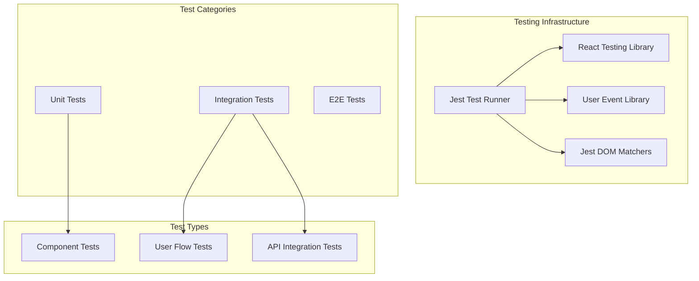
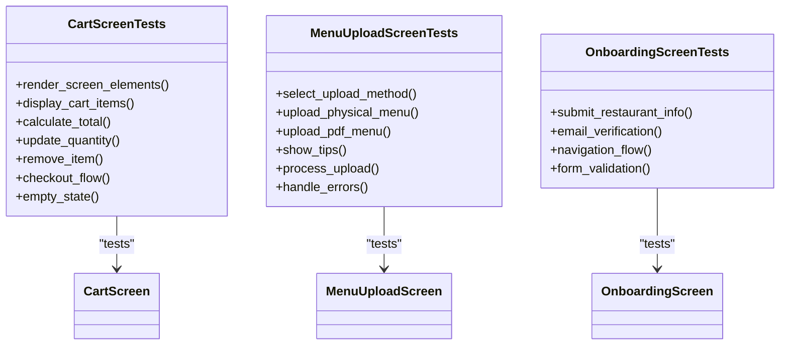
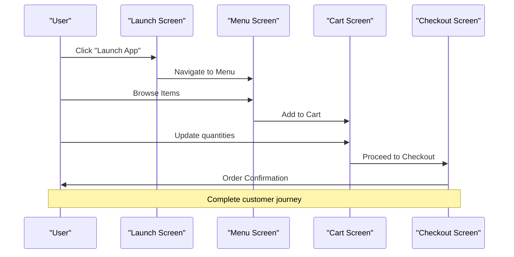

# Testing Strategy for MenuPRO-App-main

<cite>
**Referenced Files in This Document**
- [jest.config.js](file://jest.config.js)
- [jest.setup.js](file://jest.setup.js)
- [src/__tests__/test-utils.tsx](file://src/__tests__/test-utils.tsx)
- [src/__tests__/customer/cart-screen.test.tsx](file://src/__tests__/customer/cart-screen.test.tsx)
- [src/__tests__/integration/customer-flow.test.tsx](file://src/__tests__/integration/customer-flow.test.tsx)
- [src/__tests__/integration/restaurant-flow.test.tsx](file://src/__tests__/integration/restaurant-flow.test.tsx)
- [src/__tests__/restaurant/menu-upload-screen.test.tsx](file://src/__tests__/restaurant/menu-upload-screen.test.tsx)
- [package.json](file://package.json)
- [tsconfig.json](file://tsconfig.json)
</cite>

## Table of Contents
1. [Introduction](#introduction)
2. [Testing Framework Overview](#testing-framework-overview)
3. [Test Configuration](#test-configuration)
4. [Test Utilities and Setup](#test-utilities-and-setup)
5. [Unit Testing Strategy](#unit-testing-strategy)
6. [Integration Testing Strategy](#integration-testing-strategy)
7. [Mocking Strategies](#mocking-strategies)
8. [Test Coverage and Quality](#test-coverage-and-quality)
9. [CI/CD Integration](#cicd-integration)
10. [Best Practices and Common Pitfalls](#best-practices-and-common-pitfalls)
11. [Accessibility and Performance Testing](#accessibility-and-performance-testing)
12. [Conclusion](#conclusion)

## Introduction

MenuPRO-App-main employs a comprehensive testing strategy built around Jest as the primary test runner, complemented by React Testing Library for component testing and custom test utilities. The testing framework is designed to ensure robust quality assurance across multiple user personas including customers, restaurant owners, and administrators.

The testing architecture encompasses unit tests for individual components, integration tests for complete user flows, and specialized restaurant-specific scenarios. This multi-layered approach ensures comprehensive coverage while maintaining test maintainability and reliability.

## Testing Framework Overview

The testing infrastructure is built on modern JavaScript testing standards with Next.js-specific optimizations:



**Section sources**
- [jest.config.js](file://jest.config.js#L1-L27)
- [package.json](file://package.json#L40-L45)

## Test Configuration

The Jest configuration is specifically tailored for Next.js applications with TypeScript support:

```javascript
// Key configuration aspects
const customJestConfig = {
  setupFilesAfterEnv: ['<rootDir>/jest.setup.js'],
  testEnvironment: 'jsdom',
  moduleNameMapping: {
    '^@/(.*)$': '<rootDir>/src/$1',
    '^@ui/(.*)$': '<rootDir>/src/components/ui/$1',
    '^@components/(.*)$': '<rootDir>/src/components/$1',
  },
  collectCoverageFrom: [
    'src/**/*.{js,jsx,ts,tsx}',
    '!src/**/*.d.ts',
    '!src/**/*.stories.{js,jsx,ts,tsx}',
  ],
}
```

**Key Features:**
- **JS DOM Environment**: Ensures compatibility with React Testing Library
- **Module Path Resolution**: Supports Next.js alias imports (`@/`, `@ui/`, `@components/`)
- **Coverage Collection**: Targets all source files except TypeScript declarations and Storybook stories
- **Setup Integration**: Loads custom test utilities and mocks

**Section sources**
- [jest.config.js](file://jest.config.js#L8-L26)

## Test Utilities and Setup

The testing framework includes sophisticated utilities that handle common testing scenarios:

### Custom Render Provider

The `test-utils.tsx` file provides a comprehensive testing environment:

```typescript
const AllTheProviders = ({ children }: { children: React.ReactNode }) => {
  return (
    <NextIntlClientProvider locale="en" messages={{}}>
      {children}
    </NextIntlClientProvider>
  )
}
```

### Essential Mocks

Critical mocks are established to simulate Next.js ecosystem:

```javascript
// Next.js Image component mock
jest.mock('next/image', () => ({
  __esModule: true,
  default: (props) => 
}))

// Next.js router mock
jest.mock('next/navigation', () => ({
  useRouter: () => ({
    push: jest.fn(),
    replace: jest.fn(),
    prefetch: jest.fn(),
    back: jest.fn(),
    forward: jest.fn(),
    refresh: jest.fn(),
  }),
  useSearchParams: () => new URLSearchParams(),
  usePathname: () => '/',
}))
```

### Global Mocks

Additional global mocks ensure consistent testing environment:

```javascript
// Fetch API mock
global.fetch = jest.fn()

// Window matchMedia mock
Object.defineProperty(window, 'matchMedia', {
  writable: true,
  value: jest.fn().mockImplementation(query => ({
    matches: false,
    media: query,
    onchange: null,
    addEventListener: jest.fn(),
    removeEventListener: jest.fn(),
    dispatchEvent: jest.fn(),
  })),
})
```

**Section sources**
- [src/__tests__/test-utils.tsx](file://src/__tests__/test-utils.tsx#L1-L74)
- [jest.setup.js](file://jest.setup.js#L1-L57)

## Unit Testing Strategy

Unit tests focus on individual components and their isolated functionality:

### Component-Level Testing

Individual screen components receive dedicated test suites:



**Diagram sources**
- [src/__tests__/customer/cart-screen.test.tsx](file://src/__tests__/customer/cart-screen.test.tsx#L1-L50)
- [src/__tests__/restaurant/menu-upload-screen.test.tsx](file://src/__tests__/restaurant/menu-upload-screen.test.tsx#L1-L50)

### Test Structure Patterns

Each unit test follows a consistent AAA (Arrange-Act-Assert) pattern:

```typescript
describe('Cart Screen', () => {
  beforeEach(() => {
    jest.clearAllMocks()
  })

  it('renders the cart screen with all elements', () => {
    // Arrange: Set up test data and mocks
    const mockCartItems = [...]
    
    // Act: Render the component
    render(<CartScreen cartItems={mockCartItems} />)
    
    // Assert: Verify expectations
    expect(screen.getByText('Your Cart')).toBeInTheDocument()
  })
})
```

### Comprehensive Component Testing

Tests cover various aspects of component behavior:

1. **Rendering Verification**: Ensures all UI elements appear correctly
2. **State Management**: Tests component state updates and prop changes
3. **Event Handling**: Validates user interactions and callbacks
4. **Conditional Rendering**: Tests different UI states (empty, loading, error)
5. **Accessibility**: Verifies ARIA attributes and keyboard navigation

**Section sources**
- [src/__tests__/customer/cart-screen.test.tsx](file://src/__tests__/customer/cart-screen.test.tsx#L1-L241)

## Integration Testing Strategy

Integration tests validate complete user flows across multiple components:

### Customer Flow Testing

The customer ordering flow demonstrates comprehensive integration:



**Diagram sources**
- [src/__tests__/integration/customer-flow.test.tsx](file://src/__tests__/integration/customer-flow.test.tsx#L1-L35)

### Restaurant Flow Testing

Restaurant onboarding and management flows are thoroughly tested:

```typescript
// Restaurant app mock
jest.mock('@/components/restaurant/restaurant-app', () => ({
  RestaurantApp: ({ onRestaurantSubmit, onEmailSubmit, onBack }: any) => (
    <div data-testid="restaurant-app">
      <button onClick={() => onRestaurantSubmit({ name: 'Test Restaurant' })}>
        Submit Restaurant
      </button>
      <button onClick={() => onEmailSubmit('test@restaurant.com')}>
        Submit Email
      </button>
      <button onClick={onBack}>Back</button>
    </div>
  )
}))
```

### Cross-Component Communication

Integration tests verify:
- **Prop Drilling**: Data flow through component hierarchy
- **State Synchronization**: Consistent state across related components
- **Navigation**: Smooth transitions between application views
- **API Integration**: Real-world data fetching and processing

**Section sources**
- [src/__tests__/integration/customer-flow.test.tsx](file://src/__tests__/integration/customer-flow.test.tsx#L1-L35)
- [src/__tests__/integration/restaurant-flow.test.tsx](file://src/__tests__/integration/restaurant-flow.test.tsx#L1-L101)

## Mocking Strategies

The testing framework employs sophisticated mocking to isolate components:

### API Call Mocking

```javascript
// Global fetch mock for API testing
global.fetch = jest.fn()

// Example usage in tests
fetch.mockResolvedValueOnce({
  ok: true,
  json: () => Promise.resolve(mockApiResponse),
})
```

### Component Mocking

Next.js components are mocked to prevent rendering complexities:

```javascript
// Image component mocking
jest.mock('next/image', () => ({
  __esModule: true,
  default: (props) => 
}))

// Router mocking for navigation testing
jest.mock('next/navigation', () => ({
  useRouter: () => mockRouter,
  useSearchParams: () => new URLSearchParams(),
  usePathname: () => '/',
}))
```

### Third-Party Library Mocking

Complex libraries are mocked to maintain test stability:

```javascript
// Intersection Observer mock for lazy loading
global.IntersectionObserver = class IntersectionObserver {
  constructor() {}
  disconnect() {}
  observe() {}
  unobserve() {}
}
```

### Mock Strategy Benefits

1. **Isolation**: Tests focus on component logic, not external dependencies
2. **Speed**: Faster test execution without network calls
3. **Reliability**: Consistent results regardless of external factors
4. **Maintainability**: Easy to update mocks when APIs change

**Section sources**
- [jest.setup.js](file://jest.setup.js#L1-L57)
- [src/__tests__/test-utils.tsx](file://src/__tests__/test-utils.tsx#L1-L74)

## Test Coverage and Quality

The testing strategy emphasizes comprehensive coverage with specific targets:

### Coverage Collection Configuration

```javascript
collectCoverageFrom: [
  'src/**/*.{js,jsx,ts,tsx}',
  '!src/**/*.d.ts',
  '!src/**/*.stories.{js,jsx,ts,tsx}',
]
```

### Coverage Metrics

The framework tracks:
- **Line Coverage**: Percentage of code lines executed
- **Branch Coverage**: Conditional statement coverage
- **Function Coverage**: Individual function execution
- **Statement Coverage**: Basic code statement execution

### Quality Assurance

1. **Snapshot Testing**: Captures component rendering consistency
2. **Regression Detection**: Identifies breaking changes early
3. **Performance Monitoring**: Tracks test execution speed
4. **Code Quality**: Enforces testing standards

### Continuous Improvement

Regular coverage analysis helps identify:
- **Untested Areas**: New features requiring test development
- **Dead Code**: Unused or redundant test code
- **Edge Cases**: Uncovered scenarios requiring additional tests

## CI/CD Integration

The testing framework integrates seamlessly with continuous integration pipelines:

### Available Scripts

```json
{
  "scripts": {
    "test": "jest",
    "test:watch": "jest --watch",
    "test:coverage": "jest --coverage"
  }
}
```

### CI Pipeline Integration

1. **Automated Testing**: Tests run on every code commit
2. **Coverage Reporting**: Generates detailed coverage reports
3. **Parallel Execution**: Multiple test suites run concurrently
4. **Failure Notifications**: Immediate alerts for test failures

### Test Execution Strategies

- **Development Mode**: Watch mode for rapid feedback
- **Production Mode**: Full test suite execution
- **Coverage Mode**: Detailed coverage analysis
- **Selective Testing**: Targeted test execution for specific changes

**Section sources**
- [package.json](file://package.json#L40-L45)

## Best Practices and Common Pitfalls

### Recommended Testing Practices

1. **Descriptive Test Names**: Clear, meaningful test descriptions
2. **Single Responsibility**: Each test focuses on one behavior
3. **Consistent Setup**: Shared setup code in `beforeEach` blocks
4. **Clear Assertions**: Specific, actionable test expectations

### Common Testing Pitfalls

1. **Over-Mocking**: Excessive mocking hides real component behavior
2. **Async Testing**: Inadequate handling of asynchronous operations
3. **Memory Leaks**: Not clearing mocks between tests
4. **Flaky Tests**: Tests that pass inconsistently due to timing issues

### Anti-Patterns to Avoid

```typescript
// ❌ Bad: Unclear test names
it('should work', () => { /* ... */ })

// ✅ Good: Descriptive test names
it('renders the cart screen with all elements', () => { /* ... */ })

// ❌ Bad: Multiple assertions
it('does multiple things', () => {
  expect(screen.getByText('A')).toBeInTheDocument()
  expect(screen.getByText('B')).toBeInTheDocument()
  expect(screen.getByText('C')).toBeInTheDocument()
})

// ✅ Good: Single responsibility
it('renders the cart screen with all elements', () => { /* ... */ })
it('displays cart items correctly', () => { /* ... */ })
```

### Test Maintenance

1. **Regular Updates**: Keep tests synchronized with component changes
2. **Refactoring**: Improve test readability and maintainability
3. **Documentation**: Comment complex test scenarios
4. **Review Process**: Peer review of test code alongside feature code

## Accessibility and Performance Testing

### Accessibility Testing Integration

The testing framework incorporates accessibility considerations:

```javascript
// Role-based element queries
expect(screen.getByRole('button', { name: /Back/i })).toBeInTheDocument()

// Form element queries
expect(screen.getByLabelText('Quantity')).toBeInTheDocument()

// Focus management testing
await user.tab()
```

### Performance Regression Detection

1. **Test Execution Timing**: Monitor test performance trends
2. **Memory Usage**: Track memory consumption during tests
3. **Bundle Size Impact**: Measure test bundle size effects
4. **CI Performance**: Optimize test execution in automated environments

### Snapshot Testing

Used for regression detection:

```typescript
// Snapshot comparison
expect(container.firstChild).toMatchSnapshot()

// Custom snapshot serializers for complex objects
```

### Performance Monitoring

```javascript
// Test execution timing
console.time('test-execution')
// ... test code
console.timeEnd('test-execution')

// Memory usage monitoring
const initialMemory = process.memoryUsage()
// ... test code
const finalMemory = process.memoryUsage()
```

## Conclusion

The MenuPRO-App-main testing strategy provides a robust foundation for maintaining code quality and ensuring reliable functionality across multiple user personas. By leveraging Jest, React Testing Library, and custom utilities, the framework achieves comprehensive coverage while maintaining test maintainability.

Key strengths of the testing approach include:

- **Comprehensive Coverage**: Unit tests, integration tests, and specialized scenarios
- **Modern Tooling**: Up-to-date testing libraries and configurations
- **Developer-Friendly**: Clear patterns and extensive documentation
- **Scalable Architecture**: Modular test organization supporting future growth

The testing framework successfully balances thoroughness with practicality, enabling rapid development cycles while maintaining high quality standards. Regular maintenance and adherence to best practices ensure the testing infrastructure remains effective as the application evolves.

Future enhancements could include expanded E2E testing, advanced visual regression testing, and enhanced performance benchmarking to further strengthen the quality assurance capabilities.