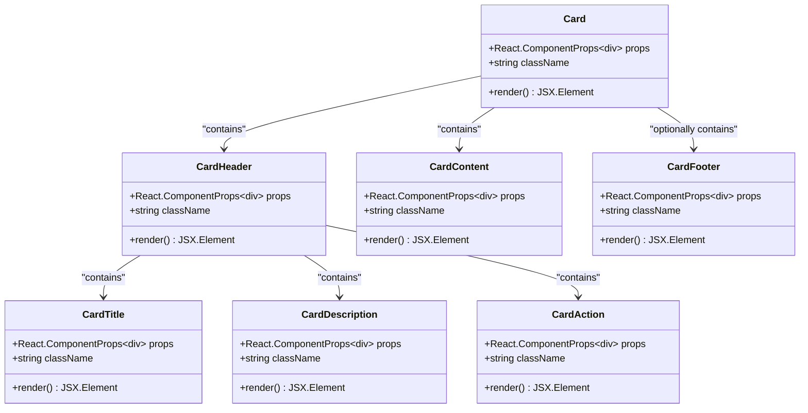

# Card Component

<cite>
**Referenced Files in This Document**
- [src/components/ui/card.tsx](file://src/components/ui/card.tsx)
- [src/components/ui/utils.ts](file://src/components/ui/utils.ts)
- [src/components/ui/button.tsx](file://src/components/ui/button.tsx)
- [src/components/ui/badge.tsx](file://src/components/ui/badge.tsx)
- [src/components/figma/ImageWithFallback.tsx](file://src/components/figma/ImageWithFallback.tsx)
- [src/components/pwa/menu-screen.tsx](file://src/components/pwa/menu-screen.tsx)
- [src/components/restaurant/restaurant-dashboard.tsx](file://src/components/restaurant/restaurant-dashboard.tsx)
- [tailwind.config.ts](file://tailwind.config.ts)
- [src/app/globals.css](file://src/app/globals.css)
- [package.json](file://package.json)
</cite>

## Table of Contents
1. [Introduction](#introduction)
2. [Component Architecture](#component-architecture)
3. [Core Component Structure](#core-component-structure)
4. [Styling System](#styling-system)
5. [Composition Patterns](#composition-patterns)
6. [Usage Examples](#usage-examples)
7. [Accessibility Implementation](#accessibility-implementation)
8. [Performance Optimization](#performance-optimization)
9. [Customization Guide](#customization-guide)
10. [Best Practices](#best-practices)
11. [Troubleshooting](#troubleshooting)

## Introduction

The Card component is a foundational UI container in the MenuPRO-App-main application, designed to group related content in a visually appealing and accessible manner. Built with React and Tailwind CSS, it follows modern design principles and provides a flexible foundation for displaying various types of content across the application.

The Card component serves as a versatile building block for the MenuPRO application, appearing prominently in both customer-facing menu screens and restaurant dashboard interfaces. It encapsulates the concept of content containers with structured layouts, semantic markup, and responsive behavior.

## Component Architecture

The Card component follows a modular architecture pattern with six distinct sub-components, each serving a specific role in content organization:



**Diagram sources**
- [src/components/ui/card.tsx](file://src/components/ui/card.tsx#L1-L93)

**Section sources**
- [src/components/ui/card.tsx](file://src/components/ui/card.tsx#L1-L93)

## Core Component Structure

### Base Card Component

The main Card component serves as the container wrapper with essential styling and accessibility attributes:

```typescript
function Card({ className, ...props }: React.ComponentProps<"div">) {
  return (
    <div
      data-slot="card"
      className={cn(
        "bg-card text-card-foreground flex flex-col gap-6 rounded-xl border",
        className,
      )}
      {...props}
    />
  );
}
```

Key characteristics:
- **Semantic Data Attribute**: Uses `data-slot="card"` for testing and accessibility identification
- **Flexible Layout**: Implements `flex flex-col` for vertical content arrangement
- **Consistent Spacing**: Maintains `gap-6` between child elements
- **Border System**: Includes `border` for visual separation
- **Color System**: Leverages Tailwind's card color palette

### CardHeader Component

The CardHeader provides a structured header area with support for title, description, and action elements:

```typescript
function CardHeader({ className, ...props }: React.ComponentProps<"div">) {
  return (
    <div
      data-slot="card-header"
      className={cn(
        "@container/card-header grid auto-rows-min grid-rows-[auto_auto] items-start gap-1.5 px-6 pt-6 has-data-[slot=card-action]:grid-cols-[1fr_auto] [.border-b]:pb-6",
        className,
      )}
      {...props}
    />
  );
}
```

Advanced features:
- **Container Queries**: Uses `@container` for responsive behavior
- **Grid Layout**: Implements `grid` with automatic row sizing
- **Conditional Styling**: Adjusts layout based on presence of actions
- **Padding System**: Provides consistent spacing with `px-6 pt-6`

### CardTitle Component

The CardTitle component handles hierarchical text content with semantic HTML:

```typescript
function CardTitle({ className, ...props }: React.ComponentProps<"div">) {
  return (
    <h4
      data-slot="card-title"
      className={cn("leading-none", className)}
      {...props}
    />
  );
}
```

Features:
- **Semantic HTML**: Renders as `<h4>` for proper heading hierarchy
- **Typography Control**: Uses `leading-none` for tight text spacing
- **Accessibility**: Maintains semantic importance for screen readers

**Section sources**
- [src/components/ui/card.tsx](file://src/components/ui/card.tsx#L5-L93)

## Styling System

### Tailwind CSS Integration

The Card component leverages a sophisticated Tailwind CSS configuration that integrates seamlessly with the application's design system:

```typescript
// Tailwind configuration extends
colors: {
  card: {
    DEFAULT: 'var(--card)',
    foreground: 'var(--card-foreground)',
  },
  // ... other color definitions
},
borderRadius: {
  lg: 'var(--radius)',
  md: 'calc(var(--radius) - 2px)',
  sm: 'calc(var(--radius) - 4px)',
}
```

### Color Variables

The component utilizes CSS custom properties for consistent theming:

```css
:root {
  --card: #fff;
  --card-foreground: oklch(.145 0 0);
  --radius: .625rem;
}

.dark {
  --card: oklch(.145 0 0);
  --card-foreground: oklch(.985 0 0);
}
```

### Responsive Behavior

The Card component implements responsive design through:

1. **Container Queries**: Adaptive layouts based on container size
2. **Breakpoint Awareness**: Tailwind's responsive prefixes
3. **Mobile Optimization**: Touch-friendly spacing and sizing
4. **Accessibility**: Proper contrast ratios across themes

**Section sources**
- [tailwind.config.ts](file://tailwind.config.ts#L1-L68)
- [src/app/globals.css](file://src/app/globals.css#L1-L91)

## Composition Patterns

### Button Integration

The Card component frequently composes with the Button component for interactive elements:

```typescript
<Card>
  <CardContent className="p-0">
    <div className="flex">
      <ImageWithFallback
        src={item.image}
        alt={item.name}
        className="w-24 h-24 object-cover flex-shrink-0"
      />
      <div className="flex-1 p-4">
        <div className="flex justify-between items-start mb-2">
          <h3 className="font-semibold text-gray-900">{item.name}</h3>
          <span className="text-lg font-bold text-orange-600">${item.price}</span>
        </div>
        <p className="text-sm text-gray-600 mb-3 line-clamp-2">{item.description}</p>
        <Button 
          onClick={() => onSelectItem(item)}
          size="sm"
          className="bg-orange-600 hover:bg-orange-700 text-white rounded-full px-4"
        >
          <Plus className="w-4 h-4 mr-1" />
          Add
        </Button>
      </div>
    </div>
  </CardContent>
</Card>
```

### Badge Integration

Cards often incorporate badges for status indicators:

```typescript
<div className="flex items-center space-x-3 mb-2">
  <h3 className="text-lg font-semibold">Order #{order.id}</h3>
  <Badge className={getStatusColor(order.status)}>
    {getStatusIcon(order.status)}
    <span className="ml-1 capitalize">{order.status}</span>
  </Badge>
</div>
```

### ImageWithFallback Integration

The Card component works seamlessly with fallback image handling:

```typescript
<ImageWithFallback
  src={item.image}
  alt={item.name}
  className="w-24 h-24 object-cover flex-shrink-0"
/>
```

**Section sources**
- [src/components/pwa/menu-screen.tsx](file://src/components/pwa/menu-screen.tsx#L190-L215)
- [src/components/restaurant/restaurant-dashboard.tsx](file://src/components/restaurant/restaurant-dashboard.tsx#L250-L270)
- [src/components/ui/button.tsx](file://src/components/ui/button.tsx#L1-L59)
- [src/components/ui/badge.tsx](file://src/components/ui/badge.tsx#L1-L47)
- [src/components/figma/ImageWithFallback.tsx](file://src/components/figma/ImageWithFallback.tsx#L1-L30)

## Usage Examples

### Menu Screen Integration

The Card component appears extensively in the menu screen for displaying menu items:

```typescript
<Card key={item.id} className="overflow-hidden border-none shadow-sm bg-white/80 backdrop-blur-sm hover:shadow-md transition-shadow">
  <CardContent className="p-0">
    <div className="flex">
      <ImageWithFallback
        src={item.image}
        alt={item.name}
        className="w-24 h-24 object-cover flex-shrink-0"
      />
      <div className="flex-1 p-4">
        <div className="flex justify-between items-start mb-2">
          <h3 className="font-semibold text-gray-900">{item.name}</h3>
          <span className="text-lg font-bold text-orange-600">${item.price}</span>
        </div>
        <p className="text-sm text-gray-600 mb-3 line-clamp-2">{item.description}</p>
        <Button 
          onClick={() => onSelectItem(item)}
          size="sm"
          className="bg-orange-600 hover:bg-orange-700 text-white rounded-full px-4"
        >
          <Plus className="w-4 h-4 mr-1" />
          Add
        </Button>
      </div>
    </div>
  </CardContent>
</Card>
```

### Restaurant Dashboard Integration

In the restaurant dashboard, cards display analytics and order information:

```typescript
<Card key={order.id} className="border-l-4 border-l-orange-500">
  <CardContent className="p-6">
    <div className="flex justify-between items-start mb-4">
      <div>
        <div className="flex items-center space-x-3 mb-2">
          <h3 className="text-lg font-semibold">Order #{order.id}</h3>
          <Badge className={getStatusColor(order.status)}>
            {getStatusIcon(order.status)}
            <span className="ml-1 capitalize">{order.status}</span>
          </Badge>
        </div>
        <p className="text-sm text-gray-600">
          {order.customerEmail} • Table {order.tableNumber} • {formatTime(order.createdAt)}
        </p>
      </div>
      <div className="text-right">
        <p className="text-lg font-bold text-gray-900">${order.total.toFixed(2)}</p>
        <p className="text-sm text-gray-600">{order.estimatedTime}</p>
      </div>
    </div>
    {/* ... order details and controls */}
  </CardContent>
</Card>
```

### Statistics Card Pattern

Cards are used for displaying key metrics:

```typescript
<Card>
  <CardContent className="p-6">
    <div className="flex items-center">
      <div className="p-2 bg-blue-100 rounded-lg">
        <BarChart3 className="w-6 h-6 text-blue-600" />
      </div>
      <div className="ml-4">
        <p className="text-sm font-medium text-gray-600">Total Orders</p>
        <p className="text-2xl font-bold text-gray-900">{stats.totalOrders}</p>
      </div>
    </div>
  </CardContent>
</Card>
```

**Section sources**
- [src/components/pwa/menu-screen.tsx](file://src/components/pwa/menu-screen.tsx#L190-L215)
- [src/components/restaurant/restaurant-dashboard.tsx](file://src/components/restaurant/restaurant-dashboard.tsx#L250-L320)

## Accessibility Implementation

### Semantic Markup

The Card component implements proper semantic HTML structure:

```typescript
// CardHeader renders as div with semantic children
<div data-slot="card-header">
  <h4 data-slot="card-title">Title Content</h4>
  <p data-slot="card-description">Description Content</p>
  <div data-slot="card-action">Action Content</div>
</div>

// CardTitle uses semantic h4 element
<h4 data-slot="card-title" className="leading-none">...</h4>
```

### Focus Management

The component supports keyboard navigation and focus management through:

1. **Native Focus Handling**: Inherits focus behavior from underlying HTML elements
2. **Interactive Elements**: Buttons and other interactive elements receive focus
3. **Visual Indicators**: Clear focus outlines for keyboard navigation

### Screen Reader Support

Accessibility features include:

- **Data Attributes**: `data-slot` attributes for testing and assistive technology
- **Semantic Hierarchy**: Proper heading levels for content organization
- **Alternative Text**: Support for image descriptions through ImageWithFallback
- **ARIA Labels**: Extensible for additional accessibility attributes

### Color Contrast

The component maintains WCAG AA compliance through:

- **Color Variables**: Consistent color systems across light/dark themes
- **Contrast Ratios**: Ensures sufficient contrast for readability
- **Theme Adaptation**: Automatic color adaptation for dark mode

**Section sources**
- [src/components/ui/card.tsx](file://src/components/ui/card.tsx#L10-L15)
- [src/components/ui/card.tsx](file://src/components/ui/card.tsx#L20-L25)

## Performance Optimization

### Layout Stability

The Card component minimizes layout shifts through:

1. **Fixed Spacing**: Consistent padding and margin values
2. **Predictable Heights**: Container queries prevent unexpected resizing
3. **Image Optimization**: Lazy loading and fallback mechanisms
4. **CSS Containment**: Proper containment for layout isolation

### Rendering Performance

Optimization strategies include:

```typescript
// Efficient className merging
className={cn(
  "bg-card text-card-foreground flex flex-col gap-6 rounded-xl border",
  className,
)}

// Conditional rendering for actions
has-data-[slot=card-action]:grid-cols-[1fr_auto]
```

### Bundle Size Optimization

The component contributes to efficient bundle sizes through:

- **Tree Shaking**: Modular exports allow unused components to be eliminated
- **Minimal Dependencies**: Relies on lightweight Tailwind CSS utilities
- **Efficient Imports**: Selective imports from larger libraries

### PWA Considerations

Performance optimizations for Progressive Web Apps:

1. **Fast Initial Render**: Minimal initial JavaScript
2. **Offline Capability**: Static styling ensures offline usability
3. **Cache-Friendly**: CSS-in-JS patterns optimize caching
4. **Reduced Layout Thrashing**: Predictable DOM structure

**Section sources**
- [src/components/ui/card.tsx](file://src/components/ui/card.tsx#L8-L12)
- [src/components/ui/utils.ts](file://src/components/ui/utils.ts#L1-L7)

## Customization Guide

### Shadow Customization

The Card component supports extensive shadow customization:

```typescript
// Default shadow
<Card className="shadow-sm">

// Elevated shadow
<Card className="shadow-md">

// Custom shadow
<Card className="shadow-lg shadow-gray-200/50">

// No shadow
<Card className="shadow-none">
```

### Padding Variations

Flexible padding system allows various content arrangements:

```typescript
// Standard padding
<CardContent className="p-6">

// Reduced padding
<CardContent className="p-4">

// Custom padding
<CardContent className="px-8 py-4">

// Responsive padding
<CardContent className="p-4 sm:p-6">
```

### Border Customization

Border styling options for different visual contexts:

```typescript
// Default border
<Card className="border">

// No border
<Card className="border-0">

// Custom border
<Card className="border-2 border-orange-500">

// Rounded variations
<Card className="rounded-lg">

// Border radius customization
<Card className="rounded-t-none">
```

### Hover Effects

Interactive state management for enhanced user experience:

```typescript
// Default hover
<Card className="hover:shadow-md transition-shadow">

// Custom hover
<Card className="hover:scale-105 transition-transform duration-200">

// Background change on hover
<Card className="hover:bg-gray-50 transition-colors">
```

### Theme Integration

Seamless integration with the application's theming system:

```typescript
// Light theme override
<Card className="bg-white/80 backdrop-blur-sm">

// Dark theme variant
<Card className="bg-gray-800 text-white">

// Gradient backgrounds
<Card className="bg-gradient-to-br from-orange-50 to-red-50">
```

**Section sources**
- [src/components/pwa/menu-screen.tsx](file://src/components/pwa/menu-screen.tsx#L190-L195)
- [src/components/restaurant/restaurant-dashboard.tsx](file://src/components/restaurant/restaurant-dashboard.tsx#L250-L255)

## Best Practices

### Component Composition

Follow these patterns for optimal Card usage:

```typescript
// Recommended pattern
<Card>
  <CardHeader>
    <CardTitle>Title</CardTitle>
    <CardDescription>Description</CardDescription>
    <CardAction>Action</CardAction>
  </CardHeader>
  <CardContent>
    {/* Main content */}
  </CardContent>
  <CardFooter>
    {/* Footer content */}
  </CardFooter>
</Card>

// Alternative pattern
<Card>
  <CardHeader>
    <CardTitle>Title</CardTitle>
    <CardAction>Action</CardAction>
  </CardHeader>
  <CardContent>
    {/* Main content */}
  </CardContent>
</Card>
```

### Responsive Design

Implement responsive behavior effectively:

```typescript
// Mobile-first approach
<Card className="w-full sm:w-1/2 md:w-1/3">

// Container queries
<Card className="@container/card-header">
  <CardHeader className="grid @sm/card-header:grid-cols-[1fr_auto]">
    {/* Responsive layout */}
  </CardHeader>
</Card>
```

### Accessibility Guidelines

Maintain accessibility standards:

```typescript
// Semantic structure
<Card>
  <CardHeader>
    <CardTitle>Accessible Title</CardTitle>
    <CardDescription>Descriptive text</CardDescription>
  </CardHeader>
  <CardContent>
    {/* Meaningful content */}
  </CardContent>
</Card>

// Keyboard navigation
<Card className="focus-within:ring-2 focus-within:ring-blue-500">
  {/* Interactive elements */}
</Card>
```

### Performance Considerations

Optimize for performance:

```typescript
// Efficient className usage
<Card className={cn(
  "transition-shadow duration-200",
  condition && "hover:shadow-lg"
)}>

// Minimize re-renders
const memoizedCard = useMemo(() => (
  <Card>
    {/* Expensive content */}
  </Card>
), [dependencies]);
```

## Troubleshooting

### Common Issues and Solutions

#### Layout Shifts

**Problem**: Unexpected layout movement when content loads
**Solution**: Use container queries and fixed-height containers

```typescript
// Prevent layout shifts
<Card className="@container/card-header">
  <CardHeader className="grid @sm/card-header:grid-cols-[1fr_auto]">
    {/* Content */}
  </CardHeader>
</Card>
```

#### Color Inconsistencies

**Problem**: Colors don't match theme
**Solution**: Verify CSS custom property definitions

```typescript
// Check color variables
:root {
  --card: #fff;
  --card-foreground: oklch(.145 0 0);
}

.dark {
  --card: oklch(.145 0 0);
  --card-foreground: oklch(.985 0 0);
}
```

#### Responsive Behavior

**Problem**: Cards don't adapt to screen sizes
**Solution**: Implement proper container queries

```typescript
// Enable responsive behavior
<Card className="@container/card-header">
  <CardHeader className="grid @sm/card-header:grid-cols-[1fr_auto]">
    {/* Responsive layout */}
  </CardHeader>
</Card>
```

#### Performance Issues

**Problem**: Slow rendering with many cards
**Solution**: Implement virtual scrolling and lazy loading

```typescript
// Optimize for large lists
const CardList = ({ items }) => {
  return (
    <div className="grid grid-cols-1 md:grid-cols-2 lg:grid-cols-3 gap-6">
      {items.map((item) => (
        <Card key={item.id}>
          {/* Optimized content */}
        </Card>
      ))}
    </div>
  );
};
```

### Debugging Tools

Use these techniques for troubleshooting:

1. **React DevTools**: Inspect component props and state
2. **CSS Grid Inspector**: Verify grid layout calculations
3. **Performance Monitor**: Track rendering performance
4. **Accessibility Audit**: Use browser extensions for accessibility testing

### Testing Strategies

Implement comprehensive testing:

```typescript
// Unit tests for Card component
describe('Card Component', () => {
  it('renders with correct semantic structure', () => {
    render(<Card><CardHeader /><CardContent /></Card>);
    expect(screen.getByRole('region')).toBeInTheDocument();
  });
  
  it('applies custom className correctly', () => {
    const { container } = render(<Card className="custom-class" />);
    expect(container.firstChild).toHaveClass('custom-class');
  });
});
```

**Section sources**
- [src/components/ui/card.tsx](file://src/components/ui/card.tsx#L1-L93)
- [src/app/globals.css](file://src/app/globals.css#L1-L91)