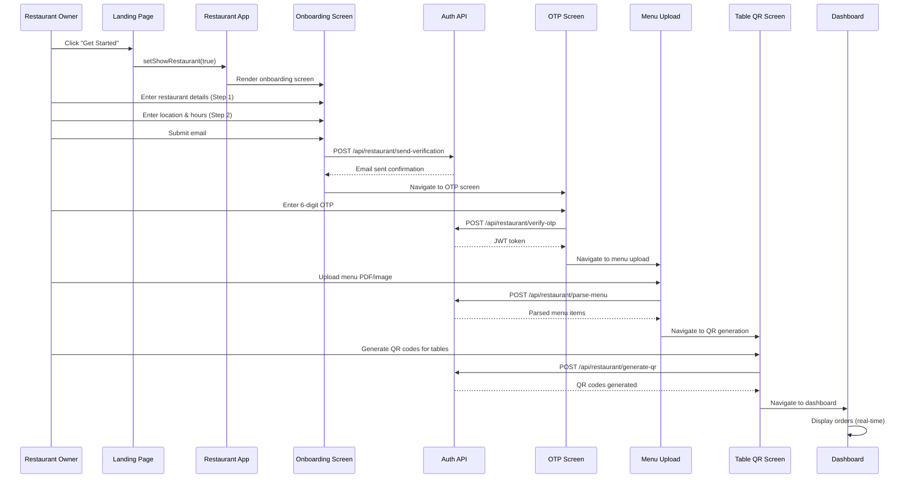
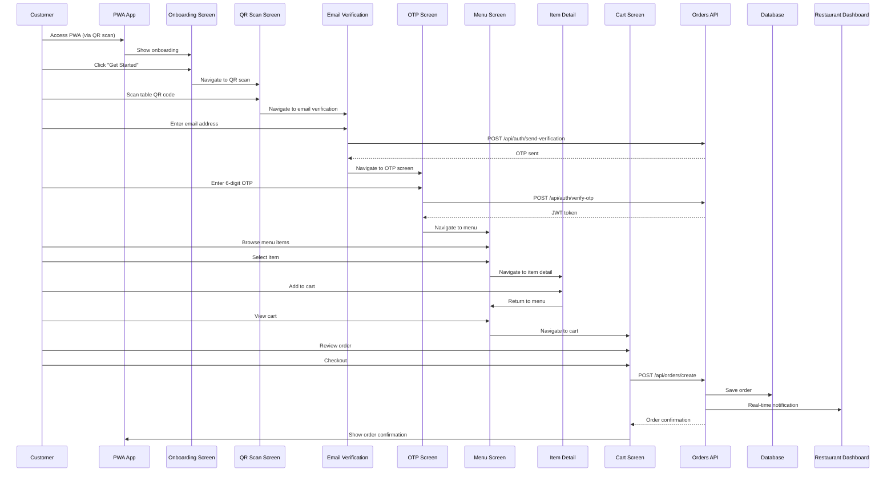
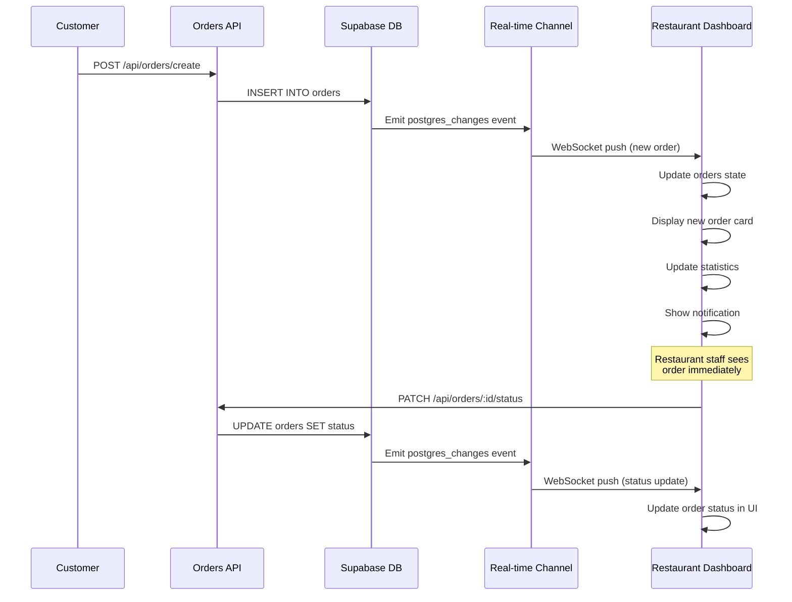
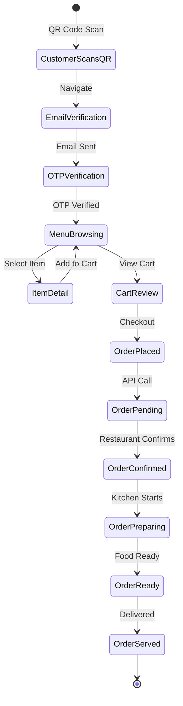
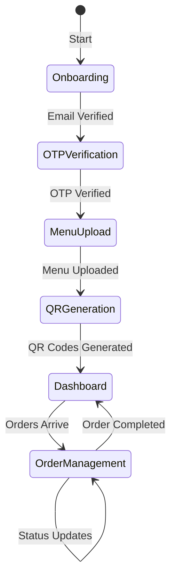

# MenuOS User Flow Documentation

## 📋 Table of Contents
1. [Overview](#overview)
2. [Application Architecture](#application-architecture)
3. [Routing System](#routing-system)
4. [Restaurant Side User Flow](#restaurant-side-user-flow)
5. [Customer Side User Flow](#customer-side-user-flow)
6. [Real-Time Order Updates](#real-time-order-updates)
7. [Data Flow Diagrams](#data-flow-diagrams)
8. [API Integration Points](#api-integration-points)

---

## Overview

MenuOS is a digital menu ordering system that enables restaurants to manage their operations and customers to place orders seamlessly. The application consists of two main user interfaces:

1. **Restaurant Dashboard**: For restaurant owners/staff to manage menus, generate QR codes, and process orders
2. **Customer PWA**: For customers to scan QR codes, browse menus, and place orders

Both interfaces communicate through REST APIs and real-time subscriptions powered by Supabase.

---

## Application Architecture

### High-Level Architecture

```
┌─────────────────────────────────────────────────────────────┐
│                    Landing Page (/)                         │
│  ┌──────────────┐  ┌──────────────┐  ┌──────────────┐   │
│  │   Features   │  │   Pricing    │  │     FAQs     │   │
│  └──────────────┘  └──────────────┘  └──────────────┘   │
└─────────────────────────────────────────────────────────────┘
                          │
        ┌─────────────────┴─────────────────┐
        │                                   │
┌───────▼────────┐              ┌──────────▼──────────┐
│ Restaurant App │              │    Customer PWA      │
│  (State-based) │              │   (State-based)      │
└───────┬────────┘              └──────────┬──────────┘
        │                                   │
        └───────────────┬───────────────────┘
                        │
            ┌───────────▼───────────┐
            │   Next.js API Routes  │
            │  /api/auth/*          │
            │  /api/restaurant/*    │
            │  /api/orders/*        │
            └───────────┬───────────┘
                        │
            ┌───────────▼───────────┐
            │   Supabase Database   │
            │  + Real-time Subscriptions │
            └───────────────────────┘
```

### Component Structure

**Restaurant App Components:**
- `restaurant-app.tsx` - Main router/state manager
- `restaurant-onboarding-screen.tsx` - Multi-step onboarding
- `restaurant-otp-screen.tsx` - Email verification
- `menu-upload-screen.tsx` - Menu upload and parsing
- `table-qr-screen.tsx` - QR code generation
- `restaurant-dashboard.tsx` - Order management dashboard

**Customer PWA Components:**
- `pwa-app.tsx` - Main router/state manager
- `onboarding-screen.tsx` - Welcome screen
- `qr-scan-screen.tsx` - QR code scanner
- `email-verification-screen.tsx` - Email input
- `otp-verification-screen.tsx` - OTP verification
- `menu-screen.tsx` - Menu browsing
- `item-detail-screen.tsx` - Item details
- `cart-screen.tsx` - Shopping cart
- `order-confirmation-screen.tsx` - Order confirmation

---

## Routing System

### Routing Approach

MenuOS uses **client-side state-based routing** instead of traditional URL-based routing. This approach provides:

- ✅ Seamless transitions between screens
- ✅ No page reloads
- ✅ Better mobile app-like experience
- ✅ State persistence during navigation

### Routing Implementation

#### Landing Page Routing (`/src/app/page.tsx`)

```typescript
export default function Home() {
  const [showPWA, setShowPWA] = useState(false);
  const [showRestaurant, setShowRestaurant] = useState(false);

  // Conditional rendering based on state
  if (showPWA) {
    return <PWAApp />;
  }

  if (showRestaurant) {
    return <RestaurantApp />;
  }

  // Default: Landing page
  return <LandingPage />;
}
```

**Route Flow:**
1. User visits `/` → Landing page displayed
2. User clicks "Get Started" → `setShowRestaurant(true)` → `RestaurantApp` rendered
3. User scans QR code → `setShowPWA(true)` → `PWAApp` rendered

#### Restaurant App Routing (`/src/components/restaurant/restaurant-app.tsx`)

```typescript
type RestaurantScreen = 
  | 'onboarding' 
  | 'otp-verification' 
  | 'menu-upload' 
  | 'table-qr' 
  | 'dashboard';

const [currentScreen, setCurrentScreen] = useState<RestaurantScreen>('onboarding');

const renderScreen = () => {
  switch (currentScreen) {
    case 'onboarding': return <RestaurantOnboardingScreen />;
    case 'otp-verification': return <RestaurantOTPScreen />;
    case 'menu-upload': return <MenuUploadScreen />;
    case 'table-qr': return <TableQRScreen />;
    case 'dashboard': return <RestaurantDashboard />;
  }
};
```

**Screen Transitions:**
```
onboarding 
  → (email verified) → otp-verification 
  → (OTP verified) → menu-upload 
  → (menu uploaded) → table-qr 
  → (QR generated) → dashboard
```

#### Customer PWA Routing (`/src/components/pwa-app.tsx`)

```typescript
type Screen = 
  | 'onboarding' 
  | 'qr-scan' 
  | 'email-verification' 
  | 'otp-verification' 
  | 'menu' 
  | 'item-detail' 
  | 'cart' 
  | 'order-confirmation';

const [currentScreen, setCurrentScreen] = useState<Screen>('onboarding');

const renderScreen = () => {
  switch (currentScreen) {
    case 'onboarding': return <OnboardingScreen />;
    case 'qr-scan': return <QRScanScreen />;
    case 'email-verification': return <EmailVerificationScreen />;
    case 'otp-verification': return <OTPVerificationScreen />;
    case 'menu': return <MenuScreen />;
    case 'item-detail': return <ItemDetailScreen />;
    case 'cart': return <CartScreen />;
    case 'order-confirmation': return <OrderConfirmationScreen />;
  }
};
```

**Screen Transitions:**
```
onboarding 
  → qr-scan 
  → email-verification 
  → otp-verification 
  → menu 
  → (select item) → item-detail 
  → (add to cart) → menu 
  → (view cart) → cart 
  → (checkout) → order-confirmation
```

---

## Restaurant Side User Flow

### Complete Restaurant Onboarding Flow



### Step-by-Step Restaurant Flow

#### Step 1: Landing Page → Restaurant App

**Trigger:** User clicks "Get Started" button on landing page

**Code Flow:**
```typescript
// Landing page
<Button onClick={() => setShowRestaurant(true)}>
  Get Started
</Button>

// Main page component
if (showRestaurant) {
  return <RestaurantApp />;
}
```

**State Management:**
- `showRestaurant` state in `page.tsx` controls which app is displayed
- No URL change, pure React state management

#### Step 2: Restaurant Onboarding (Multi-Step Form)

**Screen:** `restaurant-onboarding-screen.tsx`

**Steps:**
1. **Step 1: Basic Information**
   - Restaurant name
   - Email address
   - Phone number
   - Cuisine type
   - Description

2. **Step 2: Location & Hours**
   - Street address
   - City, State, ZIP
   - Operating hours (open/close)

3. **Step 3: Email Verification**
   - Email sent to restaurant
   - Transition to OTP screen

**State Flow:**
```typescript
const [step, setStep] = useState(1);
const [restaurantData, setRestaurantData] = useState<RestaurantData>({
  name: "",
  email: "",
  // ... other fields
});

// On email submit
const handleEmailSubmit = async () => {
  await fetch('/api/restaurant/send-verification', {
    method: 'POST',
    body: JSON.stringify({ email: restaurantData.email })
  });
  onEmailVerified(restaurantData.email, restaurantData);
};
```

**Navigation:**
```typescript
// In restaurant-app.tsx
const handleEmailVerified = (email: string, data: RestaurantData) => {
  setRestaurantData(data);
  setCurrentScreen('otp-verification'); // Navigate to OTP screen
};
```

#### Step 3: OTP Verification

**Screen:** `restaurant-otp-screen.tsx`

**Process:**
1. User receives OTP via email
2. User enters 6-digit code
3. Code verified via API
4. JWT token received and stored

**Code Flow:**
```typescript
const handleOTPSubmit = async (otp: string) => {
  const response = await fetch('/api/restaurant/verify-otp', {
    method: 'POST',
    body: JSON.stringify({ email, otp })
  });
  
  const { token } = await response.json();
  localStorage.setItem('restaurantAuthToken', token);
  onVerificationSuccess(token);
};

// In restaurant-app.tsx
const handleOTPVerified = (token: string) => {
  setAuthToken(token);
  setCurrentScreen('menu-upload'); // Navigate to menu upload
};
```

#### Step 4: Menu Upload

**Screen:** `menu-upload-screen.tsx`

**Process:**
1. User uploads menu PDF or image
2. Menu parsed using OCR (Tesseract)
3. Menu items extracted and displayed
4. User can edit/confirm items

**Code Flow:**
```typescript
const handleMenuUpload = async (file: File) => {
  const formData = new FormData();
  formData.append('menu', file);
  
  const response = await fetch('/api/restaurant/parse-menu', {
    method: 'POST',
    headers: {
      'Authorization': `Bearer ${authToken}`
    },
    body: formData
  });
  
  const { items } = await response.json();
  onMenuUploaded(items);
};

// In restaurant-app.tsx
const handleMenuUploaded = (items: MenuItem[]) => {
  setMenuItems(items);
  setCurrentScreen('table-qr'); // Navigate to QR generation
};
```

#### Step 5: QR Code Generation

**Screen:** `table-qr-screen.tsx`

**Process:**
1. User specifies number of tables
2. QR codes generated for each table
3. QR codes contain table ID and restaurant ID
4. Codes can be downloaded/printed

**Code Flow:**
```typescript
const generateQRCodes = async (tableCount: number) => {
  const response = await fetch('/api/restaurant/generate-qr', {
    method: 'POST',
    headers: {
      'Authorization': `Bearer ${authToken}`
    },
    body: JSON.stringify({ 
      restaurantId: restaurantId,
      tableCount 
    })
  });
  
  const { qrCodes } = await response.json();
  // Display QR codes
  onComplete();
};

// In restaurant-app.tsx
const handleTableQRComplete = () => {
  setCurrentScreen('dashboard'); // Navigate to dashboard
};
```

#### Step 6: Restaurant Dashboard

**Screen:** `restaurant-dashboard.tsx`

**Features:**
- Real-time order display
- Order status management
- Statistics and analytics
- Menu management

**Dashboard Initialization:**
```typescript
useEffect(() => {
  // Load initial orders
  loadOrders();
  
  // Subscribe to real-time updates
  const subscription = SupabaseIntegration.subscribeToRestaurantOrders(
    restaurantId,
    (newOrder) => {
      setOrders(prev => [newOrder, ...prev]);
    }
  );
  
  return () => subscription.unsubscribe();
}, [restaurantId]);
```

---

## Customer Side User Flow

### Complete Customer Ordering Flow



### Step-by-Step Customer Flow

#### Step 1: QR Code Scan

**Entry Point:** Customer scans QR code on restaurant table

**QR Code Structure:**
```json
{
  "restaurantId": "rest_123",
  "tableId": "table_5",
  "url": "https://menuos.app/order?restaurant=rest_123&table=table_5"
}
```

**Code Flow:**
```typescript
// QR code contains encoded restaurant and table info
const handleQRScan = (qrData: string) => {
  const { restaurantId, tableId } = parseQRCode(qrData);
  localStorage.setItem('restaurantId', restaurantId);
  localStorage.setItem('tableId', tableId);
  onScanComplete(); // Navigate to email verification
};

// In pwa-app.tsx
<QRScanScreen onScanComplete={() => navigateToScreen('email-verification')} />
```

#### Step 2: Email Verification

**Screen:** `email-verification-screen.tsx`

**Process:**
1. Customer enters email address
2. OTP sent to email via API
3. Navigate to OTP verification

**Code Flow:**
```typescript
const handleEmailSubmit = async (email: string) => {
  await fetch('/api/auth/send-verification', {
    method: 'POST',
    body: JSON.stringify({ email })
  });
  onEmailVerified(email);
};

// In pwa-app.tsx
const handleEmailVerified = (email: string) => {
  setUserEmail(email);
  setCurrentScreen('otp-verification');
};
```

#### Step 3: OTP Verification

**Screen:** `otp-verification-screen.tsx`

**Process:**
1. Customer enters 6-digit OTP
2. OTP verified via API
3. JWT token received and stored
4. Navigate to menu

**Code Flow:**
```typescript
const handleOTPSubmit = async (otp: string) => {
  const response = await fetch('/api/auth/verify-otp', {
    method: 'POST',
    body: JSON.stringify({ email, otp })
  });
  
  const { token } = await response.json();
  localStorage.setItem('authToken', token);
  onVerificationSuccess(token);
};

// In pwa-app.tsx
const handleOTPVerified = (token: string) => {
  setAuthToken(token);
  setCurrentScreen('menu');
};
```

#### Step 4: Menu Browsing

**Screen:** `menu-screen.tsx`

**Features:**
- Display menu items by category
- Search functionality
- Cart icon with item count
- Item selection

**Code Flow:**
```typescript
// Fetch menu items
useEffect(() => {
  const restaurantId = localStorage.getItem('restaurantId');
  fetch(`/api/restaurant/${restaurantId}/menu`)
    .then(res => res.json())
    .then(data => setMenuItems(data.items));
}, []);

// Select item
const selectItem = (item: MenuItem) => {
  setSelectedItem(item);
  setCurrentScreen('item-detail');
};
```

#### Step 5: Item Detail & Add to Cart

**Screen:** `item-detail-screen.tsx`

**Process:**
1. Display item details
2. Select options (size, customizations)
3. Add to cart
4. Return to menu

**Code Flow:**
```typescript
const addToCart = (item: CartItem) => {
  setCart(prev => {
    const existingItem = prev.find(cartItem => 
      cartItem.id === item.id && 
      JSON.stringify(cartItem.selectedOptions) === JSON.stringify(item.selectedOptions)
    );
    
    if (existingItem) {
      return prev.map(cartItem =>
        cartItem.id === item.id ? 
          { ...cartItem, quantity: cartItem.quantity + item.quantity } : 
          cartItem
      );
    }
    
    return [...prev, item];
  });
  onBack(); // Return to menu
};
```

#### Step 6: Cart & Checkout

**Screen:** `cart-screen.tsx`

**Process:**
1. Display cart items
2. Update quantities
3. Calculate total
4. Checkout

**Code Flow:**
```typescript
const handleCheckout = async () => {
  const token = localStorage.getItem('authToken');
  const restaurantId = localStorage.getItem('restaurantId');
  const tableId = localStorage.getItem('tableId');
  
  const response = await fetch('/api/orders/create', {
    method: 'POST',
    headers: {
      'Authorization': `Bearer ${token}`,
      'Content-Type': 'application/json'
    },
    body: JSON.stringify({
      restaurantId,
      tableId,
      items: cartItems.map(item => ({
        id: item.id,
        name: item.name,
        price: item.price,
        quantity: item.quantity,
        selectedOptions: item.selectedOptions
      }))
    })
  });
  
  const { order } = await response.json();
  onCheckout(order.id);
};

// In pwa-app.tsx
const handleOrderCreated = (orderId: string) => {
  setOrderNumber(orderId);
  setCurrentScreen('order-confirmation');
};
```

#### Step 7: Order Confirmation

**Screen:** `order-confirmation-screen.tsx`

**Displays:**
- Order number
- Order items
- Total amount
- Estimated time
- Options to place new order or return to landing

---

## Real-Time Order Updates

### How Real-Time Updates Work

MenuOS uses **Supabase Real-time Subscriptions** to provide instant order updates to the restaurant dashboard when customers place orders.

### Architecture

```
┌─────────────────┐
│ Customer PWA   │
│ Places Order   │
└────────┬───────┘
         │
         │ POST /api/orders/create
         ▼
┌─────────────────┐
│  Orders API     │
│  (Next.js)      │
└────────┬───────┘
         │
         │ Insert Order
         ▼
┌─────────────────┐
│ Supabase DB     │
│ (PostgreSQL)    │
└────────┬───────┘
         │
         │ Postgres Changes Event
         │ (INSERT on orders table)
         ▼
┌─────────────────┐
│ Supabase        │
│ Real-time       │
│ Channel         │
└────────┬───────┘
         │
         │ WebSocket Push
         ▼
┌─────────────────┐
│ Restaurant      │
│ Dashboard       │
│ (Subscribed)    │
└─────────────────┘
```

### Implementation Details

#### 1. Order Creation (Customer Side)

**File:** `/src/app/api/orders/create/route.ts`

```typescript
export async function POST(request: NextRequest) {
  // 1. Verify JWT token
  const token = request.headers.get('authorization')?.substring(7);
  const decoded = jwt.verify(token, JWT_SECRET);
  
  // 2. Create order object
  const order = {
    id: generateOrderNumber(),
    email: decoded.email,
    restaurantId: body.restaurantId,
    tableId: body.tableId,
    items: body.items,
    total: calculateTotal(body.items),
    status: 'pending',
    createdAt: new Date().toISOString()
  };
  
  // 3. Save to database (Supabase)
  const { data, error } = await supabase
    .from('orders')
    .insert([order])
    .select();
  
  // 4. Database trigger fires → Real-time event emitted
  
  return NextResponse.json({ order: data[0] });
}
```

#### 2. Real-Time Subscription (Restaurant Dashboard)

**File:** `/src/lib/supabase.ts`

```typescript
// Subscribe to order changes for a specific restaurant
static subscribeToOrders(
  restaurantId: string, 
  callback: (payload: any) => void
) {
  return supabase
    .channel('orders')
    .on(
      'postgres_changes',
      {
        event: '*', // INSERT, UPDATE, DELETE
        schema: 'public',
        table: 'orders',
        filter: `restaurant_id=eq.${restaurantId}`
      },
      (payload) => {
        console.log('Order update received:', payload);
        callback(payload);
      }
    )
    .subscribe();
}
```

#### 3. Dashboard Integration

**File:** `/src/components/restaurant/restaurant-dashboard.tsx`

```typescript
export function RestaurantDashboard({ restaurantData }) {
  const [orders, setOrders] = useState<Order[]>([]);
  
  useEffect(() => {
    const restaurantId = restaurantData.id;
    
    // 1. Load initial orders
    const loadOrders = async () => {
      const { data } = await supabase
        .from('orders')
        .select('*')
        .eq('restaurant_id', restaurantId)
        .order('created_at', { ascending: false });
      
      setOrders(data || []);
    };
    
    loadOrders();
    
    // 2. Subscribe to real-time updates
    const channel = supabase
      .channel('orders')
      .on(
        'postgres_changes',
        {
          event: 'INSERT',
          schema: 'public',
          table: 'orders',
          filter: `restaurant_id=eq.${restaurantId}`
        },
        (payload) => {
          // New order received!
          const newOrder = payload.new;
          
          // Add to orders list
          setOrders(prev => [newOrder, ...prev]);
          
          // Update statistics
          updateStats();
          
          // Show notification
          showNotification(`New order: ${newOrder.id}`);
        }
      )
      .on(
        'postgres_changes',
        {
          event: 'UPDATE',
          schema: 'public',
          table: 'orders',
          filter: `restaurant_id=eq.${restaurantId}`
        },
        (payload) => {
          // Order status updated
          const updatedOrder = payload.new;
          
          // Update order in list
          setOrders(prev => prev.map(order =>
            order.id === updatedOrder.id ? updatedOrder : order
          ));
        }
      )
      .subscribe();
    
    // 3. Cleanup on unmount
    return () => {
      supabase.removeChannel(channel);
    };
  }, [restaurantData.id]);
  
  // ... rest of component
}
```

### Real-Time Update Flow



### Order Status Updates

When restaurant staff updates an order status, the change is also propagated in real-time:

```typescript
const updateOrderStatus = async (orderId: string, newStatus: string) => {
  // 1. Update via API
  await fetch(`/api/orders/${orderId}/status`, {
    method: 'PATCH',
    headers: {
      'Authorization': `Bearer ${authToken}`,
      'Content-Type': 'application/json'
    },
    body: JSON.stringify({ status: newStatus })
  });
  
  // 2. Database update triggers real-time event
  // 3. All subscribed clients receive update
  // 4. Customer PWA can also subscribe to order status updates
};
```

### Customer Order Status Tracking

Customers can also subscribe to their order status:

```typescript
// In customer PWA
useEffect(() => {
  if (!orderId) return;
  
  const channel = supabase
    .channel(`order-${orderId}`)
    .on(
      'postgres_changes',
      {
        event: 'UPDATE',
        schema: 'public',
        table: 'orders',
        filter: `id=eq.${orderId}`
      },
      (payload) => {
        const updatedOrder = payload.new;
        setOrderStatus(updatedOrder.status);
        
        // Show status update notification
        if (updatedOrder.status === 'ready') {
          showNotification('Your order is ready!');
        }
      }
    )
    .subscribe();
  
  return () => {
    supabase.removeChannel(channel);
  };
}, [orderId]);
```

---

## Data Flow Diagrams

### Complete Order Lifecycle



### Restaurant Dashboard State Management



---

## API Integration Points

### Authentication APIs

**Send Verification Email:**
- `POST /api/auth/send-verification`
- Body: `{ email: string }`
- Response: `{ message: "OTP sent" }`

**Verify OTP:**
- `POST /api/auth/verify-otp`
- Body: `{ email: string, otp: string }`
- Response: `{ token: string }`

**Restaurant Verification:**
- `POST /api/restaurant/send-verification`
- `POST /api/restaurant/verify-otp`

### Order APIs

**Create Order:**
- `POST /api/orders/create`
- Headers: `Authorization: Bearer <token>`
- Body: `{ restaurantId, tableId, items: [...] }`
- Response: `{ order: { id, total, status, estimatedTime } }`

**Get Orders:**
- `GET /api/orders`
- Headers: `Authorization: Bearer <token>`
- Response: `{ orders: [...] }`

**Update Order Status:**
- `PATCH /api/orders/:id/status`
- Headers: `Authorization: Bearer <token>`
- Body: `{ status: 'confirmed' | 'preparing' | 'ready' | 'served' }`

### Restaurant APIs

**Parse Menu:**
- `POST /api/restaurant/parse-menu`
- Headers: `Authorization: Bearer <token>`
- Body: `FormData` with menu file
- Response: `{ items: [...] }`

**Generate QR Codes:**
- `POST /api/restaurant/generate-qr`
- Headers: `Authorization: Bearer <token>`
- Body: `{ restaurantId, tableCount }`
- Response: `{ qrCodes: [...] }`

---

## Key Technical Details

### State Persistence

**LocalStorage Usage:**
- `authToken` - Customer JWT token
- `restaurantAuthToken` - Restaurant JWT token
- `restaurantId` - Current restaurant ID (from QR scan)
- `tableId` - Current table ID (from QR scan)
- `pendingRestaurantEmail` - Email during onboarding

### Authentication Flow

1. **Customer Authentication:**
   - Email → OTP → JWT Token
   - Token stored in localStorage
   - Token sent in `Authorization` header for API calls

2. **Restaurant Authentication:**
   - Email → OTP → JWT Token
   - Token stored in localStorage
   - Token required for restaurant-specific APIs

### Real-Time Subscription Management

**Best Practices:**
- Subscribe on component mount
- Unsubscribe on component unmount
- Handle connection errors gracefully
- Reconnect on disconnect

**Example:**
```typescript
useEffect(() => {
  const channel = supabase
    .channel('orders')
    .on('postgres_changes', { ... }, callback)
    .subscribe();
  
  return () => {
    supabase.removeChannel(channel);
  };
}, [dependencies]);
```

---

## Summary

MenuOS uses a **state-based routing system** that provides a seamless, app-like experience for both restaurants and customers. The real-time order updates are powered by Supabase's PostgreSQL change detection and WebSocket subscriptions, ensuring instant synchronization between customer orders and restaurant dashboards.

**Key Features:**
- ✅ No page reloads during navigation
- ✅ State persistence across screens
- ✅ Real-time order updates via WebSocket
- ✅ JWT-based authentication
- ✅ Type-safe API communication
- ✅ Responsive mobile-first design

This architecture provides a solid foundation for scaling the application while maintaining excellent user experience and real-time responsiveness.

