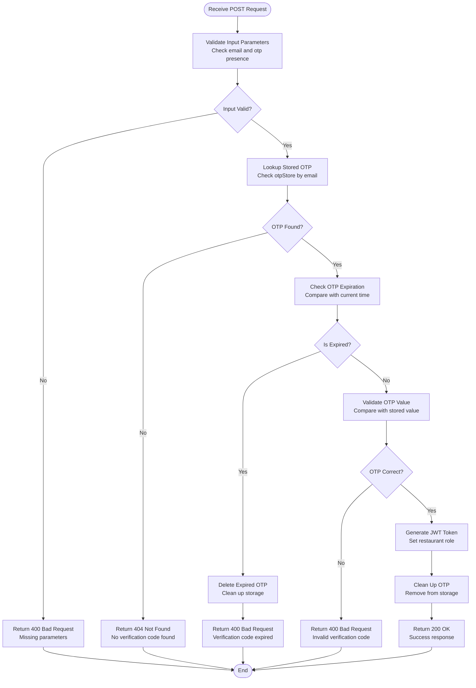
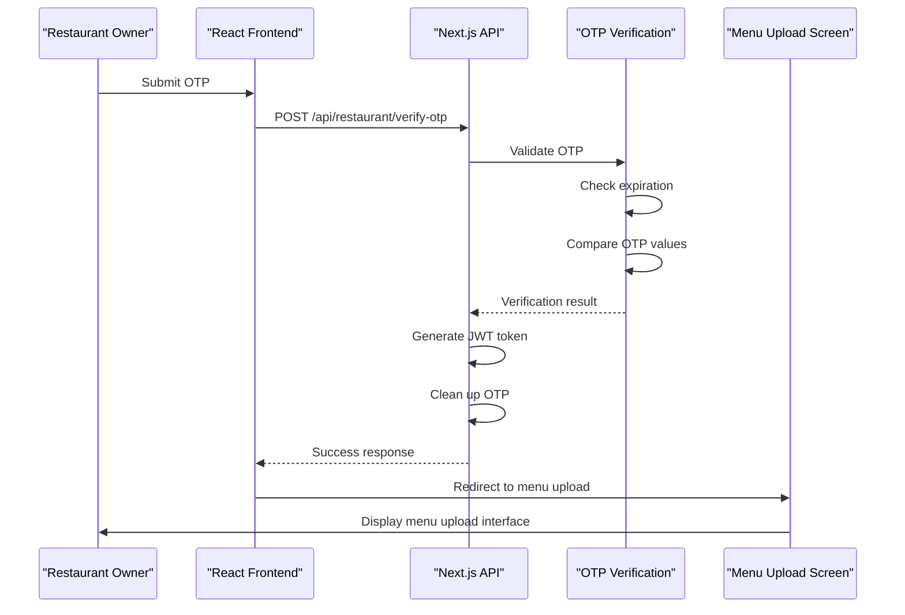
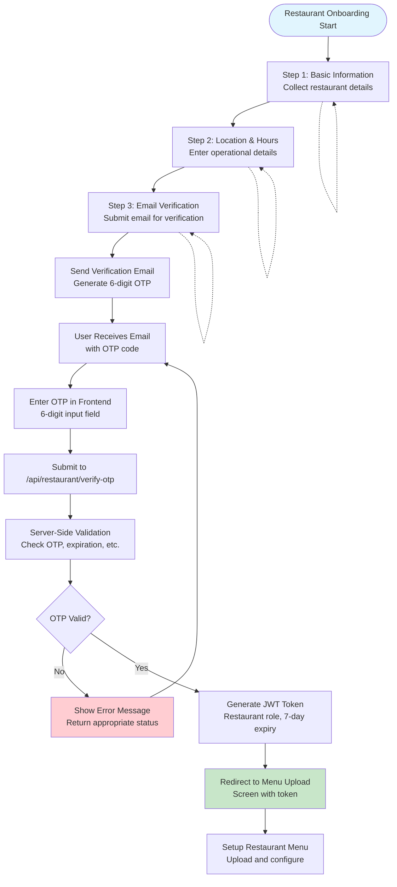

# Restaurant Verify OTP API Documentation

<cite>
**Referenced Files in This Document**
- [src/app/api/restaurant/verify-otp/route.ts](file://src/app/api/restaurant/verify-otp/route.ts)
- [src/components/restaurant/restaurant-otp-screen.tsx](file://src/components/restaurant/restaurant-otp-screen.tsx)
- [src/components/restaurant/menu-upload-screen.tsx](file://src/components/restaurant/menu-upload-screen.tsx)
- [src/components/restaurant/restaurant-onboarding-screen.tsx](file://src/components/restaurant/restaurant-onboarding-screen.tsx)
- [src/app/api/restaurant/send-verification/route.ts](file://src/app/api/restaurant/send-verification/route.ts)
- [src/app/api/restaurant/parse-menu/route.ts](file://src/app/api/restaurant/parse-menu/route.ts)
</cite>

## Table of Contents
1. [Introduction](#introduction)
2. [Endpoint Specification](#endpoint-specification)
3. [Request Structure](#request-structure)
4. [Server-Side Verification Process](#server-side-verification-process)
5. [Response Schema](#response-schema)
6. [Security Measures](#security-measures)
7. [Integration Examples](#integration-examples)
8. [Frontend Integration](#frontend-integration)
9. [Error Handling](#error-handling)
10. [Complete Flow Diagram](#complete-flow-diagram)

## Introduction

The POST `/api/restaurant/verify-otp` endpoint is a critical component of the MenuPRO restaurant onboarding process. It authenticates restaurant owners during the verification phase by validating a one-time password (OTP) sent to their email address. This endpoint serves as the bridge between the email verification step and the restaurant dashboard access, ensuring secure account activation.

The verification process follows a multi-step workflow where restaurant owners first submit their contact information, receive a verification email with a 6-digit OTP, and then submit this code to verify their identity. Upon successful verification, the system generates a secure JWT token that grants access to restaurant-specific functionalities.

## Endpoint Specification

### HTTP Method
- **POST**

### URL
- `/api/restaurant/verify-otp`

### Content-Type
- `application/json`

### Authentication
- No authentication required for this endpoint (part of the verification process)

## Request Structure

### Headers
```http
Content-Type: application/json
```

### Request Body Schema
```typescript
interface VerifyOTPRequest {
  email: string;
  otp: string;
}
```

### Request Body Example
```json
{
  "email": "restaurant@example.com",
  "otp": "123456"
}
```

**Section sources**
- [src/app/api/restaurant/verify-otp/route.ts](file://src/app/api/restaurant/verify-otp/route.ts#L8-L12)

## Server-Side Verification Process

The verification process implements a comprehensive validation pipeline with multiple security checks:



**Diagram sources**
- [src/app/api/restaurant/verify-otp/route.ts](file://src/app/api/restaurant/verify-otp/route.ts#L14-L75)

### Verification Steps Implementation

1. **Input Validation**: Ensures both email and OTP are present in the request
2. **OTP Lookup**: Retrieves stored OTP data using email as key
3. **Expiration Check**: Validates OTP hasn't exceeded the 10-minute window
4. **Value Comparison**: Compares submitted OTP with stored value
5. **Token Generation**: Creates JWT with restaurant role and expiration
6. **Cleanup**: Removes OTP from temporary storage

**Section sources**
- [src/app/api/restaurant/verify-otp/route.ts](file://src/app/api/restaurant/verify-otp/route.ts#L14-L75)

## Response Schema

### Success Response (200 OK)
```typescript
interface VerifyOTPResponse {
  message: string;
  token: string;
  user: {
    email: string;
    type: 'restaurant';
    verified: boolean;
  };
}
```

### Success Response Example
```json
{
  "message": "Restaurant account verified successfully",
  "token": "eyJhbGciOiJIUzI1NiIsInR5cCI6IkpXVCJ9...",
  "user": {
    "email": "restaurant@example.com",
    "type": "restaurant",
    "verified": true
  }
}
```

### Error Responses

#### 400 Bad Request - Missing Parameters
```json
{
  "message": "Email and OTP are required"
}
```

#### 400 Bad Request - No Verification Code Found
```json
{
  "message": "No verification code found for this email"
}
```

#### 400 Bad Request - Expired OTP
```json
{
  "message": "Verification code has expired. Please request a new one."
}
```

#### 400 Bad Request - Invalid OTP
```json
{
  "message": "Invalid verification code"
}
```

#### 500 Internal Server Error
```json
{
  "message": "Failed to verify OTP"
}
```

**Section sources**
- [src/app/api/restaurant/verify-otp/route.ts](file://src/app/api/restaurant/verify-otp/route.ts#L14-L82)

## Security Measures

### JWT Token Security

The generated JWT token implements several security measures:

```typescript
// Token generation with security configurations
const token = jwt.sign(
  { 
    email, 
    type: 'restaurant',
    verified: true,
    iat: Math.floor(Date.now() / 1000)
  },
  process.env.JWT_SECRET || 'your-secret-key',
  { 
    expiresIn: '7d' // 7-day expiration
  }
);
```

### Temporary Storage Security

The OTP storage mechanism uses an in-memory Map with automatic cleanup:

```typescript
// Temporary OTP storage with expiration
const otpStore = new Map<string, { otp: string; expires: number }>();

// Automatic cleanup of expired OTPs
setInterval(() => {
  const now = Date.now();
  for (const [email, data] of Array.from(otpStore.entries())) {
    if (data.expires < now) {
      otpStore.delete(email);
    }
  }
}, 5 * 60 * 1000); // Clean up every 5 minutes
```

### Protection Against Replay Attacks

1. **Single-use OTP**: Each OTP can only be used once
2. **Immediate Cleanup**: OTPs are removed immediately upon successful verification
3. **Short Expiration Window**: 10-minute validity period
4. **Secure Token Generation**: Uses cryptographically secure JWT library

### Secure Cookie Attributes

While the API itself doesn't set cookies, the frontend implementation uses secure cookie attributes:

- **Secure**: Only transmitted over HTTPS connections
- **HttpOnly**: Protected from client-side JavaScript access
- **SameSite**: Prevents cross-site request forgery attacks

**Section sources**
- [src/app/api/restaurant/verify-otp/route.ts](file://src/app/api/restaurant/verify-otp/route.ts#L48-L56)
- [src/app/api/restaurant/send-verification/route.ts](file://src/app/api/restaurant/send-verification/route.ts#L90-L98)

## Integration Examples

### JavaScript Fetch Example

```javascript
async function verifyRestaurantOTP(email, otp) {
  try {
    const response = await fetch('/api/restaurant/verify-otp', {
      method: 'POST',
      headers: {
        'Content-Type': 'application/json',
      },
      body: JSON.stringify({ email, otp }),
    });
    
    if (!response.ok) {
      throw new Error(`HTTP error! status: ${response.status}`);
    }
    
    const data = await response.json();
    return data;
  } catch (error) {
    console.error('Verification failed:', error);
    throw error;
  }
}

// Usage
const result = await verifyRestaurantOTP(
  'restaurant@example.com', 
  '123456'
);
console.log(result.token); // JWT token for restaurant access
```

### TypeScript Integration

```typescript
interface VerifyOTPParams {
  email: string;
  otp: string;
}

interface VerifyOTPResult {
  success: boolean;
  token?: string;
  error?: string;
}

async function verifyRestaurantOTP(params: VerifyOTPParams): Promise<VerifyOTPResult> {
  try {
    const response = await fetch('/api/restaurant/verify-otp', {
      method: 'POST',
      headers: {
        'Content-Type': 'application/json',
      },
      body: JSON.stringify(params),
    });
    
    if (response.status === 200) {
      const data = await response.json();
      return {
        success: true,
        token: data.token,
      };
    } else if (response.status === 400) {
      const errorData = await response.json();
      return {
        success: false,
        error: errorData.message,
      };
    } else {
      return {
        success: false,
        error: `Unexpected error: ${response.status}`,
      };
    }
  } catch (error) {
    return {
      success: false,
      error: 'Network error occurred',
    };
  }
}
```

## Frontend Integration

### React Component Integration

The frontend implementation demonstrates seamless integration with the verification API:

```typescript
// Restaurant OTP Screen Component
export function RestaurantOTPScreen({ 
  email, 
  onVerificationSuccess, 
  onBack, 
  onResendEmail 
}: RestaurantOTPScreenProps) {
  const [otp, setOtp] = useState(["", "", "", "", "", ""]);
  const [isLoading, setIsLoading] = useState(false);
  const [error, setError] = useState("");
  
  const handleSubmit = async (e: React.FormEvent) => {
    e.preventDefault();
    
    const otpCode = otp.join('');
    if (otpCode.length !== 6) {
      setError("Please enter the complete 6-digit code");
      return;
    }

    setIsLoading(true);
    setError("");

    try {
      const response = await fetch('/api/restaurant/verify-otp', {
        method: 'POST',
        headers: {
          'Content-Type': 'application/json',
        },
        body: JSON.stringify({ email, otp: otpCode }),
      });
      
      if (response.ok) {
        const data = await response.json();
        onVerificationSuccess(data.token);
      } else {
        const errorData = await response.json();
        setError(errorData.message || "Invalid verification code");
      }
    } catch (error) {
      setError("Network error. Please try again.");
    } finally {
      setIsLoading(false);
    }
  };
}
```

### Navigation Flow

Upon successful verification, the system redirects to the menu upload screen:



**Diagram sources**
- [src/components/restaurant/restaurant-otp-screen.tsx](file://src/components/restaurant/restaurant-otp-screen.tsx#L95-L120)
- [src/components/restaurant/menu-upload-screen.tsx](file://src/components/restaurant/menu-upload-screen.tsx#L1-L50)

**Section sources**
- [src/components/restaurant/restaurant-otp-screen.tsx](file://src/components/restaurant/restaurant-otp-screen.tsx#L95-L120)
- [src/components/restaurant/menu-upload-screen.tsx](file://src/components/restaurant/menu-upload-screen.tsx#L1-L50)

## Error Handling

### Comprehensive Error Categories

The API implements detailed error handling for various failure scenarios:

1. **Validation Errors**
   - Missing required parameters
   - Invalid input format
   - Malformed JSON

2. **Business Logic Errors**
   - No verification code found for email
   - OTP has expired
   - Incorrect OTP value

3. **System Errors**
   - Internal server errors
   - Database connectivity issues
   - Environment configuration problems

### Error Response Patterns

```typescript
// Generic error response structure
interface ErrorResponse {
  message: string;
  status?: number;
  timestamp: string;
}

// Specific error handlers
const errorHandlers = {
  missingParameters: () => ({
    message: 'Email and OTP are required',
    status: 400
  }),
  noVerificationFound: () => ({
    message: 'No verification code found for this email',
    status: 404
  }),
  expiredOTP: () => ({
    message: 'Verification code has expired. Please request a new one.',
    status: 400
  }),
  invalidOTP: () => ({
    message: 'Invalid verification code',
    status: 400
  })
};
```

### Frontend Error Handling

The frontend implements robust error handling with user-friendly messaging:

```typescript
// Enhanced error handling in frontend
const handleError = (error: any, responseStatus: number) => {
  if (responseStatus === 400) {
    setError("The verification code you entered is incorrect. Please try again.");
  } else if (responseStatus === 404) {
    setError("No verification code was found for your email. Please request a new code.");
  } else if (responseStatus === 401) {
    setError("Your verification code has expired. Please request a new code.");
  } else if (responseStatus >= 500) {
    setError("There was a problem verifying your code. Please try again later.");
  } else {
    setError("An unexpected error occurred. Please try again.");
  }
};
```

**Section sources**
- [src/app/api/restaurant/verify-otp/route.ts](file://src/app/api/restaurant/verify-otp/route.ts#L14-L82)

## Complete Flow Diagram

The verification process integrates with the broader restaurant onboarding flow:



**Diagram sources**
- [src/components/restaurant/restaurant-onboarding-screen.tsx](file://src/components/restaurant/restaurant-onboarding-screen.tsx#L1-L50)
- [src/components/restaurant/restaurant-otp-screen.tsx](file://src/components/restaurant/restaurant-otp-screen.tsx#L1-L50)
- [src/components/restaurant/menu-upload-screen.tsx](file://src/components/restaurant/menu-upload-screen.tsx#L1-L50)

### Integration with Menu Upload

After successful OTP verification, the system seamlessly transitions to menu upload capabilities:

1. **Token Storage**: JWT token stored securely in browser session
2. **Menu Parsing**: Integration with OCR and PDF parsing APIs
3. **Menu Management**: Interactive menu creation and editing interface
4. **QR Generation**: Automated QR code generation for customer access

**Section sources**
- [src/components/restaurant/menu-upload-screen.tsx](file://src/components/restaurant/menu-upload-screen.tsx#L1-L50)

## Conclusion

The POST `/api/restaurant/verify-otp` endpoint provides a secure, reliable foundation for restaurant account verification within the MenuPRO platform. Its implementation combines robust security measures with user-friendly error handling, ensuring a smooth onboarding experience while maintaining high security standards.

The endpoint's integration with the broader verification system, including email delivery, OTP storage, and token generation, creates a comprehensive authentication solution that protects restaurant accounts while enabling seamless access to restaurant management functionalities.

Key strengths of this implementation include:
- Multi-layered validation and security checks
- Immediate OTP cleanup to prevent reuse
- Comprehensive error handling with meaningful feedback
- Seamless integration with the restaurant onboarding workflow
- Scalable architecture supporting future enhancements