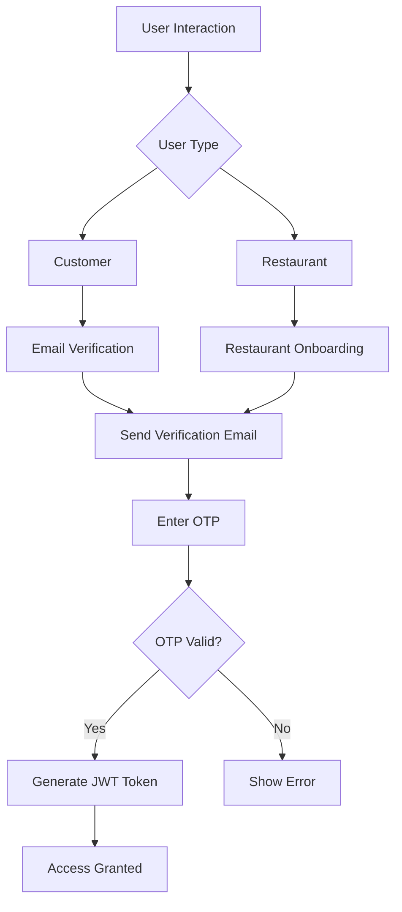
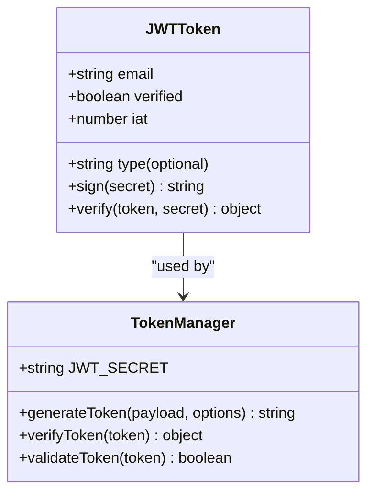
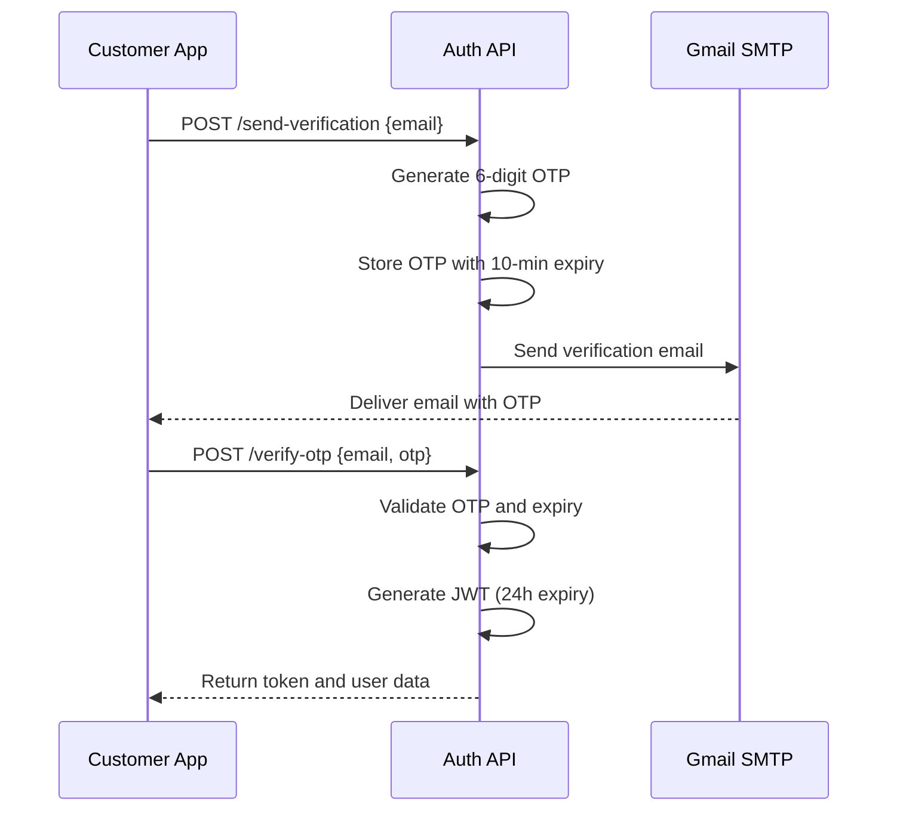
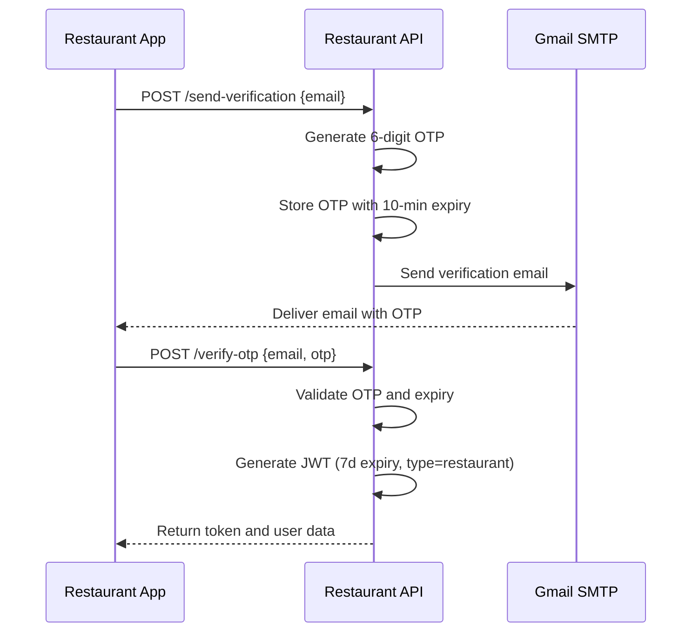
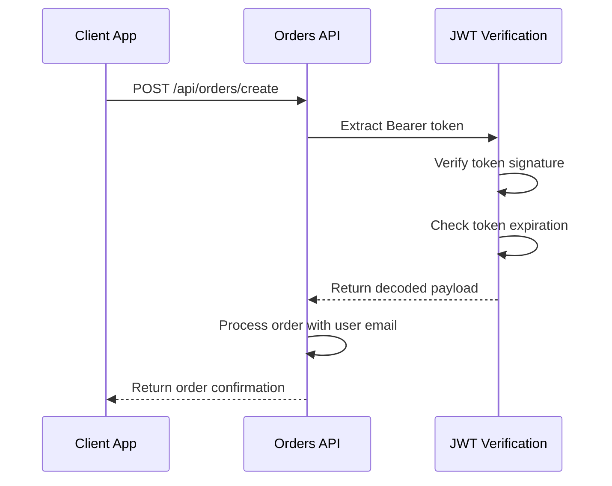

# Authentication Flow

<cite>
**Referenced Files in This Document**   
- [send-verification/route.ts](file://src/app/api/auth/send-verification/route.ts)
- [verify-otp/route.ts](file://src/app/api/auth/verify-otp/route.ts)
- [restaurant/send-verification/route.ts](file://src/app/api/restaurant/send-verification/route.ts)
- [restaurant/verify-otp/route.ts](file://src/app/api/restaurant/verify-otp/route.ts)
- [orders/create/route.ts](file://src/app/api/orders/create/route.ts)
- [EMAIL_SETUP.md](file://EMAIL_SETUP.md)
- [email-verification-screen.tsx](file://src/components/pwa/email-verification-screen.tsx)
- [otp-verification-screen.tsx](file://src/components/pwa/otp-verification-screen.tsx)
- [restaurant-onboarding-screen.tsx](file://src/components/restaurant/restaurant-onboarding-screen.tsx)
- [restaurant-otp-screen.tsx](file://src/components/restaurant/restaurant-otp-screen.tsx)
</cite>

## Table of Contents
1. [Introduction](#introduction)
2. [Dual-Flow Authentication Design](#dual-flow-authentication-design)
3. [Email Verification and OTP Validation](#email-verification-and-otp-validation)
4. [JWT Token Management](#jwt-token-management)
5. [API Endpoint Specifications](#api-endpoint-specifications)
6. [Email Integration with Gmail SMTP](#email-integration-with-gmail-smtp)
7. [Token Storage and Lifecycle](#token-storage-and-lifecycle)
8. [Security Considerations](#security-considerations)
9. [Sequence Diagrams](#sequence-diagrams)
10. [Implementation Examples](#implementation-examples)

## Introduction
The MenuPRO-App authentication system implements a dual-flow design for customer and restaurant users, utilizing email verification and OTP validation. This document details the architecture, implementation, and security aspects of the authentication system, focusing on the email verification process, JWT token management, and integration with Gmail SMTP for email delivery.

**Section sources**
- [EMAIL_SETUP.md](file://EMAIL_SETUP.md#L0-L66)

## Dual-Flow Authentication Design
The authentication system supports two distinct user flows: customer authentication and restaurant authentication. Each flow follows a similar pattern of email verification through OTP but with different implementation details and token policies.

The customer authentication flow begins with the customer scanning a QR code at a restaurant, entering their email address, and receiving a 6-digit OTP via email. The restaurant authentication flow is initiated during restaurant onboarding, where restaurant administrators provide their email and receive a verification code to establish their account.

Both flows share the same underlying authentication mechanism but are implemented in separate API routes to allow for different token expiration policies and user type differentiation.



**Diagram sources**
- [email-verification-screen.tsx](file://src/components/pwa/email-verification-screen.tsx#L0-L193)
- [restaurant-onboarding-screen.tsx](file://src/components/restaurant/restaurant-onboarding-screen.tsx#L0-L488)

**Section sources**
- [email-verification-screen.tsx](file://src/components/pwa/email-verification-screen.tsx#L0-L193)
- [restaurant-onboarding-screen.tsx](file://src/components/restaurant/restaurant-onboarding-screen.tsx#L0-L488)

## Email Verification and OTP Validation
The email verification process uses a time-based OTP system with a 10-minute expiration window. When a user submits their email address, the system generates a 6-digit numeric code and stores it in memory with an expiration timestamp.

The OTP validation process checks three conditions: whether the OTP exists for the given email, whether it has expired, and whether the provided code matches the stored value. If any of these checks fail, the system returns an appropriate error message.

For customer authentication, the OTP is sent to the endpoint `/api/auth/send-verification`, while restaurant authentication uses `/api/restaurant/send-verification`. Both endpoints use the same underlying implementation with identical OTP generation and storage mechanisms.

**Section sources**
- [send-verification/route.ts](file://src/app/api/auth/send-verification/route.ts#L0-L97)
- [restaurant/send-verification/route.ts](file://src/app/api/restaurant/send-verification/route.ts#L0-L98)

## JWT Token Management
The authentication system implements JWT (JSON Web Token) for session management after successful OTP verification. Different token policies are applied based on user type:

- Customer tokens expire after 24 hours
- Restaurant tokens expire after 7 days

The JWT tokens contain claims including the user's email address, verification status, account type (for restaurants), and issuance timestamp. The tokens are signed using a secret key specified in the environment variable `JWT_SECRET`.

Token generation occurs in the verify-otp endpoints, where a successful OTP validation triggers the creation of a JWT token using the `jsonwebtoken` library. The secret key is retrieved from environment variables, with a fallback to a default value for development purposes.



**Diagram sources**
- [verify-otp/route.ts](file://src/app/api/auth/verify-otp/route.ts#L0-L77)
- [restaurant/verify-otp/route.ts](file://src/app/api/restaurant/verify-otp/route.ts#L0-L82)

**Section sources**
- [verify-otp/route.ts](file://src/app/api/auth/verify-otp/route.ts#L0-L77)
- [restaurant/verify-otp/route.ts](file://src/app/api/restaurant/verify-otp/route.ts#L0-L82)

## API Endpoint Specifications
The authentication system exposes several API endpoints for handling the verification process. The request/response flows for the key endpoints are documented below.

### send-verification Endpoint
**Request**
- Method: POST
- Path: `/api/auth/send-verification` (customer) or `/api/restaurant/send-verification` (restaurant)
- Content-Type: application/json
- Body: `{ "email": "user@example.com" }`

**Response (Success)**
- Status: 200 OK
- Body: `{ "message": "Verification email sent successfully" }`

**Response (Error)**
- Status: 400 Bad Request
- Body: `{ "message": "Email is required" }`

### verify-otp Endpoint
**Request**
- Method: POST
- Path: `/api/auth/verify-otp` (customer) or `/api/restaurant/verify-otp` (restaurant)
- Content-Type: application/json
- Body: `{ "email": "user@example.com", "otp": "123456" }`

**Response (Success)**
- Status: 200 OK
- Body: 
```json
{
  "message": "Email verified successfully",
  "token": "jwt-token-string",
  "user": {
    "email": "user@example.com",
    "verified": true,
    "type": "restaurant" (restaurant only)
  }
}
```

**Response (Error)**
- Status: 400 Bad Request
- Body: `{ "message": "Invalid verification code" }` or `{ "message": "Verification code has expired. Please request a new one." }`

**Section sources**
- [send-verification/route.ts](file://src/app/api/auth/send-verification/route.ts#L0-L97)
- [verify-otp/route.ts](file://src/app/api/auth/verify-otp/route.ts#L0-L77)
- [restaurant/send-verification/route.ts](file://src/app/api/restaurant/send-verification/route.ts#L0-L98)
- [restaurant/verify-otp/route.ts](file://src/app/api/restaurant/verify-otp/route.ts#L0-L82)

## Email Integration with Gmail SMTP
The system integrates with Gmail SMTP for email delivery using the Nodemailer library. The email configuration is set up with Gmail's service, using credentials from environment variables.

The email templates are HTML-based with responsive design, featuring the MenuPRO branding and clear presentation of the verification code. The emails include both the 6-digit OTP and information about the expiration time (10 minutes).

For production deployment, the documentation recommends using a dedicated email service provider such as SendGrid or AWS SES instead of Gmail SMTP, as Gmail has sending limits and may flag automated emails as spam.

**Section sources**
- [send-verification/route.ts](file://src/app/api/auth/send-verification/route.ts#L0-L97)
- [restaurant/send-verification/route.ts](file://src/app/api/restaurant/send-verification/route.ts#L0-L98)
- [EMAIL_SETUP.md](file://EMAIL_SETUP.md#L0-L66)

## Token Storage and Lifecycle
The authentication system uses in-memory storage for OTPs during the verification process. A Map object stores email-OTP pairs with their expiration timestamps. A cleanup interval runs every 5 minutes to remove expired OTPs from memory.

For production environments, the documentation recommends using Redis or a database for OTP storage to ensure persistence across application restarts and to support horizontal scaling.

The JWT token lifecycle begins with OTP verification and ends with token expiration. Customers must re-verify their email every 24 hours, while restaurant administrators must re-verify every 7 days. There is no explicit token invalidation mechanism in the current implementation.

**Section sources**
- [send-verification/route.ts](file://src/app/api/auth/send-verification/route.ts#L0-L97)
- [verify-otp/route.ts](file://src/app/api/auth/verify-otp/route.ts#L0-L77)

## Security Considerations
The authentication system implements several security measures to protect against common threats:

### Input Validation
All endpoints validate input data, checking for required fields and proper format. Email addresses are validated for correct syntax before processing.

### Rate Limiting
While not explicitly implemented in the code, the documentation recommends adding rate limiting to prevent abuse of the email sending functionality.

### Brute-Force Protection
The system does not currently implement account lockout or delay mechanisms after multiple failed OTP attempts, representing a potential vulnerability.

### Environment Security
Sensitive credentials are stored in environment variables rather than hardcoded in the source code. The documentation emphasizes not committing the `.env.local` file to version control.

### Production Recommendations
The EMAIL_SETUP.md file outlines several production considerations:
- Using a proper database instead of in-memory storage
- Implementing Redis for OTP storage
- Adding rate limiting and abuse prevention
- Using a dedicated email service provider

**Section sources**
- [EMAIL_SETUP.md](file://EMAIL_SETUP.md#L0-L66)
- [send-verification/route.ts](file://src/app/api/auth/send-verification/route.ts#L0-L97)
- [verify-otp/route.ts](file://src/app/api/auth/verify-otp/route.ts#L0-L77)

## Sequence Diagrams
The following sequence diagrams illustrate the token lifecycle and user verification steps for both customer and restaurant authentication flows.



**Diagram sources**
- [send-verification/route.ts](file://src/app/api/auth/send-verification/route.ts#L0-L97)
- [verify-otp/route.ts](file://src/app/api/auth/verify-otp/route.ts#L0-L77)



**Diagram sources**
- [restaurant/send-verification/route.ts](file://src/app/api/restaurant/send-verification/route.ts#L0-L98)
- [restaurant/verify-otp/route.ts](file://src/app/api/restaurant/verify-otp/route.ts#L0-L82)

## Implementation Examples
The authentication system is implemented across several route handlers and UI components. Route handlers manage the API endpoints for sending verification emails and validating OTPs, while UI components provide the user interface for email entry and OTP input.

The system uses middleware-like patterns in API routes to handle authentication, as demonstrated in the orders API which verifies JWT tokens before allowing access to order creation and retrieval functionality.



**Diagram sources**
- [orders/create/route.ts](file://src/app/api/orders/create/route.ts#L0-L160)

**Section sources**
- [orders/create/route.ts](file://src/app/api/orders/create/route.ts#L0-L160)
- [otp-verification-screen.tsx](file://src/components/pwa/otp-verification-screen.tsx#L0-L258)
- [restaurant-otp-screen.tsx](file://src/components/restaurant/restaurant-otp-screen.tsx#L0-L258)