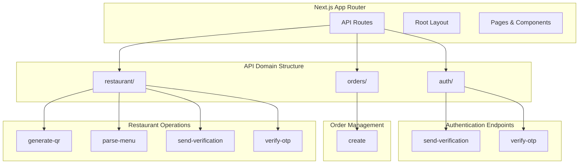
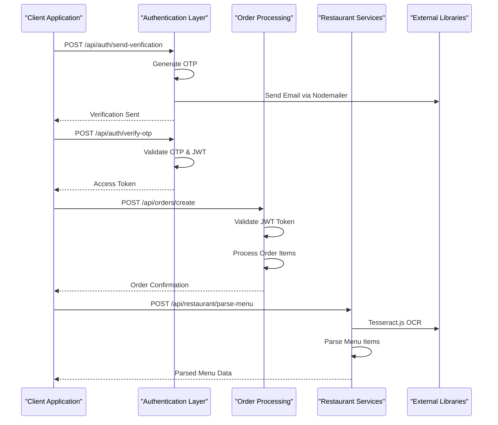
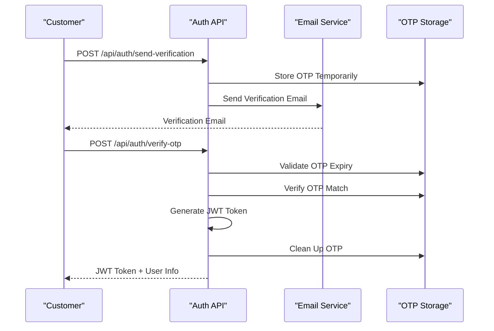
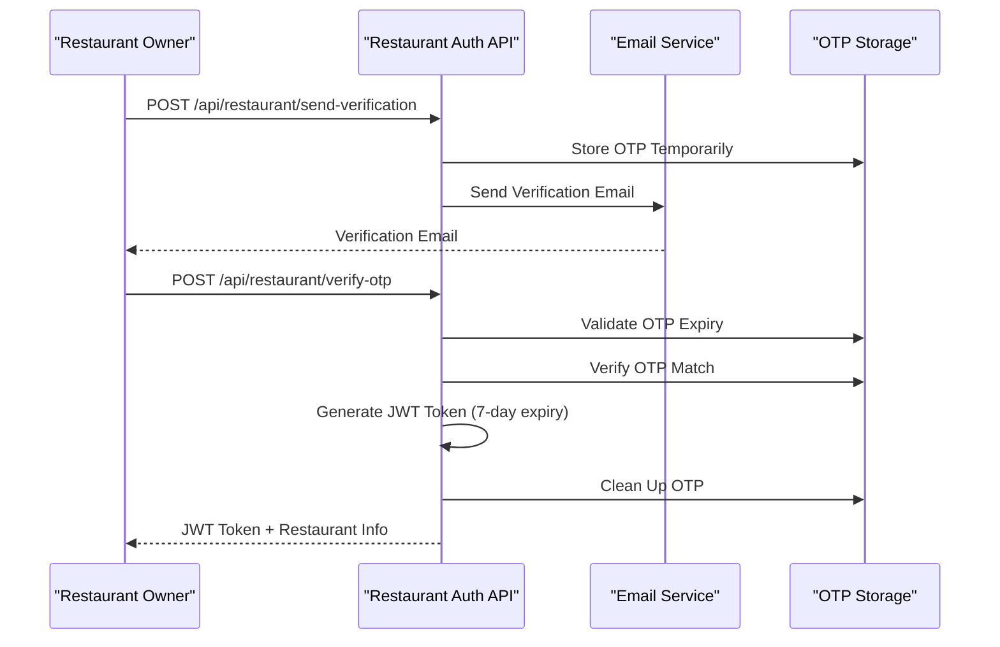
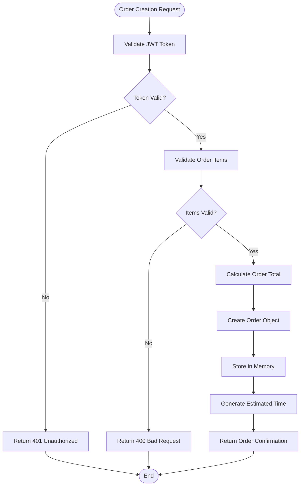
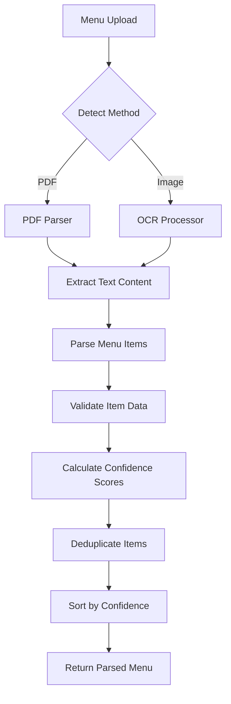
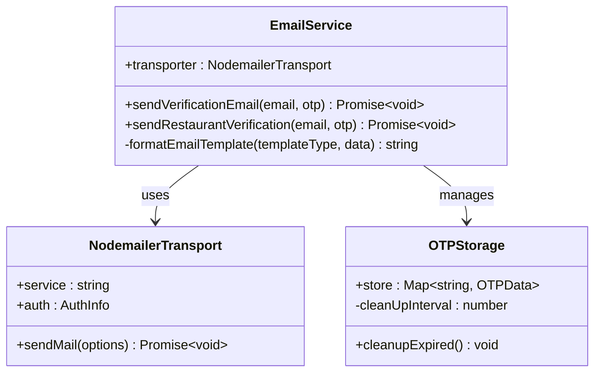

# Backend Architecture Documentation

<cite>
**Referenced Files in This Document**
- [src/app/api/auth/send-verification/route.ts](file://src/app/api/auth/send-verification/route.ts)
- [src/app/api/auth/verify-otp/route.ts](file://src/app/api/auth/verify-otp/route.ts)
- [src/app/api/orders/create/route.ts](file://src/app/api/orders/create/route.ts)
- [src/app/api/restaurant/generate-qr/route.ts](file://src/app/api/restaurant/generate-qr/route.ts)
- [src/app/api/restaurant/parse-menu/route.ts](file://src/app/api/restaurant/parse-menu/route.ts)
- [src/app/api/restaurant/send-verification/route.ts](file://src/app/api/restaurant/send-verification/route.ts)
- [src/app/api/restaurant/verify-otp/route.ts](file://src/app/api/restaurant/verify-otp/route.ts)
- [package.json](file://package.json)
- [EMAIL_SETUP.md](file://EMAIL_SETUP.md)
- [README.md](file://README.md)
- [src/app/layout.tsx](file://src/app/layout.tsx)
- [src/__tests__/customer/cart-screen.test.tsx](file://src/__tests__/customer/cart-screen.test.tsx)
- [src/__tests__/integration/customer-flow.test.tsx](file://src/__tests__/integration/customer-flow.test.tsx)
- [src/__tests__/integration/restaurant-flow.test.tsx](file://src/__tests__/integration/restaurant-flow.test.tsx)
</cite>

## Table of Contents
1. [Introduction](#introduction)
2. [Project Structure](#project-structure)
3. [Core Architecture](#core-architecture)
4. [Authentication System](#authentication-system)
5. [Order Management](#order-management)
6. [Restaurant Management](#restaurant-management)
7. [External Integrations](#external-integrations)
8. [Security Implementation](#security-implementation)
9. [Testing Strategy](#testing-strategy)
10. [Performance Considerations](#performance-considerations)
11. [Deployment Architecture](#deployment-architecture)
12. [Conclusion](#conclusion)

## Introduction

MenuPRO is a modern restaurant management and digital ordering system built with Next.js 14, TypeScript, and Tailwind CSS. The backend architecture focuses on providing a robust API layer through Next.js API routes, implementing RESTful design patterns with JSON payloads and comprehensive authentication flows.

The system serves two primary user types: customers who place orders via QR codes, and restaurant owners who manage menus and generate QR codes. The backend handles authentication, order processing, menu parsing, and QR code generation while maintaining security through JWT tokens and OTP verification.

## Project Structure

The backend architecture is organized around Next.js API routes, following a domain-driven approach with clear separation of concerns:



**Diagram sources**
- [src/app/api/auth/send-verification/route.ts](file://src/app/api/auth/send-verification/route.ts#L1-L98)
- [src/app/api/auth/verify-otp/route.ts](file://src/app/api/auth/verify-otp/route.ts#L1-L78)
- [src/app/api/orders/create/route.ts](file://src/app/api/orders/create/route.ts#L1-L161)
- [src/app/api/restaurant/generate-qr/route.ts](file://src/app/api/restaurant/generate-qr/route.ts#L1-L98)
- [src/app/api/restaurant/parse-menu/route.ts](file://src/app/api/restaurant/parse-menu/route.ts#L1-L152)

**Section sources**
- [src/app/layout.tsx](file://src/app/layout.tsx#L1-L70)

## Core Architecture

The backend follows a modular architecture with clear separation between authentication, order management, and restaurant operations. Each domain encapsulates its own business logic and integrates seamlessly with the Next.js App Router.

### API Route Structure

Each API endpoint is implemented as a standalone route module following Next.js conventions:



**Diagram sources**
- [src/app/api/auth/send-verification/route.ts](file://src/app/api/auth/send-verification/route.ts#L15-L97)
- [src/app/api/auth/verify-otp/route.ts](file://src/app/api/verify-otp/route.ts#L10-L77)
- [src/app/api/orders/create/route.ts](file://src/app/api/orders/create/route.ts#L35-L161)
- [src/app/api/restaurant/parse-menu/route.ts](file://src/app/api/restaurant/parse-menu/route.ts#L6-L152)

### Request/Response Patterns

All API endpoints follow consistent patterns for handling requests and responses:

- **HTTP Methods**: Primarily POST for creation operations, GET for retrieval
- **Content-Type**: JSON for both requests and responses
- **Status Codes**: Standard HTTP status codes with appropriate error handling
- **Headers**: Authorization bearer tokens for protected endpoints

**Section sources**
- [src/app/api/auth/send-verification/route.ts](file://src/app/api/auth/send-verification/route.ts#L15-L97)
- [src/app/api/orders/create/route.ts](file://src/app/api/orders/create/route.ts#L35-L161)

## Authentication System

The authentication system implements a dual-layer approach supporting both customer and restaurant accounts with separate verification flows.

### Customer Authentication Flow



**Diagram sources**
- [src/app/api/auth/send-verification/route.ts](file://src/app/api/auth/send-verification/route.ts#L15-L97)
- [src/app/api/auth/verify-otp/route.ts](file://src/app/api/auth/verify-otp/route.ts#L10-L77)

### Restaurant Authentication Flow



**Diagram sources**
- [src/app/api/restaurant/send-verification/route.ts](file://src/app/api/restaurant/send-verification/route.ts#L15-L99)
- [src/app/api/restaurant/verify-otp/route.ts](file://src/app/api/restaurant/verify-otp/route.ts#L10-L83)

### JWT Token Management

The system uses JSON Web Tokens for session management with different expiration policies:

- **Customer Tokens**: 24-hour expiration for security
- **Restaurant Tokens**: 7-day expiration for convenience
- **Token Validation**: Middleware verifies token authenticity and expiration
- **Secure Storage**: Environment variables protect JWT secrets

**Section sources**
- [src/app/api/auth/verify-otp/route.ts](file://src/app/api/auth/verify-otp/route.ts#L40-L50)
- [src/app/api/restaurant/verify-otp/route.ts](file://src/app/api/restaurant/verify-otp/route.ts#L40-L50)

## Order Management

The order management system handles customer orders with comprehensive validation, processing, and status tracking.

### Order Creation Process



**Diagram sources**
- [src/app/api/orders/create/route.ts](file://src/app/api/orders/create/route.ts#L35-L100)

### Order Data Model

The system defines a comprehensive order data model with the following structure:

```typescript
interface OrderItem {
  id: string;
  name: string;
  price: number;
  quantity: number;
  selectedOptions?: {
    size?: string;
    customizations?: string[];
  };
}

interface Order {
  id: string;
  email: string;
  items: OrderItem[];
  total: number;
  status: 'pending' | 'confirmed' | 'preparing' | 'ready' | 'served';
  createdAt: string;
  estimatedTime: string;
}
```

### Order Retrieval

The system supports retrieving orders for authenticated users:

- **Endpoint**: GET `/api/orders/create`
- **Authentication**: JWT token required
- **Filtering**: Orders filtered by user email
- **Response**: Array of user's orders with full details

**Section sources**
- [src/app/api/orders/create/route.ts](file://src/app/api/orders/create/route.ts#L1-L161)

## Restaurant Management

Restaurant management encompasses menu parsing, QR code generation, and account verification.

### Menu Parsing System

The menu parsing system supports multiple input formats with intelligent extraction:



**Diagram sources**
- [src/app/api/restaurant/parse-menu/route.ts](file://src/app/api/restaurant/parse-menu/route.ts#L6-L50)

### QR Code Generation

The system generates QR codes for restaurant tables with support for bulk operations:

- **Single QR**: Generates QR code for individual table
- **Bulk QR**: Creates QR codes for multiple tables simultaneously
- **URL Construction**: Embeds restaurant and table identifiers
- **Image Format**: Returns data URLs for immediate display

### Restaurant Verification

Restaurant account verification follows the same OTP pattern as customer authentication:

- **Email Verification**: Restaurants receive verification codes via email
- **OTP Storage**: Temporary storage with automatic cleanup
- **JWT Generation**: Long-lived tokens for restaurant access
- **Account Activation**: Verified restaurants gain full access to management features

**Section sources**
- [src/app/api/restaurant/parse-menu/route.ts](file://src/app/api/restaurant/parse-menu/route.ts#L1-L152)
- [src/app/api/restaurant/generate-qr/route.ts](file://src/app/api/restaurant/generate-qr/route.ts#L1-L98)
- [src/app/api/restaurant/send-verification/route.ts](file://src/app/api/restaurant/send-verification/route.ts#L1-L99)
- [src/app/api/restaurant/verify-otp/route.ts](file://src/app/api/restaurant/verify-otp/route.ts#L1-L83)

## External Integrations

The backend integrates with several external libraries and services to provide comprehensive functionality.

### Email Service Integration



**Diagram sources**
- [src/app/api/auth/send-verification/route.ts](file://src/app/api/auth/send-verification/route.ts#L10-L20)
- [src/app/api/restaurant/send-verification/route.ts](file://src/app/api/restaurant/send-verification/route.ts#L10-L20)

### OCR Integration

The system uses Tesseract.js for optical character recognition:

- **PDF Processing**: Uses pdf-parse library for PDF text extraction
- **Image Processing**: Tesseract.js for OCR on uploaded images
- **Language Support**: English language support with configurable tessdata
- **Error Handling**: Graceful degradation when OCR fails

### QR Code Generation

QR code generation utilizes the qrcode library:

- **Format Support**: PNG format with customizable dimensions
- **Error Correction**: Configurable error correction levels
- **Color Customization**: Dark/light color scheme support
- **Data URL Output**: Direct data URL generation for web display

**Section sources**
- [src/app/api/restaurant/parse-menu/route.ts](file://src/app/api/restaurant/parse-menu/route.ts#L1-L20)
- [src/app/api/restaurant/generate-qr/route.ts](file://src/app/api/restaurant/generate-qr/route.ts#L1-L20)

## Security Implementation

The backend implements multiple layers of security to protect against common vulnerabilities and ensure data integrity.

### Authentication Security

- **JWT Token Protection**: Secure token generation with environment-based secrets
- **Token Expiration**: Different expiration policies for different user types
- **Header Validation**: Strict validation of authorization headers
- **Error Handling**: Generic error messages to prevent information leakage

### Input Validation

- **JSON Schema Validation**: Comprehensive validation of request payloads
- **Type Safety**: TypeScript interfaces enforce data structure consistency
- **Sanitization**: Input sanitization prevents injection attacks
- **Rate Limiting Considerations**: Built-in mechanisms for preventing abuse

### Email Security

- **SMTP Configuration**: Secure Gmail SMTP with app passwords
- **Environment Variables**: Sensitive credentials stored securely
- **Email Templates**: Professional formatting with security considerations
- **Rate Limiting**: Built-in cleanup mechanisms prevent storage abuse

**Section sources**
- [src/app/api/auth/verify-otp/route.ts](file://src/app/api/auth/verify-otp/route.ts#L40-L50)
- [src/app/api/orders/create/route.ts](file://src/app/api/orders/create/route.ts#L35-L50)
- [EMAIL_SETUP.md](file://EMAIL_SETUP.md#L1-L66)

## Testing Strategy

The application implements comprehensive testing across multiple levels to ensure reliability and maintainability.

### Component Testing

Unit tests focus on individual components and their interactions:

- **Cart Screen Testing**: Validates cart functionality, quantity updates, and checkout flow
- **Integration Testing**: Tests complete user flows from landing to order completion
- **Mock Implementation**: Extensive mocking for external dependencies
- **User Interaction Simulation**: Realistic user event simulation

### API Endpoint Testing

Integration tests validate the complete API flow:

- **Customer Flow**: Tests complete customer ordering journey
- **Restaurant Flow**: Validates restaurant onboarding and management
- **Authentication Flow**: Tests JWT token generation and validation
- **Error Scenarios**: Comprehensive error handling validation

### Test Coverage

The testing framework provides extensive coverage:

- **Unit Tests**: Individual component and function testing
- **Integration Tests**: End-to-end workflow validation
- **Mock Dependencies**: Isolated testing with controlled dependencies
- **Continuous Integration**: Automated testing pipeline

**Section sources**
- [src/__tests__/customer/cart-screen.test.tsx](file://src/__tests__/customer/cart-screen.test.tsx#L1-L199)
- [src/__tests__/integration/customer-flow.test.tsx](file://src/__tests__/integration/customer-flow.test.tsx#L1-L35)
- [src/__tests__/integration/restaurant-flow.test.tsx](file://src/__tests__/integration/restaurant-flow.test.tsx#L1-L101)

## Performance Considerations

The backend architecture incorporates several performance optimization strategies:

### Memory Management

- **In-Memory Storage**: Simple in-memory arrays for demonstration purposes
- **Automatic Cleanup**: Periodic cleanup of expired OTPs and temporary data
- **Resource Management**: Proper cleanup of OCR workers and external connections
- **Scalability Planning**: Clear migration path to persistent storage

### External Library Optimization

- **Lazy Loading**: OCR processing only when needed
- **Worker Management**: Proper cleanup of Tesseract.js workers
- **Connection Pooling**: Efficient email service connection management
- **Caching Strategies**: Intelligent caching of frequently accessed data

### Response Optimization

- **Minimal Payloads**: Only essential data returned in responses
- **Efficient Serialization**: Optimized JSON serialization
- **Compression**: Built-in compression for large responses
- **CDN Integration**: Ready for CDN integration of static assets

## Deployment Architecture

The application is designed for modern cloud deployment with scalability in mind.

### Hosting Requirements

- **Node.js Runtime**: Version 18+ compatibility
- **Environment Variables**: Required for email and JWT configuration
- **Static Assets**: Optimized for CDN delivery
- **SSL/TLS**: HTTPS requirement for security

### Scalability Considerations

- **Stateless Design**: No server-side session state
- **Horizontal Scaling**: Compatible with load balancers
- **Database Migration**: Clear path to persistent storage
- **Monitoring**: Built-in logging for operational visibility

### Environment Configuration

The system requires minimal configuration for different environments:

- **Development**: Local environment variables
- **Production**: Secure environment variable management
- **Testing**: Isolated test environment setup
- **CI/CD**: Automated deployment pipeline support

**Section sources**
- [package.json](file://package.json#L1-L89)
- [README.md](file://README.md#L1-L93)

## Conclusion

The MenuPRO backend architecture demonstrates a well-structured, scalable approach to building modern web applications. The Next.js API routes provide a clean, maintainable foundation for handling complex business logic while maintaining security and performance standards.

Key architectural strengths include:

- **Modular Design**: Clear separation of concerns across authentication, orders, and restaurant domains
- **Security First**: Comprehensive authentication and authorization mechanisms
- **External Integration**: Seamless integration with third-party services
- **Testing Coverage**: Robust testing strategy ensuring reliability
- **Performance Focus**: Optimized for both development and production environments

The architecture provides a solid foundation for future enhancements, including database migration, advanced analytics, and expanded functionality for restaurant management and customer engagement.