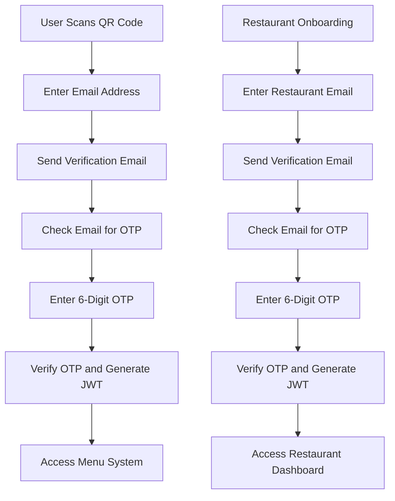
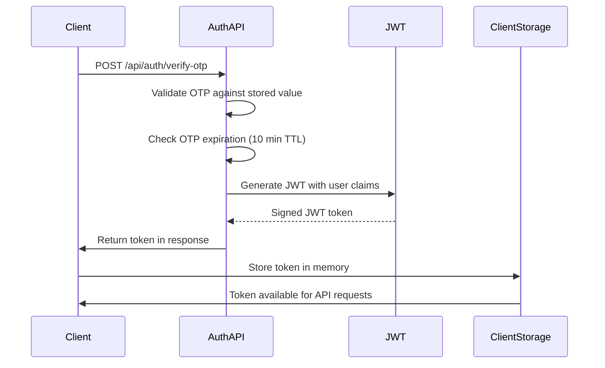
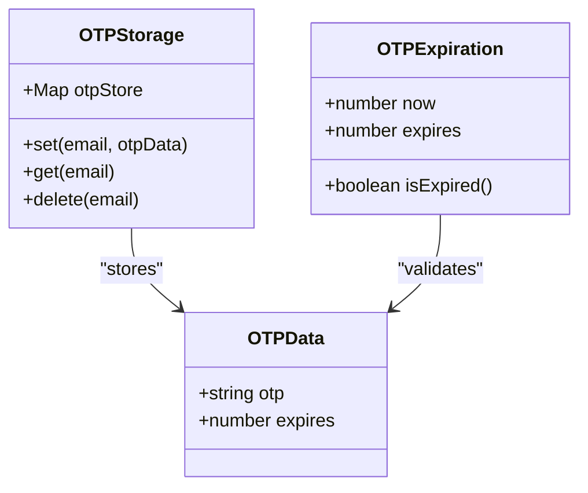

# Authentication Service

<cite>
**Referenced Files in This Document**   
- [send-verification/route.ts](file://src/app/api/auth/send-verification/route.ts)
- [verify-otp/route.ts](file://src/app/api/auth/verify-otp/route.ts)
- [restaurant/send-verification/route.ts](file://src/app/api/restaurant/send-verification/route.ts)
- [restaurant/verify-otp/route.ts](file://src/app/api/restaurant/verify-otp/route.ts)
- [email-verification-screen.tsx](file://src/components/pwa/email-verification-screen.tsx)
- [otp-verification-screen.tsx](file://src/components/pwa/otp-verification-screen.tsx)
- [restaurant-onboarding-screen.tsx](file://src/components/restaurant/restaurant-onboarding-screen.tsx)
- [restaurant-otp-screen.tsx](file://src/components/restaurant/restaurant-otp-screen.tsx)
- [EMAIL_SETUP.md](file://EMAIL_SETUP.md)
</cite>

## Table of Contents
1. [Introduction](#introduction)
2. [Authentication Flows](#authentication-flows)
3. [JWT Token Flow](#jwt-token-flow)
4. [Request Validation](#request-validation)
5. [Temporary Token Storage](#temporary-token-storage)
6. [Rate Limiting and Security](#rate-limiting-and-security)
7. [Error Handling](#error-handling)
8. [Route Handlers and Middleware](#route-handlers-and-middleware)
9. [Role-Specific Authentication Contexts](#role-specific-authentication-contexts)
10. [Common Issues and Solutions](#common-issues-and-solutions)
11. [Security Best Practices](#security-best-practices)

## Introduction
The Authentication Service in MenuPRO provides secure user and restaurant onboarding through email verification and OTP validation. This document details the implementation of the authentication system, focusing on the JWT-based token flow, request validation, temporary token storage, rate limiting, token expiration, and error handling mechanisms. The service supports both customer and restaurant authentication flows with role-specific contexts while maintaining a consistent verification process.

**Section sources**
- [send-verification/route.ts](file://src/app/api/auth/send-verification/route.ts)
- [verify-otp/route.ts](file://src/app/api/auth/verify-otp/route.ts)

## Authentication Flows
The authentication system implements two primary flows: customer onboarding and restaurant onboarding. Both flows follow a two-step verification process using email-based OTPs. The customer flow begins with QR code scanning and email verification, while the restaurant flow starts with restaurant information collection followed by email verification. Despite different entry points, both flows share the same underlying authentication service with minor variations in token payload and expiration.



**Diagram sources**
- [email-verification-screen.tsx](file://src/components/pwa/email-verification-screen.tsx)
- [restaurant-onboarding-screen.tsx](file://src/components/restaurant/restaurant-onboarding-screen.tsx)
- [otp-verification-screen.tsx](file://src/components/pwa/otp-verification-screen.tsx)
- [restaurant-otp-screen.tsx](file://src/components/restaurant/restaurant-otp-screen.tsx)

**Section sources**
- [email-verification-screen.tsx](file://src/components/pwa/email-verification-screen.tsx)
- [restaurant-onboarding-screen.tsx](file://src/components/restaurant/restaurant-onboarding-screen.tsx)

## JWT Token Flow
The authentication service implements JWT-based token flow for secure user sessions. Upon successful OTP verification, the system generates a JWT token containing user information and verification status. Customer tokens have a 24-hour expiration, while restaurant tokens have a 7-day expiration to accommodate different usage patterns. The token includes standard claims such as email, verification status, and issuance time, with restaurant tokens including a type identifier.



**Diagram sources**
- [verify-otp/route.ts](file://src/app/api/auth/verify-otp/route.ts)
- [restaurant/verify-otp/route.ts](file://src/app/api/restaurant/verify-otp/route.ts)

**Section sources**
- [verify-otp/route.ts](file://src/app/api/auth/verify-otp/route.ts)
- [restaurant/verify-otp/route.ts](file://src/app/api/restaurant/verify-otp/route.ts)

## Request Validation
The authentication service implements comprehensive request validation at both the API and UI levels. API endpoints validate required fields such as email and OTP, returning appropriate error responses for missing or invalid data. The email-verification-screen.tsx component includes client-side validation for email format using regex patterns, while the OTP verification screens validate input length and format. All validation errors are communicated to users with descriptive messages to guide successful completion of the authentication process.

**Section sources**
- [send-verification/route.ts](file://src/app/api/auth/send-verification/route.ts)
- [verify-otp/route.ts](file://src/app/api/auth/verify-otp/route.ts)
- [email-verification-screen.tsx](file://src/components/pwa/email-verification-screen.tsx)
- [otp-verification-screen.tsx](file://src/components/pwa/otp-verification-screen.tsx)

## Temporary Token Storage
The service uses in-memory storage via JavaScript Map objects to temporarily store OTPs with their expiration timestamps. Each OTP entry contains the code and expiration time (10 minutes from creation). A cleanup interval runs every 5 minutes to remove expired OTPs, preventing memory bloat. This approach provides a simple solution for development and testing, though the EMAIL_SETUP.md documentation recommends Redis or database storage for production environments.



**Diagram sources**
- [send-verification/route.ts](file://src/app/api/auth/send-verification/route.ts)
- [verify-otp/route.ts](file://src/app/api/auth/verify-otp/route.ts)

**Section sources**
- [send-verification/route.ts](file://src/app/api/auth/send-verification/route.ts)
- [verify-otp/route.ts](file://src/app/api/auth/verify-otp/route.ts)

## Rate Limiting and Security
While the current implementation does not include explicit rate limiting, the EMAIL_SETUP.md documentation highlights it as a critical production consideration. The system prevents abuse through OTP expiration (5-minute effective TTL due to cleanup intervals) and single-use tokens that are deleted upon verification. The use of environment variables for sensitive data like JWT secrets and Gmail credentials follows security best practices. Future implementations should incorporate rate limiting to prevent email bombing and brute force attacks on the OTP verification endpoint.

**Section sources**
- [EMAIL_SETUP.md](file://EMAIL_SETUP.md)
- [send-verification/route.ts](file://src/app/api/auth/send-verification/route.ts)

## Error Handling
The authentication service implements comprehensive error handling for various failure scenarios. The system returns specific error messages for invalid email format, missing fields, expired OTPs, incorrect OTPs, and server errors. Client components display these errors with appropriate styling to guide users toward resolution. OTP expiration is handled by checking timestamps before verification and cleaning up expired entries. Server-side errors are logged for debugging while returning generic failure messages to clients for security.

**Section sources**
- [verify-otp/route.ts](file://src/app/api/auth/verify-otp/route.ts)
- [email-verification-screen.tsx](file://src/components/pwa/email-verification-screen.tsx)
- [otp-verification-screen.tsx](file://src/components/pwa/otp-verification-screen.tsx)

## Route Handlers and Middleware
The authentication service exposes RESTful API endpoints for sending verification emails and verifying OTPs. The send-verification route generates a 6-digit OTP, stores it with expiration metadata, and sends a formatted email via Gmail SMTP. The verify-otp route validates the provided OTP against the stored value, checks expiration, and returns a JWT token upon successful verification. Both endpoints use standard HTTP status codes and JSON responses. Middleware functionality is implemented directly within the route handlers, including request parsing, validation, and error handling.

**Section sources**
- [send-verification/route.ts](file://src/app/api/auth/send-verification/route.ts)
- [verify-otp/route.ts](file://src/app/api/auth/verify-otp/route.ts)

## Role-Specific Authentication Contexts
The authentication service supports both customer and restaurant onboarding through parallel API endpoints with role-specific contexts. While the core verification logic is identical, the restaurant flow includes additional context in the JWT token (type: 'restaurant') and longer token expiration (7 days vs 24 hours). The UI components are separated into customer and restaurant directories, allowing for tailored user experiences while reusing the same underlying authentication service. This design enables consistent security practices across user types while accommodating different business requirements.

```mermaid
flowchart TD
A[Authentication Service] --> B[Customer Flow]
A --> C[Restaurant Flow]
B --> D[/api/auth/send-verification]
B --> E[/api/auth/verify-otp]
B --> F[24h JWT Expiration]
B --> G[Customer Claims]
C --> H[/api/restaurant/send-verification]
C --> I[/api/restaurant/verify-otp]
C --> J[7d JWT Expiration]
C --> K[Restaurant Claims]
D --> L[Shared OTP Logic]
E --> L
H --> L
I --> L
```

**Diagram sources**
- [send-verification/route.ts](file://src/app/api/auth/send-verification/route.ts)
- [restaurant/send-verification/route.ts](file://src/app/api/restaurant/send-verification/route.ts)
- [verify-otp/route.ts](file://src/app/api/auth/verify-otp/route.ts)
- [restaurant/verify-otp/route.ts](file://src/app/api/restaurant/verify-otp/route.ts)

**Section sources**
- [send-verification/route.ts](file://src/app/api/auth/send-verification/route.ts)
- [restaurant/send-verification/route.ts](file://src/app/api/restaurant/send-verification/route.ts)
- [verify-otp/route.ts](file://src/app/api/auth/verify-otp/route.ts)
- [restaurant/verify-otp/route.ts](file://src/app/api/restaurant/verify-otp/route.ts)

## Common Issues and Solutions
Common issues in the authentication flow include email delivery failures, OTP retry limits, and timing issues with expiration. Email delivery can be affected by Gmail's sending limits and spam filters, which can be mitigated by using dedicated email services in production. The current implementation allows unlimited OTP requests, potentially enabling abuse; implementing rate limiting would address this. Users may experience confusion with the 10-minute OTP expiration, which could be improved with clearer countdown timers and automatic refresh options. Network issues during verification can be handled with better error recovery and retry mechanisms.

**Section sources**
- [EMAIL_SETUP.md](file://EMAIL_SETUP.md)
- [otp-verification-screen.tsx](file://src/components/pwa/otp-verification-screen.tsx)

## Security Best Practices
For production deployment, several security best practices should be implemented beyond the current development configuration. These include using Redis or a database for OTP storage instead of in-memory structures, implementing rate limiting to prevent abuse, using dedicated email service providers instead of Gmail SMTP, and ensuring proper logging and monitoring. Environment variables should contain strong, randomly generated secrets for JWT signing. The system should also implement proper CORS policies, input sanitization, and security headers to protect against common web vulnerabilities.

**Section sources**
- [EMAIL_SETUP.md](file://EMAIL_SETUP.md)
- [send-verification/route.ts](file://src/app/api/auth/send-verification/route.ts)