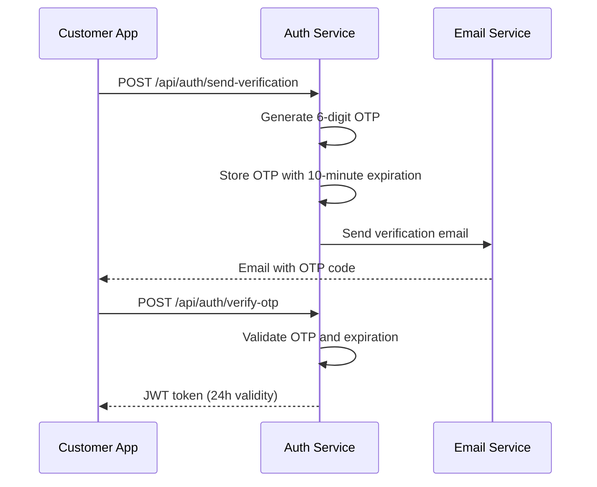
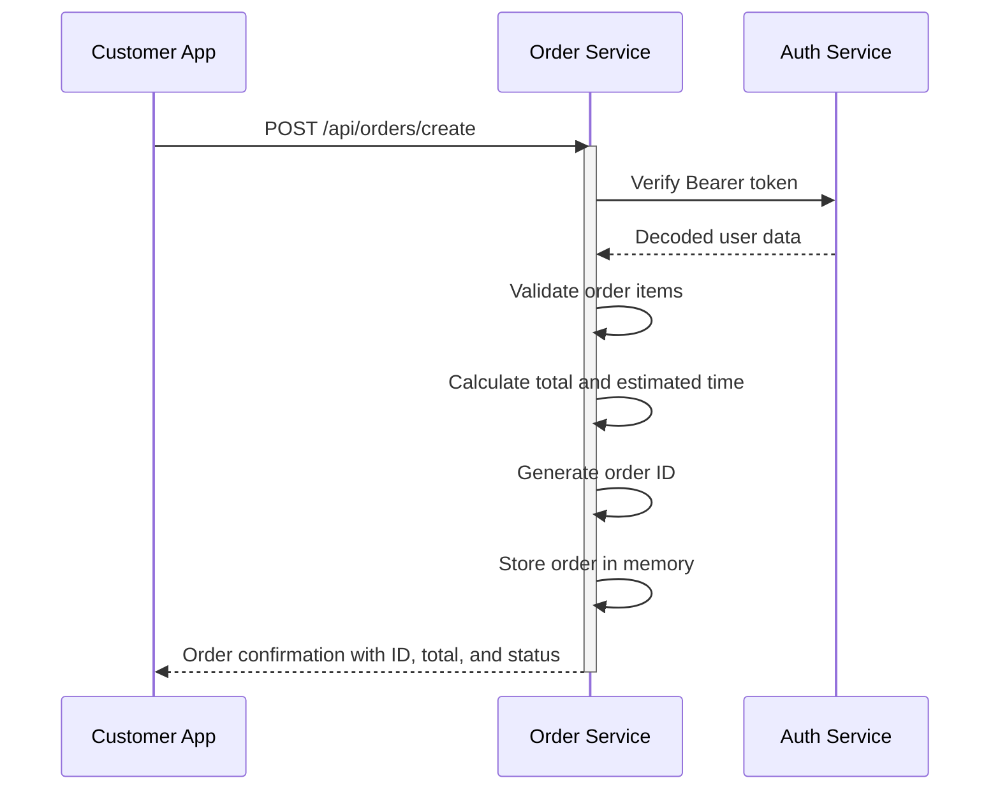
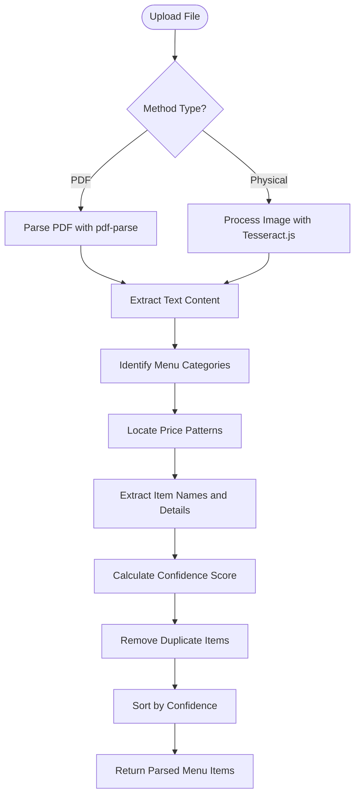
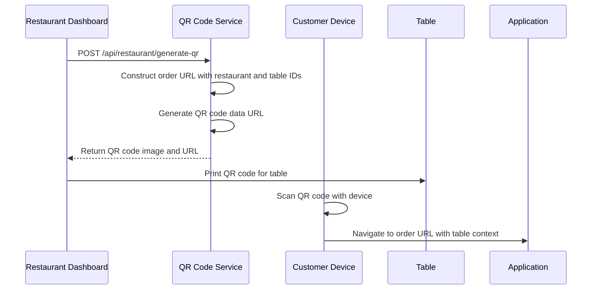
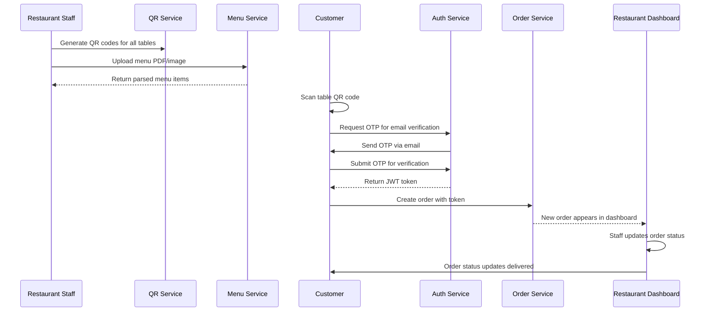

# Core Services

<cite>
**Referenced Files in This Document**   
- [send-verification/route.ts](file://src/app/api/auth/send-verification/route.ts)
- [verify-otp/route.ts](file://src/app/api/auth/verify-otp/route.ts)
- [orders/create/route.ts](file://src/app/api/orders/create/route.ts)
- [restaurant/generate-qr/route.ts](file://src/app/api/restaurant/generate-qr/route.ts)
- [restaurant/parse-menu/route.ts](file://src/app/api/restaurant/parse-menu/route.ts)
- [restaurant/send-verification/route.ts](file://src/app/api/restaurant/send-verification/route.ts)
- [restaurant/verify-otp/route.ts](file://src/app/api/restaurant/verify-otp/route.ts)
- [package.json](file://package.json)
- [EMAIL_SETUP.md](file://EMAIL_SETUP.md)
- [restaurant-dashboard.tsx](file://src/components/restaurant/restaurant-dashboard.tsx)
</cite>

## Table of Contents
1. [Introduction](#introduction)
2. [Authentication Service](#authentication-service)
3. [Order Management Service](#order-management-service)
4. [Menu Processing Service](#menu-processing-service)
5. [QR Code Service](#qr-code-service)
6. [Service Interactions](#service-interactions)
7. [Performance and Scalability](#performance-and-scalability)
8. [Error Handling and Retry Mechanisms](#error-handling-and-retry-mechanisms)
9. [Consumption by Frontend and Backend](#consumption-by-frontend-and-backend)
10. [Conclusion](#conclusion)

## Introduction
The MenuPRO-App-main application provides a comprehensive digital menu and ordering system for restaurants. This document details the core services that power the application, including Authentication, Order Management, Menu Processing, and QR Code generation services. These services work together to provide a seamless experience for both customers and restaurant staff, enabling digital ordering through QR codes, secure authentication, and efficient order processing.

## Authentication Service
The Authentication Service handles email verification and OTP validation for both customers and restaurant staff using JWT tokens. The service provides separate endpoints for customer and restaurant authentication flows, with different token expiration policies.

The service implements a temporary OTP storage mechanism using in-memory Map objects, with periodic cleanup of expired codes. For customer authentication, tokens expire after 24 hours, while restaurant tokens have a longer 7-day expiration period, reflecting different security requirements for these user types.

**Diagram sources**
- [send-verification/route.ts](file://src/app/api/auth/send-verification/route.ts)
- [verify-otp/route.ts](file://src/app/api/auth/verify-otp/route.ts)

**Section sources**
- [send-verification/route.ts](file://src/app/api/auth/send-verification/route.ts)
- [verify-otp/route.ts](file://src/app/api/auth/verify-otp/route.ts)
- [restaurant/send-verification/route.ts](file://src/app/api/restaurant/send-verification/route.ts)
- [restaurant/verify-otp/route.ts](file://src/app/api/restaurant/verify-otp/route.ts)

## Order Management Service
The Order Management Service processes customer orders and handles order persistence. The service provides endpoints for creating new orders and retrieving existing orders for a specific user. Orders are authenticated using JWT tokens, ensuring that users can only access their own order history.

The service calculates order totals, generates unique order identifiers, and estimates preparation times based on item count. In the current implementation, orders are stored in memory, but the code includes comments indicating that in a production environment, orders would be saved to a database, notifications would be sent to restaurant staff, and kitchen display systems would be updated.

**Diagram sources**
- [orders/create/route.ts](file://src/app/api/orders/create/route.ts)

**Section sources**
- [orders/create/route.ts](file://src/app/api/orders/create/route.ts)

## Menu Processing Service
The Menu Processing Service extracts menu items from PDFs or images using pdf-parse for PDF extraction and Tesseract.js OCR for image processing. The service accepts file uploads through a multipart form and processes them based on the specified method (PDF or physical document).

The service implements a sophisticated menu parsing algorithm that identifies menu items, prices, descriptions, and categories from the extracted text. It uses confidence scoring to rank extracted items, considering factors like item name length, price reasonableness, presence of descriptions, and common food item keywords. The parser also handles menu structure by tracking categories and associating items with the appropriate section.

**Diagram sources**
- [restaurant/parse-menu/route.ts](file://src/app/api/restaurant/parse-menu/route.ts)

**Section sources**
- [restaurant/parse-menu/route.ts](file://src/app/api/restaurant/parse-menu/route.ts)

## QR Code Service
The QR Code Service generates unique table identifiers for restaurant tables, enabling customers to order directly from their tables. The service provides endpoints for generating individual QR codes and bulk generation for multiple tables.

Each QR code encodes a URL that includes the restaurant ID and table number, allowing the system to identify the specific table when a customer scans the code. The service uses the qrcode npm package to generate data URLs for the QR codes, with customizable styling including size, margin, and color scheme.

**Diagram sources**
- [restaurant/generate-qr/route.ts](file://src/app/api/restaurant/generate-qr/route.ts)

**Section sources**
- [restaurant/generate-qr/route.ts](file://src/app/api/restaurant/generate-qr/route.ts)

## Service Interactions
The core services work together to provide a complete ordering experience. When a restaurant onboards with MenuPRO, they use the restaurant authentication service to verify their email, then upload their menu using the menu processing service. They generate QR codes for their tables using the QR code service.

When a customer visits the restaurant, they scan a table's QR code, which directs them to the ordering interface with the table context pre-filled. The customer provides their email and receives an OTP via the authentication service. After verification, they can browse the menu and add items to their cart.

When placing an order, the order management service validates the customer's JWT token, processes the order, and stores it. Restaurant staff access the restaurant dashboard, which displays incoming orders that can be managed through various status transitions from pending to served.

**Diagram sources**
- [send-verification/route.ts](file://src/app/api/auth/send-verification/route.ts)
- [verify-otp/route.ts](file://src/app/api/auth/verify-otp/route.ts)
- [orders/create/route.ts](file://src/app/api/orders/create/route.ts)
- [restaurant/generate-qr/route.ts](file://src/app/api/restaurant/generate-qr/route.ts)
- [restaurant/parse-menu/route.ts](file://src/app/api/restaurant/parse-menu/route.ts)
- [restaurant-dashboard.tsx](file://src/components/restaurant/restaurant-dashboard.tsx)

## Performance and Scalability
The current implementation uses in-memory storage for OTPs and orders, which limits scalability and persistence. For production deployment, the documentation recommends using Redis for OTP storage and a database for order persistence.

The menu processing service may experience performance bottlenecks with large PDFs or low-quality images, as OCR processing is computationally intensive. The service could be optimized by implementing caching for previously processed menus and using asynchronous processing with job queues for large files.

The QR code service is lightweight and can handle high request volumes, especially since QR codes for a restaurant's tables are typically generated once during setup and then cached or stored.

JWT authentication provides good performance for token verification, avoiding database lookups for each request. However, the current implementation lacks token revocation capabilities, which could be addressed with a token blacklist or shorter expiration times for sensitive operations.

## Error Handling and Retry Mechanisms
Each service implements comprehensive error handling with appropriate HTTP status codes and descriptive error messages. The authentication service returns specific error codes for missing fields, expired OTPs, and invalid codes. The order service validates input and authentication tokens, returning appropriate 4xx errors for client issues and 5xx errors for server problems.

The system lacks explicit retry mechanisms in the current implementation. For production use, exponential backoff strategies should be implemented for failed operations, particularly for external service calls like email delivery. The EMAIL_SETUP.md documentation recommends implementing rate limiting and abuse prevention in production environments.

All services include comprehensive error logging to aid in debugging and monitoring. The code uses try-catch blocks to handle exceptions and prevent unhandled rejections from crashing the application.

## Consumption by Frontend and Backend
The core services are consumed by both frontend components and backend processes. The frontend PWA components use the authentication, order, and QR code services to provide the customer ordering experience. Restaurant-specific components use the restaurant authentication, menu processing, and dashboard services.

The restaurant dashboard component consumes the order management service to display and update order statuses. It uses mock data in the current implementation but is designed to integrate with the actual API endpoints.

Backend processes such as email delivery are handled through the nodemailer integration in the authentication services. The system is designed to be extended with additional backend processes for notifications, analytics, and integration with kitchen display systems.

## Conclusion
The MenuPRO-App-main core services provide a robust foundation for a digital restaurant ordering system. The modular service architecture allows for independent development and scaling of each component. While the current implementation uses in-memory storage for simplicity, the code is structured to easily integrate with proper databases and caching systems in production.

The services work together seamlessly to provide a complete ordering experience from QR code scanning to order fulfillment. With appropriate production hardening, including proper database integration, enhanced error handling, and improved security measures, this system can effectively serve restaurants of various sizes.