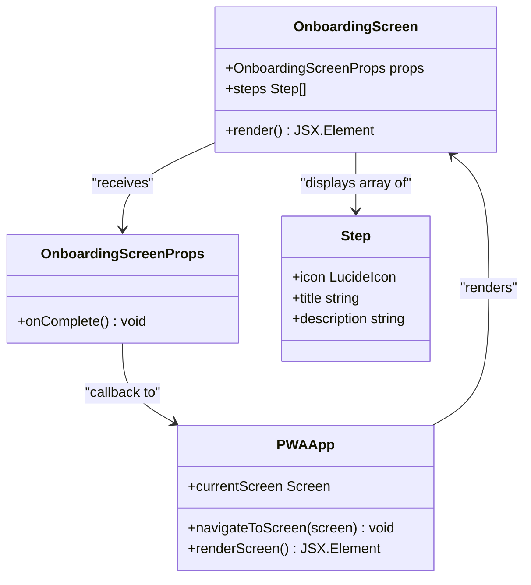
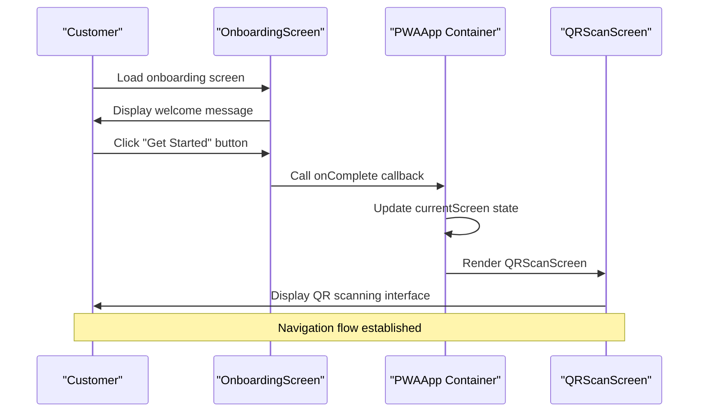
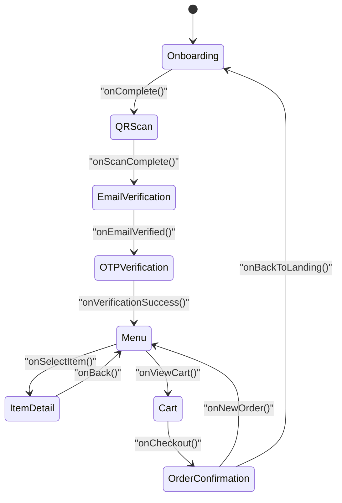
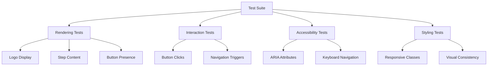

# Onboarding Screen

<cite>
**Referenced Files in This Document**
- [onboarding-screen.tsx](file://src/components/pwa/onboarding-screen.tsx)
- [pwa-app.tsx](file://src/components/pwa-app.tsx)
- [qr-scan-screen.tsx](file://src/components/pwa/qr-scan-screen.tsx)
- [email-verification-screen.tsx](file://src/components/pwa/email-verification-screen.tsx)
- [menu-screen.tsx](file://src/components/pwa/menu-screen.tsx)
- [item-detail-screen.tsx](file://src/components/pwa/item-detail-screen.tsx)
- [button.tsx](file://src/components/ui/button.tsx)
- [page.tsx](file://src/app/page.tsx)
- [onboarding-screen.test.tsx](file://src/__tests__/customer/onboarding-screen.test.tsx)
</cite>

## Table of Contents
1. [Introduction](#introduction)
2. [Component Architecture](#component-architecture)
3. [UI Layout and Design](#ui-layout-and-design)
4. [Navigation Flow](#navigation-flow)
5. [State Management](#state-management)
6. [Integration with PWAApp Container](#integration-with-pwaapp-container)
7. [Performance Considerations](#performance-considerations)
8. [Common Issues and Troubleshooting](#common-issues-and-troubleshooting)
9. [Testing Implementation](#testing-implementation)
10. [Best Practices](#best-practices)

## Introduction

The Onboarding Screen serves as the initial entry point for customers in the MenuPRO digital ordering system. This component captures restaurant context and guides users through the first-time access process, ultimately directing them to the QR scanning step where they can begin their ordering journey. The onboarding screen establishes the foundation for the entire customer ordering flow, providing essential information about the digital menu experience and setting expectations for seamless restaurant interactions.

The component is designed with a modern, intuitive interface that emphasizes simplicity and clarity. It presents a structured walkthrough of the ordering process through a series of numbered steps, each highlighting a key feature of the MenuPRO system. The screen incorporates brand identity elements including the MenuPRO logo, consistent color scheme, and responsive design patterns optimized for mobile-first experiences.

## Component Architecture

The Onboarding Screen follows a clean, functional component architecture built with React and TypeScript. The component is designed as a pure UI element that receives navigation callbacks through props, maintaining separation of concerns and enabling easy testing and maintenance.



**Diagram sources**
- [onboarding-screen.tsx](file://src/components/pwa/onboarding-screen.tsx#L1-L79)
- [pwa-app.tsx](file://src/components/pwa-app.tsx#L99-L101)

**Section sources**
- [onboarding-screen.tsx](file://src/components/pwa/onboarding-screen.tsx#L1-L79)

## UI Layout and Design

The Onboarding Screen employs a carefully crafted layout that prioritizes user experience and visual hierarchy. The component utilizes a gradient background transitioning from orange to red, creating a warm and inviting atmosphere that aligns with the restaurant theme.

### Layout Structure

The screen is organized into distinct sections:

1. **Header Section**: Contains the MenuPRO logo, main heading, and brief description
2. **Steps Section**: Displays a series of numbered steps with icons and descriptions
3. **Call-to-Action Section**: Features the primary "Get Started" button
4. **Footer Section**: Includes a subtle branding statement

### Responsive Design

The component implements responsive design principles to ensure optimal display across various device sizes:

```typescript
// Responsive container sizing
<div className="w-full max-w-md mx-auto text-center">

// Gradient background for visual appeal
<div className="min-h-screen flex flex-col items-center justify-center p-6 bg-gradient-to-br from-orange-50 to-red-50">

// Card-based step presentation
<Card key={index} className="border-none shadow-sm bg-white/60 backdrop-blur-sm">
```

### Visual Elements

Each step in the onboarding process is presented with a consistent visual pattern:

- **Icons**: Lucide-react icons provide visual cues for each step
- **Typography**: Clear, readable fonts with appropriate hierarchy
- **Color Scheme**: Orange and red accents with neutral backgrounds
- **Spacing**: Generous padding and margins for comfortable reading

**Section sources**
- [onboarding-screen.tsx](file://src/components/pwa/onboarding-screen.tsx#L20-L79)

## Navigation Flow

The Onboarding Screen integrates seamlessly with the broader customer ordering flow through a well-defined navigation pattern. The component acts as a gateway to the QR scanning phase, establishing the logical progression of the user journey.



**Diagram sources**
- [onboarding-screen.tsx](file://src/components/pwa/onboarding-screen.tsx#L75-L79)
- [pwa-app.tsx](file://src/components/pwa-app.tsx#L99-L101)

### Navigation Triggers

The navigation mechanism relies on a callback prop system:

```typescript
interface OnboardingScreenProps {
  onComplete: () => void;
}

// Button click handler
<Button 
  onClick={onComplete}
  className="w-full bg-orange-600 hover:bg-orange-700 text-white py-4 rounded-xl"
  size="lg"
>
  Get Started
</Button>
```

### State Synchronization

The PWAApp container maintains the global state for the entire ordering flow:

```typescript
const [currentScreen, setCurrentScreen] = useState<Screen>('onboarding');

const navigateToScreen = (screen: Screen) => {
  setCurrentScreen(screen);
};

// Navigation logic in renderScreen()
case 'onboarding':
  return <OnboardingScreen onComplete={() => navigateToScreen('qr-scan')} />;
```

**Section sources**
- [onboarding-screen.tsx](file://src/components/pwa/onboarding-screen.tsx#L75-L79)
- [pwa-app.tsx](file://src/components/pwa-app.tsx#L99-L101)

## State Management

The Onboarding Screen operates within a centralized state management system managed by the PWAApp container. This approach ensures consistency across the entire customer flow while maintaining component isolation.

### Global State Architecture



**Diagram sources**
- [pwa-app.tsx](file://src/components/pwa-app.tsx#L99-L153)

### State Variables

The PWAApp maintains several key state variables:

```typescript
const [currentScreen, setCurrentScreen] = useState<Screen>('onboarding');
const [selectedItem, setSelectedItem] = useState<MenuItem | null>(null);
const [cart, setCart] = useState<CartItem[]>([]);
const [userEmail, setUserEmail] = useState<string>('');
const [authToken, setAuthToken] = useState<string>('');
const [orderNumber, setOrderNumber] = useState<string>('');
```

### State Updates

State transitions occur through well-defined handlers:

```typescript
const handleEmailVerified = (email: string) => {
  setUserEmail(email);
  setCurrentScreen('otp-verification');
};

const handleOTPVerified = (token: string) => {
  setAuthToken(token);
  localStorage.setItem('authToken', token);
  setCurrentScreen('menu');
};
```

**Section sources**
- [pwa-app.tsx](file://src/components/pwa-app.tsx#L25-L40)
- [pwa-app.tsx](file://src/components/pwa-app.tsx#L65-L75)

## Integration with PWAApp Container

The Onboarding Screen is tightly integrated with the PWAApp container, which serves as the central orchestrator for the entire customer ordering experience. This integration ensures seamless navigation and consistent state management across all screens.

### Component Registration

The PWAApp registers the OnboardingScreen as part of its component inventory:

```typescript
import { OnboardingScreen } from "./pwa/onboarding-screen";
import { QRScanScreen } from "./pwa/qr-scan-screen";
import { EmailVerificationScreen } from "./pwa/email-verification-screen";
```

### Screen Rendering Logic

The PWAApp implements a sophisticated rendering system that dynamically displays the appropriate screen based on the current state:

```typescript
const renderScreen = () => {
  switch (currentScreen) {
    case 'onboarding':
      return <OnboardingScreen onComplete={() => navigateToScreen('qr-scan')} />;
    case 'qr-scan':
      return <QRScanScreen onScanComplete={() => navigateToScreen('email-verification')} />;
    // Additional cases...
  }
};
```

### Props Passing

The integration demonstrates proper prop passing patterns:

```typescript
// From PWAApp to OnboardingScreen
return <OnboardingScreen onComplete={() => navigateToScreen('qr-scan')} />;

// From OnboardingScreen to PWAApp
<Button onClick={onComplete} className="w-full bg-orange-600 hover:bg-orange-700 text-white py-4 rounded-xl">
  Get Started
</Button>
```

**Section sources**
- [pwa-app.tsx](file://src/components/pwa-app.tsx#L1-L10)
- [pwa-app.tsx](file://src/components/pwa-app.tsx#L99-L101)

## Performance Considerations

The Onboarding Screen is designed with performance optimization in mind, particularly for mobile network environments where users may experience slower connectivity.

### Fast Load Times

Several strategies ensure rapid loading:

1. **Minimal Bundle Size**: The component uses lightweight dependencies and avoids unnecessary libraries
2. **Efficient Rendering**: Simple JSX structure with minimal re-renders
3. **Optimized Images**: SVG icons and optimized image assets
4. **CSS Optimization**: Tailwind CSS utility classes for efficient styling

### Mobile Network Optimization

```typescript
// Optimized image loading
<Image
  src="/menupro-logo.svg"
  alt="MenuPRO Logo"
  width={80}
  height={80}
  className="w-20 h-20"
/>

// Efficient button styling
<Button 
  className="w-full bg-orange-600 hover:bg-orange-700 text-white py-4 rounded-xl"
  size="lg"
>
  Get Started
</Button>
```

### Memory Management

The component follows React best practices for memory efficiency:

- Stateless component design
- Minimal internal state
- Proper cleanup of event listeners
- Efficient event handler binding

**Section sources**
- [onboarding-screen.tsx](file://src/components/pwa/onboarding-screen.tsx#L30-L35)
- [onboarding-screen.tsx](file://src/components/pwa/onboarding-screen.tsx#L75-L79)

## Common Issues and Troubleshooting

Understanding potential issues helps in maintaining a smooth user experience and implementing effective solutions.

### Navigation Failures

**Issue**: Users unable to progress from onboarding to QR scan
**Cause**: Callback function not properly passed or executed
**Solution**: Verify that the onComplete prop is correctly bound to the navigation function

```typescript
// Correct implementation
<OnboardingScreen onComplete={() => navigateToScreen('qr-scan')} />

// Common mistake - missing arrow function
<OnboardingScreen onComplete={navigateToScreen('qr-scan')} /> // Incorrect
```

### Restaurant Selection Problems

**Issue**: Incorrect restaurant context not captured during onboarding
**Cause**: State synchronization issues between screens
**Solution**: Implement proper state persistence and validation

```typescript
// Ensure state is properly maintained
const handleRestaurantSelection = (restaurantId: string) => {
  localStorage.setItem('selectedRestaurant', restaurantId);
  navigateToScreen('qr-scan');
};
```

### Styling Issues

**Issue**: Components not displaying correctly on different devices
**Cause**: Responsive design not properly implemented
**Solution**: Verify Tailwind CSS classes and viewport configurations

```typescript
// Ensure responsive classes are present
<div className="w-full max-w-md mx-auto text-center">
```

### Performance Bottlenecks

**Issue**: Slow screen transitions or rendering delays
**Cause**: Heavy computations or inefficient state updates
**Solution**: Implement proper memoization and optimize state updates

```typescript
// Use React.memo for expensive components
export const OnboardingScreen = React.memo(({ onComplete }: OnboardingScreenProps) => {
  // Component implementation
});
```

## Testing Implementation

The Onboarding Screen includes comprehensive test coverage that validates both functionality and user experience aspects.

### Test Structure



**Diagram sources**
- [onboarding-screen.test.tsx](file://src/__tests__/customer/onboarding-screen.test.tsx#L1-L73)

### Key Test Cases

The test suite covers essential scenarios:

1. **Element Rendering**: Verifies all UI elements appear correctly
2. **User Interactions**: Tests button clicks and navigation triggers
3. **Accessibility**: Ensures proper ARIA attributes and keyboard navigation
4. **Styling Validation**: Confirms correct CSS class application

### Test Implementation Example

```typescript
it('calls onLaunchApp when launch button is clicked', async () => {
  const user = userEvent.setup()
  render(<OnboardingScreen onLaunchApp={mockOnLaunchApp} />)
  
  const launchButton = screen.getByRole('button', { name: /Launch App/i })
  await user.click(launchButton)
  
  expect(mockOnLaunchApp).toHaveBeenCalledTimes(1)
})
```

**Section sources**
- [onboarding-screen.test.tsx](file://src/__tests__/customer/onboarding-screen.test.tsx#L35-L42)

## Best Practices

Following established best practices ensures maintainable, scalable, and user-friendly implementations.

### Component Design Principles

1. **Single Responsibility**: The OnboardingScreen focuses solely on user onboarding
2. **Prop Driven**: All behavior is controlled through props, enabling flexibility
3. **Type Safety**: Comprehensive TypeScript interfaces ensure type safety
4. **Accessibility**: Proper ARIA labels and keyboard navigation support

### Code Organization

```typescript
// Interface definition for type safety
interface OnboardingScreenProps {
  onComplete: () => void;
}

// Functional component with clear structure
export function OnboardingScreen({ onComplete }: OnboardingScreenProps) {
  // Component implementation
}
```

### Performance Guidelines

1. **Minimize Re-renders**: Use appropriate React.memo and useCallback
2. **Efficient State Updates**: Batch state updates when possible
3. **Lazy Loading**: Consider lazy loading for heavy assets
4. **Bundle Optimization**: Regular bundle analysis and optimization

### User Experience Standards

1. **Clear Progression**: Logical step-by-step guidance
2. **Consistent Branding**: Maintain visual consistency across screens
3. **Responsive Design**: Optimal experience across all devices
4. **Error Handling**: Graceful handling of edge cases and errors

### Testing Strategies

1. **Comprehensive Coverage**: Test all user interaction scenarios
2. **Accessibility Compliance**: Automated accessibility testing
3. **Cross-Browser Compatibility**: Test across different browsers and devices
4. **Performance Monitoring**: Regular performance regression testing