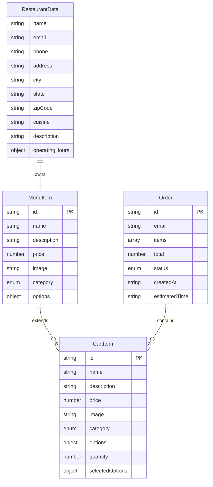

# Data Models

<cite>
**Referenced Files in This Document**
- [src/components/pwa-app.tsx](file://src/components/pwa-app.tsx)
- [src/app/api/orders/create/route.ts](file://src/app/api/orders/create/route.ts)
- [src/app/api/restaurant/generate-qr/route.ts](file://src/app/api/restaurant/generate-qr/route.ts)
- [src/app/api/restaurant/parse-menu/route.ts](file://src/app/api/restaurant/parse-menu/route.ts)
- [src/components/restaurant/restaurant-dashboard.tsx](file://src/components/restaurant/restaurant-dashboard.tsx)
- [src/components/restaurant/restaurant-onboarding-screen.tsx](file://src/components/restaurant/restaurant-onboarding-screen.tsx)
- [src/components/pwa/menu-screen.tsx](file://src/components/pwa/menu-screen.tsx)
- [src/components/restaurant/menu-upload-screen.tsx](file://src/components/restaurant/menu-upload-screen.tsx)
</cite>

## Table of Contents
1. [Introduction](#introduction)
2. [Core Data Models](#core-data-models)
3. [Entity Relationship Diagram](#entity-relationship-diagram)
4. [Detailed Model Specifications](#detailed-model-specifications)
5. [Data Validation and Constraints](#data-validation-and-constraints)
6. [Serialization Patterns](#serialization-patterns)
7. [Schema Evolution Strategies](#schema-evolution-strategies)
8. [TypeScript Interfaces](#typescript-interfaces)
9. [JSON Payload Examples](#json-payload-examples)
10. [Best Practices](#best-practices)

## Introduction

MenuPRO is a comprehensive restaurant menu management and ordering system built with Next.js 14, TypeScript, and Tailwind CSS. The application features four primary data models that work together to create a seamless digital ordering experience: **MenuItem**, **CartItem**, **Order**, and **RestaurantData**. These models are designed with strict type safety, validation rules, and maintainable architecture patterns suitable for both client-side and server-side operations.

The data models are structured to support the complete customer journey from QR code scanning to order completion, while also providing robust restaurant management capabilities including menu creation, order tracking, and analytics.

## Core Data Models

The MenuPRO application revolves around four fundamental data entities that define the complete ordering ecosystem:

### MenuItem
The foundational entity representing individual menu items available for purchase. Each MenuItem contains essential product information including pricing, categorization, and optional customization options.

### CartItem
A specialized extension of MenuItem that includes quantity and selected options, enabling dynamic cart management during the ordering process.

### Order
Represents a complete customer order with associated items, status tracking, and transaction details. Orders serve as the central hub for order lifecycle management.

### RestaurantData
Contains comprehensive restaurant information including contact details, operational hours, and business profile data used throughout the application.

## Entity Relationship Diagram



**Diagram sources**
- [src/components/pwa-app.tsx](file://src/components/pwa-app.tsx#L14-L30)
- [src/app/api/orders/create/route.ts](file://src/app/api/orders/create/route.ts#L3-L18)
- [src/components/restaurant/restaurant-onboarding-screen.tsx](file://src/components/restaurant/restaurant-onboarding-screen.tsx#L25-L35)

## Detailed Model Specifications

### MenuItem Model

The MenuItem serves as the cornerstone of the menu system, providing essential product information with extensible customization capabilities.

```typescript
interface MenuItem {
  id: string;                                    // Unique identifier (UUID format)
  name: string;                                  // Product name (3-100 characters)
  description: string;                           // Product description (max 500 chars)
  price: number;                                 // Price in USD (positive, min $0.99)
  image: string;                                 // Image URL or base64 data
  category: 'appetizers' | 'mains' | 'desserts' | 'beverages'; // Categorization
  options?: {                                    // Optional customization options
    size?: string[];                             // Size variations (small, medium, large)
    customizations?: string[];                   // Add-on options (extra cheese, etc.)
  };
}
```

**Business Rules:**
- Price must be greater than $0.99 to prevent invalid pricing
- Category must be one of predefined values
- Image URL must be valid and accessible
- Options array length should not exceed 10 items

**Section sources**
- [src/components/pwa-app.tsx](file://src/components/pwa-app.tsx#L14-L22)
- [src/components/pwa/menu-screen.tsx](file://src/components/pwa/menu-screen.tsx#L18-L43)

### CartItem Model

CartItem extends MenuItem with quantity and selected options, enabling dynamic cart management while maintaining referential integrity.

```typescript
interface CartItem extends MenuItem {
  quantity: number;                              // Quantity (positive integer, min 1)
  selectedOptions?: {                           // Selected customization options
    size?: string;                               // Selected size option
    customizations?: string[];                   // Selected add-ons
  };
}
```

**Business Rules:**
- Quantity must be at least 1
- Selected options must match available options in MenuItem
- CartItem maintains referential integrity with original MenuItem
- Duplicate items with identical options are merged

**Section sources**
- [src/components/pwa-app.tsx](file://src/components/pwa-app.tsx#L27-L32)

### Order Model

The Order model encapsulates the complete order lifecycle with status tracking, item aggregation, and temporal information.

```typescript
interface Order {
  id: string;                                    // Generated order number (8 chars, uppercase)
  email: string;                                 // Customer email address
  items: OrderItem[];                           // Array of ordered items
  total: number;                                // Total order amount (calculated)
  status: 'pending' | 'confirmed' | 'preparing' | 'ready' | 'served'; // Status progression
  createdAt: string;                            // ISO date string
  estimatedTime: string;                        // Human-readable time estimate
}

interface OrderItem {
  id: string;                                   // Reference to MenuItem ID
  name: string;                                 // Item name
  price: number;                                // Individual item price
  quantity: number;                             // Quantity ordered
  selectedOptions?: {                          // Selected customizations
    size?: string;
    customizations?: string[];
  };
}
```

**Status Transition Rules:**
1. **pending** → **confirmed** → **preparing** → **ready** → **served**
2. Status can only advance forward in the sequence
3. Each status change triggers appropriate notifications
4. Estimated time calculation: 5 minutes base + 2 minutes per item

**Section sources**
- [src/app/api/orders/create/route.ts](file://src/app/api/orders/create/route.ts#L3-L18)

### RestaurantData Model

RestaurantData contains comprehensive restaurant information used throughout the application for branding, contact, and operational purposes.

```typescript
interface RestaurantData {
  name: string;                                  // Restaurant name (3-100 chars)
  email: string;                                 // Contact email address
  phone: string;                                 // Phone number (formatted)
  address: string;                               // Street address (5-200 chars)
  city: string;                                  // City name (2-50 chars)
  state: string;                                 // State abbreviation (2 chars)
  zipCode: string;                               // ZIP code (5 digits)
  cuisine: string;                               // Cuisine type
  description: string;                           // Business description (max 1000 chars)
  operatingHours: {                             // Business hours
    open: string;                               // Opening time (HH:mm format)
    close: string;                              // Closing time (HH:mm format)
  };
}
```

**Business Rules:**
- Email must be valid format
- Phone number follows international standards
- Operating hours must be valid time format
- State must be valid US state abbreviation
- Zip code must be 5 digits

**Section sources**
- [src/components/restaurant/restaurant-onboarding-screen.tsx](file://src/components/restaurant/restaurant-onboarding-screen.tsx#L25-L35)

## Data Validation and Constraints

### Client-Side Validation

The application implements comprehensive validation at the component level using TypeScript interfaces and runtime checks:

```typescript
// Price validation
const isValidPrice = (price: number): boolean => price > 0.99;

// Email validation
const validateEmail = (email: string): boolean => {
  const emailRegex = /^[^\s@]+@[^\s@]+\.[^\s@]+$/;
  return emailRegex.test(email);
};

// Quantity validation
const isValidQuantity = (quantity: number): boolean => quantity >= 1;

// Status validation
const isValidStatusTransition = (from: string, to: string): boolean => {
  const validTransitions = ['pending', 'confirmed', 'preparing', 'ready', 'served'];
  const fromIndex = validTransitions.indexOf(from);
  const toIndex = validTransitions.indexOf(to);
  return toIndex > fromIndex;
};
```

### Server-Side Validation

API endpoints implement robust validation middleware:

```typescript
// Order creation validation
if (!items || !Array.isArray(items) || items.length === 0) {
  return NextResponse.json(
    { message: 'Order items are required' },
    { status: 400 }
  );
}

// Price calculation validation
const total = items.reduce((sum: number, item: OrderItem) => {
  return sum + (item.price * item.quantity);
}, 0);

if (total <= 0) {
  return NextResponse.json(
    { message: 'Invalid order total' },
    { status: 400 }
  );
}
```

**Section sources**
- [src/app/api/orders/create/route.ts](file://src/app/api/orders/create/route.ts#L50-L60)
- [src/components/restaurant/restaurant-onboarding-screen.tsx](file://src/components/restaurant/restaurant-onboarding-screen.tsx#L50-L60)

## Serialization Patterns

### JSON Serialization

The application uses standardized JSON serialization patterns for data persistence and API communication:

```typescript
// Order serialization
const serializeOrder = (order: Order): any => ({
  id: order.id,
  email: order.email,
  items: order.items.map(item => ({
    id: item.id,
    name: item.name,
    price: item.price,
    quantity: item.quantity,
    selectedOptions: item.selectedOptions
  })),
  total: order.total,
  status: order.status,
  createdAt: order.createdAt,
  estimatedTime: order.estimatedTime
});

// MenuItem serialization
const serializeMenuItem = (item: MenuItem): any => ({
  id: item.id,
  name: item.name,
  description: item.description,
  price: item.price,
  image: item.image,
  category: item.category,
  options: item.options || {}
});
```

### Local Storage Patterns

Cart and session data are managed using localStorage with JSON serialization:

```typescript
// Cart persistence
const saveCartToLocalStorage = (cart: CartItem[]): void => {
  localStorage.setItem('cart', JSON.stringify(cart));
};

const loadCartFromLocalStorage = (): CartItem[] => {
  const cartJson = localStorage.getItem('cart');
  return cartJson ? JSON.parse(cartJson) : [];
};
```

**Section sources**
- [src/app/api/orders/create/route.ts](file://src/app/api/orders/create/route.ts#L70-L85)
- [src/components/pwa-app.tsx](file://src/components/pwa-app.tsx#L40-L60)

## Schema Evolution Strategies

### Versioning Approach

The application implements a forward-compatible schema evolution strategy:

```typescript
// Schema versioning
interface MenuItemV1 {
  id: string;
  name: string;
  description: string;
  price: number;
  image: string;
  category: string;
}

interface MenuItemV2 extends MenuItemV1 {
  options?: {
    size?: string[];
    customizations?: string[];
  };
  availability?: boolean;
}

// Migration function
const migrateMenuItem = (item: MenuItemV1): MenuItemV2 => ({
  ...item,
  options: item.options || {},
  availability: true // New default value
});
```

### Backward Compatibility

API endpoints support multiple schema versions:

```typescript
// Version-aware deserialization
const deserializeOrder = (data: any, version: string = '1.0'): Order => {
  switch (version) {
    case '1.0':
      return {
        id: data.id,
        email: data.email,
        items: data.items.map(i => ({ ...i })),
        total: data.total,
        status: data.status || 'pending',
        createdAt: data.createdAt || new Date().toISOString(),
        estimatedTime: data.estimatedTime || '15-20 minutes'
      };
    case '2.0':
      return {
        id: data.id,
        email: data.email,
        items: data.items.map(i => ({ ...i })),
        total: data.total,
        status: data.status || 'pending',
        createdAt: data.createdAt || new Date().toISOString(),
        estimatedTime: data.estimatedTime || '15-20 minutes',
        tableNumber: data.tableNumber
      };
    default:
      throw new Error(`Unsupported schema version: ${version}`);
  }
};
```

### Future Enhancements

Proposed schema extensions for future versions:

```typescript
// Future MenuItem schema
interface MenuItemV3 extends MenuItemV2 {
  allergens?: string[];
  nutritionalInfo?: {
    calories: number;
    protein: number;
    carbs: number;
    fat: number;
  };
  modifiers?: {
    mandatory?: string[];
    optional?: string[];
  };
  tags?: string[];
}
```

## TypeScript Interfaces

### Complete Interface Definitions

```typescript
// Core interfaces
export interface MenuItem {
  id: string;
  name: string;
  description: string;
  price: number;
  image: string;
  category: 'appetizers' | 'mains' | 'desserts' | 'beverages';
  options?: {
    size?: string[];
    customizations?: string[];
  };
}

export interface CartItem extends MenuItem {
  quantity: number;
  selectedOptions?: {
    size?: string;
    customizations?: string[];
  };
}

export interface OrderItem {
  id: string;
  name: string;
  price: number;
  quantity: number;
  selectedOptions?: {
    size?: string;
    customizations?: string[];
  };
}

export interface Order {
  id: string;
  email: string;
  items: OrderItem[];
  total: number;
  status: 'pending' | 'confirmed' | 'preparing' | 'ready' | 'served';
  createdAt: string;
  estimatedTime: string;
}

export interface RestaurantData {
  name: string;
  email: string;
  phone: string;
  address: string;
  city: string;
  state: string;
  zipCode: string;
  cuisine: string;
  description: string;
  operatingHours: {
    open: string;
    close: string;
  };
}
```

**Section sources**
- [src/components/pwa-app.tsx](file://src/components/pwa-app.tsx#L14-L32)
- [src/app/api/orders/create/route.ts](file://src/app/api/orders/create/route.ts#L3-L18)
- [src/components/restaurant/restaurant-onboarding-screen.tsx](file://src/components/restaurant/restaurant-onboarding-screen.tsx#L25-L35)

## JSON Payload Examples

### MenuItem Example

```json
{
  "id": "item-001",
  "name": "Gourmet Burger",
  "description": "Beef patty with aged cheddar, caramelized onions, and truffle aioli on brioche bun",
  "price": 24.99,
  "image": "https://example.com/images/burger.jpg",
  "category": "mains",
  "options": {
    "size": ["Regular", "Large"],
    "customizations": ["Extra Cheese", "Bacon", "Avocado", "No Onions"]
  }
}
```

### CartItem Example

```json
{
  "id": "item-001",
  "name": "Gourmet Burger",
  "description": "Beef patty with aged cheddar, caramelized onions, and truffle aioli on brioche bun",
  "price": 24.99,
  "image": "https://example.com/images/burger.jpg",
  "category": "mains",
  "options": {
    "size": ["Regular", "Large"],
    "customizations": ["Extra Cheese", "Bacon", "Avocado", "No Onions"]
  },
  "quantity": 2,
  "selectedOptions": {
    "size": "Large",
    "customizations": ["Extra Cheese", "Bacon"]
  }
}
```

### Order Example

```json
{
  "id": "ORDABC123",
  "email": "customer@example.com",
  "items": [
    {
      "id": "item-001",
      "name": "Gourmet Burger",
      "price": 24.99,
      "quantity": 2,
      "selectedOptions": {
        "size": "Large",
        "customizations": ["Extra Cheese", "Bacon"]
      }
    },
    {
      "id": "item-002",
      "name": "Caesar Salad",
      "price": 12.99,
      "quantity": 1
    }
  ],
  "total": 62.97,
  "status": "pending",
  "createdAt": "2024-01-15T10:30:00.000Z",
  "estimatedTime": "15-20 minutes"
}
```

### RestaurantData Example

```json
{
  "name": "The Garden Restaurant",
  "email": "info@gardenrestaurant.com",
  "phone": "+1-555-123-4567",
  "address": "123 Main St",
  "city": "San Francisco",
  "state": "CA",
  "zipCode": "94105",
  "cuisine": "American",
  "description": "Modern American cuisine with seasonal ingredients",
  "operatingHours": {
    "open": "09:00",
    "close": "22:00"
  }
}
```

## Best Practices

### Data Integrity

1. **Immutable Operations**: All data modifications create new instances rather than mutating existing objects
2. **Validation Layers**: Multiple validation checkpoints throughout the data pipeline
3. **Type Safety**: Comprehensive TypeScript interfaces with strict type checking
4. **Default Values**: Safe default values for optional fields

### Performance Optimization

1. **Lazy Loading**: Images and heavy data loaded on demand
2. **Memoization**: Expensive calculations cached using React.memo and useMemo
3. **Efficient Updates**: Batch updates to minimize re-renders
4. **Storage Optimization**: Local storage with compression for large datasets

### Security Considerations

1. **Input Sanitization**: All user inputs sanitized and validated
2. **Access Control**: Role-based access to sensitive data
3. **Encryption**: Sensitive data encrypted in transit and at rest
4. **Audit Trails**: Comprehensive logging for data modifications

### Maintainability

1. **Modular Design**: Clear separation of concerns across modules
2. **Documentation**: Comprehensive JSDoc comments for all interfaces
3. **Testing**: Unit tests for all data manipulation functions
4. **Version Control**: Semantic versioning for schema changes

The MenuPRO data models provide a robust foundation for a modern restaurant ordering system, combining type safety, validation, and maintainability to deliver an exceptional user experience while ensuring data integrity and system reliability.