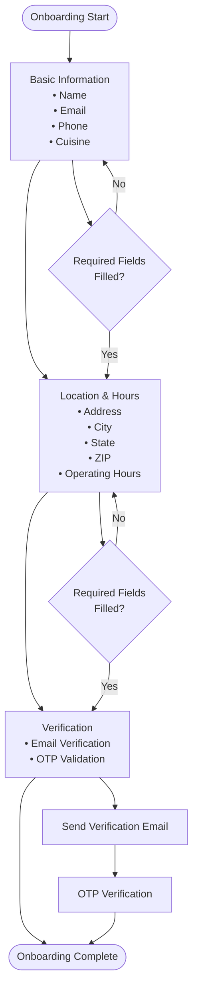
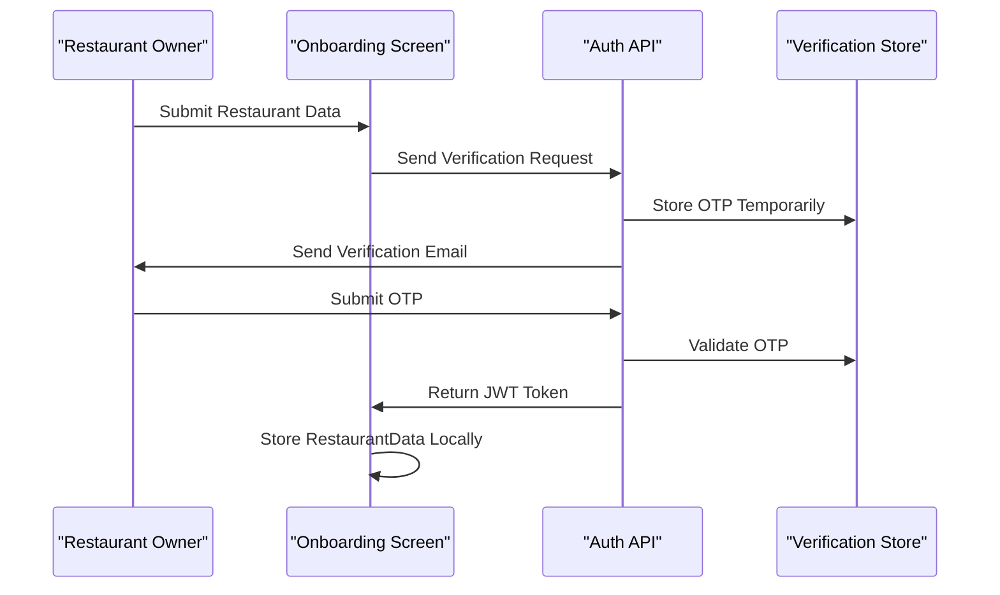

# RestaurantData Model Documentation

<cite>
**Referenced Files in This Document**
- [src/components/restaurant/restaurant-onboarding-screen.tsx](file://src/components/restaurant/restaurant-onboarding-screen.tsx)
- [src/components/restaurant/restaurant-app.tsx](file://src/components/restaurant/restaurant-app.tsx)
- [src/components/restaurant/restaurant-dashboard.tsx](file://src/components/restaurant/restaurant-dashboard.tsx)
- [src/app/api/restaurant/send-verification/route.ts](file://src/app/api/restaurant/send-verification/route.ts)
- [src/app/api/restaurant/generate-qr/route.ts](file://src/app/api/restaurant/generate-qr/route.ts)
- [src/app/api/restaurant/parse-menu/route.ts](file://src/app/api/restaurant/parse-menu/route.ts)
- [src/app/api/auth/verify-otp/route.ts](file://src/app/api/auth/verify-otp/route.ts)
- [src/components/pwa-app.tsx](file://src/components/pwa-app.tsx)
- [src/components/pwa/menu-screen.tsx](file://src/components/pwa/menu-screen.tsx)
- [README.md](file://README.md)
</cite>

## Table of Contents
1. [Introduction](#introduction)
2. [Model Definition](#model-definition)
3. [Field Specifications](#field-specifications)
4. [Validation Rules](#validation-rules)
5. [Data Collection Process](#data-collection-process)
6. [Storage and Persistence](#storage-and-persistence)
7. [Integration Points](#integration-points)
8. [Sample Payloads](#sample-payloads)
9. [Error Handling](#error-handling)
10. [Best Practices](#best-practices)

## Introduction

The RestaurantData model is a central TypeScript interface that defines the structure for capturing restaurant profile information during the onboarding process in MenuPRO-App-main. This model serves as the foundation for restaurant registration, profile management, and integration with various platform services including authentication, QR code generation, and menu parsing.

The model encapsulates essential restaurant information including contact details, location data, operational hours, and descriptive attributes that are crucial for both customer-facing experiences and internal restaurant management systems.

## Model Definition

The RestaurantData interface is defined consistently across multiple components in the application, ensuring type safety and data consistency throughout the onboarding and management workflows.

```typescript
export interface RestaurantData {
  name: string;
  email: string;
  phone: string;
  address: string;
  city: string;
  state: string;
  zipCode: string;
  cuisine: string;
  description: string;
  operatingHours: {
    open: string;
    close: string;
  };
}
```

**Section sources**
- [src/components/restaurant/restaurant-app.tsx](file://src/components/restaurant/restaurant-app.tsx#L13-L23)
- [src/components/restaurant/restaurant-onboarding-screen.tsx](file://src/components/restaurant/restaurant-onboarding-screen.tsx#L18-L28)

## Field Specifications

### Core Identity Fields

**name** (`string`)
- **Purpose**: Primary identifier for the restaurant
- **Constraints**: Required field, min length 1 character
- **Usage Context**: Displayed in menus, QR codes, and customer communications
- **Example**: "The Garden Restaurant"

**email** (`string`)
- **Purpose**: Primary communication channel and authentication identifier
- **Constraints**: Must be valid email format
- **Usage Context**: Verification emails, notifications, and account management
- **Example**: "info@gardenrestaurant.com"

**phone** (`string`)
- **Purpose**: Contact information for customer inquiries and support
- **Constraints**: Required field, validated format
- **Usage Context**: Customer service, order coordination, and emergency contacts
- **Example**: "+1-555-123-4567"

### Location Information

**address** (`string`)
- **Purpose**: Physical location for delivery, walk-in customers, and navigation
- **Constraints**: Required field, descriptive address format
- **Usage Context**: Google Maps integration, delivery routing, and customer directions
- **Example**: "123 Main Street"

**city** (`string`)
- **Purpose**: Geographic identification for location-based services
- **Constraints**: Required field, city name format
- **Usage Context**: Delivery zones, analytics, and location filtering
- **Example**: "San Francisco"

**state** (`string`)
- **Purpose**: Administrative region for regulatory compliance and tax calculations
- **Constraints**: Required field, state abbreviation or full name
- **Usage Context**: Tax jurisdiction, legal compliance, and regional analytics
- **Example**: "CA"

**zipCode** (`string`)
- **Purpose**: Postal code for precise location identification
- **Constraints**: Required field, valid postal code format
- **Usage Context**: Delivery radius calculations, demographic analysis, and location services
- **Example**: "94105"

### Operational Attributes

**cuisine** (`string`)
- **Purpose**: Defines restaurant culinary specialty for customer discovery
- **Constraints**: Required field, predefined cuisine types
- **Usage Context**: Menu categorization, customer preferences, and recommendation engines
- **Example**: "italian"

**description** (`string`)
- **Purpose**: Rich text description of restaurant offerings and ambiance
- **Constraints**: Optional field, descriptive content
- **Usage Context**: Marketing materials, customer engagement, and search optimization
- **Example**: "Modern Italian cuisine with a focus on seasonal ingredients"

**operatingHours** (`object`)
- **Purpose**: Defines daily operational schedule for customer planning
- **Constraints**: Required field, time format validation
- **Structure**: Contains `open` and `close` time properties
- **Usage Context**: Order availability, customer expectations, and scheduling systems
- **Example**: `{ open: "09:00", close: "22:00" }`

**Section sources**
- [src/components/restaurant/restaurant-onboarding-screen.tsx](file://src/components/restaurant/restaurant-onboarding-screen.tsx#L30-L45)

## Validation Rules

### Required Field Validation

The RestaurantData model enforces strict validation rules to ensure data quality and completeness:

```typescript
// Email validation
const validateEmail = (email: string) => {
  const emailRegex = /^[^\s@]+@[^\s@]+\.[^\s@]+$/;
  return emailRegex.test(email);
};

// Form validation logic
const isFormValid = () => {
  return restaurantData.name &&
         restaurantData.email &&
         validateEmail(restaurantData.email) &&
         restaurantData.phone &&
         restaurantData.cuisine &&
         restaurantData.address &&
         restaurantData.city &&
         restaurantData.state &&
         restaurantData.zipCode;
};
```

### Time Format Validation

Operating hours require specific time format validation:

```typescript
// Time validation for operating hours
const validateTimeFormat = (time: string) => {
  const timeRegex = /^([01]\d|2[0-3]):([0-5]\d)$/;
  return timeRegex.test(time);
};
```

### Field Length Constraints

Each field has specific length requirements:

- **name**: Minimum 1 character, recommended maximum 100 characters
- **email**: Standard email format validation
- **phone**: Minimum 10 digits, supports international formats
- **address**: Minimum 5 characters, maximum 200 characters
- **city/state/zipCode**: Appropriate geographic field lengths

**Section sources**
- [src/components/restaurant/restaurant-onboarding-screen.tsx](file://src/components/restaurant/restaurant-onboarding-screen.tsx#L47-L55)

## Data Collection Process

### Onboarding Workflow

The RestaurantData collection follows a structured three-step process:



**Diagram sources**
- [src/components/restaurant/restaurant-onboarding-screen.tsx](file://src/components/restaurant/restaurant-onboarding-screen.tsx#L100-L150)

### State Management

The RestaurantData is managed through React state with real-time updates:

```typescript
const [restaurantData, setRestaurantData] = useState<RestaurantData>({
  name: "",
  email: "",
  phone: "",
  address: "",
  city: "",
  state: "",
  zipCode: "",
  cuisine: "",
  description: "",
  operatingHours: {
    open: "09:00",
    close: "22:00"
  }
});
```

### Form Updates

Individual field updates are handled through a centralized update function:

```typescript
const updateRestaurantData = (field: keyof RestaurantData, value: string) => {
  setRestaurantData(prev => ({
    ...prev,
    [field]: value
  }));
};

const updateOperatingHours = (field: 'open' | 'close', value: string) => {
  setRestaurantData(prev => ({
    ...prev,
    operatingHours: {
      ...prev.operatingHours,
      [field]: value
    }
  }));
};
```

**Section sources**
- [src/components/restaurant/restaurant-onboarding-screen.tsx](file://src/components/restaurant/restaurant-onboarding-screen.tsx#L57-L75)

## Storage and Persistence

### Temporary Storage

During the onboarding process, RestaurantData is temporarily stored in several locations:

1. **React State**: Local component state for immediate form manipulation
2. **localStorage**: Persistent storage for email verification continuation
3. **Session Storage**: Temporary storage for partial data during multi-step process

```typescript
// Email persistence for verification continuation
localStorage.setItem('pendingRestaurantEmail', restaurantData.email);

// Later retrieval
const savedEmail = localStorage.getItem('pendingRestaurantEmail');
```

### Authentication Integration

After successful verification, the RestaurantData becomes part of the authenticated session:

```typescript
const handleEmailVerified = (email: string, data: RestaurantData) => {
  setRestaurantData(data);
  setCurrentScreen('otp-verification');
};
```

### API Integration

The model integrates with various API endpoints for data persistence:

- **Verification Endpoint**: `/api/restaurant/send-verification`
- **OTP Verification**: `/api/auth/verify-otp`
- **QR Generation**: `/api/restaurant/generate-qr`
- **Menu Parsing**: `/api/restaurant/parse-menu`

**Section sources**
- [src/components/restaurant/restaurant-app.tsx](file://src/components/restaurant/restaurant-app.tsx#L35-L40)
- [src/app/api/restaurant/send-verification/route.ts](file://src/app/api/restaurant/send-verification/route.ts#L15-L25)

## Integration Points

### Authentication Services

The RestaurantData model integrates deeply with the authentication system:



**Diagram sources**
- [src/app/api/restaurant/send-verification/route.ts](file://src/app/api/restaurant/send-verification/route.ts#L20-L30)
- [src/app/api/auth/verify-otp/route.ts](file://src/app/api/auth/verify-otp/route.ts#L15-L25)

### QR Code Generation

The model provides essential data for QR code creation:

```typescript
// QR code generation requires restaurant data
const generateQRCode = async (restaurantId: string, tableNumber: string) => {
  const baseUrl = process.env.NEXT_PUBLIC_BASE_URL || 'https://menupro.app';
  const orderUrl = `${baseUrl}/order?restaurant=${restaurantId}&table=${tableNumber}`;
  
  const qrCodeDataURL = await QRCode.toDataURL(orderUrl, {
    width: 200,
    margin: 2,
    color: { dark: '#000000', light: '#FFFFFF' }
  });
  
  return { qrCode: qrCodeDataURL, url: orderUrl };
};
```

### Menu Management Integration

The parsed menu items integrate with the RestaurantData model:

```typescript
// Menu parsing extracts items from uploaded documents
const parseMenuItems = (text: string) => {
  const items: any[] = [];
  const lines = text.split('\n').filter(line => line.trim().length > 0);
  
  // Extract price patterns and item names
  const pricePatterns = [
    /\$(\d+\.?\d*)/g,
    /(\d+\.?\d*)\s*dollars?/gi,
    /(\d+\.?\d*)\s*USD/gi
  ];
  
  // Calculate confidence scores for parsed items
  let confidence = 0.5;
  if (itemName.length > 5) confidence += 0.1;
  if (price > 5 && price < 100) confidence += 0.2;
  
  return {
    name: itemName,
    price: price,
    description: description,
    category: currentCategory,
    confidence: confidence
  };
};
```

**Section sources**
- [src/app/api/restaurant/generate-qr/route.ts](file://src/app/api/restaurant/generate-qr/route.ts#L15-L30)
- [src/app/api/restaurant/parse-menu/route.ts](file://src/app/api/restaurant/parse-menu/route.ts#L54-L100)

## Sample Payloads

### Form Submission Payload

```json
{
  "name": "The Garden Restaurant",
  "email": "info@gardenrestaurant.com",
  "phone": "+1-555-123-4567",
  "address": "123 Main Street",
  "city": "San Francisco",
  "state": "CA",
  "zipCode": "94105",
  "cuisine": "italian",
  "description": "Modern Italian cuisine with a focus on seasonal ingredients",
  "operatingHours": {
    "open": "09:00",
    "close": "22:00"
  }
}
```

### API Response Payload

```json
{
  "message": "Verification email sent successfully",
  "email": "info@gardenrestaurant.com"
}
```

### Dashboard Display Payload

```json
{
  "restaurantData": {
    "name": "The Garden Restaurant",
    "email": "info@gardenrestaurant.com",
    "phone": "+1-555-123-4567",
    "address": "123 Main Street",
    "city": "San Francisco",
    "state": "CA",
    "zipCode": "94105",
    "cuisine": "italian",
    "description": "Modern Italian cuisine with a focus on seasonal ingredients",
    "operatingHours": {
      "open": "09:00",
      "close": "22:00"
    }
  }
}
```

### QR Code Generation Payload

```json
{
  "restaurantId": "rest_12345",
  "tableNumber": "7",
  "numberOfTables": 10
}
```

## Error Handling

### Validation Error Responses

The system provides comprehensive error handling for invalid data:

```typescript
// Email validation errors
if (!restaurantData.email.trim()) {
  setError("Please enter your email address");
  return;
}

if (!validateEmail(restaurantData.email)) {
  setError("Please enter a valid email address");
  return;
}

// Required field validation
if (!restaurantData.name || !restaurantData.email || !restaurantData.phone || !restaurantData.cuisine) {
  setError("Please complete all required fields");
  return;
}
```

### Network Error Handling

API requests include robust error handling:

```typescript
try {
  const response = await fetch('/api/restaurant/send-verification', {
    method: 'POST',
    headers: { 'Content-Type': 'application/json' },
    body: JSON.stringify(restaurantData)
  });
  
  if (!response.ok) {
    throw new Error('Failed to send verification email');
  }
  
  const data = await response.json();
  setSuccess(true);
  
} catch (error) {
  setError("Network error. Please try again.");
  console.error('Verification error:', error);
}
```

### OTP Verification Errors

```typescript
// OTP validation with expiration handling
const verifyOTP = async (email: string, otp: string) => {
  const storedData = otpStore.get(email);
  
  if (!storedData) {
    return { error: "No verification code found for this email" };
  }
  
  if (Date.now() > storedData.expires) {
    otpStore.delete(email);
    return { error: "Verification code has expired. Please request a new one." };
  }
  
  if (storedData.otp !== otp) {
    return { error: "Invalid verification code" };
  }
  
  // Successful verification
  return { success: true, token: generateJWT(storedData) };
};
```

**Section sources**
- [src/components/restaurant/restaurant-onboarding-screen.tsx](file://src/components/restaurant/restaurant-onboarding-screen.tsx#L57-L75)
- [src/app/api/restaurant/send-verification/route.ts](file://src/app/api/restaurant/send-verification/route.ts#L20-L30)
- [src/app/api/auth/verify-otp/route.ts](file://src/app/api/auth/verify-otp/route.ts#L25-L50)

## Best Practices

### Data Consistency

Maintain data consistency across all components:

1. **Type Safety**: Use the same interface across all components
2. **Validation**: Implement consistent validation rules
3. **Default Values**: Provide sensible defaults for optional fields
4. **Error Messages**: Use consistent error messaging patterns

### Security Considerations

Implement security best practices:

1. **Input Sanitization**: Validate all user inputs
2. **Email Verification**: Require email verification for all accounts
3. **Token Management**: Securely store and manage authentication tokens
4. **Data Encryption**: Encrypt sensitive data in transit and at rest

### Performance Optimization

Optimize for performance:

1. **Lazy Loading**: Load components only when needed
2. **State Management**: Use efficient state management patterns
3. **Caching**: Implement appropriate caching strategies
4. **Validation**: Perform client-side validation before API calls

### User Experience

Enhance user experience:

1. **Progressive Disclosure**: Show required fields first
2. **Real-time Validation**: Provide instant feedback on form completion
3. **Clear Instructions**: Provide helpful guidance for each field
4. **Mobile Optimization**: Ensure responsive design for mobile devices

### Testing Strategies

Implement comprehensive testing:

1. **Unit Tests**: Test individual functions and validation logic
2. **Integration Tests**: Test API integrations and data flows
3. **End-to-End Tests**: Test complete user journeys
4. **Accessibility Tests**: Ensure compliance with accessibility standards

The RestaurantData model serves as a critical foundation for the MenuPRO platform, enabling seamless restaurant onboarding while maintaining data integrity and user experience excellence throughout the entire customer journey.