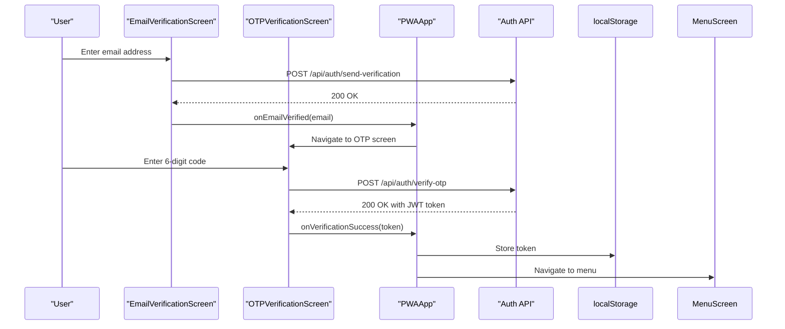
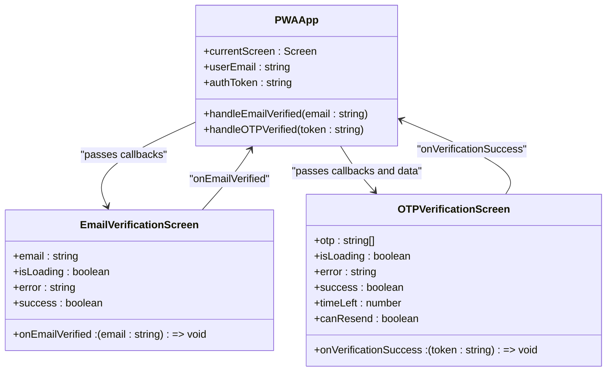
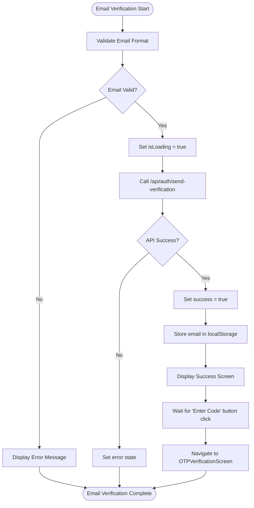
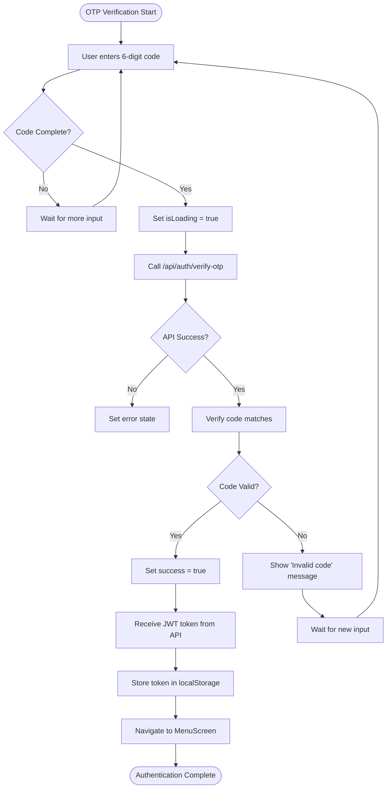
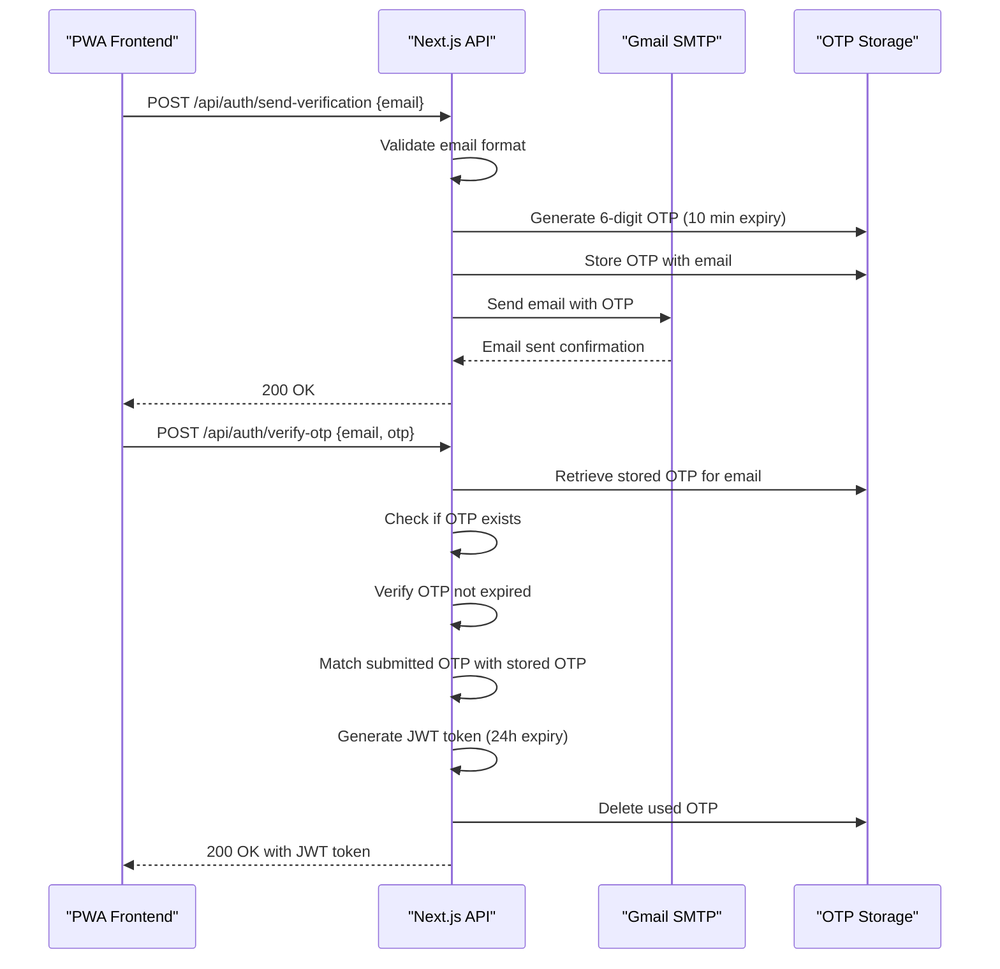
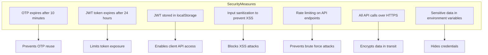
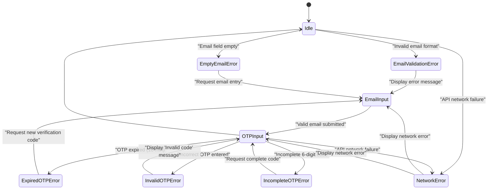

# Authentication Flow

<cite>
**Referenced Files in This Document**   
- [pwa-app.tsx](file://src/components/pwa-app.tsx)
- [email-verification-screen.tsx](file://src/components/pwa/email-verification-screen.tsx)
- [otp-verification-screen.tsx](file://src/components/pwa/otp-verification-screen.tsx)
- [send-verification/route.ts](file://src/app/api/auth/send-verification/route.ts)
- [verify-otp/route.ts](file://src/app/api/auth/verify-otp/route.ts)
- [restaurant-onboarding-screen.tsx](file://src/components/restaurant/restaurant-onboarding-screen.tsx)
- [restaurant-otp-screen.tsx](file://src/components/restaurant/restaurant-otp-screen.tsx)
- [restaurant-app.tsx](file://src/components/restaurant/restaurant-app.tsx)
</cite>

## Table of Contents
1. [Introduction](#introduction)
2. [Authentication Flow Overview](#authentication-flow-overview)
3. [State Management](#state-management)
4. [Email Verification Process](#email-verification-process)
5. [OTP Verification Process](#otp-verification-process)
6. [API Integration](#api-integration)
7. [Security Considerations](#security-considerations)
8. [UI/UX Elements](#uiux-elements)
9. [Error Handling](#error-handling)
10. [Conclusion](#conclusion)

## Introduction
The authentication flow in the MenuPRO PWA frontend implements a two-step verification process to ensure secure user access while preventing spam orders. This document details the complete authentication journey, from initial email capture through OTP verification, including state management, API integration, security practices, and user experience considerations.

**Section sources**
- [pwa-app.tsx](file://src/components/pwa-app.tsx#L1-L153)

## Authentication Flow Overview

**Diagram sources**
- [pwa-app.tsx](file://src/components/pwa-app.tsx#L1-L153)
- [email-verification-screen.tsx](file://src/components/pwa/email-verification-screen.tsx#L1-L193)
- [otp-verification-screen.tsx](file://src/components/pwa/otp-verification-screen.tsx#L1-L258)
- [send-verification/route.ts](file://src/app/api/auth/send-verification/route.ts#L1-L97)
- [verify-otp/route.ts](file://src/app/api/auth/verify-otp/route.ts#L1-L77)

## State Management

The PWAApp component manages authentication state using React hooks, maintaining user email and authentication token throughout the verification process. The state is passed down to child components and updated through callback functions.

**Diagram sources**
- [pwa-app.tsx](file://src/components/pwa-app.tsx#L1-L153)
- [email-verification-screen.tsx](file://src/components/pwa/email-verification-screen.tsx#L1-L193)
- [otp-verification-screen.tsx](file://src/components/pwa/otp-verification-screen.tsx#L1-L258)

**Section sources**
- [pwa-app.tsx](file://src/components/pwa-app.tsx#L1-L153)

## Email Verification Process

The EmailVerificationScreen component captures the user's email address and initiates the first step of the authentication flow. It includes form validation, loading states, and error handling to ensure a smooth user experience.

**Diagram sources**
- [email-verification-screen.tsx](file://src/components/pwa/email-verification-screen.tsx#L1-L193)
- [send-verification/route.ts](file://src/app/api/auth/send-verification/route.ts#L1-L97)

**Section sources**
- [email-verification-screen.tsx](file://src/components/pwa/email-verification-screen.tsx#L1-L193)

## OTP Verification Process

The OTPVerificationScreen component handles the second step of authentication, where users enter the verification code received via email. It includes features like input auto-focus, paste handling, timer countdown, and resend functionality.

**Diagram sources**
- [otp-verification-screen.tsx](file://src/components/pwa/otp-verification-screen.tsx#L1-L258)
- [verify-otp/route.ts](file://src/app/api/auth/verify-otp/route.ts#L1-L77)

**Section sources**
- [otp-verification-screen.tsx](file://src/components/pwa/otp-verification-screen.tsx#L1-L258)

## API Integration

The authentication flow integrates with backend API endpoints to send verification emails and validate OTP codes. The frontend uses fetch operations through Next.js API routes to communicate securely with the server.

**Diagram sources**
- [send-verification/route.ts](file://src/app/api/auth/send-verification/route.ts#L1-L97)
- [verify-otp/route.ts](file://src/app/api/auth/verify-otp/route.ts#L1-L77)

**Section sources**
- [send-verification/route.ts](file://src/app/api/auth/send-verification/route.ts#L1-L97)
- [verify-otp/route.ts](file://src/app/api/auth/verify-otp/route.ts#L1-L77)

## Security Considerations

The authentication system implements multiple security measures to protect user data and prevent abuse. These include token expiration, secure storage, rate limiting, and input validation.

**Diagram sources**
- [send-verification/route.ts](file://src/app/api/auth/send-verification/route.ts#L1-L97)
- [verify-otp/route.ts](file://src/app/api/auth/verify-otp/route.ts#L1-L77)
- [pwa-app.tsx](file://src/components/pwa-app.tsx#L1-L153)

**Section sources**
- [send-verification/route.ts](file://src/app/api/auth/send-verification/route.ts#L1-L97)
- [verify-otp/route.ts](file://src/app/api/auth/verify-otp/route.ts#L1-L77)

## UI/UX Elements

The authentication flow incorporates several user experience features to guide users through the verification process smoothly, including visual feedback, input assistance, and clear instructions.

```mermaid
flowchart TD
subgraph EmailVerificationUI
EmailForm["Email input with validation"]
LoadingState["Loading indicator during API call"]
ErrorDisplay["Error messages for invalid input"]
SuccessScreen["Success screen with email confirmation"]
ResendOption["Option to try different email"]
PrivacyNote["Privacy statement"]
end
subgraph OTPVerificationUI
OTPInputs["Six individual input fields"]
AutoFocus["Auto-focus to next input"]
PasteSupport["Paste support for OTP"]
TimerDisplay["Countdown timer (10 minutes)"]
ResendButton["Resend code button"]
DemoHint["Demo mode hint (enter 123456)"]
SecurityNote["Security statement"]
end
EmailForm --> ImprovedUsability["Improves form usability"]
LoadingState --> Feedback["Provides user feedback"]
ErrorDisplay --> Guidance["Guides user correction"]
SuccessScreen --> Confirmation["Confirms action completion"]
ResendOption --> Flexibility["Provides flexibility"]
PrivacyNote --> Trust["Builds user trust"]
OTPInputs --> Clarity["Clear input structure"]
AutoFocus --> Efficiency["Improves input efficiency"]
PasteSupport --> Convenience["Enhances convenience"]
TimerDisplay --> Awareness["Creates time awareness"]
ResendButton --> Recovery["Enables code recovery"]
DemoHint --> Accessibility["Improves demo accessibility"]
SecurityNote --> Confidence["Builds security confidence"]
```

**Diagram sources**
- [email-verification-screen.tsx](file://src/components/pwa/email-verification-screen.tsx#L1-L193)
- [otp-verification-screen.tsx](file://src/components/pwa/otp-verification-screen.tsx#L1-L258)

**Section sources**
- [email-verification-screen.tsx](file://src/components/pwa/email-verification-screen.tsx#L1-L193)
- [otp-verification-screen.tsx](file://src/components/pwa/otp-verification-screen.tsx#L1-L258)

## Error Handling

The authentication flow includes comprehensive error handling for various scenarios, providing clear feedback to users when issues occur during the verification process.

**Diagram sources**
- [email-verification-screen.tsx](file://src/components/pwa/email-verification-screen.tsx#L1-L193)
- [otp-verification-screen.tsx](file://src/components/pwa/otp-verification-screen.tsx#L1-L258)

**Section sources**
- [email-verification-screen.tsx](file://src/components/pwa/email-verification-screen.tsx#L1-L193)
- [otp-verification-screen.tsx](file://src/components/pwa/otp-verification-screen.tsx#L1-L258)

## Conclusion
The authentication flow in the MenuPRO PWA frontend provides a secure and user-friendly two-step verification process. By combining email verification with OTP validation, the system effectively prevents spam orders while maintaining a smooth user experience. Key features include proper state management in the PWAApp component, secure JWT token handling, comprehensive error handling, and thoughtful UI/UX elements like input auto-focus and timer displays. The integration between frontend components and backend API routes ensures reliable communication and data security throughout the authentication process.