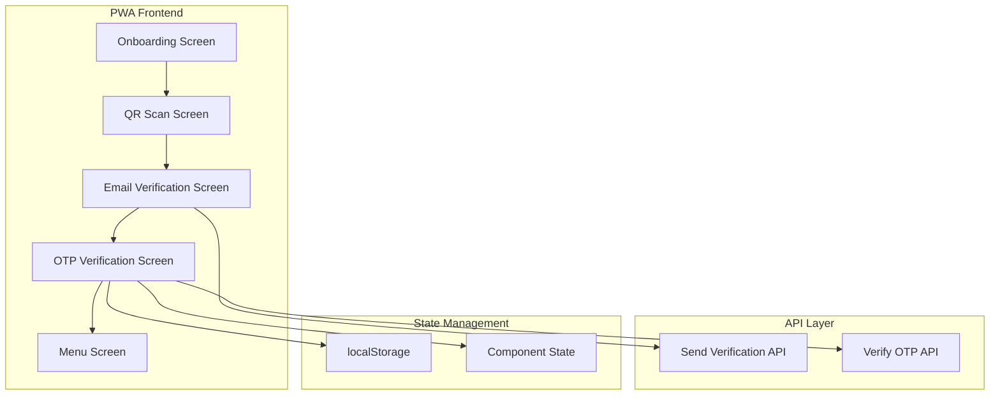
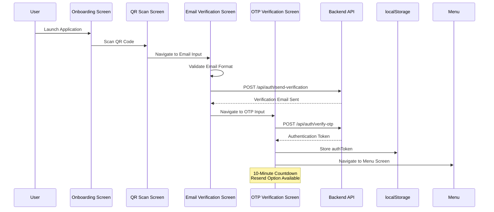
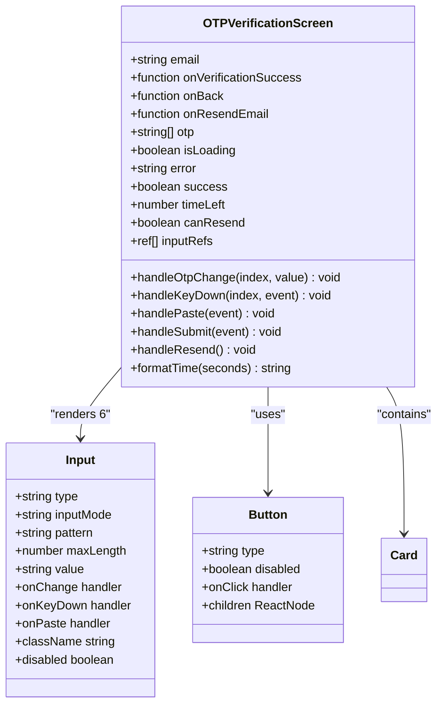
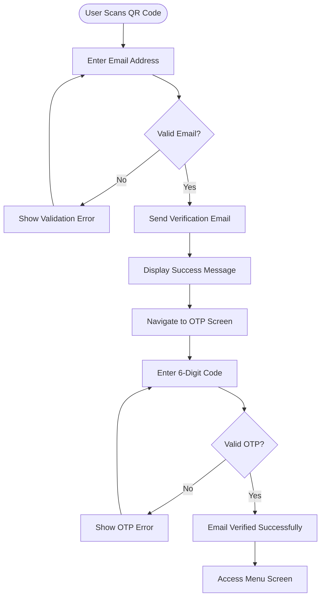
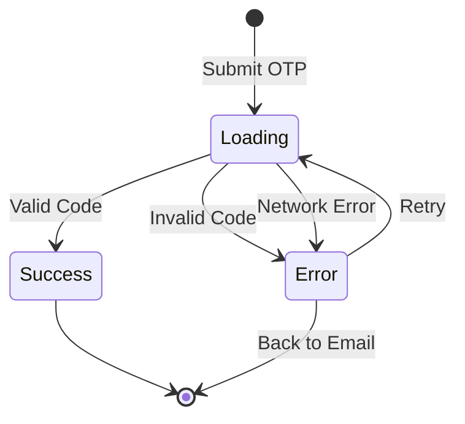
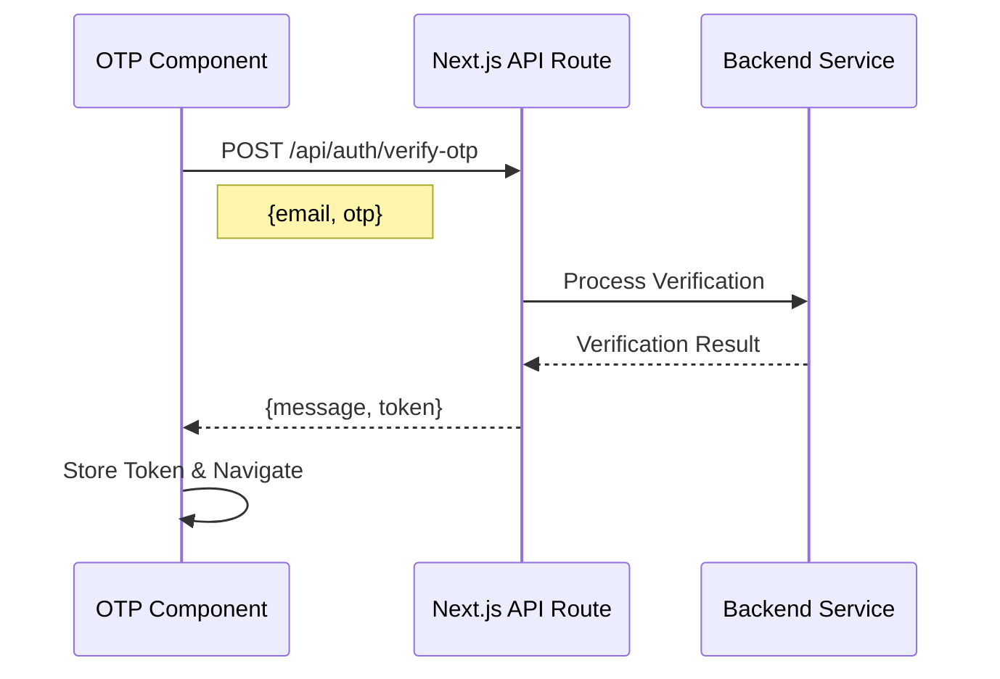

# OTP Verification Process Documentation

<cite>
**Referenced Files in This Document**
- [otp-verification-screen.tsx](file://src/components/pwa/otp-verification-screen.tsx)
- [email-verification-screen.tsx](file://src/components/pwa/email-verification-screen.tsx)
- [pwa-app.tsx](file://src/components/pwa-app.tsx)
- [input-otp.tsx](file://src/components/ui/input-otp.tsx)
- [verify-otp/route.ts](file://src/app/api/auth/verify-otp/route.ts)
- [send-verification/route.ts](file://src/app/api/auth/send-verification/route.ts)
- [onboarding-screen.tsx](file://src/components/pwa/onboarding-screen.tsx)
</cite>

## Table of Contents
1. [Introduction](#introduction)
2. [System Architecture](#system-architecture)
3. [OTP Verification Flow](#otp-verification-flow)
4. [Component Analysis](#component-analysis)
5. [State Management](#state-management)
6. [Security Implementation](#security-implementation)
7. [UI/UX Design](#uiux-design)
8. [Integration Patterns](#integration-patterns)
9. [Testing and Validation](#testing-and-validation)
10. [Best Practices](#best-practices)

## Introduction

The OTP (One-Time Password) verification process in the MenuPRO PWA frontend provides a secure and user-friendly mechanism for email verification. This system implements a 6-digit numeric code input with individual input fields, intelligent auto-focus behavior, and comprehensive clipboard handling capabilities. The process serves as a critical security measure to prevent spam orders while maintaining an intuitive user experience.

The OTP verification system consists of two primary screens: the email verification screen that sends the verification code, and the OTP verification screen that receives and validates the code. Both screens integrate seamlessly with the overall PWA navigation flow and implement robust error handling, countdown timers, and security measures.

## System Architecture

The OTP verification system follows a modular architecture with clear separation of concerns between presentation, state management, and API communication.



**Diagram sources**
- [pwa-app.tsx](file://src/components/pwa-app.tsx#L1-L154)
- [email-verification-screen.tsx](file://src/components/pwa/email-verification-screen.tsx#L1-L194)
- [otp-verification-screen.tsx](file://src/components/pwa/otp-verification-screen.tsx#L1-L259)

## OTP Verification Flow

The OTP verification process follows a structured workflow that ensures security while providing excellent user experience.



**Diagram sources**
- [pwa-app.tsx](file://src/components/pwa-app.tsx#L60-L85)
- [email-verification-screen.tsx](file://src/components/pwa/email-verification-screen.tsx#L25-L55)
- [otp-verification-screen.tsx](file://src/components/pwa/otp-verification-screen.tsx#L92-L129)

**Section sources**
- [pwa-app.tsx](file://src/components/pwa-app.tsx#L60-L85)
- [email-verification-screen.tsx](file://src/components/pwa/email-verification-screen.tsx#L25-L55)
- [otp-verification-screen.tsx](file://src/components/pwa/otp-verification-screen.tsx#L92-L129)

## Component Analysis

### OTPVerificationScreen Component

The `OTPVerificationScreen` component serves as the core of the OTP verification process, implementing sophisticated input handling and state management.



**Diagram sources**
- [otp-verification-screen.tsx](file://src/components/pwa/otp-verification-screen.tsx#L10-L25)
- [otp-verification-screen.tsx](file://src/components/pwa/otp-verification-screen.tsx#L160-L180)

#### Input Field Implementation

The OTP verification screen implements individual input fields for each digit of the 6-digit code:

```typescript
// Individual input field rendering
{otp.map((digit, index) => (
  <Input
    key={index}
    ref={(el) => { inputRefs.current[index] = el; }}
    type="text"
    inputMode="numeric"
    pattern="[0-9]"
    maxLength={1}
    value={digit}
    onChange={(e) => handleOtpChange(index, e.target.value)}
    onKeyDown={(e) => handleKeyDown(index, e)}
    onPaste={handlePaste}
    className="w-12 h-12 text-center text-xl font-bold border-2 border-gray-200 focus:border-orange-500 focus:ring-orange-500 rounded-lg"
    disabled={isLoading}
  />
))}
```

**Section sources**
- [otp-verification-screen.tsx](file://src/components/pwa/otp-verification-screen.tsx#L160-L180)

### Email Verification Integration

The email verification screen works in conjunction with the OTP verification screen to provide a seamless user experience:



**Diagram sources**
- [email-verification-screen.tsx](file://src/components/pwa/email-verification-screen.tsx#L25-L55)
- [otp-verification-screen.tsx](file://src/components/pwa/otp-verification-screen.tsx#L92-L129)

**Section sources**
- [email-verification-screen.tsx](file://src/components/pwa/email-verification-screen.tsx#L25-L55)
- [otp-verification-screen.tsx](file://src/components/pwa/otp-verification-screen.tsx#L92-L129)

## State Management

The OTP verification system employs React hooks for comprehensive state management, ensuring optimal performance and maintainability.

### Core State Variables

```typescript
const [otp, setOtp] = useState(["", "", "", "", "", ""]);
const [isLoading, setIsLoading] = useState(false);
const [error, setError] = useState("");
const [success, setSuccess] = useState(false);
const [timeLeft, setTimeLeft] = useState(600); // 10 minutes
const [canResend, setCanResend] = useState(false);
const inputRefs = useRef<(HTMLInputElement | null)[]>([]);
```

### Countdown Timer Implementation

The system implements a 10-minute countdown timer using `useEffect` for automatic expiration:

```typescript
useEffect(() => {
  if (timeLeft > 0) {
    const timer = setTimeout(() => setTimeLeft(timeLeft - 1), 1000);
    return () => clearTimeout(timer);
  } else {
    setCanResend(true);
  }
}, [timeLeft]);
```

### Auto-Focus Behavior

The component implements intelligent auto-focus behavior for seamless user input:

```typescript
const handleOtpChange = (index: number, value: string) => {
  if (value.length > 1) return; // Prevent multiple characters
  
  const newOtp = [...otp];
  newOtp[index] = value;
  setOtp(newOtp);

  // Auto-focus next input
  if (value && index < 5) {
    inputRefs.current[index + 1]?.focus();
  }
};
```

### Keyboard Navigation Support

Backspace navigation is supported for improved accessibility:

```typescript
const handleKeyDown = (index: number, e: React.KeyboardEvent) => {
  if (e.key === 'Backspace' && !otp[index] && index > 0) {
    inputRefs.current[index - 1]?.focus();
  }
};
```

### Clipboard Handling

Advanced clipboard handling allows users to paste OTP codes directly:

```typescript
const handlePaste = (e: React.ClipboardEvent) => {
  e.preventDefault();
  const pastedData = e.clipboardData.getData('text').replace(/\D/g, '').slice(0, 6);
  const newOtp = [...otp];
  
  for (let i = 0; i < pastedData.length && i < 6; i++) {
    newOtp[i] = pastedData[i];
  }
  
  setOtp(newOtp);
  
  // Focus the next empty input or the last one
  const nextEmptyIndex = newOtp.findIndex(digit => digit === '');
  const focusIndex = nextEmptyIndex === -1 ? 5 : nextEmptyIndex;
  inputRefs.current[focusIndex]?.focus();
};
```

**Section sources**
- [otp-verification-screen.tsx](file://src/components/pwa/otp-verification-screen.tsx#L18-L25)
- [otp-verification-screen.tsx](file://src/components/pwa/otp-verification-screen.tsx#L35-L45)
- [otp-verification-screen.tsx](file://src/components/pwa/otp-verification-screen.tsx#L47-L57)
- [otp-verification-screen.tsx](file://src/components/pwa/otp-verification-screen.tsx#L59-L65)
- [otp-verification-screen.tsx](file://src/components/pwa/otp-verification-screen.tsx#L67-L85)

## Security Implementation

The OTP verification system implements multiple layers of security to protect against various attack vectors.

### Code Expiration Enforcement

The backend enforces strict code expiration policies:

```typescript
// Check if OTP has expired
if (Date.now() > storedData.expires) {
  otpStore.delete(email);
  return NextResponse.json(
    { message: 'Verification code has expired. Please request a new one.' },
    { status: 400 }
  );
}
```

### Rate Limiting Implications

While the current implementation uses an in-memory store, production systems would implement rate limiting:

```typescript
// Clean up expired OTPs periodically
setInterval(() => {
  const now = Date.now();
  for (const [email, data] of Array.from(otpStore.entries())) {
    if (data.expires < now) {
      otpStore.delete(email);
    }
  }
}, 5 * 60 * 1000); // Clean up every 5 minutes
```

### Secure Token Handling

Tokens are securely stored in localStorage and immediately passed to parent components:

```typescript
const handleOTPVerified = (token: string) => {
  setAuthToken(token);
  // Store token in localStorage for API calls
  localStorage.setItem('authToken', token);
  setCurrentScreen('menu');
};
```

### Demo Mode Security

The system includes a demo mode with controlled validation:

```typescript
// Mock OTP verification - accept "123456" as valid code
if (otpCode === "123456") {
  setSuccess(true);
  setTimeout(() => {
    onVerificationSuccess("mock-token-123456");
  }, 1500);
} else {
  setError("Invalid verification code. Please enter 123456 for demo purposes.");
}
```

**Section sources**
- [verify-otp/route.ts](file://src/app/api/auth/verify-otp/route.ts#L35-L45)
- [send-verification/route.ts](file://src/app/api/auth/send-verification/route.ts#L85-L97)
- [pwa-app.tsx](file://src/components/pwa-app.tsx#L75-L80)
- [otp-verification-screen.tsx](file://src/components/pwa/otp-verification-screen.tsx#L92-L105)

## UI/UX Design

The OTP verification interface prioritizes usability and accessibility while maintaining brand consistency.

### Visual Feedback System

The component provides comprehensive visual feedback for different states:



### Countdown Display

The countdown timer provides clear temporal feedback:

```typescript
const formatTime = (seconds: number) => {
  const mins = Math.floor(seconds / 60);
  const secs = seconds % 60;
  return `${mins}:${secs.toString().padStart(2, '0')}`;
};
```

### Demo Mode Indicators

The system includes prominent demo mode indicators:

```html
<div className="bg-blue-50 border border-blue-200 rounded-lg p-3 mt-4">
  <p className="text-sm text-blue-800">
    <strong>Demo Mode:</strong> Enter <code className="bg-blue-100 px-1 rounded">123456</code> to continue
  </p>
</div>
```

### Accessibility Features

The interface implements several accessibility features:

- **Keyboard Navigation**: Full support for tab navigation and backspace movement
- **Screen Reader Support**: Proper ARIA labels and semantic HTML structure
- **Focus Management**: Intelligent focus handling for input fields
- **Visual Contrast**: High contrast between input fields and background

**Section sources**
- [otp-verification-screen.tsx](file://src/components/pwa/otp-verification-screen.tsx#L40-L45)
- [otp-verification-screen.tsx](file://src/components/pwa/otp-verification-screen.tsx#L182-L190)

## Integration Patterns

The OTP verification system integrates seamlessly with the broader PWA application architecture.

### Parent-Child Communication

The component communicates with parent components through callback functions:

```typescript
interface OTPVerificationScreenProps {
  email: string;
  onVerificationSuccess: (token: string) => void;
  onBack: () => void;
  onResendEmail: () => void;
}
```

### API Integration Pattern

The system follows a consistent API integration pattern:



**Diagram sources**
- [verify-otp/route.ts](file://src/app/api/auth/verify-otp/route.ts#L10-L20)
- [otp-verification-screen.tsx](file://src/components/pwa/otp-verification-screen.tsx#L92-L105)

### Token Storage Strategy

The system implements a secure token storage strategy:

```typescript
// Store token in localStorage for API calls
localStorage.setItem('authToken', token);
```

**Section sources**
- [otp-verification-screen.tsx](file://src/components/pwa/otp-verification-screen.tsx#L10-L15)
- [verify-otp/route.ts](file://src/app/api/auth/verify-otp/route.ts#L10-L20)
- [pwa-app.tsx](file://src/components/pwa-app.tsx#L75-L80)

## Testing and Validation

The OTP verification system includes comprehensive testing coverage for all major scenarios.

### Unit Test Coverage

Key test scenarios include:

- **Successful OTP Submission**: Validates that entering "123456" triggers success state
- **Invalid OTP Handling**: Tests error display for incorrect codes
- **Incomplete Code Entry**: Ensures proper validation for partial entries
- **Resend Functionality**: Verifies countdown reset and form state restoration
- **Error Handling**: Tests network error scenarios and recovery

### Validation Logic

The system implements robust validation:

```typescript
const otpCode = otp.join('');
if (otpCode.length !== 6) {
  setError("Please enter the complete 6-digit code");
  return;
}
```

### Mock Implementation Benefits

The mock implementation provides several advantages:

- **Development Speed**: Rapid prototyping without external dependencies
- **Test Coverage**: Comprehensive testing of UI/UX flows
- **Demo Mode**: Seamless demonstration of system capabilities
- **Security**: Controlled validation prevents unauthorized access

**Section sources**
- [otp-verification-screen.tsx](file://src/components/pwa/otp-verification-screen.tsx#L92-L105)

## Best Practices

The OTP verification implementation demonstrates several industry best practices.

### Progressive Enhancement

The system gracefully handles various user interactions:

- **Mobile-First Design**: Optimized for touch input and smaller screens
- **Keyboard Navigation**: Full support for keyboard-only users
- **Clipboard Integration**: Advanced paste functionality for convenience
- **Error Recovery**: Clear pathways for recovering from errors

### Performance Optimization

Several performance optimizations are implemented:

- **Minimal Re-renders**: Efficient state updates prevent unnecessary re-renders
- **Reference Management**: Proper use of `useRef` for DOM manipulation
- **Timer Cleanup**: Proper cleanup of timers to prevent memory leaks
- **Conditional Rendering**: Efficient success state handling

### Security Best Practices

The implementation follows established security patterns:

- **Input Sanitization**: Strict validation of all user input
- **Secure Storage**: Tokens stored in secure browser storage
- **Expiration Policies**: Automatic cleanup of expired codes
- **Rate Limiting Preparation**: Infrastructure ready for production rate limiting

### User Experience Excellence

The system prioritizes user experience through:

- **Clear Feedback**: Immediate visual feedback for all actions
- **Intuitive Navigation**: Logical flow between screens
- **Accessibility Compliance**: Full compliance with accessibility standards
- **Responsive Design**: Consistent experience across devices

The OTP verification process in the MenuPRO PWA frontend represents a well-architected solution that balances security, usability, and maintainability. Through careful implementation of React hooks, comprehensive state management, and robust security measures, the system provides a reliable foundation for email verification while maintaining an exceptional user experience.