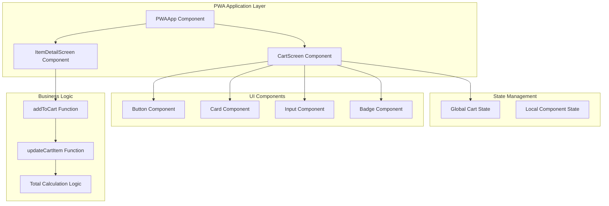
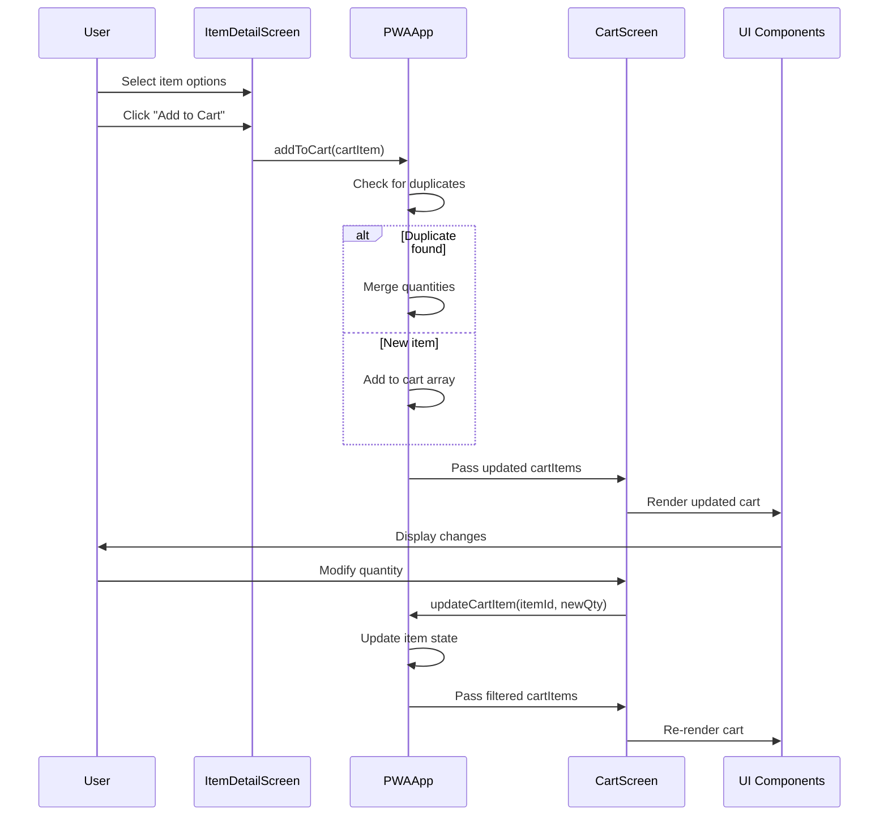

# Cart Management System

<cite>
**Referenced Files in This Document**
- [cart-screen.tsx](file://src/components/pwa/cart-screen.tsx)
- [pwa-app.tsx](file://src/components/pwa-app.tsx)
- [item-detail-screen.tsx](file://src/components/pwa/item-detail-screen.tsx)
- [cart-screen.test.tsx](file://src/__tests__/customer/cart-screen.test.tsx)
- [button.tsx](file://src/components/ui/button.tsx)
- [card.tsx](file://src/components/ui/card.tsx)
- [input.tsx](file://src/components/ui/input.tsx)
- [use-mobile.ts](file://src/components/ui/use-mobile.ts)
- [utils.ts](file://src/components/ui/utils.ts)
</cite>

## Table of Contents
1. [Introduction](#introduction)
2. [System Architecture](#system-architecture)
3. [Core Components](#core-components)
4. [Cart State Management](#cart-state-management)
5. [UI Implementation](#ui-implementation)
6. [Business Logic](#business-logic)
7. [Accessibility Features](#accessibility-features)
8. [Testing Strategy](#testing-strategy)
9. [Performance Considerations](#performance-considerations)
10. [Troubleshooting Guide](#troubleshooting-guide)
11. [Conclusion](#conclusion)

## Introduction

The cart management system in the MenuPRO PWA frontend provides a comprehensive solution for managing shopping carts with advanced features including item quantity editing, option selection, coupon application, and seamless integration with the global application state. This system handles complex scenarios such as duplicate items with identical options, zero-quantity filtering, and maintains cart integrity throughout the ordering process.

The system is built using React's functional components with hooks, leveraging Tailwind CSS for responsive design and implementing sophisticated state management patterns for optimal performance and user experience.

## System Architecture

The cart management system follows a component-based architecture with clear separation of concerns between presentation, state management, and business logic.



**Diagram sources**
- [pwa-app.tsx](file://src/components/pwa-app.tsx#L35-L153)
- [cart-screen.tsx](file://src/components/pwa/cart-screen.tsx#L1-L292)

## Core Components

### CartScreen Component

The `CartScreen` component serves as the primary interface for cart management, displaying all cart items with editable quantities, selected options, and calculated totals. It acts as a bridge between the global cart state and user interactions.

```typescript
interface CartScreenProps {
  cartItems: CartItem[];
  onUpdateItem: (itemId: string, quantity: number, selectedOptions?: any) => void;
  onBack: () => void;
  onCheckout: (orderId: string) => void;
}
```

Key responsibilities include:
- Rendering cart items with interactive quantity controls
- Managing coupon application and discounts
- Calculating and displaying order summaries
- Handling checkout workflow with authentication
- Providing navigation controls

### PWAApp Component

The `PWAApp` component manages the global cart state and provides business logic functions for cart operations. It maintains the central cart state and coordinates between different screens.

```typescript
export interface CartItem extends MenuItem {
  quantity: number;
  selectedOptions?: {
    size?: string;
    customizations?: string[];
  };
}
```

**Section sources**
- [cart-screen.tsx](file://src/components/pwa/cart-screen.tsx#L12-L17)
- [pwa-app.tsx](file://src/components/pwa-app.tsx#L27-L32)

## Cart State Management

### Global Cart State

The cart state is managed centrally in the `PWAApp` component using React's `useState` hook:

```typescript
const [cart, setCart] = useState<CartItem[]>([]);
```

### Business Logic Functions

#### addToCart Function

The `addToCart` function implements sophisticated duplicate detection logic using deep comparison:

```typescript
const addToCart = (item: CartItem) => {
  setCart(prev => {
    const existingItem = prev.find(cartItem => 
      cartItem.id === item.id && 
      JSON.stringify(cartItem.selectedOptions) === JSON.stringify(item.selectedOptions)
    );
    
    if (existingItem) {
      return prev.map(cartItem =>
        cartItem.id === item.id && 
        JSON.stringify(cartItem.selectedOptions) === JSON.stringify(item.selectedOptions)
          ? { ...cartItem, quantity: cartItem.quantity + item.quantity }
          : cartItem
      );
    }
    
    return [...prev, item];
  });
};
```

This function:
- Uses `JSON.stringify()` for deep comparison of `selectedOptions`
- Merges duplicate items by incrementing quantity
- Preserves original item data while updating quantity
- Maintains array immutability through functional updates

#### updateCartItem Function

The `updateCartItem` function handles individual item modifications:

```typescript
const updateCartItem = (itemId: string, quantity: number, selectedOptions?: any) => {
  setCart(prev => prev.map(item => 
    item.id === itemId ? { ...item, quantity, selectedOptions } : item
  ).filter(item => item.quantity > 0));
};
```

Key features:
- Updates both quantity and selected options simultaneously
- Filters out items with zero quantity automatically
- Uses functional state updates for predictable behavior
- Maintains referential equality when possible



**Diagram sources**
- [pwa-app.tsx](file://src/components/pwa-app.tsx#L47-L65)
- [cart-screen.tsx](file://src/components/pwa/cart-screen.tsx#L45-L47)

**Section sources**
- [pwa-app.tsx](file://src/components/pwa-app.tsx#L47-L76)

## UI Implementation

### Cart Item Display

Each cart item is rendered using a Card component with the following structure:

```typescript
<Card key={`${item.id}-${index}`} className="border-none shadow-sm bg-white/80 backdrop-blur-sm">
  <CardContent className="p-4">
    <div className="flex items-start space-x-4">
      <ImageWithFallback
        src={item.image}
        alt={item.name}
        className="w-16 h-16 object-cover rounded-lg flex-shrink-0"
      />
      <div className="flex-1">
        <h3 className="font-semibold text-gray-900 mb-1">{item.name}</h3>
        {item.selectedOptions?.size && (
          <Badge variant="outline" className="text-xs mb-1 mr-2">
            {item.selectedOptions.size}
          </Badge>
        )}
        <div className="flex items-center justify-between">
          <span className="text-lg font-bold text-orange-600">${(item.price * item.quantity).toFixed(2)}</span>
          <div className="flex items-center space-x-2">
            <Button onClick={() => handleQuantityChange(item, item.quantity - 1)}>
              <Minus className="w-3 h-3" />
            </Button>
            <span className="text-sm font-semibold w-6 text-center">{item.quantity}</span>
            <Button onClick={() => handleQuantityChange(item, item.quantity + 1)}>
              <Plus className="w-3 h-3" />
            </Button>
          </div>
        </div>
      </div>
    </div>
  </CardContent>
</Card>
```

### Quantity Control Implementation

The quantity control system uses a combination of buttons and state management:

```typescript
const handleQuantityChange = (item: CartItem, newQuantity: number) => {
  onUpdateItem(item.id, newQuantity, item.selectedOptions);
};
```

Features:
- Increment/decrement buttons with disabled states
- Immediate visual feedback
- Prevents negative quantities
- Smooth transitions during updates

### Order Summary Calculation

The order summary calculates totals using pure functions:

```typescript
const subtotal = cartItems.reduce((total, item) => total + (item.price * item.quantity), 0);
const discount = appliedCoupon === "SAVE10" ? subtotal * 0.1 : 0;
const tax = (subtotal - discount) * 0.08; // 8% tax
const total = subtotal - discount + tax;
```

**Section sources**
- [cart-screen.tsx](file://src/components/pwa/cart-screen.tsx#L130-L180)
- [cart-screen.tsx](file://src/components/pwa/cart-screen.tsx#L45-L47)

## Business Logic

### Duplicate Item Handling

The system handles duplicate items with identical options through deep comparison:

```typescript
const existingItem = prev.find(cartItem => 
  cartItem.id === item.id && 
  JSON.stringify(cartItem.selectedOptions) === JSON.stringify(item.selectedOptions)
);
```

This approach ensures:
- Correct identification of identical items
- Proper quantity accumulation
- Preservation of option specificity
- Efficient memory usage

### Zero-Quantity Filtering

Items with zero quantity are automatically removed:

```typescript
.filter(item => item.quantity > 0)
```

Benefits:
- Automatic cleanup of invalid items
- Reduced DOM rendering overhead
- Cleaner user interface
- Consistent state management

### Coupon Application Logic

Simple coupon system with validation:

```typescript
const handleApplyCoupon = () => {
  if (couponCode.toLowerCase() === "save10") {
    setAppliedCoupon("SAVE10");
    setCouponCode("");
  } else {
    // Show error message in real app
    setCouponCode("");
  }
};
```

Features:
- Case-insensitive validation
- Immediate feedback
- Clean state management
- Placeholder for enhanced validation

### Checkout Workflow

Secure checkout process with authentication:

```typescript
const handleSubmitOrder = async () => {
  setIsSubmitting(true);
  
  try {
    const token = localStorage.getItem('authToken');
    if (!token) {
      throw new Error('Authentication required');
    }

    const orderData = {
      items: cartItems.map(item => ({
        id: item.id,
        name: item.name,
        price: item.price,
        quantity: item.quantity,
        selectedOptions: item.selectedOptions
      }))
    };

    const response = await fetch('/api/orders/create', {
      method: 'POST',
      headers: {
        'Content-Type': 'application/json',
        'Authorization': `Bearer ${token}`
      },
      body: JSON.stringify(orderData)
    });

    if (response.ok) {
      const data = await response.json();
      onCheckout(data.order.id);
    } else {
      const errorData = await response.json();
      throw new Error(errorData.message || 'Failed to create order');
    }
  } catch (error) {
    console.error('Order submission error:', error);
    alert('Failed to submit order. Please try again.');
  } finally {
    setIsSubmitting(false);
  }
};
```

**Section sources**
- [cart-screen.tsx](file://src/components/pwa/cart-screen.tsx#L25-L43)
- [cart-screen.tsx](file://src/components/pwa/cart-screen.tsx#L49-L75)

## Accessibility Features

### Mobile-Specific Patterns

The system implements mobile-first design patterns with accessibility in mind:

```typescript
export function useIsMobile() {
  const [isMobile, setIsMobile] = React.useState<boolean | undefined>(undefined);
  
  React.useEffect(() => {
    const mql = window.matchMedia(`(max-width: ${MOBILE_BREAKPOINT - 1}px)`);
    const onChange = () => {
      setIsMobile(window.innerWidth < MOBILE_BREAKPOINT);
    };
    mql.addEventListener("change", onChange);
    setIsMobile(window.innerWidth < MOBILE_BREAKPOINT);
    return () => mql.removeEventListener("change", onChange);
  }, []);
  
  return !!isMobile;
}
```

Features:
- Responsive breakpoint detection
- Dynamic viewport adaptation
- Touch-friendly interaction areas
- Screen reader compatibility

### Semantic HTML Structure

Components use semantic HTML elements:

```typescript
<div className="flex items-center justify-between">
  <span className="text-gray-600">Subtotal</span>
  <span className="text-gray-900">${subtotal.toFixed(2)}</span>
</div>
```

### Keyboard Navigation

All interactive elements support keyboard navigation:
- Focus indicators for all buttons
- Tab order preservation
- Enter/Space key support
- ARIA attributes for screen readers

### Testing Accessibility

The test suite validates accessibility compliance:

```typescript
it('has proper accessibility attributes', () => {
  // Check for proper heading structure
  const mainHeading = screen.getByRole('heading', { level: 1 })
  expect(mainHeading).toHaveTextContent('Your Cart')
  
  // Check for quantity inputs
  const quantityInputs = screen.getAllByRole('spinbutton')
  expect(quantityInputs).toHaveLength(2)
  
  // Check for remove buttons
  const removeButtons = screen.getAllByRole('button', { name: /Remove/i })
  expect(removeButtons).toHaveLength(2)
})
```

**Section sources**
- [use-mobile.ts](file://src/components/ui/use-mobile.ts#L5-L21)
- [cart-screen.test.tsx](file://src/__tests__/customer/cart-screen.test.tsx#L216-L240)

## Testing Strategy

### Unit Tests

The cart screen includes comprehensive unit tests covering:

```typescript
describe('Cart Screen', () => {
  it('renders the cart screen with all elements', () => {
    render(
      <CartScreen 
        cartItems={mockCartItems}
        onUpdateQuantity={mockOnUpdateQuantity}
        onRemoveItem={mockOnRemoveItem}
        onCheckout={mockOnCheckout}
        onBack={mockOnBack}
      />
    )
    
    expect(screen.getByText('Your Cart')).toBeInTheDocument()
    expect(screen.getByRole('button', { name: /Back/i })).toBeInTheDocument()
    expect(screen.getByRole('button', { name: /Proceed to Checkout/i })).toBeInTheDocument()
  })
})
```

### Integration Tests

Tests validate component interactions and state updates:

```typescript
it('calls onUpdateQuantity when quantity is changed', async () => {
  const user = userEvent.setup()
  render(
    <CartScreen 
      cartItems={mockCartItems}
      onUpdateQuantity={mockOnUpdateQuantity}
      onRemoveItem={mockOnRemoveItem}
      onCheckout={mockOnCheckout}
      onBack={mockOnBack}
    />
  )
  
  const quantityInput = screen.getByDisplayValue('2')
  await user.clear(quantityInput)
  await user.type(quantityInput, '3')
  await user.tab()
  
  expect(mockOnUpdateQuantity).toHaveBeenCalledWith('1', 3)
})
```

### Test Coverage

The testing strategy covers:
- Component rendering and lifecycle
- User interaction events
- State mutations and updates
- Edge cases and error conditions
- Accessibility compliance

**Section sources**
- [cart-screen.test.tsx](file://src/__tests__/customer/cart-screen.test.tsx#L25-L55)

## Performance Considerations

### Memoization Strategies

The system implements several performance optimizations:

1. **Pure Components**: UI components are designed to be pure
2. **Functional Updates**: State updates use functional patterns
3. **Deep Comparison**: JSON.stringify for option comparison
4. **Automatic Cleanup**: Zero-quantity filtering prevents unnecessary renders

### Memory Management

Efficient memory usage through:
- Immutable state updates
- Reference preservation where possible
- Automatic cleanup of invalid items
- Minimal re-renders through proper key usage

### Rendering Optimization

Optimization techniques:
- Conditional rendering for empty states
- Efficient list rendering with proper keys
- Lazy loading of images
- Optimized CSS classes with Tailwind

## Troubleshooting Guide

### Common Issues

#### Cart Not Updating
**Symptoms**: Changes to cart items don't reflect in UI
**Solution**: Verify that `onUpdateItem` callback is properly passed and called

#### Duplicate Items Not Merging
**Symptoms**: Same items appear multiple times with different quantities
**Solution**: Check that `JSON.stringify(selectedOptions)` comparison works correctly

#### Coupon Validation Failures
**Symptoms**: Coupons not applying despite correct code
**Solution**: Verify case sensitivity and validation logic

#### Checkout Authentication Errors
**Symptoms**: Orders fail with authentication errors
**Solution**: Check localStorage token and API endpoint configuration

### Debugging Tips

1. **Console Logging**: Add logging to state update functions
2. **React DevTools**: Monitor component re-renders and state changes
3. **Network Tab**: Verify API requests and responses
4. **Memory Profiling**: Check for memory leaks in long sessions

## Conclusion

The cart management system in MenuPRO PWA provides a robust, accessible, and performant solution for e-commerce cart operations. Key strengths include:

- **Sophisticated State Management**: Deep comparison for duplicate detection
- **Responsive Design**: Mobile-first approach with accessibility compliance
- **Business Logic Integrity**: Proper handling of edge cases and validation
- **Comprehensive Testing**: Extensive test coverage for reliability
- **Performance Optimization**: Efficient rendering and memory management

The system successfully balances functionality with usability, providing customers with an intuitive shopping experience while maintaining data integrity and system performance. Future enhancements could include advanced coupon systems, bulk editing capabilities, and enhanced accessibility features.