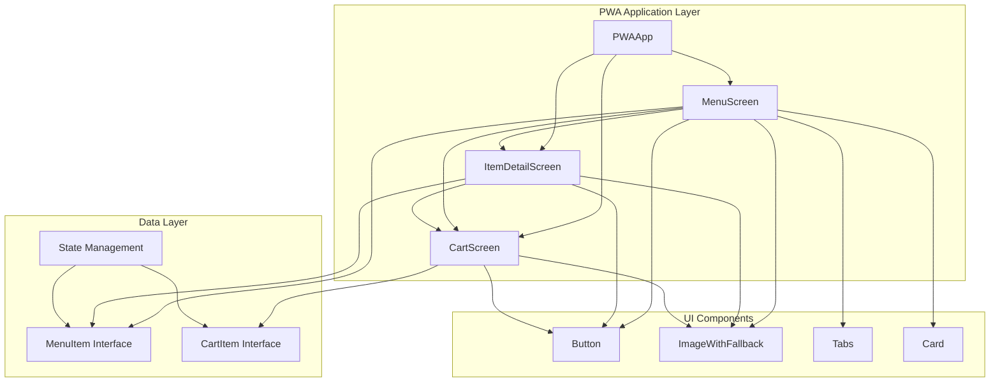
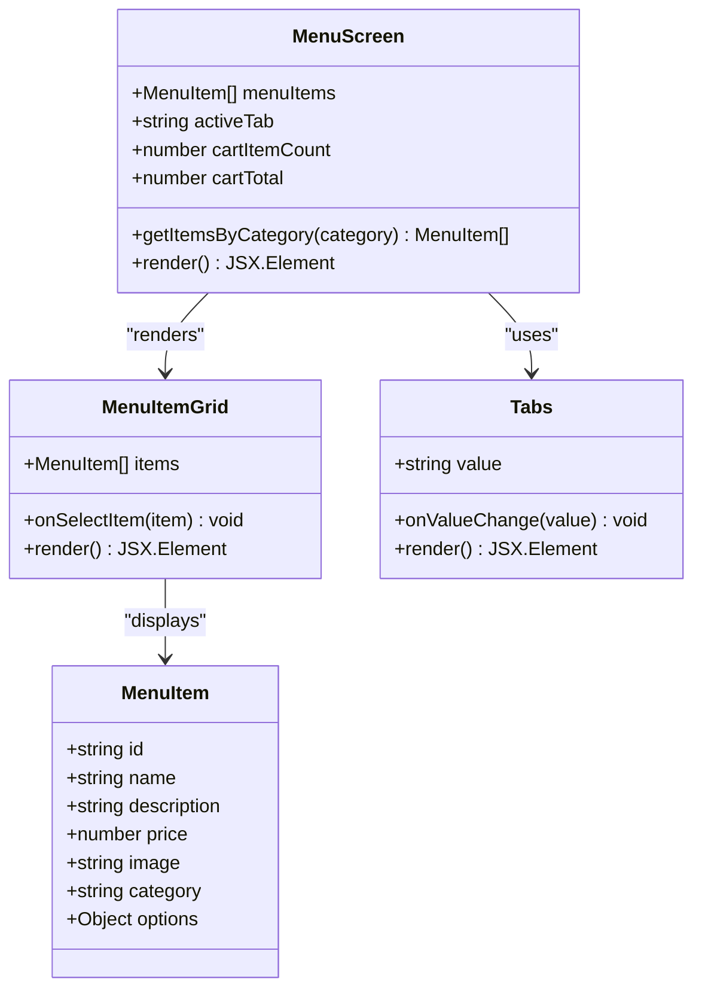
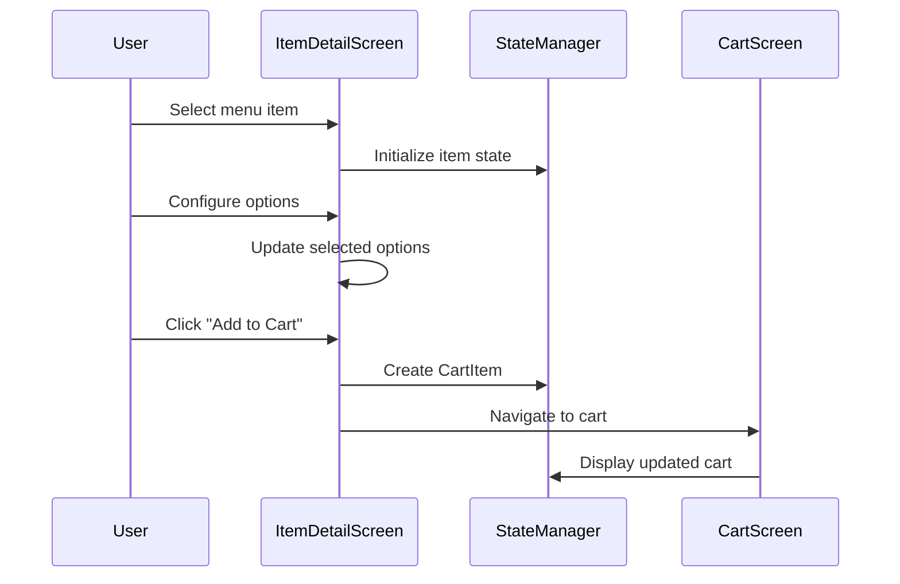
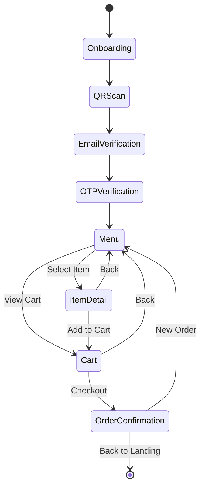

# Menu Browsing Experience

<cite>
**Referenced Files in This Document**
- [src/components/pwa/menu-screen.tsx](file://src/components/pwa/menu-screen.tsx)
- [src/components/pwa/item-detail-screen.tsx](file://src/components/pwa/item-detail-screen.tsx)
- [src/components/pwa-app.tsx](file://src/components/pwa-app.tsx)
- [src/components/ui/button.tsx](file://src/components/ui/button.tsx)
- [src/components/figma/ImageWithFallback.tsx](file://src/components/figma/ImageWithFallback.tsx)
- [src/components/pwa/cart-screen.tsx](file://src/components/pwa/cart-screen.tsx)
- [src/__tests__/customer/menu-screen.test.tsx](file://src/__tests__/customer/menu-screen.test.tsx)
</cite>

## Table of Contents
1. [Introduction](#introduction)
2. [System Architecture](#system-architecture)
3. [MenuScreen Component](#menuscreen-component)
4. [ItemDetailScreen Component](#itemdetailscreen-component)
5. [Data Flow and State Management](#data-flow-and-state-management)
6. [Responsive Layout Implementation](#responsive-layout-implementation)
7. [Performance Optimizations](#performance-optimizations)
8. [Testing Strategy](#testing-strategy)
9. [Accessibility Features](#accessibility-features)
10. [Troubleshooting Guide](#troubleshooting-guide)

## Introduction

The Menu Browsing Experience in the MenuPRO PWA frontend provides customers with an intuitive and engaging way to explore restaurant menus, customize orders, and manage shopping carts. This comprehensive system consists of two primary screens: MenuScreen for browsing and ItemDetailScreen for detailed item exploration, connected through a sophisticated state management system that handles item selection, customization, and cart operations.

The implementation leverages modern web technologies including Next.js 14, TypeScript, Tailwind CSS, and Radix UI components to deliver a seamless mobile-first experience optimized for restaurant ordering scenarios.

## System Architecture

The menu browsing system follows a component-based architecture with clear separation of concerns and efficient data flow patterns.



**Diagram sources**
- [src/components/pwa-app.tsx](file://src/components/pwa-app.tsx#L35-L153)
- [src/components/pwa/menu-screen.tsx](file://src/components/pwa/menu-screen.tsx#L1-L216)
- [src/components/pwa/item-detail-screen.tsx](file://src/components/pwa/item-detail-screen.tsx#L1-L179)

## MenuScreen Component

The MenuScreen serves as the primary interface for browsing restaurant menus, featuring a tabbed navigation system, scrollable grid layout, and integrated cart functionality.

### Component Structure



**Diagram sources**
- [src/components/pwa/menu-screen.tsx](file://src/components/pwa/menu-screen.tsx#L1-L216)

### Key Features

#### Tabbed Category Navigation
The MenuScreen implements a dynamic tab system that organizes menu items by category:

```typescript
<Tabs value={activeTab} onValueChange={setActiveTab} className="w-full">
  <TabsList className="grid w-full grid-cols-4 mb-6 bg-white/80 backdrop-blur-sm">
    <TabsTrigger value="appetizers" className="text-sm">Appetizers</TabsTrigger>
    <TabsTrigger value="mains" className="text-sm">Mains</TabsTrigger>
    <TabsTrigger value="desserts" className="text-sm">Desserts</TabsTrigger>
    <TabsTrigger value="beverages" className="text-sm">Beverages</TabsTrigger>
  </TabsList>
</Tabs>
```

#### Scrollable Grid Layout
Each category displays menu items in a responsive grid format with optimized spacing and visual hierarchy:

```typescript
<div className="grid grid-cols-1 gap-4 pb-24">
  {items.map(item => (
    <Card key={item.id} className="overflow-hidden border-none shadow-sm bg-white/80 backdrop-blur-sm hover:shadow-md transition-shadow">
      <CardContent className="p-0">
        <div className="flex">
          <ImageWithFallback
            src={item.image}
            alt={item.name}
            className="w-24 h-24 object-cover flex-shrink-0"
          />
          <div className="flex-1 p-4">
            <div className="flex justify-between items-start mb-2">
              <h3 className="font-semibold text-gray-900">{item.name}</h3>
              <span className="text-lg font-bold text-orange-600">${item.price}</span>
            </div>
            <p className="text-sm text-gray-600 mb-3 line-clamp-2">{item.description}</p>
            <Button onClick={() => onSelectItem(item)} size="sm" className="bg-orange-600 hover:bg-orange-700 text-white rounded-full px-4">
              <Plus className="w-4 h-4 mr-1" />
              Add
            </Button>
          </div>
        </div>
      </CardContent>
    </Card>
  ))}
</div>
```

#### Cart Integration
Real-time cart updates display item count and total value with visual indicators:

```typescript
const cartItemCount = cartItems.reduce((total, item) => total + item.quantity, 0);
const cartTotal = cartItems.reduce((total, item) => total + (item.price * item.quantity), 0);

<Button onClick={onViewCart} className="relative bg-orange-600 hover:bg-orange-700 text-white rounded-full p-3">
  <ShoppingCart className="w-5 h-5" />
  {cartItemCount > 0 && (
    <Badge className="absolute -top-2 -right-2 bg-red-500 text-white text-xs px-2 py-1 rounded-full">
      {cartItemCount}
    </Badge>
  )}
</Button>
```

**Section sources**
- [src/components/pwa/menu-screen.tsx](file://src/components/pwa/menu-screen.tsx#L85-L180)

## ItemDetailScreen Component

The ItemDetailScreen provides comprehensive item information with customization options and seamless integration with the cart system.

### Component Architecture



**Diagram sources**
- [src/components/pwa/item-detail-screen.tsx](file://src/components/pwa/item-detail-screen.tsx#L1-L179)

### Customization Features

#### Size Selection
The component supports configurable size options with visual feedback:

```typescript
{item.options?.size && (
  <Card className="mb-6 border-none shadow-sm bg-white/80 backdrop-blur-sm">
    <CardContent className="p-4">
      <h3 className="font-semibold text-gray-900 mb-3">Size</h3>
      <div className="grid grid-cols-2 gap-3">
        {item.options.size.map(size => (
          <Button
            key={size}
            onClick={() => setSelectedSize(size)}
            variant={selectedSize === size ? "default" : "outline"}
            className={selectedSize === size ? "bg-orange-600 hover:bg-orange-700" : "border-gray-300"}
          >
            {size}
          </Button>
        ))}
      </div>
    </CardContent>
  </Card>
)}
```

#### Customization Toggles
Interactive customization buttons allow users to add/remove specific modifications:

```typescript
{item.options?.customizations && (
  <Card className="mb-6 border-none shadow-sm bg-white/80 backdrop-blur-sm">
    <CardContent className="p-4">
      <h3 className="font-semibold text-gray-900 mb-3">Customizations</h3>
      <div className="space-y-2">
        {item.options.customizations.map(customization => (
          <Button
            key={customization}
            onClick={() => handleCustomizationToggle(customization)}
            variant={selectedCustomizations.includes(customization) ? "default" : "outline"}
            className={`w-full justify-start ${
              selectedCustomizations.includes(customization) 
                ? "bg-orange-600 hover:bg-orange-700" 
                : "border-gray-300"
            }`}
          >
            {customization}
          </Button>
        ))}
      </div>
    </CardContent>
  </Card>
)}
```

#### Quantity Management
A flexible quantity selector with increment/decrement controls:

```typescript
<div className="flex items-center justify-center space-x-4">
  <Button
    onClick={() => setQuantity(Math.max(1, quantity - 1))}
    variant="outline"
    size="sm"
    className="rounded-full w-10 h-10 p-0"
    disabled={quantity <= 1}
  >
    <Minus className="w-4 h-4" />
  </Button>
  <span className="text-xl font-semibold text-gray-900 w-8 text-center">{quantity}</span>
  <Button
    onClick={() => setQuantity(quantity + 1)}
    variant="outline"
    size="sm"
    className="rounded-full w-10 h-10 p-0"
  >
    <Plus className="w-4 h-4" />
  </Button>
</div>
```

**Section sources**
- [src/components/pwa/item-detail-screen.tsx](file://src/components/pwa/item-detail-screen.tsx#L65-L120)

## Data Flow and State Management

The menu browsing system implements a centralized state management pattern through the PWAApp component, enabling seamless communication between screens and maintaining consistent data flow.

### State Management Architecture



**Diagram sources**
- [src/components/pwa-app.tsx](file://src/components/pwa-app.tsx#L35-L153)

### MenuItem and CartItem Interfaces

The system defines clear data structures for menu items and cart items:

```typescript
export interface MenuItem {
  id: string;
  name: string;
  description: string;
  price: number;
  image: string;
  category: 'appetizers' | 'mains' | 'desserts' | 'beverages';
  options?: {
    size?: string[];
    customizations?: string[];
  };
}

export interface CartItem extends MenuItem {
  quantity: number;
  selectedOptions?: {
    size?: string;
    customizations?: string[];
  };
}
```

### Prop Drilling Pattern

The MenuScreen receives essential callbacks and data through props:

```typescript
interface MenuScreenProps {
  onSelectItem: (item: MenuItem) => void;
  onViewCart: () => void;
  cartItems: CartItem[];
}
```

### State Synchronization

The PWAApp maintains synchronized state across all components:

```typescript
const [selectedItem, setSelectedItem] = useState<MenuItem | null>(null);
const [cart, setCart] = useState<CartItem[]>([]);

const selectItem = (item: MenuItem) => {
  setSelectedItem(item);
  setCurrentScreen('item-detail');
};

const addToCart = (item: CartItem) => {
  setCart(prev => {
    const existingItem = prev.find(cartItem => 
      cartItem.id === item.id && 
      JSON.stringify(cartItem.selectedOptions) === JSON.stringify(item.selectedOptions)
    );
    
    if (existingItem) {
      return prev.map(cartItem =>
        cartItem.id === item.id && 
        JSON.stringify(cartItem.selectedOptions) === JSON.stringify(item.selectedOptions)
          ? { ...cartItem, quantity: cartItem.quantity + item.quantity }
          : cartItem
    );
    
    return [...prev, item];
  });
};
```

**Section sources**
- [src/components/pwa-app.tsx](file://src/components/pwa-app.tsx#L14-L33)
- [src/components/pwa-app.tsx](file://src/components/pwa-app.tsx#L47-L70)

## Responsive Layout Implementation

The menu browsing system implements a comprehensive responsive design strategy that adapts to various screen sizes while maintaining optimal user experience.

### Mobile-First Design Approach

The layout prioritizes mobile usability with scalable components:

```typescript
// Grid layout for different screen sizes
<div className="grid grid-cols-1 gap-4 pb-24">
  {/* Mobile-first grid structure */}
</div>

// Responsive button sizing
<Button size="sm" className="bg-orange-600 hover:bg-orange-700 text-white rounded-full px-4">
  <Plus className="w-4 h-4 mr-1" />
  Add
</Button>
```

### Adaptive Typography

The system uses Tailwind's responsive typography utilities:

```typescript
<h1 className="text-2xl font-bold text-gray-900">MenuPRO</h1>
<p className="text-sm text-gray-600">Table 7 • The Garden Restaurant</p>
```

### Touch-Friendly Interactions

Components are designed with appropriate touch targets and gesture support:

```typescript
// Large touch targets for interactive elements
<Button 
  onClick={onViewCart}
  className="relative bg-orange-600 hover:bg-orange-700 text-white rounded-full p-3"
>
  <ShoppingCart className="w-5 h-5" />
</Button>
```

**Section sources**
- [src/components/pwa/menu-screen.tsx](file://src/components/pwa/menu-screen.tsx#L85-L120)

## Performance Optimizations

The menu browsing system incorporates several performance optimization strategies to ensure smooth operation even with large menus and frequent user interactions.

### Virtualized Rendering Considerations

While the current implementation uses standard React rendering, the architecture supports future virtualized rendering for large menus:

```typescript
// Current implementation - suitable for moderate menu sizes
{items.map(item => (
  <Card key={item.id} className="overflow-hidden border-none shadow-sm bg-white/80 backdrop-blur-sm hover:shadow-md transition-shadow">
    {/* Item content */}
  </Card>
))}
```

### Image Optimization

The system implements lazy loading and fallback mechanisms:

```typescript
<ImageWithFallback
  src={item.image}
  alt={item.name}
  className="w-24 h-24 object-cover flex-shrink-0"
/>
```

### Memory Management

Efficient state updates prevent unnecessary re-renders:

```typescript
const addToCart = (item: CartItem) => {
  setCart(prev => {
    const existingItem = prev.find(cartItem => 
      cartItem.id === item.id && 
      JSON.stringify(cartItem.selectedOptions) === JSON.stringify(item.selectedOptions)
    );
    
    if (existingItem) {
      return prev.map(cartItem =>
        cartItem.id === item.id && 
        JSON.stringify(cartItem.selectedOptions) === JSON.stringify(item.selectedOptions)
          ? { ...cartItem, quantity: cartItem.quantity + item.quantity }
          : cartItem
      );
    }
    
    return [...prev, item];
  });
};
```

### Bundle Optimization

Tree-shaking and modular imports minimize bundle size:

```typescript
// Specific imports from Radix UI
import { Button } from "../ui/button";
import { Card, CardContent } from "../ui/card";
import { Badge } from "../ui/badge";
import { Tabs, TabsContent, TabsList, TabsTrigger } from "../ui/tabs";
```

**Section sources**
- [src/components/pwa/menu-screen.tsx](file://src/components/pwa/menu-screen.tsx#L185-L216)
- [src/components/figma/ImageWithFallback.tsx](file://src/components/figma/ImageWithFallback.tsx#L1-L30)

## Testing Strategy

The menu browsing system includes comprehensive testing coverage to ensure reliability and maintainability.

### Unit Test Coverage

The MenuScreen component includes extensive unit tests covering:

```typescript
// Basic rendering verification
it('renders the menu screen with all elements', () => {
  render(<MenuScreen menuItems={mockMenuItems} onAddToCart={mockOnAddToCart} onViewCart={mockOnViewCart} onBack={mockOnBack} />)
  
  expect(screen.getByText('Our Menu')).toBeInTheDocument()
  expect(screen.getByRole('button', { name: /Back/i })).toBeInTheDocument()
  expect(screen.getByRole('button', { name: /View Cart/i })).toBeInTheDocument()
})

// Interaction testing
it('calls onAddToCart when add button is clicked', async () => {
  const user = userEvent.setup()
  render(<MenuScreen menuItems={mockMenuItems} onAddToCart={mockOnAddToCart} onViewCart={mockOnViewCart} onBack={mockOnBack} />)
  
  const addButton = screen.getAllByRole('button', { name: /Add to Cart/i })[0]
  await user.click(addButton)
  
  expect(mockOnAddToCart).toHaveBeenCalledWith(mockMenuItems[0])
})
```

### Accessibility Testing

Tests verify proper accessibility attributes:

```typescript
it('has proper accessibility attributes', () => {
  render(<MenuScreen menuItems={mockMenuItems} onAddToCart={mockOnAddToCart} onViewCart={mockOnViewCart} onBack={mockOnBack} />)
  
  const mainHeading = screen.getByRole('heading', { level: 1 })
  expect(mainHeading).toHaveTextContent('Our Menu')
  
  const addButtons = screen.getAllByRole('button', { name: /Add to Cart/i })
  addButtons.forEach(button => {
    expect(button).toBeInTheDocument()
  })
})
```

### Mock Data Strategy

Comprehensive mock data ensures reliable test execution:

```typescript
const mockMenuItems = [
  {
    id: '1',
    name: 'Margherita Pizza',
    description: 'Classic tomato and mozzarella',
    price: 12.99,
    category: 'Pizza',
    image: '/pizza.jpg',
    isAvailable: true
  },
  {
    id: '2',
    name: 'Caesar Salad',
    description: 'Fresh romaine lettuce with caesar dressing',
    price: 8.99,
    category: 'Salads',
    image: '/salad.jpg',
    isAvailable: true
  }
]
```

**Section sources**
- [src/__tests__/customer/menu-screen.test.tsx](file://src/__tests__/customer/menu-screen.test.tsx#L1-L211)

## Accessibility Features

The menu browsing system implements comprehensive accessibility features to ensure usability for all users.

### Semantic HTML Structure

Proper heading hierarchy and landmark roles:

```typescript
<h1 className="text-2xl font-bold text-gray-900">MenuPRO</h1>
<p className="text-sm text-gray-600">Table 7 • The Garden Restaurant</p>
```

### Keyboard Navigation

All interactive elements support keyboard navigation:

```typescript
<Button 
  onClick={onViewCart}
  className="relative bg-orange-600 hover:bg-orange-700 text-white rounded-full p-3"
>
  <ShoppingCart className="w-5 h-5" />
</Button>
```

### Screen Reader Support

ARIA labels and roles enhance screen reader compatibility:

```typescript
<button 
  onClick={onBack}
  variant="ghost" 
  size="sm"
  className="rounded-full p-2"
  aria-label="Go back to menu"
>
  <ArrowLeft className="w-5 h-5" />
</button>
```

### Color Contrast Compliance

High contrast ratios ensure readability:

```typescript
// Orange 600 for primary actions
<Button className="bg-orange-600 hover:bg-orange-700 text-white">

// Gray 900 for primary text
<h1 className="text-2xl font-bold text-gray-900">MenuPRO</h1>
```

**Section sources**
- [src/components/pwa/menu-screen.tsx](file://src/components/pwa/menu-screen.tsx#L95-L110)
- [src/components/pwa/item-detail-screen.tsx](file://src/components/pwa/item-detail-screen.tsx#L35-L50)

## Troubleshooting Guide

Common issues and solutions for the menu browsing system.

### Image Loading Issues

**Problem**: Images fail to load or display incorrectly
**Solution**: The ImageWithFallback component provides automatic fallback handling:

```typescript
const ERROR_IMG_SRC = 'data:image/svg+xml;base64,PHN2ZyB3aWR0aD0iODgiIGhlaWdodD0iODgiIHhtbG5zPSJodHRwOi8vd3d3LnczLm9yZy8yMDAwL3N2ZyIgc3Ryb2tlPSIjMDAwIiBzdHJva2UtbGluZWpvaW49InJvdW5kIiBvcGFjaXR5PSIuMyIgZmlsbD0ibm9uZSIgc3Ryb2tlLXdpZHRoPSIzLjciPjxyZWN0IHg9IjE2IiB5PSIxNiIgd2lkdGg9IjU2IiBoZWlnaHQ9IjU2IiByeD0iNiIvPjxwYXRoIGQ9Im0xNiA1OCAxNi0xOCAzMiAzMiIvPjxjaXJjbGUgY3g9IjUzIiBjeT0iMzUiIHI9IjciLz48L3N2Zz4KCg=='

export function ImageWithFallback(props: React.ImgHTMLAttributes<HTMLImageElement>) {
  const [didError, setDidError] = useState(false)
  
  const handleError = () => {
    setDidError(true)
  }
  
  return didError ? (
    <div className={`inline-block bg-gray-100 text-center align-middle ${className ?? ''}`}>
      <div className="flex items-center justify-center w-full h-full">
        
      </div>
    </div>
  ) : (
    
  )
}
```

### State Synchronization Issues

**Problem**: Cart state becomes inconsistent
**Solution**: Verify proper state update patterns in PWAApp:

```typescript
const addToCart = (item: CartItem) => {
  setCart(prev => {
    const existingItem = prev.find(cartItem => 
      cartItem.id === item.id && 
      JSON.stringify(cartItem.selectedOptions) === JSON.stringify(item.selectedOptions)
    );
    
    if (existingItem) {
      return prev.map(cartItem =>
        cartItem.id === item.id && 
        JSON.stringify(cartItem.selectedOptions) === JSON.stringify(item.selectedOptions)
          ? { ...cartItem, quantity: cartItem.quantity + item.quantity }
          : cartItem
      );
    }
    
    return [...prev, item];
  });
};
```

### Performance Issues

**Problem**: Slow rendering with large menus
**Solution**: Consider implementing virtualized rendering or pagination for menus exceeding 50 items.

### Navigation Problems

**Problem**: Screens not transitioning properly
**Solution**: Verify screen state management in PWAApp:

```typescript
const selectItem = (item: MenuItem) => {
  setSelectedItem(item);
  setCurrentScreen('item-detail'); // Ensure correct screen transition
};
```

**Section sources**
- [src/components/figma/ImageWithFallback.tsx](file://src/components/figma/ImageWithFallback.tsx#L1-L30)
- [src/components/pwa-app.tsx](file://src/components/pwa-app.tsx#L55-L70)