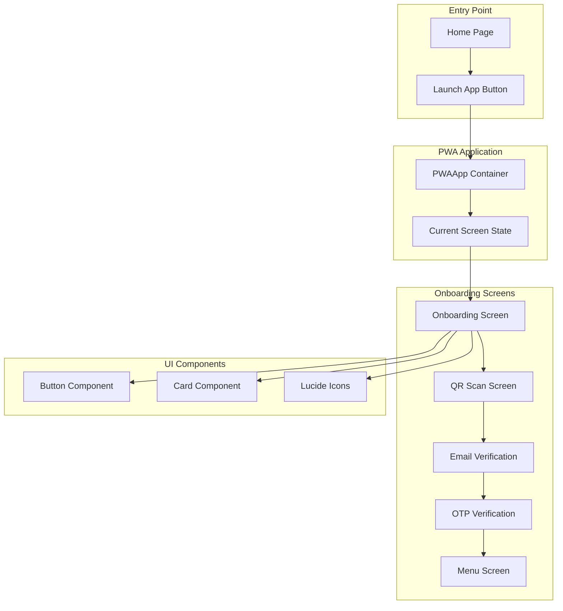
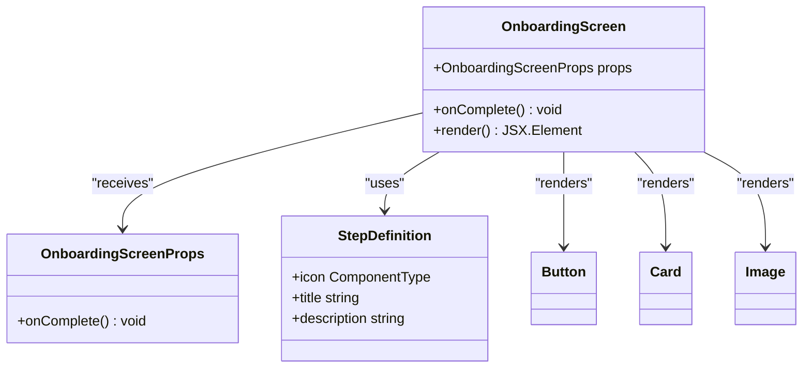
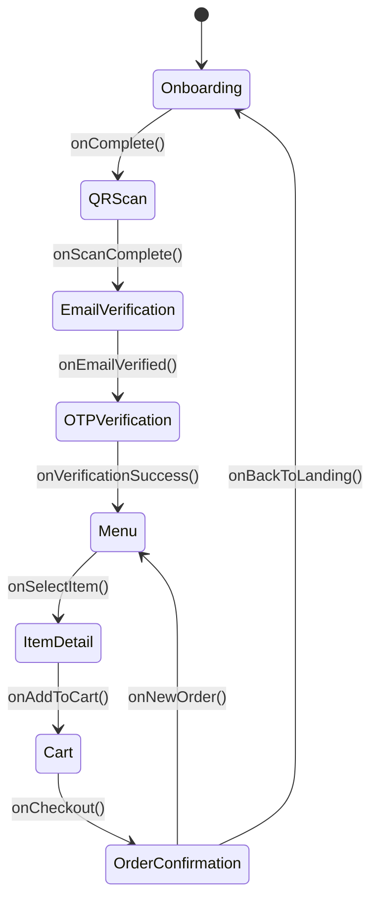
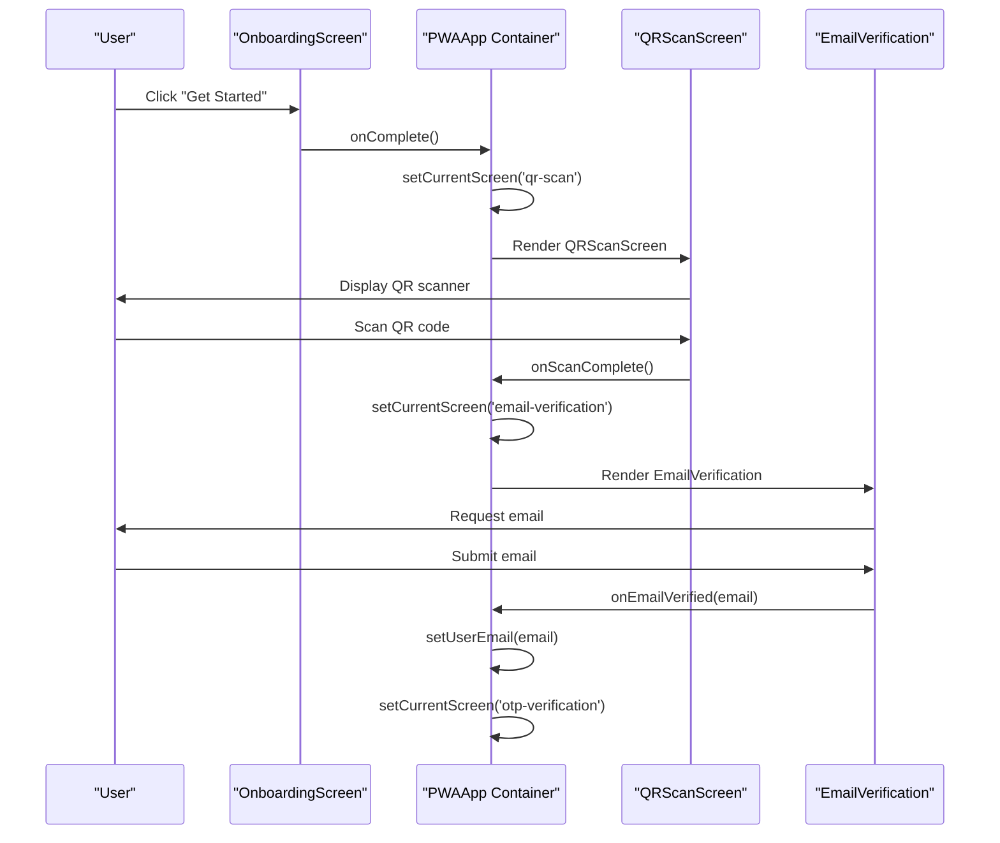

# Onboarding Flow

<cite>
**Referenced Files in This Document**
- [src/components/pwa/onboarding-screen.tsx](file://src/components/pwa/onboarding-screen.tsx)
- [src/components/pwa-app.tsx](file://src/components/pwa-app.tsx)
- [src/components/pwa/qr-scan-screen.tsx](file://src/components/pwa/qr-scan-screen.tsx)
- [src/components/pwa/email-verification-screen.tsx](file://src/components/pwa/email-verification-screen.tsx)
- [src/app/page.tsx](file://src/app/page.tsx)
- [src/components/ui/button.tsx](file://src/components/ui/button.tsx)
- [src/app/globals.css](file://src/app/globals.css)
- [src/app/layout.tsx](file://src/app/layout.tsx)
- [tailwind.config.ts](file://tailwind.config.ts)
- [src/__tests__/customer/onboarding-screen.test.tsx](file://src/__tests__/customer/onboarding-screen.test.tsx)
</cite>

## Table of Contents
1. [Introduction](#introduction)
2. [Architecture Overview](#architecture-overview)
3. [OnboardingScreen Component](#onboardingscreen-component)
4. [PWAApp Container](#pwaapp-container)
5. [Navigation Flow](#navigation-flow)
6. [Visual Design System](#visual-design-system)
7. [Accessibility Implementation](#accessibility-implementation)
8. [Performance Considerations](#performance-considerations)
9. [Integration Points](#integration-points)
10. [Testing Strategy](#testing-strategy)
11. [Customization Guide](#customization-guide)
12. [Troubleshooting](#troubleshooting)

## Introduction

The MenuPRO PWA onboarding flow serves as the initial entry point for customers entering the digital ordering experience. This comprehensive system guides users through a seamless journey from QR code scanning to menu exploration, ensuring a smooth transition into the restaurant ordering process. The onboarding flow is designed with modern UX principles, incorporating responsive design, intuitive navigation, and accessibility compliance.

The onboarding system consists of multiple interconnected screens that work together to create a cohesive customer experience. From the initial welcome screen to the final order confirmation, each step is carefully crafted to minimize friction while providing clear guidance and maintaining brand consistency.

## Architecture Overview

The onboarding flow follows a component-based architecture with clear separation of concerns. The system is built around the `PWAApp` container component that manages screen state and coordinates navigation between different onboarding stages.



**Diagram sources**
- [src/components/pwa-app.tsx](file://src/components/pwa-app.tsx#L30-L154)
- [src/components/pwa/onboarding-screen.tsx](file://src/components/pwa/onboarding-screen.tsx#L1-L79)

The architecture emphasizes modularity and reusability, with each screen component handling its own presentation logic while delegating navigation decisions to the parent container. This design enables easy maintenance and extension of the onboarding flow.

**Section sources**
- [src/components/pwa-app.tsx](file://src/components/pwa-app.tsx#L30-L154)
- [src/app/page.tsx](file://src/app/page.tsx#L1-L55)

## OnboardingScreen Component

The `OnboardingScreen` serves as the primary entry point for the PWA experience, designed to introduce customers to the digital ordering capabilities and guide them toward QR code scanning. This component implements a clean, modern interface with clear visual hierarchy and intuitive navigation.

### Component Structure



**Diagram sources**
- [src/components/pwa/onboarding-screen.tsx](file://src/components/pwa/onboarding-screen.tsx#L6-L15)

### Visual Design Implementation

The onboarding screen utilizes Tailwind CSS for responsive design and gradient backgrounds that create a visually appealing experience. The design incorporates brand colors with orange and red gradients that evoke warmth and energy associated with dining experiences.

Key design elements include:

- **Gradient Background**: `bg-gradient-to-br from-orange-50 to-red-50` creates a subtle, inviting background
- **Logo Placement**: Central positioning with appropriate spacing for brand recognition
- **Feature Cards**: Each step is presented in a card format with icons and descriptive text
- **Call-to-Action Button**: Prominent button with brand color styling

### Step Definition System

The onboarding process is structured around three core steps, each represented by a distinct icon and description:

```typescript
const steps = [
  {
    icon: Smartphone,
    title: "Scan QR",
    description: "Scan the QR code at your table to get started"
  },
  {
    icon: ShoppingCart,
    title: "Browse & Select",
    description: "Explore our menu and add items to your cart"
  },
  {
    icon: CheckCircle,
    title: "Review & Confirm",
    description: "Review your order and complete payment"
  }
];
```

Each step is rendered as a card component with consistent styling and interactive elements that maintain visual harmony throughout the interface.

**Section sources**
- [src/components/pwa/onboarding-screen.tsx](file://src/components/pwa/onboarding-screen.tsx#L1-L79)

## PWAApp Container

The `PWAApp` component acts as the central orchestrator for the entire onboarding flow, managing screen state, user data, and navigation logic. This container component demonstrates advanced React patterns including state management, prop drilling prevention, and component composition.

### State Management Architecture



**Diagram sources**
- [src/components/pwa-app.tsx](file://src/components/pwa-app.tsx#L30-L154)

The container maintains several key pieces of state:

- **currentScreen**: Tracks the active screen in the navigation stack
- **selectedItem**: Stores the currently selected menu item
- **cart**: Manages the shopping cart contents
- **userEmail**: Stores verified user email for authentication
- **authToken**: Holds authentication tokens for API requests
- **orderNumber**: Tracks the current order identifier

### Navigation Pattern Implementation

The navigation system employs a functional approach with callback-based state updates:

```typescript
const navigateToScreen = (screen: Screen) => {
  setCurrentScreen(screen);
};

const handleEmailVerified = (email: string) => {
  setUserEmail(email);
  setCurrentScreen('otp-verification');
};
```

This pattern ensures predictable state updates and maintains a clear flow of data through the component hierarchy.

**Section sources**
- [src/components/pwa-app.tsx](file://src/components/pwa-app.tsx#L30-L154)

## Navigation Flow

The navigation flow between onboarding screens is carefully orchestrated to provide a logical progression from initial engagement to active ordering. Each screen implements specific callbacks that trigger state updates in the parent container, enabling seamless transitions.

### Event Propagation Chain



**Diagram sources**
- [src/components/pwa/onboarding-screen.tsx](file://src/components/pwa/onboarding-screen.tsx#L75-L79)
- [src/components/pwa-app.tsx](file://src/components/pwa-app.tsx#L135-L140)

### Screen Rendering Logic

The rendering logic in `PWAApp` demonstrates sophisticated conditional rendering based on the current screen state:

```typescript
const renderScreen = () => {
  switch (currentScreen) {
    case 'onboarding':
      return <OnboardingScreen onComplete={() => navigateToScreen('qr-scan')} />;
    case 'qr-scan':
      return <QRScanScreen onScanComplete={() => navigateToScreen('email-verification')} />;
    // Additional cases...
    default:
      return <OnboardingScreen onComplete={() => navigateToScreen('qr-scan')} />;
  }
};
```

This pattern ensures that only the current screen is rendered, optimizing performance and memory usage.

**Section sources**
- [src/components/pwa-app.tsx](file://src/components/pwa-app.tsx#L120-L154)

## Visual Design System

The visual design system for the onboarding flow leverages Tailwind CSS utilities combined with custom color schemes to create a cohesive brand experience. The design philosophy emphasizes simplicity, clarity, and brand consistency.

### Color Palette Integration

The onboarding screens utilize the global color palette defined in `globals.css`:

```css
:root {
  --primary: #030213;
  --secondary: oklch(.95 .0058 264.53);
  --accent: #e9ebef;
  --destructive: #d4183d;
  --orange-50: #fff8f2;
  --orange-600: #ea580c;
}
```

The onboarding screens specifically use orange and red gradients to create a warm, inviting atmosphere that aligns with restaurant branding expectations.

### Responsive Layout Implementation

The onboarding screens are designed with mobile-first principles, ensuring optimal experience across all device sizes:

```typescript
<div className="min-h-screen flex flex-col items-center justify-center p-6 bg-gradient-to-br from-orange-50 to-red-50">
  <div className="w-full max-w-md mx-auto text-center">
    {/* Content */}
  </div>
</div>
```

This structure ensures consistent spacing, centered content, and appropriate scaling across different screen sizes.

**Section sources**
- [src/app/globals.css](file://src/app/globals.css#L1-L91)
- [src/components/pwa/onboarding-screen.tsx](file://src/components/pwa/onboarding-screen.tsx#L18-L25)

## Accessibility Implementation

The onboarding flow incorporates comprehensive accessibility features to ensure usability for all users, including those relying on assistive technologies. The implementation follows WCAG guidelines and ARIA standards.

### Semantic HTML Structure

The onboarding screens use proper heading hierarchy and semantic elements:

```typescript
<h1 className="text-3xl font-bold text-gray-900 mb-2">MenuPRO</h1>
<p className="text-gray-600">Digital Menu Experience</p>
```

The main heading (`h1`) establishes the page context, while descriptive paragraphs provide additional information about the service.

### ARIA Attributes and Keyboard Navigation

The button components incorporate ARIA attributes for screen reader compatibility:

```typescript
<Button 
  onClick={onComplete}
  className="w-full bg-orange-600 hover:bg-orange-700 text-white py-4 rounded-xl"
  size="lg"
>
  Get Started
</Button>
```

The button component itself implements proper ARIA semantics through the `button.tsx` wrapper, ensuring consistent behavior across all interactive elements.

### Focus Management

The design includes proper focus indicators and keyboard navigation support:

- Buttons receive focus outlines when navigated via keyboard
- Interactive elements provide clear visual feedback
- Tab order follows logical content flow

**Section sources**
- [src/components/pwa/onboarding-screen.tsx](file://src/components/pwa/onboarding-screen.tsx#L26-L35)
- [src/components/ui/button.tsx](file://src/components/ui/button.tsx#L1-L59)

## Performance Considerations

The onboarding flow is optimized for performance through several strategic approaches, including lazy loading, efficient state management, and minimal bundle size considerations.

### Bundle Size Optimization

The onboarding components are designed to minimize initial bundle size:

- Individual screens are separate components, allowing for tree-shaking
- Icons are imported conditionally based on usage
- CSS classes are generated dynamically using Tailwind utilities

### Memory Management

The state management pattern prevents unnecessary re-renders:

```typescript
const navigateToScreen = useCallback((screen: Screen) => {
  setCurrentScreen(screen);
}, []);
```

This approach ensures that navigation callbacks remain stable across renders, reducing component re-rendering overhead.

### Asset Loading Strategy

Images and other static assets are loaded efficiently:

```typescript
<Image
  src="/menupro-logo.svg"
  alt="MenuPRO Logo"
  width={80}
  height={80}
  className="w-20 h-20"
/>
```

The Next.js Image component optimizes image loading and provides automatic responsive sizing.

## Integration Points

The onboarding flow integrates seamlessly with the broader MenuPRO ecosystem through well-defined interfaces and data flow patterns.

### API Integration

The onboarding screens coordinate with backend APIs for various functionalities:

- Email verification through `/api/auth/send-verification`
- OTP verification through `/api/auth/verify-otp`
- QR code generation through `/api/restaurant/generate-qr`

### State Persistence

User data is persisted across sessions using local storage:

```typescript
localStorage.setItem('authToken', token);
localStorage.setItem('pendingEmail', email);
```

This ensures continuity of the onboarding process even if the user refreshes the page.

### Third-Party Integrations

The system integrates with external services for enhanced functionality:

- QR code scanning capabilities
- Email delivery services
- Payment processing integrations

**Section sources**
- [src/components/pwa-app.tsx](file://src/components/pwa-app.tsx#L85-L95)

## Testing Strategy

The onboarding flow includes comprehensive testing coverage to ensure reliability and maintainability. The testing strategy encompasses unit tests, integration tests, and accessibility audits.

### Unit Testing Implementation

The onboarding screen includes dedicated unit tests covering:

```typescript
it('renders the onboarding screen with all elements', () => {
  render(<OnboardingScreen onLaunchApp={mockOnLaunchApp} />)
  
  expect(screen.getByText('Welcome to MenuPRO')).toBeInTheDocument()
  expect(screen.getByText(/Scan QR code to order/)).toBeInTheDocument()
  expect(screen.getByRole('button', { name: /Launch App/i })).toBeInTheDocument()
})
```

### Accessibility Testing

Automated accessibility checks ensure compliance with WCAG standards:

```typescript
it('has proper accessibility attributes', () => {
  render(<OnboardingScreen onLaunchApp={mockOnLaunchApp} />)
  
  const launchButton = screen.getByRole('button', { name: /Launch App/i })
  expect(launchButton).toBeInTheDocument()
  
  const mainHeading = screen.getByRole('heading', { level: 1 })
  expect(mainHeading).toHaveTextContent('Welcome to MenuPRO')
})
```

### Integration Testing

End-to-end testing validates the complete onboarding flow:

- Navigation between screens
- State updates and data persistence
- Error handling scenarios

**Section sources**
- [src/__tests__/customer/onboarding-screen.test.tsx](file://src/__tests__/customer/onboarding-screen.test.tsx#L1-L73)

## Customization Guide

The onboarding flow provides extensive customization options to accommodate different branding requirements and business needs.

### Branding Customization

Key customization points include:

- **Color Scheme**: Modify the gradient colors in the onboarding screens
- **Logo Integration**: Replace the MenuPRO logo with custom branding
- **Typography**: Adjust font sizes and weights through Tailwind configuration
- **Icons**: Substitute Lucide icons with custom alternatives

### Content Customization

The onboarding content can be easily modified:

```typescript
const steps = [
  {
    icon: Smartphone,
    title: "Custom Title",
    description: "Custom description for your business"
  }
];
```

### Business Logic Adaptation

The navigation flow can be adapted for different business models:

- Add additional onboarding steps
- Modify the sequence of screens
- Implement custom validation logic
- Integrate with external authentication systems

## Troubleshooting

Common issues and their solutions for the onboarding flow implementation.

### Navigation Issues

**Problem**: Screens not transitioning properly
**Solution**: Verify that callback functions are correctly passed and invoked

**Problem**: State not updating after navigation
**Solution**: Check for proper state management patterns and ensure callbacks are stable

### Styling Problems

**Problem**: Styles not applying correctly
**Solution**: Verify Tailwind configuration and ensure CSS classes are properly applied

**Problem**: Responsive design issues
**Solution**: Review media query breakpoints and adjust container widths

### Performance Issues

**Problem**: Slow screen transitions
**Solution**: Optimize image loading and reduce unnecessary re-renders

**Problem**: Memory leaks in navigation
**Solution**: Implement proper cleanup in useEffect hooks and useCallback patterns

### Accessibility Concerns

**Problem**: Screen reader compatibility issues
**Solution**: Add proper ARIA labels and ensure keyboard navigation support

**Problem**: Focus management problems
**Solution**: Implement proper focus trapping and tab order management