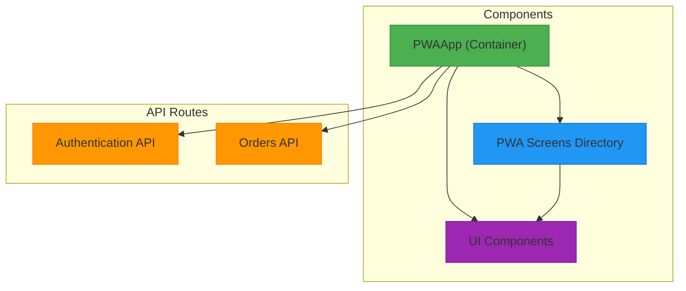
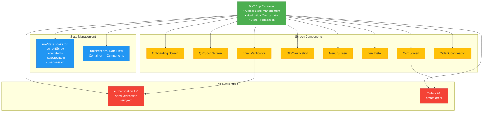
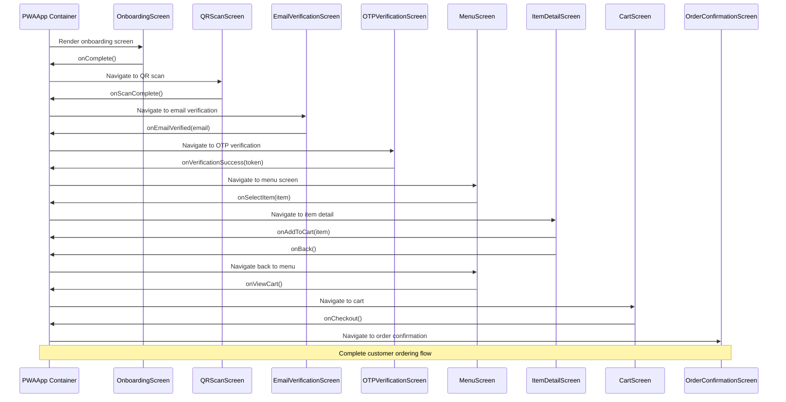
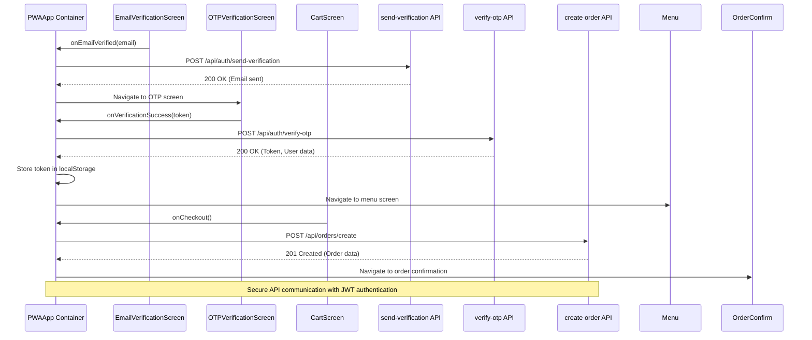

# PWA Frontend Architecture

<cite>
**Referenced Files in This Document**   
- [pwa-app.tsx](file://src/components/pwa-app.tsx)
- [menu-screen.tsx](file://src/components/pwa/menu-screen.tsx)
- [cart-screen.tsx](file://src/components/pwa/cart-screen.tsx)
- [email-verification-screen.tsx](file://src/components/pwa/email-verification-screen.tsx)
- [otp-verification-screen.tsx](file://src/components/pwa/otp-verification-screen.tsx)
- [item-detail-screen.tsx](file://src/components/pwa/item-detail-screen.tsx)
- [onboarding-screen.tsx](file://src/components/pwa/onboarding-screen.tsx)
- [qr-scan-screen.tsx](file://src/components/pwa/qr-scan-screen.tsx)
- [send-verification/route.ts](file://src/app/api/auth/send-verification/route.ts)
- [verify-otp/route.ts](file://src/app/api/auth/verify-otp/route.ts)
- [orders/create/route.ts](file://src/app/api/orders/create/route.ts)
- [use-mobile.ts](file://src/components/ui/use-mobile.ts)
</cite>

## Table of Contents
1. [Introduction](#introduction)
2. [Project Structure](#project-structure)
3. [Core Components](#core-components)
4. [Architecture Overview](#architecture-overview)
5. [Detailed Component Analysis](#detailed-component-analysis)
6. [Dependency Analysis](#dependency-analysis)
7. [Performance Considerations](#performance-considerations)
8. [Troubleshooting Guide](#troubleshooting-guide)
9. [Conclusion](#conclusion)

## Introduction
This document provides comprehensive architectural documentation for the PWA frontend architecture in MenuPRO-App-main. The PWAApp component serves as the central container managing global state (user session, cart, current screen) and orchestrating navigation between customer-facing screens. The architecture follows a unidirectional data flow pattern from the PWAApp container to presentational components via props, leveraging React hooks for state management. The system integrates with authentication APIs for user verification and order creation endpoints for transaction processing. The PWA experience is optimized for mobile-first interaction with responsive design principles and accessibility compliance through Radix UI primitives.

## Project Structure
The project follows a Next.js 14 App Router structure with a clear component organization. The PWA functionality is isolated within the components/pwa directory, containing all customer-facing screens. The architecture separates concerns between the container component (PWAApp) that manages global state and individual screen components that handle specific user interactions. API routes are organized under app/api with dedicated endpoints for authentication and order management. UI components are standardized through the components/ui directory using Radix UI primitives for consistent, accessible interfaces.



**Diagram sources**
- [pwa-app.tsx](file://src/components/pwa-app.tsx)
- [components/pwa](file://src/components/pwa)

**Section sources**
- [pwa-app.tsx](file://src/components/pwa-app.tsx)
- [app/api](file://src/app/api)

## Core Components
The PWA frontend architecture centers around the PWAApp container component that manages global state including user session, cart items, and current screen navigation. This component orchestrates the customer journey from onboarding through order confirmation using React's useState hook for state management. Presentational components receive data and callbacks as props, maintaining a clear separation between stateful logic and UI rendering. The architecture implements a unidirectional data flow where user interactions trigger state updates in the container, which then propagates changes to child components. Key data structures include MenuItem and CartItem interfaces that define the shape of menu and cart data throughout the application.

**Section sources**
- [pwa-app.tsx](file://src/components/pwa-app.tsx)
- [menu-screen.tsx](file://src/components/pwa/menu-screen.tsx)
- [cart-screen.tsx](file://src/components/pwa/cart-screen.tsx)

## Architecture Overview
The PWA frontend architecture follows a container-component pattern where PWAApp serves as the single source of truth for global state. The container manages authentication state, cart items, and screen navigation, passing down relevant data and callback functions to presentational components through props. This unidirectional data flow ensures predictable state changes and simplifies debugging. The architecture implements a progressive onboarding flow that guides users from QR scanning through email verification to menu browsing and order placement. Each screen transition is managed by the container component, which updates the currentScreen state and renders the appropriate component based on the user's journey stage.



**Diagram sources**
- [pwa-app.tsx](file://src/components/pwa-app.tsx)
- [app/api](file://src/app/api)

## Detailed Component Analysis
The PWA frontend architecture consists of multiple interconnected components that work together to deliver a seamless customer ordering experience. Each component has a specific responsibility within the user journey, from initial onboarding to final order confirmation. The container-component pattern ensures clear separation of concerns while maintaining centralized state management.

### PWAApp Container Analysis
The PWAApp component serves as the root container for the PWA experience, managing all global state and orchestrating navigation between screens. It uses React's useState hook to maintain state for the current screen, cart items, selected menu item, user email, authentication token, and order number. The component implements a renderScreen function that returns the appropriate screen component based on the currentScreen state, creating a single entry point for the entire PWA flow.

```mermaid
classDiagram
class PWAApp {
+currentScreen : Screen
+selectedItem : MenuItem | null
+cart : CartItem[]
+userEmail : string
+authToken : string
+orderNumber : string
+navigateToScreen(screen : Screen) : void
+selectItem(item : MenuItem) : void
+addToCart(item : CartItem) : void
+updateCartItem(itemId : string, quantity : number, selectedOptions? : any) : void
+clearCart() : void
+handleEmailVerified(email : string) : void
+handleOTPVerified(token : string) : void
+handleOrderCreated(orderId : string) : void
+renderScreen() : JSX.Element
}
class MenuItem {
+id : string
+name : string
+description : string
+price : number
+image : string
+category : 'appetizers' | 'mains' | 'desserts' | 'beverages'
+options? : {
size? : string[]
customizations? : string[]
}
}
class CartItem {
+id : string
+name : string
+description : string
+price : number
+image : string
+category : 'appetizers' | 'mains' | 'desserts' | 'beverages'
+quantity : number
+selectedOptions? : {
size? : string
customizations? : string[]
}
}
PWAApp --> MenuItem : "manages"
PWAApp --> CartItem : "manages"
PWAApp --> OnboardingScreen : "renders"
PWAApp --> QRScanScreen : "renders"
PWAApp --> EmailVerificationScreen : "renders"
PWAApp --> OTPVerificationScreen : "renders"
PWAApp --> MenuScreen : "renders"
PWAApp --> ItemDetailScreen : "renders"
PWAApp --> CartScreen : "renders"
PWAApp --> OrderConfirmationScreen : "renders"
```

**Diagram sources**
- [pwa-app.tsx](file://src/components/pwa-app.tsx)

**Section sources**
- [pwa-app.tsx](file://src/components/pwa-app.tsx)

### Navigation Flow Analysis
The PWA implements a sequential navigation flow that guides users through the ordering process. The flow begins with onboarding and QR scanning, followed by email and OTP verification for authentication, then proceeds to menu browsing, item selection, cart management, and order confirmation. Each step in the flow is managed by callback functions passed from the PWAApp container to child components, ensuring consistent state management throughout the user journey.



**Diagram sources**
- [pwa-app.tsx](file://src/components/pwa-app.tsx)
- [onboarding-screen.tsx](file://src/components/pwa/onboarding-screen.tsx)
- [qr-scan-screen.tsx](file://src/components/pwa/qr-scan-screen.tsx)
- [email-verification-screen.tsx](file://src/components/pwa/email-verification-screen.tsx)
- [otp-verification-screen.tsx](file://src/components/pwa/otp-verification-screen.tsx)
- [menu-screen.tsx](file://src/components/pwa/menu-screen.tsx)
- [item-detail-screen.tsx](file://src/components/pwa/item-detail-screen.tsx)
- [cart-screen.tsx](file://src/components/pwa/cart-screen.tsx)
- [order-confirmation-screen.tsx](file://src/components/pwa/order-confirmation-screen.tsx)

### State Management Analysis
The PWAApp component implements comprehensive state management for the entire customer journey. It maintains state for navigation (currentScreen), user authentication (userEmail, authToken), cart management (cart items), and order tracking (orderNumber). The state is updated through dedicated handler functions that encapsulate the business logic for each state transition, ensuring consistent and predictable state changes throughout the application.

```mermaid
flowchart TD
Start([PWAApp Initialization]) --> DefineState["Define State Variables"]
DefineState --> CurrentScreen["currentScreen: Screen"]
DefineState --> SelectedItem["selectedItem: MenuItem | null"]
DefineState --> Cart["cart: CartItem[]"]
DefineState --> Email["userEmail: string"]
DefineState --> Token["authToken: string"]
DefineState --> Order["orderNumber: string"]
DefineState --> DefineHandlers["Define State Handler Functions"]
DefineHandlers --> Navigate["navigateToScreen(screen)"]
DefineHandlers --> Select["selectItem(item)"]
DefineHandlers --> Add["addToCart(item)"]
DefineHandlers --> Update["updateCartItem(id, qty, options)"]
DefineHandlers --> Clear["clearCart()"]
DefineHandlers --> EmailVerify["handleEmailVerified(email)"]
DefineHandlers --> OTPVerify["handleOTPVerified(token)"]
DefineHandlers --> OrderCreate["handleOrderCreated(orderId)"]
DefineHandlers --> Render["renderScreen()"]
Render --> Switch["switch(currentScreen)"]
Switch --> OnboardingCase["case 'onboarding': OnboardingScreen"]
Switch --> QRScanCase["case 'qr-scan': QRScanScreen"]
Switch --> EmailCase["case 'email-verification': EmailVerificationScreen"]
Switch --> OTPCase["case 'otp-verification': OTPVerificationScreen"]
Switch --> MenuCase["case 'menu': MenuScreen"]
Switch --> ItemDetailCase["case 'item-detail': ItemDetailScreen"]
Switch --> CartCase["case 'cart': CartScreen"]
Switch --> OrderCase["case 'order-confirmation': OrderConfirmationScreen"]
OnboardingCase --> ReturnScreen["Return Screen Component"]
QRScanCase --> ReturnScreen
EmailCase --> ReturnScreen
OTPCase --> ReturnScreen
MenuCase --> ReturnScreen
ItemDetailCase --> ReturnScreen
CartCase --> ReturnScreen
OrderCase --> ReturnScreen
ReturnScreen --> End([Render Complete])
style Start fill:#4CAF50,stroke:#388E3C,color:white
style DefineState fill:#2196F3,stroke:#1976D2,color:white
style CurrentScreen fill:#FFC107,stroke:#FFA000
style SelectedItem fill:#FFC107,stroke:#FFA000
style Cart fill:#FFC107,stroke:#FFA000
style Email fill:#FFC107,stroke:#FFA000
style Token fill:#FFC107,stroke:#FFA000
style Order fill:#FFC107,stroke:#FFA000
style DefineHandlers fill:#2196F3,stroke:#1976D2,color:white
style Navigate fill:#FFC107,stroke:#FFA000
style Select fill:#FFC107,stroke:#FFA000
style Add fill:#FFC107,stroke:#FFA000
style Update fill:#FFC107,stroke:#FFA000
style Clear fill:#FFC107,stroke:#FFA000
style EmailVerify fill:#FFC107,stroke:#FFA000
style OTPVerify fill:#FFC107,stroke:#FFA000
style OrderCreate fill:#FFC107,stroke:#FFA000
style Render fill:#2196F3,stroke:#1976D2,color:white
style Switch fill:#FFC107,stroke:#FFA000
style OnboardingCase fill:#FFC107,stroke:#FFA000
style QRScanCase fill:#FFC107,stroke:#FFA000
style EmailCase fill:#FFC107,stroke:#FFA000
style OTPCase fill:#FFC107,stroke:#FFA000
style MenuCase fill:#FFC107,stroke:#FFA000
style ItemDetailCase fill:#FFC107,stroke:#FFA000
style CartCase fill:#FFC107,stroke:#FFA000
style OrderCase fill:#FFC107,stroke:#FFA000
style ReturnScreen fill:#FFC107,stroke:#FFA000
style End fill:#4CAF50,stroke:#388E3C,color:white
```



**Diagram sources**
- [pwa-app.tsx](file://src/components/pwa-app.tsx)

**Section sources**
- [pwa-app.tsx](file://src/components/pwa-app.tsx)

### API Integration Analysis
The PWA frontend integrates with backend APIs for user authentication and order creation. The authentication flow involves two endpoints: send-verification for initiating email verification and verify-otp for validating the one-time password. The order creation endpoint processes cart submissions and returns order confirmation data. These API calls are triggered by user actions and managed through the PWAApp container, which handles the response and updates the application state accordingly.



**Diagram sources**
- [pwa-app.tsx](file://src/components/pwa-app.tsx)
- [email-verification-screen.tsx](file://src/components/pwa/email-verification-screen.tsx)
- [otp-verification-screen.tsx](file://src/components/pwa/otp-verification-screen.tsx)
- [cart-screen.tsx](file://src/components/pwa/cart-screen.tsx)
- [send-verification/route.ts](file://src/app/api/auth/send-verification/route.ts)
- [verify-otp/route.ts](file://src/app/api/auth/verify-otp/route.ts)
- [orders/create/route.ts](file://src/app/api/orders/create/route.ts)

## Dependency Analysis
The PWA frontend architecture has a well-defined dependency structure with clear separation between components. The PWAApp container has direct dependencies on all screen components and API endpoints, serving as the central orchestrator. Screen components depend on UI primitives from the components/ui directory for consistent styling and accessibility. The architecture minimizes circular dependencies by following a unidirectional data flow pattern where parent components pass data and callbacks to children through props. External dependencies include Next.js for routing and server-side rendering, React for component management, Tailwind CSS for styling, and Radix UI for accessible UI components.

```mermaid
graph TD
PWAApp["PWAApp Container"]
subgraph "Screen Components"
Onboarding["OnboardingScreen"]
QRScan["QRScanScreen"]
EmailVerify["EmailVerificationScreen"]
OTPVerify["OTPVerificationScreen"]
Menu["MenuScreen"]
ItemDetail["ItemDetailScreen"]
Cart["CartScreen"]
OrderConfirm["OrderConfirmationScreen"]
end
subgraph "UI Components"
UI["components/ui"]
Figma["figma/ImageWithFallback"]
end
subgraph "API Endpoints"
AuthAPI["Authentication API"]
OrdersAPI["Orders API"]
end
subgraph "External Dependencies"
NextJS["Next.js"]
React["React"]
Tailwind["Tailwind CSS"]
Radix["Radix UI"]
Lucide["Lucide React"]
end
PWAApp --> Onboarding
PWAApp --> QRScan
PWAApp --> EmailVerify
PWAApp --> OTPVerify
PWAApp --> Menu
PWAApp --> ItemDetail
PWAApp --> Cart
PWAApp --> OrderConfirm
PWAApp --> AuthAPI
PWAApp --> OrdersAPI
Onboarding --> UI
QRScan --> UI
EmailVerify --> UI
OTPVerify --> UI
Menu --> UI
Menu --> Figma
ItemDetail --> UI
ItemDetail --> Figma
Cart --> UI
Cart --> Figma
OrderConfirm --> UI
PWAApp --> React
PWAApp --> NextJS
UI --> React
UI --> Radix
UI --> Tailwind
Figma --> NextJS
style PWAApp fill:#4CAF50,stroke:#388E3C,color:white
style Onboarding fill:#FFC107,stroke:#FFA000
style QRScan fill:#FFC107,stroke:#FFA000
style EmailVerify fill:#FFC107,stroke:#FFA000
style OTPVerify fill:#FFC107,stroke:#FFA000
style Menu fill:#FFC107,stroke:#FFA000
style ItemDetail fill:#FFC107,stroke:#FFA000
style Cart fill:#FFC107,stroke:#FFA000
style OrderConfirm fill:#FFC107,stroke:#FFA000
style UI fill:#9C27B0,stroke:#7B1FA2,color:white
style Figma fill:#9C27B0,stroke:#7B1FA2,color:white
style AuthAPI fill:#F44336,stroke:#D32F2F,color:white
style OrdersAPI fill:#F44336,stroke:#D32F2F,color:white
style NextJS fill:#1976D2,stroke:#0D47A1,color:white
style React fill:#61DAFB,stroke:#0D47A1,color:black
style Tailwind fill:#38B2AC,stroke:#0D7C78,color:white
style Radix fill:#000000,stroke:#333333,color:white
style Lucide fill:#000000,stroke:#333333,color:white
```



**Diagram sources**
- [pwa-app.tsx](file://src/components/pwa-app.tsx)
- [components/pwa](file://src/components/pwa)
- [components/ui](file://src/components/ui)
- [app/api](file://src/app/api)

**Section sources**
- [pwa-app.tsx](file://src/components/pwa-app.tsx)
- [package.json](file://package.json)

## Performance Considerations
The PWA frontend implements several performance optimizations to ensure a smooth user experience. The architecture leverages React's built-in optimization techniques including conditional rendering to avoid unnecessary component rendering and efficient state updates through useState. The cart calculation logic is optimized by memoizing the subtotal, discount, tax, and total calculations in the CartScreen component. The application uses Next.js image optimization through the Image component for efficient image loading. The mobile detection hook (useIsMobile) optimizes rendering for different device sizes. The PWA implementation includes service worker caching strategies for offline functionality and faster subsequent loads. The component structure minimizes re-renders by lifting state to the appropriate level and using callback functions to manage state transitions efficiently.

**Section sources**
- [cart-screen.tsx](file://src/components/pwa/cart-screen.tsx)
- [use-mobile.ts](file://src/components/ui/use-mobile.ts)
- [menu-screen.tsx](file://src/components/pwa/menu-screen.tsx)

## Troubleshooting Guide
Common issues in the PWA frontend architecture typically relate to state management, API integration, and component rendering. For authentication issues, verify that the environment variables for Gmail and JWT are properly configured. If screen transitions are not working, check that the callback functions are properly passed from PWAApp to child components. For cart functionality issues, ensure that the addToCart and updateCartItem functions correctly handle item uniqueness based on ID and selected options. API integration problems may require checking CORS configuration and authentication headers. Performance issues can often be addressed by implementing React.memo for components that receive stable props or by optimizing state updates to avoid unnecessary re-renders. Accessibility issues should be verified using browser developer tools and screen reader testing.

**Section sources**
- [pwa-app.tsx](file://src/components/pwa-app.tsx)
- [cart-screen.tsx](file://src/components/pwa/cart-screen.tsx)
- [email-verification-screen.tsx](file://src/components/pwa/email-verification-screen.tsx)
- [otp-verification-screen.tsx](file://src/components/pwa/otp-verification-screen.tsx)

## Conclusion
The PWA frontend architecture in MenuPRO-App-main implements a robust container-component pattern with PWAApp serving as the central state manager and navigation orchestrator. The architecture follows React best practices with unidirectional data flow, proper state management using hooks, and clear separation of concerns between container and presentational components. The system provides a seamless customer journey from onboarding through order confirmation with integrated authentication and order processing. The mobile-first design ensures optimal performance on handheld devices, while accessibility compliance through Radix UI primitives makes the application usable for all customers. The modular component structure allows for easy maintenance and future enhancements, making this a scalable solution for restaurant ordering systems.