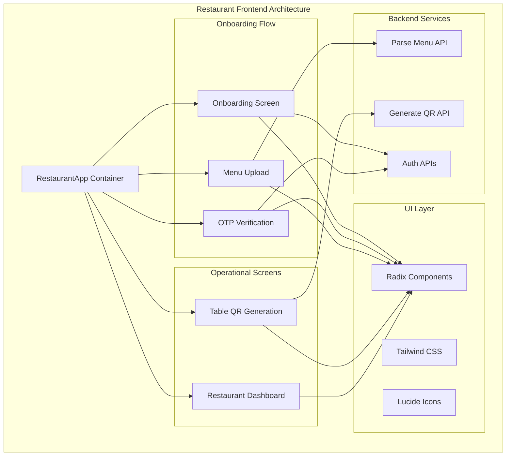
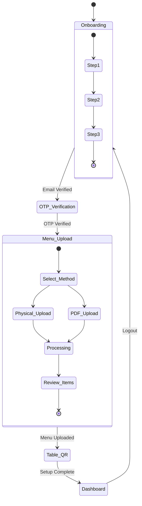
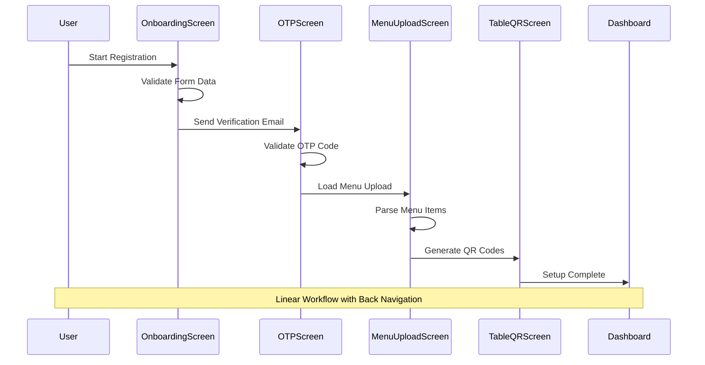
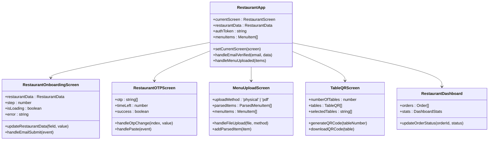
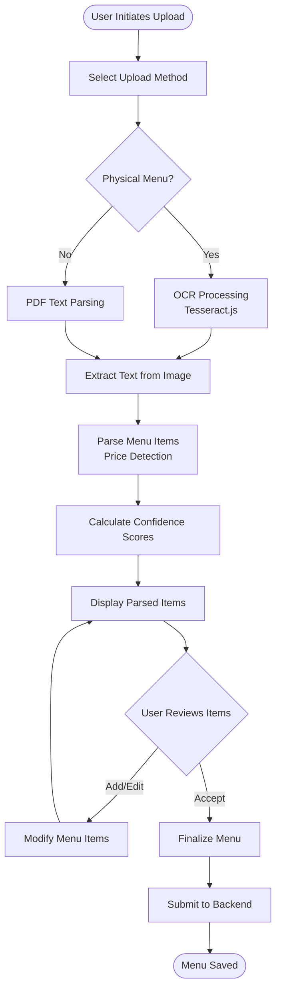

# Restaurant Frontend Architecture

<cite>
**Referenced Files in This Document**
- [src/components/restaurant/restaurant-app.tsx](file://src/components/restaurant/restaurant-app.tsx)
- [src/components/restaurant/menu-upload-screen.tsx](file://src/components/restaurant/menu-upload-screen.tsx)
- [src/components/restaurant/restaurant-onboarding-screen.tsx](file://src/components/restaurant/restaurant-onboarding-screen.tsx)
- [src/components/restaurant/restaurant-otp-screen.tsx](file://src/components/restaurant/restaurant-otp-screen.tsx)
- [src/components/restaurant/table-qr-screen.tsx](file://src/components/restaurant/table-qr-screen.tsx)
- [src/components/restaurant/restaurant-dashboard.tsx](file://src/components/restaurant/restaurant-dashboard.tsx)
- [src/app/api/restaurant/parse-menu/route.ts](file://src/app/api/restaurant/parse-menu/route.ts)
- [src/app/api/restaurant/generate-qr/route.ts](file://src/app/api/restaurant/generate-qr/route.ts)
- [src/components/ui/button.tsx](file://src/components/ui/button.tsx)
- [src/components/ui/utils.ts](file://src/components/ui/utils.ts)
- [src/app/layout.tsx](file://src/app/layout.tsx)
- [README.md](file://README.md)
</cite>

## Table of Contents
1. [Introduction](#introduction)
2. [Architecture Overview](#architecture-overview)
3. [Core Components](#core-components)
4. [State Management Pattern](#state-management-pattern)
5. [Navigation Flow](#navigation-flow)
6. [Component Hierarchy](#component-hierarchy)
7. [Data Flow Architecture](#data-flow-architecture)
8. [Backend Integration](#backend-integration)
9. [Responsive Design Implementation](#responsive-design-implementation)
10. [Accessibility Features](#accessibility-features)
11. [Error Handling](#error-handling)
12. [Performance Considerations](#performance-considerations)
13. [Conclusion](#conclusion)

## Introduction

MenuPRO-App-main is a modern restaurant menu management and ordering system built with Next.js 14, TypeScript, and Tailwind CSS. The application features a sophisticated restaurant frontend architecture centered around the `RestaurantApp` component, which serves as the primary container managing the complete onboarding and operational workflow for restaurant owners.

The frontend architecture emphasizes responsive design for tablet/desktop use, accessibility implementation via Radix UI, and seamless integration with backend services for menu parsing and QR code generation. The system employs React hooks for state management and follows a component-based architecture pattern.

## Architecture Overview

The restaurant frontend architecture follows a hierarchical component structure with centralized state management through React hooks. The main orchestrator is the `RestaurantApp` component, which manages navigation between different onboarding stages and maintains application-wide state.



**Diagram sources**
- [src/components/restaurant/restaurant-app.tsx](file://src/components/restaurant/restaurant-app.tsx#L1-L134)
- [src/components/restaurant/restaurant-onboarding-screen.tsx](file://src/components/restaurant/restaurant-onboarding-screen.tsx#L1-L489)
- [src/components/restaurant/restaurant-otp-screen.tsx](file://src/components/restaurant/restaurant-otp-screen.tsx#L1-L259)

## Core Components

### RestaurantApp - Central Orchestrator

The `RestaurantApp` component serves as the primary container and state manager for the entire restaurant workflow. It maintains the current screen state and coordinates navigation between different onboarding stages.

```typescript
export type RestaurantScreen = 'onboarding' | 'otp-verification' | 'menu-upload' | 'table-qr' | 'dashboard';

export interface RestaurantData {
  name: string;
  email: string;
  phone: string;
  address: string;
  city: string;
  state: string;
  zipCode: string;
  cuisine: string;
  description: string;
  operatingHours: {
    open: string;
    close: string;
  };
}

export interface MenuItem {
  id: string;
  name: string;
  description: string;
  price: number;
  category: string;
  image?: string;
  isAvailable: boolean;
}
```

The component uses React hooks to manage state across the entire application lifecycle:

- `currentScreen`: Tracks the active screen in the onboarding flow
- `restaurantData`: Stores restaurant registration information
- `authToken`: Manages authentication state
- `menuItems`: Maintains the parsed menu structure

**Section sources**
- [src/components/restaurant/restaurant-app.tsx](file://src/components/restaurant/restaurant-app.tsx#L1-L134)

### Onboarding Screen - Registration Flow

The `RestaurantOnboardingScreen` implements a multi-step registration process with progressive disclosure of form fields. It validates user input and manages the transition to OTP verification.

Key features include:
- Multi-step form validation with progressive field requirements
- Real-time email validation using regex patterns
- Operating hours configuration with time picker integration
- Cuisine type selection with comprehensive options
- Responsive form layout with Tailwind CSS grid system

**Section sources**
- [src/components/restaurant/restaurant-onboarding-screen.tsx](file://src/components/restaurant/restaurant-onboarding-screen.tsx#L1-L489)

### Menu Upload Screen - AI-Powered Processing

The `MenuUploadScreen` implements advanced AI-powered menu parsing capabilities using Tesseract.js for OCR and intelligent text parsing for PDF documents.

```typescript
interface ParsedMenuItem {
  name: string;
  price: number;
  description?: string;
  category?: string;
  confidence: number;
}
```

The screen supports two upload methods:
1. **Physical Menu Photos**: Uses Tesseract.js OCR to extract menu items
2. **PDF Documents**: Parses structured text to identify menu items

The system calculates confidence scores for each detected item and allows manual editing before final submission.

**Section sources**
- [src/components/restaurant/menu-upload-screen.tsx](file://src/components/restaurant/menu-upload-screen.tsx#L1-L447)

## State Management Pattern

The application employs a centralized state management pattern using React hooks, eliminating the need for external state management libraries. This approach provides several advantages:

### Hook-Based State Management



**Diagram sources**
- [src/components/restaurant/restaurant-app.tsx](file://src/components/restaurant/restaurant-app.tsx#L30-L60)

### State Persistence

The application implements localStorage-based persistence for authentication tokens and temporary data:

```typescript
const handleOTPVerified = (token: string) => {
  setAuthToken(token);
  localStorage.setItem('restaurantAuthToken', token);
  setCurrentScreen('menu-upload');
};
```

This ensures seamless user experience across browser sessions while maintaining security boundaries.

**Section sources**
- [src/components/restaurant/restaurant-app.tsx](file://src/components/restaurant/restaurant-app.tsx#L30-L50)

## Navigation Flow

The navigation system implements a linear progression through the restaurant onboarding workflow, with clear back navigation and error handling.



**Diagram sources**
- [src/components/restaurant/restaurant-app.tsx](file://src/components/restaurant/restaurant-app.tsx#L60-L100)

### Navigation Control Functions

Each screen component receives navigation callbacks that enable bidirectional navigation:

```typescript
// From RestaurantApp
const handleEmailVerified = (email: string, data: RestaurantData) => {
  setRestaurantData(data);
  setCurrentScreen('otp-verification');
};

const handleMenuUploaded = (items: MenuItem[]) => {
  setMenuItems(items);
  setCurrentScreen('table-qr');
};
```

**Section sources**
- [src/components/restaurant/restaurant-app.tsx](file://src/components/restaurant/restaurant-app.tsx#L30-L50)

## Component Hierarchy

The component architecture follows a hierarchical structure with clear separation of concerns:



**Diagram sources**
- [src/components/restaurant/restaurant-app.tsx](file://src/components/restaurant/restaurant-app.tsx#L1-L134)
- [src/components/restaurant/restaurant-onboarding-screen.tsx](file://src/components/restaurant/restaurant-onboarding-screen.tsx#L1-L50)
- [src/components/restaurant/menu-upload-screen.tsx](file://src/components/restaurant/menu-upload-screen.tsx#L1-L50)

## Data Flow Architecture

The data flow architecture implements a unidirectional data flow pattern with centralized state management and API integration points.

### Menu Upload Data Flow



**Diagram sources**
- [src/components/restaurant/menu-upload-screen.tsx](file://src/components/restaurant/menu-upload-screen.tsx#L50-L100)
- [src/app/api/restaurant/parse-menu/route.ts](file://src/app/api/restaurant/parse-menu/route.ts#L1-L50)

### QR Code Generation Flow

The QR code generation process integrates with the backend API to create table-specific QR codes:

```typescript
const generateQRCode = async (tableNumber: string): Promise<string> => {
  try {
    const response = await fetch('/api/restaurant/generate-qr', {
      method: 'POST',
      headers: { 'Content-Type': 'application/json' },
      body: JSON.stringify({
        restaurantId,
        tableNumber
      }),
    });

    if (response.ok) {
      const data = await response.json();
      return data.qrCode;
    }
  } catch (error) {
    console.error('Error generating QR code:', error);
    return '';
  }
};
```

**Section sources**
- [src/components/restaurant/table-qr-screen.tsx](file://src/components/restaurant/table-qr-screen.tsx#L30-L60)
- [src/app/api/restaurant/generate-qr/route.ts](file://src/app/api/restaurant/generate-qr/route.ts#L1-L50)

## Backend Integration

The frontend integrates with multiple backend services to provide comprehensive restaurant management capabilities:

### Parse Menu API

The `/api/restaurant/parse-menu` endpoint handles both PDF and image-based menu parsing:

```typescript
export async function POST(request: NextRequest) {
  const formData = await request.formData();
  const file = formData.get('file') as File;
  const method = formData.get('method') as string;

  if (method === 'pdf') {
    const buffer = await file.arrayBuffer();
    const pdfParse = (await import('pdf-parse')).default;
    const pdfData = await pdfParse(Buffer.from(buffer));
    extractedText = pdfData.text;
  } else if (method === 'physical') {
    const worker = await createWorker('eng');
    const buffer = await file.arrayBuffer();
    const { data: { text } } = await worker.recognize(Buffer.from(buffer));
    extractedText = text;
    await worker.terminate();
  }
}
```

### Generate QR API

The QR code generation service creates table-specific URLs with embedded parameters:

```typescript
export async function POST(request: NextRequest) {
  const { restaurantId, tableNumber } = await request.json();
  const baseUrl = process.env.NEXT_PUBLIC_BASE_URL || 'https://menupro.app';
  const orderUrl = `${baseUrl}/order?restaurant=${restaurantId}&table=${tableNumber}`;
  
  const qrCodeDataURL = await QRCode.toDataURL(orderUrl, {
    width: 200,
    margin: 2,
    color: { dark: '#000000', light: '#FFFFFF' }
  });
}
```

**Section sources**
- [src/app/api/restaurant/parse-menu/route.ts](file://src/app/api/restaurant/parse-menu/route.ts#L1-L50)
- [src/app/api/restaurant/generate-qr/route.ts](file://src/app/api/restaurant/generate-qr/route.ts#L1-L50)

## Responsive Design Implementation

The application implements a comprehensive responsive design system optimized for tablet and desktop usage:

### Layout Architecture

The layout system utilizes Tailwind CSS breakpoints and responsive utilities:

```typescript
// Responsive grid system
<div className="grid grid-cols-1 md:grid-cols-2 lg:grid-cols-3 xl:grid-cols-4 gap-6">

// Mobile-first responsive design
<Card className="border-none shadow-lg bg-white/80 backdrop-blur-sm">
  <CardContent className="p-8">
    {/* Responsive form layout */}
    <div className="space-y-6">
      <div className="grid grid-cols-3 gap-4">
        {/* Responsive input groups */}
      </div>
    </div>
  </CardContent>
</Card>
```

### Tablet/Desktop Optimization

The design adapts seamlessly across device sizes:
- **Mobile**: Single-column layouts with stacked form elements
- **Tablet**: Dual-column layouts with optimized spacing
- **Desktop**: Multi-column grids with expanded content areas

**Section sources**
- [src/components/restaurant/menu-upload-screen.tsx](file://src/components/restaurant/menu-upload-screen.tsx#L200-L250)
- [src/components/restaurant/table-qr-screen.tsx](file://src/components/restaurant/table-qr-screen.tsx#L150-L200)

## Accessibility Features

The application implements comprehensive accessibility features using Radix UI primitives:

### Radix UI Integration

```typescript
// Button component with Radix integration
function Button({
  className,
  variant,
  size,
  asChild = false,
  ...props
}: React.ComponentProps<"button"> &
  VariantProps<typeof buttonVariants> & {
    asChild?: boolean;
  }) {
  const Comp = asChild ? Slot : "button";
  
  return (
    <Comp
      data-slot="button"
      className={cn(buttonVariants({ variant, size, className }))}
      {...props}
    />
  );
}
```

### Accessibility Features

1. **Keyboard Navigation**: Full keyboard support for all interactive elements
2. **Screen Reader Support**: Proper ARIA labels and semantic HTML structure
3. **Focus Management**: Automatic focus handling for modals and forms
4. **High Contrast Support**: Color contrast compliance with WCAG guidelines
5. **Alternative Text**: Comprehensive alt text for all images and icons

**Section sources**
- [src/components/ui/button.tsx](file://src/components/ui/button.tsx#L1-L59)

## Error Handling

The application implements robust error handling across all user interactions:

### Form Validation and Error Display

```typescript
const validateEmail = (email: string) => {
  const emailRegex = /^[^\s@]+@[^\s@]+\.[^\s@]+$/;
  return emailRegex.test(email);
};

const handleEmailSubmit = async (e: React.FormEvent) => {
  e.preventDefault();
  
  if (!restaurantData.email.trim()) {
    setError("Please enter your email address");
    return;
  }

  if (!validateEmail(restaurantData.email)) {
    setError("Please enter a valid email address");
    return;
  }
};
```

### Network Error Handling

```typescript
try {
  const response = await fetch('/api/restaurant/parse-menu', {
    method: 'POST',
    body: formData,
  });

  if (response.ok) {
    const data = await response.json();
    setParsedItems(data.items || []);
  } else {
    const errorData = await response.json();
    setError(errorData.message || 'Failed to parse menu');
  }
} catch (error) {
  setError('Network error. Please try again.');
} finally {
  setIsUploading(false);
}
```

### Error States and User Feedback

The application provides clear error states with contextual messaging:
- **Validation Errors**: Inline form validation with immediate feedback
- **Network Errors**: Graceful degradation with retry mechanisms
- **Processing Errors**: Loading states with progress indicators
- **Success States**: Confirmation messages with appropriate styling

**Section sources**
- [src/components/restaurant/restaurant-onboarding-screen.tsx](file://src/components/restaurant/restaurant-onboarding-screen.tsx#L50-L100)
- [src/components/restaurant/menu-upload-screen.tsx](file://src/components/restaurant/menu-upload-screen.tsx#L60-L90)

## Performance Considerations

The application implements several performance optimization strategies:

### Lazy Loading and Code Splitting

- **Dynamic Imports**: Tesseract.js and PDF parsing libraries loaded on demand
- **Component Lazy Loading**: Screens loaded only when accessed
- **Image Optimization**: Next.js Image component with automatic optimization

### Memory Management

- **State Cleanup**: Proper cleanup of OCR workers and timers
- **Event Listener Management**: Automatic cleanup of event listeners
- **Memory Leak Prevention**: Careful management of asynchronous operations

### Caching Strategies

- **Local Storage**: Authentication tokens cached for session persistence
- **Image Caching**: QR codes cached locally for offline access
- **API Response Caching**: Strategic caching of frequently accessed data

## Conclusion

The MenuPRO restaurant frontend architecture demonstrates a sophisticated approach to building modern web applications with React, TypeScript, and Next.js. The system successfully combines:

1. **Centralized State Management**: Using React hooks for clean, predictable state updates
2. **Component-Based Architecture**: Modular design with clear separation of concerns
3. **Responsive Design**: Adaptive layouts optimized for all device sizes
4. **Accessibility Compliance**: Comprehensive accessibility features using Radix UI
5. **Backend Integration**: Seamless API integration with robust error handling
6. **Performance Optimization**: Strategic loading and caching strategies

The architecture effectively supports the complete restaurant onboarding workflow, from initial registration through menu management and QR code generation. The use of AI-powered menu parsing and QR code generation showcases the application's capability to leverage modern technologies for enhanced user experience.

This architecture provides a solid foundation for scaling and extending the application while maintaining code quality, user experience, and accessibility standards.